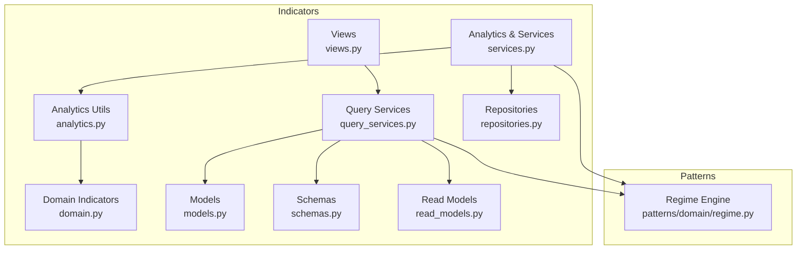
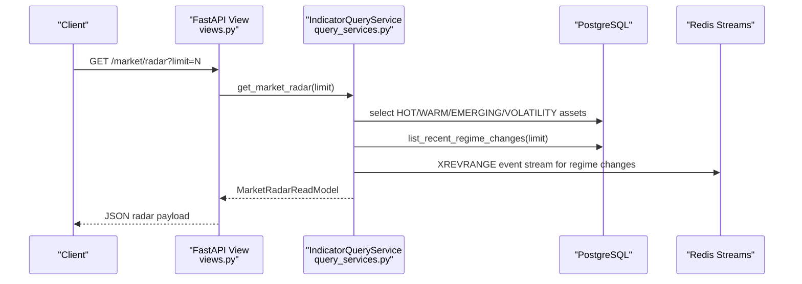
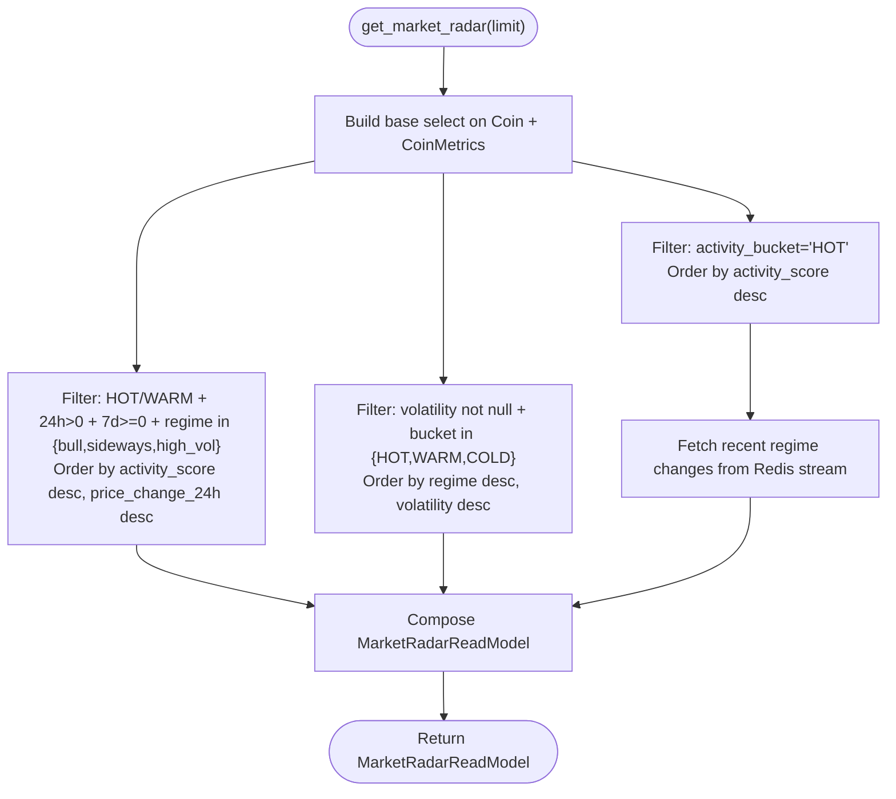
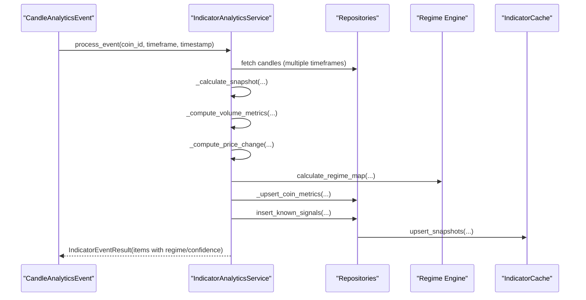
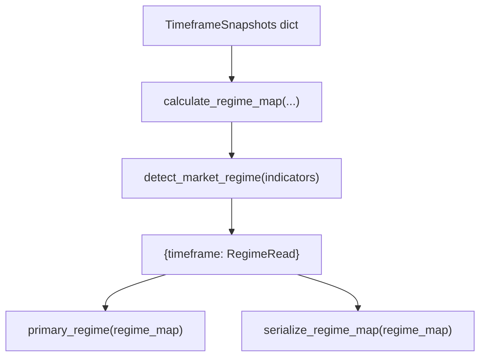
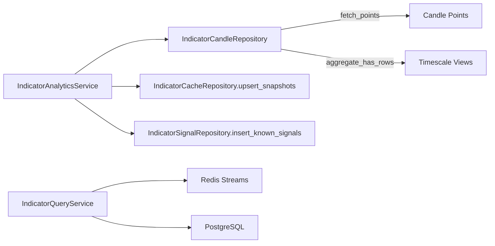
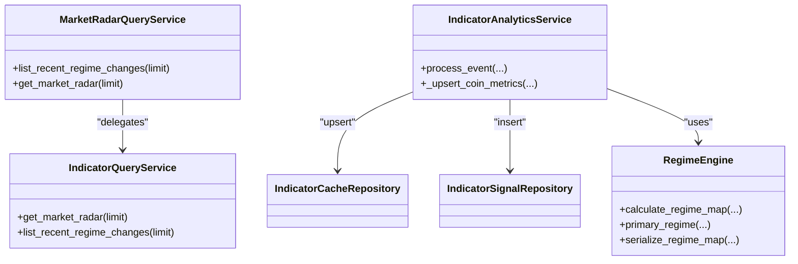

# Market Radar

<cite>
**Referenced Files in This Document**
- [market_radar.py](file://src/apps/indicators/market_radar.py)
- [services.py](file://src/apps/indicators/services.py)
- [analytics.py](file://src/apps/indicators/analytics.py)
- [domain.py](file://src/apps/indicators/domain.py)
- [models.py](file://src/apps/indicators/models.py)
- [schemas.py](file://src/apps/indicators/schemas.py)
- [read_models.py](file://src/apps/indicators/read_models.py)
- [query_services.py](file://src/apps/indicators/query_services.py)
- [views.py](file://src/apps/indicators/views.py)
- [repositories.py](file://src/apps/indicators/repositories.py)
- [regime.py](file://src/apps/patterns/domain/regime.py)
- [test_views.py](file://tests/apps/indicators/test_views.py)
</cite>

## Table of Contents
1. [Introduction](#introduction)
2. [Project Structure](#project-structure)
3. [Core Components](#core-components)
4. [Architecture Overview](#architecture-overview)
5. [Detailed Component Analysis](#detailed-component-analysis)
6. [Dependency Analysis](#dependency-analysis)
7. [Performance Considerations](#performance-considerations)
8. [Troubleshooting Guide](#troubleshooting-guide)
9. [Conclusion](#conclusion)
10. [Appendices](#appendices)

## Introduction
This document describes the Market Radar visualization and monitoring system. It explains how real-time market surveillance, asset screening, and condition monitoring are implemented, focusing on:
- Radar visualization components and grouping logic
- Asset ranking via activity scores, buckets, and analysis priority
- Market regime tracking across multiple timeframes
- Service implementations for data aggregation and real-time updates
- Configuration options, filters, and custom radar creation
- Practical usage examples for portfolio monitoring, sector analysis, and market timing

## Project Structure
The Market Radar feature spans several modules under the indicators subsystem:
- Views expose FastAPI endpoints for radar and flow queries
- Query services encapsulate database and stream reads
- Analytics and services compute metrics, trends, and regimes
- Repositories manage persistence and caching
- Domain utilities implement indicator computations
- Schemas and read models define typed outputs

**Diagram sources**
- [views.py:1-46](file://src/apps/indicators/views.py#L1-L46)
- [query_services.py:1-450](file://src/apps/indicators/query_services.py#L1-L450)
- [services.py:1-586](file://src/apps/indicators/services.py#L1-L586)
- [analytics.py:1-463](file://src/apps/indicators/analytics.py#L1-L463)
- [domain.py:1-205](file://src/apps/indicators/domain.py#L1-L205)
- [repositories.py:1-601](file://src/apps/indicators/repositories.py#L1-L601)
- [models.py:1-121](file://src/apps/indicators/models.py#L1-L121)
- [schemas.py:1-157](file://src/apps/indicators/schemas.py#L1-L157)
- [read_models.py:1-280](file://src/apps/indicators/read_models.py#L1-L280)
- [regime.py:1-142](file://src/apps/patterns/domain/regime.py#L1-L142)

**Section sources**
- [views.py:1-46](file://src/apps/indicators/views.py#L1-L46)
- [query_services.py:1-450](file://src/apps/indicators/query_services.py#L1-L450)
- [services.py:1-586](file://src/apps/indicators/services.py#L1-L586)
- [analytics.py:1-463](file://src/apps/indicators/analytics.py#L1-L463)
- [domain.py:1-205](file://src/apps/indicators/domain.py#L1-L205)
- [repositories.py:1-601](file://src/apps/indicators/repositories.py#L1-L601)
- [models.py:1-121](file://src/apps/indicators/models.py#L1-L121)
- [schemas.py:1-157](file://src/apps/indicators/schemas.py#L1-L157)
- [read_models.py:1-280](file://src/apps/indicators/read_models.py#L1-L280)
- [regime.py:1-142](file://src/apps/patterns/domain/regime.py#L1-L142)

## Core Components
- MarketRadarQueryService: orchestrates radar retrieval and recent regime change streaming
- IndicatorAnalyticsService: computes snapshots, metrics, signals, and caches feature states
- IndicatorReadService: exposes read APIs for radar and flow
- IndicatorQueryService: executes SQL queries and reads from Redis event streams
- Analytics utilities: compute time-series indicators, trends, regime detection, and signals
- Regime engine: calculates per-timeframe regimes and serializes confidence maps
- Models and schemas: define persisted metrics, feature snapshots, and API response shapes

Key capabilities:
- Real-time radar composition: hot assets, emerging assets, regime changes, volatility spikes
- Multi-timeframe regime tracking with confidence
- Activity-driven ranking and scheduling
- Streaming-based recent regime change detection

**Section sources**
- [market_radar.py:1-32](file://src/apps/indicators/market_radar.py#L1-L32)
- [services.py:178-431](file://src/apps/indicators/services.py#L178-L431)
- [query_services.py:321-381](file://src/apps/indicators/query_services.py#L321-L381)
- [analytics.py:106-356](file://src/apps/indicators/analytics.py#L106-L356)
- [regime.py:69-108](file://src/apps/patterns/domain/regime.py#L69-L108)

## Architecture Overview
Market Radar integrates:
- HTTP endpoints for radar and flow
- SQL-backed metrics and cached features
- Redis event streams for live regime change notifications
- Regime computation across multiple timeframes
- Signal detection and caching

**Diagram sources**
- [views.py:29-34](file://src/apps/indicators/views.py#L29-L34)
- [query_services.py:321-381](file://src/apps/indicators/query_services.py#L321-L381)
- [query_services.py:153-206](file://src/apps/indicators/query_services.py#L153-L206)

## Detailed Component Analysis

### Market Radar Query and Composition
MarketRadarQueryService delegates to IndicatorQueryService to assemble:
- Hot coins: assets in the "HOT" activity bucket
- Emerging coins: warm/hot assets with positive 24h and 7d changes and specific regimes
- Volatility spikes: assets ordered by regime and volatility
- Recent regime changes: deduplicated from Redis stream

**Diagram sources**
- [query_services.py:321-381](file://src/apps/indicators/query_services.py#L321-L381)
- [query_services.py:153-206](file://src/apps/indicators/query_services.py#L153-L206)

**Section sources**
- [market_radar.py:16-28](file://src/apps/indicators/market_radar.py#L16-L28)
- [query_services.py:321-381](file://src/apps/indicators/query_services.py#L321-L381)
- [schemas.py:137-143](file://src/apps/indicators/schemas.py#L137-L143)

### Analytics Pipeline and Ranking
IndicatorAnalyticsService performs:
- Determining affected timeframes around the incoming candle
- Computing snapshots across supported timeframes
- Deriving volume metrics, price changes, trend, trend score, activity fields, and regime map
- Upserting metrics and caching features
- Detecting classic signals and persisting them
- Building per-asset event items with regime and confidence

Ranking and scheduling:
- Activity score, bucket, and analysis priority derived from 24h change, volatility, volume change, and price
- Analysis scheduler decides whether to publish based on activity bucket and last analysis time

**Diagram sources**
- [services.py:189-339](file://src/apps/indicators/services.py#L189-L339)
- [analytics.py:117-220](file://src/apps/indicators/analytics.py#L117-L220)
- [analytics.py:237-259](file://src/apps/indicators/analytics.py#L237-L259)
- [analytics.py:290-324](file://src/apps/indicators/analytics.py#L290-L324)
- [regime.py:69-91](file://src/apps/patterns/domain/regime.py#L69-L91)
- [repositories.py:356-417](file://src/apps/indicators/repositories.py#L356-L417)

**Section sources**
- [services.py:178-431](file://src/apps/indicators/services.py#L178-L431)
- [analytics.py:106-356](file://src/apps/indicators/analytics.py#L106-L356)
- [repositories.py:310-417](file://src/apps/indicators/repositories.py#L310-L417)
- [regime.py:69-108](file://src/apps/patterns/domain/regime.py#L69-L108)

### Regime Tracking Across Timeframes
Regime detection:
- Per-timeframe indicators (price, EMAs, ADX, BB width, ATR) feed detect_market_regime
- calculate_regime_map builds a map keyed by timeframe with regime and confidence
- primary_regime selects a dominant regime across standard timeframes
- serialize_regime_map stores structured regime details for downstream consumption

**Diagram sources**
- [regime.py:69-108](file://src/apps/patterns/domain/regime.py#L69-L108)
- [analytics.py:251-255](file://src/apps/indicators/analytics.py#L251-L255)

**Section sources**
- [regime.py:1-142](file://src/apps/patterns/domain/regime.py#L1-L142)
- [analytics.py:251-255](file://src/apps/indicators/analytics.py#L251-L255)

### Data Aggregation and Real-Time Updates
- Candle data is fetched from direct candles, continuous aggregates, or resampled sources depending on availability and base timeframe
- Continuous aggregates are refreshed for affected timeframes around the event timestamp
- Feature snapshots are cached with conflict resolution
- Signals are detected and inserted with conflict avoidance
- Recent regime changes are streamed via Redis and deduplicated by coin/timeframe/regime

**Diagram sources**
- [repositories.py:93-308](file://src/apps/indicators/repositories.py#L93-L308)
- [repositories.py:352-417](file://src/apps/indicators/repositories.py#L352-L417)
- [repositories.py:420-455](file://src/apps/indicators/repositories.py#L420-L455)
- [query_services.py:153-206](file://src/apps/indicators/query_services.py#L153-L206)

**Section sources**
- [repositories.py:93-308](file://src/apps/indicators/repositories.py#L93-L308)
- [repositories.py:352-417](file://src/apps/indicators/repositories.py#L352-L417)
- [repositories.py:420-455](file://src/apps/indicators/repositories.py#L420-L455)
- [query_services.py:153-206](file://src/apps/indicators/query_services.py#L153-L206)

### API Exposure and Filtering
Endpoints:
- GET /market/radar: returns MarketRadarRead with configurable limit (1–24)
- GET /market/flow: returns MarketFlowRead with limit (1–24) and timeframe (15–1440)

Filters and configuration:
- limit controls result cardinality
- timeframe controls sector metrics and flow relations
- internal filters in radar query enforce bucket membership, price change thresholds, and regime categories

**Section sources**
- [views.py:29-45](file://src/apps/indicators/views.py#L29-L45)
- [query_services.py:321-381](file://src/apps/indicators/query_services.py#L321-L381)

### Practical Usage Examples
- Portfolio monitoring: use radar hot and emerging lists to identify top movers and potential setups
- Sector analysis: combine leaders and sector metrics to track rotation and strength
- Market timing: monitor recent regime changes and volatility spikes to adjust positioning

Validation via tests demonstrates:
- Radar endpoint returns hot coins and regime changes
- Flow endpoint returns leaders, relations, sectors, and rotations

**Section sources**
- [test_views.py:35-55](file://tests/apps/indicators/test_views.py#L35-L55)

## Dependency Analysis
The radar feature depends on:
- SQL models for metrics and cached features
- Redis for recent regime change events
- Regime engine for multi-timeframe regime inference
- Indicator analytics for computed features and signals

**Diagram sources**
- [market_radar.py:16-28](file://src/apps/indicators/market_radar.py#L16-L28)
- [query_services.py:321-381](file://src/apps/indicators/query_services.py#L321-L381)
- [services.py:189-339](file://src/apps/indicators/services.py#L189-L339)
- [repositories.py:352-417](file://src/apps/indicators/repositories.py#L352-L417)
- [repositories.py:420-455](file://src/apps/indicators/repositories.py#L420-L455)
- [regime.py:69-108](file://src/apps/patterns/domain/regime.py#L69-L108)

**Section sources**
- [market_radar.py:1-32](file://src/apps/indicators/market_radar.py#L1-L32)
- [query_services.py:1-450](file://src/apps/indicators/query_services.py#L1-L450)
- [services.py:1-586](file://src/apps/indicators/services.py#L1-L586)
- [repositories.py:1-601](file://src/apps/indicators/repositories.py#L1-L601)
- [regime.py:1-142](file://src/apps/patterns/domain/regime.py#L1-L142)

## Performance Considerations
- Efficient SQL projections and indexes on metrics enable fast radar composition
- Redis stream reads are bounded by counts and filtered by event type
- Continuous aggregate refresh is scoped to affected timeframes around event timestamps
- Conflict-free upserts minimize write contention for cached features and signals
- Trend and regime computations leverage precomputed series and thresholds

[No sources needed since this section provides general guidance]

## Troubleshooting Guide
Common issues and checks:
- Empty radar results: verify coin enablement and presence of metrics; confirm activity buckets and filters
- Missing regime changes: ensure Redis stream connectivity and event publishing; check deduplication keys
- Slow queries: review indexes on metrics and query limits; consider reducing limit or timeframe
- Missing candles: confirm direct candles, aggregate views, or resampling availability for target timeframe

Operational diagnostics:
- Inspect logs emitted by query services and repositories
- Validate feature flag enabling regime engine
- Confirm scheduler decisions for analysis requests

**Section sources**
- [query_services.py:63-111](file://src/apps/indicators/query_services.py#L63-L111)
- [query_services.py:153-206](file://src/apps/indicators/query_services.py#L153-L206)
- [repositories.py:93-170](file://src/apps/indicators/repositories.py#L93-L170)
- [services.py:529-571](file://src/apps/indicators/services.py#L529-L571)

## Conclusion
Market Radar delivers a real-time, multi-dimensional view of market conditions by combining:
- Activity-driven asset ranking
- Multi-timeframe regime tracking
- Recent regime change streaming
- Cached feature snapshots and classic signals

Its modular design supports customization via limit parameters, timeframe selection, and internal filters, enabling tailored surveillance for portfolios, sectors, and timing decisions.

## Appendices

### API Definitions
- GET /market/radar
  - Query: limit (1–24)
  - Response: MarketRadarRead with hot_coins, emerging_coins, regime_changes, volatility_spikes

- GET /market/flow
  - Query: limit (1–24), timeframe (15–1440)
  - Response: MarketFlowRead with leaders, relations, sectors, rotations

**Section sources**
- [views.py:29-45](file://src/apps/indicators/views.py#L29-L45)
- [schemas.py:137-143](file://src/apps/indicators/schemas.py#L137-L143)