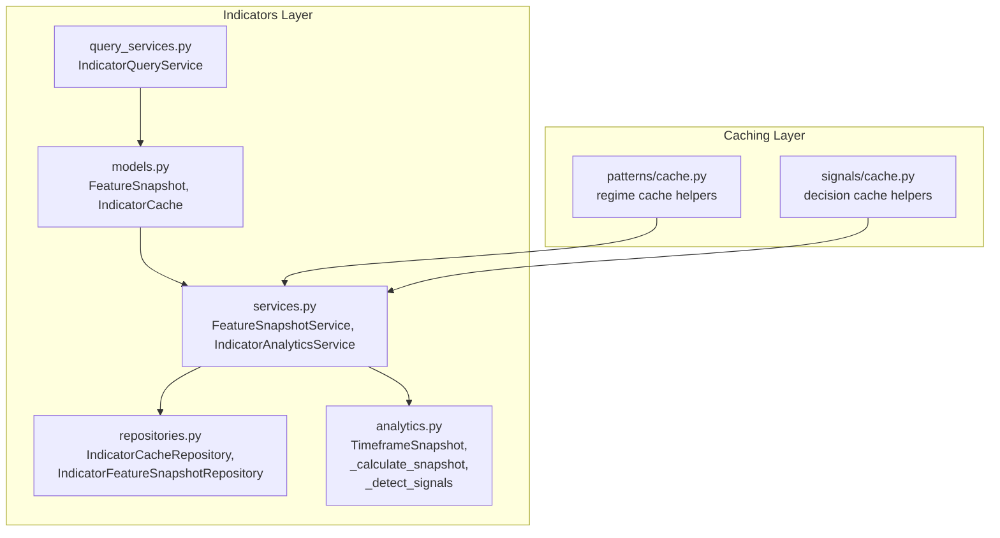
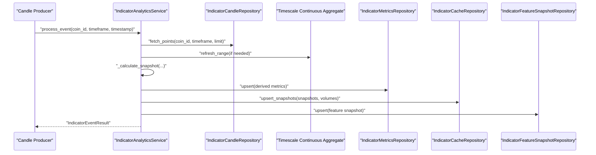
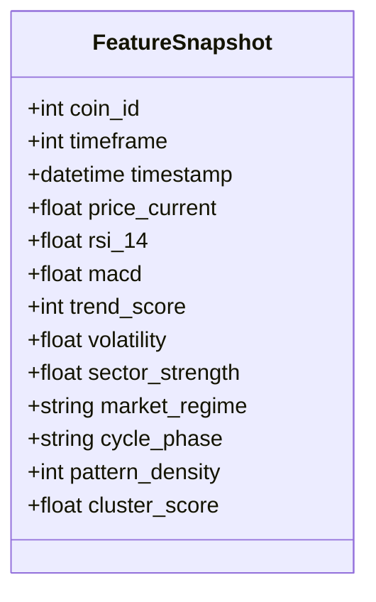
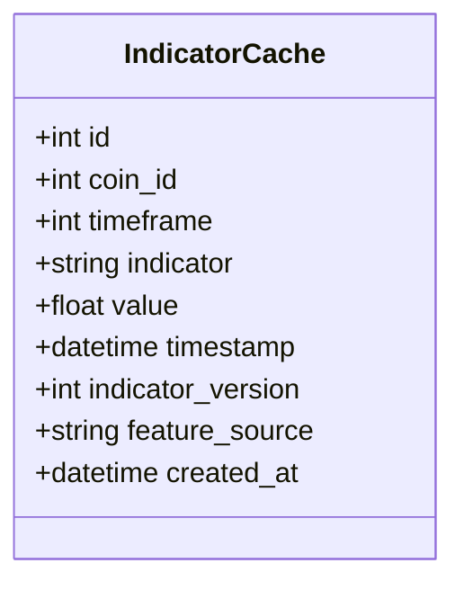
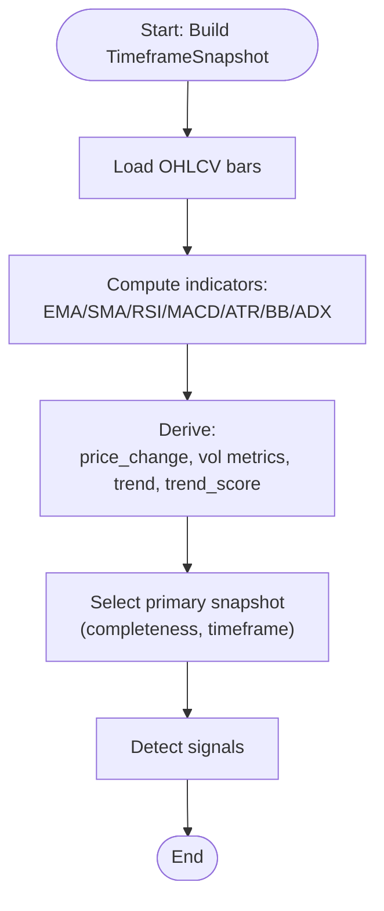
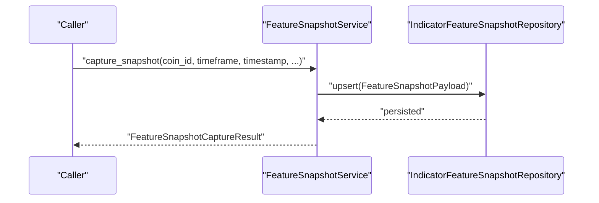
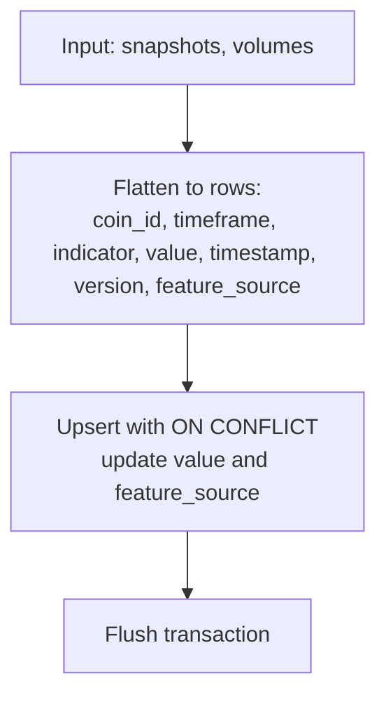
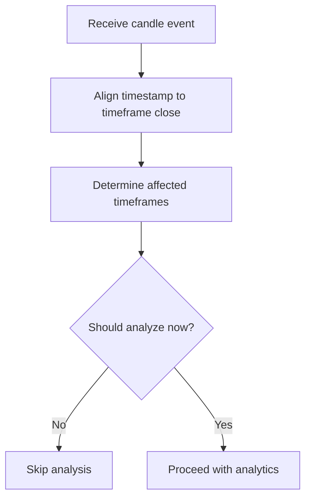
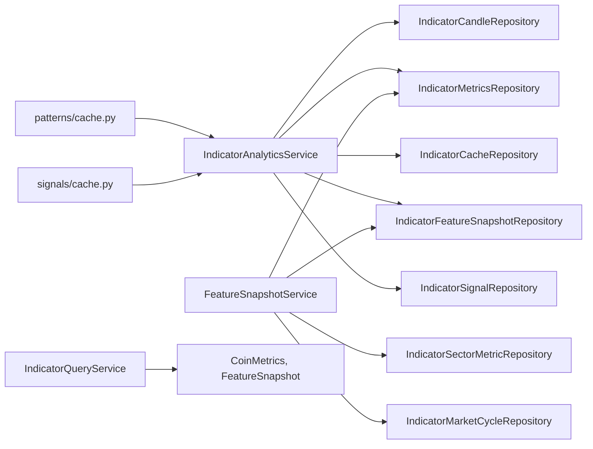

# Snapshots and Caching

<cite>
**Referenced Files in This Document**
- [models.py](file://src/apps/indicators/models.py)
- [snapshots.py](file://src/apps/indicators/snapshots.py)
- [services.py](file://src/apps/indicators/services.py)
- [repositories.py](file://src/apps/indicators/repositories.py)
- [analytics.py](file://src/apps/indicators/analytics.py)
- [query_services.py](file://src/apps/indicators/query_services.py)
- [cache.py](file://src/apps/patterns/cache.py)
- [signals_cache.py](file://src/apps/signals/cache.py)
</cite>

## Table of Contents
1. [Introduction](#introduction)
2. [Project Structure](#project-structure)
3. [Core Components](#core-components)
4. [Architecture Overview](#architecture-overview)
5. [Detailed Component Analysis](#detailed-component-analysis)
6. [Dependency Analysis](#dependency-analysis)
7. [Performance Considerations](#performance-considerations)
8. [Troubleshooting Guide](#troubleshooting-guide)
9. [Conclusion](#conclusion)
10. [Appendices](#appendices)

## Introduction
This document explains the snapshots and caching system for market condition monitoring and analytics. It covers:
- The FeatureSnapshot model for capturing feature-based market condition snapshots
- IndicatorCache for persisting computed indicator values per timeframe and timestamp
- Data persistence strategies and snapshot generation algorithms
- Temporal data handling and cache invalidation policies
- Caching hierarchies and performance optimizations
- Snapshot scheduling, historical retrieval, and cache warming strategies
- Practical usage examples in backtesting, performance analysis, and market condition comparison

## Project Structure
The snapshots and caching system spans several modules under the indicators subsystem and integrates with cross-cutting caches for regime and decisions.

**Diagram sources**
- [models.py:65-118](file://src/apps/indicators/models.py#L65-L118)
- [services.py:433-526](file://src/apps/indicators/services.py#L433-L526)
- [repositories.py:352-552](file://src/apps/indicators/repositories.py#L352-L552)
- [analytics.py:69-219](file://src/apps/indicators/analytics.py#L69-L219)
- [query_services.py:59-446](file://src/apps/indicators/query_services.py#L59-L446)
- [cache.py:14-125](file://src/apps/patterns/cache.py#L14-L125)
- [signals_cache.py:16-191](file://src/apps/signals/cache.py#L16-L191)

**Section sources**
- [models.py:65-118](file://src/apps/indicators/models.py#L65-L118)
- [services.py:433-526](file://src/apps/indicators/services.py#L433-L526)
- [repositories.py:352-552](file://src/apps/indicators/repositories.py#L352-L552)
- [analytics.py:69-219](file://src/apps/indicators/analytics.py#L69-L219)
- [query_services.py:59-446](file://src/apps/indicators/query_services.py#L59-L446)
- [cache.py:14-125](file://src/apps/patterns/cache.py#L14-L125)
- [signals_cache.py:16-191](file://src/apps/signals/cache.py#L16-L191)

## Core Components
- FeatureSnapshot: A compact, denormalized snapshot of selected indicators and derived features keyed by coin, timeframe, and timestamp. It supports fast reads and comparisons across timeframes.
- IndicatorCache: A normalized cache of individual indicator values per coin, timeframe, timestamp, and indicator name, enabling efficient recomputation and historical queries.
- FeatureSnapshotService: Captures feature snapshots by combining metrics, sector strength, market cycle phase, pattern density, and cluster scores.
- IndicatorAnalyticsService: Orchestrates snapshot generation, computes derived metrics, persists snapshots, and emits signals.
- IndicatorCacheRepository: Upserts indicator values into the cache with conflict resolution and versioning.
- IndicatorQueryService: Provides read-side projections and streaming-based recent events for downstream dashboards and analytics.

**Section sources**
- [models.py:65-118](file://src/apps/indicators/models.py#L65-L118)
- [services.py:433-526](file://src/apps/indicators/services.py#L433-L526)
- [repositories.py:352-552](file://src/apps/indicators/repositories.py#L352-L552)
- [query_services.py:59-446](file://src/apps/indicators/query_services.py#L59-L446)

## Architecture Overview
The system follows a pipeline:
- On candle updates, IndicatorAnalyticsService builds TimeframeSnapshot instances per supported timeframe
- Derived metrics and signals are computed and persisted via repositories
- FeatureSnapshot captures a consolidated view for backtesting and comparison
- IndicatorCache stores individual indicator values for fast retrieval and reprocessing
- Query services expose read models and recent events; patterns/signals caches provide short-term regime/decision snapshots

**Diagram sources**
- [services.py:189-339](file://src/apps/indicators/services.py#L189-L339)
- [repositories.py:93-308](file://src/apps/indicators/repositories.py#L93-L308)
- [repositories.py:352-417](file://src/apps/indicators/repositories.py#L352-L417)
- [repositories.py:508-552](file://src/apps/indicators/repositories.py#L508-L552)

## Detailed Component Analysis

### FeatureSnapshot Model
FeatureSnapshot captures a concise set of features for a given coin/timeframe/timestamp. It includes price, RSI, MACD, trend score, volatility, sector strength, market regime, cycle phase, pattern density, and cluster score. The model is optimized for fast reads and joins across timeframes.

**Diagram sources**
- [models.py:65-85](file://src/apps/indicators/models.py#L65-L85)

**Section sources**
- [models.py:65-85](file://src/apps/indicators/models.py#L65-L85)

### IndicatorCache Model
IndicatorCache stores individual indicator values with a composite primary key including indicator name and version. It enables:
- Efficient historical lookups per indicator
- Version-aware updates via conflict resolution
- Fast recomputation and backtesting workflows

**Diagram sources**
- [models.py:88-117](file://src/apps/indicators/models.py#L88-L117)

**Section sources**
- [models.py:88-117](file://src/apps/indicators/models.py#L88-L117)
- [repositories.py:352-417](file://src/apps/indicators/repositories.py#L352-L417)

### Snapshot Generation Algorithms
- TimeframeSnapshot construction aggregates OHLCV series to compute EMA, SMA, RSI, MACD, ATR, Bollinger Bands, ADX, and related derived values.
- Primary snapshot selection prioritizes completeness and timeframe granularity.
- Trend, trend score, activity fields, and market regime are derived from the primary snapshot and supporting metrics.
- Signals are detected based on crossovers, breakouts, histogram reversals, volume spikes, and RSI thresholds.

**Diagram sources**
- [analytics.py:135-219](file://src/apps/indicators/analytics.py#L135-L219)
- [analytics.py:281-324](file://src/apps/indicators/analytics.py#L281-L324)
- [analytics.py:394-429](file://src/apps/indicators/analytics.py#L394-L429)

**Section sources**
- [analytics.py:135-219](file://src/apps/indicators/analytics.py#L135-L219)
- [analytics.py:281-324](file://src/apps/indicators/analytics.py#L281-L324)
- [analytics.py:394-429](file://src/apps/indicators/analytics.py#L394-L429)

### FeatureSnapshot Capture Workflow
FeatureSnapshotService consolidates:
- Metrics (trend score, volatility)
- Sector strength
- Market cycle phase
- Pattern density and cluster score from signals
- Market regime details from metrics or regime map

It persists the consolidated snapshot and returns a FeatureSnapshotCaptureResult.

**Diagram sources**
- [services.py:443-526](file://src/apps/indicators/services.py#L443-L526)
- [repositories.py:508-552](file://src/apps/indicators/repositories.py#L508-L552)

**Section sources**
- [services.py:443-526](file://src/apps/indicators/services.py#L443-L526)
- [repositories.py:508-552](file://src/apps/indicators/repositories.py#L508-L552)

### IndicatorCache Upsert and Versioning
IndicatorCacheRepository transforms TimeframeSnapshot instances into per-indicator rows and upserts them with conflict resolution on the composite key (coin_id, timeframe, indicator, timestamp, indicator_version). This ensures deterministic updates and supports versioned indicator computations.

**Diagram sources**
- [repositories.py:356-417](file://src/apps/indicators/repositories.py#L356-L417)

**Section sources**
- [repositories.py:356-417](file://src/apps/indicators/repositories.py#L356-L417)

### Temporal Data Handling and Scheduling
- Timestamp normalization ensures UTC consistency across the system.
- Affected timeframes are determined based on the close timestamp alignment, propagating updates to higher timeframes when applicable.
- AnalysisSchedulerService evaluates whether to trigger analysis based on activity buckets and last analysis timestamps.

**Diagram sources**
- [analytics.py:117-126](file://src/apps/indicators/analytics.py#L117-L126)
- [services.py:529-571](file://src/apps/indicators/services.py#L529-L571)

**Section sources**
- [analytics.py:117-126](file://src/apps/indicators/analytics.py#L117-L126)
- [services.py:529-571](file://src/apps/indicators/services.py#L529-L571)

### Cache Invalidation Policies
- IndicatorCache uses upsert with conflict update; stale values are overwritten by newer indicator_version or timestamp.
- FeatureSnapshot uses upsert keyed by coin_id, timeframe, timestamp; updates replace prior entries.
- Patterns/signals caches use TTL-based keys; explicit invalidation is achieved by TTL expiry or cache-clear hooks.

**Section sources**
- [repositories.py:409-417](file://src/apps/indicators/repositories.py#L409-L417)
- [repositories.py:536-550](file://src/apps/indicators/repositories.py#L536-L550)
- [cache.py:14-125](file://src/apps/patterns/cache.py#L14-L125)
- [signals_cache.py:16-191](file://src/apps/signals/cache.py#L16-L191)

### Caching Hierarchies and Performance Optimizations
- Read models and projections minimize round-trips for dashboards and radar views.
- Streaming-based recent events (regime changes, leaders, rotations) reduce database load for real-time displays.
- LRU and per-event-loop Redis clients optimize latency for regime and decision caches.
- Composite indexes on snapshots and cache tables accelerate lookups by coin, timeframe, and timestamp.

**Section sources**
- [query_services.py:59-446](file://src/apps/indicators/query_services.py#L59-L446)
- [cache.py:14-125](file://src/apps/patterns/cache.py#L14-L125)
- [signals_cache.py:16-191](file://src/apps/signals/cache.py#L16-L191)
- [models.py:67-69](file://src/apps/indicators/models.py#L67-L69)
- [models.py:90-101](file://src/apps/indicators/models.py#L90-L101)

### Snapshot Scheduling, Historical Retrieval, and Cache Warming
- Scheduling: AnalysisSchedulerService decides when to run analysis based on activity bucket and last analysis timestamp.
- Historical retrieval: IndicatorCandleRepository supports direct candles, aggregate views, and resampling to derive historical series.
- Cache warming: IndicatorCacheRepository precomputes and persists indicator values for multiple timeframes, enabling warm caches for backtesting and comparative analysis.

**Section sources**
- [services.py:529-571](file://src/apps/indicators/services.py#L529-L571)
- [repositories.py:93-308](file://src/apps/indicators/repositories.py#L93-L308)
- [repositories.py:352-417](file://src/apps/indicators/repositories.py#L352-L417)

### Examples: Backtesting, Performance Analysis, Market Comparison
- Backtesting: Use IndicatorCache to reconstruct indicator series per coin/timeframe and replay trading logic against historical values.
- Performance analysis: FeatureSnapshot enables multi-timeframe comparisons and pattern density/cluster score analysis for performance attribution.
- Market condition comparison: FeatureSnapshot and CoinMetrics projections support heatmaps and regime comparisons across assets and sectors.

[No sources needed since this section provides usage guidance without quoting specific files]

## Dependency Analysis
The following diagram highlights key dependencies among components involved in snapshots and caching.

**Diagram sources**
- [services.py:178-526](file://src/apps/indicators/services.py#L178-L526)
- [repositories.py:93-552](file://src/apps/indicators/repositories.py#L93-L552)
- [query_services.py:59-446](file://src/apps/indicators/query_services.py#L59-L446)
- [cache.py:14-125](file://src/apps/patterns/cache.py#L14-L125)
- [signals_cache.py:16-191](file://src/apps/signals/cache.py#L16-L191)

**Section sources**
- [services.py:178-526](file://src/apps/indicators/services.py#L178-L526)
- [repositories.py:93-552](file://src/apps/indicators/repositories.py#L93-L552)
- [query_services.py:59-446](file://src/apps/indicators/query_services.py#L59-L446)
- [cache.py:14-125](file://src/apps/patterns/cache.py#L14-L125)
- [signals_cache.py:16-191](file://src/apps/signals/cache.py#L16-L191)

## Performance Considerations
- Prefer normalized IndicatorCache for indicator-level queries and denormalized FeatureSnapshot for multi-feature comparisons.
- Use composite indexes on coin_id/timeframe/timestamp to speed up lookups.
- Batch upserts for cache rows to reduce transaction overhead.
- Apply TTL-based caches for short-lived regime/decision snapshots to avoid long-term persistence costs.
- Warm caches during off-hours with historical runs to minimize cold-start latency.

[No sources needed since this section provides general guidance]

## Troubleshooting Guide
- Missing snapshots: Verify that IndicatorAnalyticsService successfully fetched candles and refreshed aggregates; confirm that affected timeframes include the target timeframe.
- Stale indicator values: Ensure indicator_version is bumped when indicator logic changes; confirm upsert conflict resolution is applied.
- FeatureSnapshot not updating: Check that FeatureSnapshotService receives non-deleted coins and that upsert is executed with correct keys.
- Cache misses: Confirm Redis clients are initialized per event loop and TTL settings are appropriate; validate cache key composition.

**Section sources**
- [services.py:189-339](file://src/apps/indicators/services.py#L189-L339)
- [repositories.py:352-417](file://src/apps/indicators/repositories.py#L352-L417)
- [repositories.py:508-552](file://src/apps/indicators/repositories.py#L508-L552)
- [cache.py:28-51](file://src/apps/patterns/cache.py#L28-L51)
- [signals_cache.py:41-58](file://src/apps/signals/cache.py#L41-L58)

## Conclusion
The snapshots and caching system combines denormalized FeatureSnapshot for fast analytics and normalized IndicatorCache for precise indicator-level queries. Through robust scheduling, temporal alignment, and version-aware persistence, it supports reliable backtesting, performance analysis, and market condition comparisons while maintaining strong operational performance.

[No sources needed since this section summarizes without analyzing specific files]

## Appendices

### Appendix A: FeatureSnapshot and IndicatorCache Schema Highlights
- FeatureSnapshot: coin_id, timeframe, timestamp (PK), plus feature fields; indexed by coin/timeframe/timestamp.
- IndicatorCache: coin_id, timeframe, indicator, timestamp, indicator_version (PK); indexed for fast lookups.

**Section sources**
- [models.py:65-85](file://src/apps/indicators/models.py#L65-L85)
- [models.py:88-117](file://src/apps/indicators/models.py#L88-L117)

### Appendix B: Exported Names for Consumers
- snapshots.py exports FeatureSnapshotCaptureResult and FeatureSnapshotService for external consumers.

**Section sources**
- [snapshots.py:1-9](file://src/apps/indicators/snapshots.py#L1-L9)