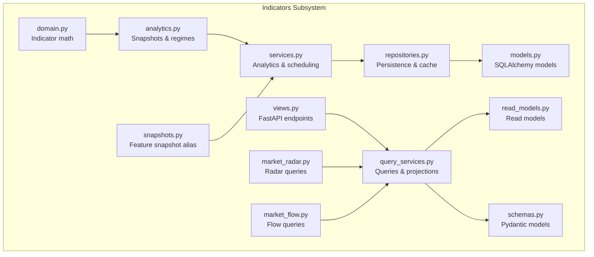
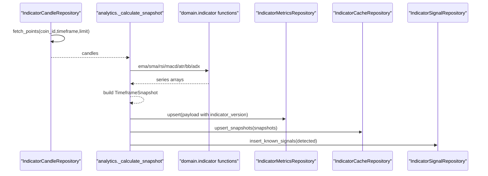
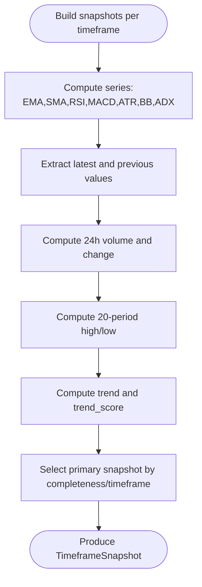
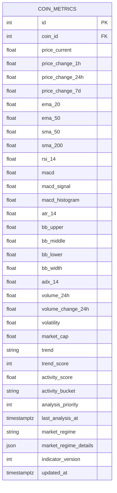
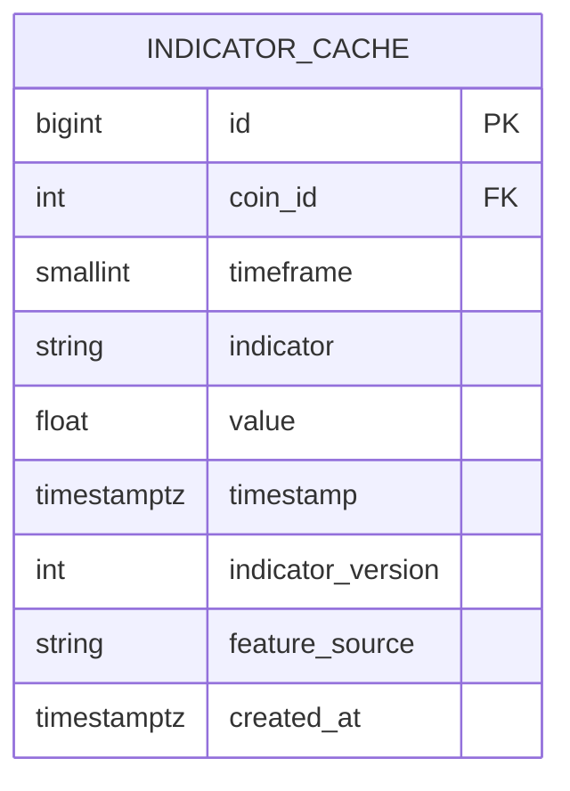
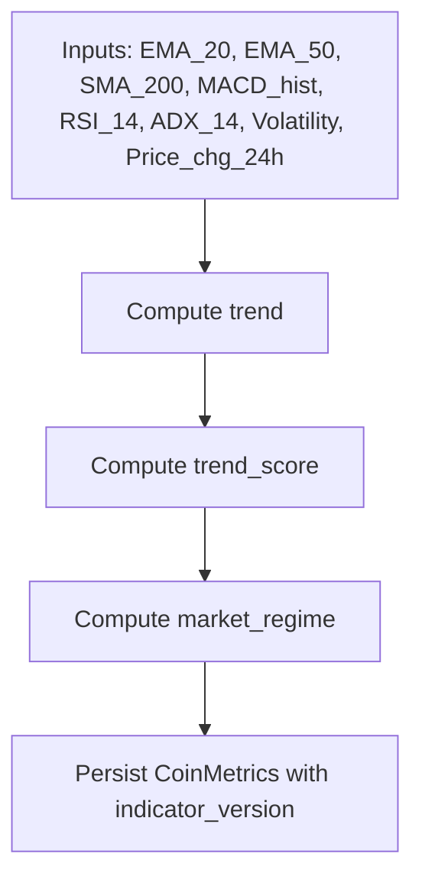
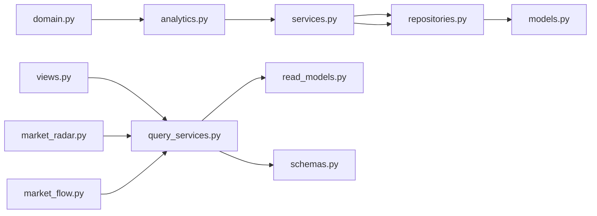

# Technical Indicators

<cite>
**Referenced Files in This Document**
- [models.py](file://src/apps/indicators/models.py)
- [domain.py](file://src/apps/indicators/domain.py)
- [analytics.py](file://src/apps/indicators/analytics.py)
- [services.py](file://src/apps/indicators/services.py)
- [repositories.py](file://src/apps/indicators/repositories.py)
- [schemas.py](file://src/apps/indicators/schemas.py)
- [read_models.py](file://src/apps/indicators/read_models.py)
- [query_services.py](file://src/apps/indicators/query_services.py)
- [views.py](file://src/apps/indicators/views.py)
- [snapshots.py](file://src/apps/indicators/snapshots.py)
- [market_radar.py](file://src/apps/indicators/market_radar.py)
- [market_flow.py](file://src/apps/indicators/market_flow.py)
- [regime.py](file://src/apps/patterns/domain/regime.py)
- [strategy.py](file://src/apps/patterns/domain/strategy.py)
</cite>

## Table of Contents
1. [Introduction](#introduction)
2. [Project Structure](#project-structure)
3. [Core Components](#core-components)
4. [Architecture Overview](#architecture-overview)
5. [Detailed Component Analysis](#detailed-component-analysis)
6. [Dependency Analysis](#dependency-analysis)
7. [Performance Considerations](#performance-considerations)
8. [Troubleshooting Guide](#troubleshooting-guide)
9. [Conclusion](#conclusion)
10. [Appendices](#appendices)

## Introduction
This document describes the technical indicators subsystem powering market analytics in the backend. It covers the full set of computed indicators (EMA, SMA, RSI, MACD, ATR, Bollinger Bands, ADX, and volatility), their mathematical formulations, parameter configurations, and storage via the CoinMetrics model. It also documents the indicator versioning scheme, caching mechanisms, and performance optimizations. Practical usage scenarios for trend identification, momentum signaling, and volatility assessment are included.

## Project Structure
The indicators subsystem is organized around:
- Domain logic for indicator computations
- Analytics orchestrator for snapshot generation and regime scoring
- Services for event processing, scheduling, and feature snapshots
- Repositories for persistence and cache updates
- Read models and schemas for API exposure
- Views and query services for market radar and flow dashboards

**Diagram sources**
- [domain.py:1-205](file://src/apps/indicators/domain.py#L1-L205)
- [analytics.py:1-463](file://src/apps/indicators/analytics.py#L1-L463)
- [services.py:1-586](file://src/apps/indicators/services.py#L1-L586)
- [repositories.py:1-601](file://src/apps/indicators/repositories.py#L1-L601)
- [models.py:1-121](file://src/apps/indicators/models.py#L1-L121)
- [query_services.py:1-450](file://src/apps/indicators/query_services.py#L1-L450)
- [schemas.py:1-157](file://src/apps/indicators/schemas.py#L1-L157)
- [read_models.py:1-280](file://src/apps/indicators/read_models.py#L1-L280)
- [views.py:1-46](file://src/apps/indicators/views.py#L1-L46)
- [market_radar.py:1-32](file://src/apps/indicators/market_radar.py#L1-L32)
- [market_flow.py:1-24](file://src/apps/indicators/market_flow.py#L1-L24)
- [snapshots.py:1-9](file://src/apps/indicators/snapshots.py#L1-L9)

**Section sources**
- [models.py:1-121](file://src/apps/indicators/models.py#L1-L121)
- [domain.py:1-205](file://src/apps/indicators/domain.py#L1-L205)
- [analytics.py:1-463](file://src/apps/indicators/analytics.py#L1-L463)
- [services.py:1-586](file://src/apps/indicators/services.py#L1-L586)
- [repositories.py:1-601](file://src/apps/indicators/repositories.py#L1-L601)
- [schemas.py:1-157](file://src/apps/indicators/schemas.py#L1-L157)
- [read_models.py:1-280](file://src/apps/indicators/read_models.py#L1-L280)
- [query_services.py:1-450](file://src/apps/indicators/query_services.py#L1-L450)
- [views.py:1-46](file://src/apps/indicators/views.py#L1-L46)
- [market_radar.py:1-32](file://src/apps/indicators/market_radar.py#L1-L32)
- [market_flow.py:1-24](file://src/apps/indicators/market_flow.py#L1-L24)
- [snapshots.py:1-9](file://src/apps/indicators/snapshots.py#L1-L9)

## Core Components
- Indicator computations: EMA, SMA, RSI, MACD, ATR, Bollinger Bands, ADX
- Snapshot generation: per-timeframe feature vectors with completeness checks
- Metrics persistence: CoinMetrics ORM model with indicator_version and timestamps
- Caching: IndicatorCache for per-indicator, per-timestamp values with versioning
- Regime detection: trend classification and regime assignment
- Signals: classic technical signals derived from indicator crossovers and thresholds
- Feature snapshots: consolidated snapshot for downstream analytics

**Section sources**
- [domain.py:12-205](file://src/apps/indicators/domain.py#L12-L205)
- [analytics.py:62-220](file://src/apps/indicators/analytics.py#L62-L220)
- [models.py:15-118](file://src/apps/indicators/models.py#L15-L118)
- [repositories.py:352-418](file://src/apps/indicators/repositories.py#L352-L418)
- [analytics.py:290-356](file://src/apps/indicators/analytics.py#L290-L356)
- [analytics.py:394-429](file://src/apps/indicators/analytics.py#L394-L429)
- [snapshots.py:1-9](file://src/apps/indicators/snapshots.py#L1-L9)

## Architecture Overview
The subsystem computes indicators from OHLCV candles, builds per-timeframe snapshots, persists metrics and caches, detects regimes, and exposes read models via FastAPI.

**Diagram sources**
- [repositories.py:93-171](file://src/apps/indicators/repositories.py#L93-L171)
- [analytics.py:135-220](file://src/apps/indicators/analytics.py#L135-L220)
- [domain.py:12-205](file://src/apps/indicators/domain.py#L12-L205)
- [repositories.py:310-350](file://src/apps/indicators/repositories.py#L310-L350)
- [repositories.py:352-418](file://src/apps/indicators/repositories.py#L352-L418)
- [repositories.py:420-456](file://src/apps/indicators/repositories.py#L420-L456)

## Detailed Component Analysis

### Indicator Computation Algorithms and Formulations
- Exponential Moving Average (EMA)
  - Formula: smoothing with multiplier k = 2/(N+1); iterative update using prior EMA
  - Parameters: N ∈ {20, 50, 200}
  - Complexity: O(T) per window
- Simple Moving Average (SMA)
  - Formula: arithmetic mean over N periods
  - Parameters: N ∈ {50, 200}
  - Complexity: O(T) sliding window
- Relative Strength Index (RSI)
  - Formula: 100 - 100/(1 + avg_gain/avg_loss); smoothed averages
  - Parameter: N=14
  - Complexity: O(T)
- MACD
  - Components: fast EMA(12), slow EMA(26), signal EMA(9) on histogram
  - Complexity: O(T)
- Average True Range (ATR)
  - Formula: rolling average of true range over N periods
  - Parameter: N=14
  - Complexity: O(T)
- Bollinger Bands
  - Components: middle=SMA(N), upper/lower=middle ± K*stdev(window), width=(upper-lower)/middle
  - Parameters: N=20, K=2.0
  - Complexity: O(T)
- Average Directional Index (ADX)
  - Formula: DX smoothed over 2*N windows; ADX is rolling average of DX
  - Parameter: N=14
  - Complexity: O(T)

**Section sources**
- [domain.py:12-205](file://src/apps/indicators/domain.py#L12-L205)

### Snapshot Generation and Primary Selection
- Build per-timeframe TimeframeSnapshot with:
  - Current prices, indicator series tails, previous values, volume stats, range bounds
- Select primary snapshot by completeness and timeframe priority
- Compute price changes over 1h/24h/7d windows
- Compute activity score, bucket, and analysis priority

**Diagram sources**
- [analytics.py:135-220](file://src/apps/indicators/analytics.py#L135-L220)
- [analytics.py:222-259](file://src/apps/indicators/analytics.py#L222-L259)
- [analytics.py:281-288](file://src/apps/indicators/analytics.py#L281-L288)

**Section sources**
- [analytics.py:62-220](file://src/apps/indicators/analytics.py#L62-L220)
- [analytics.py:222-259](file://src/apps/indicators/analytics.py#L222-L259)
- [analytics.py:281-288](file://src/apps/indicators/analytics.py#L281-L288)

### CoinMetrics Model and Field Definitions
- Fields include price changes, EMAs, SMAs, RSI, MACD components, ATR, Bollinger Bands, ADX, volumes, volatility, trend, trend_score, activity metrics, market regime, and indicator_version
- Data types: numeric fields are Float; categorical fields are String; JSON stores regime details; timestamps are DateTime(timezone=True)
- Versioning: indicator_version defaults to 1 and is updated on writes

**Diagram sources**
- [models.py:15-62](file://src/apps/indicators/models.py#L15-L62)

**Section sources**
- [models.py:15-62](file://src/apps/indicators/models.py#L15-L62)
- [schemas.py:8-45](file://src/apps/indicators/schemas.py#L8-L45)

### Indicator Caching Mechanism
- IndicatorCache stores per-indicator, per-timestamp values with:
  - coin_id, timeframe, indicator name, value, timestamp, indicator_version, feature_source
  - Unique constraint on (coin_id, timeframe, indicator, timestamp, indicator_version)
- Upsert logic updates value and feature_source on conflict

**Diagram sources**
- [models.py:88-118](file://src/apps/indicators/models.py#L88-L118)
- [repositories.py:352-418](file://src/apps/indicators/repositories.py#L352-L418)

**Section sources**
- [repositories.py:352-418](file://src/apps/indicators/repositories.py#L352-L418)
- [models.py:88-118](file://src/apps/indicators/models.py#L88-L118)

### Regime Detection and Trend Scoring
- Trend classification: bullish/bearish/sideways based on SMA/EMA/MACD histogram
- Trend score: weighted aggregation of EMA cross, price vs SMA(200), MACD histogram, RSI region, ADX strength, and 24h volume change
- Market regime: higher-order classification combining trend, BB width, volume, and ATR characteristics

**Diagram sources**
- [analytics.py:290-356](file://src/apps/indicators/analytics.py#L290-L356)
- [regime.py:38-66](file://src/apps/patterns/domain/regime.py#L38-L66)
- [strategy.py:85-98](file://src/apps/patterns/domain/strategy.py#L85-L98)

**Section sources**
- [analytics.py:290-356](file://src/apps/indicators/analytics.py#L290-L356)
- [regime.py:38-66](file://src/apps/patterns/domain/regime.py#L38-L66)
- [strategy.py:85-98](file://src/apps/patterns/domain/strategy.py#L85-L98)

### Signal Detection
Classic signals derived from indicator transitions:
- Golden/death crosses (SMA 50 vs 200)
- Breakouts/breakdowns (price moving past 20-period high/low with volume spike)
- Trend reversals (MACD histogram crossing zero)
- Volume spikes (>2x average over 20 periods)
- RSI overbought/oversold thresholds

**Section sources**
- [analytics.py:394-429](file://src/apps/indicators/analytics.py#L394-L429)
- [repositories.py:420-456](file://src/apps/indicators/repositories.py#L420-L456)

### Feature Snapshots
- Consolidated snapshot capturing price_current, rsi_14, macd, trend_score, volatility, sector_strength, market_regime, cycle_phase, pattern_density, cluster_score
- Upserted with conflict resolution on coin_id, timeframe, timestamp

**Section sources**
- [analytics.py:433-527](file://src/apps/indicators/analytics.py#L433-L527)
- [repositories.py:508-553](file://src/apps/indicators/repositories.py#L508-L553)

### API Exposure and Read Models
- Endpoints:
  - GET /coins/metrics → list all coins’ metrics
  - GET /market/radar → market radar view
  - GET /market/flow → market flow view
- Read models and schemas define projection and serialization for clients

**Section sources**
- [views.py:13-45](file://src/apps/indicators/views.py#L13-L45)
- [query_services.py:63-151](file://src/apps/indicators/query_services.py#L63-L151)
- [query_services.py:321-446](file://src/apps/indicators/query_services.py#L321-L446)
- [schemas.py:8-157](file://src/apps/indicators/schemas.py#L8-L157)
- [read_models.py:24-202](file://src/apps/indicators/read_models.py#L24-L202)

## Dependency Analysis
Key dependencies and coupling:
- analytics.py depends on domain.py for indicator math
- services.py orchestrates repositories and analytics
- repositories.py depend on SQLAlchemy models and Timescale aggregates
- query_services.py depends on Redis for event stream reads and SQLAlchemy for SQL queries
- views.py depends on query_services and schemas

**Diagram sources**
- [domain.py:1-205](file://src/apps/indicators/domain.py#L1-L205)
- [analytics.py:1-463](file://src/apps/indicators/analytics.py#L1-L463)
- [services.py:1-586](file://src/apps/indicators/services.py#L1-L586)
- [repositories.py:1-601](file://src/apps/indicators/repositories.py#L1-L601)
- [models.py:1-121](file://src/apps/indicators/models.py#L1-L121)
- [query_services.py:1-450](file://src/apps/indicators/query_services.py#L1-L450)
- [read_models.py:1-280](file://src/apps/indicators/read_models.py#L1-L280)
- [schemas.py:1-157](file://src/apps/indicators/schemas.py#L1-L157)
- [views.py:1-46](file://src/apps/indicators/views.py#L1-L46)
- [market_radar.py:1-32](file://src/apps/indicators/market_radar.py#L1-L32)
- [market_flow.py:1-24](file://src/apps/indicators/market_flow.py#L1-L24)

**Section sources**
- [services.py:1-586](file://src/apps/indicators/services.py#L1-L586)
- [repositories.py:1-601](file://src/apps/indicators/repositories.py#L1-L601)
- [query_services.py:1-450](file://src/apps/indicators/query_services.py#L1-L450)

## Performance Considerations
- Efficient rolling computations:
  - Sliding-window SMA avoids recomputing sums each bar
  - EMA uses iterative update with constant multiplier
  - RSI maintains smoothed averages incrementally
- Batched upserts:
  - IndicatorCacheRepository builds bulk rows and performs single ON CONFLICT DO UPDATE
  - IndicatorMetricsRepository uses INSERT ... ON CONFLICT DO UPDATE
- Data source prioritization:
  - Prefer direct candles; fall back to aggregate views and resampling
- Timeframe-aware refresh:
  - Refresh continuous aggregates only when missing rows for target timeframe
- Redis-backed recent events:
  - Market radar and flow queries pull recent events from Redis stream to reduce DB load

[No sources needed since this section provides general guidance]

## Troubleshooting Guide
Common issues and resolutions:
- Missing indicator values:
  - Occur when insufficient bars are available for a given period; series return trailing None values until warmup
- Empty snapshots:
  - If no candles are available for a timeframe, snapshot is skipped; verify candle availability and base timeframe alignment
- Regime classification inconsistencies:
  - Ensure sufficient bars for ADX (requires 2N periods) and that BB width and ATR are computed
- Cache misses:
  - Confirm indicator_version matches and unique keys (coin_id, timeframe, indicator, timestamp, version) are correct
- Signal detection gaps:
  - Signals rely on previous/current values; ensure snapshots are built for the correct candle close timestamp

**Section sources**
- [domain.py:103-205](file://src/apps/indicators/domain.py#L103-L205)
- [analytics.py:135-220](file://src/apps/indicators/analytics.py#L135-L220)
- [repositories.py:352-418](file://src/apps/indicators/repositories.py#L352-L418)

## Conclusion
The indicators subsystem provides a robust, versioned, and cache-friendly foundation for technical analysis. It computes industry-standard indicators, derives actionable signals, and persists both consolidated metrics and per-indicator cache entries. The modular design enables efficient scaling across multiple timeframes and coins while maintaining deterministic outputs through versioning and unique constraints.

## Appendices

### Indicator Parameter Reference
- EMA: 20, 50, 200
- SMA: 50, 200
- RSI: 14
- MACD: fast=12, slow=26, signal=9
- ATR: 14
- Bollinger Bands: period=20, stddev_multiplier=2.0
- ADX: 14

**Section sources**
- [domain.py:24-149](file://src/apps/indicators/domain.py#L24-L149)

### Practical Usage Examples
- Trend identification:
  - Bullish trend when price > SMA(200), EMA(50) > SMA(200), and MACD histogram > 0
  - Bearish trend when price < SMA(200)
- Momentum signaling:
  - Golden cross (SMA(50) crossing above SMA(200)) and death cross (below) with volume confirmation
  - RSI oversold/overbought thresholds for reversal candidates
- Volatility assessment:
  - Use ATR and BB width; classify regimes as high/low volatility based on thresholds
  - Combine ATR ratio and BB expansion/narrowing for regime detection

**Section sources**
- [analytics.py:290-356](file://src/apps/indicators/analytics.py#L290-L356)
- [regime.py:38-66](file://src/apps/patterns/domain/regime.py#L38-L66)
- [analytics.py:394-429](file://src/apps/indicators/analytics.py#L394-L429)