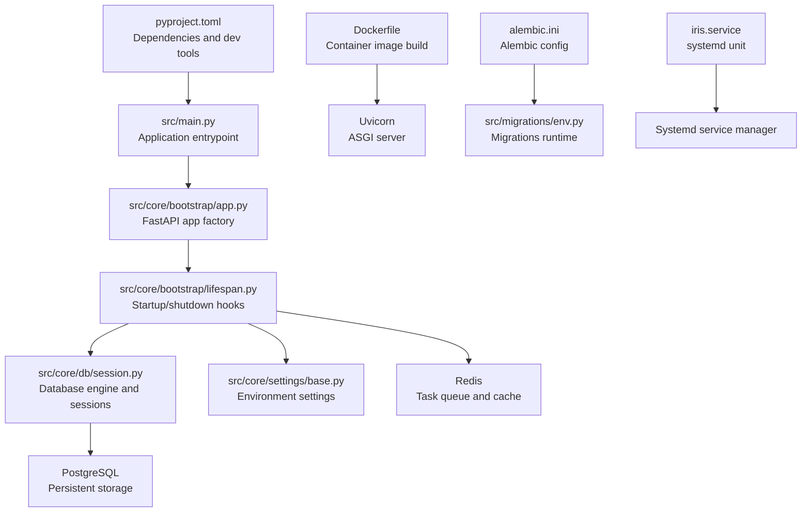
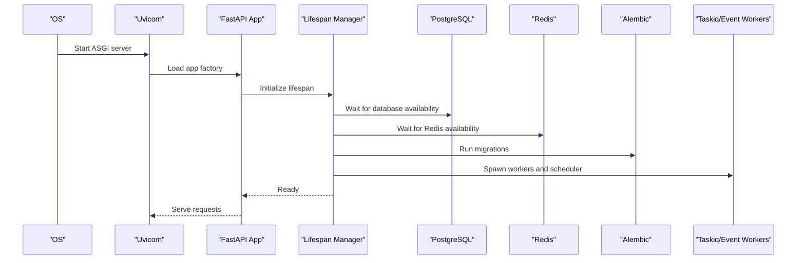
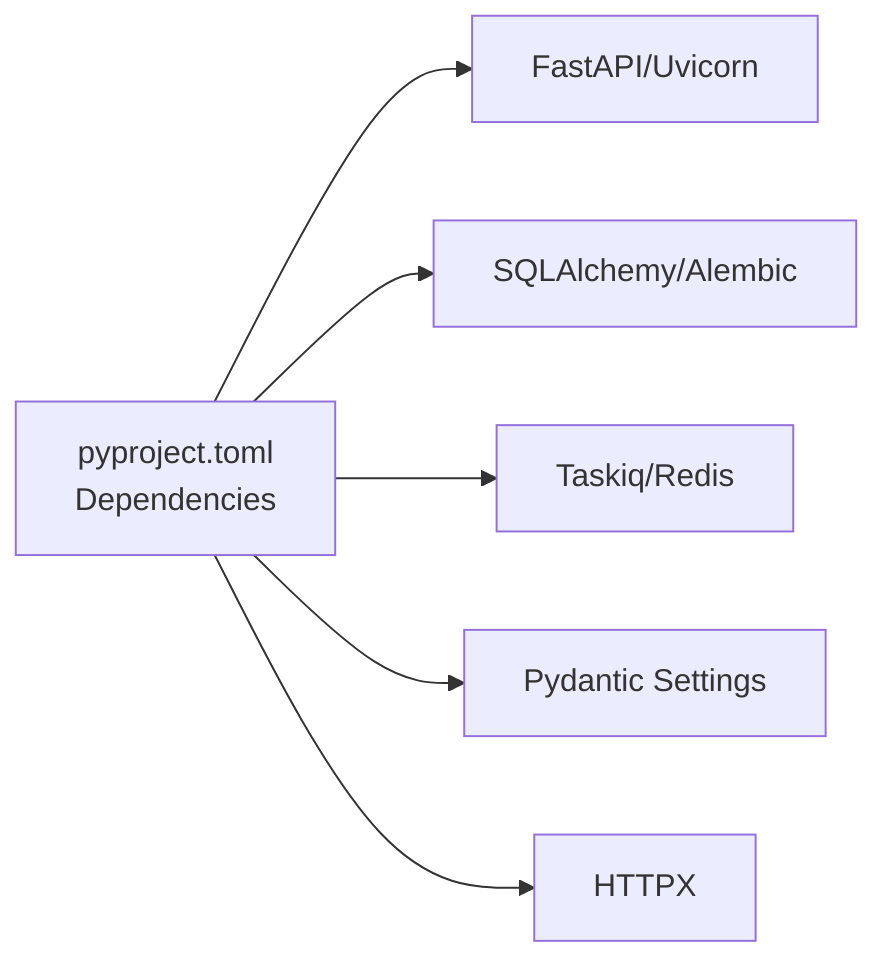

# Installation and Setup

<cite>
**Referenced Files in This Document**
- [pyproject.toml](file://pyproject.toml)
- [Dockerfile](file://Dockerfile)
- [.dockerignore](file://.dockerignore)
- [alembic.ini](file://alembic.ini)
- [src/migrations/env.py](file://src/migrations/env.py)
- [src/core/settings/base.py](file://src/core/settings/base.py)
- [src/core/bootstrap/app.py](file://src/core/bootstrap/app.py)
- [src/core/bootstrap/lifespan.py](file://src/core/bootstrap/lifespan.py)
- [src/core/db/session.py](file://src/core/db/session.py)
- [src/main.py](file://src/main.py)
- [iris.service](file://iris.service)
</cite>

## Table of Contents
1. [Introduction](#introduction)
2. [Project Structure](#project-structure)
3. [Core Components](#core-components)
4. [Architecture Overview](#architecture-overview)
5. [Detailed Component Analysis](#detailed-component-analysis)
6. [Dependency Analysis](#dependency-analysis)
7. [Performance Considerations](#performance-considerations)
8. [Troubleshooting Guide](#troubleshooting-guide)
9. [Conclusion](#conclusion)
10. [Appendices](#appendices)

## Introduction
This guide provides end-to-end installation and setup instructions for the IRIS platform backend. It covers prerequisites, environment configuration, dependency installation, database setup with Alembic migrations, and service dependencies. It documents both development and production deployment scenarios, including Docker containerization, systemd service configuration, and environment variable management. Step-by-step procedures, common setup issues, and verification steps are included to ensure a successful installation.

## Project Structure
The IRIS backend is a Python application built with FastAPI and Taskiq. It uses SQLAlchemy for ORM, Alembic for database migrations, Redis for caching and task queues, and PostgreSQL for persistent storage. Deployment artifacts include a Dockerfile for containerization and a systemd unit file for production service management.

**Diagram sources**
- [pyproject.toml:1-89](file://pyproject.toml#L1-L89)
- [src/main.py:1-22](file://src/main.py#L1-L22)
- [src/core/bootstrap/app.py:1-81](file://src/core/bootstrap/app.py#L1-L81)
- [src/core/bootstrap/lifespan.py:1-70](file://src/core/bootstrap/lifespan.py#L1-L70)
- [src/core/db/session.py:1-72](file://src/core/db/session.py#L1-L72)
- [src/core/settings/base.py:1-90](file://src/core/settings/base.py#L1-L90)
- [Dockerfile:1-18](file://Dockerfile#L1-L18)
- [alembic.ini:1-38](file://alembic.ini#L1-L38)
- [src/migrations/env.py:1-56](file://src/migrations/env.py#L1-L56)
- [iris.service:1-15](file://iris.service#L1-L15)

**Section sources**
- [pyproject.toml:1-89](file://pyproject.toml#L1-L89)
- [Dockerfile:1-18](file://Dockerfile#L1-L18)
- [alembic.ini:1-38](file://alembic.ini#L1-L38)
- [iris.service:1-15](file://iris.service#L1-L15)

## Core Components
- Application entrypoint and ASGI server: Uvicorn runs the FastAPI app exposed on a configurable host and port.
- Settings and environment configuration: Pydantic Settings loads environment variables from a file with aliases for service integration.
- Database connectivity: Async SQLAlchemy engine with retry logic and connection pooling.
- Task and stream orchestration: Taskiq workers and event stream workers are started during application lifespan.
- Alembic migrations: Migrations are applied at startup via Alembic configuration and settings.

Key configuration touchpoints:
- Host/port binding and CORS origins are configured via environment variables.
- Database and Redis URLs are loaded from environment variables.
- Alembic reads its configuration from a dedicated file and applies migrations at startup.

**Section sources**
- [src/main.py:12-22](file://src/main.py#L12-L22)
- [src/core/settings/base.py:8-90](file://src/core/settings/base.py#L8-L90)
- [src/core/db/session.py:19-72](file://src/core/db/session.py#L19-L72)
- [src/core/bootstrap/lifespan.py:22-70](file://src/core/bootstrap/lifespan.py#L22-L70)
- [src/migrations/env.py:17-56](file://src/migrations/env.py#L17-L56)

## Architecture Overview
The IRIS backend initializes dependencies, applies database migrations, and starts workers and schedulers. The FastAPI app exposes routers for various subsystems and conditionally includes additional routers based on settings.

**Diagram sources**
- [src/core/bootstrap/lifespan.py:22-70](file://src/core/bootstrap/lifespan.py#L22-L70)
- [src/core/bootstrap/app.py:49-81](file://src/core/bootstrap/app.py#L49-L81)
- [src/migrations/env.py:34-56](file://src/migrations/env.py#L34-L56)
- [src/core/db/session.py:61-72](file://src/core/db/session.py#L61-L72)

## Detailed Component Analysis

### Prerequisites
- Python 3.11+ is required by the project metadata.
- Docker is used for containerized builds and deployments.
- PostgreSQL and Redis are required runtime dependencies.
- Optional external APIs (Polygon, Twelve Data, Alpha Vantage) require API keys if enabled.

**Section sources**
- [pyproject.toml:5](file://pyproject.toml#L5)
- [src/core/settings/base.py:22-25](file://src/core/settings/base.py#L22-L25)

### Environment Configuration
IRIS uses Pydantic Settings to load environment variables from a file with aliases for common environment variables. The settings include:
- Application name and environment
- API host and port
- Database URL and Redis URL
- Event stream name
- CORS origins list
- Task scheduling intervals for multiple subsystems
- Control plane token and related timeouts
- AI provider endpoints and models
- Portfolio risk and capital parameters
- Retry and delay settings for database and Redis connections

Environment variable precedence and aliases are handled by the settings class configuration.

**Section sources**
- [src/core/settings/base.py:8-90](file://src/core/settings/base.py#L8-L90)

### Dependency Installation
- Use the project’s dependency manager to install runtime and development dependencies.
- For production, a frozen lockfile ensures deterministic installs.
- Development dependencies are separated for local testing and linting.

Best practices:
- Pin versions using the lockfile for reproducible builds.
- Keep development tools separate from runtime requirements.

**Section sources**
- [pyproject.toml:21-39](file://pyproject.toml#L21-L39)
- [pyproject.toml:87-89](file://pyproject.toml#L87-L89)

### Database Setup with Alembic Migrations
IRIS uses Alembic for database migrations. The configuration is centralized in a dedicated file and programmatically updated with settings at runtime.

Key steps:
- Configure Alembic to use the project’s migrations directory and database URL from settings.
- Apply migrations at startup via the application lifespan hook.

Verification:
- Confirm that migrations are applied successfully during service startup logs.

**Section sources**
- [alembic.ini:1-38](file://alembic.ini#L1-L38)
- [src/migrations/env.py:17-56](file://src/migrations/env.py#L17-L56)
- [src/core/bootstrap/app.py:37-47](file://src/core/bootstrap/app.py#L37-L47)

### Service Dependencies
Runtime dependencies include:
- PostgreSQL for persistent data
- Redis for caching and task queue integration
- Optional external market data providers

The application waits for database and Redis readiness before serving traffic.

**Section sources**
- [src/core/db/session.py:61-72](file://src/core/db/session.py#L61-L72)
- [src/core/bootstrap/lifespan.py:24-25](file://src/core/bootstrap/lifespan.py#L24-L25)
- [src/core/settings/base.py:13-20](file://src/core/settings/base.py#L13-L20)

### Development Deployment
- Run the application locally using the entrypoint module.
- Bind host and port are configurable via settings.
- CORS origins are configurable for frontend integration.

Recommended local setup:
- Create a local environment file with required variables.
- Start PostgreSQL and Redis locally or via Docker Compose.
- Apply migrations using Alembic CLI or rely on automatic startup migrations.

**Section sources**
- [src/main.py:12-22](file://src/main.py#L12-L22)
- [src/core/settings/base.py:11-12](file://src/core/settings/base.py#L11-L12)
- [src/core/settings/base.py:25-31](file://src/core/settings/base.py#L25-L31)

### Production Deployment with Docker
The project includes a minimal Dockerfile that:
- Uses a Python slim base image.
- Installs the project with a deterministic dependency resolver.
- Exposes the API port and runs Uvicorn with the application module.

Build and run:
- Build the image using the provided Dockerfile.
- Run the container with appropriate environment variables mounted or passed via Docker Compose.
- Ensure PostgreSQL and Redis are reachable from the container network.

**Section sources**
- [Dockerfile:1-18](file://Dockerfile#L1-L18)

### systemd Service Configuration
A systemd unit file is provided to run the backend as a system service:
- Loads environment from a dedicated file.
- Runs the Python module entrypoint.
- Restarts on failure with a backoff interval.

Deployment steps:
- Place the unit file in the system units directory.
- Create the environment file with required variables.
- Enable and start the service.

**Section sources**
- [iris.service:1-15](file://iris.service#L1-L15)

### Environment Variable Management
Common variables and their roles:
- DATABASE_URL: PostgreSQL connection string for SQLAlchemy.
- REDIS_URL: Redis connection string for caching and task queues.
- EVENT_STREAM_NAME: Name of the event stream.
- POLYGON_API_KEY, TWELVE_DATA_API_KEY, ALPHA_VANTAGE_API_KEY: Provider credentials.
- CORS_ORIGINS: Comma-separated list of allowed origins.
- IRIS_CONTROL_TOKEN: Access token for control plane endpoints.
- AI provider variables: OpenAI and local HTTP endpoints and models.
- Task scheduling intervals: Intervals for various subsystems.
- Portfolio parameters: Risk and capital configuration.

Loading behavior:
- Variables are loaded from a file with case-insensitive matching and aliases.

**Section sources**
- [src/core/settings/base.py:13-77](file://src/core/settings/base.py#L13-L77)

## Dependency Analysis
The application depends on:
- FastAPI and Uvicorn for the web server.
- SQLAlchemy and Alembic for ORM and migrations.
- Taskiq and Redis for asynchronous task processing.
- Pydantic Settings for environment configuration.
- Optional external HTTP clients for market data.

**Diagram sources**
- [pyproject.toml:6-19](file://pyproject.toml#L6-L19)

**Section sources**
- [pyproject.toml:1-89](file://pyproject.toml#L1-L89)

## Performance Considerations
- Use the provided Docker image for consistent performance characteristics.
- Tune task scheduling intervals based on workload and resource constraints.
- Monitor database and Redis connection retries and adjust delays if needed.
- Prefer asynchronous operations for IO-bound tasks.

[No sources needed since this section provides general guidance]

## Troubleshooting Guide
Common issues and resolutions:
- Database connectivity failures at startup:
  - Verify the database URL and network reachability.
  - Increase retry count or delay if the database starts later than the service.
- Redis connectivity failures:
  - Confirm the Redis URL and network accessibility.
  - Adjust retry settings if Redis is slow to start.
- Migration errors:
  - Ensure the database is reachable and migrations directory is present.
  - Review Alembic logs for detailed errors.
- Port binding conflicts:
  - Change the API host and port settings if the default port is in use.
- CORS errors:
  - Add the frontend origin to the CORS origins list.

Verification steps:
- Confirm that migrations are applied during startup.
- Check that workers and schedulers are spawned successfully.
- Validate that health endpoints respond as expected.

**Section sources**
- [src/core/db/session.py:61-72](file://src/core/db/session.py#L61-L72)
- [src/core/bootstrap/lifespan.py:24-48](file://src/core/bootstrap/lifespan.py#L24-L48)
- [src/migrations/env.py:34-56](file://src/migrations/env.py#L34-L56)
- [src/core/settings/base.py:11-12](file://src/core/settings/base.py#L11-L12)
- [src/core/settings/base.py:25-31](file://src/core/settings/base.py#L25-L31)

## Conclusion
This document outlined the complete installation and setup process for the IRIS platform backend. By following the prerequisites, environment configuration, dependency installation, database migration, and deployment steps for both development and production, you can reliably deploy and operate the IRIS backend. Use the provided configuration examples and best practices to tailor the setup to your environment.

[No sources needed since this section summarizes without analyzing specific files]

## Appendices

### Step-by-Step Installation Procedures

- Prepare prerequisites:
  - Install Python 3.11+.
  - Install Docker.
  - Provision PostgreSQL and Redis instances.
- Clone and prepare the repository:
  - Copy the project files to your target machine.
  - Ensure the environment file exists with required variables.
- Install dependencies:
  - Use the project’s dependency manager to install runtime dependencies.
  - Optionally install development dependencies for local testing.
- Configure environment:
  - Set environment variables for database, Redis, and optional API keys.
  - Define CORS origins and task scheduling intervals as needed.
- Apply database migrations:
  - Use Alembic to upgrade to the latest revision.
  - Alternatively, rely on automatic migrations at startup.
- Run in development:
  - Start the application using the entrypoint module.
  - Access the API on the configured host and port.
- Containerize for production:
  - Build the Docker image using the provided Dockerfile.
  - Run the container with environment variables mapped.
- Deploy as a systemd service:
  - Place the unit file in the system units directory.
  - Create the environment file with required variables.
  - Enable and start the service.

**Section sources**
- [pyproject.toml:5](file://pyproject.toml#L5)
- [Dockerfile:1-18](file://Dockerfile#L1-L18)
- [alembic.ini:1-38](file://alembic.ini#L1-L38)
- [src/migrations/env.py:34-56](file://src/migrations/env.py#L34-L56)
- [iris.service:1-15](file://iris.service#L1-L15)

### Verification Checklist
- Environment variables are correctly loaded.
- Database and Redis are reachable.
- Migrations are applied successfully.
- Workers and schedulers are running.
- Health endpoints respond.
- CORS configuration allows expected origins.

**Section sources**
- [src/core/settings/base.py:8-90](file://src/core/settings/base.py#L8-L90)
- [src/core/db/session.py:61-72](file://src/core/db/session.py#L61-L72)
- [src/core/bootstrap/lifespan.py:24-48](file://src/core/bootstrap/lifespan.py#L24-L48)