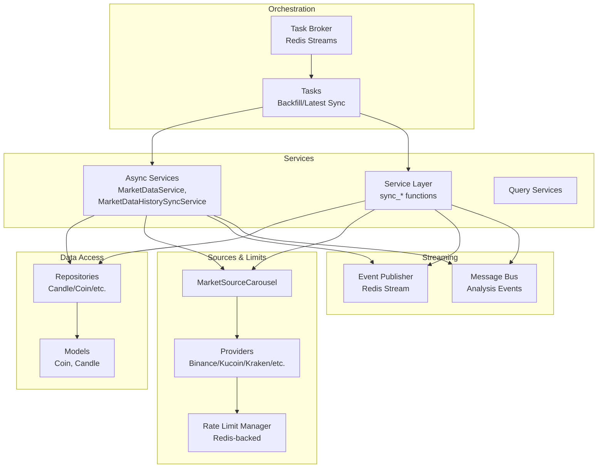
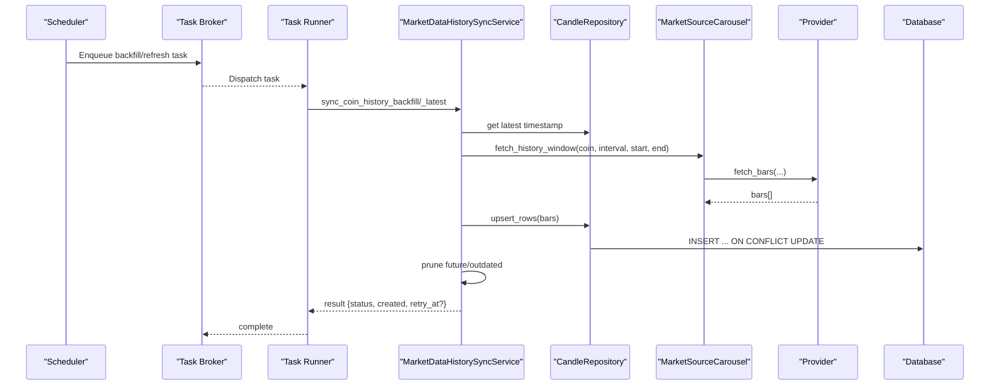
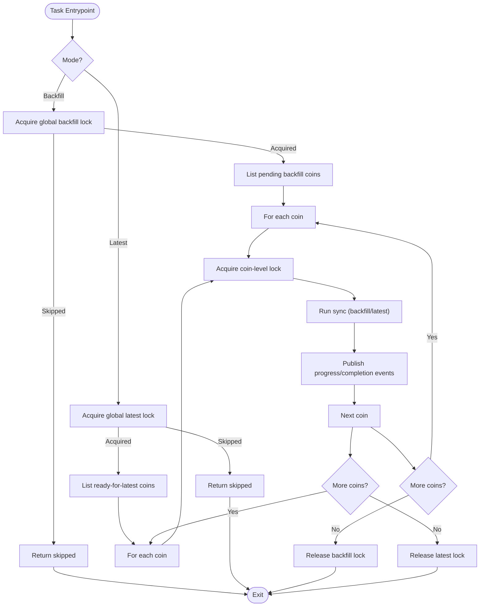
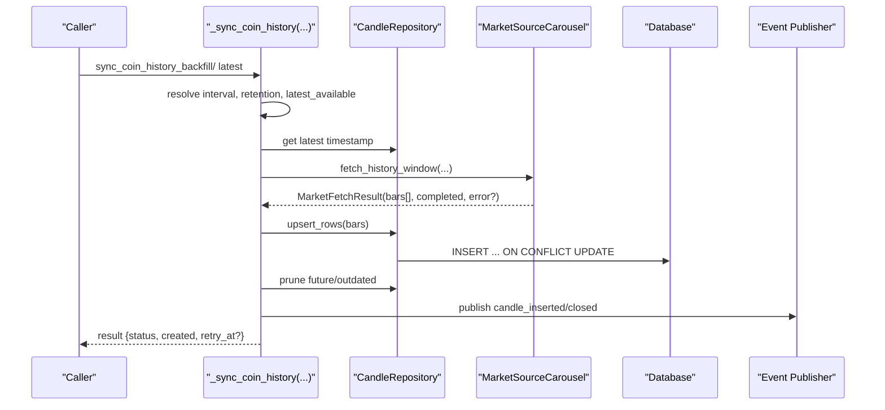
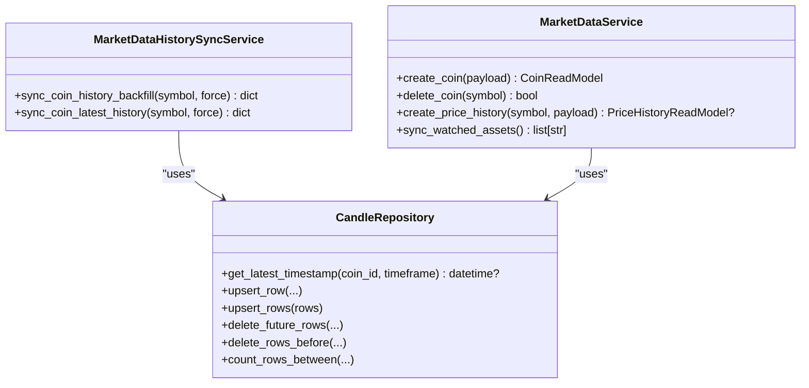
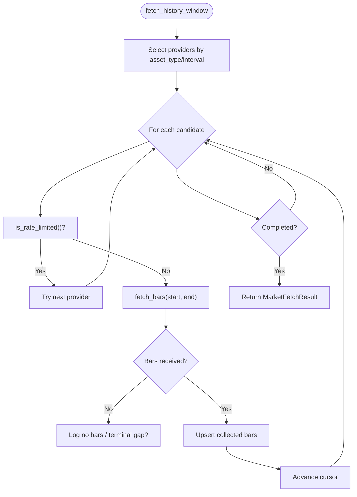
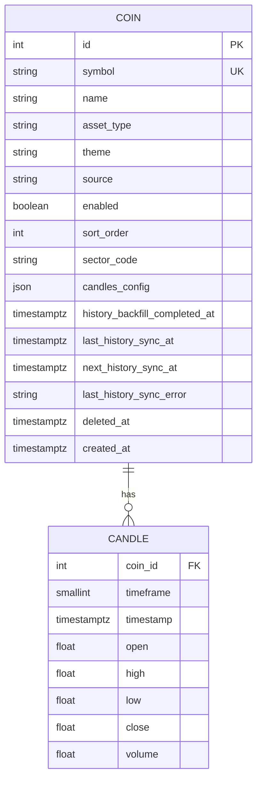
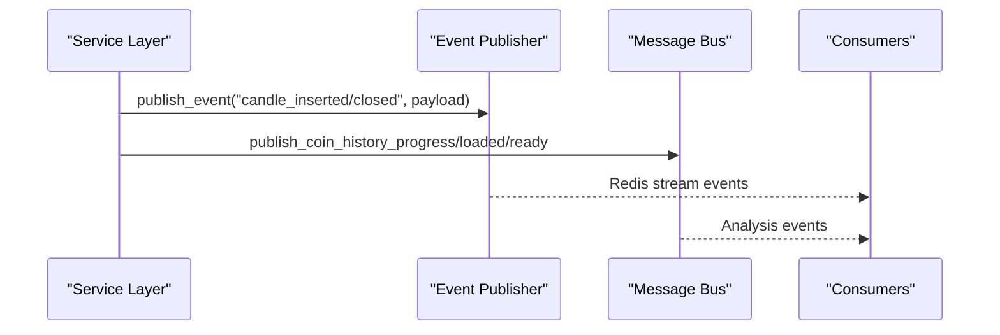
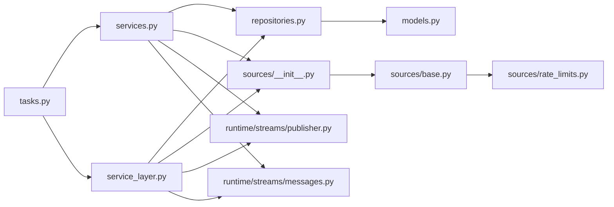

# Data Ingestion Pipeline

<cite>
**Referenced Files in This Document**
- [service_layer.py](file://src/apps/market_data/service_layer.py)
- [services.py](file://src/apps/market_data/services.py)
- [tasks.py](file://src/apps/market_data/tasks.py)
- [base.py](file://src/apps/market_data/sources/base.py)
- [rate_limits.py](file://src/apps/market_data/sources/rate_limits.py)
- [__init__.py](file://src/apps/market_data/sources/__init__.py)
- [domain.py](file://src/apps/market_data/domain.py)
- [repositories.py](file://src/apps/market_data/repositories.py)
- [models.py](file://src/apps/market_data/models.py)
- [query_services.py](file://src/apps/market_data/query_services.py)
- [schemas.py](file://src/apps/market_data/schemas.py)
- [broker.py](file://src/runtime/orchestration/broker.py)
- [publisher.py](file://src/runtime/streams/publisher.py)
- [messages.py](file://src/runtime/streams/messages.py)
</cite>

## Table of Contents
1. [Introduction](#introduction)
2. [Project Structure](#project-structure)
3. [Core Components](#core-components)
4. [Architecture Overview](#architecture-overview)
5. [Detailed Component Analysis](#detailed-component-analysis)
6. [Dependency Analysis](#dependency-analysis)
7. [Performance Considerations](#performance-considerations)
8. [Troubleshooting Guide](#troubleshooting-guide)
9. [Conclusion](#conclusion)
10. [Appendices](#appendices)

## Introduction
This document explains the market data ingestion pipeline that powers historical backfill and real-time updates for observed assets. It covers the task-based orchestration, service-layer orchestration, data collection and validation, normalization, and persistence. It also documents concurrency controls, batching, memory management, error handling, retry logic, data consistency guarantees, performance optimizations, caching strategies, and monitoring of ingestion health. Finally, it outlines how the ingestion tasks relate to the broader system architecture.

## Project Structure
The ingestion pipeline spans several modules:
- Task orchestration and scheduling: tasks and brokers
- Market data services and repositories: services, repositories, models, queries
- Market sources and rate limiting: source abstractions and providers
- Streaming and event publishing: event bus and message bus
- Domain utilities: intervals, timestamps, and alignment helpers

**Diagram sources**
- [broker.py:1-23](file://src/runtime/orchestration/broker.py#L1-L23)
- [tasks.py:1-235](file://src/apps/market_data/tasks.py#L1-L235)
- [services.py:1-865](file://src/apps/market_data/services.py#L1-L865)
- [service_layer.py:1-666](file://src/apps/market_data/service_layer.py#L1-L666)
- [repositories.py:1-834](file://src/apps/market_data/repositories.py#L1-L834)
- [models.py:1-168](file://src/apps/market_data/models.py#L1-L168)
- [__init__.py:1-198](file://src/apps/market_data/sources/__init__.py#L1-L198)
- [rate_limits.py:1-304](file://src/apps/market_data/sources/rate_limits.py#L1-L304)
- [publisher.py:1-101](file://src/runtime/streams/publisher.py#L1-L101)
- [messages.py:1-358](file://src/runtime/streams/messages.py#L1-L358)

**Section sources**
- [broker.py:1-23](file://src/runtime/orchestration/broker.py#L1-L23)
- [tasks.py:1-235](file://src/apps/market_data/tasks.py#L1-L235)
- [services.py:1-865](file://src/apps/market_data/services.py#L1-L865)
- [service_layer.py:1-666](file://src/apps/market_data/service_layer.py#L1-L666)
- [repositories.py:1-834](file://src/apps/market_data/repositories.py#L1-L834)
- [models.py:1-168](file://src/apps/market_data/models.py#L1-L168)
- [__init__.py:1-198](file://src/apps/market_data/sources/__init__.py#L1-L198)
- [rate_limits.py:1-304](file://src/apps/market_data/sources/rate_limits.py#L1-L304)
- [publisher.py:1-101](file://src/runtime/streams/publisher.py#L1-L101)
- [messages.py:1-358](file://src/runtime/streams/messages.py#L1-L358)

## Core Components
- Task orchestration: scheduled jobs for backfill and latest sync, coordinated via Redis Streams and task brokers.
- Service layer: synchronous orchestration for history sync, pruning, and event publishing.
- Async services: asynchronous counterparts for the same operations with repository abstractions.
- Market source carousel: provider selection and rotation with rate-limit-aware fetching.
- Rate limit manager: Redis-backed policy enforcement and cooldown management.
- Repositories and models: typed repositories and SQLAlchemy models for persistence.
- Eventing: Redis streams for internal events and analysis messages.

Key responsibilities:
- Historical backfill: fetches missing bars for base timeframe, prunes future and outdated data, publishes progress and completion.
- Latest sync: advances incremental updates after backfill, respecting backoff and retry windows.
- Validation and normalization: interval normalization, UTC alignment, retention-based pruning.
- Persistence: upserts with conflict resolution, batched inserts, continuous aggregate refresh for higher timeframes.

**Section sources**
- [tasks.py:1-235](file://src/apps/market_data/tasks.py#L1-L235)
- [service_layer.py:1-666](file://src/apps/market_data/service_layer.py#L1-L666)
- [services.py:1-865](file://src/apps/market_data/services.py#L1-L865)
- [__init__.py:1-198](file://src/apps/market_data/sources/__init__.py#L1-L198)
- [rate_limits.py:1-304](file://src/apps/market_data/sources/rate_limits.py#L1-L304)
- [repositories.py:1-834](file://src/apps/market_data/repositories.py#L1-L834)
- [models.py:1-168](file://src/apps/market_data/models.py#L1-L168)
- [publisher.py:1-101](file://src/runtime/streams/publisher.py#L1-L101)
- [messages.py:1-358](file://src/runtime/streams/messages.py#L1-L358)

## Architecture Overview
The ingestion pipeline follows a task-driven architecture:
- Scheduled tasks trigger backfill or latest sync for observed assets.
- Tasks coordinate locking to avoid concurrent runs per coin and globally.
- MarketSourceCarousel selects appropriate providers and fetches bars with rate-limit awareness.
- Repositories persist candles with upsert semantics and maintain consistency.
- Event publishers emit progress and completion messages for downstream systems.

**Diagram sources**
- [broker.py:1-23](file://src/runtime/orchestration/broker.py#L1-L23)
- [tasks.py:1-235](file://src/apps/market_data/tasks.py#L1-L235)
- [services.py:1-865](file://src/apps/market_data/services.py#L1-L865)
- [repositories.py:1-834](file://src/apps/market_data/repositories.py#L1-L834)
- [__init__.py:1-198](file://src/apps/market_data/sources/__init__.py#L1-L198)

## Detailed Component Analysis

### Task-Based Orchestration
- Backfill and latest sync tasks are defined as broker tasks and guarded by Redis-based locks to prevent overlap.
- Manual job execution supports auto/backfill/latest modes with optional force flag.
- Pending backfill and ready-for-latest lists are computed via query services.

**Diagram sources**
- [tasks.py:1-235](file://src/apps/market_data/tasks.py#L1-L235)

**Section sources**
- [tasks.py:1-235](file://src/apps/market_data/tasks.py#L1-L235)

### Service Layer Orchestration (Synchronous)
- Provides synchronous wrappers around async operations for legacy or non-async contexts.
- Implements backfill and latest sync logic, including:
  - Progress calculation and publishing
  - Pruning of future and outdated bars
  - Upsert of base candles with conflict resolution
  - Continuous aggregate refresh for higher timeframes when applicable
- Emits candle-inserted/closed events and analysis readiness messages.

**Diagram sources**
- [service_layer.py:1-666](file://src/apps/market_data/service_layer.py#L1-L666)
- [repositories.py:1-834](file://src/apps/market_data/repositories.py#L1-L834)
- [__init__.py:1-198](file://src/apps/market_data/sources/__init__.py#L1-L198)
- [publisher.py:1-101](file://src/runtime/streams/publisher.py#L1-L101)

**Section sources**
- [service_layer.py:1-666](file://src/apps/market_data/service_layer.py#L1-L666)

### Async Services and Repositories
- MarketDataService and MarketDataHistorySyncService encapsulate async operations with unit-of-work patterns.
- Repositories provide typed CRUD operations with bulk upserts, counting, and deletion helpers.
- Continuous aggregates are refreshed for higher timeframes after base candle upserts.

**Diagram sources**
- [services.py:1-865](file://src/apps/market_data/services.py#L1-L865)
- [repositories.py:1-834](file://src/apps/market_data/repositories.py#L1-L834)

**Section sources**
- [services.py:1-865](file://src/apps/market_data/services.py#L1-L865)
- [repositories.py:1-834](file://src/apps/market_data/repositories.py#L1-L834)

### Market Source Carousel and Rate Limits
- MarketSourceCarousel selects providers per asset type and interval, rotating among candidates.
- BaseMarketSource defines request semantics, error types, and rate-limit helpers.
- RedisRateLimitManager enforces per-source policies, cooldowns, and minimum intervals.

**Diagram sources**
- [__init__.py:1-198](file://src/apps/market_data/sources/__init__.py#L1-L198)
- [base.py:1-157](file://src/apps/market_data/sources/base.py#L1-L157)
- [rate_limits.py:1-304](file://src/apps/market_data/sources/rate_limits.py#L1-L304)

**Section sources**
- [__init__.py:1-198](file://src/apps/market_data/sources/__init__.py#L1-L198)
- [base.py:1-157](file://src/apps/market_data/sources/base.py#L1-L157)
- [rate_limits.py:1-304](file://src/apps/market_data/sources/rate_limits.py#L1-L304)

### Data Models and Persistence
- Models define coins and candles with indices optimized for ingestion and queries.
- Repositories implement upserts, deletions, counts, and time-bucketed reads.
- Continuous aggregate refresh is invoked for higher timeframes after base updates.

**Diagram sources**
- [models.py:1-168](file://src/apps/market_data/models.py#L1-L168)
- [repositories.py:1-834](file://src/apps/market_data/repositories.py#L1-L834)

**Section sources**
- [models.py:1-168](file://src/apps/market_data/models.py#L1-L168)
- [repositories.py:1-834](file://src/apps/market_data/repositories.py#L1-L834)

### Eventing and Monitoring
- Event publisher emits structured events to Redis streams for candle insertions and closures.
- Message bus publishes analysis readiness and progress messages for ingestion completion.
- These events drive downstream analytics and UI updates.

**Diagram sources**
- [service_layer.py:1-666](file://src/apps/market_data/service_layer.py#L1-L666)
- [publisher.py:1-101](file://src/runtime/streams/publisher.py#L1-L101)
- [messages.py:1-358](file://src/runtime/streams/messages.py#L1-L358)

**Section sources**
- [publisher.py:1-101](file://src/runtime/streams/publisher.py#L1-L101)
- [messages.py:1-358](file://src/runtime/streams/messages.py#L1-L358)

## Dependency Analysis
- Task orchestration depends on the broker and task runners.
- Services depend on repositories and the market source carousel.
- Repositories depend on SQLAlchemy models and Timescale continuous aggregates.
- Providers depend on the rate limit manager and BaseMarketSource.
- Eventing is decoupled via Redis streams.

**Diagram sources**
- [tasks.py:1-235](file://src/apps/market_data/tasks.py#L1-L235)
- [services.py:1-865](file://src/apps/market_data/services.py#L1-L865)
- [service_layer.py:1-666](file://src/apps/market_data/service_layer.py#L1-L666)
- [repositories.py:1-834](file://src/apps/market_data/repositories.py#L1-L834)
- [models.py:1-168](file://src/apps/market_data/models.py#L1-L168)
- [__init__.py:1-198](file://src/apps/market_data/sources/__init__.py#L1-L198)
- [base.py:1-157](file://src/apps/market_data/sources/base.py#L1-L157)
- [rate_limits.py:1-304](file://src/apps/market_data/sources/rate_limits.py#L1-L304)
- [publisher.py:1-101](file://src/runtime/streams/publisher.py#L1-L101)
- [messages.py:1-358](file://src/runtime/streams/messages.py#L1-L358)

**Section sources**
- [tasks.py:1-235](file://src/apps/market_data/tasks.py#L1-L235)
- [services.py:1-865](file://src/apps/market_data/services.py#L1-L865)
- [service_layer.py:1-666](file://src/apps/market_data/service_layer.py#L1-L666)
- [repositories.py:1-834](file://src/apps/market_data/repositories.py#L1-L834)
- [models.py:1-168](file://src/apps/market_data/models.py#L1-L168)
- [__init__.py:1-198](file://src/apps/market_data/sources/__init__.py#L1-L198)
- [base.py:1-157](file://src/apps/market_data/sources/base.py#L1-L157)
- [rate_limits.py:1-304](file://src/apps/market_data/sources/rate_limits.py#L1-L304)
- [publisher.py:1-101](file://src/runtime/streams/publisher.py#L1-L101)
- [messages.py:1-358](file://src/runtime/streams/messages.py#L1-L358)

## Performance Considerations
- Batching:
  - Base history upserts use configurable batch sizes to reduce transaction overhead.
  - Async upserts process rows in chunks to balance memory and throughput.
- Memory management:
  - Carousel collects bars in-memory until sorted and returned; ensure retention limits bound memory.
  - Repository methods return point lists; callers should iterate or slice as needed.
- Concurrency:
  - Global and coin-level Redis locks prevent overlapping runs.
  - Provider rotation and rate-limit checks bound concurrency per source.
- Persistence:
  - Upserts with conflict resolution minimize duplicate writes.
  - Continuous aggregate refresh is scoped to affected ranges after base updates.
- Network:
  - Rate limit manager coordinates per-provider quotas and minimum intervals.
  - Retry-after headers and fallback delays handle provider throttling.

[No sources needed since this section provides general guidance]

## Troubleshooting Guide
Common issues and remedies:
- Provider throttling:
  - Symptoms: frequent "rate limited" errors and backoff scheduling.
  - Actions: verify rate limit policies, monitor cooldown keys, adjust fallback delays.
- No bars returned:
  - Symptoms: empty results or carousel exhaustion.
  - Actions: check provider support for asset type and interval; confirm terminal gap allowance.
- Stalled backfill:
  - Symptoms: repeated partial completion without progress.
  - Actions: inspect next_history_sync_at, verify coin-level lock availability, review error logs.
- Data gaps or wrong timestamps:
  - Symptoms: mismatched timestamps or missing bars.
  - Actions: ensure UTC alignment and interval normalization; validate provider timestamps.
- Event delivery failures:
  - Symptoms: missing progress/completion messages.
  - Actions: check Redis connectivity and stream capacity; verify publisher thread health.

**Section sources**
- [rate_limits.py:1-304](file://src/apps/market_data/sources/rate_limits.py#L1-L304)
- [base.py:1-157](file://src/apps/market_data/sources/base.py#L1-L157)
- [tasks.py:1-235](file://src/apps/market_data/tasks.py#L1-L235)
- [service_layer.py:1-666](file://src/apps/market_data/service_layer.py#L1-L666)
- [publisher.py:1-101](file://src/runtime/streams/publisher.py#L1-L101)
- [messages.py:1-358](file://src/runtime/streams/messages.py#L1-L358)

## Conclusion
The ingestion pipeline combines task-based orchestration, robust provider abstraction, and efficient persistence to reliably collect and normalize market data. It balances concurrency, rate limits, and memory usage while maintaining data consistency and emitting actionable events for monitoring and downstream analytics.

[No sources needed since this section summarizes without analyzing specific files]

## Appendices

### API and Operation Definitions
- Backfill operation:
  - Inputs: coin symbol, optional force flag.
  - Behavior: fetches historical bars for base interval, prunes future/outdated, publishes progress and completion.
- Latest sync operation:
  - Inputs: coin symbol, optional force flag.
  - Behavior: advances incremental updates after backfill, respects backoff and retry windows.
- Manual job:
  - Modes: auto/backfill/latest; auto chooses backfill if pending, otherwise latest.

**Section sources**
- [tasks.py:1-235](file://src/apps/market_data/tasks.py#L1-L235)
- [services.py:1-865](file://src/apps/market_data/services.py#L1-L865)
- [service_layer.py:1-666](file://src/apps/market_data/service_layer.py#L1-L666)

### Relationship to Broader System
- Ingestion feeds the analytics subsystem via event streams and continuous aggregates.
- Downstream consumers subscribe to Redis streams for real-time updates.
- The orchestration layer integrates with the runtime’s task framework and Redis infrastructure.

**Section sources**
- [broker.py:1-23](file://src/runtime/orchestration/broker.py#L1-L23)
- [messages.py:1-358](file://src/runtime/streams/messages.py#L1-L358)
- [repositories.py:1-834](file://src/apps/market_data/repositories.py#L1-L834)