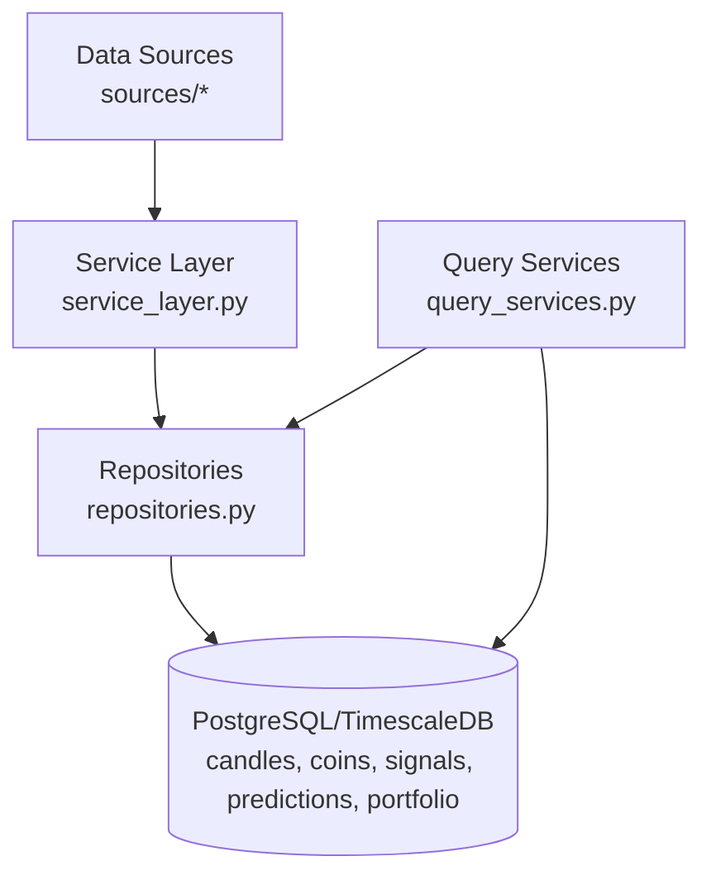
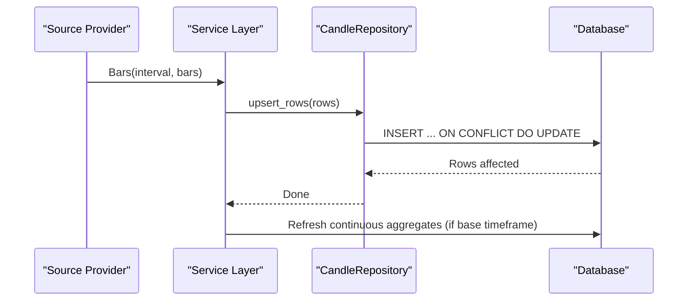
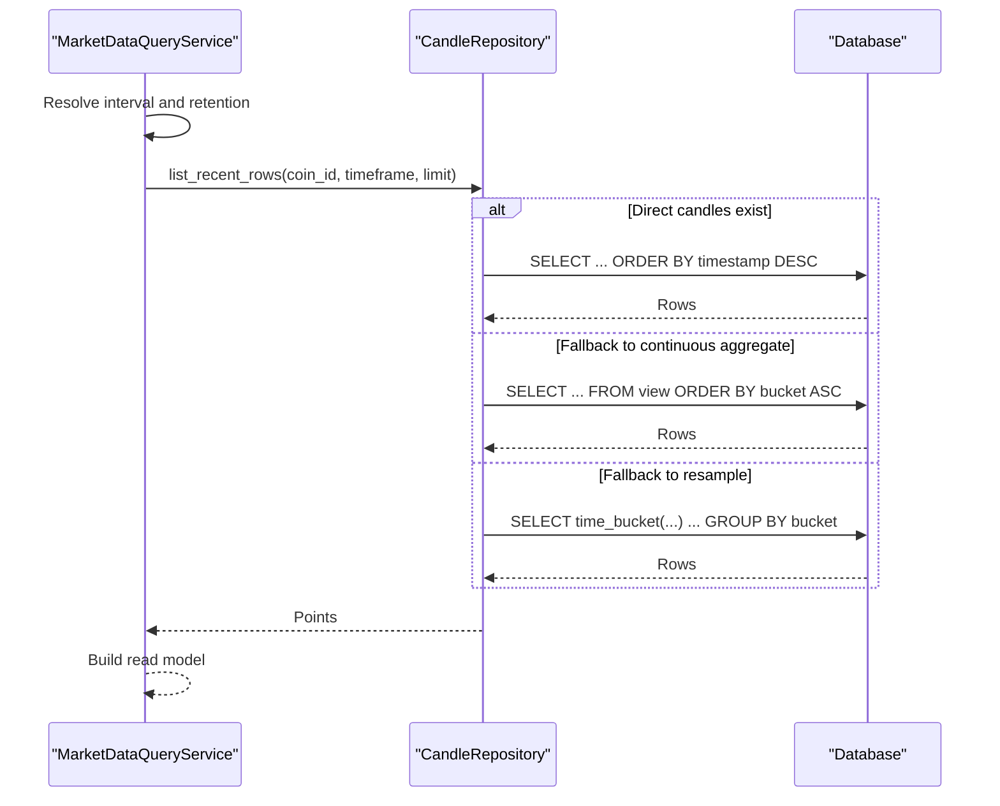
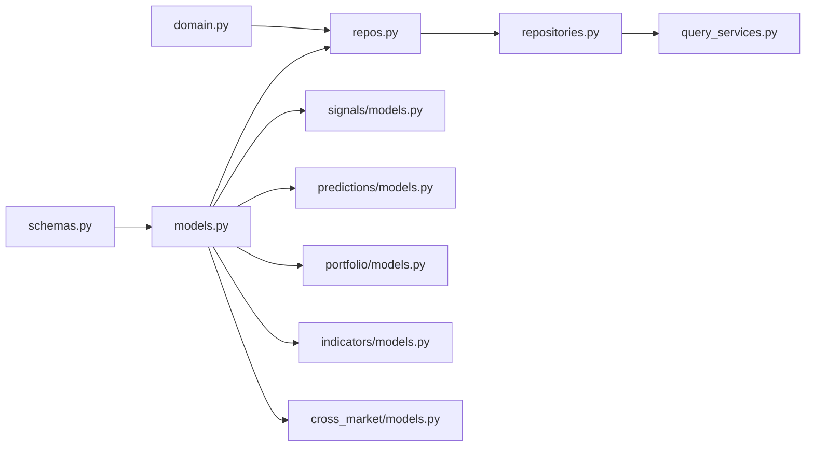

# Data Models and Schema

<cite>
**Referenced Files in This Document**
- [models.py](file://src/apps/market_data/models.py)
- [schemas.py](file://src/apps/market_data/schemas.py)
- [domain.py](file://src/apps/market_data/domain.py)
- [repos.py](file://src/apps/market_data/repos.py)
- [repositories.py](file://src/apps/market_data/repositories.py)
- [query_services.py](file://src/apps/market_data/query_services.py)
- [read_models.py](file://src/apps/market_data/read_models.py)
- [service_layer.py](file://src/apps/market_data/service_layer.py)
- [cross_market/models.py](file://src/apps/cross_market/models.py)
- [indicators/models.py](file://src/apps/indicators/models.py)
- [signals/models.py](file://src/apps/signals/models.py)
- [predictions/models.py](file://src/apps/predictions/models.py)
- [portfolio/models.py](file://src/apps/portfolio/models.py)
- [20260310_000001_initial_schema.py](file://src/migrations/versions/20260310_000001_initial_schema.py)
- [20260311_000008_unify_history_storage.py](file://src/migrations/versions/20260311_000008_unify_history_storage.py)
</cite>

## Table of Contents
1. [Introduction](#introduction)
2. [Project Structure](#project-structure)
3. [Core Components](#core-components)
4. [Architecture Overview](#architecture-overview)
5. [Detailed Component Analysis](#detailed-component-analysis)
6. [Dependency Analysis](#dependency-analysis)
7. [Performance Considerations](#performance-considerations)
8. [Troubleshooting Guide](#troubleshooting-guide)
9. [Conclusion](#conclusion)

## Introduction
This document describes the market data models and schema design for the Iris backend, focusing on the Coin and Candle entities, OHLCV data structure, timeframe handling, indexing strategies, and relational mappings to signals, predictions, and portfolio data. It also documents database constraints, foreign keys, cascading behaviors, validation rules, defaults, and audit fields such as created_at timestamps.

## Project Structure
The market data domain is centered around SQLAlchemy ORM models and supporting utilities for intervals, upserts, and continuous aggregates. Related domains (signals, predictions, portfolio, cross-market, indicators) are integrated via foreign keys and relationships.

```mermaid
graph TB
subgraph "Market Data"
COIN["Coin<br/>coins"]
CANDLE["Candle<br/>candles"]
end
subgraph "Related Domains"
SIGNAL["Signal<br/>signals"]
SIGHIST["SignalHistory<br/>signal_history"]
FINALSIG["FinalSignal<br/>final_signals"]
INVDEC["InvestmentDecision<br/>investment_decisions"]
MKTDEC["MarketDecision<br/>market_decisions"]
RISK["RiskMetric<br/>risk_metrics"]
PRED["MarketPrediction<br/>market_predictions"]
PREDRES["PredictionResult<br/>prediction_results"]
PORTBAL["PortfolioBalance<br/>portfolio_balances"]
PORTPOS["PortfolioPosition<br/>portfolio_positions"]
PORTACT["PortfolioAction<br/>portfolio_actions"]
SECTOR["Sector<br/>sectors"]
COINREL["CoinRelation<br/>coin_relations"]
COINMET["CoinMetrics<br/>coin_metrics"]
FEAT["FeatureSnapshot<br/>feature_snapshots"]
IND["IndicatorCache<br/>indicator_cache"]
end
COIN --- CANDLE
COIN --- SECTOR
COIN --- COINREL
COIN --- COINMET
COIN --- FEAT
COIN --- IND
COIN --- SIGNAL
COIN --- SIGHIST
COIN --- FINALSIG
COIN --- INVDEC
COIN --- MKTDEC
COIN --- RISK
COIN --- PRED
COIN --- PREDRES
COIN --- PORTBAL
COIN --- PORTPOS
COIN --- PORTACT
```

**Diagram sources**
- [models.py:20-164](file://src/apps/market_data/models.py#L20-L164)
- [cross_market/models.py:15-81](file://src/apps/cross_market/models.py#L15-L81)
- [signals/models.py:15-166](file://src/apps/signals/models.py#L15-L166)
- [predictions/models.py:15-66](file://src/apps/predictions/models.py#L15-L66)
- [portfolio/models.py:16-128](file://src/apps/portfolio/models.py#L16-L128)
- [indicators/models.py:15-118](file://src/apps/indicators/models.py#L15-L118)

**Section sources**
- [models.py:20-164](file://src/apps/market_data/models.py#L20-L164)
- [cross_market/models.py:15-81](file://src/apps/cross_market/models.py#L15-L81)
- [signals/models.py:15-166](file://src/apps/signals/models.py#L15-L166)
- [predictions/models.py:15-66](file://src/apps/predictions/models.py#L15-L66)
- [portfolio/models.py:16-128](file://src/apps/portfolio/models.py#L16-L128)
- [indicators/models.py:15-118](file://src/apps/indicators/models.py#L15-L118)

## Core Components
- Coin: Core asset entity with metadata, auto-watch flags, sector linkage, and candle configuration. Includes relationships to candles, signals, predictions, portfolio, and analytics.
- Candle: OHLCV time series record keyed by coin, timeframe, and timestamp. Supports direct storage and continuous aggregates for higher timeframes.

Key constraints and defaults:
- Coins: unique symbol, default asset type "crypto", default theme "core", default source "default", default enabled true, default sort order 0, optional auto-watch fields, JSON candles_config default empty list, created_at server default.
- Candles: composite primary key (coin_id, timeframe, timestamp); timeframe default 15; OHLC mandatory; volume optional; coin_id FK with CASCADE; indexes optimized for queries by coin+timestamp and coin+timeframe+timestamp descending.

OHLCV and timeframe handling:
- OHLCV fields are float with sufficient precision; volume nullable to support zero-volume candles.
- Timeframes are stored as integer minutes (e.g., 15, 60, 240, 1440) with helpers mapping intervals to minutes and aligning timestamps.

Validation and normalization:
- Interval normalization enforces supported intervals and alignment to bucket boundaries.
- Pydantic models validate and normalize coin creation and candle configuration.

**Section sources**
- [models.py:20-164](file://src/apps/market_data/models.py#L20-L164)
- [schemas.py:12-94](file://src/apps/market_data/schemas.py#L12-L94)
- [domain.py:5-49](file://src/apps/market_data/domain.py#L5-L49)
- [repos.py:16-64](file://src/apps/market_data/repos.py#L16-L64)

## Architecture Overview
The market data layer orchestrates ingestion, storage, and retrieval of OHLCV bars. It integrates with continuous aggregates for higher timeframes and supports upserts with conflict resolution. Queries leverage direct tables, materialized views, or resampling depending on availability.

**Diagram sources**
- [service_layer.py:181-200](file://src/apps/market_data/service_layer.py#L181-L200)
- [repositories.py:112-178](file://src/apps/market_data/repositories.py#L112-L178)
- [query_services.py:26-116](file://src/apps/market_data/query_services.py#L26-L116)

## Detailed Component Analysis

### Coin Entity
- Fields: id, symbol (unique), name, asset_type (default "crypto"), theme (default "core"), source (default "default"), enabled (default true), auto_watch_enabled (default false), auto_watch_source (nullable), sort_order (default 0), sector_code (default "infrastructure"), sector_id (FK to sectors), candles_config (JSON list of candle configs), timestamps for backfill and sync, soft-delete marker deleted_at, created_at (server default).
- Relationships:
  - One-to-many to Candle (cascade delete-orphan)
  - Many-to-one to Sector (optional)
  - One-to-one to CoinMetrics (cascade delete-orphan)
  - One-to-many to IndicatorCache, FeatureSnapshot, Signal, SignalHistory, MarketCycle, InvestmentDecision, MarketDecision, RiskMetric, FinalSignal
  - Two-way relations to CoinRelation (leading/following)
  - Two-way relations to MarketPrediction (leader/target)
  - One-to-many to PortfolioBalance, PortfolioPosition, PortfolioAction (cascade delete-orphan)

Constraints and defaults:
- Unique symbol index
- Default values applied at creation
- Soft-deletion via deleted_at

**Section sources**
- [models.py:20-146](file://src/apps/market_data/models.py#L20-L146)
- [cross_market/models.py:15-33](file://src/apps/cross_market/models.py#L15-L33)
- [indicators/models.py:15-62](file://src/apps/indicators/models.py#L15-L62)
- [signals/models.py:15-49](file://src/apps/signals/models.py#L15-L49)
- [predictions/models.py:15-45](file://src/apps/predictions/models.py#L15-L45)
- [portfolio/models.py:48-94](file://src/apps/portfolio/models.py#L48-L94)

### Candle Entity (OHLCV)
- Composite primary key: coin_id (FK to coins, CASCADE), timeframe (int minutes), timestamp (UTC).
- OHLCV fields: open, high, low, close (non-null floats), volume (nullable float).
- Indexes:
  - ix_candles_coin_id_timestamp: for fast lookups by coin+timestamp
  - ix_candles_coin_tf_ts_desc: for reverse-chronological scans by coin/timeframe
- Retrieval and aggregation:
  - Direct table for base timeframe (15m)
  - Continuous aggregates for 1h, 4h, 1d views
  - Resampling via time_bucket when needed

Upsert behavior:
- PostgreSQL ON CONFLICT DO UPDATE on (coin_id, timeframe, timestamp) to handle reorgs and retries.

**Section sources**
- [models.py:148-164](file://src/apps/market_data/models.py#L148-L164)
- [repos.py:24-28](file://src/apps/market_data/repos.py#L24-L28)
- [repositories.py:602-662](file://src/apps/market_data/repositories.py#L602-L662)

### Timeframe Handling and Intervals
- Supported intervals: "15m", "1h", "4h", "1d"
- Mapping: interval → minutes (15, 60, 240, 1440)
- Alignment: timestamps aligned to bucket boundaries
- Window calculation: retention windows computed from interval and retention_bars

**Section sources**
- [domain.py:5-49](file://src/apps/market_data/domain.py#L5-L49)
- [repos.py:16-28](file://src/apps/market_data/repos.py#L16-L28)
- [schemas.py:12-20](file://src/apps/market_data/schemas.py#L12-L20)

### Coin Metadata and Auto-Watch
- Metadata: symbol, name, asset_type, theme, source, sector linkage
- Auto-watch: flags and source to drive watchlist automation
- Sorting: sort_order for presentation ordering
- Validation: symbol normalization to uppercase, interval normalization

**Section sources**
- [models.py:20-40](file://src/apps/market_data/models.py#L20-L40)
- [schemas.py:22-68](file://src/apps/market_data/schemas.py#L22-L68)

### Relational Mappings and Cascades
- Coins to Candles: one-to-many, cascade delete-orphan; cascade on coin deletion handled by FK CASCADE on candle coin_id
- Coins to Signals, SignalHistory, FinalSignal, InvestmentDecision, MarketDecision, RiskMetric: one-to-many, cascade delete-orphan
- Coins to Predictions (leader/target): two separate relations with cascade delete-orphan
- Coins to Portfolio entities: one-to-many, cascade delete-orphan
- Coins to Indicators: one-to-one CoinMetrics, one-to-many IndicatorCache/FeatureSnapshot, cascade delete-orphan
- Cross-market: Coins to Sectors (optional), CoinRelations (many-to-many via coin_relations)

Cascading behaviors:
- Candle coin_id FK: CASCADE
- Signal/SignalHistory/FinalSignal/InvestmentDecision/MarketDecision/RiskMetric/Prediction/PredictionResult/Portfolio entities: CASCADE on coin_id
- Indicator entities: CASCADE on coin_id

**Section sources**
- [models.py:47-146](file://src/apps/market_data/models.py#L47-L146)
- [signals/models.py:15-166](file://src/apps/signals/models.py#L15-L166)
- [predictions/models.py:15-66](file://src/apps/predictions/models.py#L15-L66)
- [portfolio/models.py:48-128](file://src/apps/portfolio/models.py#L48-L128)
- [indicators/models.py:15-118](file://src/apps/indicators/models.py#L15-L118)
- [cross_market/models.py:15-81](file://src/apps/cross_market/models.py#L15-L81)

### Data Validation Rules and Defaults
- Pydantic validation for CoinCreate/CoinRead and CandleConfig
- Interval normalization and validation enforced
- Default values for Coin fields and created_at server default
- Default timeframe 15 for candles

**Section sources**
- [schemas.py:12-94](file://src/apps/market_data/schemas.py#L12-L94)
- [domain.py:23-31](file://src/apps/market_data/domain.py#L23-L31)
- [models.py:26-45](file://src/apps/market_data/models.py#L26-L45)
- [models.py](file://src/apps/market_data/models.py#L156)

### Audit Fields and Timestamps
- created_at: server default CURRENT_TIMESTAMP for coins and most related entities
- last_* sync timestamps and backfill markers for lifecycle tracking
- updated_at for portfolio and indicator entities

**Section sources**
- [models.py:41-45](file://src/apps/market_data/models.py#L41-L45)
- [portfolio/models.py:87-91](file://src/apps/portfolio/models.py#L87-L91)
- [indicators/models.py:56-60](file://src/apps/indicators/models.py#L56-L60)

### Indexing Strategies
- Coins: unique index on symbol
- Candles: composite indexes for coin+timestamp and coin+timeframe+timestamp desc
- Signals: unique and selective indexes for coin/timeframe/timestamp and signal_type
- Portfolio: indexes for performance and uniqueness
- Predictions: indexes for status and evaluation time
- Indicators: indexes for coin+timeframe+timestamp and uniqueness for indicator cache

**Section sources**
- [models.py:150-153](file://src/apps/market_data/models.py#L150-L153)
- [signals/models.py:17-31](file://src/apps/signals/models.py#L17-L31)
- [portfolio/models.py:48-102](file://src/apps/portfolio/models.py#L48-L102)
- [predictions/models.py:17-20](file://src/apps/predictions/models.py#L17-L20)
- [indicators/models.py:88-101](file://src/apps/indicators/models.py#L88-L101)

### Data Flow and Processing Logic

#### Upsert and Aggregation Flow

**Diagram sources**
- [service_layer.py:281-324](file://src/apps/market_data/service_layer.py#L281-L324)
- [repositories.py:646-662](file://src/apps/market_data/repositories.py#L646-L662)
- [repos.py:396-425](file://src/apps/market_data/repos.py#L396-L425)

#### Query Flow for Price History

**Diagram sources**
- [query_services.py:78-116](file://src/apps/market_data/query_services.py#L78-L116)
- [repositories.py:179-277](file://src/apps/market_data/repositories.py#L179-L277)
- [repos.py:326-367](file://src/apps/market_data/repos.py#L326-L367)

## Dependency Analysis
- Domain utilities depend on standardized intervals and alignment helpers.
- Repositories encapsulate SQL logic and leverage continuous aggregates and resampling.
- Query services translate domain needs into efficient queries.
- Models define relationships and constraints; migrations evolve schema over time.

**Diagram sources**
- [domain.py:1-49](file://src/apps/market_data/domain.py#L1-L49)
- [repos.py:1-425](file://src/apps/market_data/repos.py#L1-L425)
- [schemas.py:1-94](file://src/apps/market_data/schemas.py#L1-L94)
- [models.py:1-168](file://src/apps/market_data/models.py#L1-L168)
- [repositories.py:1-800](file://src/apps/market_data/repositories.py#L1-L800)
- [query_services.py:1-210](file://src/apps/market_data/query_services.py#L1-L210)
- [signals/models.py:1-200](file://src/apps/signals/models.py#L1-L200)
- [predictions/models.py:1-69](file://src/apps/predictions/models.py#L1-L69)
- [portfolio/models.py:1-151](file://src/apps/portfolio/models.py#L1-L151)
- [indicators/models.py:1-121](file://src/apps/indicators/models.py#L1-L121)
- [cross_market/models.py:1-84](file://src/apps/cross_market/models.py#L1-L84)

**Section sources**
- [domain.py:1-49](file://src/apps/market_data/domain.py#L1-L49)
- [repos.py:1-425](file://src/apps/market_data/repos.py#L1-L425)
- [schemas.py:1-94](file://src/apps/market_data/schemas.py#L1-L94)
- [models.py:1-168](file://src/apps/market_data/models.py#L1-L168)
- [repositories.py:1-800](file://src/apps/market_data/repositories.py#L1-L800)
- [query_services.py:1-210](file://src/apps/market_data/query_services.py#L1-L210)

## Performance Considerations
- Use continuous aggregates for higher timeframes to accelerate queries.
- Prefer composite indexes on coin_id + timeframe + timestamp for chronological scans.
- Batch upserts to reduce transaction overhead.
- Align timestamps to bucket boundaries to minimize gaps and improve aggregation coverage.
- Limit query sizes using retention_bars derived from candle configs.

[No sources needed since this section provides general guidance]

## Troubleshooting Guide
Common issues and resolutions:
- Unsupported interval: Ensure interval is one of "15m", "1h", "4h", "1d".
- Missing base candles: Verify base timeframe exists before requesting higher timeframes.
- Stale aggregates: Trigger refresh_continuous_aggregate for affected timeframes.
- Upsert conflicts: Expect ON CONFLICT updates; verify timestamps align to buckets.

**Section sources**
- [domain.py:23-31](file://src/apps/market_data/domain.py#L23-L31)
- [repos.py:396-425](file://src/apps/market_data/repos.py#L396-L425)
- [repositories.py:602-662](file://src/apps/market_data/repositories.py#L602-L662)

## Conclusion
The market data schema centers on robust Coin and Candle entities with strong constraints, clear defaults, and comprehensive relationships to signals, predictions, and portfolio domains. Timeframe handling and continuous aggregates enable efficient querying across multiple scales, while validation and normalization ensure data integrity.