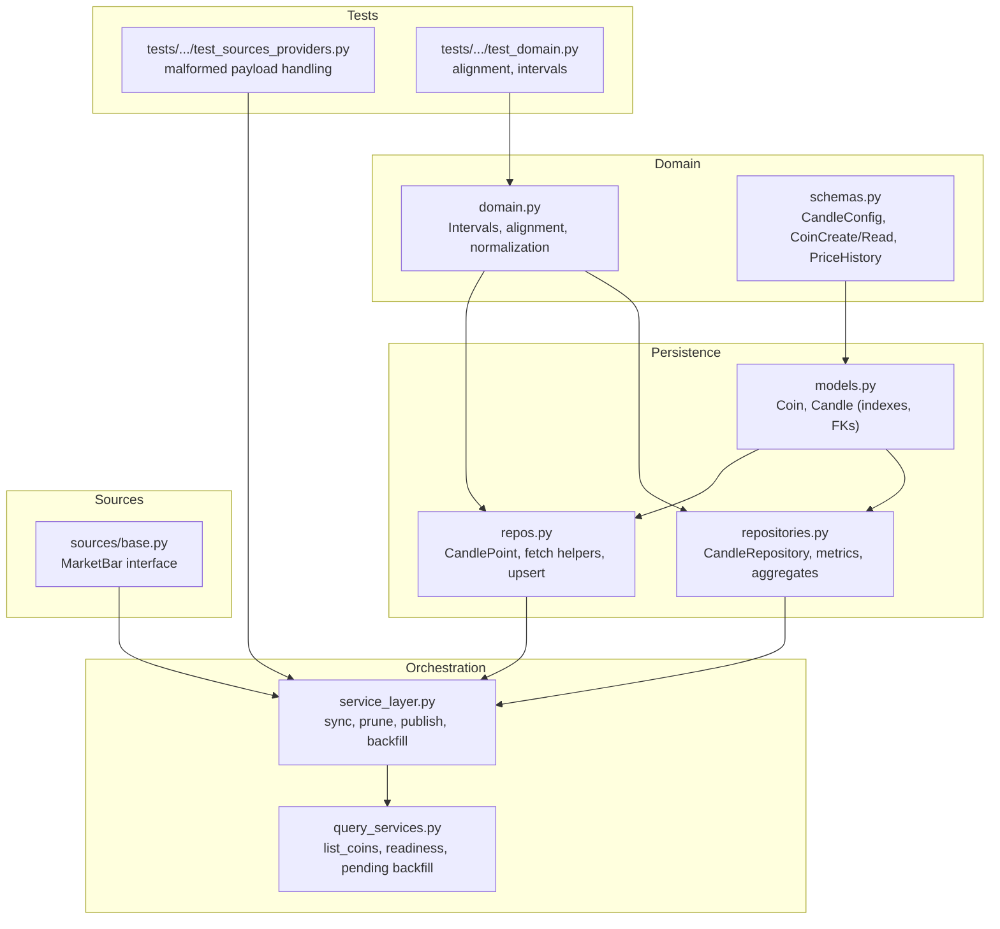
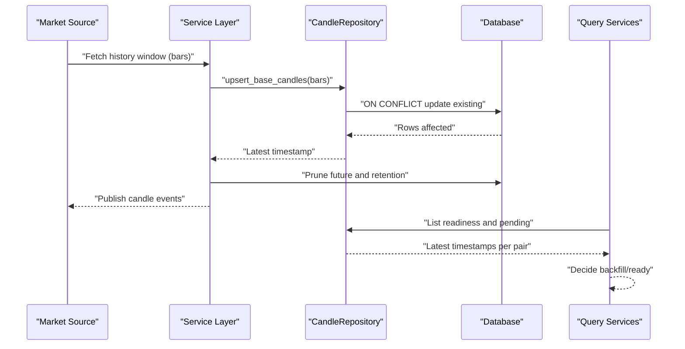
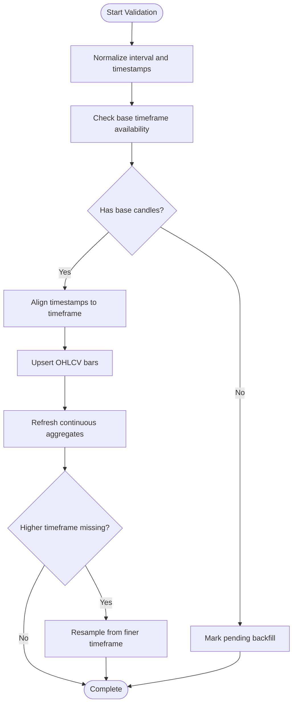
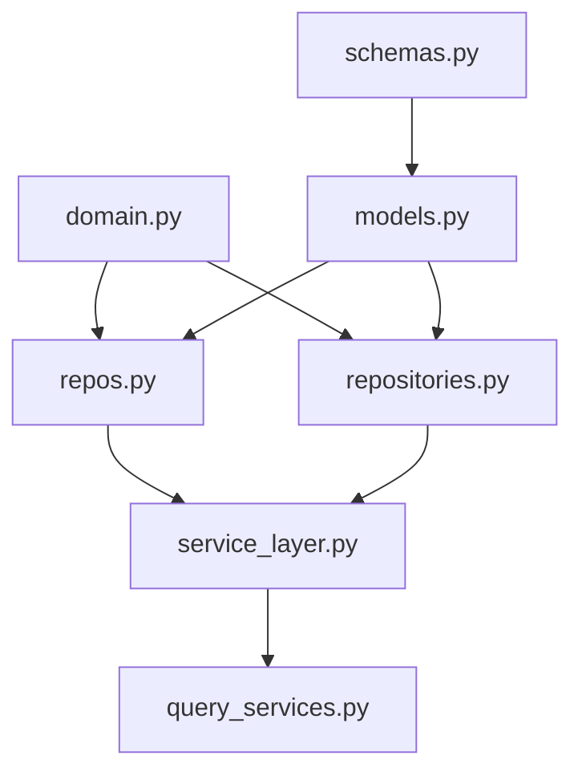

# Data Quality and Validation

<cite>
**Referenced Files in This Document**
- [domain.py](file://src/apps/market_data/domain.py)
- [models.py](file://src/apps/market_data/models.py)
- [schemas.py](file://src/apps/market_data/schemas.py)
- [repos.py](file://src/apps/market_data/repos.py)
- [repositories.py](file://src/apps/market_data/repositories.py)
- [service_layer.py](file://src/apps/market_data/service_layer.py)
- [query_services.py](file://src/apps/market_data/query_services.py)
- [sources/base.py](file://src/apps/market_data/sources/base.py)
- [tests/apps/market_data/test_sources_providers.py](file://tests/apps/market_data/test_sources_providers.py)
- [tests/apps/market_data/test_domain.py](file://tests/apps/market_data/test_domain.py)
- [migrations/versions/20260311_000009_relax_candle_timeframe_constraint.py](file://src/migrations/versions/20260311_000009_relax_candle_timeframe_constraint.py)
- [migrations/versions/20260311_000010_pattern_intelligence_foundation.py](file://src/migrations/versions/20260311_000010_pattern_intelligence_foundation.py)
- [apps/market_structure/services.py](file://src/apps/market_structure/services.py)
</cite>

## Table of Contents
1. [Introduction](#introduction)
2. [Project Structure](#project-structure)
3. [Core Components](#core-components)
4. [Architecture Overview](#architecture-overview)
5. [Detailed Component Analysis](#detailed-component-analysis)
6. [Dependency Analysis](#dependency-analysis)
7. [Performance Considerations](#performance-considerations)
8. [Troubleshooting Guide](#troubleshooting-guide)
9. [Conclusion](#conclusion)

## Introduction
This document explains the data quality assurance and validation systems for OHLCV data in the market data subsystem. It covers domain validation rules for OHLCV, sanity checks, outlier detection, and consistency validation; repository patterns for data integrity, duplicate detection, and gap filling; query services ensuring completeness and accuracy; validation workflows for missing data and invalid timestamps; error reporting mechanisms and metrics; and automated remediation processes. It also addresses exchange-specific quirks, data delays, and reconciliation procedures to maintain integrity across the system.

## Project Structure
The market data domain is organized around:
- Domain utilities for time alignment, normalization, and intervals
- Pydantic schemas for input validation and normalization
- SQLAlchemy models for persistence and indexing
- Repositories and service-layer orchestrators for ingestion, pruning, and aggregation
- Query services for completeness checks and readiness workflows
- Tests validating ingestion robustness against malformed payloads

**Diagram sources**
- [domain.py:1-49](file://src/apps/market_data/domain.py#L1-L49)
- [schemas.py:1-94](file://src/apps/market_data/schemas.py#L1-L94)
- [models.py:148-168](file://src/apps/market_data/models.py#L148-L168)
- [repos.py:32-425](file://src/apps/market_data/repos.py#L32-L425)
- [repositories.py:112-800](file://src/apps/market_data/repositories.py#L112-L800)
- [service_layer.py:1-666](file://src/apps/market_data/service_layer.py#L1-L666)
- [query_services.py:26-210](file://src/apps/market_data/query_services.py#L26-L210)
- [sources/base.py](file://src/apps/market_data/sources/base.py)
- [tests/apps/market_data/test_sources_providers.py:503-529](file://tests/apps/market_data/test_sources_providers.py#L503-L529)
- [tests/apps/market_data/test_domain.py](file://tests/apps/market_data/test_domain.py)

**Section sources**
- [domain.py:1-49](file://src/apps/market_data/domain.py#L1-L49)
- [schemas.py:1-94](file://src/apps/market_data/schemas.py#L1-L94)
- [models.py:148-168](file://src/apps/market_data/models.py#L148-L168)
- [repos.py:32-425](file://src/apps/market_data/repos.py#L32-L425)
- [repositories.py:112-800](file://src/apps/market_data/repositories.py#L112-L800)
- [service_layer.py:1-666](file://src/apps/market_data/service_layer.py#L1-L666)
- [query_services.py:26-210](file://src/apps/market_data/query_services.py#L26-L210)
- [sources/base.py](file://src/apps/market_data/sources/base.py)
- [tests/apps/market_data/test_sources_providers.py:503-529](file://tests/apps/market_data/test_sources_providers.py#L503-L529)
- [tests/apps/market_data/test_domain.py](file://tests/apps/market_data/test_domain.py)

## Core Components
- Domain utilities: enforce UTC normalization, interval normalization, timestamp alignment, and retention windows.
- Schemas: validate and normalize inputs (e.g., interval normalization, symbol normalization).
- Models: define canonical OHLCV storage with composite primary keys and indexes optimized for queries.
- Repositories: encapsulate read/write patterns, conflict resolution via upsert, fallback to continuous aggregates and resampling, and pruning.
- Service layer: orchestrates ingestion, pruning, publishing, and backfill progress calculation.
- Query services: expose readiness and completeness checks for downstream consumers.

Key repository patterns:
- Upsert on coin_id/timeframe/timestamp to handle duplicates and updates atomically.
- Fallback chain: direct table → continuous aggregate view → resample from finer timeframe.
- Pruning: future pruning and retention-based pruning to keep datasets coherent.

**Section sources**
- [domain.py:13-49](file://src/apps/market_data/domain.py#L13-L49)
- [schemas.py:12-94](file://src/apps/market_data/schemas.py#L12-L94)
- [models.py:148-168](file://src/apps/market_data/models.py#L148-L168)
- [repos.py:281-324](file://src/apps/market_data/repos.py#L281-L324)
- [repositories.py:602-663](file://src/apps/market_data/repositories.py#L602-L663)
- [service_layer.py:406-439](file://src/apps/market_data/service_layer.py#L406-L439)
- [query_services.py:118-188](file://src/apps/market_data/query_services.py#L118-L188)

## Architecture Overview
The ingestion and validation pipeline ensures data integrity end-to-end:

**Diagram sources**
- [service_layer.py:526-637](file://src/apps/market_data/service_layer.py#L526-L637)
- [repositories.py:602-663](file://src/apps/market_data/repositories.py#L602-L663)
- [query_services.py:118-188](file://src/apps/market_data/query_services.py#L118-L188)

## Detailed Component Analysis

### Domain Validation Rules for OHLCV
- Interval normalization and validation: intervals are normalized and validated against supported sets; unsupported intervals raise errors.
- Timestamp normalization: timestamps are normalized to UTC and aligned to timeframe boundaries to ensure deterministic bucketing.
- Retention windows: computed from latest completed timestamp minus retention bars to bound queries and pruning consistently.

Validation outcomes:
- Prevents invalid intervals from entering persistence.
- Ensures monotonic, aligned timestamps across timeframes.
- Bounds queries to configured retention windows.

**Section sources**
- [domain.py:23-49](file://src/apps/market_data/domain.py#L23-L49)
- [schemas.py:16-20](file://src/apps/market_data/schemas.py#L16-L20)
- [service_layer.py:477-503](file://src/apps/market_data/service_layer.py#L477-L503)

### Sanity Checks and Outlier Detection
- Continuous aggregate refresh: ensures higher timeframes reflect accurate OHLC aggregations after base candles are inserted.
- Resampling fallback: when direct higher timeframe data is unavailable, resample from the finest available timeframe to fill gaps.
- Robust parsing: tests demonstrate tolerance for malformed payloads and partial entries from external sources.

Operational safeguards:
- Aggregate refresh aligned to bucket boundaries.
- Resampling uses time_bucket grouping to reconstruct OHLCVs.
- Provider parsing filters out bad entries gracefully.

**Section sources**
- [repos.py:396-425](file://src/apps/market_data/repos.py#L396-L425)
- [repos.py:176-251](file://src/apps/market_data/repos.py#L176-L251)
- [tests/apps/market_data/test_sources_providers.py:503-529](file://tests/apps/market_data/test_sources_providers.py#L503-L529)

### Consistency Validation and Repository Patterns
- Composite primary key: coin_id + timeframe + timestamp enforces uniqueness and simplifies conflict resolution.
- Upsert semantics: ON CONFLICT UPDATE ensures idempotent ingestion and handles drift or retractions.
- Indexing: indexes on coin_id/timeframe/timestamp and coin_id/timestamp improve query performance for reads and joins.
- Gap detection: query services compute readiness by checking latest timestamps per base timeframe; missing base candles mark assets as pending backfill.

Automated remediation:
- Backoff and retry scheduling when upstream sources are exhausted.
- Future pruning removes speculative candles beyond the latest completed timestamp.
- Retention pruning deletes outdated candles outside the configured window.

**Section sources**
- [models.py:150-153](file://src/apps/market_data/models.py#L150-L153)
- [repositories.py:602-663](file://src/apps/market_data/repositories.py#L602-L663)
- [query_services.py:118-188](file://src/apps/market_data/query_services.py#L118-L188)
- [service_layer.py:526-637](file://src/apps/market_data/service_layer.py#L526-L637)

### Duplicate Detection and Gap Filling Mechanisms
- Duplicate detection: upsert on primary key prevents duplicates; updates reconcile retractions or corrections.
- Gap filling: fallback to continuous aggregate view and resampling from finer timeframe fills missing higher timeframe buckets.
- Latest timestamp tracking: query services compare latest timestamps per coin/timeframe to decide readiness and backfill needs.

**Section sources**
- [repositories.py:602-663](file://src/apps/market_data/repositories.py#L602-L663)
- [repos.py:326-366](file://src/apps/market_data/repos.py#L326-L366)
- [query_services.py:118-188](file://src/apps/market_data/query_services.py#L118-L188)

### Query Services for Completeness and Accuracy
- List coins and readiness: determine which assets are ready for latest sync and which require backfill.
- Pending backfill computation: compares latest timestamps with base timeframe availability and next sync schedules.
- Read models: convert ORM rows to normalized read models for downstream consumers.

Completeness guarantees:
- Base timeframe presence is required for latest sync readiness.
- Pending backfill symbols are surfaced for orchestration.

**Section sources**
- [query_services.py:55-188](file://src/apps/market_data/query_services.py#L55-L188)
- [service_layer.py:142-169](file://src/apps/market_data/service_layer.py#L142-L169)

### Validation Workflows: Missing Data, Invalid Timestamps, Inconsistent OHLC
- Missing data: readiness checks flag assets without base candles; pending backfill lists identify candidates requiring ingestion.
- Invalid timestamps: normalization to UTC and alignment to timeframe boundaries prevent misaligned buckets.
- Inconsistent OHLC: upsert updates reconcile conflicting bars; continuous aggregate refresh and resampling rebuild higher timeframe OHLCVs consistently.

**Diagram sources**
- [domain.py:17-49](file://src/apps/market_data/domain.py#L17-L49)
- [repos.py:281-324](file://src/apps/market_data/repos.py#L281-L324)
- [repos.py:396-425](file://src/apps/market_data/repos.py#L396-L425)
- [query_services.py:118-188](file://src/apps/market_data/query_services.py#L118-L188)

**Section sources**
- [domain.py:17-49](file://src/apps/market_data/domain.py#L17-L49)
- [repos.py:281-324](file://src/apps/market_data/repos.py#L281-L324)
- [repos.py:396-425](file://src/apps/market_data/repos.py#L396-L425)
- [query_services.py:118-188](file://src/apps/market_data/query_services.py#L118-L188)

### Error Reporting, Metrics, and Automated Remediation
- Error reporting: ingestion backoff records next retry time and reason; quarantine and alerts are surfaced for upstream failures.
- Metrics: observability services track route/consumer health and lag; market structure services generate alert payloads with recommended actions.
- Automated remediation: backoff scheduling, pruning, and resampling reduce manual intervention.

**Section sources**
- [service_layer.py:603-616](file://src/apps/market_data/service_layer.py#L603-L616)
- [apps/market_structure/services.py:834-858](file://src/apps/market_structure/services.py#L834-L858)

### Exchange-Specific Quirks, Delays, and Reconciliation
- Provider parsing robustness: tests show handling of malformed payloads and partial entries.
- Delays and retractions: upsert updates reconcile retractions and delayed corrections.
- Reconciliation: continuous aggregate refresh and resampling reconcile discrepancies across timeframes.

**Section sources**
- [tests/apps/market_data/test_sources_providers.py:503-529](file://tests/apps/market_data/test_sources_providers.py#L503-L529)
- [repos.py:396-425](file://src/apps/market_data/repos.py#L396-L425)
- [repos.py:176-251](file://src/apps/market_data/repos.py#L176-L251)

## Dependency Analysis
The following diagram highlights core dependencies among components involved in data quality and validation:

**Diagram sources**
- [domain.py:1-49](file://src/apps/market_data/domain.py#L1-L49)
- [schemas.py:1-94](file://src/apps/market_data/schemas.py#L1-L94)
- [models.py:148-168](file://src/apps/market_data/models.py#L148-L168)
- [repos.py:32-425](file://src/apps/market_data/repos.py#L32-L425)
- [repositories.py:112-800](file://src/apps/market_data/repositories.py#L112-L800)
- [service_layer.py:1-666](file://src/apps/market_data/service_layer.py#L1-666)
- [query_services.py:26-210](file://src/apps/market_data/query_services.py#L26-L210)

**Section sources**
- [domain.py:1-49](file://src/apps/market_data/domain.py#L1-L49)
- [schemas.py:1-94](file://src/apps/market_data/schemas.py#L1-L94)
- [models.py:148-168](file://src/apps/market_data/models.py#L148-L168)
- [repos.py:32-425](file://src/apps/market_data/repos.py#L32-L425)
- [repositories.py:112-800](file://src/apps/market_data/repositories.py#L112-L800)
- [service_layer.py:1-666](file://src/apps/market_data/service_layer.py#L1-L666)
- [query_services.py:26-210](file://src/apps/market_data/query_services.py#L26-L210)

## Performance Considerations
- Index utilization: composite indexes on coin_id/timeframe/timestamp and coin_id/timestamp optimize reads and upsert conflict resolution.
- Batched upserts: chunked inserts reduce transaction overhead during bulk ingestion.
- Aggregation refresh: aligning refresh windows to bucket boundaries minimizes recomputation.
- Resampling cost: resampling is bounded by retention windows and performed only when necessary.

[No sources needed since this section provides general guidance]

## Troubleshooting Guide
Common issues and resolutions:
- Missing base candles: assets appear pending backfill; trigger backfill or adjust next sync schedule.
- Upstream exhaustion: ingestion returns backoff; wait until retry time or force backfill.
- Stale or quarantined sources: market structure services generate alert payloads with recommended actions; clear errors and release quarantine when appropriate.
- Malformed provider payloads: ingestion tolerates partial entries; verify logs for warnings and retries.

**Section sources**
- [query_services.py:118-188](file://src/apps/market_data/query_services.py#L118-L188)
- [service_layer.py:603-616](file://src/apps/market_data/service_layer.py#L603-L616)
- [apps/market_structure/services.py:834-858](file://src/apps/market_structure/services.py#L834-L858)

## Conclusion
The market data subsystem enforces rigorous data quality through domain normalization, repository upserts, continuous aggregate refresh, and resampling fallbacks. Query services provide completeness checks and readiness signals, while error reporting and remediation automate recovery from upstream issues. Together, these patterns ensure OHLCV integrity across timeframes, handle exchange-specific quirks, and support downstream analytics with consistent, gap-filled data.