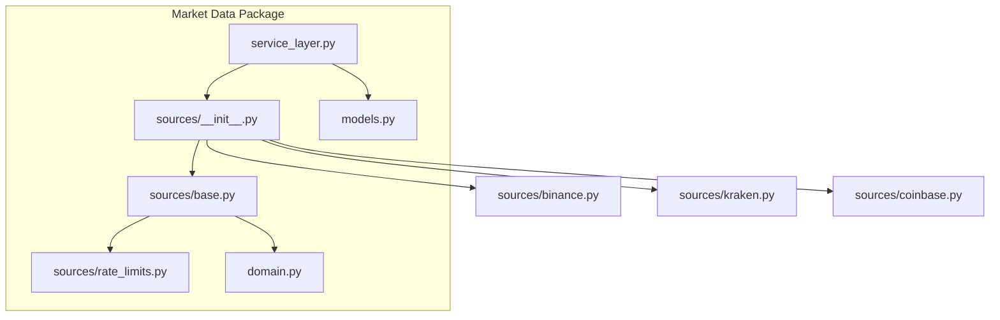
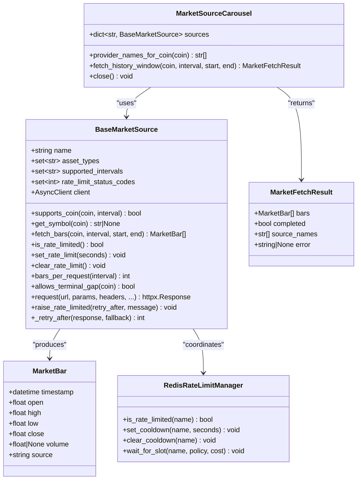
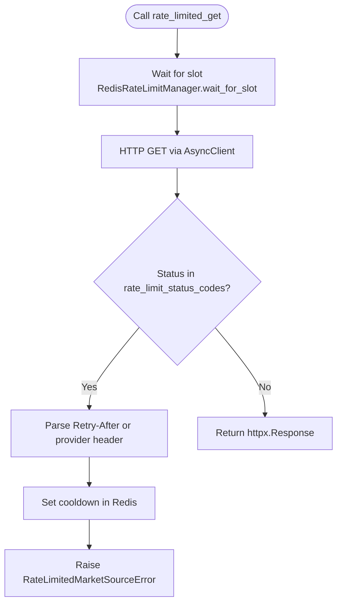
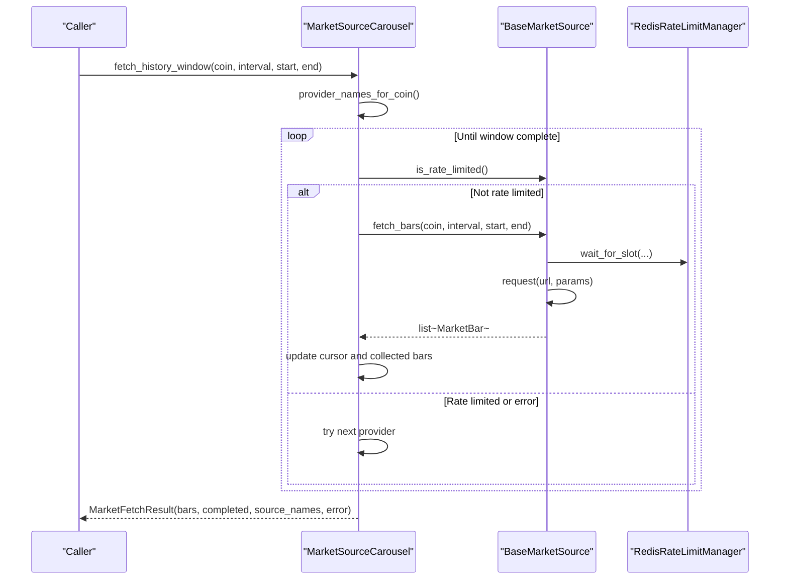
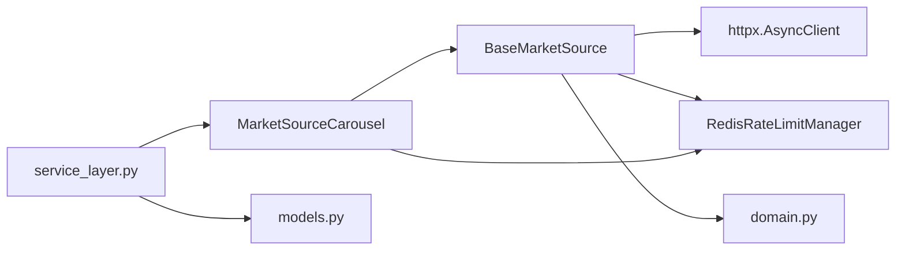

# Base Exchange Interface

<cite>
**Referenced Files in This Document**
- [base.py](file://src/apps/market_data/sources/base.py)
- [rate_limits.py](file://src/apps/market_data/sources/rate_limits.py)
- [domain.py](file://src/apps/market_data/domain.py)
- [models.py](file://src/apps/market_data/models.py)
- [service_layer.py](file://src/apps/market_data/service_layer.py)
- [__init__.py](file://src/apps/market_data/sources/__init__.py)
- [binance.py](file://src/apps/market_data/sources/binance.py)
- [kraken.py](file://src/apps/market_data/sources/kraken.py)
- [coinbase.py](file://src/apps/market_data/sources/coinbase.py)
</cite>

## Table of Contents
1. [Introduction](#introduction)
2. [Project Structure](#project-structure)
3. [Core Components](#core-components)
4. [Architecture Overview](#architecture-overview)
5. [Detailed Component Analysis](#detailed-component-analysis)
6. [Dependency Analysis](#dependency-analysis)
7. [Performance Considerations](#performance-considerations)
8. [Troubleshooting Guide](#troubleshooting-guide)
9. [Conclusion](#conclusion)
10. [Appendices](#appendices)

## Introduction
This document describes the base exchange interface that defines the contract for all market data exchange integrations. It explains the abstract base class structure, common methods for OHLCV data retrieval, authentication handling, and error management. It also documents the client architecture that handles HTTP requests, response parsing, and data transformation, and provides examples of implementing new exchange adapters along with best practices for maintaining consistency across different exchange APIs.

## Project Structure
The market data subsystem organizes exchange adapters under a single package and exposes a carousel that selects appropriate sources per coin and interval. The base interface defines the contract, while rate limiting and domain utilities coordinate timing and normalization.

**Diagram sources**
- [__init__.py:1-198](file://src/apps/market_data/sources/__init__.py#L1-L198)
- [base.py:1-157](file://src/apps/market_data/sources/base.py#L1-L157)
- [rate_limits.py:1-304](file://src/apps/market_data/sources/rate_limits.py#L1-L304)
- [domain.py:1-49](file://src/apps/market_data/domain.py#L1-L49)
- [models.py:1-168](file://src/apps/market_data/models.py#L1-L168)
- [service_layer.py:1-666](file://src/apps/market_data/service_layer.py#L1-L666)
- [binance.py:1-86](file://src/apps/market_data/sources/binance.py#L1-L86)
- [kraken.py:1-92](file://src/apps/market_data/sources/kraken.py#L1-L92)
- [coinbase.py:1-88](file://src/apps/market_data/sources/coinbase.py#L1-L88)

**Section sources**
- [__init__.py:1-198](file://src/apps/market_data/sources/__init__.py#L1-L198)
- [base.py:1-157](file://src/apps/market_data/sources/base.py#L1-L157)
- [rate_limits.py:1-304](file://src/apps/market_data/sources/rate_limits.py#L1-L304)
- [domain.py:1-49](file://src/apps/market_data/domain.py#L1-L49)
- [models.py:1-168](file://src/apps/market_data/models.py#L1-L168)
- [service_layer.py:1-666](file://src/apps/market_data/service_layer.py#L1-L666)

## Core Components
- BaseMarketSource: Abstract interface defining the contract for exchange adapters, including symbol resolution, OHLCV retrieval, rate limiting hooks, and HTTP request abstraction.
- MarketBar: Immutable data structure representing a single OHLCV bar with timestamp, prices, optional volume, and source identifier.
- MarketSourceError family: Specialized exceptions for unsupported queries, temporary transport errors, and rate-limited conditions.
- MarketSourceCarousel: Provider selection and retry loop orchestrator that coordinates multiple sources per coin and interval.
- RateLimitPolicy and RedisRateLimitManager: Centralized rate limiting policy and distributed coordination via Redis.
- Domain utilities: Interval normalization, UTC enforcement, and timestamp alignment helpers.

Key responsibilities:
- Exchange adapters implement symbol mapping, request construction, response parsing, and bar normalization.
- BaseMarketSource encapsulates HTTP client configuration, request wrapper, and rate-limit-aware execution.
- Carousel manages provider rotation, cursor advancement, and error propagation.

**Section sources**
- [base.py:20-157](file://src/apps/market_data/sources/base.py#L20-L157)
- [rate_limits.py:16-304](file://src/apps/market_data/sources/rate_limits.py#L16-L304)
- [domain.py:13-49](file://src/apps/market_data/domain.py#L13-L49)
- [__init__.py:31-198](file://src/apps/market_data/sources/__init__.py#L31-L198)

## Architecture Overview
The system separates concerns across three layers:
- Exchange Adapters: Implement BaseMarketSource to provide exchange-specific logic.
- Base Client: Provides HTTP request abstraction, rate limiting integration, and error translation.
- Orchestrator: MarketSourceCarousel selects providers, advances cursors, and aggregates results.

**Diagram sources**
- [base.py:50-157](file://src/apps/market_data/sources/base.py#L50-L157)
- [rate_limits.py:123-304](file://src/apps/market_data/sources/rate_limits.py#L123-L304)
- [__init__.py:31-198](file://src/apps/market_data/sources/__init__.py#L31-L198)

## Detailed Component Analysis

### BaseMarketSource Contract
- Purpose: Define the interface that all exchange adapters must implement.
- Core methods:
  - get_symbol(coin): Map internal coin symbol to exchange-specific symbol.
  - fetch_bars(coin, interval, start, end): Retrieve OHLCV bars for a given window.
  - bars_per_request(interval): Max bars per request for pagination.
  - supports_coin(coin, interval): Verify capability for asset type, interval, and symbol.
  - allows_terminal_gap(coin): Allow partial completion when trailing gap is acceptable.
  - request(...): Wrapped HTTP GET with integrated rate limiting and error translation.
  - is_rate_limited/set_rate_limit/clear_rate_limit: Coordinated rate limiting hooks.
- HTTP client: AsyncClient configured with timeouts and standard headers.
- Error handling: Translates transport errors into TemporaryMarketSourceError; rate-limit responses raise RateLimitedMarketSourceError.

Implementation patterns:
- Exchange adapters override get_symbol, fetch_bars, bars_per_request, and optionally rate_limit_status_codes.
- request(...) centralizes retries, rate-limit header parsing, and policy-driven delays.

**Section sources**
- [base.py:50-157](file://src/apps/market_data/sources/base.py#L50-L157)

### Rate Limiting Infrastructure
- Policies: Per-source configuration including requests/window, min interval, cost, and fallback retry.
- Manager: Redis-backed coordinator ensuring fair slot allocation and inter-request spacing.
- Integration: rate_limited_get enforces quotas and intervals, sets cooldowns on rate-limit responses, and parses provider-specific headers.

**Diagram sources**
- [rate_limits.py:268-304](file://src/apps/market_data/sources/rate_limits.py#L268-L304)

**Section sources**
- [rate_limits.py:16-304](file://src/apps/market_data/sources/rate_limits.py#L16-L304)

### MarketSourceCarousel Orchestration
- Provider selection: Based on coin.asset_type and coin.source preference.
- Cursor management: Round-robin rotation per (symbol, interval) with lock protection.
- Fetch loop: Attempts each provider until progress is made or exhaustion occurs.
- Error handling: Aggregates last error, returns partial results when terminal gaps are allowed.

**Diagram sources**
- [__init__.py:76-198](file://src/apps/market_data/sources/__init__.py#L76-L198)
- [base.py:111-136](file://src/apps/market_data/sources/base.py#L111-L136)
- [rate_limits.py:169-188](file://src/apps/market_data/sources/rate_limits.py#L169-L188)

**Section sources**
- [__init__.py:39-198](file://src/apps/market_data/sources/__init__.py#L39-L198)

### Exchange Implementations: Patterns and Differences
- BinanceMarketSource:
  - Symbol mapping via dictionary.
  - Bars per request: 1000.
  - Request parameters include startTime/endTime and limit.
  - Handles 400 as unsupported query.
- KrakenMarketSource:
  - Validates maximum span based on bars_per_request and interval.
  - Converts interval to provider granularity.
  - Parses multi-pair responses and filters by timestamp range.
- CoinbaseMarketSource:
  - Uses product-specific symbol format and granularity mapping.
  - Returns most recent bars up to bars_per_request.

Common patterns:
- Normalize interval and timestamps.
- Use request(...) for HTTP calls.
- Raise UnsupportedMarketSourceQuery for unsupported combinations.
- Convert provider JSON to MarketBar list and sort by timestamp.

**Section sources**
- [binance.py:32-86](file://src/apps/market_data/sources/binance.py#L32-L86)
- [kraken.py:33-92](file://src/apps/market_data/sources/kraken.py#L33-L92)
- [coinbase.py:34-88](file://src/apps/market_data/sources/coinbase.py#L34-L88)

### Data Normalization and Time Handling
- Interval normalization ensures consistent representation across adapters.
- UTC enforcement prevents timezone drift during comparisons.
- Timestamp alignment and latest completed timestamp utilities support backfill windows.

**Section sources**
- [domain.py:17-49](file://src/apps/market_data/domain.py#L17-L49)

### Authentication Handling
- Current adapters do not implement API keys or signed requests.
- Authentication hooks are not part of BaseMarketSource; any exchange requiring credentials would extend the interface accordingly.

[No sources needed since this section synthesizes the absence of authentication in current implementations]

## Dependency Analysis
- BaseMarketSource depends on:
  - httpx.AsyncClient for HTTP operations.
  - Rate limiting manager and policy for throttling.
  - Domain utilities for time normalization.
- MarketSourceCarousel depends on:
  - BaseMarketSource implementations.
  - RedisRateLimitManager for distributed coordination.
- Service layer depends on:
  - MarketSourceCarousel for historical data fetching.
  - Models for persistence and metadata.

**Diagram sources**
- [base.py:56-64](file://src/apps/market_data/sources/base.py#L56-L64)
- [rate_limits.py:259-266](file://src/apps/market_data/sources/rate_limits.py#L259-L266)
- [domain.py:1-49](file://src/apps/market_data/domain.py#L1-L49)
- [__init__.py:39-51](file://src/apps/market_data/sources/__init__.py#L39-L51)
- [service_layer.py:550-580](file://src/apps/market_data/service_layer.py#L550-L580)
- [models.py:20-168](file://src/apps/market_data/models.py#L20-L168)

**Section sources**
- [base.py:56-64](file://src/apps/market_data/sources/base.py#L56-L64)
- [rate_limits.py:259-266](file://src/apps/market_data/sources/rate_limits.py#L259-L266)
- [__init__.py:39-51](file://src/apps/market_data/sources/__init__.py#L39-L51)
- [service_layer.py:550-580](file://src/apps/market_data/service_layer.py#L550-L580)
- [models.py:20-168](file://src/apps/market_data/models.py#L20-L168)

## Performance Considerations
- Batch sizing: Use bars_per_request to maximize throughput per adapter.
- Rate limiting: Respect provider limits and policy fallbacks to avoid repeated failures.
- Cursor efficiency: Providers that allow_terminal_gap can complete partial windows faster.
- Time normalization: Align timestamps and intervals to reduce overlap and redundant requests.
- Concurrency: Carousel rotates among providers; ensure adapters are stateless and thread-safe.

[No sources needed since this section provides general guidance]

## Troubleshooting Guide
Common issues and resolutions:
- UnsupportedMarketSourceQuery: Indicates unsupported asset type, interval, or symbol mapping. Verify coin.asset_type, supported_intervals, and get_symbol mapping.
- TemporaryMarketSourceError: Transport or HTTP errors; inspect underlying status codes and logs.
- RateLimitedMarketSourceError: Exceeded rate limits; the system sets cooldown automatically, or use raise_rate_limited to enforce manual delays.
- No bars returned: Some providers require contiguous ranges; consider reducing window or enabling terminal gap allowance.

Operational tips:
- Inspect last_error in MarketFetchResult for carousel diagnostics.
- Monitor Redis cooldown keys for stuck rate limits.
- Validate interval normalization and UTC conversions.

**Section sources**
- [base.py:24-29](file://src/apps/market_data/sources/base.py#L24-L29)
- [base.py:132-136](file://src/apps/market_data/sources/base.py#L132-L136)
- [base.py:137-146](file://src/apps/market_data/sources/base.py#L137-L146)
- [__init__.py:174-181](file://src/apps/market_data/sources/__init__.py#L174-L181)
- [rate_limits.py:136-167](file://src/apps/market_data/sources/rate_limits.py#L136-L167)

## Conclusion
The base exchange interface provides a robust, extensible foundation for integrating diverse market data providers. By adhering to the BaseMarketSource contract, implementing consistent symbol mapping and request/response transformations, and leveraging the built-in rate limiting and carousel orchestration, teams can maintain uniform behavior across heterogeneous APIs while preserving performance and reliability.

[No sources needed since this section summarizes without analyzing specific files]

## Appendices

### Implementing a New Exchange Adapter
Steps:
1. Subclass BaseMarketSource and define name, asset_types, supported_intervals, and base_url.
2. Implement get_symbol to map Coin.symbol to exchange symbol.
3. Implement bars_per_request and fetch_bars:
   - Normalize interval and timestamps.
   - Build provider-specific URL and parameters.
   - Use request(...) for HTTP calls.
   - Parse JSON to MarketBar list and sort by timestamp.
4. Optionally override rate_limit_status_codes and allows_terminal_gap.
5. Register the adapter in MarketSourceCarousel if desired.

Best practices:
- Keep adapters pure and stateless.
- Honor rate limits and respect provider terms.
- Validate inputs and raise appropriate exceptions for unsupported queries.
- Keep interval normalization consistent with domain utilities.

**Section sources**
- [base.py:50-103](file://src/apps/market_data/sources/base.py#L50-L103)
- [binance.py:32-86](file://src/apps/market_data/sources/binance.py#L32-L86)
- [kraken.py:33-92](file://src/apps/market_data/sources/kraken.py#L33-L92)
- [coinbase.py:34-88](file://src/apps/market_data/sources/coinbase.py#L34-L88)
- [__init__.py:39-51](file://src/apps/market_data/sources/__init__.py#L39-L51)