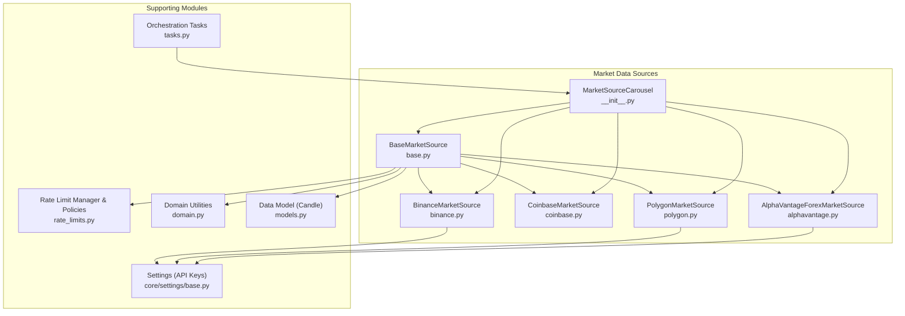
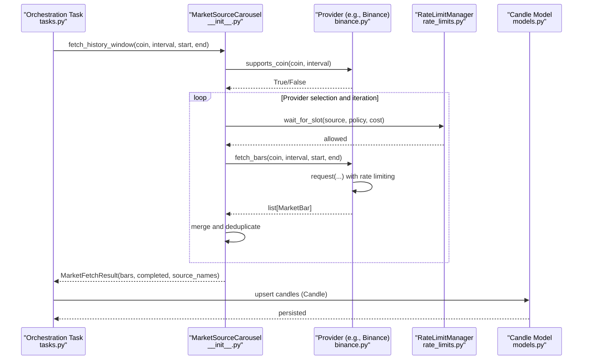
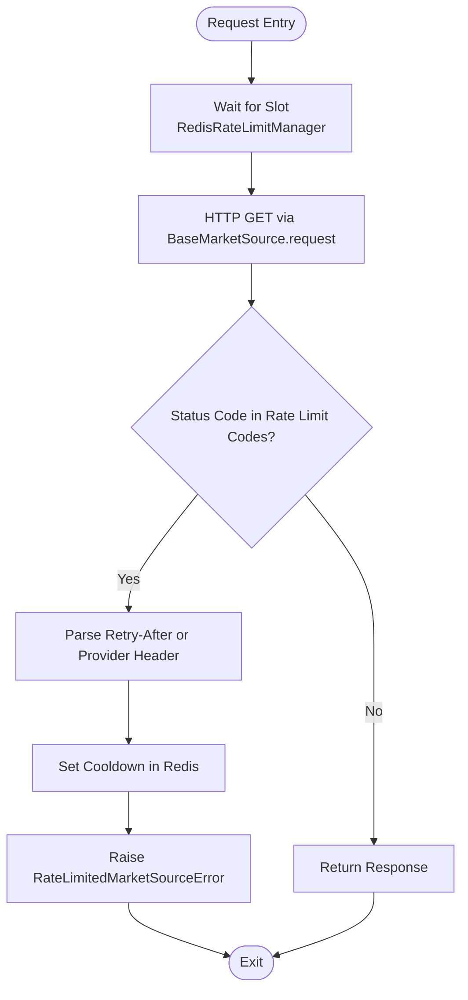
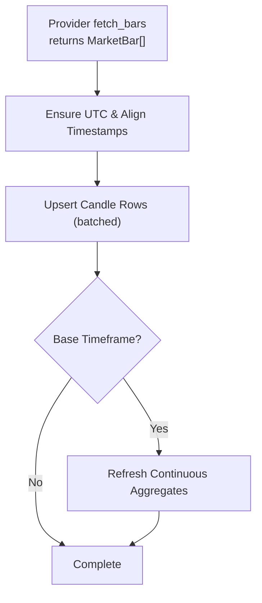
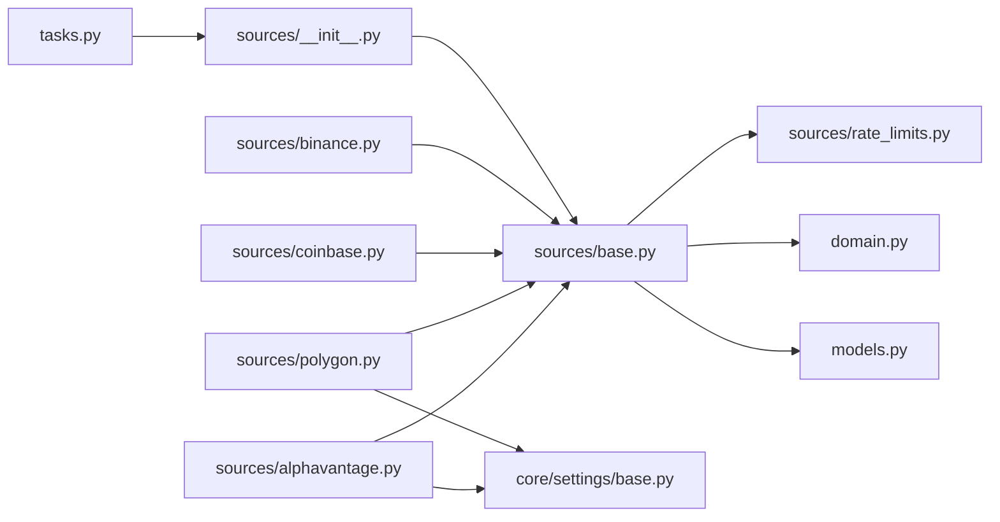

# Exchange Integrations

<cite>
**Referenced Files in This Document**
- [base.py](file://src/apps/market_data/sources/base.py)
- [rate_limits.py](file://src/apps/market_data/sources/rate_limits.py)
- [domain.py](file://src/apps/market_data/domain.py)
- [models.py](file://src/apps/market_data/models.py)
- [__init__.py](file://src/apps/market_data/sources/__init__.py)
- [binance.py](file://src/apps/market_data/sources/binance.py)
- [coinbase.py](file://src/apps/market_data/sources/coinbase.py)
- [polygon.py](file://src/apps/market_data/sources/polygon.py)
- [alphavantage.py](file://src/apps/market_data/sources/alphavantage.py)
- [tasks.py](file://src/apps/market_data/tasks.py)
- [base.py](file://src/core/settings/base.py)
</cite>

## Table of Contents
1. [Introduction](#introduction)
2. [Project Structure](#project-structure)
3. [Core Components](#core-components)
4. [Architecture Overview](#architecture-overview)
5. [Detailed Component Analysis](#detailed-component-analysis)
6. [Dependency Analysis](#dependency-analysis)
7. [Performance Considerations](#performance-considerations)
8. [Troubleshooting Guide](#troubleshooting-guide)
9. [Conclusion](#conclusion)

## Introduction
This document explains the exchange integration system used to synchronize market data for multiple assets across various sources. The system is built around a plugin-based architecture that enables fetching OHLCV (Open, High, Low, Close, Volume) data from multiple cryptocurrency and traditional markets. It includes robust rate limiting, retry and fallback strategies, graceful error handling, and a unified data model for downstream analytics.

## Project Structure
The exchange integrations live under the market data sources package and are composed by a carousel that selects appropriate providers per asset and interval. Supporting modules handle rate limiting, domain utilities, and persistence.

**Diagram sources**
- [base.py:50-157](file://src/apps/market_data/sources/base.py#L50-L157)
- [binance.py:32-86](file://src/apps/market_data/sources/binance.py#L32-L86)
- [coinbase.py:34-88](file://src/apps/market_data/sources/coinbase.py#L34-L88)
- [polygon.py:42-163](file://src/apps/market_data/sources/polygon.py#L42-L163)
- [alphavantage.py:35-223](file://src/apps/market_data/sources/alphavantage.py#L35-L223)
- [__init__.py:39-198](file://src/apps/market_data/sources/__init__.py#L39-L198)
- [rate_limits.py:16-304](file://src/apps/market_data/sources/rate_limits.py#L16-L304)
- [domain.py:1-49](file://src/apps/market_data/domain.py#L1-L49)
- [models.py:148-167](file://src/apps/market_data/models.py#L148-L167)
- [base.py:8-90](file://src/core/settings/base.py#L8-L90)
- [tasks.py:1-235](file://src/apps/market_data/tasks.py#L1-L235)

**Section sources**
- [__init__.py:1-198](file://src/apps/market_data/sources/__init__.py#L1-L198)
- [base.py:1-157](file://src/apps/market_data/sources/base.py#L1-L157)
- [rate_limits.py:1-304](file://src/apps/market_data/sources/rate_limits.py#L1-L304)
- [domain.py:1-49](file://src/apps/market_data/domain.py#L1-L49)
- [models.py:148-167](file://src/apps/market_data/models.py#L148-L167)
- [tasks.py:1-235](file://src/apps/market_data/tasks.py#L1-L235)
- [base.py:1-90](file://src/core/settings/base.py#L1-L90)

## Core Components
- BaseMarketSource: Defines the common interface for all market sources, including symbol resolution, OHLCV fetching, rate limiting hooks, and request helpers.
- MarketSourceCarousel: A provider selector that iterates through compatible sources per coin and interval, with cursor-based rotation and fallback logic.
- RateLimitManager: Centralized rate limiting using Redis with window-based quotas, minimum intervals, and cooldowns.
- Domain utilities: Interval normalization, alignment, and timestamps.
- Data model: Unified Candle entity persisted to the database.
- Orchestration tasks: Backfill and latest history synchronization jobs that drive the carousel and persist results.

Key responsibilities:
- Symbol mapping and interval support per provider
- Request shaping and pagination limits
- Robust error classification and retry/backoff
- Graceful degradation when providers are unavailable
- Normalization into the unified IRIS Candle model

**Section sources**
- [base.py:50-157](file://src/apps/market_data/sources/base.py#L50-L157)
- [__init__.py:39-198](file://src/apps/market_data/sources/__init__.py#L39-L198)
- [rate_limits.py:16-304](file://src/apps/market_data/sources/rate_limits.py#L16-L304)
- [domain.py:1-49](file://src/apps/market_data/domain.py#L1-L49)
- [models.py:148-167](file://src/apps/market_data/models.py#L148-L167)
- [tasks.py:1-235](file://src/apps/market_data/tasks.py#L1-L235)

## Architecture Overview
The system orchestrates data fetching via a carousel that selects the best provider for a given coin and interval. Providers implement BaseMarketSource and encapsulate API specifics. Requests are wrapped with rate limiting and error handling. Fetched bars are normalized and upserted into the Candle model.

**Diagram sources**
- [tasks.py:74-171](file://src/apps/market_data/tasks.py#L74-L171)
- [__init__.py:76-187](file://src/apps/market_data/sources/__init__.py#L76-L187)
- [binance.py:45-86](file://src/apps/market_data/sources/binance.py#L45-L86)
- [rate_limits.py:268-304](file://src/apps/market_data/sources/rate_limits.py#L268-L304)
- [models.py:148-167](file://src/apps/market_data/models.py#L148-L167)

## Detailed Component Analysis

### BaseMarketSource and MarketBar
- Provides the contract for symbol resolution, OHLCV retrieval, and rate limiting helpers.
- Encapsulates HTTP client configuration, timeouts, and a standardized request wrapper.
- Defines MarketBar as the normalized OHLCV record with source attribution.

Implementation highlights:
- supports_coin validates asset type, interval support, and symbol availability.
- fetch_bars is the core method to be implemented by each provider.
- request wraps httpx.AsyncClient with rate-limited execution and error translation.
- bars_per_request defines pagination limits per provider and interval.
- allows_terminal_gap indicates whether a provider can return partial data at the end boundary.

**Section sources**
- [base.py:50-157](file://src/apps/market_data/sources/base.py#L50-L157)

### MarketSourceCarousel
- Maintains a registry of providers and rotates among them per coin and interval.
- Determines provider preference based on coin.source and asset type.
- Iteratively fetches data windows, tracks progress, and aggregates results.
- Handles rate limiting, unsupported queries, temporary failures, and terminal gaps.

Key behaviors:
- Cursor-based rotation ensures fair sharing across providers.
- Attempts without progress trigger fallback and eventual completion reporting.
- Returns a MarketFetchResult with bars, completion flag, and used sources.

**Section sources**
- [__init__.py:39-198](file://src/apps/market_data/sources/__init__.py#L39-L198)

### Rate Limiting and Retry Strategy
- Centralized via RedisRateLimitManager with window-based quotas and minimum intervals.
- Policies define requests per window, min interval, fallback retry seconds, and cost.
- rate_limited_get enforces slot availability and translates provider throttling into RateLimitedMarketSourceError.
- Providers can override fallback_retry_after_seconds for specific endpoints.

**Diagram sources**
- [rate_limits.py:268-304](file://src/apps/market_data/sources/rate_limits.py#L268-L304)
- [base.py:111-157](file://src/apps/market_data/sources/base.py#L111-L157)

**Section sources**
- [rate_limits.py:16-304](file://src/apps/market_data/sources/rate_limits.py#L16-L304)
- [base.py:89-157](file://src/apps/market_data/sources/base.py#L89-L157)

### Data Normalization and Persistence
- Domain utilities normalize intervals, align timestamps, and compute retention windows.
- MarketBar instances are transformed into Candle entities and upserted in batches.
- Continuous aggregates are refreshed for base timeframe to accelerate analytics.

**Diagram sources**
- [domain.py:17-49](file://src/apps/market_data/domain.py#L17-L49)
- [models.py:148-167](file://src/apps/market_data/models.py#L148-L167)
- [tasks.py:597-639](file://src/apps/market_data/tasks.py#L597-L639)

**Section sources**
- [domain.py:1-49](file://src/apps/market_data/domain.py#L1-L49)
- [models.py:148-167](file://src/apps/market_data/models.py#L148-L167)
- [tasks.py:597-639](file://src/apps/market_data/tasks.py#L597-L639)

### Provider Implementations

#### Binance
- Supports crypto pairs with standard intervals.
- Uses klines endpoint with pagination limit and UTC timestamps.
- Maps common symbols to Binance’s USDT variants.

**Section sources**
- [binance.py:32-86](file://src/apps/market_data/sources/binance.py#L32-L86)

#### Coinbase
- Supports crypto candles with granularities mapped to exchange-specific values.
- Uses products/{symbol}/candles endpoint with ISO start/end.

**Section sources**
- [coinbase.py:34-88](file://src/apps/market_data/sources/coinbase.py#L34-L88)

#### Polygon
- Supports indices and forex with multipliers and timespans.
- Requires API key and handles authorization errors distinctly.
- Resamples 4-hour bars by grouping and aggregating.

**Section sources**
- [polygon.py:42-163](file://src/apps/market_data/sources/polygon.py#L42-L163)

#### AlphaVantage (Forex)
- Requires API key and supports daily and intraday forex pairs.
- Implements terminal gap allowance and resampling for 4h.
- Parses provider-specific error messages and rate limit hints.

**Section sources**
- [alphavantage.py:35-223](file://src/apps/market_data/sources/alphavantage.py#L35-L223)

### Authentication and Security
- API keys are loaded from settings and injected into provider requests.
- Settings include dedicated keys for Polygon, Twelve Data, and Alpha Vantage.
- Environment-based configuration via pydantic settings with caching.

Security considerations:
- API keys are stored in environment variables and accessed through a centralized settings object.
- Requests include a standard User-Agent header for provider visibility.
- Unauthorized or invalid keys lead to UnsupportedMarketSourceQuery to prevent retries.

**Section sources**
- [base.py:8-90](file://src/core/settings/base.py#L8-L90)
- [polygon.py:48-50](file://src/apps/market_data/sources/polygon.py#L48-L50)
- [alphavantage.py:41-43](file://src/apps/market_data/sources/alphavantage.py#L41-L43)

### Error Handling, Timeouts, and Graceful Degradation
- MarketSourceError subclasses classify issues:
  - UnsupportedMarketSourceQuery: invalid symbols/intervals or unauthorized.
  - TemporaryMarketSourceError: transient transport/network issues.
  - RateLimitedMarketSourceError: throttled by provider or policy.
- BaseMarketSource.request converts transport errors into TemporaryMarketSourceError.
- Carousel tolerates transient failures and falls back to alternate providers.
- Terminal gap allowance permits partial completion when a provider cannot supply the final segment.

**Section sources**
- [base.py:20-157](file://src/apps/market_data/sources/base.py#L20-L157)
- [__init__.py:113-187](file://src/apps/market_data/sources/__init__.py#L113-L187)

## Dependency Analysis
The following diagram shows how the core modules depend on each other to implement the exchange integration system.

**Diagram sources**
- [tasks.py:1-235](file://src/apps/market_data/tasks.py#L1-L235)
- [__init__.py:1-198](file://src/apps/market_data/sources/__init__.py#L1-L198)
- [base.py:1-157](file://src/apps/market_data/sources/base.py#L1-L157)
- [rate_limits.py:1-304](file://src/apps/market_data/sources/rate_limits.py#L1-L304)
- [domain.py:1-49](file://src/apps/market_data/domain.py#L1-L49)
- [models.py:148-167](file://src/apps/market_data/models.py#L148-L167)
- [binance.py:1-86](file://src/apps/market_data/sources/binance.py#L1-L86)
- [coinbase.py:1-88](file://src/apps/market_data/sources/coinbase.py#L1-L88)
- [polygon.py:1-163](file://src/apps/market_data/sources/polygon.py#L1-L163)
- [alphavantage.py:1-223](file://src/apps/market_data/sources/alphavantage.py#L1-L223)
- [base.py:1-90](file://src/core/settings/base.py#L1-L90)

**Section sources**
- [tasks.py:1-235](file://src/apps/market_data/tasks.py#L1-L235)
- [__init__.py:1-198](file://src/apps/market_data/sources/__init__.py#L1-L198)
- [base.py:1-157](file://src/apps/market_data/sources/base.py#L1-L157)
- [rate_limits.py:1-304](file://src/apps/market_data/sources/rate_limits.py#L1-L304)
- [domain.py:1-49](file://src/apps/market_data/domain.py#L1-L49)
- [models.py:148-167](file://src/apps/market_data/models.py#L148-L167)
- [binance.py:1-86](file://src/apps/market_data/sources/binance.py#L1-L86)
- [coinbase.py:1-88](file://src/apps/market_data/sources/coinbase.py#L1-L88)
- [polygon.py:1-163](file://src/apps/market_data/sources/polygon.py#L1-L163)
- [alphavantage.py:1-223](file://src/apps/market_data/sources/alphavantage.py#L1-L223)
- [base.py:1-90](file://src/core/settings/base.py#L1-L90)

## Performance Considerations
- Batched upserts reduce database overhead during backfills.
- Continuous aggregates are refreshed only for base timeframe to optimize analytics queries.
- Provider-specific pagination limits minimize request counts and avoid over-fetching.
- Rate limiting prevents provider throttling and reduces retry storms.
- Cursor rotation balances load across providers and improves resilience.

[No sources needed since this section provides general guidance]

## Troubleshooting Guide
Common scenarios and resolutions:
- Rate limited: The system sets a cooldown and raises a RateLimitedMarketSourceError. Adjust fallback retry seconds or switch providers.
- Unsupported symbol/interval: UnsupportedMarketSourceQuery indicates the provider does not support the requested combination.
- Temporary failure: Transport or HTTP errors are wrapped as TemporaryMarketSourceError; retry after backoff.
- Provider exhaustion: If multiple providers fail consecutively, the carousel returns partial results and a descriptive error.

Operational tips:
- Verify API keys in environment settings for Polygon, Twelve Data, and Alpha Vantage.
- Monitor Redis connectivity for rate limiting to remain effective.
- Inspect MarketFetchResult.source_names to identify which providers were used.

**Section sources**
- [base.py:20-157](file://src/apps/market_data/sources/base.py#L20-L157)
- [rate_limits.py:268-304](file://src/apps/market_data/sources/rate_limits.py#L268-L304)
- [__init__.py:174-187](file://src/apps/market_data/sources/__init__.py#L174-L187)

## Conclusion
The exchange integration system provides a scalable, resilient, and normalized pipeline for collecting OHLCV data from multiple providers. Its plugin-based architecture, robust rate limiting, and graceful error handling ensure reliable operation across diverse market data sources. By adhering to the unified Candle model and leveraging continuous aggregates, downstream analytics benefit from consistent, high-quality historical and real-time data.