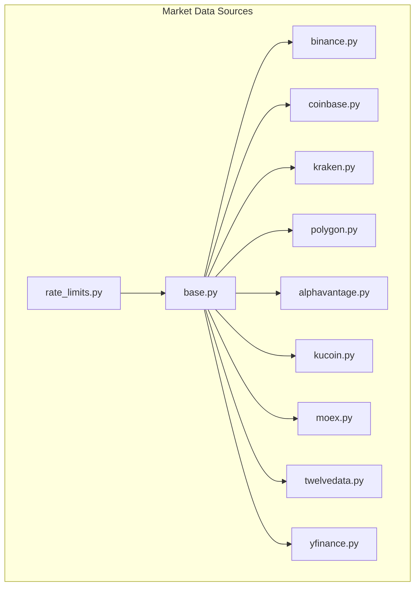
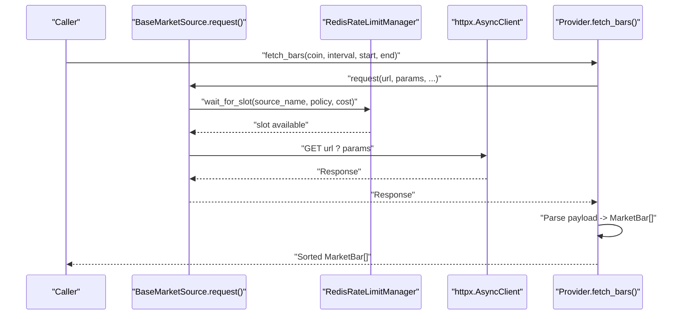
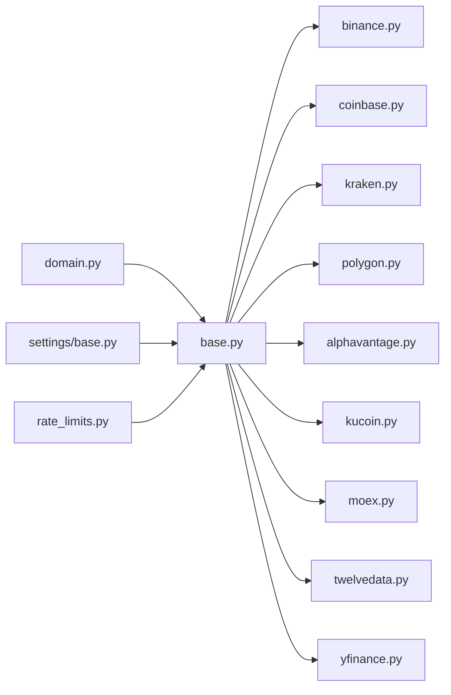

# Individual Exchange Implementations

<cite>
**Referenced Files in This Document**
- [base.py](file://src/apps/market_data/sources/base.py)
- [binance.py](file://src/apps/market_data/sources/binance.py)
- [coinbase.py](file://src/apps/market_data/sources/coinbase.py)
- [kraken.py](file://src/apps/market_data/sources/kraken.py)
- [polygon.py](file://src/apps/market_data/sources/polygon.py)
- [alphavantage.py](file://src/apps/market_data/sources/alphavantage.py)
- [kucoin.py](file://src/apps/market_data/sources/kucoin.py)
- [moex.py](file://src/apps/market_data/sources/moex.py)
- [twelvedata.py](file://src/apps/market_data/sources/twelvedata.py)
- [yfinance.py](file://src/apps/market_data/sources/yfinance.py)
- [rate_limits.py](file://src/apps/market_data/sources/rate_limits.py)
- [domain.py](file://src/apps/market_data/domain.py)
- [models.py](file://src/apps/market_data/models.py)
- [base.py](file://src/core/settings/base.py)
</cite>

## Table of Contents
1. [Introduction](#introduction)
2. [Project Structure](#project-structure)
3. [Core Components](#core-components)
4. [Architecture Overview](#architecture-overview)
5. [Detailed Component Analysis](#detailed-component-analysis)
6. [Dependency Analysis](#dependency-analysis)
7. [Performance Considerations](#performance-considerations)
8. [Troubleshooting Guide](#troubleshooting-guide)
9. [Conclusion](#conclusion)

## Introduction
This document provides a comprehensive, code-sourced guide to each individual exchange implementation within the market data subsystem. It covers API characteristics, authentication methods, data formats, exchange-specific features (such as rate limits and resampling), and the normalization pipeline that converts provider-specific responses into the unified MarketBar format used across IRIS. Configuration requirements, API key setup, and error handling patterns are documented for each provider.

## Project Structure
The market data sources are organized under a single package with one class per provider. Each class inherits from a shared base class and implements provider-specific endpoints, symbol mapping, intervals, and response parsing. A central rate limiting framework coordinates provider quotas and pacing.

**Diagram sources**
- [base.py:50-157](file://src/apps/market_data/sources/base.py#L50-L157)
- [binance.py:32-86](file://src/apps/market_data/sources/binance.py#L32-L86)
- [coinbase.py:34-88](file://src/apps/market_data/sources/coinbase.py#L34-L88)
- [kraken.py:33-92](file://src/apps/market_data/sources/kraken.py#L33-L92)
- [polygon.py:42-163](file://src/apps/market_data/sources/polygon.py#L42-L163)
- [alphavantage.py:35-223](file://src/apps/market_data/sources/alphavantage.py#L35-L223)
- [kucoin.py:39-93](file://src/apps/market_data/sources/kucoin.py#L39-L93)
- [moex.py:35-133](file://src/apps/market_data/sources/moex.py#L35-L133)
- [twelvedata.py:45-163](file://src/apps/market_data/sources/twelvedata.py#L45-L163)
- [yfinance.py:61-180](file://src/apps/market_data/sources/yfinance.py#L61-L180)
- [rate_limits.py:123-304](file://src/apps/market_data/sources/rate_limits.py#L123-L304)

**Section sources**
- [base.py:50-157](file://src/apps/market_data/sources/base.py#L50-L157)
- [rate_limits.py:34-104](file://src/apps/market_data/sources/rate_limits.py#L34-L104)

## Core Components
- BaseMarketSource: Defines the common interface, HTTP client, rate limiting integration, and shared helpers for symbol resolution, interval normalization, and pagination.
- MarketBar: The normalized candle data structure used across all providers.
- RateLimitPolicy and RedisRateLimitManager: Centralized rate limiting with provider-specific policies and Redis-backed coordination.

Key behaviors:
- Symbol mapping via provider-specific dictionaries.
- Interval normalization and enforcement.
- Request batching and pagination with provider-specific constraints.
- Error categorization into UnsupportedMarketSourceQuery and TemporaryMarketSourceError, with explicit rate limit handling.

**Section sources**
- [base.py:39-157](file://src/apps/market_data/sources/base.py#L39-L157)
- [domain.py:23-49](file://src/apps/market_data/domain.py#L23-L49)
- [rate_limits.py:16-104](file://src/apps/market_data/sources/rate_limits.py#L16-L104)

## Architecture Overview
The exchange implementations share a common request pipeline that enforces rate limits, handles retries, and parses responses into MarketBar objects. Providers may override request parameters, symbol mapping, and post-processing steps (e.g., resampling).

**Diagram sources**
- [base.py:111-136](file://src/apps/market_data/sources/base.py#L111-L136)
- [rate_limits.py:268-304](file://src/apps/market_data/sources/rate_limits.py#L268-L304)

## Detailed Component Analysis

### Binance
- Authentication: None. Public REST endpoint.
- Endpoint: REST OHLC endpoint for klines.
- Parameters:
  - symbol: mapped via internal dictionary.
  - interval: normalized to supported values.
  - startTime/endTime: milliseconds since epoch.
  - limit: capped by provider constraints.
- Response parsing: Converts array items to MarketBar with open/high/low/close/volume.
- Rate limits: Uses status codes indicating throttling; applies cooldown via rate limiter.
- Notes: Supports crypto assets; uses bars_per_request cap.

**Section sources**
- [binance.py:32-86](file://src/apps/market_data/sources/binance.py#L32-L86)
- [rate_limits.py:34-44](file://src/apps/market_data/sources/rate_limits.py#L34-L44)

### Coinbase
- Authentication: None. Public REST endpoint.
- Endpoint: products/{pair}/candles.
- Parameters:
  - granularity: derived from normalized interval.
  - start/end: ISO format with Z suffix.
- Response parsing: Reorders fields to OHLC; caps by bars_per_request.
- Notes: Supports crypto assets; uses granular intervals.

**Section sources**
- [coinbase.py:34-88](file://src/apps/market_data/sources/coinbase.py#L34-L88)
- [rate_limits.py:44-51](file://src/apps/market_data/sources/rate_limits.py#L44-L51)

### Kraken
- Authentication: None. Public REST endpoint.
- Endpoint: OHLC data endpoint.
- Parameters:
  - pair: mapped symbol.
  - interval: minutes-based mapping.
  - since: Unix timestamp.
- Backfill constraint: Enforces maximum span based on interval and bars_per_request.
- Response parsing: Extracts OHLC and volume; filters by requested range.
- Notes: Supports crypto assets.

**Section sources**
- [kraken.py:33-92](file://src/apps/market_data/sources/kraken.py#L33-L92)
- [rate_limits.py:58-65](file://src/apps/market_data/sources/rate_limits.py#L58-L65)

### Polygon
- Authentication: Requires API key from settings.
- Endpoint: Aggregates endpoint with ticker range queries.
- Parameters:
  - apiKey: injected from settings.
  - sort, limit, adjusted: standardized.
  - Multiplier and timespan derived from normalized interval.
- Error handling: Distinguishes unauthorized vs. other errors; raises UnsupportedMarketSourceQuery for auth failures.
- Post-processing: Resamples 4h bars by aligning timestamps and aggregating OHLC and volume.
- Notes: Supports forex and index assets.

**Section sources**
- [polygon.py:42-163](file://src/apps/market_data/sources/polygon.py#L42-L163)
- [base.py:22-22](file://src/core/settings/base.py#L22-L22)
- [rate_limits.py:51-58](file://src/apps/market_data/sources/rate_limits.py#L51-L58)

### AlphaVantage (Forex)
- Authentication: Requires API key from settings.
- Endpoint: FX intraday and FX daily functions.
- Parameters:
  - from_symbol, to_symbol, function type, outputsize.
  - API key injected.
- Error handling:
  - Detects rate limit notices and premium/free tier limitations.
  - Raises UnsupportedMarketSourceQuery for unsupported endpoints or invalid keys.
- Post-processing: Resamples 4h bars; daily and intraday payloads parsed differently.
- Notes: Supports selected forex pairs; daily only among the listed intervals.

**Section sources**
- [alphavantage.py:35-223](file://src/apps/market_data/sources/alphavantage.py#L35-L223)
- [base.py:24-24](file://src/core/settings/base.py#L24-L24)
- [rate_limits.py:79-84](file://src/apps/market_data/sources/rate_limits.py#L79-L84)

### KuCoin
- Authentication: None. Public REST endpoint.
- Endpoint: Market candles endpoint.
- Parameters:
  - symbol: mapped symbol.
  - type: interval string.
  - startAt/endAt: Unix timestamps.
- Error handling: Checks explicit success code in payload; raises on non-success.
- Post-processing: Caps by bars_per_request and sorts by timestamp.
- Notes: Supports crypto assets.

**Section sources**
- [kucoin.py:39-93](file://src/apps/market_data/sources/kucoin.py#L39-L93)
- [rate_limits.py:65-72](file://src/apps/market_data/sources/rate_limits.py#L65-L72)

### MOEX (Russia)
- Authentication: None. Public ISS endpoint.
- Endpoint: Iss engine for index candles.
- Parameters:
  - from/till: date strings.
  - interval: minutes mapping.
  - start: pagination offset.
- Pagination: Iterates until fewer than page size items are returned.
- Post-processing: Resamples 4h bars; tolerates missing fields by falling back to open.
- Notes: Supports index assets; allows terminal gaps.

**Section sources**
- [moex.py:35-133](file://src/apps/market_data/sources/moex.py#L35-L133)
- [rate_limits.py:92-97](file://src/apps/market_data/sources/rate_limits.py#L92-L97)

### Twelve Data
- Authentication: Requires API key from settings; sets Authorization header.
- Endpoint: Time series endpoint.
- Parameters:
  - symbol: resolved from candidates or coin symbol.
  - interval, start_date, end_date, timezone, order, format, outputsize.
- Error handling:
  - Detects rate limit and upgrade-related messages.
  - Attempts alternate symbols if initial request fails.
- Post-processing: Filters by requested range; allows terminal gaps.
- Notes: Supports forex, index, and metal assets.

**Section sources**
- [twelvedata.py:45-163](file://src/apps/market_data/sources/twelvedata.py#L45-L163)
- [base.py:23-23](file://src/core/settings/base.py#L23-L23)
- [rate_limits.py:72-78](file://src/apps/market_data/sources/rate_limits.py#L72-L78)

### Yahoo Finance
- Authentication: None. Public chart endpoint.
- Endpoint: Chart endpoint with period1/period2 and interval.
- Parameters:
  - period1/period2: Unix timestamps; period2 extended by one interval to ensure closure.
  - includePrePost, events.
- Post-processing: Resamples 4h bars; allows terminal gaps for non-crypto assets.
- Notes: Broad asset coverage; chunking strategy varies by interval.

**Section sources**
- [yfinance.py:61-180](file://src/apps/market_data/sources/yfinance.py#L61-L180)
- [rate_limits.py:98-103](file://src/apps/market_data/sources/rate_limits.py#L98-L103)

## Dependency Analysis
Providers depend on:
- BaseMarketSource for HTTP client, rate limiting hooks, and shared helpers.
- RateLimitPolicy and RedisRateLimitManager for coordinated throttling.
- Domain helpers for interval normalization and timestamp alignment.
- Settings for optional API keys.

**Diagram sources**
- [domain.py:23-49](file://src/apps/market_data/domain.py#L23-L49)
- [base.py:50-157](file://src/apps/market_data/sources/base.py#L50-L157)
- [rate_limits.py:107-109](file://src/apps/market_data/sources/rate_limits.py#L107-L109)
- [base.py:22-24](file://src/core/settings/base.py#L22-L24)

**Section sources**
- [rate_limits.py:34-104](file://src/apps/market_data/sources/rate_limits.py#L34-L104)
- [base.py:50-157](file://src/apps/market_data/sources/base.py#L50-L157)

## Performance Considerations
- Bars per request: Each provider defines a request capacity; the base class computes a theoretical limit based on the time range and interval, then caps to the provider’s maximum.
- Resampling: Some providers (Polygon, MOEX, Twelve Data, Yahoo Finance, Kraken) resample 4h bars by aligning timestamps and aggregating OHLC and volume.
- Chunking and pagination: MOEX paginates via a start index; Yahoo Finance adjusts period2 slightly to ensure completeness.
- Rate limiting: Policies enforce either per-window quotas or minimum intervals; Redis-backed cooldowns coordinate across workers.

[No sources needed since this section provides general guidance]

## Troubleshooting Guide
Common error categories and handling:
- UnsupportedMarketSourceQuery: Raised when a symbol or interval is not supported, or when the provider rejects parameters. Includes provider-specific messages.
- TemporaryMarketSourceError: Raised for transient HTTP errors, timeouts, or provider-side failures.
- RateLimitedMarketSourceError: Raised when rate limits are detected; includes retry-after seconds and source name.

Provider-specific patterns:
- Binance/KuCoin: Non-2xx responses trigger temporary errors; Binance also checks for 400 bad request.
- Kraken: Validates payload error field and raises temporary errors for API errors.
- Polygon: Distinguishes unknown API key/not authorized vs. other errors; raises unsupported for auth failures.
- AlphaVantage: Detects rate limit notices and premium/free tier limitations; raises unsupported for unsupported endpoints.
- Twelve Data: Handles rate limit and upgrade-related messages; attempts alternate symbols.
- Yahoo Finance: Extends period2 slightly to avoid missing the last bar; raises temporary errors for API errors.

**Section sources**
- [binance.py:61-69](file://src/apps/market_data/sources/binance.py#L61-L69)
- [kucoin.py:65-76](file://src/apps/market_data/sources/kucoin.py#L65-L76)
- [kraken.py:61-70](file://src/apps/market_data/sources/kranken.py#L61-L70)
- [polygon.py:90-113](file://src/apps/market_data/sources/polygon.py#L90-L113)
- [alphavantage.py:75-90](file://src/apps/market_data/sources/alphavantage.py#L75-L90)
- [twelvedata.py:113-124](file://src/apps/market_data/sources/twelvedata.py#L113-L124)
- [yfinance.py:112-123](file://src/apps/market_data/sources/yfinance.py#L112-L123)

## Conclusion
Each exchange implementation adheres to a consistent interface while accommodating provider-specific constraints. The shared base class and rate limiting framework ensure predictable behavior, while symbol mapping, interval normalization, and post-processing steps convert diverse provider formats into a unified MarketBar representation. Configuration is minimal—primarily API keys for providers requiring authentication—and robust error handling enables resilient operation across varying provider reliability.