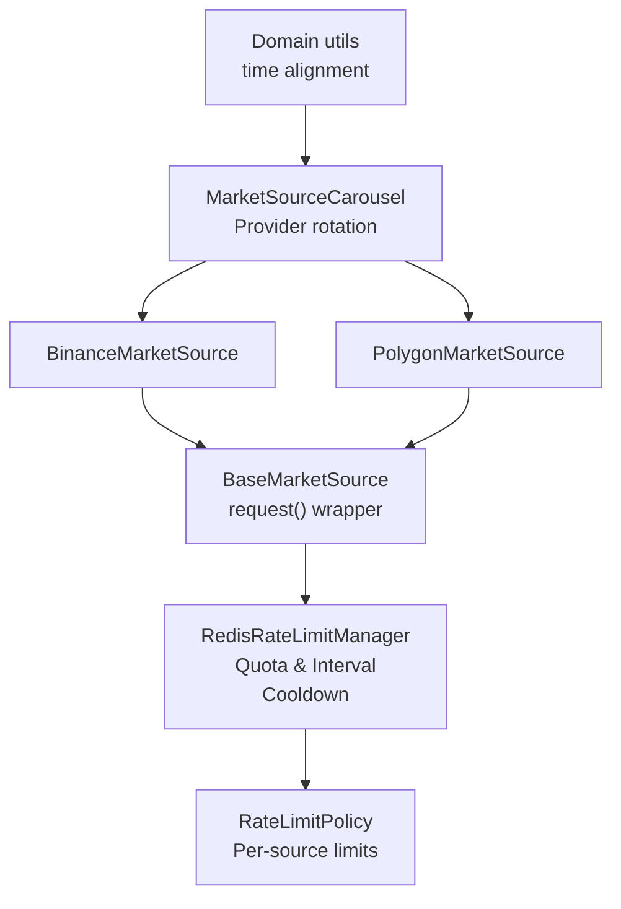
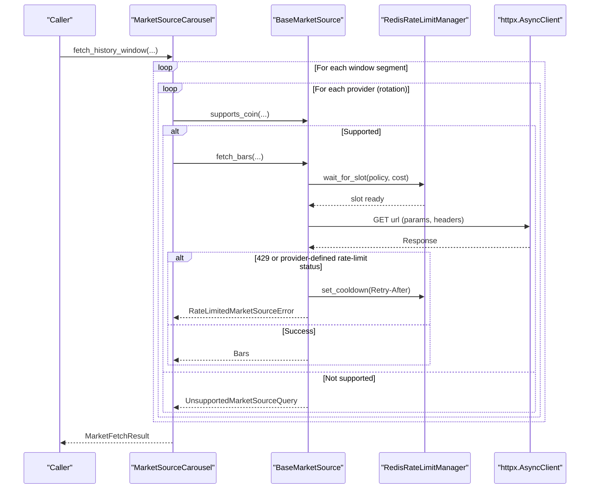
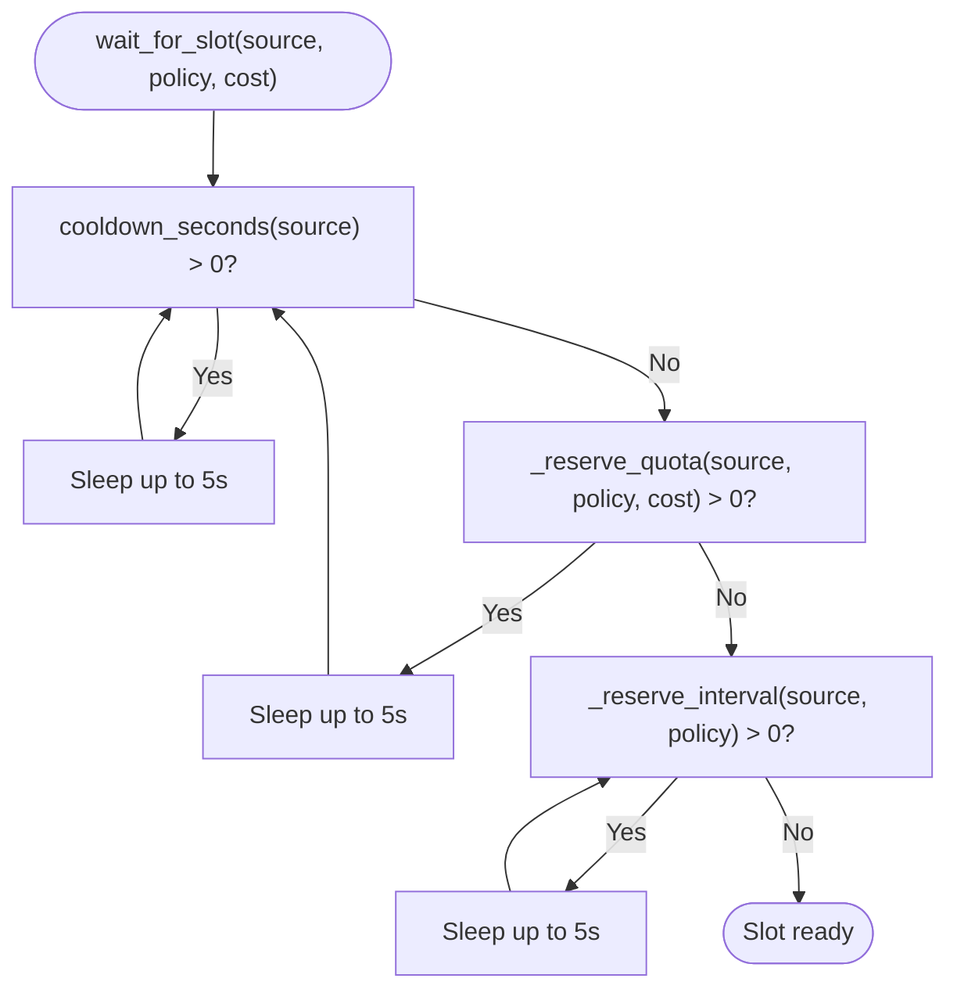
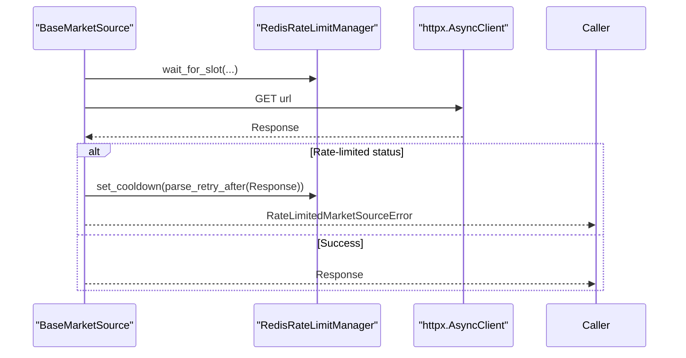
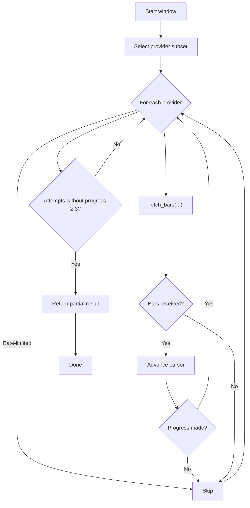
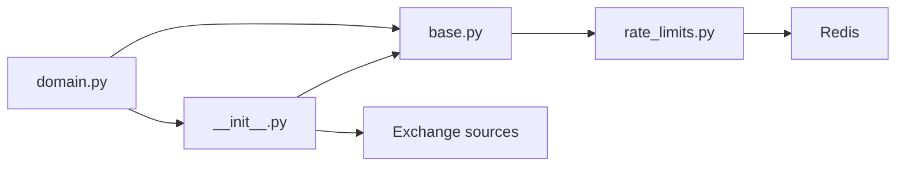
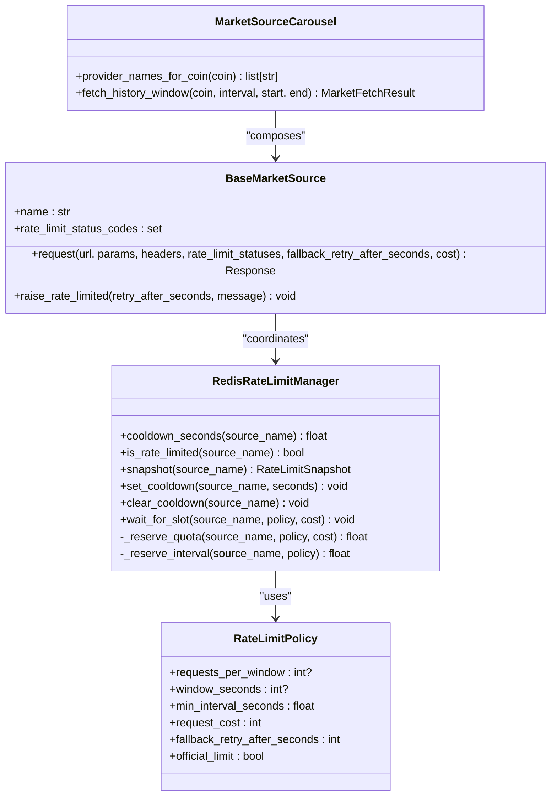

# Rate Limiting and Fallback Strategies

<cite>
**Referenced Files in This Document**
- [rate_limits.py](file://src/apps/market_data/sources/rate_limits.py)
- [base.py](file://src/apps/market_data/sources/base.py)
- [__init__.py](file://src/apps/market_data/sources/__init__.py)
- [binance.py](file://src/apps/market_data/sources/binance.py)
- [polygon.py](file://src/apps/market_data/sources/polygon.py)
- [domain.py](file://src/apps/market_data/domain.py)
- [base.py](file://src/core/settings/base.py)
- [test_sources_rate_limits.py](file://tests/apps/market_data/test_sources_rate_limits.py)
- [test_sources_carousel.py](file://tests/apps/market_data/test_sources_carousel.py)
</cite>

## Table of Contents
1. [Introduction](#introduction)
2. [Project Structure](#project-structure)
3. [Core Components](#core-components)
4. [Architecture Overview](#architecture-overview)
5. [Detailed Component Analysis](#detailed-component-analysis)
6. [Dependency Analysis](#dependency-analysis)
7. [Performance Considerations](#performance-considerations)
8. [Troubleshooting Guide](#troubleshooting-guide)
9. [Conclusion](#conclusion)
10. [Appendices](#appendices)

## Introduction
This document explains the rate limiting and fallback mechanisms that ensure reliable market data retrieval across multiple exchanges. It covers the token bucket-inspired quota management, minimum interval enforcement, adaptive throttling via Retry-After headers, and the carousel-based fallback strategy that rotates among providers when a source fails or is rate-limited. It also documents configuration profiles, emergency overrides, and operational safeguards such as graceful degradation and health-aware selection.

## Project Structure
The rate limiting and fallback logic spans several modules:
- Token bucket and interval enforcement with Redis-backed coordination
- Exchange-specific source implementations and their rate-limit behavior
- A carousel orchestrator that selects and retries across providers
- Domain utilities for time alignment and intervals

**Diagram sources**
- [rate_limits.py:123-266](file://src/apps/market_data/sources/rate_limits.py#L123-L266)
- [base.py:50-157](file://src/apps/market_data/sources/base.py#L50-L157)
- [binance.py:32-86](file://src/apps/market_data/sources/binance.py#L32-L86)
- [polygon.py:42-163](file://src/apps/market_data/sources/polygon.py#L42-L163)
- [__init__.py:39-198](file://src/apps/market_data/sources/__init__.py#L39-L198)
- [domain.py:13-49](file://src/apps/market_data/domain.py#L13-L49)

**Section sources**
- [rate_limits.py:16-104](file://src/apps/market_data/sources/rate_limits.py#L16-L104)
- [base.py:50-157](file://src/apps/market_data/sources/base.py#L50-L157)
- [__init__.py:39-198](file://src/apps/market_data/sources/__init__.py#L39-L198)
- [domain.py:13-49](file://src/apps/market_data/domain.py#L13-L49)

## Core Components
- RateLimitPolicy: Defines per-source limits (requests per window, window seconds, minimum interval, cost, fallback retry-after, and whether the limit is official).
- RedisRateLimitManager: Central coordinator enforcing quotas and intervals using Redis pipelines and watches, plus cooldown windows after rate-limit responses.
- BaseMarketSource.request(): Wraps HTTP calls with rate limiting and translates transport errors into typed exceptions.
- MarketSourceCarousel: Orchestrates provider selection and fallback across multiple sources, skipping rate-limited or failing providers.

Key behaviors:
- Quota-based token bucket-like accounting per source/window with Redis WATCH/PIPELINE for atomicity.
- Minimum interval enforcement to avoid flooding endpoints.
- Adaptive throttle via Retry-After header parsing (including provider-specific headers).
- Graceful degradation when a provider is rate-limited or returns empty results.

**Section sources**
- [rate_limits.py:16-104](file://src/apps/market_data/sources/rate_limits.py#L16-L104)
- [rate_limits.py:123-266](file://src/apps/market_data/sources/rate_limits.py#L123-L266)
- [base.py:50-157](file://src/apps/market_data/sources/base.py#L50-L157)
- [__init__.py:39-198](file://src/apps/market_data/sources/__init__.py#L39-L198)

## Architecture Overview
The system coordinates rate limiting and fallback across exchanges using a layered approach:
- Per-request rate limiting enforced before each HTTP call.
- Provider rotation with health-aware selection.
- Emergency overrides via explicit fallback retry-after values.

**Diagram sources**
- [__init__.py:76-187](file://src/apps/market_data/sources/__init__.py#L76-L187)
- [base.py:111-136](file://src/apps/market_data/sources/base.py#L111-L136)
- [rate_limits.py:268-304](file://src/apps/market_data/sources/rate_limits.py#L268-L304)

## Detailed Component Analysis

### Token Bucket and Interval Enforcement
RedisRateLimitManager enforces two complementary strategies:
- Quota-based token bucket: Tracks cumulative cost within a rolling window and sets a cooldown when exceeding limits.
- Minimum interval: Ensures a minimum time between requests per source using a Redis-timestamp key.

- Quota reservation uses WATCH/PIPELINE to atomically increment cost or set initial value with TTL.
- Interval reservation stores next-allowed timestamp and returns delay to caller.

**Diagram sources**
- [rate_limits.py:169-188](file://src/apps/market_data/sources/rate_limits.py#L169-L188)
- [rate_limits.py:190-223](file://src/apps/market_data/sources/rate_limits.py#L190-L223)
- [rate_limits.py:224-252](file://src/apps/market_data/sources/rate_limits.py#L224-L252)

**Section sources**
- [rate_limits.py:123-266](file://src/apps/market_data/sources/rate_limits.py#L123-L266)

### Adaptive Rate Limiting Based on Exchange Responses
- RateLimitedMarketSourceError is raised when encountering configured rate-limit status codes (default 429, with provider-specific overrides).
- Retry-After parsing:
  - Standard Retry-After header
  - Provider-specific gw-ratelimit-reset (KuCoin)
  - Fallback to per-source default if header missing or invalid
- BaseMarketSource.request() wraps the call and re-raises transport errors as TemporaryMarketSourceError.

**Diagram sources**
- [base.py:111-136](file://src/apps/market_data/sources/base.py#L111-L136)
- [rate_limits.py:268-304](file://src/apps/market_data/sources/rate_limits.py#L268-L304)

**Section sources**
- [base.py:111-157](file://src/apps/market_data/sources/base.py#L111-L157)
- [rate_limits.py:111-121](file://src/apps/market_data/sources/rate_limits.py#L111-L121)
- [rate_limits.py:268-304](file://src/apps/market_data/sources/rate_limits.py#L268-L304)

### Fallback Mechanisms and Provider Rotation
MarketSourceCarousel orchestrates fallback:
- Provider ordering prioritizes coin-specific preferences and asset-type groups.
- Skips providers that are rate-limited or raise specific errors (RateLimitedMarketSourceError, UnsupportedMarketSourceQuery, TemporaryMarketSourceError).
- Continues until the target window is filled or attempts without progress exceed a threshold.
- Clears rate limit on successful fetch to allow subsequent providers to proceed.

**Diagram sources**
- [__init__.py:76-187](file://src/apps/market_data/sources/__init__.py#L76-L187)

**Section sources**
- [__init__.py:39-198](file://src/apps/market_data/sources/__init__.py#L39-L198)

### Exchange-Specific Behavior and Cost Modeling
- BinanceMarketSource:
  - Uses official rate limits and cost modeling (request weight 2).
  - Extends rate-limit status codes to include provider-specific 418.
- PolygonMarketSource:
  - Requires API key; otherwise unsupported.
  - Explicitly passes a fallback retry-after value to the request wrapper.
  - Allows terminal gaps to enable graceful completion when reaching the end of available data.

**Section sources**
- [binance.py:32-86](file://src/apps/market_data/sources/binance.py#L32-L86)
- [polygon.py:42-163](file://src/apps/market_data/sources/polygon.py#L42-L163)

### Configuration Profiles and Emergency Overrides
- Per-source RateLimitPolicy:
  - Requests per window and window seconds define token bucket capacity.
  - Min interval prevents burstiness.
  - Request cost reflects endpoint weight.
  - Fallback retry-after seconds apply when provider headers are absent.
- Emergency overrides:
  - BaseMarketSource.request() accepts an optional fallback_retry_after_seconds parameter to override policy defaults.
  - PolygonMarketSource.request() demonstrates passing a fixed fallback value.

**Section sources**
- [rate_limits.py:16-104](file://src/apps/market_data/sources/rate_limits.py#L16-L104)
- [rate_limits.py:268-304](file://src/apps/market_data/sources/rate_limits.py#L268-L304)
- [polygon.py:80-89](file://src/apps/market_data/sources/polygon.py#L80-L89)

## Dependency Analysis
- RedisRateLimitManager depends on Redis for distributed coordination and on domain.utc_now for monotonic timestamps.
- BaseMarketSource.request() depends on RedisRateLimitManager and httpx.AsyncClient.
- MarketSourceCarousel composes multiple BaseMarketSource implementations and uses domain utilities for time alignment.

**Diagram sources**
- [domain.py:13-49](file://src/apps/market_data/domain.py#L13-L49)
- [base.py:50-157](file://src/apps/market_data/sources/base.py#L50-L157)
- [rate_limits.py:123-266](file://src/apps/market_data/sources/rate_limits.py#L123-L266)
- [__init__.py:39-198](file://src/apps/market_data/sources/__init__.py#L39-L198)

**Section sources**
- [domain.py:13-49](file://src/apps/market_data/domain.py#L13-L49)
- [rate_limits.py:123-266](file://src/apps/market_data/sources/rate_limits.py#L123-L266)
- [base.py:50-157](file://src/apps/market_data/sources/base.py#L50-L157)
- [__init__.py:39-198](file://src/apps/market_data/sources/__init__.py#L39-L198)

## Performance Considerations
- Redis WATCH/PIPELINE ensures atomic updates and reduces contention; failures trigger retries transparently.
- Backoff sleep capped to prevent long stalls during transient throttles.
- Provider rotation minimizes wasted work when a source is rate-limited or failing.
- Minimum interval enforcement avoids repeated bursts that could trigger provider-side throttling.

[No sources needed since this section provides general guidance]

## Troubleshooting Guide
Common scenarios and mitigations:
- Rate-limited responses:
  - Inspect Retry-After header parsing and fallback retry-after values.
  - Verify per-source policy and request cost.
- Transport errors:
  - Transient network or HTTP errors are wrapped as TemporaryMarketSourceError; callers should retry with backoff.
- Empty or stale results:
  - Carousel tolerates empty windows when terminal gap is allowed; otherwise it continues to the next provider or returns partial results.
- Redis connectivity issues:
  - RedisRateLimitManager swallows RedisError and falls back to best-effort behavior.

Operational checks:
- Validate provider-specific headers (e.g., gw-ratelimit-reset for KuCoin).
- Confirm API keys are configured for sources requiring credentials.
- Review provider order for a given coin to ensure preferred source is selected.

**Section sources**
- [rate_limits.py:111-121](file://src/apps/market_data/sources/rate_limits.py#L111-L121)
- [base.py:121-136](file://src/apps/market_data/sources/base.py#L121-L136)
- [polygon.py:80-113](file://src/apps/market_data/sources/polygon.py#L80-L113)
- [test_sources_rate_limits.py:139-350](file://tests/apps/market_data/test_sources_rate_limits.py#L139-L350)
- [test_sources_carousel.py:170-247](file://tests/apps/market_data/test_sources_carousel.py#L170-L247)

## Conclusion
The system combines Redis-backed token bucket and interval enforcement with provider-aware fallback to achieve robust, resilient market data retrieval. Policies are configurable per exchange, adaptive throttling responds to provider signals, and the carousel gracefully degrades when sources fail or throttle. Together, these mechanisms ensure reliable data collection under varying provider conditions.

[No sources needed since this section summarizes without analyzing specific files]

## Appendices

### Class Relationships

**Diagram sources**
- [rate_limits.py:16-104](file://src/apps/market_data/sources/rate_limits.py#L16-L104)
- [rate_limits.py:123-266](file://src/apps/market_data/sources/rate_limits.py#L123-L266)
- [base.py:50-157](file://src/apps/market_data/sources/base.py#L50-L157)
- [__init__.py:39-198](file://src/apps/market_data/sources/__init__.py#L39-L198)