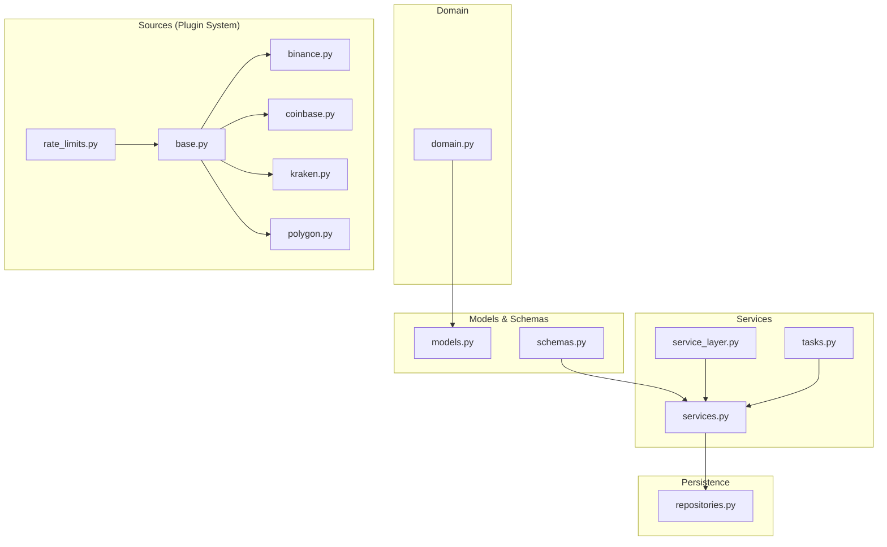
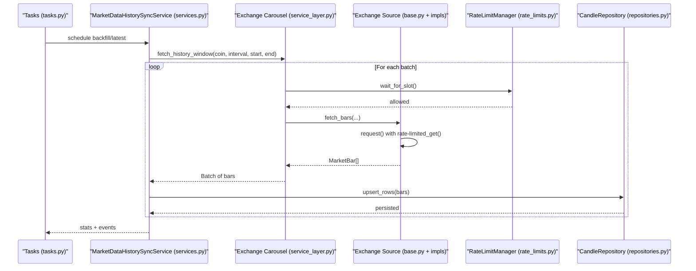
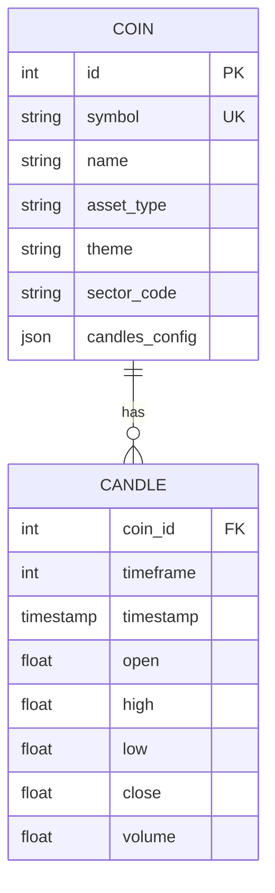
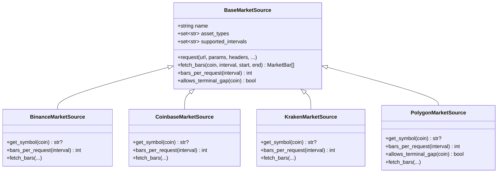
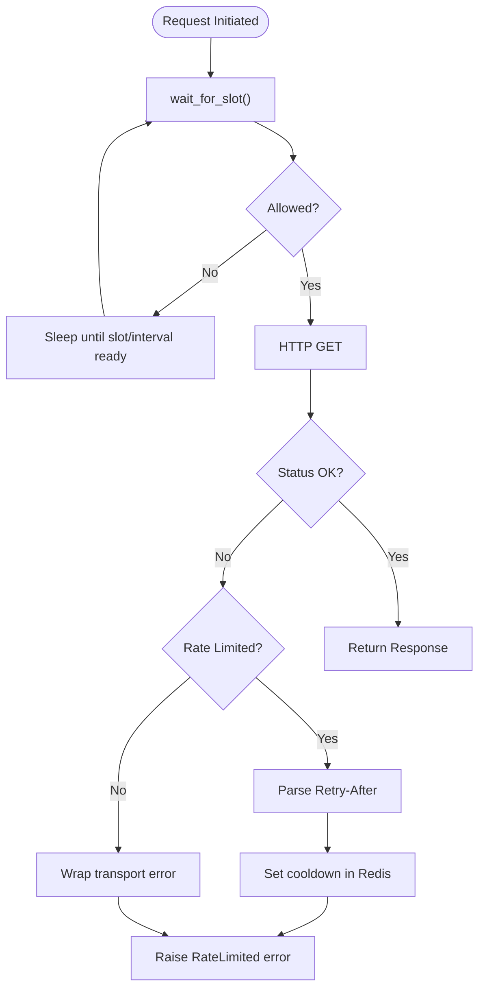
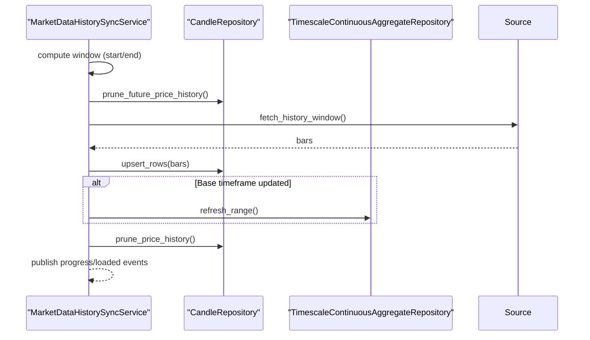
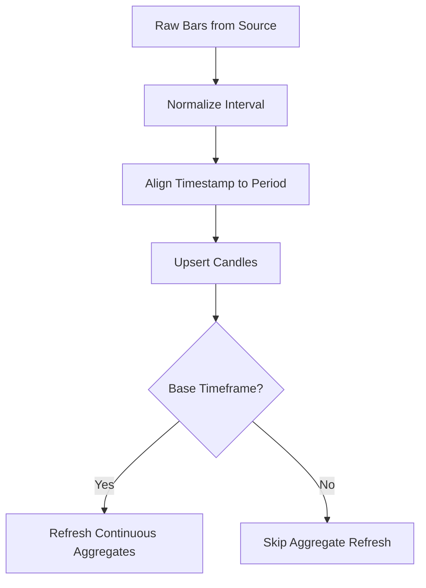
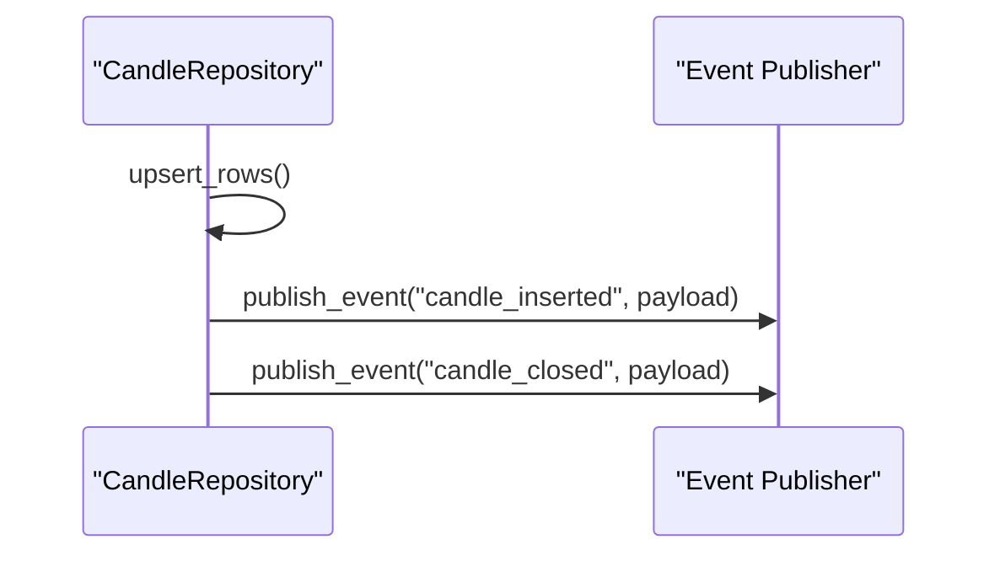
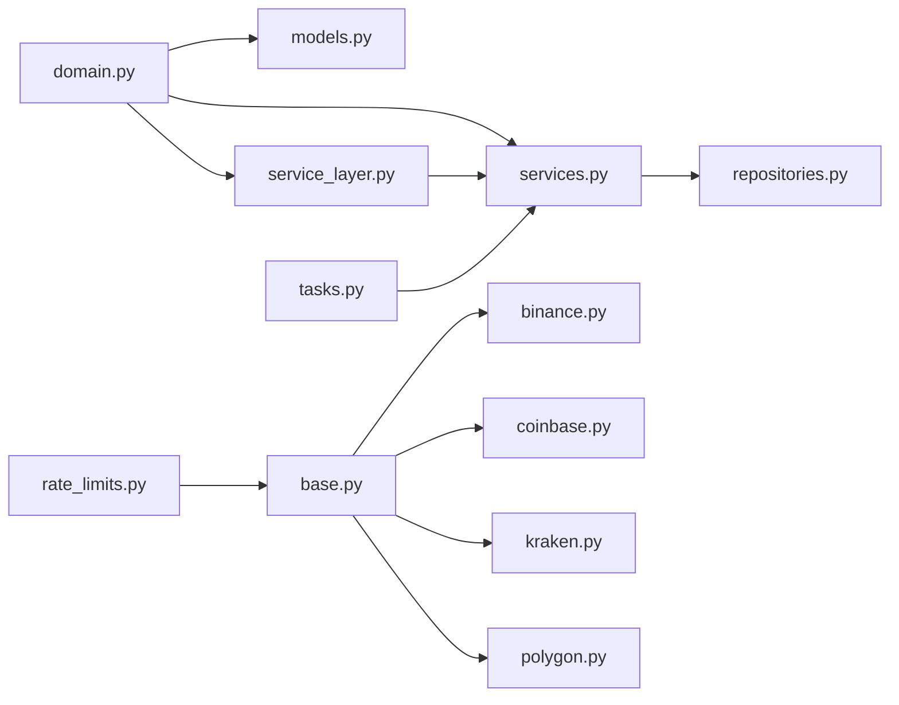

# Market Data Management

<cite>
**Referenced Files in This Document**
- [domain.py](file://src/apps/market_data/domain.py)
- [models.py](file://src/apps/market_data/models.py)
- [schemas.py](file://src/apps/market_data/schemas.py)
- [base.py](file://src/apps/market_data/sources/base.py)
- [binance.py](file://src/apps/market_data/sources/binance.py)
- [coinbase.py](file://src/apps/market_data/sources/coinbase.py)
- [kraken.py](file://src/apps/market_data/sources/kraken.py)
- [polygon.py](file://src/apps/market_data/sources/polygon.py)
- [rate_limits.py](file://src/apps/market_data/sources/rate_limits.py)
- [service_layer.py](file://src/apps/market_data/service_layer.py)
- [services.py](file://src/apps/market_data/services.py)
- [repositories.py](file://src/apps/market_data/repositories.py)
- [tasks.py](file://src/apps/market_data/tasks.py)
</cite>

## Table of Contents
1. [Introduction](#introduction)
2. [Project Structure](#project-structure)
3. [Core Components](#core-components)
4. [Architecture Overview](#architecture-overview)
5. [Detailed Component Analysis](#detailed-component-analysis)
6. [Dependency Analysis](#dependency-analysis)
7. [Performance Considerations](#performance-considerations)
8. [Troubleshooting Guide](#troubleshooting-guide)
9. [Conclusion](#conclusion)

## Introduction
This document describes the market data management system responsible for collecting, normalizing, storing, and serving OHLCV (Open, High, Low, Close, Volume) price history across multiple exchanges and asset classes. It covers:
- Real-time price streaming architecture
- Historical data backfill and refresh workflows
- Plugin-based exchange source system
- Data normalization pipelines and candle alignment
- Candlestick data model and timeframe handling
- Exchange-specific implementations (Binance, Coinbase, Kraken, Polygon)
- Rate limiting, fallbacks, retries, and resilience
- Data ingestion, caching, and performance optimizations
- Error handling and data consistency guarantees

## Project Structure
The market data subsystem is organized around a domain-driven design with clear separation of concerns:
- Domain utilities for intervals, timestamps, and alignment
- Data models for coins and candles
- Schemas for request/response validation
- Exchange sources as plugins with shared base behavior
- Rate limiting and request orchestration
- Services for orchestration and business logic
- Repositories for persistence and continuous aggregates
- Tasks for scheduling and distributed locking

**Diagram sources**
- [domain.py:1-49](file://src/apps/market_data/domain.py#L1-L49)
- [models.py:1-168](file://src/apps/market_data/models.py#L1-L168)
- [schemas.py:1-94](file://src/apps/market_data/schemas.py#L1-L94)
- [base.py:1-157](file://src/apps/market_data/sources/base.py#L1-L157)
- [binance.py:1-86](file://src/apps/market_data/sources/binance.py#L1-L86)
- [coinbase.py:1-88](file://src/apps/market_data/sources/coinbase.py#L1-L88)
- [kraken.py:1-92](file://src/apps/market_data/sources/kraken.py#L1-L92)
- [polygon.py:1-163](file://src/apps/market_data/sources/polygon.py#L1-L163)
- [rate_limits.py:1-304](file://src/apps/market_data/sources/rate_limits.py#L1-L304)
- [service_layer.py:1-666](file://src/apps/market_data/service_layer.py#L1-L666)
- [services.py:1-865](file://src/apps/market_data/services.py#L1-L865)
- [repositories.py:1-834](file://src/apps/market_data/repositories.py#L1-L834)
- [tasks.py:1-235](file://src/apps/market_data/tasks.py#L1-L235)

**Section sources**
- [domain.py:1-49](file://src/apps/market_data/domain.py#L1-L49)
- [models.py:1-168](file://src/apps/market_data/models.py#L1-L168)
- [schemas.py:1-94](file://src/apps/market_data/schemas.py#L1-L94)
- [base.py:1-157](file://src/apps/market_data/sources/base.py#L1-L157)
- [rate_limits.py:1-304](file://src/apps/market_data/sources/rate_limits.py#L1-L304)
- [service_layer.py:1-666](file://src/apps/market_data/service_layer.py#L1-L666)
- [services.py:1-865](file://src/apps/market_data/services.py#L1-L865)
- [repositories.py:1-834](file://src/apps/market_data/repositories.py#L1-L834)
- [tasks.py:1-235](file://src/apps/market_data/tasks.py#L1-L235)

## Core Components
- Candle data model: stores OHLCV with composite primary key (coin_id, timeframe, timestamp) and optimized indexes for queries.
- Coin model: tracks assets, themes, sectors, and per-coin candle configurations.
- Interval utilities: normalize, align, and compute windows for timeframes.
- Exchange sources: plugin interface with shared HTTP client, rate limiting, and symbol/intervals mapping.
- Rate limiter: Redis-backed policy enforcement with quota and interval constraints.
- Services: orchestrate backfill, latest sync, pruning, and event publishing.
- Repositories: persistence, continuous aggregates, and fallbacks for higher timeframes.

**Section sources**
- [models.py:148-168](file://src/apps/market_data/models.py#L148-L168)
- [domain.py:5-49](file://src/apps/market_data/domain.py#L5-L49)
- [base.py:50-157](file://src/apps/market_data/sources/base.py#L50-L157)
- [rate_limits.py:16-104](file://src/apps/market_data/sources/rate_limits.py#L16-L104)
- [service_layer.py:54-71](file://src/apps/market_data/service_layer.py#L54-L71)
- [repositories.py:112-706](file://src/apps/market_data/repositories.py#L112-L706)

## Architecture Overview
The system integrates external exchanges via a plugin-based source framework. Requests are coordinated through a carousel that selects appropriate sources per coin and interval, respecting rate limits and exchange capabilities. Fetched OHLCV bars are normalized and upserted into the database, with continuous aggregates refreshed for derived timeframes.

**Diagram sources**
- [tasks.py:115-172](file://src/apps/market_data/tasks.py#L115-L172)
- [services.py:641-786](file://src/apps/market_data/services.py#L641-L786)
- [service_layer.py:526-638](file://src/apps/market_data/service_layer.py#L526-L638)
- [base.py:111-157](file://src/apps/market_data/sources/base.py#L111-L157)
- [rate_limits.py:268-304](file://src/apps/market_data/sources/rate_limits.py#L268-L304)
- [repositories.py:646-663](file://src/apps/market_data/repositories.py#L646-L663)

## Detailed Component Analysis

### Candlestick Data Model and Timeframe Handling
- Candle table schema defines:
  - Composite primary key: coin_id, timeframe, timestamp
  - OHLC prices and optional volume
  - Optimized indexes for fast lookups by coin/timeframe/timestamp
- Timeframe handling:
  - Intervals normalized to canonical forms ("15m", "1h", "4h", "1d")
  - Alignment to periodic boundaries for deterministic buckets
  - Latest-completed timestamp calculation to avoid partial candles
  - Retention computed per interval via candle configs

**Diagram sources**
- [models.py:20-146](file://src/apps/market_data/models.py#L20-L146)
- [models.py:148-168](file://src/apps/market_data/models.py#L148-L168)

**Section sources**
- [models.py:148-168](file://src/apps/market_data/models.py#L148-L168)
- [domain.py:5-49](file://src/apps/market_data/domain.py#L5-L49)
- [schemas.py:12-39](file://src/apps/market_data/schemas.py#L12-L39)

### Exchange Integrations: Plugin-Based Source System
- BaseMarketSource provides:
  - Shared HTTP client with timeouts and headers
  - Rate limiting hooks and retry-after parsing
  - Symbol resolution and interval support checks
  - Request wrapper that enforces policies and raises typed errors
- Exchange implementations:
  - Binance: spot klines with explicit status codes and bar limits
  - Coinbase: granular candles with product-specific symbol mapping
  - Kraken: OHLC endpoint with per-interval caps and error handling
  - Polygon: requires API key, supports larger ranges and resampling for 4h
- Each source declares supported intervals and asset types, enabling the carousel to route appropriately.

**Diagram sources**
- [base.py:50-157](file://src/apps/market_data/sources/base.py#L50-L157)
- [binance.py:32-86](file://src/apps/market_data/sources/binance.py#L32-L86)
- [coinbase.py:34-88](file://src/apps/market_data/sources/coinbase.py#L34-L88)
- [kraken.py:33-92](file://src/apps/market_data/sources/kraken.py#L33-L92)
- [polygon.py:42-163](file://src/apps/market_data/sources/polygon.py#L42-L163)

**Section sources**
- [base.py:50-157](file://src/apps/market_data/sources/base.py#L50-L157)
- [binance.py:32-86](file://src/apps/market_data/sources/binance.py#L32-L86)
- [coinbase.py:34-88](file://src/apps/market_data/sources/coinbase.py#L34-L88)
- [kraken.py:33-92](file://src/apps/market_data/sources/kraken.py#L33-L92)
- [polygon.py:42-163](file://src/apps/market_data/sources/polygon.py#L42-L163)

### Rate Limiting and Fallback Mechanisms
- Policies define:
  - Requests per window and window seconds
  - Minimum interval between requests
  - Cost per request (when applicable)
  - Fallback retry-after seconds
- Manager enforces:
  - Quota accounting per source with Redis WATCH/EXEC
  - Per-request cooldown when upstream throttles
  - Interval pacing to prevent burstiness
- Fallbacks:
  - Retry-After header parsing (including exchange-specific headers)
  - Graceful degradation when Redis unavailable

**Diagram sources**
- [rate_limits.py:169-188](file://src/apps/market_data/sources/rate_limits.py#L169-L188)
- [rate_limits.py:268-304](file://src/apps/market_data/sources/rate_limits.py#L268-L304)
- [base.py:111-157](file://src/apps/market_data/sources/base.py#L111-L157)

**Section sources**
- [rate_limits.py:16-104](file://src/apps/market_data/sources/rate_limits.py#L16-L104)
- [rate_limits.py:123-253](file://src/apps/market_data/sources/rate_limits.py#L123-L253)
- [rate_limits.py:268-304](file://src/apps/market_data/sources/rate_limits.py#L268-L304)
- [base.py:89-157](file://src/apps/market_data/sources/base.py#L89-L157)

### Historical Data Processing and Backfill/Latest Sync
- Orchestration:
  - Backfill computes retention window and prunes future data
  - Latest sync determines next incremental window from last stored candle
  - Progress tracked and published for observability
- Upsert pipeline:
  - Batches of bars upserted in chunks
  - Continuous aggregates refreshed for higher timeframes when base timeframe updates
- Error handling:
  - Exposed retry-at timestamps and reasons
  - Graceful skipping when deferred or locked

**Diagram sources**
- [services.py:641-786](file://src/apps/market_data/services.py#L641-L786)
- [repositories.py:550-600](file://src/apps/market_data/repositories.py#L550-L600)
- [repositories.py:771-806](file://src/apps/market_data/repositories.py#L771-L806)

**Section sources**
- [services.py:641-786](file://src/apps/market_data/services.py#L641-L786)
- [service_layer.py:526-638](file://src/apps/market_data/service_layer.py#L526-L638)
- [repositories.py:112-706](file://src/apps/market_data/repositories.py#L112-L706)

### Data Normalization Pipelines
- Interval normalization ensures consistent bucketing across sources
- Timestamp alignment to periodic boundaries prevents off-by-one issues
- Volume normalization handles missing values consistently
- Continuous aggregates provide efficient rollups for higher timeframes

**Diagram sources**
- [domain.py:23-49](file://src/apps/market_data/domain.py#L23-L49)
- [repositories.py:623-636](file://src/apps/market_data/repositories.py#L623-L636)
- [repositories.py:771-806](file://src/apps/market_data/repositories.py#L771-L806)

**Section sources**
- [domain.py:23-49](file://src/apps/market_data/domain.py#L23-L49)
- [repositories.py:623-636](file://src/apps/market_data/repositories.py#L623-L636)
- [repositories.py:771-806](file://src/apps/market_data/repositories.py#L771-L806)

### Real-Time Price Streaming Architecture
- Event-driven publishing:
  - On candle insert/closed, events are published for downstream analytics
- Stream integration:
  - Event publishing is wired to runtime stream publisher for decoupled processing
- Streaming consumers:
  - Anomaly detection, pattern recognition, and other analytics consume these events asynchronously

**Diagram sources**
- [service_layer.py:54-71](file://src/apps/market_data/service_layer.py#L54-L71)
- [repositories.py:621-644](file://src/apps/market_data/repositories.py#L621-L644)

**Section sources**
- [service_layer.py:54-71](file://src/apps/market_data/service_layer.py#L54-L71)
- [repositories.py:621-644](file://src/apps/market_data/repositories.py#L621-L644)

### Exchange-Specific Implementations
- Binance:
  - Supports crypto assets and standard intervals
  - Uses explicit status codes and enforces bar limits
- Coinbase:
  - Product symbol mapping and granularity mapping
  - Returns candles in reverse chronological order; trims to request limit
- Kraken:
  - Enforces maximum span per request and validates payload errors
  - Converts OHLC fields to internal order
- Polygon:
  - Requires API key; supports large ranges and resampling for 4h
  - Allows terminal gaps for continuous coverage

**Section sources**
- [binance.py:32-86](file://src/apps/market_data/sources/binance.py#L32-L86)
- [coinbase.py:34-88](file://src/apps/market_data/sources/coinbase.py#L34-L88)
- [kraken.py:33-92](file://src/apps/market_data/sources/kraken.py#L33-L92)
- [polygon.py:42-163](file://src/apps/market_data/sources/polygon.py#L42-L163)

### Data Quality Controls
- Pruning:
  - Removes future candles beyond latest completed timestamp
  - Retains only configured retention bars per interval
- Validation:
  - Unsupported intervals/assets raise explicit errors
  - Manual writes restricted to base timeframe
- Idempotency:
  - Upserts on conflict update existing candles

**Section sources**
- [services.py:684-721](file://src/apps/market_data/services.py#L684-L721)
- [service_layer.py:426-439](file://src/apps/market_data/service_layer.py#L426-L439)
- [repositories.py:621-662](file://src/apps/market_data/repositories.py#L621-L662)

### Data Ingestion Workflows, Caching, and Performance
- Ingestion:
  - Batched upserts with configurable chunk sizes
  - Continuous aggregates refreshed after base timeframe updates
- Caching:
  - Timescale continuous aggregates serve higher timeframe queries efficiently
  - Fallbacks to direct queries or resampling when aggregates unavailable
- Performance:
  - Optimized indexes on coin_id/timeframe/timestamp
  - Bulk operations minimize round-trips
  - Redis-based rate limiting avoids hot-spotting

**Section sources**
- [repositories.py:179-277](file://src/apps/market_data/repositories.py#L179-L277)
- [repositories.py:406-512](file://src/apps/market_data/repositories.py#L406-L512)
- [repositories.py:646-663](file://src/apps/market_data/repositories.py#L646-L663)
- [repositories.py:771-806](file://src/apps/market_data/repositories.py#L771-L806)

## Dependency Analysis
The system exhibits clean separation:
- Domain utilities underpin models and services
- Sources depend on base classes and rate limiter
- Services depend on repositories and sources
- Tasks coordinate service invocations with distributed locks

**Diagram sources**
- [domain.py:1-49](file://src/apps/market_data/domain.py#L1-L49)
- [models.py:1-168](file://src/apps/market_data/models.py#L1-L168)
- [base.py:1-157](file://src/apps/market_data/sources/base.py#L1-L157)
- [binance.py:1-86](file://src/apps/market_data/sources/binance.py#L1-L86)
- [coinbase.py:1-88](file://src/apps/market_data/sources/coinbase.py#L1-L88)
- [kraken.py:1-92](file://src/apps/market_data/sources/kraken.py#L1-L92)
- [polygon.py:1-163](file://src/apps/market_data/sources/polygon.py#L1-L163)
- [rate_limits.py:1-304](file://src/apps/market_data/sources/rate_limits.py#L1-L304)
- [service_layer.py:1-666](file://src/apps/market_data/service_layer.py#L1-L666)
- [services.py:1-865](file://src/apps/market_data/services.py#L1-L865)
- [repositories.py:1-834](file://src/apps/market_data/repositories.py#L1-L834)
- [tasks.py:1-235](file://src/apps/market_data/tasks.py#L1-L235)

**Section sources**
- [domain.py:1-49](file://src/apps/market_data/domain.py#L1-L49)
- [base.py:1-157](file://src/apps/market_data/sources/base.py#L1-L157)
- [rate_limits.py:1-304](file://src/apps/market_data/sources/rate_limits.py#L1-L304)
- [service_layer.py:1-666](file://src/apps/market_data/service_layer.py#L1-L666)
- [services.py:1-865](file://src/apps/market_data/services.py#L1-L865)
- [repositories.py:1-834](file://src/apps/market_data/repositories.py#L1-L834)
- [tasks.py:1-235](file://src/apps/market_data/tasks.py#L1-L235)

## Performance Considerations
- Prefer batched upserts to reduce transaction overhead
- Align queries to indexes (coin_id, timeframe, timestamp) for optimal scans
- Use continuous aggregates for higher timeframes to avoid expensive resampling
- Apply rate limiting to prevent upstream throttling and cascading failures
- Leverage Redis-backed quotas and interval pacing for predictable throughput

## Troubleshooting Guide
Common issues and remedies:
- Rate limited responses:
  - Inspect retry-after headers and cooldown keys in Redis
  - Adjust fallback retry seconds per source policy
- Unsupported intervals/assets:
  - Verify source supports the interval and asset type
  - Normalize intervals before routing
- Data gaps or duplicates:
  - Confirm pruning of future candles and retention windows
  - Ensure upserts are idempotent on conflict
- Polygon API errors:
  - Validate API key presence and permissions
  - Respect status codes and error payloads

**Section sources**
- [base.py:132-147](file://src/apps/market_data/sources/base.py#L132-L147)
- [rate_limits.py:111-121](file://src/apps/market_data/sources/rate_limits.py#L111-L121)
- [polygon.py:90-113](file://src/apps/market_data/sources/polygon.py#L90-L113)
- [services.py:684-721](file://src/apps/market_data/services.py#L684-L721)
- [repositories.py:621-662](file://src/apps/market_data/repositories.py#L621-L662)

## Conclusion
The market data management system provides a robust, extensible framework for collecting OHLCV data from multiple exchanges. Its plugin-based source architecture, Redis-backed rate limiting, and continuous aggregation pipeline deliver high throughput while maintaining data quality and consistency. The modular design enables easy addition of new exchanges and timeframes, and the event-driven ingestion supports scalable downstream analytics.