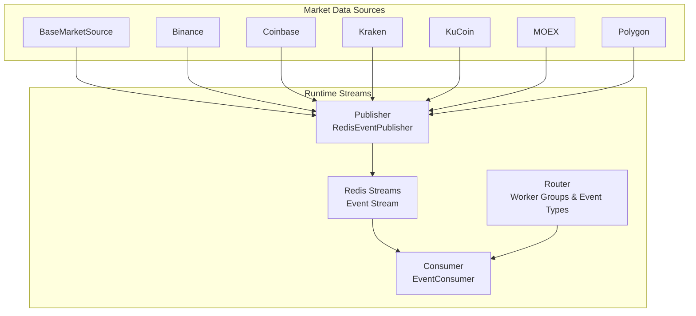
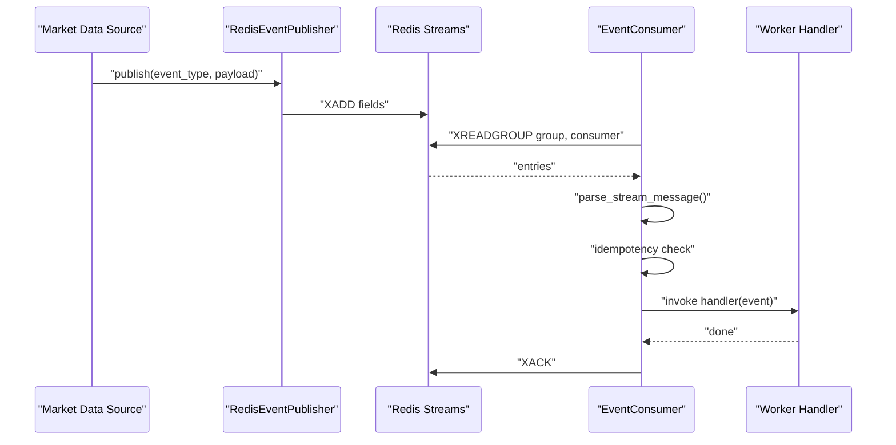
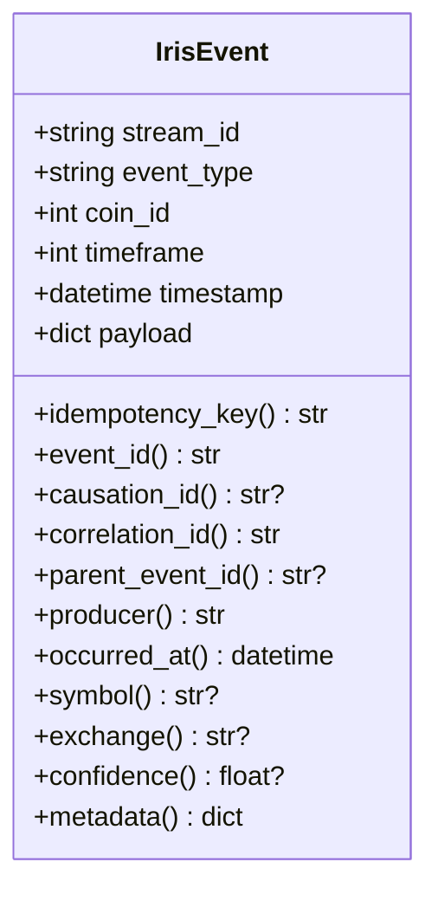
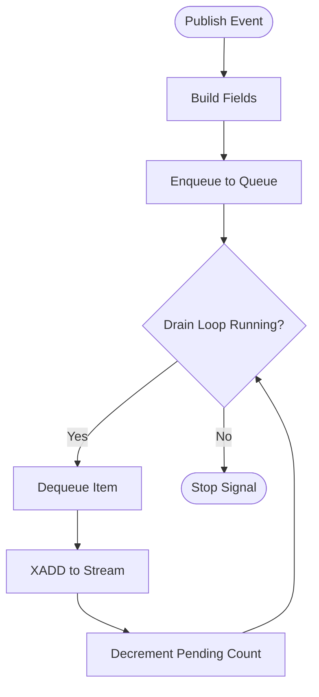
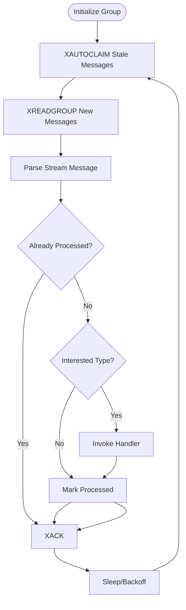
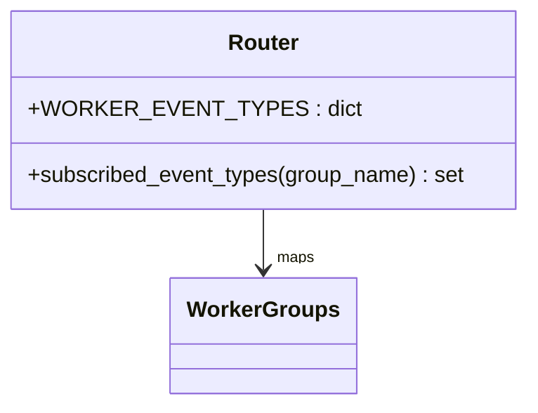
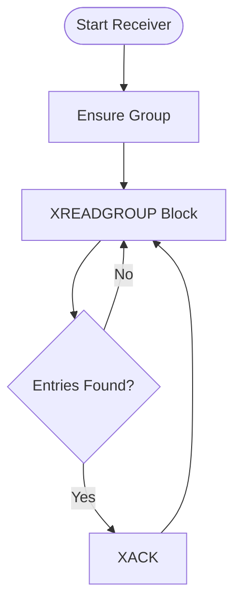
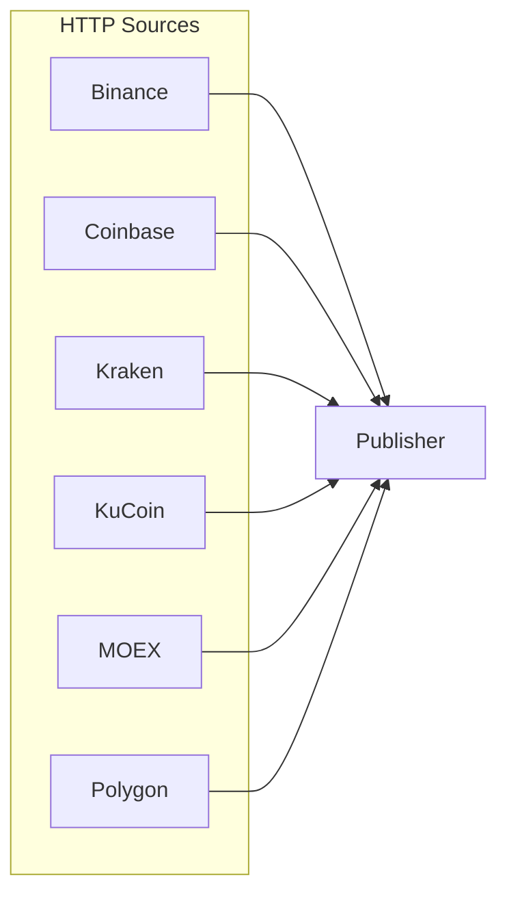
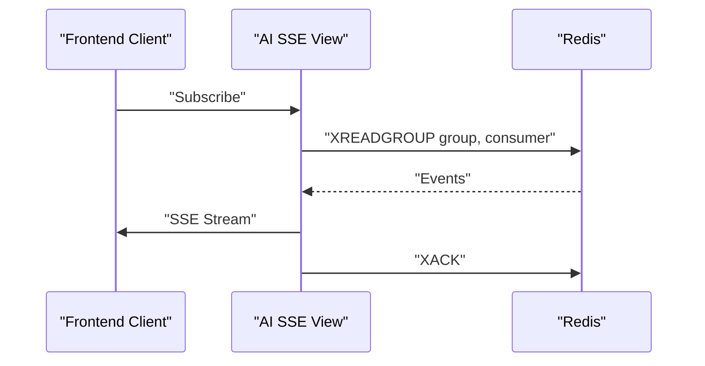
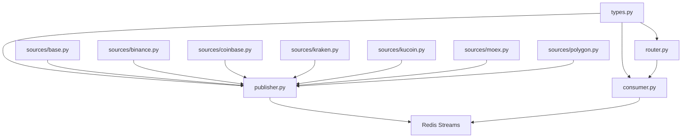

# Real-Time Streaming

<cite>
**Referenced Files in This Document**
- [src/runtime/streams/__init__.py](file://src/runtime/streams/__init__.py)
- [src/runtime/streams/types.py](file://src/runtime/streams/types.py)
- [src/runtime/streams/publisher.py](file://src/runtime/streams/publisher.py)
- [src/runtime/streams/consumer.py](file://src/runtime/streams/consumer.py)
- [src/runtime/streams/router.py](file://src/runtime/streams/router.py)
- [src/runtime/streams/messages.py](file://src/runtime/streams/messages.py)
- [src/apps/market_data/sources/base.py](file://src/apps/market_data/sources/base.py)
- [src/apps/market_data/sources/binance.py](file://src/apps/market_data/sources/binance.py)
- [src/apps/market_data/sources/coinbase.py](file://src/apps/market_data/sources/coinbase.py)
- [src/apps/market_data/sources/kraken.py](file://src/apps/market_data/sources/kraken.py)
- [src/apps/market_data/sources/kucoin.py](file://src/apps/market_data/sources/kucoin.py)
- [src/apps/market_data/sources/moex.py](file://src/apps/market_data/sources/moex.py)
- [src/apps/market_data/sources/polygon.py](file://src/apps/market_data/sources/polygon.py)
- [src/apps/hypothesis_engine/views.py](file://src/apps/hypothesis_engine/views.py)
- [tests/runtime/streams/test_types_and_router.py](file://tests/runtime/streams/test_types_and_router.py)
- [tests/runtime/streams/test_event_stream.py](file://tests/runtime/streams/test_event_stream.py)
- [tests/runtime/streams/test_messages.py](file://tests/runtime/streams/test_messages.py)
</cite>

## Table of Contents
1. [Introduction](#introduction)
2. [Project Structure](#project-structure)
3. [Core Components](#core-components)
4. [Architecture Overview](#architecture-overview)
5. [Detailed Component Analysis](#detailed-component-analysis)
6. [Dependency Analysis](#dependency-analysis)
7. [Performance Considerations](#performance-considerations)
8. [Troubleshooting Guide](#troubleshooting-guide)
9. [Conclusion](#conclusion)
10. [Appendices](#appendices)

## Introduction
This document describes the real-time streaming system that powers live market data ingestion, event-driven processing, and pub/sub messaging across the platform. It explains how WebSocket connections to exchanges are integrated, how live price updates propagate via Redis Streams, and how the runtime streams system orchestrates consumers and workers. It also documents event types, message formats, streaming protocols, and operational configuration options for endpoints, connection management, and fault tolerance. Guidance is included for scaling real-time data processing across multiple assets and timeframes.

## Project Structure
The real-time streaming system spans two primary areas:
- Runtime streams: Redis-based event bus, publishers, consumers, and worker orchestration
- Market data sources: HTTP integrations with exchanges (no native WebSocket streaming in the referenced code)

**Diagram sources**
- [src/runtime/streams/publisher.py:22-101](file://src/runtime/streams/publisher.py#L22-L101)
- [src/runtime/streams/consumer.py:49-230](file://src/runtime/streams/consumer.py#L49-L230)
- [src/runtime/streams/router.py:17-55](file://src/runtime/streams/router.py#L17-L55)
- [src/apps/market_data/sources/base.py:50-157](file://src/apps/market_data/sources/base.py#L50-L157)
- [src/apps/market_data/sources/binance.py:32-86](file://src/apps/market_data/sources/binance.py#L32-L86)
- [src/apps/market_data/sources/coinbase.py:34-88](file://src/apps/market_data/sources/coinbase.py#L34-L88)
- [src/apps/market_data/sources/kraken.py:33-92](file://src/apps/market_data/sources/kraken.py#L33-L92)
- [src/apps/market_data/sources/kucoin.py:39-93](file://src/apps/market_data/sources/kucoin.py#L39-L93)
- [src/apps/market_data/sources/moex.py:35-133](file://src/apps/market_data/sources/moex.py#L35-L133)
- [src/apps/market_data/sources/polygon.py:42-163](file://src/apps/market_data/sources/polygon.py#L42-L163)

**Section sources**
- [src/runtime/streams/__init__.py:1-25](file://src/runtime/streams/__init__.py#L1-L25)
- [src/runtime/streams/publisher.py:22-101](file://src/runtime/streams/publisher.py#L22-L101)
- [src/runtime/streams/consumer.py:49-230](file://src/runtime/streams/consumer.py#L49-L230)
- [src/runtime/streams/router.py:17-55](file://src/runtime/streams/router.py#L17-L55)
- [src/apps/market_data/sources/base.py:50-157](file://src/apps/market_data/sources/base.py#L50-L157)

## Core Components
- Event model and serialization: Defines the canonical event shape, payload serialization/deserialization, and helper functions to build stream fields and parse messages.
- Publisher: Synchronous publisher with a background drain thread that writes events to Redis Streams.
- Consumer: Asynchronous Redis Streams consumer with XREADGROUP/XACK, stale message reclamation, idempotency tracking, and optional metrics recording.
- Router: Maps worker groups to sets of event types to enable targeted routing and selective consumption.
- Legacy message bus: A separate synchronous Redis-based message bus for console receivers and non-stream events.

Key responsibilities:
- Event model: Enforces consistent event metadata (coin_id, timeframe, timestamp) and derived identifiers for idempotency and correlation.
- Publisher: Ensures non-blocking publishing by queuing and draining writes on a background thread.
- Consumer: Provides robust group-based consumption with recovery from missing groups, stale idle messages, and per-event idempotency checks.
- Router: Enables decoupled routing of events to worker groups (e.g., indicator workers, signal fusion workers).

**Section sources**
- [src/runtime/streams/types.py:51-165](file://src/runtime/streams/types.py#L51-L165)
- [src/runtime/streams/publisher.py:22-101](file://src/runtime/streams/publisher.py#L22-L101)
- [src/runtime/streams/consumer.py:49-230](file://src/runtime/streams/consumer.py#L49-L230)
- [src/runtime/streams/router.py:17-55](file://src/runtime/streams/router.py#L17-L55)
- [src/runtime/streams/messages.py:23-170](file://src/runtime/streams/messages.py#L23-L170)

## Architecture Overview
The system uses Redis Streams as the backbone for real-time event distribution. Publishers enqueue events on a single event stream. Consumers form distinct consumer groups per worker role and process only the event types they subscribe to. The router defines which events go to which worker groups. Market data sources produce events (via HTTP APIs) that are published into the stream.

**Diagram sources**
- [src/runtime/streams/publisher.py:38-92](file://src/runtime/streams/publisher.py#L38-L92)
- [src/runtime/streams/consumer.py:117-200](file://src/runtime/streams/consumer.py#L117-L200)
- [src/runtime/streams/types.py:156-165](file://src/runtime/streams/types.py#L156-L165)

## Detailed Component Analysis

### Event Model and Message Formats
- IrisEvent encapsulates stream_id, event_type, coin_id, timeframe, timestamp, and payload. It exposes helpers for idempotency keys, correlation IDs, and typed metadata extraction.
- Payload serialization uses compact JSON to ensure deterministic hashing for idempotency.
- Fields builder converts event payloads into Redis Stream field dictionaries with standardized keys.

**Diagram sources**
- [src/runtime/streams/types.py:51-123](file://src/runtime/streams/types.py#L51-L123)

**Section sources**
- [src/runtime/streams/types.py:125-165](file://src/runtime/streams/types.py#L125-L165)

### Publisher and Background Drain
- The publisher enqueues event fields into a queue and drains them on a dedicated thread that performs XADD operations.
- Flush waits until the queue drains, enabling controlled shutdown and testing.

**Diagram sources**
- [src/runtime/streams/publisher.py:38-74](file://src/runtime/streams/publisher.py#L38-L74)

**Section sources**
- [src/runtime/streams/publisher.py:22-101](file://src/runtime/streams/publisher.py#L22-L101)

### Consumer and Idempotency
- Consumers create and maintain consumer groups, read new and stale messages, and acknowledge processed entries.
- Idempotency is enforced using a Redis key per event and group, preventing duplicate processing.
- Handlers can be sync or async; the consumer awaits async results.

**Diagram sources**
- [src/runtime/streams/consumer.py:97-200](file://src/runtime/streams/consumer.py#L97-L200)

**Section sources**
- [src/runtime/streams/consumer.py:49-230](file://src/runtime/streams/consumer.py#L49-L230)

### Router and Worker Groups
- Worker groups define which consumers receive which event types.
- Unsupported groups raise explicit errors to prevent misrouting.

**Diagram sources**
- [src/runtime/streams/router.py:17-63](file://src/runtime/streams/router.py#L17-L63)

**Section sources**
- [src/runtime/streams/router.py:17-63](file://src/runtime/streams/router.py#L17-L63)

### Legacy Redis Message Bus (Console Receivers)
- A synchronous message bus supports console receivers and non-stream topics.
- It ensures consumer groups, reads with blocking timeouts, and acknowledges messages.
- Includes recovery for missing groups and error handling during reads and acks.

**Diagram sources**
- [src/runtime/streams/messages.py:87-170](file://src/runtime/streams/messages.py#L87-L170)

**Section sources**
- [src/runtime/streams/messages.py:23-170](file://src/runtime/streams/messages.py#L23-L170)

### Exchange Integrations and Live Data Ingestion
- Market data sources implement HTTP-based retrieval of OHLCV bars from multiple exchanges.
- These sources are used to generate events that are published into the stream (e.g., candle closed, indicator updated).
- No native WebSocket streaming is present in the referenced code; HTTP polling drives live-like updates.

**Diagram sources**
- [src/apps/market_data/sources/binance.py:32-86](file://src/apps/market_data/sources/binance.py#L32-L86)
- [src/apps/market_data/sources/coinbase.py:34-88](file://src/apps/market_data/sources/coinbase.py#L34-L88)
- [src/apps/market_data/sources/kraken.py:33-92](file://src/apps/market_data/sources/kraken.py#L33-L92)
- [src/apps/market_data/sources/kucoin.py:39-93](file://src/apps/market_data/sources/kucoin.py#L39-L93)
- [src/apps/market_data/sources/moex.py:35-133](file://src/apps/market_data/sources/moex.py#L35-L133)
- [src/apps/market_data/sources/polygon.py:42-163](file://src/apps/market_data/sources/polygon.py#L42-L163)
- [src/runtime/streams/publisher.py:38-92](file://src/runtime/streams/publisher.py#L38-L92)

**Section sources**
- [src/apps/market_data/sources/base.py:50-157](file://src/apps/market_data/sources/base.py#L50-L157)
- [src/apps/market_data/sources/binance.py:32-86](file://src/apps/market_data/sources/binance.py#L32-L86)
- [src/apps/market_data/sources/coinbase.py:34-88](file://src/apps/market_data/sources/coinbase.py#L34-L88)
- [src/apps/market_data/sources/kraken.py:33-92](file://src/apps/market_data/sources/kraken.py#L33-L92)
- [src/apps/market_data/sources/kucoin.py:39-93](file://src/apps/market_data/sources/kucoin.py#L39-L93)
- [src/apps/market_data/sources/moex.py:35-133](file://src/apps/market_data/sources/moex.py#L35-L133)
- [src/apps/market_data/sources/polygon.py:42-163](file://src/apps/market_data/sources/polygon.py#L42-L163)

### Frontend SSE Integration
- The frontend can consume events via Server-Sent Events using Redis XREADGROUP/XREAD against the event stream.
- A dedicated consumer group is used for AI-related prefixes, filtering out non-AI events.

**Diagram sources**
- [src/apps/hypothesis_engine/views.py:47-75](file://src/apps/hypothesis_engine/views.py#L47-L75)

**Section sources**
- [src/apps/hypothesis_engine/views.py:39-75](file://src/apps/hypothesis_engine/views.py#L39-L75)

## Dependency Analysis
- Event types and worker groups are centrally defined and imported by the router and consumers.
- Publisher depends on event field builders and settings for stream names.
- Consumers depend on Redis async primitives and settings for Redis URLs.
- Market data sources depend on shared HTTP client and rate-limiting utilities.

**Diagram sources**
- [src/runtime/streams/types.py:12-48](file://src/runtime/streams/types.py#L12-L48)
- [src/runtime/streams/router.py:1-15](file://src/runtime/streams/router.py#L1-L15)
- [src/runtime/streams/consumer.py:16-17](file://src/runtime/streams/consumer.py#L16-L17)
- [src/runtime/streams/publisher.py:11-12](file://src/runtime/streams/publisher.py#L11-L12)
- [src/apps/market_data/sources/base.py:56-64](file://src/apps/market_data/sources/base.py#L56-L64)

**Section sources**
- [src/runtime/streams/types.py:12-48](file://src/runtime/streams/types.py#L12-L48)
- [src/runtime/streams/router.py:1-15](file://src/runtime/streams/router.py#L1-L15)
- [src/runtime/streams/consumer.py:16-17](file://src/runtime/streams/consumer.py#L16-L17)
- [src/runtime/streams/publisher.py:11-12](file://src/runtime/streams/publisher.py#L11-L12)
- [src/apps/market_data/sources/base.py:56-64](file://src/apps/market_data/sources/base.py#L56-L64)

## Performance Considerations
- Throughput and batching: Consumers read in batches and claim stale messages to reduce latency for delayed events. Adjust batch sizes and block durations to balance latency and CPU usage.
- Idempotency overhead: Per-event Redis SET with TTL adds small overhead; ensure TTL aligns with expected processing time windows.
- Backpressure: Publisher uses a queue and a drain thread to avoid blocking the main event loop. Tune queue wait intervals and thread lifecycle for stability under load.
- Network and rate limits: HTTP sources implement rate limiting and retry handling; ensure upstream limits are respected to avoid throttling.
- Scaling consumers: Increase consumer replicas per worker group to parallelize processing. Use distinct consumer names to distribute load.
- Scaling producers: Multiple publishers can coexist; ensure a single event stream name is used consistently across producers.

[No sources needed since this section provides general guidance]

## Troubleshooting Guide
Common issues and remedies:
- Missing consumer group: Consumers automatically create groups; if creation fails with non-BUSYGROUP errors, investigate Redis connectivity and permissions.
- NOGROUP errors: Consumers recover by ensuring groups before reading; persistent failures indicate misconfiguration.
- Stale message handling: XAUTOCLAIM reclaims messages after a configurable idle threshold; tune pending_idle_milliseconds to balance recovery vs. duplication risk.
- Handler failures: Exceptions are recorded via metrics recorder if configured; ensure metrics store is wired to capture errors.
- Publisher flush: Use flush_publisher to wait for drain completion during shutdown or tests.

Operational checks:
- Verify event types routed to the intended worker groups using router mappings.
- Confirm event payloads include coin_id, timeframe, timestamp, and a compact serialized payload.
- Validate Redis connectivity and stream name settings.

**Section sources**
- [src/runtime/streams/consumer.py:72-115](file://src/runtime/streams/consumer.py#L72-L115)
- [src/runtime/streams/consumer.py:190-217](file://src/runtime/streams/consumer.py#L190-L217)
- [src/runtime/streams/publisher.py:63-74](file://src/runtime/streams/publisher.py#L63-L74)
- [src/runtime/streams/messages.py:87-170](file://src/runtime/streams/messages.py#L87-L170)

## Conclusion
The real-time streaming system leverages Redis Streams to deliver a scalable, event-driven pipeline for market data and derived analytics. Publishers enqueue events produced by HTTP-based exchange integrations; consumers form worker groups and process only relevant event types. The router enables clean decoupling of producers and consumers. While WebSocket connections to exchanges are not present in the referenced code, the HTTP sources and event bus together provide a robust foundation for live price updates and downstream processing.

[No sources needed since this section summarizes without analyzing specific files]

## Appendices

### Event Types and Routing
- Example event types include candle lifecycle events, indicator updates, pattern detections, and signals. The router maps these to worker groups such as indicator_workers, signal_fusion_workers, and decision_workers.

**Section sources**
- [src/runtime/streams/router.py:17-55](file://src/runtime/streams/router.py#L17-L55)
- [tests/runtime/streams/test_types_and_router.py:24-51](file://tests/runtime/streams/test_types_and_router.py#L24-L51)

### Testing Coverage
- Round-trip serialization and parsing of event payloads
- Event stream pipeline integration and worker process spawning
- Redis message bus publish/consume loops and error recovery

**Section sources**
- [tests/runtime/streams/test_types_and_router.py:24-51](file://tests/runtime/streams/test_types_and_router.py#L24-L51)
- [tests/runtime/streams/test_event_stream.py:50-88](file://tests/runtime/streams/test_event_stream.py#L50-L88)
- [tests/runtime/streams/test_messages.py:85-143](file://tests/runtime/streams/test_messages.py#L85-L143)
- [tests/runtime/streams/test_messages.py:146-212](file://tests/runtime/streams/test_messages.py#L146-L212)