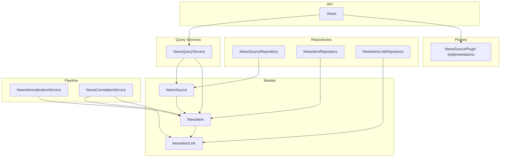
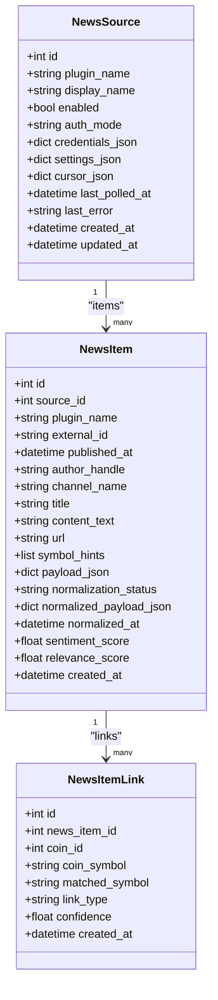
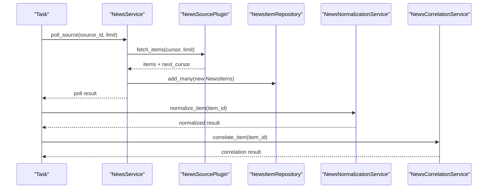
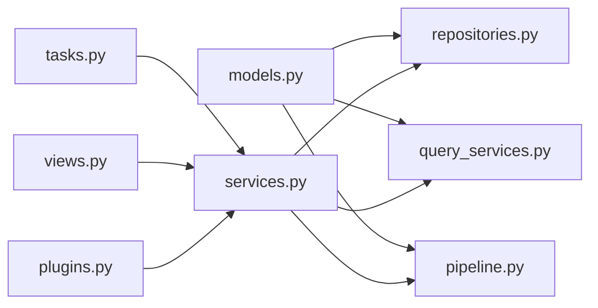

# News Data Models

<cite>
**Referenced Files in This Document**
- [models.py](file://src/apps/news/models.py)
- [repositories.py](file://src/apps/news/repositories.py)
- [query_services.py](file://src/apps/news/query_services.py)
- [read_models.py](file://src/apps/news/read_models.py)
- [schemas.py](file://src/apps/news/schemas.py)
- [constants.py](file://src/apps/news/constants.py)
- [plugins.py](file://src/apps/news/plugins.py)
- [pipeline.py](file://src/apps/news/pipeline.py)
- [tasks.py](file://src/apps/news/tasks.py)
- [views.py](file://src/apps/news/views.py)
- [exceptions.py](file://src/apps/news/exceptions.py)
- [20260312_000022_news_source_plugins.py](file://src/migrations/versions/20260312_000022_news_source_plugins.py)
- [20260312_000023_news_normalization_pipeline.py](file://src/migrations/versions/20260312_000023_news_normalization_pipeline.py)
</cite>

## Table of Contents
1. [Introduction](#introduction)
2. [Project Structure](#project-structure)
3. [Core Components](#core-components)
4. [Architecture Overview](#architecture-overview)
5. [Detailed Component Analysis](#detailed-component-analysis)
6. [Dependency Analysis](#dependency-analysis)
7. [Performance Considerations](#performance-considerations)
8. [Troubleshooting Guide](#troubleshooting-guide)
9. [Conclusion](#conclusion)

## Introduction
This document describes the news data models that power the news ingestion and enrichment subsystem. It covers the three primary entities—NewsSource, NewsItem, and NewsItemLink—detailing their database schema, relationships, constraints, indexing strategies, and lifecycle management. It also explains how these models integrate with repositories, query services, normalization and correlation pipelines, and the API surface. Practical guidance is included for instantiation, querying, relationship traversal, and operational concerns such as soft deletion considerations and audit trails.

## Project Structure
The news domain is organized around a clear separation of concerns:
- Models define the persistent entities and relationships.
- Repositories encapsulate CRUD and specialized queries.
- Query services expose read models for the API.
- Schemas define validated request/response shapes.
- Constants centralize statuses and keywords.
- Plugins implement ingestion from external sources.
- Pipeline services handle normalization and correlation.
- Tasks coordinate asynchronous jobs.
- Views bind services to HTTP endpoints.

**Diagram sources**
- [models.py:15-101](file://src/apps/news/models.py#L15-L101)
- [repositories.py:12-169](file://src/apps/news/repositories.py#L12-L169)
- [query_services.py:20-75](file://src/apps/news/query_services.py#L20-L75)
- [pipeline.py:103-307](file://src/apps/news/pipeline.py#L103-L307)
- [plugins.py:59-366](file://src/apps/news/plugins.py#L59-L366)
- [views.py:31-176](file://src/apps/news/views.py#L31-L176)

**Section sources**
- [models.py:15-101](file://src/apps/news/models.py#L15-L101)
- [repositories.py:12-169](file://src/apps/news/repositories.py#L12-L169)
- [query_services.py:20-75](file://src/apps/news/query_services.py#L20-L75)
- [schemas.py:9-205](file://src/apps/news/schemas.py#L9-L205)
- [constants.py:1-56](file://src/apps/news/constants.py#L1-L56)
- [plugins.py:59-366](file://src/apps/news/plugins.py#L59-L366)
- [pipeline.py:103-307](file://src/apps/news/pipeline.py#L103-L307)
- [tasks.py:12-34](file://src/apps/news/tasks.py#L12-L34)
- [views.py:31-176](file://src/apps/news/views.py#L31-L176)

## Core Components
This section documents each model class, its attributes, constraints, and purpose in the news ecosystem.

- NewsSource
  - Purpose: Represents a configured ingestion source (e.g., X/Twitter, Telegram, Discord).
  - Key attributes: plugin_name, display_name, enabled, auth_mode, credentials_json, settings_json, cursor_json, last_polled_at, last_error, timestamps.
  - Constraints: Unique composite index on plugin_name and display_name; indexes on enabled with updated_at descending.
  - Relationships: One-to-many with NewsItem via items.
  - Lifecycle: Created/updated/deleted via NewsService; polled by tasks/jobs.

- NewsItem
  - Purpose: Stores a single article/post fetched from a source.
  - Key attributes: source_id, plugin_name, external_id, published_at, author_handle, channel_name, title, content_text, url, symbol_hints, payload_json, normalization fields, timestamps.
  - Constraints: Unique composite index on source_id and external_id; indexes on published_at descending and on plugin_name with published_at descending.
  - Relationships: Belongs to NewsSource; has many NewsItemLink via links.
  - Lifecycle: Created during polling; later normalized and correlated.

- NewsItemLink
  - Purpose: Links a NewsItem to market symbols (coins) with confidence and metadata.
  - Key attributes: news_item_id, coin_id, coin_symbol, matched_symbol, link_type, confidence, timestamps.
  - Constraints: Unique composite index on news_item_id and coin_id; index on coin_id with confidence descending.
  - Relationships: Belongs to NewsItem.
  - Lifecycle: Created by correlation pipeline; supports soft deletion via cascade on item.

**Section sources**
- [models.py:15-101](file://src/apps/news/models.py#L15-L101)
- [20260312_000022_news_source_plugins.py:18-71](file://src/migrations/versions/20260312_000022_news_source_plugins.py#L18-L71)
- [20260312_000023_news_normalization_pipeline.py:18-51](file://src/migrations/versions/20260312_000023_news_normalization_pipeline.py#L18-L51)

## Architecture Overview
The news subsystem follows a layered architecture:
- Data layer: SQLAlchemy ORM models with Alembic migrations.
- Persistence layer: Async repositories for CRUD and specialized queries.
- Domain services: NewsService orchestrates ingestion; normalization and correlation services enrich items.
- API layer: FastAPI views expose endpoints; schemas validate payloads; read models decouple ORM from API.
- Asynchronous execution: Tasks coordinate polling and enrichment with Redis-backed locking.

**Diagram sources**
- [models.py:15-101](file://src/apps/news/models.py#L15-L101)

**Section sources**
- [models.py:15-101](file://src/apps/news/models.py#L15-L101)
- [repositories.py:12-169](file://src/apps/news/repositories.py#L12-L169)
- [query_services.py:20-75](file://src/apps/news/query_services.py#L20-L75)
- [views.py:31-176](file://src/apps/news/views.py#L31-L176)

## Detailed Component Analysis

### Database Schema Design and Constraints
- NewsSources table
  - Unique index: (plugin_name, display_name)
  - Index: (enabled, updated_at DESC)
- NewsItems table
  - Unique index: (source_id, external_id)
  - Index: published_at DESC
  - Index: (plugin_name, published_at DESC)
- NewsItemLinks table
  - Unique index: (news_item_id, coin_id)
  - Index: (coin_id, confidence DESC)

These indexes optimize frequent queries:
- Listing sources by status and recency.
- Fetching recent items per source or globally.
- Looking up symbol correlations efficiently.

**Section sources**
- [models.py:17-19](file://src/apps/news/models.py#L17-L19)
- [models.py:50-54](file://src/apps/news/models.py#L50-L54)
- [models.py:86-89](file://src/apps/news/models.py#L86-L89)
- [20260312_000022_news_source_plugins.py:34-41](file://src/migrations/versions/20260312_000022_news_source_plugins.py#L34-L41)
- [20260312_000022_news_source_plugins.py:59-70](file://src/migrations/versions/20260312_000022_news_source_plugins.py#L59-L70)
- [20260312_000023_news_normalization_pipeline.py:44-51](file://src/migrations/versions/20260312_000023_news_normalization_pipeline.py#L44-L51)

### Model Relationships and Foreign Keys
- NewsSource.id → NewsItem.source_id (ondelete=CASCADE)
- NewsItem.id → NewsItemLink.news_item_id (ondelete=CASCADE)
- NewsItemLink.coin_id references coins.id (ondelete=CASCADE)

Cascade deletes ensure referential integrity when a source or item is removed.

**Section sources**
- [models.py:40-45](file://src/apps/news/models.py#L40-L45)
- [models.py:75-81](file://src/apps/news/models.py#L75-L81)
- [models.py:92-93](file://src/apps/news/models.py#L92-L93)
- [20260312_000022_news_source_plugins.py:43-58](file://src/migrations/versions/20260312_000022_news_source_plugins.py#L43-L58)
- [20260312_000023_news_normalization_pipeline.py:33-43](file://src/migrations/versions/20260312_000023_news_normalization_pipeline.py#L33-L43)

### Data Validation Rules
- NewsSource
  - plugin_name and display_name are required and must be unique together.
  - enabled defaults to True; timestamps managed by server_default/onupdate.
- NewsItem
  - external_id must be unique per source; published_at is required.
  - content_text defaults to empty string; JSON fields default to empty structures.
  - normalization_status defaults to pending; sentiment/relevance scores initially null.
- NewsItemLink
  - coin_id and coin_symbol must be provided; confidence defaults to 0.0.

**Section sources**
- [models.py:22-38](file://src/apps/news/models.py#L22-L38)
- [models.py:56-75](file://src/apps/news/models.py#L56-L75)
- [models.py:91-98](file://src/apps/news/models.py#L91-L98)
- [20260312_000022_news_source_plugins.py:19-58](file://src/migrations/versions/20260312_000022_news_source_plugins.py#L19-L58)
- [20260312_000023_news_normalization_pipeline.py:19-31](file://src/migrations/versions/20260312_000023_news_normalization_pipeline.py#L19-L31)

### Examples: Instantiation, Querying, and Relationship Traversal
- Instantiate a NewsSource
  - Use NewsService.create_source with NewsSourceCreate payload; repository persists and refreshes.
  - Reference: [services.py:64-94](file://src/apps/news/services.py#L64-L94), [repositories.py:67-80](file://src/apps/news/repositories.py#L67-L80)
- Poll a source and ingest items
  - NewsService.poll_source invokes plugin.fetch_items, deduplicates by external_id, creates NewsItem entries, updates cursor and last_polled_at.
  - Reference: [services.py:145-229](file://src/apps/news/services.py#L145-L229)
- Query items with links
  - NewsQueryService.list_items uses selectinload(NewsItem.links) and orders by published_at desc.
  - Reference: [query_services.py:54-72](file://src/apps/news/query_services.py#L54-L72)
- Traverse relationships
  - Access item.source and item.links; access link.item.
  - Reference: [models.py:75-81](file://src/apps/news/models.py#L75-L81), [models.py:100](file://src/apps/news/models.py#L100)

**Section sources**
- [services.py:64-94](file://src/apps/news/services.py#L64-L94)
- [services.py:145-229](file://src/apps/news/services.py#L145-L229)
- [query_services.py:54-72](file://src/apps/news/query_services.py#L54-L72)
- [models.py:75-81](file://src/apps/news/models.py#L75-L81)
- [models.py:100](file://src/apps/news/models.py#L100)

### Normalization and Correlation Pipelines
- Normalization
  - Extracts topics, sentiment, relevance, and detected symbols; writes normalized_payload_json, sentiment_score, relevance_score, and normalized_at.
  - Publishes NEWS_EVENT_ITEM_NORMALIZED.
  - Reference: [pipeline.py:109-187](file://src/apps/news/pipeline.py#L109-L187)
- Correlation
  - Matches detected symbols/names against coin aliases; creates NewsItemLink entries with confidence; publishes NEWS_EVENT_SYMBOL_CORRELATION_UPDATED.
  - Reference: [pipeline.py:209-307](file://src/apps/news/pipeline.py#L209-L307)

**Diagram sources**
- [tasks.py:12-34](file://src/apps/news/tasks.py#L12-L34)
- [services.py:145-229](file://src/apps/news/services.py#L145-L229)
- [pipeline.py:109-187](file://src/apps/news/pipeline.py#L109-L187)
- [pipeline.py:209-307](file://src/apps/news/pipeline.py#L209-L307)

**Section sources**
- [pipeline.py:109-187](file://src/apps/news/pipeline.py#L109-L187)
- [pipeline.py:209-307](file://src/apps/news/pipeline.py#L209-L307)

### Data Lifecycle Management and Audit Trail
- Creation and updates
  - created_at and updated_at timestamps are server-managed; NewsSource updates trigger ordering indexes on enabled and updated_at.
- Polling lifecycle
  - last_polled_at updated on each poll; last_error cleared on success; cursor_json advanced by plugin-specific cursors.
- Cascade deletion
  - Deleting a NewsSource cascades to NewsItems; deleting a NewsItem cascades to NewsItemLinks.
- Audit trail
  - Events published for ingestion, normalization, and correlation; read models capture status and timestamps for API exposure.

**Section sources**
- [models.py:32-38](file://src/apps/news/models.py#L32-L38)
- [models.py:40-45](file://src/apps/news/models.py#L40-L45)
- [models.py:75-81](file://src/apps/news/models.py#L75-L81)
- [services.py:157-229](file://src/apps/news/services.py#L157-L229)
- [pipeline.py:166-179](file://src/apps/news/pipeline.py#L166-L179)
- [pipeline.py:283-299](file://src/apps/news/pipeline.py#L283-L299)

## Dependency Analysis
- Internal dependencies
  - models.py defines the ORM entities and relationships.
  - repositories.py depends on models and AsyncRepository for persistence.
  - query_services.py depends on models and read models for API exposure.
  - services.py orchestrates ingestion and integrates plugins.
  - pipeline.py depends on models and repositories for enrichment.
  - tasks.py coordinates asynchronous jobs.
  - views.py binds services to endpoints.
- External dependencies
  - SQLAlchemy ORM and Alembic migrations.
  - Pydantic schemas for validation.
  - Optional Telethon for Telegram plugin.

**Diagram sources**
- [models.py:15-101](file://src/apps/news/models.py#L15-L101)
- [repositories.py:12-169](file://src/apps/news/repositories.py#L12-L169)
- [query_services.py:20-75](file://src/apps/news/query_services.py#L20-L75)
- [services.py:57-241](file://src/apps/news/services.py#L57-L241)
- [pipeline.py:103-307](file://src/apps/news/pipeline.py#L103-L307)
- [tasks.py:12-34](file://src/apps/news/tasks.py#L12-L34)
- [views.py:31-176](file://src/apps/news/views.py#L31-L176)
- [plugins.py:59-366](file://src/apps/news/plugins.py#L59-L366)

**Section sources**
- [models.py:15-101](file://src/apps/news/models.py#L15-L101)
- [repositories.py:12-169](file://src/apps/news/repositories.py#L12-L169)
- [query_services.py:20-75](file://src/apps/news/query_services.py#L20-L75)
- [services.py:57-241](file://src/apps/news/services.py#L57-L241)
- [pipeline.py:103-307](file://src/apps/news/pipeline.py#L103-L307)
- [tasks.py:12-34](file://src/apps/news/tasks.py#L12-L34)
- [views.py:31-176](file://src/apps/news/views.py#L31-L176)
- [plugins.py:59-366](file://src/apps/news/plugins.py#L59-L366)

## Performance Considerations
- Indexing
  - Sources: unique (plugin_name, display_name); index (enabled, updated_at DESC) for efficient listing of enabled sources ordered by recency.
  - Items: unique (source_id, external_id); index (published_at DESC) for chronological retrieval; index (plugin_name, published_at DESC) for plugin-scoped sorting.
  - Links: unique (news_item_id, coin_id); index (coin_id, confidence DESC) for top-confidence symbol lookups.
- Query patterns
  - Use selectinload for fetching items with links to avoid N+1 queries.
  - Prefer filtering by source_id and published_at DESC to leverage indexes.
- Concurrency and locking
  - Tasks use Redis-backed locks to prevent overlapping polls.
- Data types
  - BigInteger for primary keys reduces collision risks for large-scale ingestion.
  - JSON fields store flexible payloads; defaults ensure consistent empty structures.

**Section sources**
- [models.py:17-19](file://src/apps/news/models.py#L17-L19)
- [models.py:50-54](file://src/apps/news/models.py#L50-L54)
- [models.py:86-89](file://src/apps/news/models.py#L86-L89)
- [query_services.py:61-72](file://src/apps/news/query_services.py#L61-L72)
- [tasks.py:14-19](file://src/apps/news/tasks.py#L14-L19)

## Troubleshooting Guide
- Common errors
  - Unsupported or invalid plugin configuration raises InvalidNewsSourceConfigurationError or UnsupportedNewsPluginError.
  - Telegram onboarding failures raise TelegramOnboardingError.
  - Missing required fields in payloads cause validation errors at the API boundary.
- Symptoms and resolutions
  - Duplicate source display_name for a plugin: adjust display_name or update existing source.
  - Duplicate external_id per source: deduplication prevents insertion; inspect plugin cursor and external_id generation.
  - Polling failures: last_error populated; review credentials/settings; clear error via update_source with clear_error flag.
  - Normalization/correlation failures: errors recorded in normalized_payload_json; inspect logs and retry.
- Audit and diagnostics
  - last_polled_at indicates latest poll attempt; last_error captures failure details.
  - Events published for ingestion, normalization, and correlation enable external monitoring.

**Section sources**
- [exceptions.py:1-15](file://src/apps/news/exceptions.py#L1-L15)
- [services.py:95-135](file://src/apps/news/services.py#L95-L135)
- [services.py:157-170](file://src/apps/news/services.py#L157-L170)
- [pipeline.py:154-164](file://src/apps/news/pipeline.py#L154-L164)
- [views.py:48-66](file://src/apps/news/views.py#L48-L66)

## Conclusion
The news data models form a robust foundation for ingestion, enrichment, and correlation of external news feeds. Their schema design, constraints, and indexes support high-performance reads and writes. The separation of concerns across repositories, services, and pipeline components ensures maintainability and scalability. Operational safeguards such as task locks, event-driven normalization, and comprehensive error handling contribute to a reliable system for real-time market intelligence.