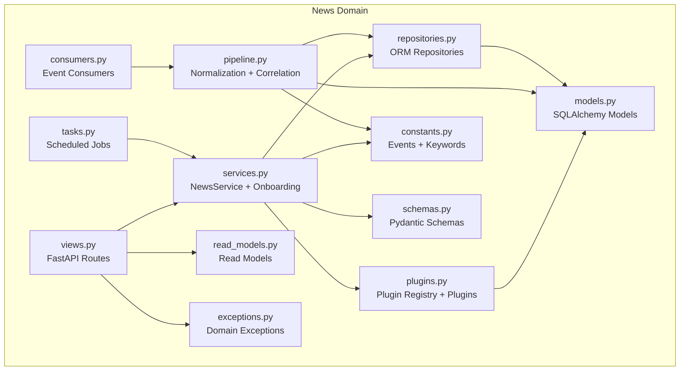
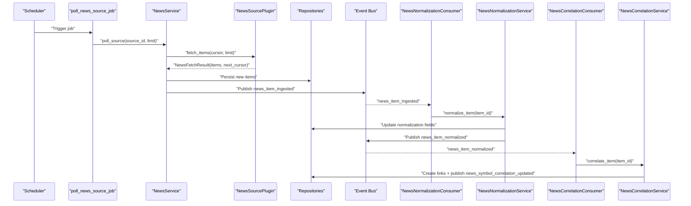
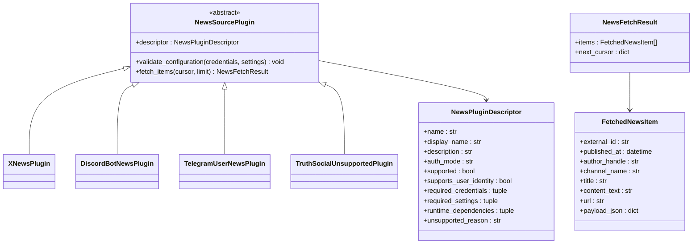
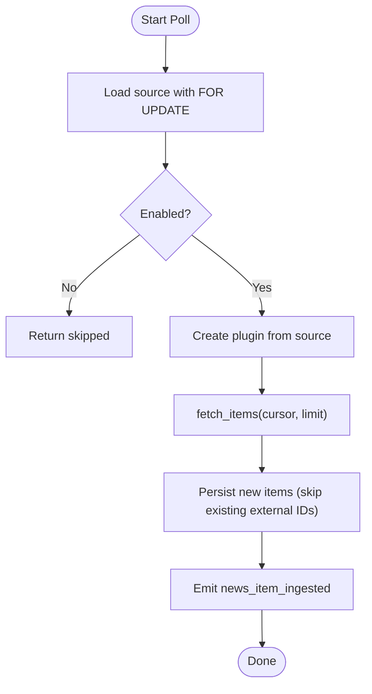
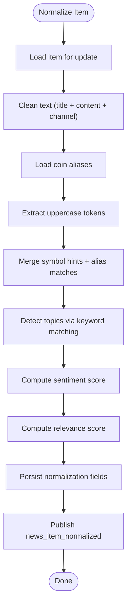
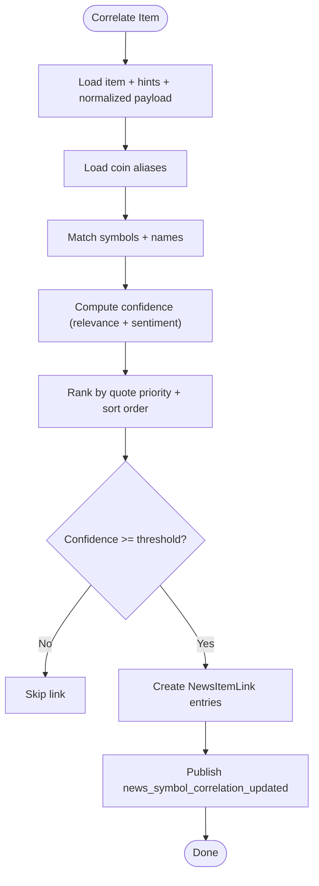
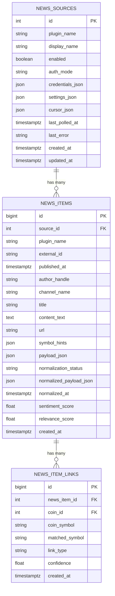
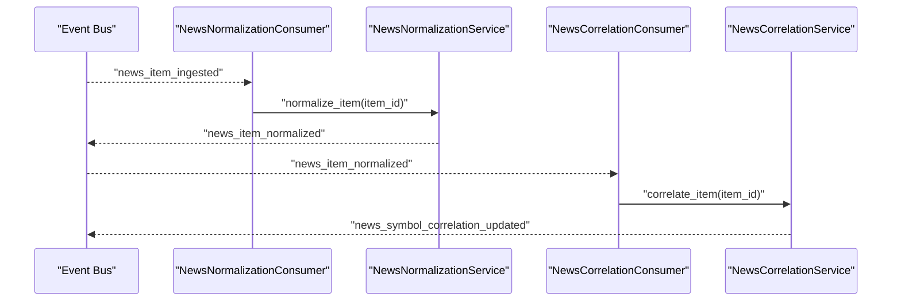
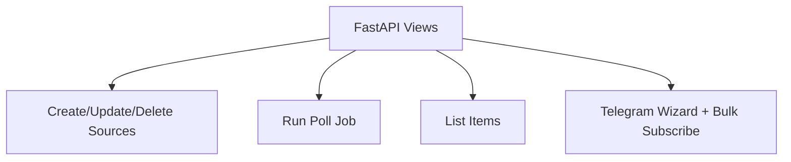
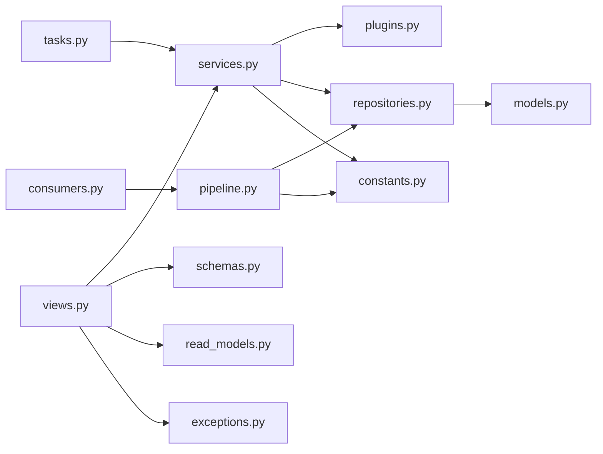

# News Integration

<cite>
**Referenced Files in This Document**
- [plugins.py](file://src/apps/news/plugins.py)
- [pipeline.py](file://src/apps/news/pipeline.py)
- [models.py](file://src/apps/news/models.py)
- [services.py](file://src/apps/news/services.py)
- [repositories.py](file://src/apps/news/repositories.py)
- [consumers.py](file://src/apps/news/consumers.py)
- [tasks.py](file://src/apps/news/tasks.py)
- [constants.py](file://src/apps/news/constants.py)
- [schemas.py](file://src/apps/news/schemas.py)
- [read_models.py](file://src/apps/news/read_models.py)
- [exceptions.py](file://src/apps/news/exceptions.py)
- [views.py](file://src/apps/news/views.py)
</cite>

## Table of Contents
1. [Introduction](#introduction)
2. [Project Structure](#project-structure)
3. [Core Components](#core-components)
4. [Architecture Overview](#architecture-overview)
5. [Detailed Component Analysis](#detailed-component-analysis)
6. [Dependency Analysis](#dependency-analysis)
7. [Performance Considerations](#performance-considerations)
8. [Troubleshooting Guide](#troubleshooting-guide)
9. [Conclusion](#conclusion)
10. [Appendices](#appendices)

## Introduction
This document describes the news integration system that ingests, normalizes, correlates, and publishes insights from multiple social and community platforms. It covers the plugin architecture for sourcing news, the normalization and sentiment pipelines, symbol correlation against market data, and the event-driven enrichment workflow. It also documents real-time ingestion, content filtering, quality assurance, and performance optimization strategies for high-volume processing.

## Project Structure
The news subsystem is organized around a plugin-based ingestion layer, a normalization pipeline, correlation services, persistence models, and a streaming event bus. Supporting components include repositories, query services, schemas, read models, tasks, and FastAPI views.

**Diagram sources**
- [plugins.py:1-366](file://src/apps/news/plugins.py#L1-L366)
- [services.py:1-531](file://src/apps/news/services.py#L1-L531)
- [pipeline.py:1-310](file://src/apps/news/pipeline.py#L1-L310)
- [repositories.py:1-170](file://src/apps/news/repositories.py#L1-L170)
- [models.py:1-104](file://src/apps/news/models.py#L1-L104)
- [consumers.py:1-38](file://src/apps/news/consumers.py#L1-L38)
- [tasks.py:1-34](file://src/apps/news/tasks.py#L1-L34)
- [constants.py:1-56](file://src/apps/news/constants.py#L1-L56)
- [schemas.py:1-205](file://src/apps/news/schemas.py#L1-L205)
- [read_models.py:1-162](file://src/apps/news/read_models.py#L1-L162)
- [exceptions.py:1-15](file://src/apps/news/exceptions.py#L1-L15)
- [views.py:1-176](file://src/apps/news/views.py#L1-L176)

**Section sources**
- [plugins.py:1-366](file://src/apps/news/plugins.py#L1-L366)
- [services.py:1-531](file://src/apps/news/services.py#L1-L531)
- [pipeline.py:1-310](file://src/apps/news/pipeline.py#L1-L310)
- [repositories.py:1-170](file://src/apps/news/repositories.py#L1-L170)
- [models.py:1-104](file://src/apps/news/models.py#L1-L104)
- [consumers.py:1-38](file://src/apps/news/consumers.py#L1-L38)
- [tasks.py:1-34](file://src/apps/news/tasks.py#L1-L34)
- [constants.py:1-56](file://src/apps/news/constants.py#L1-L56)
- [schemas.py:1-205](file://src/apps/news/schemas.py#L1-L205)
- [read_models.py:1-162](file://src/apps/news/read_models.py#L1-L162)
- [exceptions.py:1-15](file://src/apps/news/exceptions.py#L1-L15)
- [views.py:1-176](file://src/apps/news/views.py#L1-L176)

## Core Components
- Plugin system: A registry-based plugin architecture supporting multiple news sources (X/Twitter, Discord, Telegram, and a reserved placeholder for Truth Social). Each plugin encapsulates source-specific parsing and pagination logic.
- Ingestion service: Polls sources, deduplicates by external ID, persists items, and emits ingestion events.
- Normalization pipeline: Cleans text, detects symbols and topics, computes sentiment and relevance scores, and publishes normalization events.
- Correlation service: Links normalized news items to coins using aliases and confidence thresholds, publishing correlation events.
- Event-driven consumers: Subscribe to ingestion and normalization events to drive downstream processing.
- Persistence: SQLAlchemy models for sources, items, and item-to-coin links; repositories for CRUD and queries; read models for API responses.
- Task orchestration: Scheduled jobs with Redis-backed distributed locks to poll sources safely at scale.
- API surface: FastAPI routes for managing sources, listing items, and onboarding Telegram sources.

**Section sources**
- [plugins.py:95-115](file://src/apps/news/plugins.py#L95-L115)
- [services.py:145-241](file://src/apps/news/services.py#L145-L241)
- [pipeline.py:103-307](file://src/apps/news/pipeline.py#L103-L307)
- [consumers.py:9-35](file://src/apps/news/consumers.py#L9-L35)
- [repositories.py:12-161](file://src/apps/news/repositories.py#L12-L161)
- [models.py:15-101](file://src/apps/news/models.py#L15-L101)
- [tasks.py:12-33](file://src/apps/news/tasks.py#L12-L33)
- [views.py:31-176](file://src/apps/news/views.py#L31-L176)

## Architecture Overview
The system follows an event-driven ingestion pipeline:
- Sources are polled via plugins registered per source configuration.
- New items trigger ingestion events, which are consumed to normalize content and compute sentiment/relevance.
- Normalization events trigger correlation with market data to link items to coins.
- All stages persist outcomes and publish domain events for downstream subscribers.

**Diagram sources**
- [tasks.py:12-22](file://src/apps/news/tasks.py#L12-L22)
- [services.py:145-228](file://src/apps/news/services.py#L145-L228)
- [plugins.py:117-179](file://src/apps/news/plugins.py#L117-L179)
- [consumers.py:13-34](file://src/apps/news/consumers.py#L13-L34)
- [pipeline.py:109-186](file://src/apps/news/pipeline.py#L109-L186)
- [pipeline.py:209-306](file://src/apps/news/pipeline.py#L209-L306)

## Detailed Component Analysis

### Plugin Architecture and Registration
- Plugin registry: A dictionary keyed by plugin name maps to plugin classes. Registration functions expose lookup and listing capabilities.
- Base plugin contract: Defines a descriptor, configuration validation, and an asynchronous fetch method returning a typed result with items and pagination cursors.
- Built-in plugins:
  - X/Twitter: Fetches tweets from a user timeline using bearer or user tokens.
  - Discord Bot: Polls channel messages using a bot token.
  - Telegram User: Uses Telethon to iterate messages from a chosen channel/chat; supports onboarding flows.
  - Truth Social: Reserved and unsupported due to lack of public API.
- Validation: Each plugin validates required credentials/settings; sources are validated before creation/update.

**Diagram sources**
- [plugins.py:27-57](file://src/apps/news/plugins.py#L27-L57)
- [plugins.py:59-93](file://src/apps/news/plugins.py#L59-L93)
- [plugins.py:117-179](file://src/apps/news/plugins.py#L117-L179)
- [plugins.py:182-224](file://src/apps/news/plugins.py#L182-L224)
- [plugins.py:227-316](file://src/apps/news/plugins.py#L227-L316)
- [plugins.py:330-344](file://src/apps/news/plugins.py#L330-L344)

**Section sources**
- [plugins.py:95-115](file://src/apps/news/plugins.py#L95-L115)
- [plugins.py:117-179](file://src/apps/news/plugins.py#L117-L179)
- [plugins.py:182-224](file://src/apps/news/plugins.py#L182-L224)
- [plugins.py:227-316](file://src/apps/news/plugins.py#L227-L316)
- [plugins.py:330-344](file://src/apps/news/plugins.py#L330-L344)

### Real-Time Ingestion and Content Filtering
- Ingestion flow:
  - Polling is performed by a scheduled task with distributed locks to prevent concurrent runs.
  - For each source, the plugin fetches items up to a configurable limit.
  - Existing external IDs are deduplicated before insertion.
  - Newly inserted items emit ingestion events with metadata for downstream processing.
- Content filtering:
  - Symbol hints are extracted from content using a pattern that matches ticker-like cashtags.
  - Per-source cursors maintain pagination continuity across runs.

**Diagram sources**
- [tasks.py:12-22](file://src/apps/news/tasks.py#L12-L22)
- [services.py:145-228](file://src/apps/news/services.py#L145-L228)
- [repositories.py:92-117](file://src/apps/news/repositories.py#L92-L117)

**Section sources**
- [tasks.py:12-33](file://src/apps/news/tasks.py#L12-L33)
- [services.py:145-241](file://src/apps/news/services.py#L145-L241)
- [repositories.py:92-117](file://src/apps/news/repositories.py#L92-L117)

### Content Normalization and Sentiment Scoring
- Normalization pipeline:
  - Cleans and concatenates title, content, and channel name.
  - Loads coin aliases from market data to detect symbols and company names.
  - Extracts uppercase tokens as potential symbols and merges with explicit hints.
  - Detects topics using keyword sets.
  - Computes sentiment score from positive/negative keyword counts and clamps to [-1, 1].
  - Calculates a composite relevance score incorporating symbol/topic presence, URL presence, and text length.
  - Persists normalization fields and publishes a normalization event.
- Quality assurance:
  - Errors during normalization are captured and stored with a distinct status and timestamp.

**Diagram sources**
- [pipeline.py:109-186](file://src/apps/news/pipeline.py#L109-L186)
- [pipeline.py:188-200](file://src/apps/news/pipeline.py#L188-L200)

**Section sources**
- [pipeline.py:103-186](file://src/apps/news/pipeline.py#L103-L186)
- [constants.py:25-55](file://src/apps/news/constants.py#L25-L55)

### Event Correlation with Market Data
- Correlation process:
  - Aggregates detected symbols from hints and normalization output.
  - Matches against coin aliases and textual mentions.
  - Computes confidence combining symbol/link type, relevance, and absolute sentiment.
  - Applies a ranking to resolve ties and filters by minimum confidence threshold.
  - Creates item-to-coin links and publishes correlation events.
- Integration with trading signals:
  - Correlation events include sentiment and relevance scores, enabling downstream systems to incorporate sentiment-driven decisions.

**Diagram sources**
- [pipeline.py:209-306](file://src/apps/news/pipeline.py#L209-L306)

**Section sources**
- [pipeline.py:203-306](file://src/apps/news/pipeline.py#L203-L306)

### Data Models and Relationships
The domain uses three core tables:
- NewsSource: Stores plugin identity, credentials, settings, cursor, and health fields.
- NewsItem: Stores parsed content, metadata, normalization fields, and links.
- NewsItemLink: Connects items to coins with matched symbol and confidence.

**Diagram sources**
- [models.py:15-101](file://src/apps/news/models.py#L15-L101)

**Section sources**
- [models.py:15-101](file://src/apps/news/models.py#L15-L101)

### Event-Driven Consumers
- Normalization consumer: Listens for ingestion events and triggers normalization.
- Correlation consumer: Listens for normalization events and triggers correlation.

**Diagram sources**
- [consumers.py:13-34](file://src/apps/news/consumers.py#L13-L34)
- [pipeline.py:166-179](file://src/apps/news/pipeline.py#L166-L179)
- [pipeline.py:283-299](file://src/apps/news/pipeline.py#L283-L299)

**Section sources**
- [consumers.py:9-35](file://src/apps/news/consumers.py#L9-L35)

### API Surface and Onboarding
- Management endpoints:
  - List plugins and sources.
  - Create, update, and delete sources with validation.
  - List items with pagination and link details.
  - Trigger polling jobs via queue.
- Telegram onboarding:
  - Request and confirm login codes.
  - List available dialogs and provision sources in bulk.

**Diagram sources**
- [views.py:31-176](file://src/apps/news/views.py#L31-L176)

**Section sources**
- [views.py:31-176](file://src/apps/news/views.py#L31-L176)

## Dependency Analysis
- Coupling:
  - Services depend on repositories and plugins; normalization/correlation services depend on repositories and shared constants.
  - Consumers depend on services and operate independently via events.
- Cohesion:
  - Each module focuses on a single responsibility: plugins, normalization, correlation, persistence, or API.
- External integrations:
  - HTTP clients for X and Discord APIs.
  - Optional Telethon dependency for Telegram.
- Event contracts:
  - Events define payloads for downstream consumers.

**Diagram sources**
- [views.py:1-176](file://src/apps/news/views.py#L1-L176)
- [services.py:1-531](file://src/apps/news/services.py#L1-L531)
- [plugins.py:1-366](file://src/apps/news/plugins.py#L1-L366)
- [repositories.py:1-170](file://src/apps/news/repositories.py#L1-L170)
- [models.py:1-104](file://src/apps/news/models.py#L1-L104)
- [consumers.py:1-38](file://src/apps/news/consumers.py#L1-L38)
- [tasks.py:1-34](file://src/apps/news/tasks.py#L1-L34)
- [constants.py:1-56](file://src/apps/news/constants.py#L1-L56)
- [schemas.py:1-205](file://src/apps/news/schemas.py#L1-L205)
- [read_models.py:1-162](file://src/apps/news/read_models.py#L1-L162)
- [exceptions.py:1-15](file://src/apps/news/exceptions.py#L1-L15)

**Section sources**
- [services.py:1-531](file://src/apps/news/services.py#L1-L531)
- [pipeline.py:1-310](file://src/apps/news/pipeline.py#L1-L310)
- [consumers.py:1-38](file://src/apps/news/consumers.py#L1-L38)
- [tasks.py:1-34](file://src/apps/news/tasks.py#L1-L34)
- [repositories.py:1-170](file://src/apps/news/repositories.py#L1-L170)
- [models.py:1-104](file://src/apps/news/models.py#L1-L104)
- [views.py:1-176](file://src/apps/news/views.py#L1-L176)

## Performance Considerations
- Concurrency control:
  - Distributed locks on Redis prevent overlapping polls for the same source and global enabled-poll runs.
- Batch writes:
  - Bulk insertions for items and links reduce database round-trips.
- Pagination cursors:
  - Cursor-based pagination ensures incremental polling and avoids duplicates.
- Keyword-based scoring:
  - Lightweight string operations and bounded keyword lists keep normalization fast.
- Asynchronous I/O:
  - HTTP polling and Telethon usage are off the request path, minimizing latency spikes.
- Indexing:
  - Database indexes on timestamps, source IDs, and uniqueness constraints optimize reads and writes.

[No sources needed since this section provides general guidance]

## Troubleshooting Guide
- Unsupported plugin errors:
  - Occur when attempting to use a disabled or unregistered plugin.
- Invalid configuration:
  - Raised when required credentials or settings are missing or invalid.
- Telegram onboarding failures:
  - Errors during code requests, sign-ins, or dialog enumeration.
- Polling failures:
  - Errors are recorded on the source with a timestamp; inspect last_error and last_polled_at.
- Normalization errors:
  - Errors are captured in the normalized payload and status; review logs and item details.

**Section sources**
- [exceptions.py:1-15](file://src/apps/news/exceptions.py#L1-L15)
- [services.py:157-170](file://src/apps/news/services.py#L157-L170)
- [pipeline.py:154-164](file://src/apps/news/pipeline.py#L154-L164)
- [models.py:15-38](file://src/apps/news/models.py#L15-L38)

## Conclusion
The news integration system provides a robust, extensible framework for real-time ingestion from diverse sources, automated content normalization and sentiment scoring, and symbol correlation against market data. Its event-driven design enables scalable, decoupled processing suitable for high-volume scenarios, while built-in quality controls and onboarding flows support operational reliability.

[No sources needed since this section summarizes without analyzing specific files]

## Appendices

### API Definitions
- List plugins: GET /news/plugins
- List sources: GET /news/sources
- Create source: POST /news/sources
- Patch source: PATCH /news/sources/{source_id}
- Delete source: DELETE /news/sources/{source_id}
- List items: GET /news/items
- Run poll job: POST /news/sources/{source_id}/jobs/run
- Telegram onboarding:
  - Request code: POST /news/onboarding/telegram/session/request
  - Confirm code: POST /news/onboarding/telegram/session/confirm
  - List dialogs: POST /news/onboarding/telegram/dialogs
  - Wizard spec: GET /news/onboarding/telegram/wizard
  - Create source from dialog: POST /news/onboarding/telegram/sources
  - Bulk subscribe: POST /news/onboarding/telegram/sources/bulk

**Section sources**
- [views.py:31-176](file://src/apps/news/views.py#L31-L176)