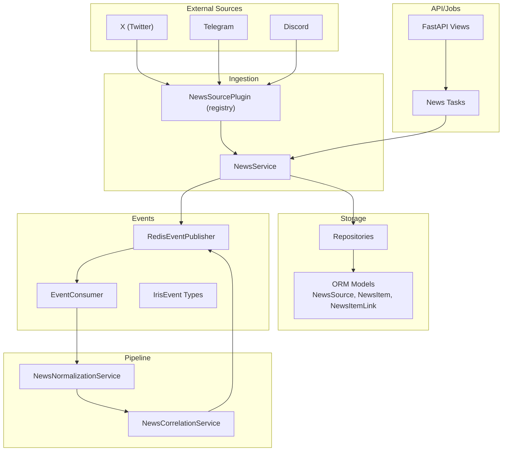
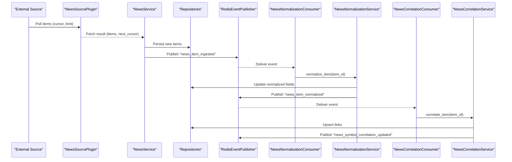
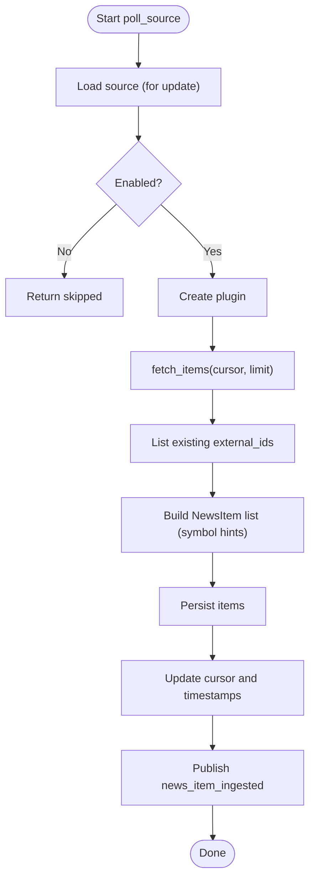
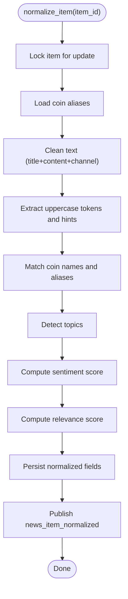
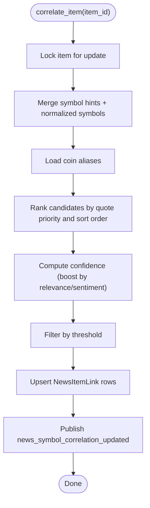
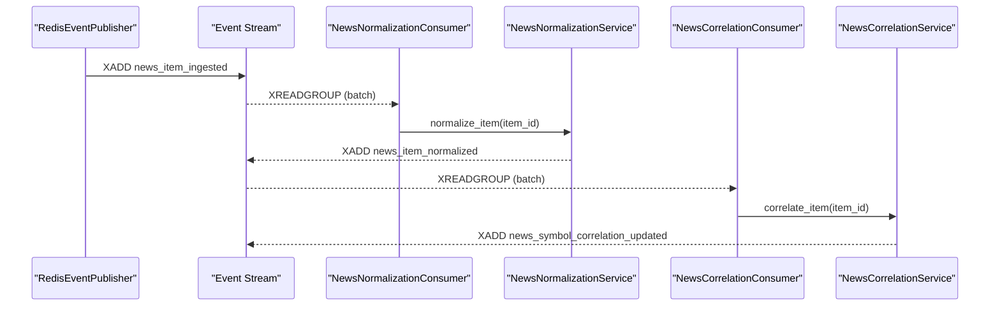
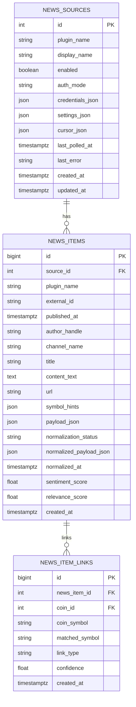
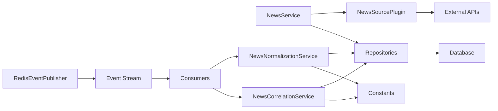

# News Processing Pipeline

<cite>
**Referenced Files in This Document**
- [pipeline.py](file://src/apps/news/pipeline.py)
- [plugins.py](file://src/apps/news/plugins.py)
- [models.py](file://src/apps/news/models.py)
- [consumers.py](file://src/apps/news/consumers.py)
- [services.py](file://src/apps/news/services.py)
- [constants.py](file://src/apps/news/constants.py)
- [repositories.py](file://src/apps/news/repositories.py)
- [schemas.py](file://src/apps/news/schemas.py)
- [tasks.py](file://src/apps/news/tasks.py)
- [query_services.py](file://src/apps/news/query_services.py)
- [exceptions.py](file://src/apps/news/exceptions.py)
- [read_models.py](file://src/apps/news/read_models.py)
- [views.py](file://src/apps/news/views.py)
- [publisher.py](file://src/runtime/streams/publisher.py)
- [consumer.py](file://src/runtime/streams/consumer.py)
- [types.py](file://src/runtime/streams/types.py)
</cite>

## Table of Contents
1. [Introduction](#introduction)
2. [Project Structure](#project-structure)
3. [Core Components](#core-components)
4. [Architecture Overview](#architecture-overview)
5. [Detailed Component Analysis](#detailed-component-analysis)
6. [Dependency Analysis](#dependency-analysis)
7. [Performance Considerations](#performance-considerations)
8. [Troubleshooting Guide](#troubleshooting-guide)
9. [Conclusion](#conclusion)
10. [Appendices](#appendices)

## Introduction
This document explains the end-to-end news processing pipeline that ingests content from multiple external sources, normalizes it into structured, actionable data, correlates detected assets with market data, and publishes normalized results as events for downstream consumers. It covers content extraction, text cleaning, entity recognition heuristics, sentiment analysis, normalization, filtering, quality assurance, processing hooks, middleware-like patterns, error handling, configuration, performance tuning, scalability, and integration points with external services and the event-driven processing model.

## Project Structure
The news subsystem is organized around a clear separation of concerns:
- Data model layer: persistent entities and relationships
- Repository layer: database access patterns
- Service layer: orchestration, validation, and business logic
- Plugin layer: pluggable external source integrations
- Pipeline layer: normalization and correlation services
- Consumers: event-driven handlers for asynchronous processing
- Runtime streams: Redis-backed event publishing and consumption
- Views/Tasks: HTTP endpoints and scheduled jobs to trigger ingestion

**Diagram sources**
- [services.py:145-240](file://src/apps/news/services.py#L145-L240)
- [plugins.py:95-115](file://src/apps/news/plugins.py#L95-L115)
- [models.py:15-101](file://src/apps/news/models.py#L15-L101)
- [repositories.py:12-170](file://src/apps/news/repositories.py#L12-L170)
- [pipeline.py:103-306](file://src/apps/news/pipeline.py#L103-L306)
- [publisher.py:22-101](file://src/runtime/streams/publisher.py#L22-L101)
- [consumer.py:49-230](file://src/runtime/streams/consumer.py#L49-L230)
- [types.py:51-165](file://src/runtime/streams/types.py#L51-L165)
- [views.py:86-104](file://src/apps/news/views.py#L86-L104)
- [tasks.py:12-34](file://src/apps/news/tasks.py#L12-L34)

**Section sources**
- [services.py:145-240](file://src/apps/news/services.py#L145-L240)
- [plugins.py:95-115](file://src/apps/news/plugins.py#L95-L115)
- [models.py:15-101](file://src/apps/news/models.py#L15-L101)
- [repositories.py:12-170](file://src/apps/news/repositories.py#L12-L170)
- [pipeline.py:103-306](file://src/apps/news/pipeline.py#L103-L306)
- [publisher.py:22-101](file://src/runtime/streams/publisher.py#L22-L101)
- [consumer.py:49-230](file://src/runtime/streams/consumer.py#L49-L230)
- [types.py:51-165](file://src/runtime/streams/types.py#L51-L165)
- [views.py:86-104](file://src/apps/news/views.py#L86-L104)
- [tasks.py:12-34](file://src/apps/news/tasks.py#L12-L34)

## Core Components
- NewsService orchestrates ingestion from registered plugins, persists items, and emits ingestion events.
- NewsSourcePlugin defines the plugin interface and registers concrete implementations for X, Telegram, Discord, and a placeholder for Truth Social.
- NewsNormalizationService performs text cleaning, symbol/name matching, topic detection, sentiment scoring, and relevance calculation; publishes normalized events.
- NewsCorrelationService correlates normalized items to coins using aliases and confidence thresholds; publishes correlation events.
- Event-driven consumers handle normalization and correlation asynchronously.
- Redis-backed event stream provides decoupled, durable processing with idempotent handling and stale message reprocessing.
- Schemas and read models define typed request/response contracts and projection models for queries.

**Section sources**
- [services.py:57-240](file://src/apps/news/services.py#L57-L240)
- [plugins.py:59-366](file://src/apps/news/plugins.py#L59-L366)
- [pipeline.py:103-306](file://src/apps/news/pipeline.py#L103-L306)
- [consumers.py:9-37](file://src/apps/news/consumers.py#L9-L37)
- [publisher.py:22-101](file://src/runtime/streams/publisher.py#L22-L101)
- [types.py:51-165](file://src/runtime/streams/types.py#L51-L165)
- [schemas.py:24-205](file://src/apps/news/schemas.py#L24-L205)
- [read_models.py:22-162](file://src/apps/news/read_models.py#L22-L162)

## Architecture Overview
The pipeline follows an event-driven architecture:
- Ingestion: NewsService polls enabled sources via plugins, persists items, and publishes a news_item_ingested event.
- Normalization: A consumer handles news_item_ingested, runs NewsNormalizationService to compute topics, sentiment, relevance, and detected symbols, then publishes news_item_normalized.
- Correlation: A consumer handles news_item_normalized, runs NewsCorrelationService to link items to coins, then publishes news_symbol_correlation_updated.
- Persistence: SQLAlchemy ORM models store sources, items, and links; repositories encapsulate CRUD and queries.
- Configuration: Constants define plugin names, event types, limits, and keyword sets; schemas define typed contracts.

**Diagram sources**
- [services.py:145-240](file://src/apps/news/services.py#L145-L240)
- [plugins.py:117-180](file://src/apps/news/plugins.py#L117-L180)
- [consumers.py:9-37](file://src/apps/news/consumers.py#L9-L37)
- [pipeline.py:109-186](file://src/apps/news/pipeline.py#L109-L186)
- [pipeline.py:209-306](file://src/apps/news/pipeline.py#L209-L306)
- [publisher.py:38-88](file://src/runtime/streams/publisher.py#L38-L88)

## Detailed Component Analysis

### Ingestion and Polling
- NewsService.poll_source validates the source, instantiates the appropriate plugin, fetches items, deduplicates by external_id, persists new items, updates cursor, clears last_error, and emits news_item_ingested events.
- Plugins implement fetch_items with per-source cursors and rate limits; X, Discord, and Telegram plugins are supported; Truth Social is intentionally unsupported.
- Task wrappers enforce distributed locks to prevent concurrent polling of the same source or all sources.

**Diagram sources**
- [services.py:145-240](file://src/apps/news/services.py#L145-L240)
- [plugins.py:117-180](file://src/apps/news/plugins.py#L117-L180)
- [tasks.py:12-34](file://src/apps/news/tasks.py#L12-L34)

**Section sources**
- [services.py:145-240](file://src/apps/news/services.py#L145-L240)
- [plugins.py:117-180](file://src/apps/news/plugins.py#L117-L180)
- [tasks.py:12-34](file://src/apps/news/tasks.py#L12-L34)

### Normalization Pipeline
- NewsNormalizationService loads coin aliases, cleans text, detects uppercase tokens and symbol hints, matches coin names and aliases, computes topics, sentiment, and relevance, and persists normalized fields.
- It publishes news_item_normalized with detected_symbols, topics, sentiment_label, and scores.

**Diagram sources**
- [pipeline.py:109-186](file://src/apps/news/pipeline.py#L109-L186)
- [constants.py:25-56](file://src/apps/news/constants.py#L25-L56)

**Section sources**
- [pipeline.py:109-186](file://src/apps/news/pipeline.py#L109-L186)
- [constants.py:25-56](file://src/apps/news/constants.py#L25-L56)

### Correlation Pipeline
- NewsCorrelationService recomputes detected symbols from hints and normalized payload, ranks candidates by quote priority and sort order, computes confidence with relevance and sentiment boosts, and upserts links.
- It publishes news_symbol_correlation_updated with link details and scores.

**Diagram sources**
- [pipeline.py:209-306](file://src/apps/news/pipeline.py#L209-L306)

**Section sources**
- [pipeline.py:209-306](file://src/apps/news/pipeline.py#L209-L306)

### Event-Driven Consumers
- NewsNormalizationConsumer listens for news_item_ingested and triggers normalization.
- NewsCorrelationConsumer listens for news_item_normalized and triggers correlation.
- Consumers run in dedicated worker processes with Redis XREADGROUP/XACK semantics, idempotency keys, and stale message claim loops.

**Diagram sources**
- [consumers.py:9-37](file://src/apps/news/consumers.py#L9-L37)
- [pipeline.py:109-186](file://src/apps/news/pipeline.py#L109-L186)
- [pipeline.py:209-306](file://src/apps/news/pipeline.py#L209-L306)
- [publisher.py:38-88](file://src/runtime/streams/publisher.py#L38-L88)
- [consumer.py:190-217](file://src/runtime/streams/consumer.py#L190-L217)

**Section sources**
- [consumers.py:9-37](file://src/apps/news/consumers.py#L9-L37)
- [consumer.py:190-217](file://src/runtime/streams/consumer.py#L190-L217)

### Data Model and Repositories
- Models define NewsSource, NewsItem, and NewsItemLink with foreign keys and indexes optimized for reads and writes.
- Repositories encapsulate locking reads, existence checks, bulk inserts, and read-model projections.

**Diagram sources**
- [models.py:15-101](file://src/apps/news/models.py#L15-L101)

**Section sources**
- [models.py:15-101](file://src/apps/news/models.py#L15-L101)
- [repositories.py:12-170](file://src/apps/news/repositories.py#L12-L170)

### Middleware and Processing Hooks
- Validation hooks: NewsSourcePlugin.validate_configuration ensures required credentials/settings; NewsService.update_source merges and re-validates.
- Persistence hooks: Repositories log debug/info for write/read operations; normalization/correlation services commit within UoW.
- Event hooks: publish_event emits normalized/correlation events; consumers filter by event_type and apply idempotency.

**Section sources**
- [plugins.py:67-93](file://src/apps/news/plugins.py#L67-L93)
- [services.py:95-136](file://src/apps/news/services.py#L95-L136)
- [repositories.py:12-170](file://src/apps/news/repositories.py#L12-L170)
- [publisher.py:38-88](file://src/runtime/streams/publisher.py#L38-L88)
- [consumers.py:13-34](file://src/apps/news/consumers.py#L13-L34)

### Quality Assurance and Filtering
- Deduplication: Existing external_ids are checked before persisting.
- Status tracking: normalization_status transitions from pending to normalized/error; last_error is cleared on success.
- Thresholding: Correlation filters low-confidence matches and ranks by quote priority and sort order.
- Topic and sentiment: Keyword-based classification with clamped scores; relevance computed from heuristics.

**Section sources**
- [services.py:172-201](file://src/apps/news/services.py#L172-L201)
- [pipeline.py:130-153](file://src/apps/news/pipeline.py#L130-L153)
- [pipeline.py:252-264](file://src/apps/news/pipeline.py#L252-L264)
- [constants.py:25-56](file://src/apps/news/constants.py#L25-L56)

## Dependency Analysis
- Coupling: Services depend on repositories and plugins; pipeline services depend on repositories and constants; consumers depend on pipeline services and event types.
- External dependencies: httpx for X/Discord; optional telethon for Telegram; Redis for event streaming.
- Event groups: Dedicated worker groups for normalization and correlation enable horizontal scaling.

**Diagram sources**
- [services.py:145-240](file://src/apps/news/services.py#L145-L240)
- [plugins.py:117-180](file://src/apps/news/plugins.py#L117-L180)
- [repositories.py:12-170](file://src/apps/news/repositories.py#L12-L170)
- [pipeline.py:103-306](file://src/apps/news/pipeline.py#L103-L306)
- [publisher.py:22-101](file://src/runtime/streams/publisher.py#L22-L101)
- [types.py:28-48](file://src/runtime/streams/types.py#L28-L48)

**Section sources**
- [services.py:145-240](file://src/apps/news/services.py#L145-L240)
- [plugins.py:117-180](file://src/apps/news/plugins.py#L117-L180)
- [repositories.py:12-170](file://src/apps/news/repositories.py#L12-L170)
- [pipeline.py:103-306](file://src/apps/news/pipeline.py#L103-L306)
- [publisher.py:22-101](file://src/runtime/streams/publisher.py#L22-L101)
- [types.py:28-48](file://src/runtime/streams/types.py#L28-L48)

## Performance Considerations
- Asynchronous I/O: Plugins use httpx.AsyncClient; consumers run async Redis I/O.
- Background event publishing: Publisher drains writes on a dedicated thread to avoid blocking request paths.
- Bulk operations: Repositories support bulk adds and deletes; normalization/correlation upserts links efficiently.
- Locking and concurrency: Distributed task locks prevent overlapping polling; Redis XREADGROUP enables parallel processing.
- Indexing: Models and repositories use indexes for frequent queries (published_at, external_id, coin_id).
- Rate limiting: Plugins enforce per-source limits; tasks enforce global and per-source timeouts.

[No sources needed since this section provides general guidance]

## Troubleshooting Guide
- Plugin configuration errors: Raised during source creation/update when required credentials/settings are missing.
- Unsupported plugin: Truth Social is intentionally unsupported; attempting to use it raises an error.
- Polling failures: Last error is recorded on the source; review last_error and last_polled_at.
- Event delivery: Consumers acknowledge processed messages; stale messages are reclaimed; idempotency prevents duplicates.
- Telegram onboarding: Specific errors for missing dependencies or invalid sessions; wizard endpoints guide provisioning.

**Section sources**
- [exceptions.py:1-15](file://src/apps/news/exceptions.py#L1-L15)
- [services.py:158-170](file://src/apps/news/services.py#L158-L170)
- [plugins.py:330-344](file://src/apps/news/plugins.py#L330-L344)
- [consumer.py:144-170](file://src/runtime/streams/consumer.py#L144-L170)
- [views.py:107-140](file://src/apps/news/views.py#L107-L140)

## Conclusion
The news processing pipeline integrates external sources via a plugin architecture, persists and normalizes content, correlates it to market assets, and publishes events for asynchronous processing. Its event-driven design, robust error handling, and middleware-like hooks enable scalable, maintainable ingestion and enrichment workflows.

[No sources needed since this section summarizes without analyzing specific files]

## Appendices

### Configuration and Settings
- Plugin names and event types are defined centrally.
- Poll limits and API base URLs are configurable.
- Worker groups for event consumers are predefined.

**Section sources**
- [constants.py:3-24](file://src/apps/news/constants.py#L3-L24)
- [types.py:28-48](file://src/runtime/streams/types.py#L28-L48)

### API and Jobs
- FastAPI endpoints expose source management, item listing, and job triggering.
- Jobs enqueue polling tasks with distributed locks.

**Section sources**
- [views.py:31-176](file://src/apps/news/views.py#L31-L176)
- [tasks.py:12-34](file://src/apps/news/tasks.py#L12-L34)