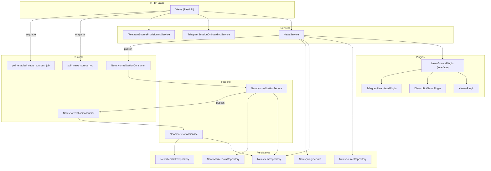
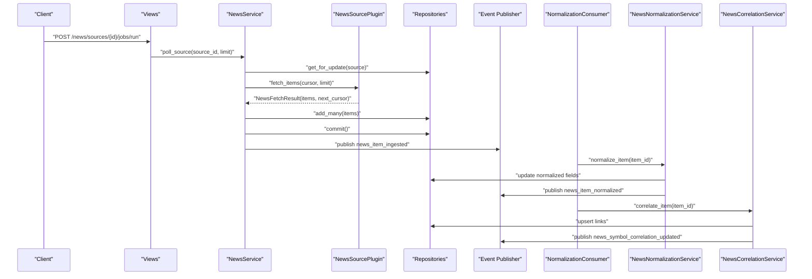
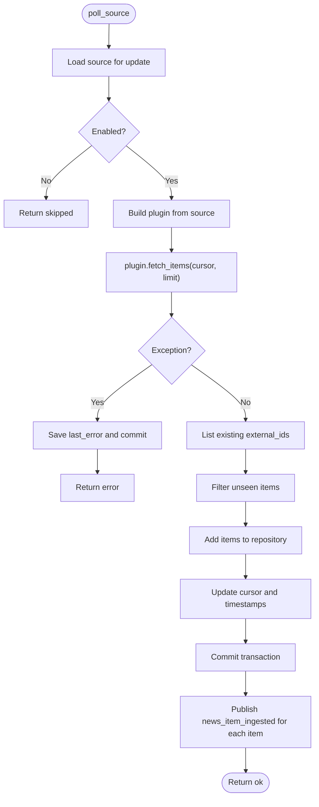
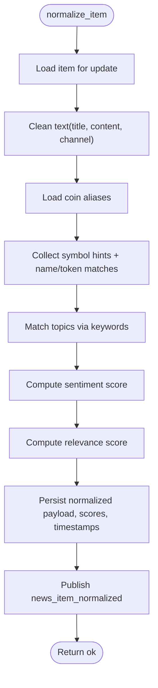
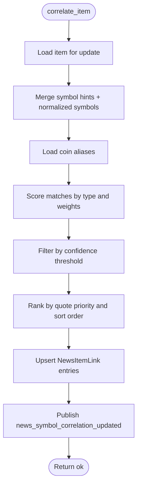
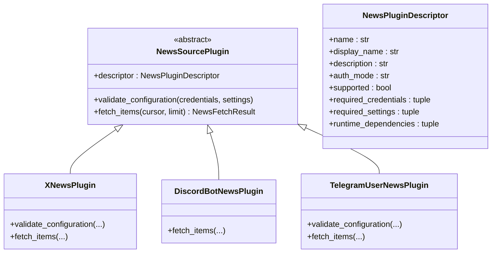
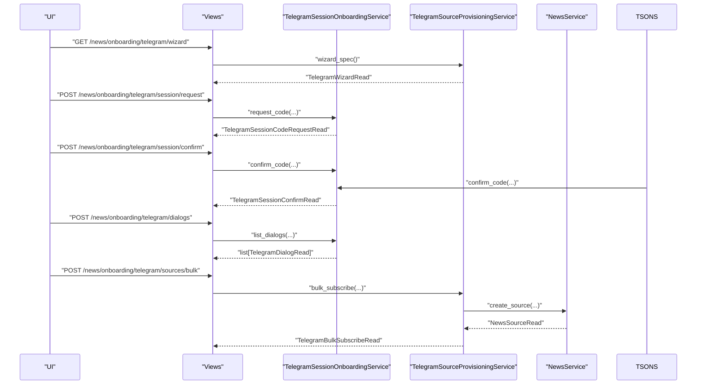
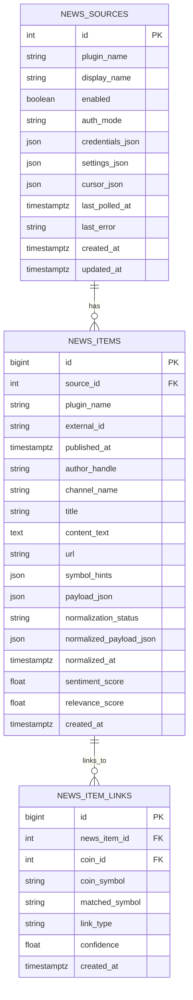
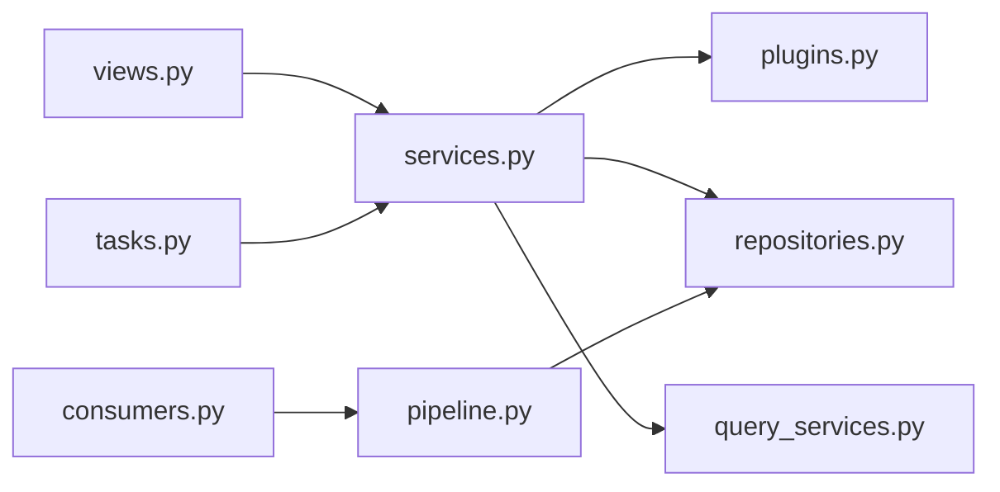

# News Services

<cite>
**Referenced Files in This Document**
- [services.py](file://src/apps/news/services.py)
- [pipeline.py](file://src/apps/news/pipeline.py)
- [plugins.py](file://src/apps/news/plugins.py)
- [models.py](file://src/apps/news/models.py)
- [schemas.py](file://src/apps/news/schemas.py)
- [constants.py](file://src/apps/news/constants.py)
- [repositories.py](file://src/apps/news/repositories.py)
- [query_services.py](file://src/apps/news/query_services.py)
- [consumers.py](file://src/apps/news/consumers.py)
- [tasks.py](file://src/apps/news/tasks.py)
- [read_models.py](file://src/apps/news/read_models.py)
- [exceptions.py](file://src/apps/news/exceptions.py)
- [views.py](file://src/apps/news/views.py)
</cite>

## Table of Contents
1. [Introduction](#introduction)
2. [Project Structure](#project-structure)
3. [Core Components](#core-components)
4. [Architecture Overview](#architecture-overview)
5. [Detailed Component Analysis](#detailed-component-analysis)
6. [Dependency Analysis](#dependency-analysis)
7. [Performance Considerations](#performance-considerations)
8. [Troubleshooting Guide](#troubleshooting-guide)
9. [Conclusion](#conclusion)
10. [Appendices](#appendices)

## Introduction
This document describes the news services layer responsible for ingesting, normalizing, correlating, and distributing news items. It covers service classes, interfaces, business logic, integration patterns, configuration, dependency injection, lifecycle management, monitoring, logging, debugging, and performance optimization. The layer integrates with external news sources (X/Twitter, Discord, Telegram) and publishes domain events to drive downstream normalization and correlation.

## Project Structure
The news services layer is organized around:
- Services: orchestrate ingestion, provisioning, and onboarding
- Plugins: pluggable adapters for external news APIs
- Pipeline: normalization and correlation services
- Repositories and Query Services: persistence and read models
- Consumers and Tasks: asynchronous processing and scheduling
- Views: HTTP endpoints for management and onboarding
- Models, Schemas, Constants, Exceptions: data contracts and shared constants

**Diagram sources**
- [views.py:1-176](file://src/apps/news/views.py#L1-L176)
- [services.py:57-241](file://src/apps/news/services.py#L57-L241)
- [plugins.py:59-366](file://src/apps/news/plugins.py#L59-L366)
- [pipeline.py:103-307](file://src/apps/news/pipeline.py#L103-L307)
- [repositories.py:12-170](file://src/apps/news/repositories.py#L12-L170)
- [query_services.py:20-76](file://src/apps/news/query_services.py#L20-L76)
- [consumers.py:9-38](file://src/apps/news/consumers.py#L9-L38)
- [tasks.py:12-34](file://src/apps/news/tasks.py#L12-L34)

**Section sources**
- [views.py:1-176](file://src/apps/news/views.py#L1-L176)
- [services.py:57-241](file://src/apps/news/services.py#L57-L241)
- [plugins.py:59-366](file://src/apps/news/plugins.py#L59-L366)
- [pipeline.py:103-307](file://src/apps/news/pipeline.py#L103-L307)
- [repositories.py:12-170](file://src/apps/news/repositories.py#L12-L170)
- [query_services.py:20-76](file://src/apps/news/query_services.py#L20-L76)
- [consumers.py:9-38](file://src/apps/news/consumers.py#L9-L38)
- [tasks.py:12-34](file://src/apps/news/tasks.py#L12-L34)

## Core Components
- NewsService: manages news sources, polls external feeds, persists items, and emits ingestion events.
- NewsNormalizationService: extracts topics, sentiment, symbols, and computes relevance scores.
- NewsCorrelationService: links normalized items to coins based on symbol/name matches and confidence.
- NewsSourcePlugin family: pluggable adapters for X, Discord, and Telegram with validation and fetching.
- TelegramSessionOnboardingService and TelegramSourceProvisioningService: onboarding flows and bulk provisioning for Telegram.
- Repositories and Query Services: typed repositories and read-model projections for persistence and queries.
- Consumers and Tasks: asynchronous consumers for normalization/correlation and scheduled polling jobs.
- Views: REST endpoints for managing sources, retrieving items, and onboarding.

**Section sources**
- [services.py:57-241](file://src/apps/news/services.py#L57-L241)
- [pipeline.py:103-307](file://src/apps/news/pipeline.py#L103-L307)
- [plugins.py:59-366](file://src/apps/news/plugins.py#L59-L366)
- [repositories.py:12-170](file://src/apps/news/repositories.py#L12-L170)
- [query_services.py:20-76](file://src/apps/news/query_services.py#L20-L76)
- [consumers.py:9-38](file://src/apps/news/consumers.py#L9-L38)
- [tasks.py:12-34](file://src/apps/news/tasks.py#L12-L34)
- [views.py:1-176](file://src/apps/news/views.py#L1-L176)

## Architecture Overview
The news services layer follows a streaming, event-driven architecture:
- HTTP endpoints delegate to services.
- Services persist and publish domain events.
- Asynchronous consumers react to events and run normalization and correlation.
- Scheduled tasks poll enabled sources with distributed locking.
- Plugins encapsulate provider-specific logic and validation.

**Diagram sources**
- [views.py:86-104](file://src/apps/news/views.py#L86-L104)
- [services.py:145-229](file://src/apps/news/services.py#L145-L229)
- [plugins.py:90-93](file://src/apps/news/plugins.py#L90-L93)
- [consumers.py:13-34](file://src/apps/news/consumers.py#L13-L34)
- [pipeline.py:109-187](file://src/apps/news/pipeline.py#L109-L187)
- [pipeline.py:209-306](file://src/apps/news/pipeline.py#L209-L306)

## Detailed Component Analysis

### NewsService
Responsibilities:
- Create/update/delete news sources with validation and deduplication.
- Poll a single source or all enabled sources.
- Persist new items, maintain cursors, and emit ingestion events.

Key behaviors:
- Validates plugin configuration before creation/update.
- Deduplicates by external_id per source.
- Emits ingestion events to trigger normalization.

**Diagram sources**
- [services.py:145-229](file://src/apps/news/services.py#L145-L229)

**Section sources**
- [services.py:64-144](file://src/apps/news/services.py#L64-L144)
- [services.py:145-229](file://src/apps/news/services.py#L145-L229)
- [repositories.py:82-118](file://src/apps/news/repositories.py#L82-L118)
- [query_services.py:44-52](file://src/apps/news/query_services.py#L44-L52)
- [constants.py:12-14](file://src/apps/news/constants.py#L12-L14)

### NewsNormalizationService
Responsibilities:
- Normalize raw news items into enriched payloads with topics, sentiment, symbols, and relevance.

Processing logic:
- Cleans text and builds symbol candidates from hints and coin aliases.
- Detects topics via keyword matching.
- Computes sentiment score and clamped relevance score.
- Publishes normalization event.

**Diagram sources**
- [pipeline.py:109-187](file://src/apps/news/pipeline.py#L109-L187)

**Section sources**
- [pipeline.py:103-201](file://src/apps/news/pipeline.py#L103-L201)
- [constants.py:25-55](file://src/apps/news/constants.py#L25-L55)

### NewsCorrelationService
Responsibilities:
- Link normalized items to coins based on symbol/name confidence thresholds.
- Publish correlation events with confidence and matched symbols.

Processing logic:
- Aggregates detected symbols from hints and normalization.
- Scores matches by symbol presence, name match, and relevance/sentiment weights.
- Produces ranked winners and upserts links.

**Diagram sources**
- [pipeline.py:209-306](file://src/apps/news/pipeline.py#L209-L306)

**Section sources**
- [pipeline.py:203-307](file://src/apps/news/pipeline.py#L203-L307)

### NewsSourcePlugin Interface and Implementations
Responsibilities:
- Define plugin contract, descriptors, and validation.
- Implement provider-specific fetching and cursor management.

Supported plugins:
- XNewsPlugin: fetches tweets from a user timeline.
- DiscordBotNewsPlugin: fetches channel messages using a bot token.
- TelegramUserNewsPlugin: fetches channel/chat messages using a user session.

**Diagram sources**
- [plugins.py:59-366](file://src/apps/news/plugins.py#L59-L366)

**Section sources**
- [plugins.py:27-93](file://src/apps/news/plugins.py#L27-L93)
- [plugins.py:117-328](file://src/apps/news/plugins.py#L117-L328)

### Telegram Onboarding and Provisioning
Responsibilities:
- Request/confirm Telegram login codes.
- List user dialogs and provision news sources from selections.
- Provide a wizard spec for UI-driven provisioning.

**Diagram sources**
- [views.py:106-176](file://src/apps/news/views.py#L106-L176)
- [services.py:243-528](file://src/apps/news/services.py#L243-L528)

**Section sources**
- [services.py:243-528](file://src/apps/news/services.py#L243-L528)
- [views.py:106-176](file://src/apps/news/views.py#L106-L176)

### Data Models and Read Models
Core entities:
- NewsSource: plugin metadata, credentials, settings, cursor, health.
- NewsItem: normalized fields, sentiment/relevance, links.
- NewsItemLink: coin associations with confidence and link type.

Read models:
- Projection of ORM entities for views and queries.

**Diagram sources**
- [models.py:15-104](file://src/apps/news/models.py#L15-L104)

**Section sources**
- [models.py:15-104](file://src/apps/news/models.py#L15-L104)
- [read_models.py:107-161](file://src/apps/news/read_models.py#L107-L161)

### Repositories and Query Services
- Typed repositories for CRUD and specialized queries.
- Query service for read models and plugin listings.

**Section sources**
- [repositories.py:12-170](file://src/apps/news/repositories.py#L12-L170)
- [query_services.py:20-76](file://src/apps/news/query_services.py#L20-L76)
- [read_models.py:107-161](file://src/apps/news/read_models.py#L107-L161)

### Consumers and Tasks
- Asynchronous consumers react to ingestion and normalization events to run normalization and correlation.
- Tasks schedule polling with Redis-based distributed locks to prevent overlap.

**Section sources**
- [consumers.py:9-38](file://src/apps/news/consumers.py#L9-L38)
- [tasks.py:12-34](file://src/apps/news/tasks.py#L12-L34)

### Views and Endpoints
- Management endpoints for sources and items.
- Onboarding endpoints for Telegram sessions and provisioning.

**Section sources**
- [views.py:31-176](file://src/apps/news/views.py#L31-L176)

## Dependency Analysis
- Services depend on repositories and query services for persistence and reads.
- Plugins encapsulate provider-specific logic and validation.
- Consumers depend on pipeline services and repositories.
- Tasks depend on services and distributed locks.
- Views depend on services and expose REST endpoints.

**Diagram sources**
- [views.py:1-176](file://src/apps/news/views.py#L1-L176)
- [services.py:57-241](file://src/apps/news/services.py#L57-L241)
- [plugins.py:59-366](file://src/apps/news/plugins.py#L59-L366)
- [pipeline.py:103-307](file://src/apps/news/pipeline.py#L103-L307)
- [repositories.py:12-170](file://src/apps/news/repositories.py#L12-L170)
- [consumers.py:9-38](file://src/apps/news/consumers.py#L9-L38)
- [tasks.py:12-34](file://src/apps/news/tasks.py#L12-L34)

**Section sources**
- [views.py:1-176](file://src/apps/news/views.py#L1-L176)
- [services.py:57-241](file://src/apps/news/services.py#L57-L241)
- [plugins.py:59-366](file://src/apps/news/plugins.py#L59-L366)
- [pipeline.py:103-307](file://src/apps/news/pipeline.py#L103-L307)
- [repositories.py:12-170](file://src/apps/news/repositories.py#L12-L170)
- [consumers.py:9-38](file://src/apps/news/consumers.py#L9-L38)
- [tasks.py:12-34](file://src/apps/news/tasks.py#L12-L34)

## Performance Considerations
- Poll limits: Respect provider-imposed limits and internal caps to avoid throttling.
- Batch writes: Bulk insert new items to reduce round-trips.
- Cursors: Use provider cursors to avoid duplicate processing and reduce network load.
- Locking: Distributed locks on polling tasks prevent overlapping runs.
- Indexes: Database indexes on published_at, plugin_name, and composite keys optimize reads.
- Event-driven normalization: Defer heavy normalization to consumers to keep ingestion fast.
- Caching: Reuse coin aliases and symbol normalization results where appropriate.

[No sources needed since this section provides general guidance]

## Troubleshooting Guide
Common issues and resolutions:
- Invalid news source configuration: Ensure required credentials/settings are present and validated by the plugin.
- Unsupported plugin: Some plugins are intentionally unsupported; verify plugin support.
- Telegram onboarding failures: Verify telethon installation and correct API credentials; handle 2FA if required.
- Polling errors: Inspect last_error on the source and review plugin logs; adjust limits or retry later.
- Normalization/correlation failures: Review normalized payload error fields and logs; re-run normalization if needed.

**Section sources**
- [exceptions.py:1-15](file://src/apps/news/exceptions.py#L1-L15)
- [plugins.py:68-89](file://src/apps/news/plugins.py#L68-L89)
- [services.py:158-170](file://src/apps/news/services.py#L158-L170)
- [pipeline.py:154-164](file://src/apps/news/pipeline.py#L154-L164)

## Conclusion
The news services layer provides a robust, extensible pipeline for ingesting, normalizing, correlating, and distributing news. Its modular design leverages plugins, event-driven consumers, and scheduled tasks to scale across multiple providers while maintaining strong data integrity and observability.

[No sources needed since this section summarizes without analyzing specific files]

## Appendices

### Service Configuration and Lifecycle
- Dependency Injection: Services receive an async unit of work; repositories operate within the same session.
- Lifecycle: Each HTTP request or task creates a UOW, ensuring atomic operations across repositories and event publishing.

**Section sources**
- [services.py:57-63](file://src/apps/news/services.py#L57-L63)
- [repositories.py:12-80](file://src/apps/news/repositories.py#L12-L80)
- [tasks.py:20-21](file://src/apps/news/tasks.py#L20-L21)

### Monitoring, Logging, and Debugging
- Logging: Repositories and query services log debug/info statements for auditability.
- Events: Domain events signal progress and enable decoupled downstream processing.
- Health: Sources track last_error and last_polled_at for monitoring.

**Section sources**
- [repositories.py:16-80](file://src/apps/news/repositories.py#L16-L80)
- [query_services.py:24-72](file://src/apps/news/query_services.py#L24-L72)
- [models.py:30-31](file://src/apps/news/models.py#L30-L31)