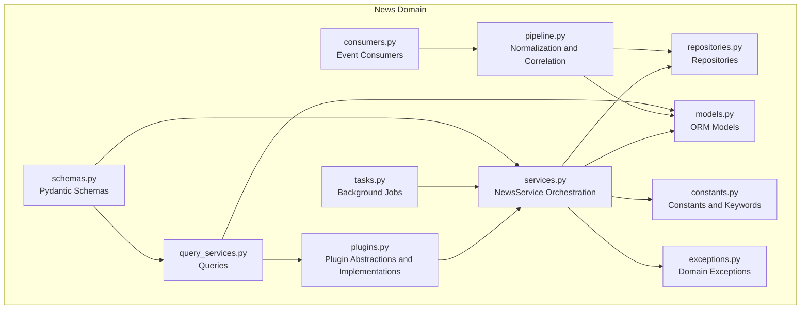
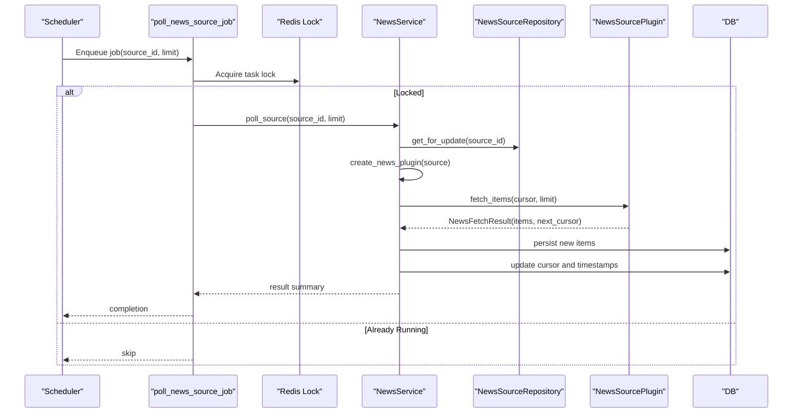
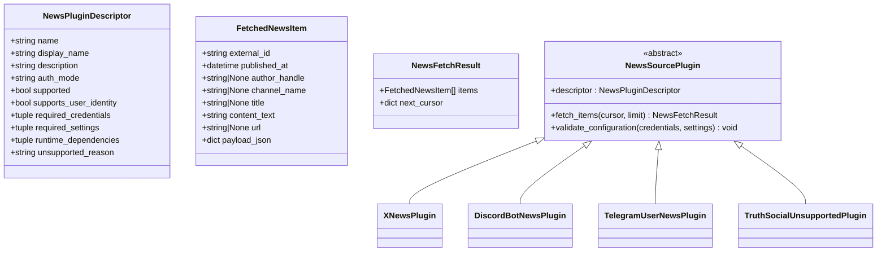
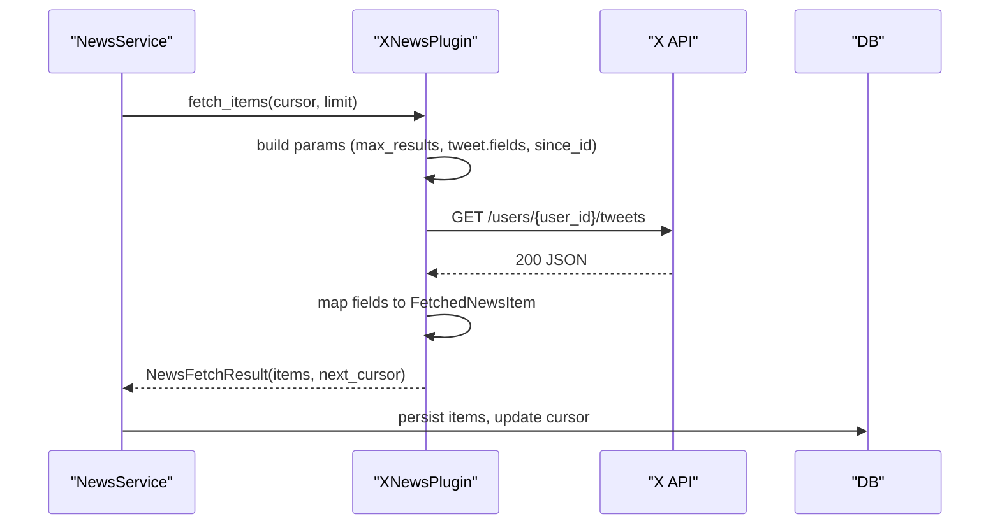
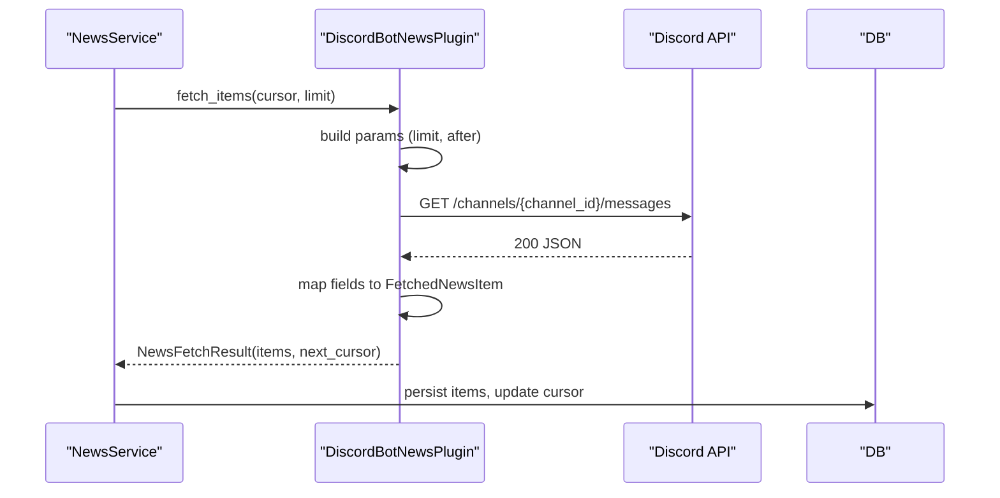
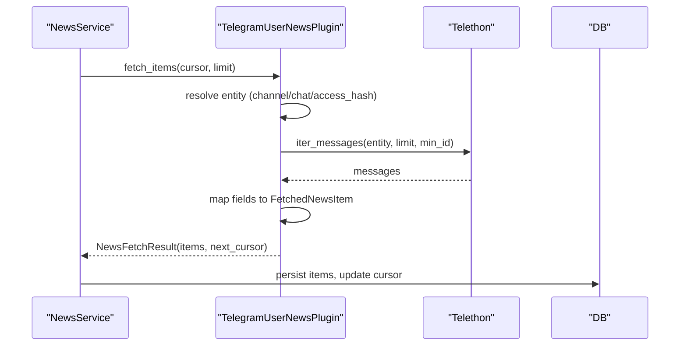
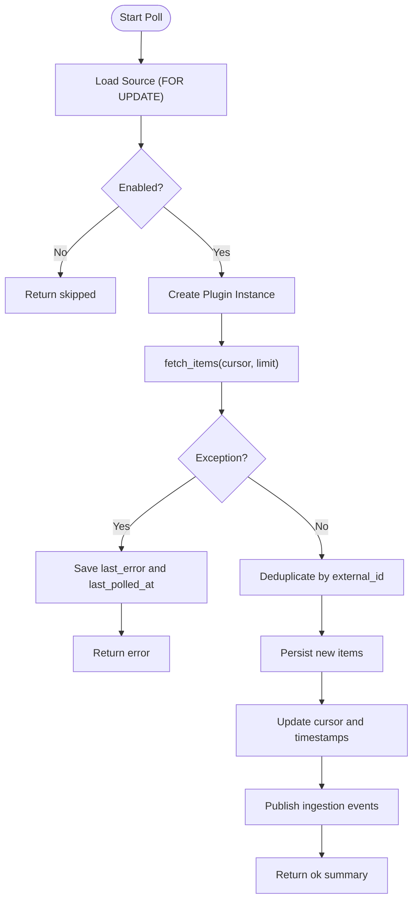
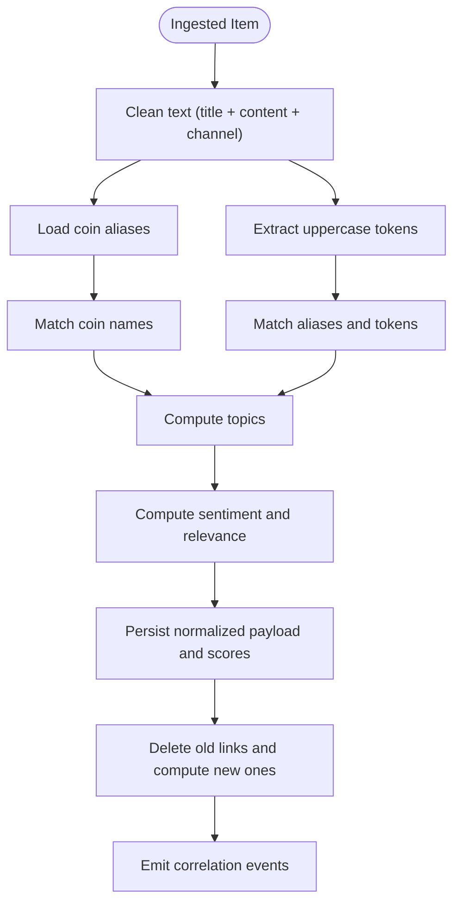
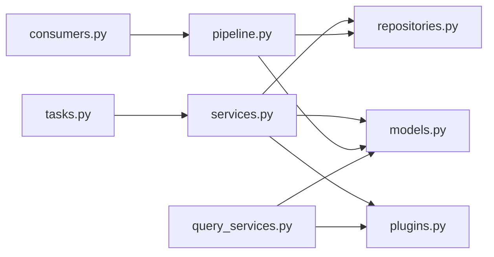

# News Source Plugins

<cite>
**Referenced Files in This Document**
- [plugins.py](file://src/apps/news/plugins.py)
- [models.py](file://src/apps/news/models.py)
- [constants.py](file://src/apps/news/constants.py)
- [exceptions.py](file://src/apps/news/exceptions.py)
- [pipeline.py](file://src/apps/news/pipeline.py)
- [services.py](file://src/apps/news/services.py)
- [repositories.py](file://src/apps/news/repositories.py)
- [query_services.py](file://src/apps/news/query_services.py)
- [schemas.py](file://src/apps/news/schemas.py)
- [tasks.py](file://src/apps/news/tasks.py)
- [consumers.py](file://src/apps/news/consumers.py)
</cite>

## Table of Contents
1. [Introduction](#introduction)
2. [Project Structure](#project-structure)
3. [Core Components](#core-components)
4. [Architecture Overview](#architecture-overview)
5. [Detailed Component Analysis](#detailed-component-analysis)
6. [Dependency Analysis](#dependency-analysis)
7. [Performance Considerations](#performance-considerations)
8. [Troubleshooting Guide](#troubleshooting-guide)
9. [Conclusion](#conclusion)
10. [Appendices](#appendices)

## Introduction
This document explains the news source plugin architecture used to integrate external news feeds into the system. It covers the plugin registration system, interface contracts, implementation patterns for different news sources, lifecycle and initialization, configuration management, parsing logic, authentication mechanisms, rate-limiting strategies, and operational concerns such as isolation, error handling, and graceful degradation. It also documents plugin discovery and dynamic loading, and provides practical guidance for building custom plugins.

## Project Structure
The news subsystem is organized around a plugin abstraction that encapsulates source-specific fetching logic, paired with a service layer that orchestrates polling, persistence, normalization, and correlation. Supporting components include models, repositories, queries, schemas, tasks, and consumers.

**Diagram sources**
- [plugins.py:117-349](file://src/apps/news/plugins.py#L117-L349)
- [services.py:57-241](file://src/apps/news/services.py#L57-L241)
- [pipeline.py:103-307](file://src/apps/news/pipeline.py#L103-L307)
- [consumers.py:9-35](file://src/apps/news/consumers.py#L9-L35)
- [tasks.py:12-34](file://src/apps/news/tasks.py#L12-L34)
- [repositories.py:12-161](file://src/apps/news/repositories.py#L12-L161)
- [query_services.py:20-73](file://src/apps/news/query_services.py#L20-L73)
- [models.py:15-101](file://src/apps/news/models.py#L15-L101)
- [schemas.py:9-205](file://src/apps/news/schemas.py#L9-L205)
- [constants.py:1-56](file://src/apps/news/constants.py#L1-L56)
- [exceptions.py:1-15](file://src/apps/news/exceptions.py#L1-L15)

**Section sources**
- [plugins.py:117-349](file://src/apps/news/plugins.py#L117-L349)
- [services.py:57-241](file://src/apps/news/services.py#L57-L241)
- [pipeline.py:103-307](file://src/apps/news/pipeline.py#L103-L307)
- [consumers.py:9-35](file://src/apps/news/consumers.py#L9-L35)
- [tasks.py:12-34](file://src/apps/news/tasks.py#L12-L34)
- [repositories.py:12-161](file://src/apps/news/repositories.py#L12-L161)
- [query_services.py:20-73](file://src/apps/news/query_services.py#L20-L73)
- [models.py:15-101](file://src/apps/news/models.py#L15-L101)
- [schemas.py:9-205](file://src/apps/news/schemas.py#L9-L205)
- [constants.py:1-56](file://src/apps/news/constants.py#L1-L56)
- [exceptions.py:1-15](file://src/apps/news/exceptions.py#L1-L15)

## Core Components
- Plugin Abstraction and Registry
  - A base plugin class defines the contract for fetching items and exposes a descriptor with metadata and validation hooks.
  - A global registry enables dynamic lookup and creation of plugins by name.
- Implemented Plugins
  - X (Twitter) plugin: fetches tweets from a user timeline using bearer or user tokens.
  - Discord Bot plugin: polls channel messages using a bot token.
  - Telegram User plugin: polls messages using a user session via Telethon.
  - Truth Social placeholder: intentionally unsupported per policy.
- Service Layer
  - NewsService manages source lifecycle: creation, updates, polling, and ingestion.
  - Provides onboarding helpers for Telegram sessions and bulk provisioning.
- Persistence and Queries
  - Repositories encapsulate CRUD and specialized queries for sources, items, and links.
  - Query services expose read models and plugin listings.
- Pipeline
  - NormalizationService extracts topics, sentiment, relevance, and symbol hints.
  - CorrelationService links normalized items to coins based on aliases and confidence.
- Event-driven Consumers
  - Normalize newly ingested items; then correlate them to coins.
- Tasks and Scheduling
  - Background jobs coordinate polling with Redis task locks to prevent overlap.
- Models and Schemas
  - Strongly typed models for sources, items, and links.
  - Pydantic schemas for API payloads and read models.

**Section sources**
- [plugins.py:59-115](file://src/apps/news/plugins.py#L59-L115)
- [plugins.py:117-349](file://src/apps/news/plugins.py#L117-L349)
- [services.py:57-241](file://src/apps/news/services.py#L57-L241)
- [repositories.py:12-161](file://src/apps/news/repositories.py#L12-L161)
- [query_services.py:20-73](file://src/apps/news/query_services.py#L20-L73)
- [pipeline.py:103-307](file://src/apps/news/pipeline.py#L103-L307)
- [consumers.py:9-35](file://src/apps/news/consumers.py#L9-L35)
- [tasks.py:12-34](file://src/apps/news/tasks.py#L12-L34)
- [models.py:15-101](file://src/apps/news/models.py#L15-L101)
- [schemas.py:9-205](file://src/apps/news/schemas.py#L9-L205)

## Architecture Overview
The plugin architecture separates concerns across layers:
- Discovery and Registration: Plugins register themselves under stable names.
- Orchestration: Services create plugin instances per source and drive polling.
- Fetching: Each plugin implements source-specific HTTP or library calls.
- Persistence: New items are deduplicated and persisted; cursors track progress.
- Processing: Asynchronous consumers normalize and correlate items.

**Diagram sources**
- [tasks.py:12-22](file://src/apps/news/tasks.py#L12-L22)
- [services.py:145-228](file://src/apps/news/services.py#L145-L228)
- [repositories.py:22-28](file://src/apps/news/repositories.py#L22-L28)
- [plugins.py:110-114](file://src/apps/news/plugins.py#L110-L114)

**Section sources**
- [tasks.py:12-34](file://src/apps/news/tasks.py#L12-L34)
- [services.py:145-228](file://src/apps/news/services.py#L145-L228)
- [repositories.py:22-28](file://src/apps/news/repositories.py#L22-L28)
- [plugins.py:110-114](file://src/apps/news/plugins.py#L110-L114)

## Detailed Component Analysis

### Plugin Abstraction and Registry
- Contract
  - Base class initializes from a NewsSource, exposing credentials and settings.
  - Descriptor carries metadata and required fields for validation.
  - Validation ensures required credentials/settings are present and plugin is supported.
  - Abstract fetch_items returns a standardized result with items and a next_cursor.
- Registry
  - Global registry stores plugin classes keyed by normalized name.
  - Helpers list, get, and create plugins dynamically.
- Discovery
  - Query services list registered plugins and their descriptors for UI/API consumption.

**Diagram sources**
- [plugins.py:27-57](file://src/apps/news/plugins.py#L27-L57)
- [plugins.py:59-93](file://src/apps/news/plugins.py#L59-L93)
- [plugins.py:117-349](file://src/apps/news/plugins.py#L117-L349)

**Section sources**
- [plugins.py:27-93](file://src/apps/news/plugins.py#L27-L93)
- [plugins.py:95-115](file://src/apps/news/plugins.py#L95-L115)
- [query_services.py:24-31](file://src/apps/news/query_services.py#L24-L31)

### Implemented Plugins

#### X (Twitter) Plugin
- Authentication: bearer_token or access_token.
- Fetching: GET user tweets with pagination via since_id; maps fields to normalized item.
- Limits: respects min/max poll limits; sets tweet.fields for efficient payloads.

**Diagram sources**
- [plugins.py:117-179](file://src/apps/news/plugins.py#L117-L179)
- [services.py:145-228](file://src/apps/news/services.py#L145-L228)

**Section sources**
- [plugins.py:117-179](file://src/apps/news/plugins.py#L117-L179)

#### Discord Bot Plugin
- Authentication: Bot token header.
- Fetching: GET channel messages with pagination via after; maps fields to normalized item.

**Diagram sources**
- [plugins.py:182-224](file://src/apps/news/plugins.py#L182-L224)
- [services.py:145-228](file://src/apps/news/services.py#L145-L228)

**Section sources**
- [plugins.py:182-224](file://src/apps/news/plugins.py#L182-L224)

#### Telegram User Plugin
- Authentication: Telethon user session string; loads optional dependency lazily.
- Fetching: Iterates messages via Telethon client; resolves entity by channel/chat or access hash.
- Validation: Requires either channel username or entity_id+entity_type; enforces constraints.

**Diagram sources**
- [plugins.py:227-327](file://src/apps/news/plugins.py#L227-L327)
- [services.py:145-228](file://src/apps/news/services.py#L145-L228)

**Section sources**
- [plugins.py:227-327](file://src/apps/news/plugins.py#L227-L327)

#### Truth Social Placeholder
- Intentionally unsupported; raises an error with a clear reason.

**Section sources**
- [plugins.py:330-344](file://src/apps/news/plugins.py#L330-L344)

### Service Orchestration and Lifecycle
- Creation and Updates
  - Validates configuration against the plugin’s descriptor before persisting.
  - Enforces uniqueness of display_name per plugin.
- Polling
  - Creates plugin instance per source, fetches items, deduplicates by external_id, persists new items, updates cursor and timestamps.
  - On errors, records last_error and last_polled_at.
- Bulk Polling
  - Iterates enabled sources and invokes polling with locking.

**Diagram sources**
- [services.py:145-228](file://src/apps/news/services.py#L145-L228)
- [repositories.py:22-28](file://src/apps/news/repositories.py#L22-L28)

**Section sources**
- [services.py:64-144](file://src/apps/news/services.py#L64-L144)
- [services.py:145-241](file://src/apps/news/services.py#L145-L241)
- [repositories.py:22-28](file://src/apps/news/repositories.py#L22-L28)

### Configuration Management
- Credentials vs Settings
  - Credentials are secret keys (e.g., tokens, API IDs, session strings).
  - Settings are source-specific parameters (e.g., user/channel identifiers, limits).
- Validation
  - Base validation checks presence of required fields and plugin support.
  - Plugin-specific validations enforce additional constraints (e.g., X requires bearer or access token; Telegram requires channel or entity info).
- Updates
  - Supports partial updates with merge semantics; validates merged configuration.

**Section sources**
- [plugins.py:68-89](file://src/apps/news/plugins.py#L68-L89)
- [plugins.py:128-139](file://src/apps/news/plugins.py#L128-L139)
- [plugins.py:250-269](file://src/apps/news/plugins.py#L250-L269)
- [services.py:95-135](file://src/apps/news/services.py#L95-L135)

### Parsing Logic and Data Normalization
- Symbol Hints
  - Extracts cashtags from content for downstream correlation.
- Normalization
  - Topics, sentiment, and relevance computed from cleaned text.
  - Canonical symbol normalization and alias expansion improve matching.
- Correlation
  - Links items to coins using detected symbols, names, and confidence thresholds.
  - Emits correlation events for downstream systems.

**Diagram sources**
- [pipeline.py:109-186](file://src/apps/news/pipeline.py#L109-L186)
- [pipeline.py:209-306](file://src/apps/news/pipeline.py#L209-L306)

**Section sources**
- [pipeline.py:58-83](file://src/apps/news/pipeline.py#L58-L83)
- [pipeline.py:109-186](file://src/apps/news/pipeline.py#L109-L186)
- [pipeline.py:209-306](file://src/apps/news/pipeline.py#L209-L306)

### Authentication Mechanisms
- X: Bearer token or user access token.
- Discord: Bot token.
- Telegram: Telethon session string; optional 2FA handled during onboarding.
- Validation ensures at least one acceptable credential is present for X; Telegram requires either channel or entity configuration.

**Section sources**
- [plugins.py:128-139](file://src/apps/news/plugins.py#L128-L139)
- [plugins.py:194-202](file://src/apps/news/plugins.py#L194-L202)
- [plugins.py:250-269](file://src/apps/news/plugins.py#L250-L269)

### Rate Limiting Strategies
- Per-source polling is coordinated via Redis task locks to avoid concurrent runs.
- Built-in limits cap poll sizes to protect upstream APIs and internal resources.
- Plugins may apply source-specific pagination parameters (since_id, after) to minimize redundant fetches.

**Section sources**
- [tasks.py:12-34](file://src/apps/news/tasks.py#L12-L34)
- [constants.py:20-23](file://src/apps/news/constants.py#L20-L23)
- [plugins.py:146-153](file://src/apps/news/plugins.py#L146-L153)
- [plugins.py:197-199](file://src/apps/news/plugins.py#L197-L199)
- [plugins.py:293-296](file://src/apps/news/plugins.py#L293-L296)

### Plugin Discovery and Dynamic Loading
- Discovery
  - Query services list all registered plugins and their descriptors.
- Dynamic Loading
  - Services create plugin instances from NewsSource.plugin_name.
- Optional Dependencies
  - Telegram plugin imports Telethon lazily and raises a clear error if missing.

**Section sources**
- [query_services.py:24-31](file://src/apps/news/query_services.py#L24-L31)
- [services.py:157-158](file://src/apps/news/services.py#L157-L158)
- [plugins.py:240-248](file://src/apps/news/plugins.py#L240-L248)

### Health Monitoring and Error Handling
- Health Fields
  - Sources track last_polled_at and last_error for visibility.
- Error Handling
  - Polling catches exceptions, records last_error, and returns structured results.
  - Normalization/correlation failures are captured and surfaced in normalized payloads.
- Graceful Degradation
  - Unsupported plugins fail fast with explicit reasons.
  - Telegram onboarding handles missing dependencies and 2FA scenarios.

**Section sources**
- [models.py:30-32](file://src/apps/news/models.py#L30-L32)
- [services.py:160-170](file://src/apps/news/services.py#L160-L170)
- [pipeline.py:154-164](file://src/apps/news/pipeline.py#L154-L164)
- [exceptions.py:1-15](file://src/apps/news/exceptions.py#L1-L15)

### Implementing a Custom News Source Plugin
Steps to add a new plugin:
1. Define a subclass of NewsSourcePlugin with a descriptor and fetch_items implementation.
2. Implement validate_configuration to enforce required credentials/settings.
3. Register the plugin with a stable name using the registry helper.
4. Ensure proper error handling and cursor management.
5. Test with the service layer and background tasks.

Reference paths:
- Base class and registry: [plugins.py:59-115](file://src/apps/news/plugins.py#L59-L115)
- Example implementations: [plugins.py:117-349](file://src/apps/news/plugins.py#L117-L349)
- Service integration: [services.py:145-228](file://src/apps/news/services.py#L145-L228)
- Task scheduling: [tasks.py:12-34](file://src/apps/news/tasks.py#L12-L34)

**Section sources**
- [plugins.py:59-115](file://src/apps/news/plugins.py#L59-L115)
- [plugins.py:117-349](file://src/apps/news/plugins.py#L117-L349)
- [services.py:145-228](file://src/apps/news/services.py#L145-L228)
- [tasks.py:12-34](file://src/apps/news/tasks.py#L12-L34)

## Dependency Analysis
- Internal Dependencies
  - Services depend on repositories and plugins; pipeline depends on repositories and market data.
  - Consumers depend on pipeline services and operate asynchronously on events.
  - Tasks wrap services with distributed locks.
- External Dependencies
  - HTTP clients for X and Discord.
  - Optional Telethon for Telegram.
- Coupling and Cohesion
  - Plugins encapsulate source-specific logic; services orchestrate without knowing plugin internals.
  - Clear separation between persistence, normalization, and correlation.

**Diagram sources**
- [services.py:57-241](file://src/apps/news/services.py#L57-L241)
- [plugins.py:95-115](file://src/apps/news/plugins.py#L95-L115)
- [repositories.py:12-161](file://src/apps/news/repositories.py#L12-L161)
- [models.py:15-101](file://src/apps/news/models.py#L15-L101)
- [pipeline.py:103-307](file://src/apps/news/pipeline.py#L103-L307)
- [consumers.py:9-35](file://src/apps/news/consumers.py#L9-L35)
- [tasks.py:12-34](file://src/apps/news/tasks.py#L12-L34)
- [query_services.py:20-73](file://src/apps/news/query_services.py#L20-L73)

**Section sources**
- [services.py:57-241](file://src/apps/news/services.py#L57-L241)
- [plugins.py:95-115](file://src/apps/news/plugins.py#L95-L115)
- [repositories.py:12-161](file://src/apps/news/repositories.py#L12-L161)
- [models.py:15-101](file://src/apps/news/models.py#L15-L101)
- [pipeline.py:103-307](file://src/apps/news/pipeline.py#L103-L307)
- [consumers.py:9-35](file://src/apps/news/consumers.py#L9-L35)
- [tasks.py:12-34](file://src/apps/news/tasks.py#L12-L34)
- [query_services.py:20-73](file://src/apps/news/query_services.py#L20-L73)

## Performance Considerations
- Concurrency Control
  - Use Redis task locks to serialize polling per source and globally for enabled sources.
- Request Limits
  - Respect built-in min/max poll limits and source-specific pagination parameters.
- Deduplication
  - Deduplicate by external_id to avoid repeated processing.
- Asynchronous Processing
  - Offload normalization and correlation to consumers to keep ingestion fast.
- Optional Dependencies
  - Lazy import of Telethon avoids overhead when not used.

[No sources needed since this section provides general guidance]

## Troubleshooting Guide
Common issues and resolutions:
- Unsupported Plugin
  - Symptom: UnsupportedNewsPluginError.
  - Resolution: Use a supported plugin name; Truth Social is intentionally unsupported.
- Invalid Configuration
  - Symptom: Missing required credentials or settings.
  - Resolution: Provide required fields per plugin; consult plugin descriptor.
- Telegram Onboarding Failures
  - Symptom: Missing Telethon dependency or 2FA required.
  - Resolution: Install optional dependency; supply password when prompted.
- Polling Failures
  - Symptom: last_error populated on source.
  - Resolution: Inspect error message, fix credentials/settings, retry.
- Cursor Progression
  - Symptom: No new items fetched.
  - Resolution: Verify next_cursor is being updated and upstream pagination parameters are applied.

**Section sources**
- [exceptions.py:5-15](file://src/apps/news/exceptions.py#L5-L15)
- [plugins.py:240-248](file://src/apps/news/plugins.py#L240-L248)
- [services.py:160-170](file://src/apps/news/services.py#L160-L170)
- [models.py:30-32](file://src/apps/news/models.py#L30-L32)

## Conclusion
The news source plugin architecture cleanly separates source-specific logic from orchestration, persistence, and processing. It supports dynamic discovery, robust configuration validation, and resilient error handling. By leveraging background tasks, consumers, and strict limits, the system maintains reliability while enabling extensibility for new sources.

[No sources needed since this section summarizes without analyzing specific files]

## Appendices

### API Surface for Plugins and Services
- Plugin Descriptor Fields
  - name, display_name, description, auth_mode, supported, supports_user_identity, required_credentials, required_settings, runtime_dependencies, unsupported_reason.
- Fetch Result
  - items: list of normalized items; next_cursor: pagination state.
- Service Methods
  - create_source, update_source, delete_source, poll_source, poll_enabled_sources.

**Section sources**
- [schemas.py:9-22](file://src/apps/news/schemas.py#L9-L22)
- [schemas.py:24-57](file://src/apps/news/schemas.py#L24-L57)
- [services.py:64-144](file://src/apps/news/services.py#L64-L144)
- [services.py:145-241](file://src/apps/news/services.py#L145-L241)