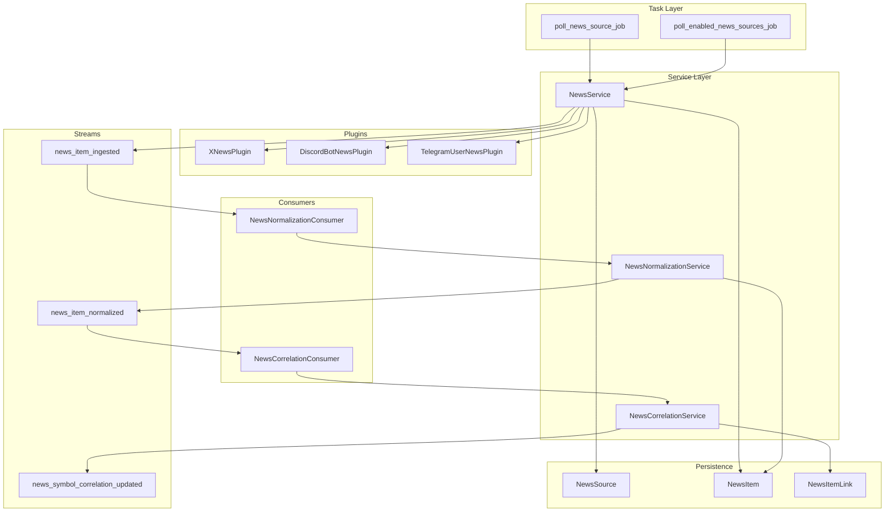
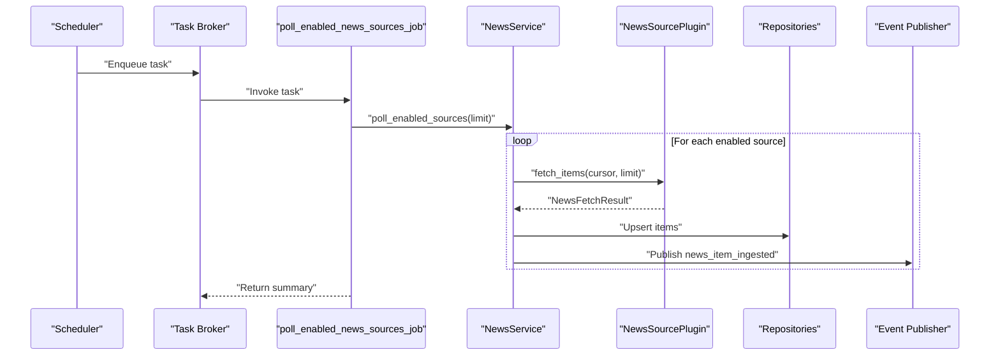
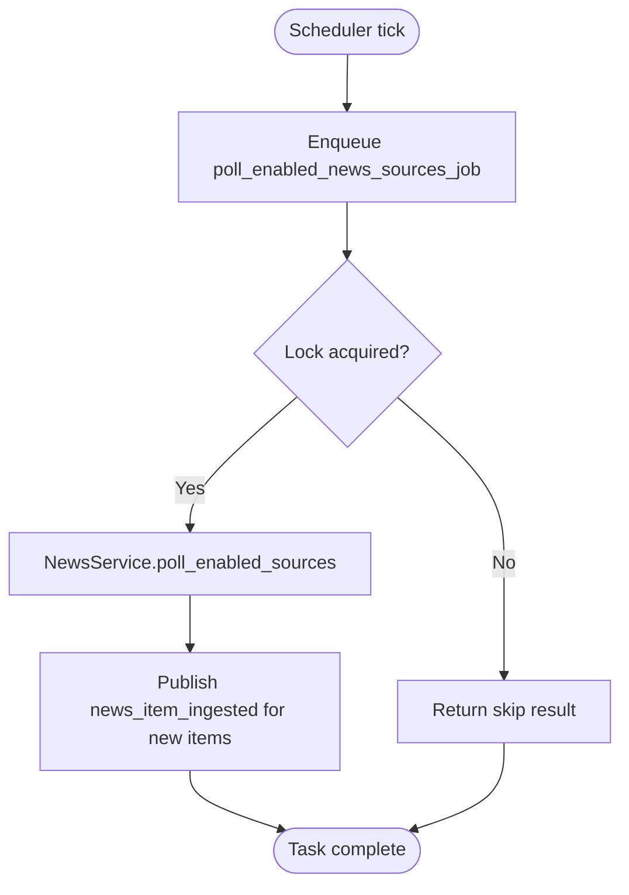
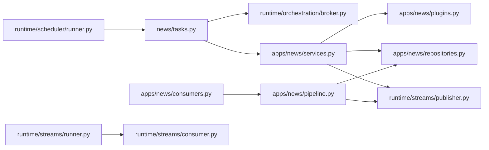

# News Tasks and Consumers

<cite>
**Referenced Files in This Document**
- [tasks.py](file://src/apps/news/tasks.py)
- [consumers.py](file://src/apps/news/consumers.py)
- [pipeline.py](file://src/apps/news/pipeline.py)
- [plugins.py](file://src/apps/news/plugins.py)
- [services.py](file://src/apps/news/services.py)
- [models.py](file://src/apps/news/models.py)
- [repositories.py](file://src/apps/news/repositories.py)
- [constants.py](file://src/apps/news/constants.py)
- [query_services.py](file://src/apps/news/query_services.py)
- [read_models.py](file://src/apps/news/read_models.py)
- [consumer.py](file://src/runtime/streams/consumer.py)
- [broker.py](file://src/runtime/orchestration/broker.py)
- [runner.py](file://src/runtime/scheduler/runner.py)
- [streams_runner.py](file://src/runtime/streams/runner.py)
</cite>

## Table of Contents
1. [Introduction](#introduction)
2. [Project Structure](#project-structure)
3. [Core Components](#core-components)
4. [Architecture Overview](#architecture-overview)
5. [Detailed Component Analysis](#detailed-component-analysis)
6. [Dependency Analysis](#dependency-analysis)
7. [Performance Considerations](#performance-considerations)
8. [Troubleshooting Guide](#troubleshooting-guide)
9. [Conclusion](#conclusion)
10. [Appendices](#appendices)

## Introduction
This document explains the news-related background tasks and event consumers that power real-time ingestion, normalization, and correlation of news items. It covers:
- Task scheduling and execution via Redis-backed brokers and schedulers
- Asynchronous processing workflows using event streams and consumers
- Consumer implementations for normalization and correlation
- Task prioritization, retry, and failure handling strategies
- Examples of task submission, monitoring, and debugging
- Performance considerations, resource management, and scaling patterns for high-volume news processing

## Project Structure
The news subsystem is organized around:
- Task definitions for polling news sources
- Services orchestrating ingestion and enrichment
- Plugins abstracting external source APIs
- Pipeline services for normalization and correlation
- Event consumers reacting to normalized and correlated events
- Persistence models and repositories
- Stream-based event publishing and consumption

**Diagram sources**
- [tasks.py:12-34](file://src/apps/news/tasks.py#L12-L34)
- [services.py:145-240](file://src/apps/news/services.py#L145-L240)
- [plugins.py:117-344](file://src/apps/news/plugins.py#L117-L344)
- [models.py:15-101](file://src/apps/news/models.py#L15-L101)
- [pipeline.py:103-306](file://src/apps/news/pipeline.py#L103-L306)
- [consumers.py:9-35](file://src/apps/news/consumers.py#L9-L35)
- [constants.py:12-14](file://src/apps/news/constants.py#L12-L14)

**Section sources**
- [tasks.py:12-34](file://src/apps/news/tasks.py#L12-L34)
- [services.py:145-240](file://src/apps/news/services.py#L145-L240)
- [plugins.py:117-344](file://src/apps/news/plugins.py#L117-L344)
- [pipeline.py:103-306](file://src/apps/news/pipeline.py#L103-L306)
- [consumers.py:9-35](file://src/apps/news/consumers.py#L9-L35)
- [models.py:15-101](file://src/apps/news/models.py#L15-L101)
- [constants.py:12-14](file://src/apps/news/constants.py#L12-L14)

## Core Components
- Background tasks:
  - Poll a single news source
  - Poll all enabled news sources
- Services:
  - NewsService: validates, polls, persists, and publishes ingestion events
  - NewsNormalizationService: enriches items with sentiment, topics, relevance, and emits normalized events
  - NewsCorrelationService: links items to coins and emits correlation events
- Plugins:
  - X (Twitter), Discord Bot, Telegram User, Truth Social (unsupported)
- Event consumers:
  - NewsNormalizationConsumer: triggers normalization on ingestion
  - NewsCorrelationConsumer: triggers correlation on normalization
- Persistence:
  - NewsSource, NewsItem, NewsItemLink models and repositories
- Streams:
  - Event constants and publisher integration

**Section sources**
- [tasks.py:12-34](file://src/apps/news/tasks.py#L12-L34)
- [services.py:145-240](file://src/apps/news/services.py#L145-L240)
- [pipeline.py:103-306](file://src/apps/news/pipeline.py#L103-L306)
- [plugins.py:117-344](file://src/apps/news/plugins.py#L117-L344)
- [consumers.py:9-35](file://src/apps/news/consumers.py#L9-L35)
- [models.py:15-101](file://src/apps/news/models.py#L15-L101)
- [constants.py:12-14](file://src/apps/news/constants.py#L12-L14)

## Architecture Overview
The system combines scheduled tasks and event-driven consumers:
- Scheduler enqueues periodic tasks to poll news sources
- Tasks acquire Redis-based locks to prevent concurrent runs
- On ingestion, items emit a stream event for normalization
- Normalization consumer updates items and emits a correlation event
- Correlation consumer links items to coins and emits correlation events

**Diagram sources**
- [runner.py:195-211](file://src/runtime/scheduler/runner.py#L195-L211)
- [broker.py:12-22](file://src/runtime/orchestration/broker.py#L12-L22)
- [tasks.py:24-34](file://src/apps/news/tasks.py#L24-L34)
- [services.py:230-240](file://src/apps/news/services.py#L230-L240)
- [plugins.py:117-344](file://src/apps/news/plugins.py#L117-L344)
- [repositories.py:82-118](file://src/apps/news/repositories.py#L82-L118)
- [constants.py:12-14](file://src/apps/news/constants.py#L12-L14)

## Detailed Component Analysis

### Task Scheduling and Execution
- Periodic polling is scheduled by the application scheduler, which enqueues a task to poll all enabled sources at a configurable interval.
- The task uses Redis-based locks keyed per source or globally to avoid overlapping executions.
- The task returns structured results indicating status, counts, and errors.

**Diagram sources**
- [runner.py:195-211](file://src/runtime/scheduler/runner.py#L195-L211)
- [tasks.py:24-34](file://src/apps/news/tasks.py#L24-L34)
- [services.py:230-240](file://src/apps/news/services.py#L230-L240)
- [constants.py:12-14](file://src/apps/news/constants.py#L12-L14)

**Section sources**
- [runner.py:195-211](file://src/runtime/scheduler/runner.py#L195-L211)
- [tasks.py:24-34](file://src/apps/news/tasks.py#L24-L34)
- [services.py:230-240](file://src/apps/news/services.py#L230-L240)

### NewsService: Ingestion and Publishing
- Validates source configuration and plugin support
- Fetches items via the appropriate plugin
- Deduplicates by external_id
- Persists items and publishes ingestion events with metadata for downstream consumers

Key behaviors:
- Cursor management for pagination
- Error capture and last_error tracking
- Publishing of ingestion events for normalization

**Section sources**
- [services.py:145-240](file://src/apps/news/services.py#L145-L240)
- [plugins.py:117-344](file://src/apps/news/plugins.py#L117-L344)
- [repositories.py:82-118](file://src/apps/news/repositories.py#L82-L118)
- [constants.py:12-14](file://src/apps/news/constants.py#L12-L14)

### NewsNormalizationService: Real-time Enrichment
- Loads coin aliases for symbol matching
- Extracts detected symbols, topics, and sentiment
- Computes relevance and stores normalized payload
- Emits normalized events for correlation

Error handling:
- On exception, marks item as error and records minimal error info

**Section sources**
- [pipeline.py:103-186](file://src/apps/news/pipeline.py#L103-L186)
- [repositories.py:138-161](file://src/apps/news/repositories.py#L138-L161)

### NewsCorrelationService: Linking Items to Coins
- Re-computes matched symbols and topics
- Ranks candidates by quote priority and sort order
- Builds confidence-weighted links and publishes correlation events

**Section sources**
- [pipeline.py:203-306](file://src/apps/news/pipeline.py#L203-L306)

### Event Consumers: Reactive Processing
- NewsNormalizationConsumer: reacts to ingestion events, normalizes items
- NewsCorrelationConsumer: reacts to normalization events, correlates items to coins

Idempotency and routing:
- Consumers filter by event type and rely on Redis idempotence keys to avoid reprocessing

**Section sources**
- [consumers.py:9-35](file://src/apps/news/consumers.py#L9-L35)
- [consumer.py:49-226](file://src/runtime/streams/consumer.py#L49-L226)

### Plugin Abstractions and Supported Sources
- NewsSourcePlugin defines the interface for fetching items
- XNewsPlugin, DiscordBotNewsPlugin, TelegramUserNewsPlugin implement concrete integrations
- Validation ensures required credentials/settings are present
- TruthSocial is intentionally unsupported per integration policy

**Section sources**
- [plugins.py:59-115](file://src/apps/news/plugins.py#L59-L115)
- [plugins.py:117-344](file://src/apps/news/plugins.py#L117-L344)

### Data Models and Repositories
- NewsSource: source metadata, credentials, settings, cursor, and status
- NewsItem: normalized state, sentiment, relevance, and links
- NewsItemLink: per-item coin matches with confidence
- Repositories encapsulate CRUD and specialized queries

**Section sources**
- [models.py:15-101](file://src/apps/news/models.py#L15-L101)
- [repositories.py:12-161](file://src/apps/news/repositories.py#L12-L161)

### Stream Infrastructure and Workers
- EventConsumer manages Redis XREADGROUP/XACK, idempotency, and metrics
- Worker processes are spawned per event consumer group
- Topology dispatcher coordinates worker lifecycle

**Section sources**
- [consumer.py:49-226](file://src/runtime/streams/consumer.py#L49-L226)
- [streams_runner.py:50-84](file://src/runtime/streams/runner.py#L50-L84)

## Dependency Analysis

**Diagram sources**
- [tasks.py:12-34](file://src/apps/news/tasks.py#L12-L34)
- [broker.py:12-22](file://src/runtime/orchestration/broker.py#L12-L22)
- [services.py:145-240](file://src/apps/news/services.py#L145-L240)
- [plugins.py:117-344](file://src/apps/news/plugins.py#L117-L344)
- [repositories.py:82-161](file://src/apps/news/repositories.py#L82-L161)
- [consumers.py:9-35](file://src/apps/news/consumers.py#L9-L35)
- [pipeline.py:103-306](file://src/apps/news/pipeline.py#L103-L306)
- [runner.py:195-211](file://src/runtime/scheduler/runner.py#L195-L211)
- [streams_runner.py:50-84](file://src/runtime/streams/runner.py#L50-L84)
- [consumer.py:49-226](file://src/runtime/streams/consumer.py#L49-L226)

**Section sources**
- [tasks.py:12-34](file://src/apps/news/tasks.py#L12-L34)
- [services.py:145-240](file://src/apps/news/services.py#L145-L240)
- [pipeline.py:103-306](file://src/apps/news/pipeline.py#L103-L306)
- [consumers.py:9-35](file://src/apps/news/consumers.py#L9-L35)
- [runner.py:195-211](file://src/runtime/scheduler/runner.py#L195-L211)
- [streams_runner.py:50-84](file://src/runtime/streams/runner.py#L50-L84)
- [consumer.py:49-226](file://src/runtime/streams/consumer.py#L49-L226)

## Performance Considerations
- Concurrency control:
  - Redis-based task locks prevent overlapping runs for the same source or global polling
- Batch sizing and backoff:
  - Event consumers use batch sizes and blocking reads to reduce CPU spin
- Idempotency:
  - Redis keys track processed events to avoid duplicate work
- Pagination and deduplication:
  - Plugins maintain cursors; ingestion deduplicates by external_id
- Resource limits:
  - Poll limits are enforced per plugin and source settings
- Scaling:
  - Multiple worker processes per consumer group increase throughput
  - Separate analytics broker queue can isolate heavy consumers

[No sources needed since this section provides general guidance]

## Troubleshooting Guide
Common issues and remedies:
- Polling conflicts:
  - Symptom: frequent skips with in-progress reasons
  - Action: adjust lock timeouts or reduce frequency; ensure only one scheduler instance
- Plugin misconfiguration:
  - Symptom: validation errors during source creation/update
  - Action: verify required credentials and settings; check plugin descriptors
- Excessive retries:
  - Symptom: repeated failures on normalization/correlation
  - Action: inspect normalized payload errors; review coin alias availability
- Stalled consumers:
  - Symptom: lagging correlation or normalization
  - Action: check Redis connectivity, group creation, and idempotency TTLs
- Duplicate items:
  - Symptom: repeated ingestion events
  - Action: verify external_id uniqueness and repository dedup logic

Monitoring and debugging tips:
- Observe task results and statuses returned by polling tasks
- Inspect source status fields (enabled, last_error) via query services
- Review event logs and Redis keys for idempotency and stale claims
- Confirm worker processes are alive and consuming from the correct groups

**Section sources**
- [tasks.py:14-19](file://src/apps/news/tasks.py#L14-L19)
- [services.py:150-170](file://src/apps/news/services.py#L150-L170)
- [pipeline.py:154-164](file://src/apps/news/pipeline.py#L154-L164)
- [consumer.py:72-115](file://src/runtime/streams/consumer.py#L72-L115)
- [query_services.py:44-52](file://src/apps/news/query_services.py#L44-L52)

## Conclusion
The news subsystem integrates scheduled tasks with reactive consumers to deliver a robust, scalable pipeline for real-time news processing. Redis-based locking, idempotent event processing, and modular plugin abstractions enable high-throughput ingestion, normalization, and correlation. Proper configuration, monitoring, and worker scaling ensure reliable operation under varying loads.

[No sources needed since this section summarizes without analyzing specific files]

## Appendices

### Task Submission and Monitoring Examples
- Submitting a one-off poll for a specific source:
  - Enqueue the task via the broker; the scheduler also enqueues periodic jobs
- Monitoring:
  - Inspect task results for status, counts, and errors
  - Track source status fields and last_error for health
  - Verify event publication and consumer metrics

**Section sources**
- [broker.py:12-22](file://src/runtime/orchestration/broker.py#L12-L22)
- [runner.py:195-211](file://src/runtime/scheduler/runner.py#L195-L211)
- [services.py:150-170](file://src/apps/news/services.py#L150-L170)
- [query_services.py:44-52](file://src/apps/news/query_services.py#L44-L52)

### Retry and Failure Handling Strategies
- Task-level:
  - Redis locks prevent overlap; failures update source last_error
- Consumer-level:
  - Idempotency keys and ACK/NACK patterns ensure eventual consistency
  - Metrics recording tracks success/failure rates per route

**Section sources**
- [tasks.py:14-19](file://src/apps/news/tasks.py#L14-L19)
- [services.py:158-170](file://src/apps/news/services.py#L158-L170)
- [consumer.py:144-170](file://src/runtime/streams/consumer.py#L144-L170)