# Pattern Caching & Performance

<cite>
**Referenced Files in This Document**
- [src/apps/patterns/cache.py](file://src/apps/patterns/cache.py)
- [src/apps/patterns/domain/regime.py](file://src/apps/patterns/domain/regime.py)
- [src/apps/signals/cache.py](file://src/apps/signals/cache.py)
- [src/apps/portfolio/cache.py](file://src/apps/portfolio/cache.py)
- [src/apps/cross_market/cache.py](file://src/apps/cross_market/cache.py)
- [src/apps/predictions/cache.py](file://src/apps/predictions/cache.py)
- [src/apps/control_plane/cache.py](file://src/apps/control_plane/cache.py)
- [src/apps/control_plane/metrics.py](file://src/apps/control_plane/metrics.py)
- [src/apps/hypothesis_engine/memory/cache.py](file://src/apps/hypothesis_engine/memory/cache.py)
- [src/apps/patterns/task_service_bootstrap.py](file://src/apps/patterns/task_service_bootstrap.py)
- [src/core/settings/base.py](file://src/core/settings/base.py)
- [tests/apps/patterns/test_cache_base_and_tasks.py](file://tests/apps/patterns/test_cache_base_and_tasks.py)
- [tests/apps/control_plane/test_cache.py](file://tests/apps/control_plane/test_cache.py)
- [tests/apps/cross_market/test_cache_services.py](file://tests/apps/cross_market/test_cache_services.py)
- [src/runtime/orchestration/locks.py](file://src/runtime/orchestration/locks.py)
</cite>

## Table of Contents
1. [Introduction](#introduction)
2. [Project Structure](#project-structure)
3. [Core Components](#core-components)
4. [Architecture Overview](#architecture-overview)
5. [Detailed Component Analysis](#detailed-component-analysis)
6. [Dependency Analysis](#dependency-analysis)
7. [Performance Considerations](#performance-considerations)
8. [Troubleshooting Guide](#troubleshooting-guide)
9. [Conclusion](#conclusion)
10. [Appendices](#appendices)

## Introduction
This document provides comprehensive guidance on caching strategies and performance optimization for pattern intelligence subsystems. It covers the caching architecture for pattern data, cache invalidation strategies, and performance monitoring. It explains pattern result caching, computation optimization, and memory management techniques. It also documents cache warming procedures, cache hit ratio estimation, and performance benchmarking approaches. Distributed caching considerations, cache consistency, and troubleshooting steps are included, along with configuration options, tuning guidelines, and monitoring best practices.

## Project Structure
The caching and performance-critical logic is primarily located under dedicated cache modules per domain (patterns, signals, portfolio, cross-market, predictions, control plane) and shared utilities (settings, runtime orchestration). Tests validate cache behavior and orchestration branches.

```mermaid
graph TB
subgraph "Patterns"
PCache["patterns/cache.py"]
PRegime["patterns/domain/regime.py"]
PTask["patterns/task_service_bootstrap.py"]
end
subgraph "Signals"
SCache["signals/cache.py"]
end
subgraph "Portfolio"
PCache["portfolio/cache.py"]
end
subgraph "Cross-Market"
XCache["cross_market/cache.py"]
end
subgraph "Predictions"
PrCache["predictions/cache.py"]
end
subgraph "Control Plane"
CPcache["control_plane/cache.py"]
CPMetrics["control_plane/metrics.py"]
end
subgraph "Hypothesis Engine"
HEcache["hypothesis_engine/memory/cache.py"]
end
Settings["core/settings/base.py"]
Locks["runtime/orchestration/locks.py"]
PCache --> Settings
SCache --> Settings
PCache --> Settings
XCache --> Settings
PrCache --> Settings
CPcache --> Settings
CPMetrics --> Settings
HEcache --> Settings
Locks --> Settings
```

**Diagram sources**
- [src/apps/patterns/cache.py:1-126](file://src/apps/patterns/cache.py#L1-L126)
- [src/apps/patterns/domain/regime.py:1-142](file://src/apps/patterns/domain/regime.py#L1-L142)
- [src/apps/signals/cache.py:1-192](file://src/apps/signals/cache.py#L1-L192)
- [src/apps/portfolio/cache.py:1-110](file://src/apps/portfolio/cache.py#L1-L110)
- [src/apps/cross_market/cache.py:1-172](file://src/apps/cross_market/cache.py#L1-L172)
- [src/apps/predictions/cache.py:1-198](file://src/apps/predictions/cache.py#L1-L198)
- [src/apps/control_plane/cache.py:1-280](file://src/apps/control_plane/cache.py#L1-L280)
- [src/apps/control_plane/metrics.py:1-124](file://src/apps/control_plane/metrics.py#L1-L124)
- [src/apps/hypothesis_engine/memory/cache.py:1-59](file://src/apps/hypothesis_engine/memory/cache.py#L1-L59)
- [src/core/settings/base.py:1-90](file://src/core/settings/base.py#L1-L90)
- [src/runtime/orchestration/locks.py:54-78](file://src/runtime/orchestration/locks.py#L54-L78)

**Section sources**
- [src/apps/patterns/cache.py:1-126](file://src/apps/patterns/cache.py#L1-L126)
- [src/apps/signals/cache.py:1-192](file://src/apps/signals/cache.py#L1-L192)
- [src/apps/portfolio/cache.py:1-110](file://src/apps/portfolio/cache.py#L1-L110)
- [src/apps/cross_market/cache.py:1-172](file://src/apps/cross_market/cache.py#L1-L172)
- [src/apps/predictions/cache.py:1-198](file://src/apps/predictions/cache.py#L1-L198)
- [src/apps/control_plane/cache.py:1-280](file://src/apps/control_plane/cache.py#L1-L280)
- [src/apps/control_plane/metrics.py:1-124](file://src/apps/control_plane/metrics.py#L1-L124)
- [src/apps/hypothesis_engine/memory/cache.py:1-59](file://src/apps/hypothesis_engine/memory/cache.py#L1-L59)
- [src/core/settings/base.py:1-90](file://src/core/settings/base.py#L1-L90)
- [src/runtime/orchestration/locks.py:54-78](file://src/runtime/orchestration/locks.py#L54-L78)

## Core Components
- Pattern Regime Cache: Provides synchronous and asynchronous Redis-backed caching for regime snapshots keyed by coin and timeframe, with TTL and JSON serialization.
- Signals Decision Cache: Similar pattern for market decisions with per-coin/timeframe keys and TTL.
- Portfolio State/Balances Cache: Dedicated keys for portfolio state and balances with TTL.
- Cross-Market Correlation Cache: Per-pair correlation entries with TTL and structured payload.
- Predictions Cache: Per-prediction entries with TTL and structured payload.
- Control Plane Topology Cache: Snapshot caching with versioning and invalidation via control events.
- Hypothesis Engine Prompt Cache: AI prompt caching with versioning and explicit invalidation.
- Metrics Store: Hash-based metrics for routes and consumers to monitor performance.

**Section sources**
- [src/apps/patterns/cache.py:14-126](file://src/apps/patterns/cache.py#L14-L126)
- [src/apps/signals/cache.py:16-192](file://src/apps/signals/cache.py#L16-L192)
- [src/apps/portfolio/cache.py:12-110](file://src/apps/portfolio/cache.py#L12-L110)
- [src/apps/cross_market/cache.py:14-172](file://src/apps/cross_market/cache.py#L14-L172)
- [src/apps/predictions/cache.py:14-198](file://src/apps/predictions/cache.py#L14-L198)
- [src/apps/control_plane/cache.py:31-280](file://src/apps/control_plane/cache.py#L31-L280)
- [src/apps/hypothesis_engine/memory/cache.py:12-59](file://src/apps/hypothesis_engine/memory/cache.py#L12-L59)
- [src/apps/control_plane/metrics.py:29-124](file://src/apps/control_plane/metrics.py#L29-L124)

## Architecture Overview
The caching architecture follows a consistent pattern across domains:
- Redis-backed storage with per-domain prefixes and TTLs.
- JSON serialization/deserialization for structured payloads.
- Separate synchronous and asynchronous clients; asynchronous clients leverage per-event-loop weak references to avoid leaks.
- Domain-specific cache managers (e.g., topology cache) add local in-memory caching and invalidation hooks.
- Metrics are stored in Redis hashes for lightweight aggregation and retrieval.

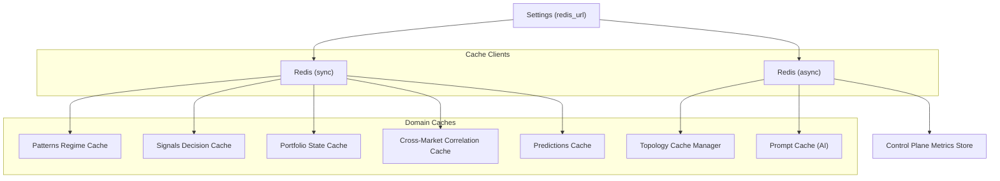

**Diagram sources**
- [src/apps/patterns/cache.py:22-38](file://src/apps/patterns/cache.py#L22-L38)
- [src/apps/signals/cache.py:35-51](file://src/apps/signals/cache.py#L35-L51)
- [src/apps/portfolio/cache.py:20-29](file://src/apps/portfolio/cache.py#L20-L29)
- [src/apps/cross_market/cache.py:31-40](file://src/apps/cross_market/cache.py#L31-L40)
- [src/apps/predictions/cache.py:36-45](file://src/apps/predictions/cache.py#L36-L45)
- [src/apps/control_plane/cache.py:36-43](file://src/apps/control_plane/cache.py#L36-L43)
- [src/apps/hypothesis_engine/memory/cache.py:12-14](file://src/apps/hypothesis_engine/memory/cache.py#L12-L14)
- [src/apps/control_plane/metrics.py:16-18](file://src/apps/control_plane/metrics.py#L16-L18)
- [src/core/settings/base.py:17-20](file://src/core/settings/base.py#L17-L20)

## Detailed Component Analysis

### Patterns Regime Cache
- Keys: iris:regime:{coin_id}:{timeframe}
- TTL: 7 days
- Serialization: JSON with fields for timeframe, regime, confidence
- Operations: cache snapshot, read cached snapshot (sync and async)
- Async client reuse: WeakKeyDictionary per event loop to prevent leaks

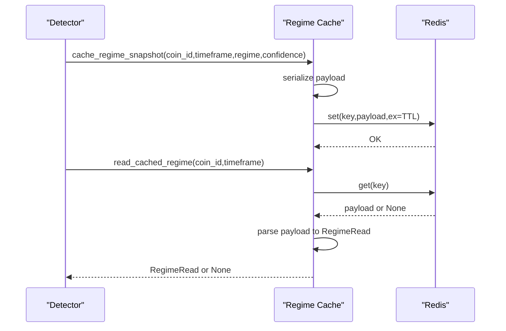

**Diagram sources**
- [src/apps/patterns/cache.py:84-126](file://src/apps/patterns/cache.py#L84-L126)
- [src/apps/patterns/domain/regime.py:18-23](file://src/apps/patterns/domain/regime.py#L18-L23)

**Section sources**
- [src/apps/patterns/cache.py:14-126](file://src/apps/patterns/cache.py#L14-L126)
- [src/apps/patterns/domain/regime.py:18-23](file://src/apps/patterns/domain/regime.py#L18-L23)

### Signals Decision Cache
- Keys: iris:decision:{coin_id}:{timeframe}
- TTL: 7 days
- Serialization: JSON with decision, confidence, signal_count, optional regime, created_at
- Operations: cache snapshot, read cached snapshot (sync and async)
- Async client reuse: WeakKeyDictionary per event loop

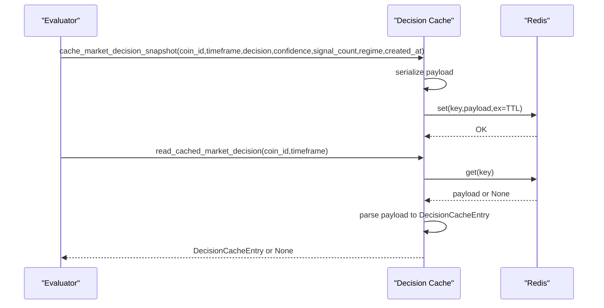

**Diagram sources**
- [src/apps/signals/cache.py:128-192](file://src/apps/signals/cache.py#L128-L192)

**Section sources**
- [src/apps/signals/cache.py:16-192](file://src/apps/signals/cache.py#L16-L192)

### Portfolio State/Balances Cache
- Keys: iris:portfolio:state, iris:portfolio:balances
- TTL: 1 day
- Serialization: JSON for state (dict) and balances (list)
- Operations: cache and read state/balances (sync and async)

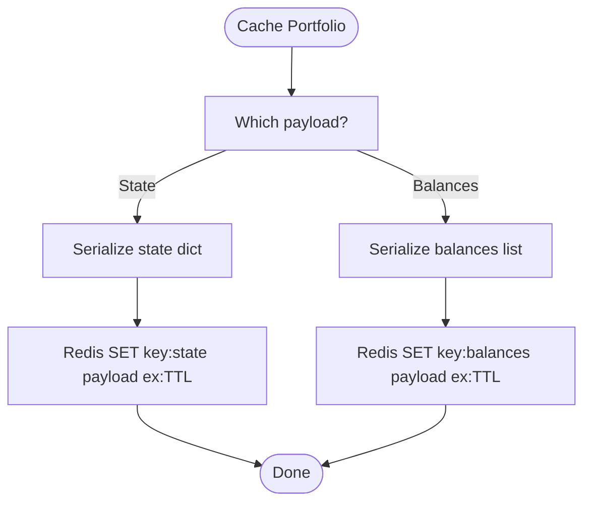

**Diagram sources**
- [src/apps/portfolio/cache.py:52-110](file://src/apps/portfolio/cache.py#L52-L110)

**Section sources**
- [src/apps/portfolio/cache.py:12-110](file://src/apps/portfolio/cache.py#L12-L110)

### Cross-Market Correlation Cache
- Keys: iris:correlation:{leader_coin_id}:{follower_coin_id}
- TTL: 7 days
- Serialization: JSON with leader/follower ids, correlation, lag_hours, confidence, updated_at
- Operations: cache snapshot, read cached snapshot (sync and async)

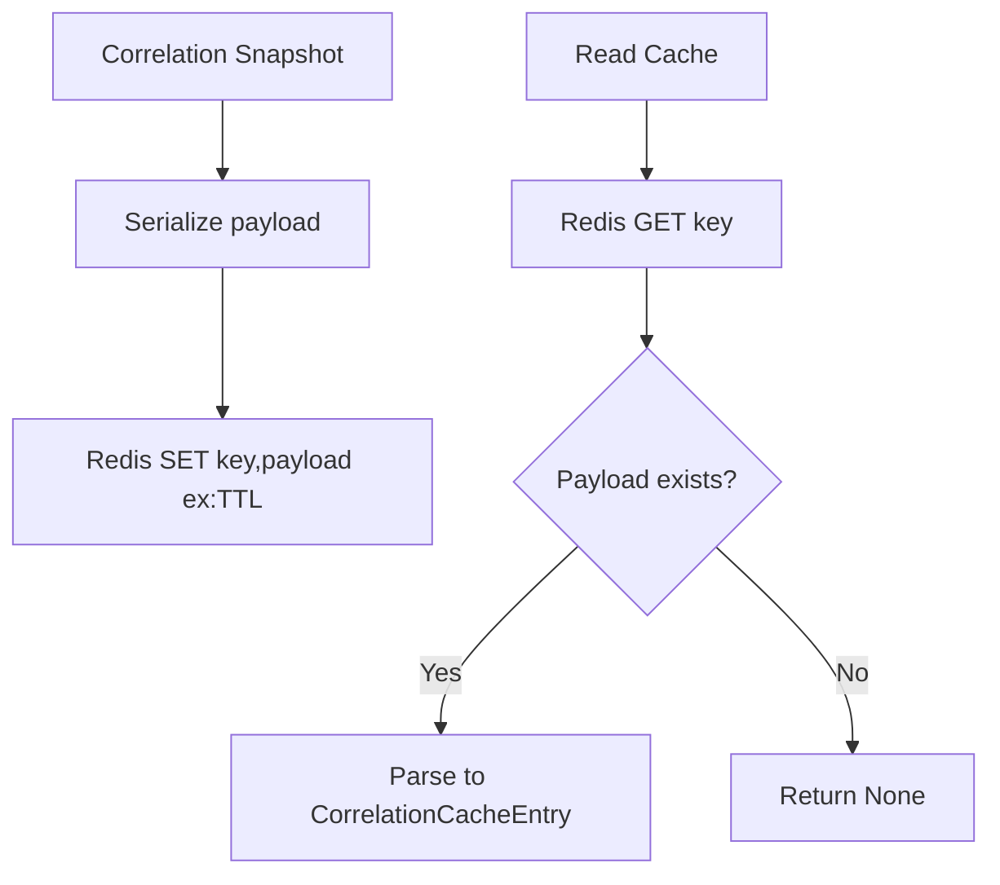

**Diagram sources**
- [src/apps/cross_market/cache.py:98-172](file://src/apps/cross_market/cache.py#L98-L172)

**Section sources**
- [src/apps/cross_market/cache.py:14-172](file://src/apps/cross_market/cache.py#L14-L172)

### Predictions Cache
- Keys: iris:prediction:{prediction_id}
- TTL: 7 days
- Serialization: JSON with prediction metadata, timing, and status
- Operations: cache snapshot, read cached prediction (sync and async)

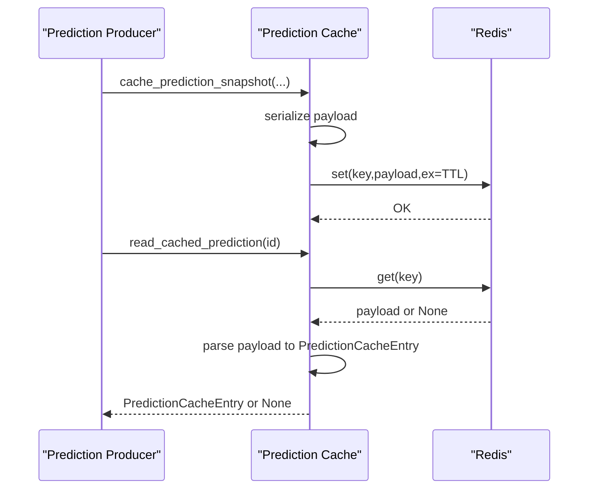

**Diagram sources**
- [src/apps/predictions/cache.py:118-198](file://src/apps/predictions/cache.py#L118-L198)

**Section sources**
- [src/apps/predictions/cache.py:14-198](file://src/apps/predictions/cache.py#L14-L198)

### Control Plane Topology Cache
- Keys: iris:control_plane:topology:snapshot, iris:control_plane:topology:version
- TTL: 5 minutes
- Local in-memory snapshot with forced refresh capability
- Invalidation via control events triggers refresh

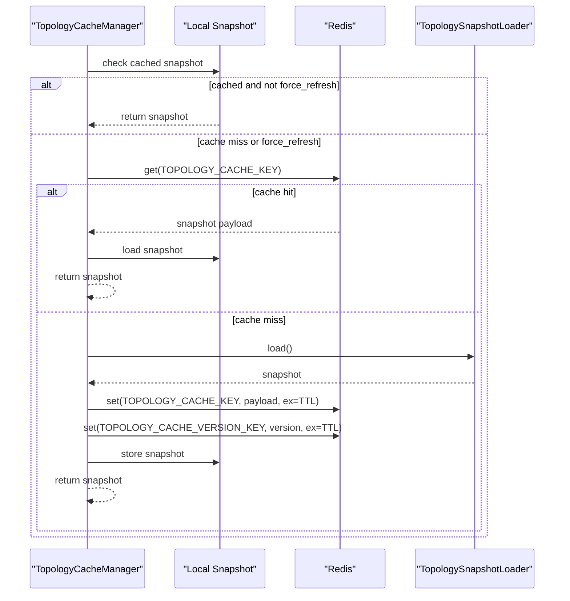

**Diagram sources**
- [src/apps/control_plane/cache.py:235-269](file://src/apps/control_plane/cache.py#L235-L269)

**Section sources**
- [src/apps/control_plane/cache.py:31-280](file://src/apps/control_plane/cache.py#L31-L280)

### Hypothesis Engine Prompt Cache
- Keys: iris:prompt:{name}:active, iris:prompt:{name}:version
- TTL: configured per prompt family
- Operations: read active prompt, cache active prompt, invalidate prompt cache (and bump version)

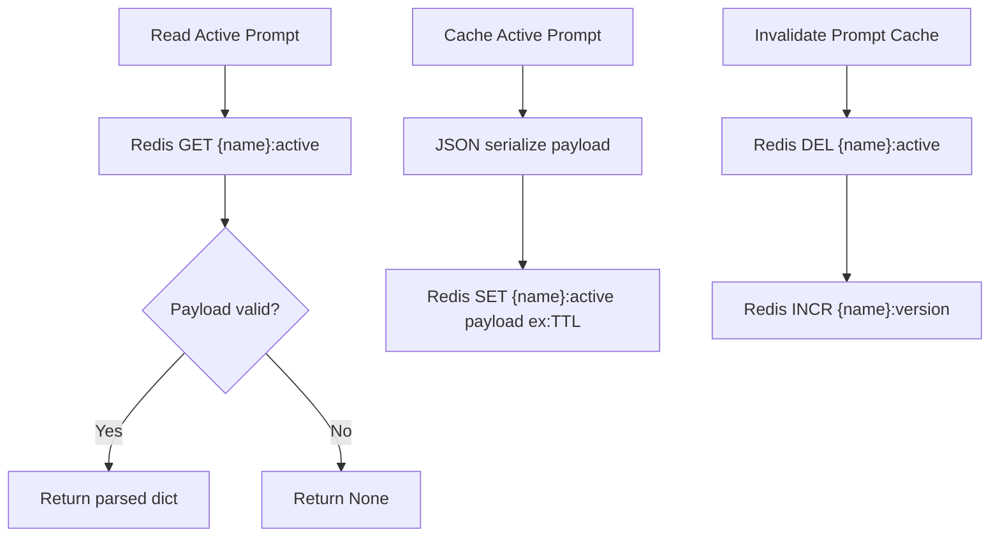

**Diagram sources**
- [src/apps/hypothesis_engine/memory/cache.py:25-59](file://src/apps/hypothesis_engine/memory/cache.py#L25-L59)

**Section sources**
- [src/apps/hypothesis_engine/memory/cache.py:12-59](file://src/apps/hypothesis_engine/memory/cache.py#L12-L59)

### Metrics Store (Control Plane)
- Keys: iris:control_plane:metrics:route:{route_key}, iris:control_plane:metrics:consumer:{consumer_key}
- Fields: counters and timestamps for dispatch and consumer results
- Operations: record route dispatch, record consumer result, read metrics

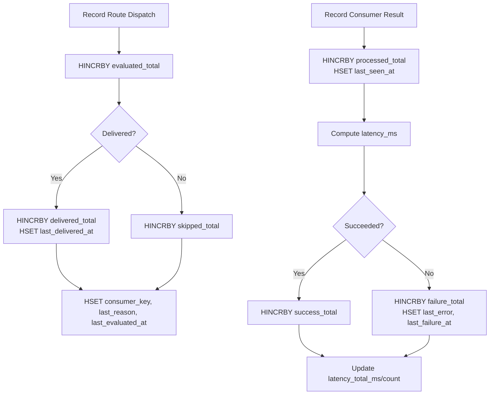

**Diagram sources**
- [src/apps/control_plane/metrics.py:33-97](file://src/apps/control_plane/metrics.py#L33-L97)

**Section sources**
- [src/apps/control_plane/metrics.py:29-124](file://src/apps/control_plane/metrics.py#L29-L124)

## Dependency Analysis
- All cache modules depend on settings for Redis URL and TTL constants.
- Asynchronous cache clients use per-event-loop weak references to avoid resource leaks.
- Control plane cache manager composes a loader and a Redis client, adding local caching and invalidation.
- Metrics store uses Redis hash operations for lightweight counters and timings.

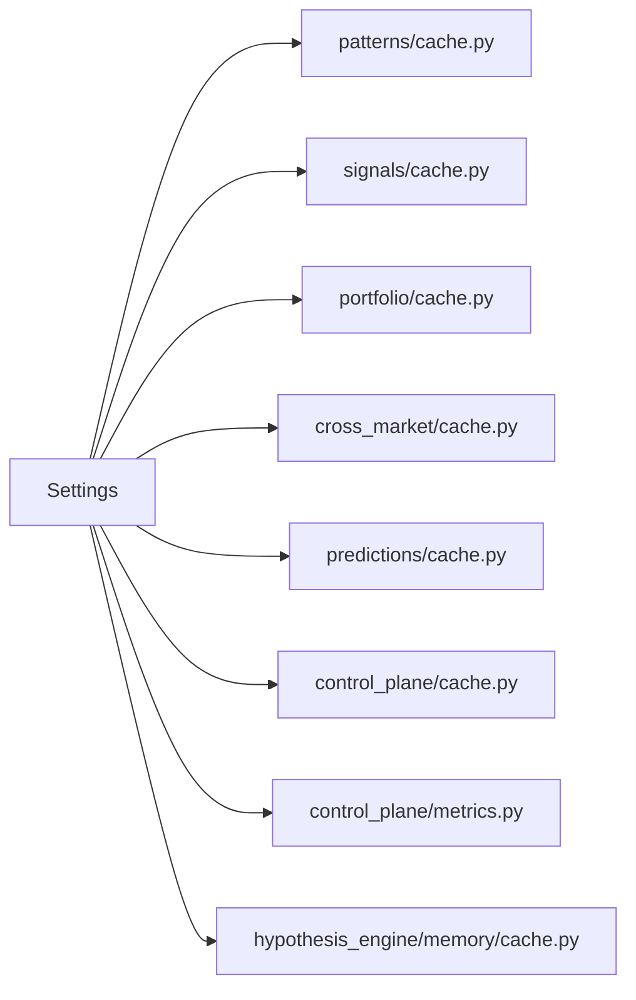

**Diagram sources**
- [src/core/settings/base.py:17-20](file://src/core/settings/base.py#L17-L20)
- [src/apps/patterns/cache.py:11-11](file://src/apps/patterns/cache.py#L11-L11)
- [src/apps/signals/cache.py:13-13](file://src/apps/signals/cache.py#L13-L13)
- [src/apps/portfolio/cache.py:10-10](file://src/apps/portfolio/cache.py#L10-L10)
- [src/apps/cross_market/cache.py:11-11](file://src/apps/cross_market/cache.py#L11-L11)
- [src/apps/predictions/cache.py:11-11](file://src/apps/predictions/cache.py#L11-L11)
- [src/apps/control_plane/cache.py:30-30](file://src/apps/control_plane/cache.py#L30-L30)
- [src/apps/control_plane/metrics.py:11-11](file://src/apps/control_plane/metrics.py#L11-L11)
- [src/apps/hypothesis_engine/memory/cache.py:9-9](file://src/apps/hypothesis_engine/memory/cache.py#L9-L9)

**Section sources**
- [src/core/settings/base.py:1-90](file://src/core/settings/base.py#L1-L90)
- [src/apps/patterns/cache.py:1-126](file://src/apps/patterns/cache.py#L1-L126)
- [src/apps/signals/cache.py:1-192](file://src/apps/signals/cache.py#L1-L192)
- [src/apps/portfolio/cache.py:1-110](file://src/apps/portfolio/cache.py#L1-L110)
- [src/apps/cross_market/cache.py:1-172](file://src/apps/cross_market/cache.py#L1-L172)
- [src/apps/predictions/cache.py:1-198](file://src/apps/predictions/cache.py#L1-L198)
- [src/apps/control_plane/cache.py:1-280](file://src/apps/control_plane/cache.py#L1-L280)
- [src/apps/control_plane/metrics.py:1-124](file://src/apps/control_plane/metrics.py#L1-L124)
- [src/apps/hypothesis_engine/memory/cache.py:1-59](file://src/apps/hypothesis_engine/memory/cache.py#L1-L59)

## Performance Considerations
- Cache hit ratio estimation
  - Use metrics counters to estimate hit ratio:
    - For a given key space, compute hits as successful reads minus misses (None returns).
    - Compute misses as number of cache misses observed by callers.
    - Hit ratio ≈ hits / (hits + misses).
  - For domain caches, track read attempts and None returns to approximate hit ratio.
- Latency profiling
  - Record pre/post timestamps around cache operations to measure lookup latency.
  - Aggregate average and percentile latencies per operation.
- Throughput and contention
  - Monitor Redis command rates and pipeline usage.
  - Use connection pooling and avoid per-request client creation; existing code leverages LRU caches and per-event-loop clients.
- Memory footprint
  - Keep payloads compact (sorted JSON with minimal separators).
  - Use appropriate TTLs to bound memory growth.
- Warm-up strategies
  - Pre-compute and cache regime maps, decisions, and topology snapshots during startup or off-hours.
  - Warm frequently accessed keys (e.g., latest timeframe decisions) to reduce cold-start latency.
- Computation optimization
  - Reuse computed indicator maps and snapshots to avoid recomputation.
  - Batch reads/writes where possible to reduce network overhead.
- Monitoring best practices
  - Track cache TTLs and eviction rates via Redis INFO or external monitoring.
  - Alert on sustained low hit ratios or increased latency.

[No sources needed since this section provides general guidance]

## Troubleshooting Guide
- Redis connectivity issues
  - Use the Redis ping/wait utilities to probe connectivity and retry on failures.
  - Verify REDIS_URL configuration and network reachability.
- Cache invalidation anomalies
  - For topology cache, ensure control events trigger refresh and version updates.
  - For prompt cache, confirm version increments after invalidation.
- Payload parsing errors
  - Validate JSON payloads and handle malformed data gracefully.
  - Ensure fallbacks for missing fields and type mismatches.
- Async client leaks
  - Confirm per-event-loop client cleanup and cache_clear usage for async clients.
- Test coverage references
  - Pattern cache tests validate key generation, TTL, and async/sync behavior.
  - Control plane cache tests validate local-cache-first behavior and refresh on control events.
  - Cross-market cache tests validate TTL and payload parsing.

**Section sources**
- [src/runtime/orchestration/locks.py:63-78](file://src/runtime/orchestration/locks.py#L63-L78)
- [tests/apps/patterns/test_cache_base_and_tasks.py:61-95](file://tests/apps/patterns/test_cache_base_and_tasks.py#L61-L95)
- [tests/apps/control_plane/test_cache.py:58-106](file://tests/apps/control_plane/test_cache.py#L58-L106)
- [tests/apps/cross_market/test_cache_services.py:52-77](file://tests/apps/cross_market/test_cache_services.py#L52-L77)

## Conclusion
The system employs a consistent, Redis-backed caching strategy across pattern intelligence domains with explicit TTLs, structured payloads, and robust async client management. Control plane topology caching adds local caching and event-driven invalidation. Metrics collection enables performance monitoring and tuning. By following the outlined caching strategies, invalidation patterns, and monitoring practices, teams can achieve predictable performance and reliability for pattern data and related computations.

[No sources needed since this section summarizes without analyzing specific files]

## Appendices

### Cache Configuration Options
- Redis URL
  - Environment variable: REDIS_URL
  - Used by all cache modules to connect to Redis
- TTL constants per domain
  - Patterns regime: 7 days
  - Signals decision: 7 days
  - Cross-market correlation: 7 days
  - Predictions: 7 days
  - Portfolio state/balances: 1 day
  - Control plane topology: 5 minutes
  - Hypothesis engine prompt: configured per prompt family

**Section sources**
- [src/core/settings/base.py:17-20](file://src/core/settings/base.py#L17-L20)
- [src/apps/patterns/cache.py:14-15](file://src/apps/patterns/cache.py#L14-L15)
- [src/apps/signals/cache.py:16-17](file://src/apps/signals/cache.py#L16-L17)
- [src/apps/cross_market/cache.py:14-15](file://src/apps/cross_market/cache.py#L14-L15)
- [src/apps/predictions/cache.py:14-15](file://src/apps/predictions/cache.py#L14-L15)
- [src/apps/portfolio/cache.py:13-14](file://src/apps/portfolio/cache.py#L13-L14)
- [src/apps/control_plane/cache.py:32-33](file://src/apps/control_plane/cache.py#L32-L33)
- [src/apps/hypothesis_engine/memory/cache.py:8-8](file://src/apps/hypothesis_engine/memory/cache.py#L8-L8)

### Cache Invalidation Strategies
- Event-driven invalidation
  - Control plane topology cache refreshes on specific control events.
- Version-based invalidation
  - Prompt cache invalidation increments a version key alongside deletion.
- Manual cache_clear
  - Async clients expose cache_clear to reset per-event-loop instances.

**Section sources**
- [src/apps/control_plane/cache.py:260-269](file://src/apps/control_plane/cache.py#L260-L269)
- [src/apps/hypothesis_engine/memory/cache.py:52-59](file://src/apps/hypothesis_engine/memory/cache.py#L52-L59)
- [src/apps/patterns/cache.py:41-45](file://src/apps/patterns/cache.py#L41-L45)
- [src/apps/signals/cache.py:54-58](file://src/apps/signals/cache.py#L54-L58)

### Cache Warming Procedures
- Precompute and persist regime maps, decisions, and topology snapshots.
- Warm hot-path keys (e.g., latest timeframe decisions) during startup or scheduled maintenance windows.
- Use batched writes to minimize network overhead.

[No sources needed since this section provides general guidance]

### Performance Benchmarking
- Measure cache hit ratio using metrics counters and read patterns.
- Profile latency for cache operations and compare with database reads.
- Benchmark warm vs. cold cache scenarios to quantify improvement.

[No sources needed since this section provides general guidance]