# Pattern Context & Lifecycle

<cite>
**Referenced Files in This Document**
- [context.py](file://src/apps/patterns/domain/context.py)
- [pattern_context.py](file://src/apps/patterns/domain/pattern_context.py)
- [engine.py](file://src/apps/patterns/domain/engine.py)
- [lifecycle.py](file://src/apps/patterns/domain/lifecycle.py)
- [registry.py](file://src/apps/patterns/domain/registry.py)
- [scheduler.py](file://src/apps/patterns/domain/scheduler.py)
- [narrative.py](file://src/apps/patterns/domain/narrative.py)
- [discovery.py](file://src/apps/patterns/domain/discovery.py)
- [evaluation.py](file://src/apps/patterns/domain/evaluation.py)
- [decision.py](file://src/apps/patterns/domain/decision.py)
- [risk.py](file://src/apps/patterns/domain/risk.py)
- [semantics.py](file://src/apps/patterns/domain/semantics.py)
- [utils.py](file://src/apps/patterns/domain/utils.py)
- [models.py](file://src/apps/patterns/models.py)
- [base.py](file://src/apps/patterns/domain/base.py)
</cite>

## Table of Contents
1. [Introduction](#introduction)
2. [Project Structure](#project-structure)
3. [Core Components](#core-components)
4. [Architecture Overview](#architecture-overview)
5. [Detailed Component Analysis](#detailed-component-analysis)
6. [Dependency Analysis](#dependency-analysis)
7. [Performance Considerations](#performance-considerations)
8. [Troubleshooting Guide](#troubleshooting-guide)
9. [Conclusion](#conclusion)
10. [Appendices](#appendices)

## Introduction
This document explains the pattern context management and lifecycle systems that power pattern intelligence across timeframes. It covers how pattern context is created and enriched, how context influences detection and evaluation, and how lifecycle states govern detection eligibility. It also documents the narrative engine that generates sector and capital wave stories, context switching across timeframes, multi-pattern coordination, and the supporting infrastructure for pattern memory and decision-making.

## Project Structure
The pattern subsystem is organized around domain modules that encapsulate detection, context enrichment, lifecycle management, scheduling, discovery, evaluation, decisions, risk adjustment, and semantics. Supporting models define persistent structures for discovered patterns, market cycles, registry entries, and statistics.

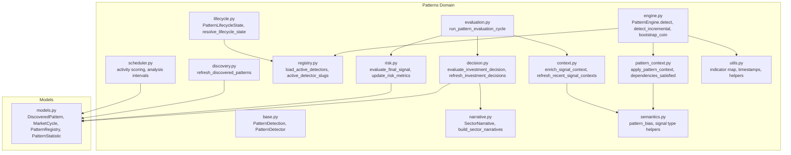

**Diagram sources**
- [engine.py:21-212](file://src/apps/patterns/domain/engine.py#L21-L212)
- [pattern_context.py:153-180](file://src/apps/patterns/domain/pattern_context.py#L153-L180)
- [context.py:127-187](file://src/apps/patterns/domain/context.py#L127-L187)
- [registry.py:94-102](file://src/apps/patterns/domain/registry.py#L94-L102)
- [lifecycle.py:6-27](file://src/apps/patterns/domain/lifecycle.py#L6-L27)
- [scheduler.py:21-98](file://src/apps/patterns/domain/scheduler.py#L21-L98)
- [narrative.py:144-211](file://src/apps/patterns/domain/narrative.py#L144-L211)
- [discovery.py:33-99](file://src/apps/patterns/domain/discovery.py#L33-L99)
- [evaluation.py:12-26](file://src/apps/patterns/domain/evaluation.py#L12-L26)
- [decision.py:242-389](file://src/apps/patterns/domain/decision.py#L242-L389)
- [risk.py:235-322](file://src/apps/patterns/domain/risk.py#L235-L322)
- [semantics.py:106-134](file://src/apps/patterns/domain/semantics.py#L106-L134)
- [utils.py:117-157](file://src/apps/patterns/domain/utils.py#L117-L157)
- [models.py:15-109](file://src/apps/patterns/models.py#L15-L109)

**Section sources**
- [engine.py:21-212](file://src/apps/patterns/domain/engine.py#L21-L212)
- [registry.py:94-102](file://src/apps/patterns/domain/registry.py#L94-L102)
- [models.py:15-109](file://src/apps/patterns/models.py#L15-L109)

## Core Components
- Pattern detection and engine: Orchestrates detection windows, indicator computation, detector selection, context application, and persistence of signals.
- Pattern context: Applies regime-aware weighting, validates dependencies, and adjusts confidence while preserving detection metadata.
- Context enrichment: Computes priority and context scores per signal, incorporating regime alignment, volatility, liquidity, sector/cycle alignment, and pattern temperature.
- Lifecycle and registry: Manages detector enablement, lifecycle states, and active detector selection.
- Evaluation pipeline: Runs periodic cycles to refresh signal history, statistics, context, decisions, and final signals.
- Narrative engine: Builds sector narratives and capital wave classifications to inform decision factors.
- Risk adjustment: Transforms investment decisions into final signals after risk scoring.
- Semantics and utilities: Provide slug parsing, bias inference, and indicator mapping.

**Section sources**
- [engine.py:29-72](file://src/apps/patterns/domain/engine.py#L29-L72)
- [pattern_context.py:153-180](file://src/apps/patterns/domain/pattern_context.py#L153-L180)
- [context.py:127-187](file://src/apps/patterns/domain/context.py#L127-L187)
- [lifecycle.py:6-27](file://src/apps/patterns/domain/lifecycle.py#L6-L27)
- [registry.py:94-102](file://src/apps/patterns/domain/registry.py#L94-L102)
- [evaluation.py:12-26](file://src/apps/patterns/domain/evaluation.py#L12-L26)
- [narrative.py:144-211](file://src/apps/patterns/domain/narrative.py#L144-L211)
- [risk.py:235-322](file://src/apps/patterns/domain/risk.py#L235-L322)
- [semantics.py:106-134](file://src/apps/patterns/domain/semantics.py#L106-L134)
- [utils.py:117-157](file://src/apps/patterns/domain/utils.py#L117-L157)

## Architecture Overview
The system operates as a pipeline: raw candles feed indicator computation, detectors produce candidate detections, context is applied and validated, signals are persisted, and downstream modules compute decisions and final signals. Lifecycle and registry gate detection eligibility, while scheduling determines analysis cadence. Discovery builds a reusable pattern library, and narrative generation enriches macro context.

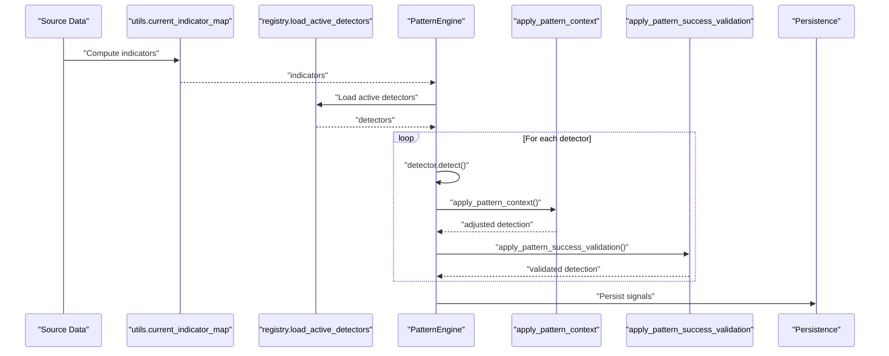

**Diagram sources**
- [engine.py:29-72](file://src/apps/patterns/domain/engine.py#L29-L72)
- [pattern_context.py:153-180](file://src/apps/patterns/domain/pattern_context.py#L153-L180)
- [registry.py:94-102](file://src/apps/patterns/domain/registry.py#L94-L102)
- [utils.py:117-157](file://src/apps/patterns/domain/utils.py#L117-L157)

## Detailed Component Analysis

### Pattern Context Creation and Enrichment
- Context enrichment computes regime alignment, volatility alignment, liquidity score, sector alignment, cycle alignment, and pattern temperature. These compose into context and priority scores per signal.
- The process iterates recent signal groups by coin/timeframe/timestamp and updates attributes for downstream evaluation.

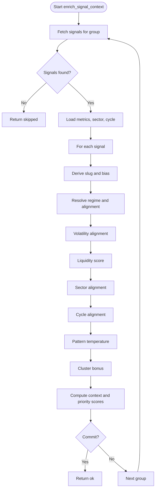

**Diagram sources**
- [context.py:127-187](file://src/apps/patterns/domain/context.py#L127-L187)

**Section sources**
- [context.py:127-187](file://src/apps/patterns/domain/context.py#L127-L187)

### Context-Aware Pattern Evaluation
- Pattern context applies regime-weighted confidence adjustments and filters detections below a minimum threshold.
- Dependencies are checked against computed indicators (e.g., trend and volume), ensuring contextual relevance before evaluation.

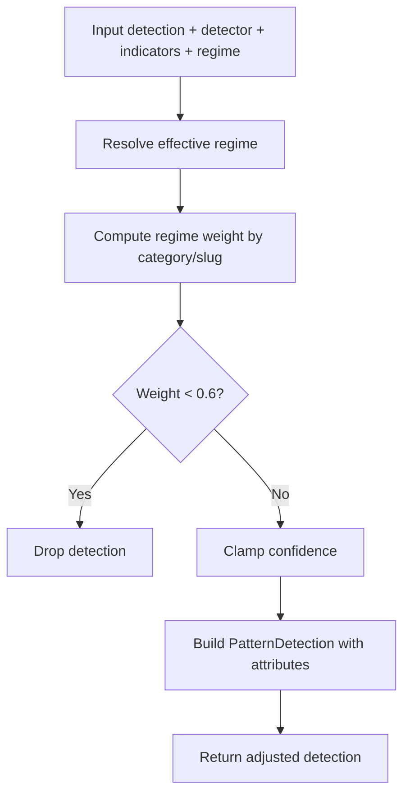

**Diagram sources**
- [pattern_context.py:153-180](file://src/apps/patterns/domain/pattern_context.py#L153-L180)

**Section sources**
- [pattern_context.py:78-92](file://src/apps/patterns/domain/pattern_context.py#L78-L92)
- [pattern_context.py:153-180](file://src/apps/patterns/domain/pattern_context.py#L153-L180)

### Pattern Lifecycle Stages and State Management
- Lifecycle states include ACTIVE, EXPERIMENTAL, COOLDOWN, and DISABLED.
- Resolution maps temperature thresholds and enabled flag to a state.
- Detection eligibility is determined by lifecycle rules and feature flags.

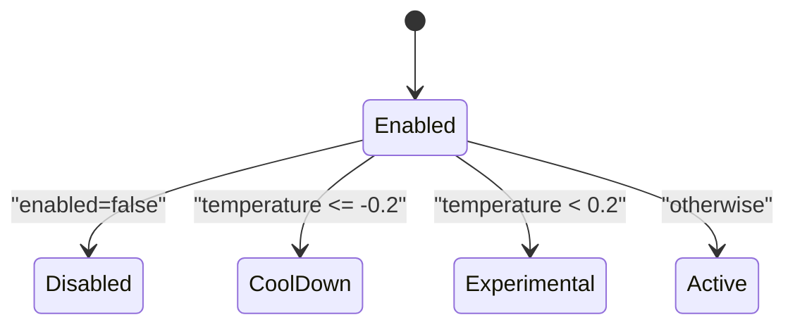

**Diagram sources**
- [lifecycle.py:6-27](file://src/apps/patterns/domain/lifecycle.py#L6-L27)

**Section sources**
- [lifecycle.py:13-27](file://src/apps/patterns/domain/lifecycle.py#L13-L27)
- [registry.py:80-91](file://src/apps/patterns/domain/registry.py#L80-L91)

### Context Switching Across Timeframes
- The engine supports multiple timeframes and maps interval strings to numeric units.
- Bootstrapping and incremental detection operate per timeframe, enabling multi-timeframe context switching during evaluation.

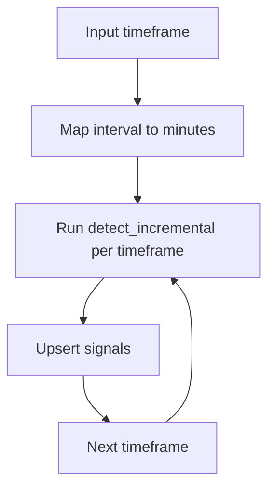

**Diagram sources**
- [engine.py:22-27](file://src/apps/patterns/domain/engine.py#L22-L27)
- [engine.py:114-148](file://src/apps/patterns/domain/engine.py#L114-L148)

**Section sources**
- [engine.py:22-27](file://src/apps/patterns/domain/engine.py#L22-L27)
- [engine.py:114-148](file://src/apps/patterns/domain/engine.py#L114-L148)

### Multi-Pattern Coordination and Decision Factors
- Decisions aggregate the latest pattern stack per timeframe, computing bias ratios and weighted priorities.
- Sector narratives and cycle phases influence alignment factors.
- Historical pattern success rates are averaged across matched pattern slugs.

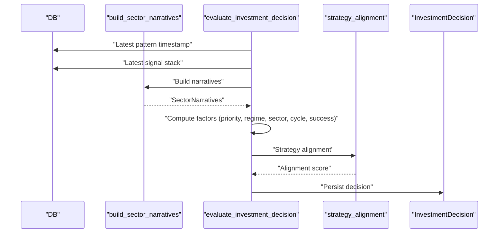

**Diagram sources**
- [decision.py:242-389](file://src/apps/patterns/domain/decision.py#L242-L389)
- [narrative.py:144-211](file://src/apps/patterns/domain/narrative.py#L144-L211)

**Section sources**
- [decision.py:242-389](file://src/apps/patterns/domain/decision.py#L242-L389)
- [narrative.py:144-211](file://src/apps/patterns/domain/narrative.py#L144-L211)

### Narrative Engine and Macro Context
- Sector narratives capture top sector, BTC dominance state, and capital wave classification.
- Capital wave buckets are derived from market cap and sector leadership, combined with price/volume flows.

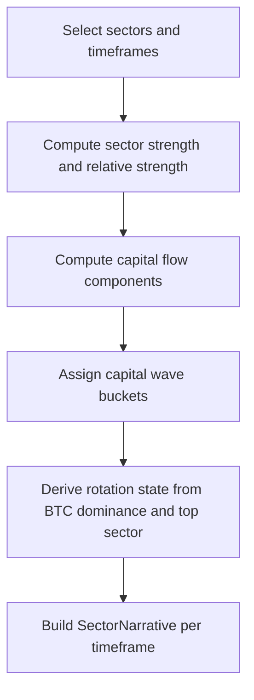

**Diagram sources**
- [narrative.py:71-141](file://src/apps/patterns/domain/narrative.py#L71-L141)
- [narrative.py:144-211](file://src/apps/patterns/domain/narrative.py#L144-L211)

**Section sources**
- [narrative.py:71-141](file://src/apps/patterns/domain/narrative.py#L71-L141)
- [narrative.py:144-211](file://src/apps/patterns/domain/narrative.py#L144-L211)

### Pattern Discovery and Memory Systems
- Discovery scans rolling windows to extract structure signatures and record average returns/drawdowns.
- Results are upserted into a discovered patterns table for reuse.

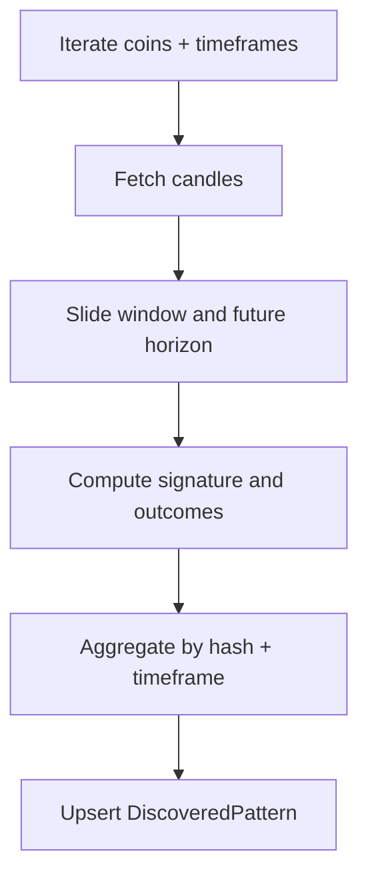

**Diagram sources**
- [discovery.py:33-99](file://src/apps/patterns/domain/discovery.py#L33-L99)

**Section sources**
- [discovery.py:33-99](file://src/apps/patterns/domain/discovery.py#L33-L99)
- [models.py:15-24](file://src/apps/patterns/models.py#L15-L24)

### Context Serialization and Persistence
- Signals persist context and priority scores, enabling downstream evaluation and history aggregation.
- The engine upserts signals with conflict resolution on unique keys.

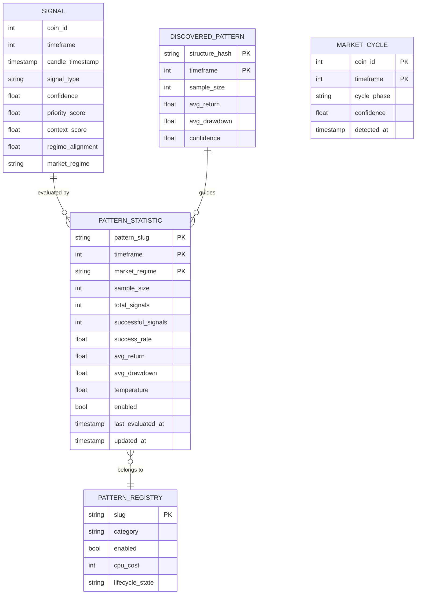

**Diagram sources**
- [engine.py:74-112](file://src/apps/patterns/domain/engine.py#L74-L112)
- [models.py:15-109](file://src/apps/patterns/models.py#L15-L109)

**Section sources**
- [engine.py:74-112](file://src/apps/patterns/domain/engine.py#L74-L112)
- [models.py:15-109](file://src/apps/patterns/models.py#L15-L109)

### Pattern Lifecycle Orchestration
- Registry synchronizes feature flags and detector catalog, then selects active detectors per timeframe and lifecycle state.
- Scheduler computes activity buckets and analysis intervals to optimize resource allocation.

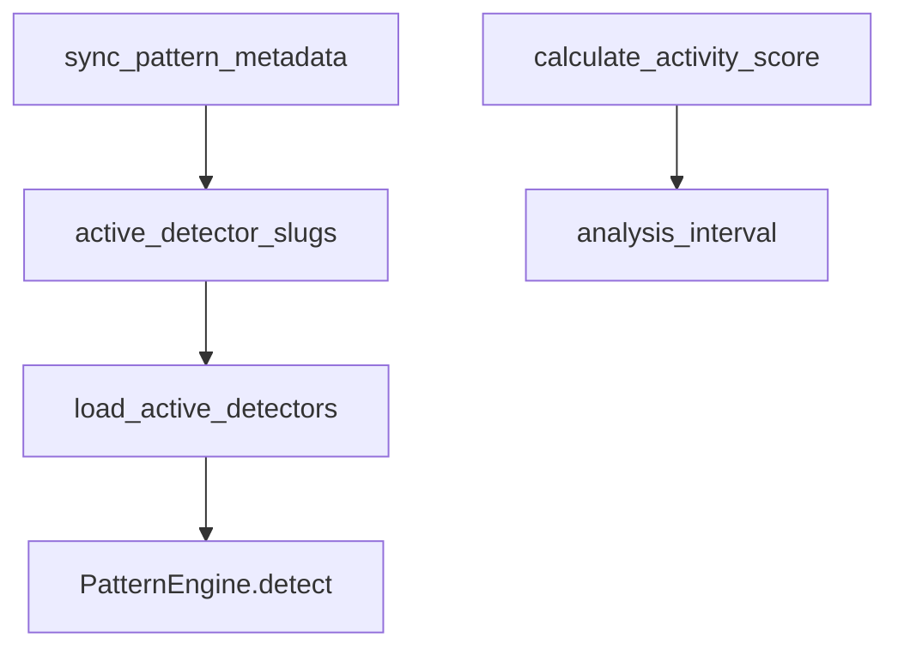

**Diagram sources**
- [registry.py:58-102](file://src/apps/patterns/domain/registry.py#L58-L102)
- [scheduler.py:21-98](file://src/apps/patterns/domain/scheduler.py#L21-L98)
- [engine.py:29-72](file://src/apps/patterns/domain/engine.py#L29-L72)

**Section sources**
- [registry.py:58-102](file://src/apps/patterns/domain/registry.py#L58-L102)
- [scheduler.py:21-98](file://src/apps/patterns/domain/scheduler.py#L21-L98)
- [engine.py:29-72](file://src/apps/patterns/domain/engine.py#L29-L72)

### Context-Based Decision Making and Risk Adjustment
- Decisions combine multiple factors: signal priority, regime alignment, sector strength, cycle alignment, historical success, and strategy alignment.
- Final signals adjust decisions by liquidity, slippage, and volatility risks, emitting events when requested.

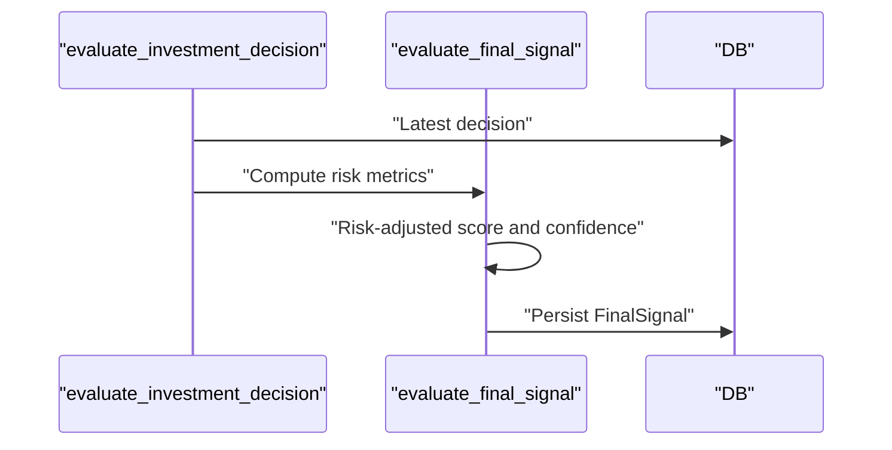

**Diagram sources**
- [decision.py:242-389](file://src/apps/patterns/domain/decision.py#L242-L389)
- [risk.py:235-322](file://src/apps/patterns/domain/risk.py#L235-L322)

**Section sources**
- [decision.py:242-389](file://src/apps/patterns/domain/decision.py#L242-L389)
- [risk.py:235-322](file://src/apps/patterns/domain/risk.py#L235-L322)

## Dependency Analysis
- PatternEngine depends on detector registry, indicator utilities, and context application/validation.
- Decision and risk modules depend on signals, narratives, and market cycle data.
- Context enrichment depends on market metrics, sector metrics, and cycle data.

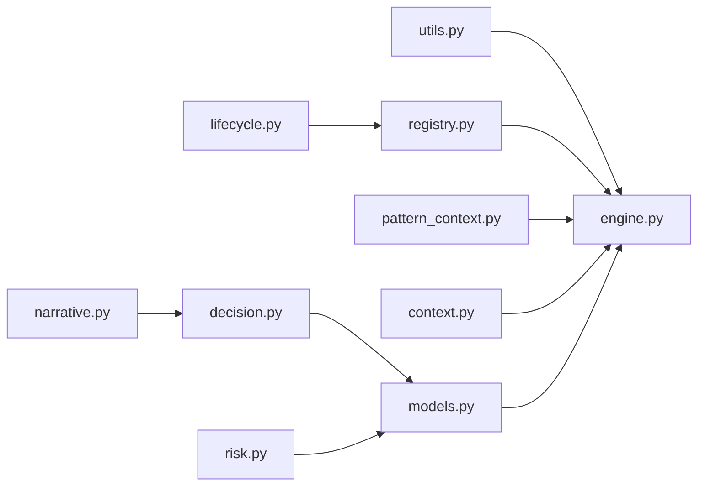

**Diagram sources**
- [engine.py:29-72](file://src/apps/patterns/domain/engine.py#L29-L72)
- [registry.py:94-102](file://src/apps/patterns/domain/registry.py#L94-L102)
- [pattern_context.py:153-180](file://src/apps/patterns/domain/pattern_context.py#L153-L180)
- [context.py:127-187](file://src/apps/patterns/domain/context.py#L127-L187)
- [decision.py:242-389](file://src/apps/patterns/domain/decision.py#L242-L389)
- [risk.py:235-322](file://src/apps/patterns/domain/risk.py#L235-L322)
- [narrative.py:144-211](file://src/apps/patterns/domain/narrative.py#L144-L211)
- [lifecycle.py:6-27](file://src/apps/patterns/domain/lifecycle.py#L6-L27)
- [models.py:15-109](file://src/apps/patterns/models.py#L15-L109)

**Section sources**
- [engine.py:29-72](file://src/apps/patterns/domain/engine.py#L29-L72)
- [registry.py:94-102](file://src/apps/patterns/domain/registry.py#L94-L102)
- [decision.py:242-389](file://src/apps/patterns/domain/decision.py#L242-L389)
- [risk.py:235-322](file://src/apps/patterns/domain/risk.py#L235-L322)
- [narrative.py:144-211](file://src/apps/patterns/domain/narrative.py#L144-L211)
- [lifecycle.py:6-27](file://src/apps/patterns/domain/lifecycle.py#L6-L27)
- [models.py:15-109](file://src/apps/patterns/models.py#L15-L109)

## Performance Considerations
- Indicator computation is centralized and reused across detectors to avoid redundant calculations.
- Batch operations (upserts) minimize database round-trips for signals and sector metrics.
- Activity-based scheduling reduces unnecessary analysis frequency for low-activity assets.
- Lifecycle gating prevents costly detections when patterns are disabled or in cooldown.

[No sources needed since this section provides general guidance]

## Troubleshooting Guide
- Pattern detection disabled: Verify feature flags and lifecycle state via registry and lifecycle utilities.
- Insufficient candles: Incremental detection skips runs with fewer bars than required.
- No signals found: Context enrichment returns a skipped status when no matching signals exist for a group.
- Decision unchanged: Decisions are skipped if factors and thresholds show minimal change.
- Final signal unchanged: Risk-adjusted signals are skipped if minimal drift from prior values.

**Section sources**
- [registry.py:80-91](file://src/apps/patterns/domain/registry.py#L80-L91)
- [engine.py:123-129](file://src/apps/patterns/domain/engine.py#L123-L129)
- [context.py:144-146](file://src/apps/patterns/domain/context.py#L144-L146)
- [decision.py:342-358](file://src/apps/patterns/domain/decision.py#L342-L358)
- [risk.py:274-291](file://src/apps/patterns/domain/risk.py#L274-L291)

## Conclusion
The pattern context and lifecycle system integrates detection, context enrichment, lifecycle gating, narrative generation, and risk-aware decision-making. It preserves context across timeframes, coordinates multi-pattern stacks, and maintains a robust memory of discovered structures and historical success. The modular design enables scalable, explainable, and adaptive pattern intelligence.

[No sources needed since this section summarizes without analyzing specific files]

## Appendices

### API and Workflow Summaries
- PatternEngine.detect: Orchestrates detection, context application, and validation; persists signals.
- enrich_signal_context: Updates signals with context and priority scores.
- evaluate_investment_decision: Aggregates latest patterns and emits decisions.
- evaluate_final_signal: Applies risk metrics to derive final signals.
- run_pattern_evaluation_cycle: Coordinates periodic refresh of history, statistics, context, decisions, and final signals.

**Section sources**
- [engine.py:29-72](file://src/apps/patterns/domain/engine.py#L29-L72)
- [context.py:127-187](file://src/apps/patterns/domain/context.py#L127-L187)
- [decision.py:242-389](file://src/apps/patterns/domain/decision.py#L242-L389)
- [risk.py:235-322](file://src/apps/patterns/domain/risk.py#L235-L322)
- [evaluation.py:12-26](file://src/apps/patterns/domain/evaluation.py#L12-L26)