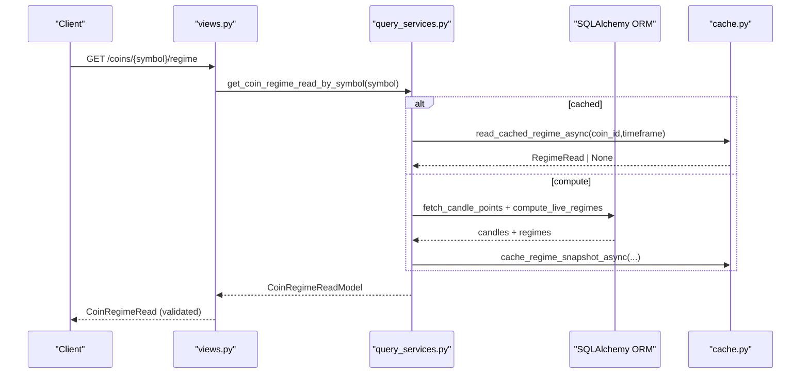
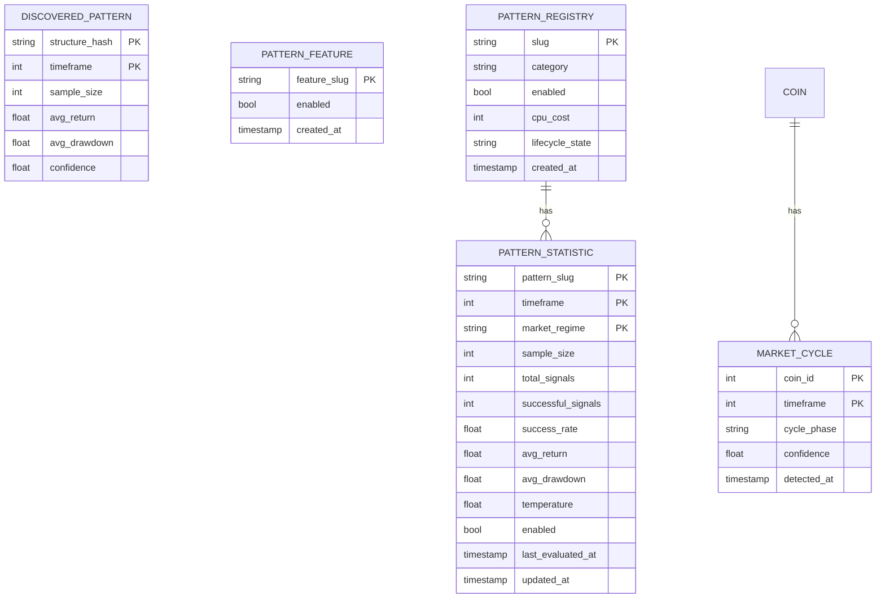
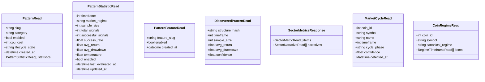
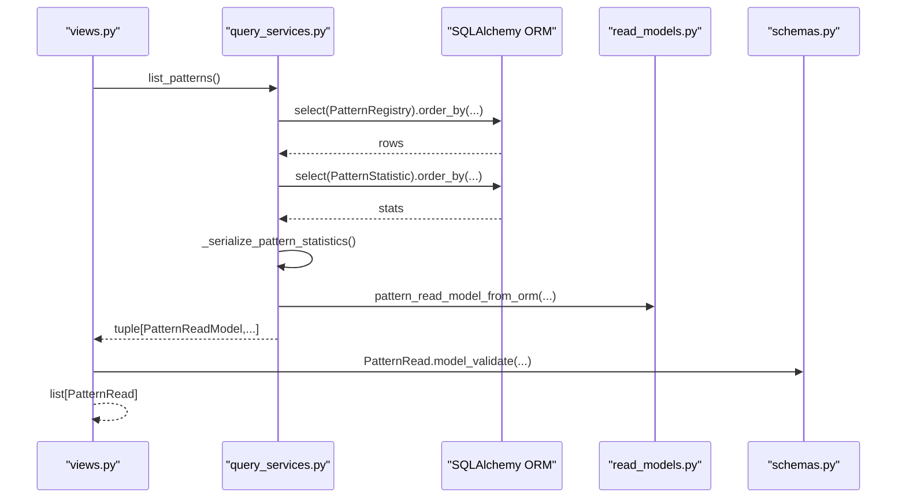
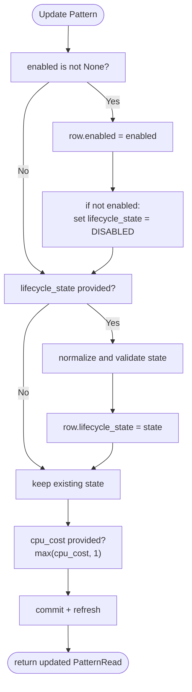
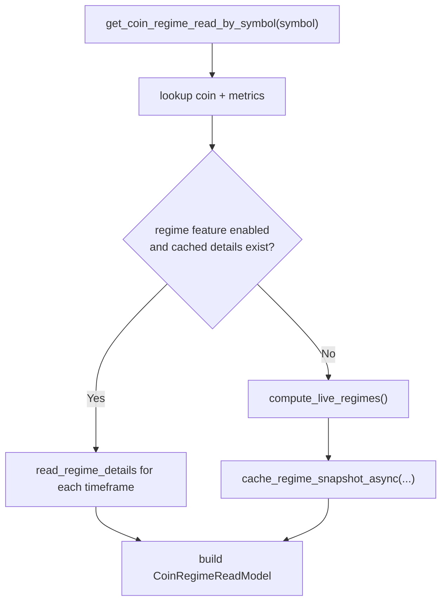
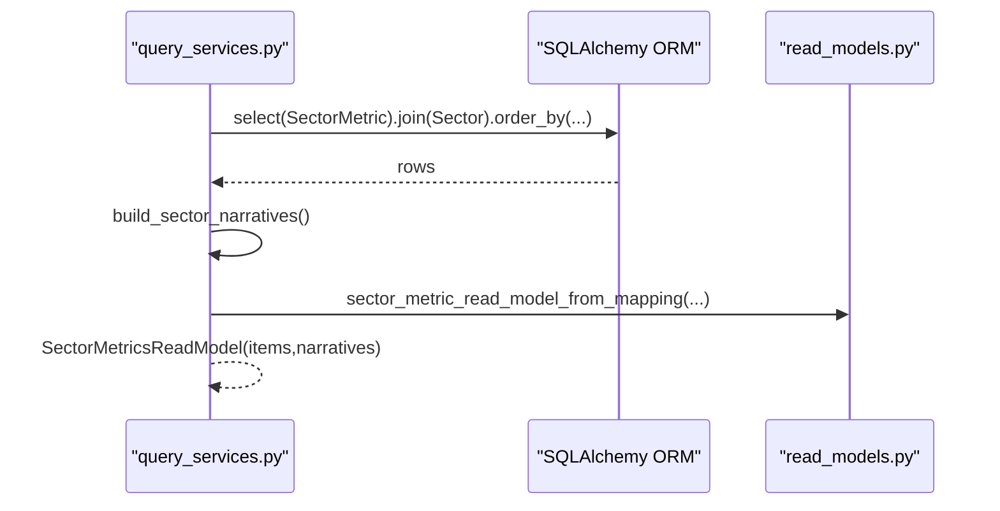
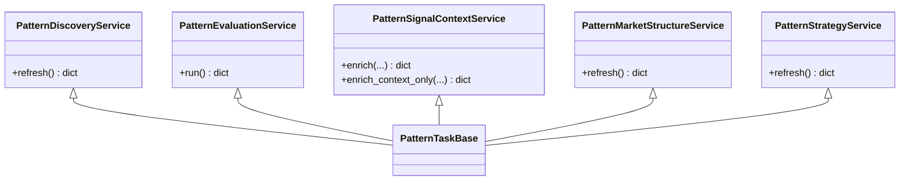
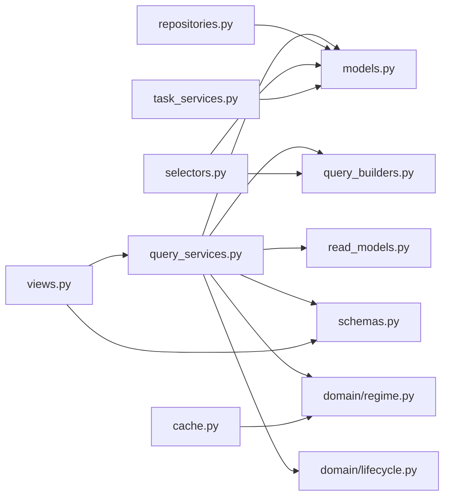

# Pattern Data Models & Schemas

<cite>
**Referenced Files in This Document**
- [models.py](file://src/apps/patterns/models.py)
- [schemas.py](file://src/apps/patterns/schemas.py)
- [read_models.py](file://src/apps/patterns/read_models.py)
- [query_services.py](file://src/apps/patterns/query_services.py)
- [repositories.py](file://src/apps/patterns/repositories.py)
- [selectors.py](file://src/apps/patterns/selectors.py)
- [query_builders.py](file://src/apps/patterns/query_builders.py)
- [views.py](file://src/apps/patterns/views.py)
- [cache.py](file://src/apps/patterns/cache.py)
- [task_services.py](file://src/apps/patterns/task_services.py)
- [domain/base.py](file://src/apps/patterns/domain/base.py)
- [domain/lifecycle.py](file://src/apps/patterns/domain/lifecycle.py)
- [domain/regime.py](file://src/apps/patterns/domain/regime.py)
</cite>

## Table of Contents
1. [Introduction](#introduction)
2. [Project Structure](#project-structure)
3. [Core Components](#core-components)
4. [Architecture Overview](#architecture-overview)
5. [Detailed Component Analysis](#detailed-component-analysis)
6. [Dependency Analysis](#dependency-analysis)
7. [Performance Considerations](#performance-considerations)
8. [Troubleshooting Guide](#troubleshooting-guide)
9. [Conclusion](#conclusion)
10. [Appendices](#appendices)

## Introduction
This document describes the pattern data models and schemas across persistence, query, and presentation layers. It covers entity models, result schemas, query services, data relationships, validation rules, persistence models, query optimization, serialization, schema evolution, backward compatibility, lifecycle, archival strategies, and integrity measures. The focus is on the patterns subsystem, including pattern registries, statistics, discovered patterns, market cycles, and sector metrics, along with regime detection and caching.

## Project Structure
The patterns subsystem is organized by concerns:
- Persistence models define relational tables and relationships.
- Read models encapsulate immutable, typed result representations.
- Schemas define Pydantic models for serialization and API validation.
- Query services orchestrate reads, joins, aggregations, and transformations.
- Repositories provide write-focused persistence operations with locking.
- Selectors offer SQLAlchemy ORM-based queries for batch and analytics.
- Views expose FastAPI endpoints backed by query services.
- Domain modules implement pattern detection abstractions, lifecycle state transitions, and regime classification.
- Cache utilities provide short-lived regime snapshots for performance.
- Task services coordinate periodic and real-time pattern discovery and evaluation.

```mermaid
graph TB
subgraph "Persistence"
PM["models.py<br/>SQLAlchemy ORM"]
end
subgraph "Domain"
DBase["domain/base.py<br/>PatternDetector, PatternDetection"]
DLife["domain/lifecycle.py<br/>LifecycleState, resolution"]
DRegime["domain/regime.py<br/>Regime detection & read"]
end
subgraph "Query Layer"
QS["query_services.py<br/>AsyncQueryService"]
Sel["selectors.py<br/>ORM selectors"]
QB["query_builders.py<br/>signal_select()"]
end
subgraph "Presentation"
RM["read_models.py<br/>Frozen dataclasses"]
Sch["schemas.py<br/>Pydantic models"]
VW["views.py<br/>FastAPI routes"]
end
subgraph "Caching"
Cache["cache.py<br/>Redis cache for regimes"]
end
subgraph "Tasks"
Tasks["task_services.py<br/>Periodic services"]
end
PM --> QS
PM --> Sel
QS --> RM
QS --> Sch
Sel --> RM
Sel --> Sch
QS --> VW
Cache --> QS
Cache --> DRegime
Tasks --> QS
DBase --> QS
DLife --> QS
DRegime --> QS
QB --> QS
```

**Diagram sources**
- [models.py:15-108](file://src/apps/patterns/models.py#L15-L108)
- [domain/base.py:11-35](file://src/apps/patterns/domain/base.py#L11-L35)
- [domain/lifecycle.py:6-27](file://src/apps/patterns/domain/lifecycle.py#L6-L27)
- [domain/regime.py:18-142](file://src/apps/patterns/domain/regime.py#L18-L142)
- [query_services.py:48-545](file://src/apps/patterns/query_services.py#L48-L545)
- [selectors.py:27-367](file://src/apps/patterns/selectors.py#L27-L367)
- [query_builders.py:12-46](file://src/apps/patterns/query_builders.py#L12-L46)
- [read_models.py:16-331](file://src/apps/patterns/read_models.py#L16-L331)
- [schemas.py:8-152](file://src/apps/patterns/schemas.py#L8-L152)
- [views.py:22-117](file://src/apps/patterns/views.py#L22-L117)
- [cache.py:48-126](file://src/apps/patterns/cache.py#L48-L126)
- [task_services.py:27-166](file://src/apps/patterns/task_services.py#L27-L166)

**Section sources**
- [models.py:15-108](file://src/apps/patterns/models.py#L15-L108)
- [query_services.py:48-545](file://src/apps/patterns/query_services.py#L48-L545)
- [schemas.py:8-152](file://src/apps/patterns/schemas.py#L8-L152)
- [read_models.py:16-331](file://src/apps/patterns/read_models.py#L16-L331)
- [selectors.py:27-367](file://src/apps/patterns/selectors.py#L27-L367)
- [query_builders.py:12-46](file://src/apps/patterns/query_builders.py#L12-L46)
- [views.py:22-117](file://src/apps/patterns/views.py#L22-L117)
- [cache.py:48-126](file://src/apps/patterns/cache.py#L48-L126)
- [task_services.py:27-166](file://src/apps/patterns/task_services.py#L27-L166)
- [domain/base.py:11-35](file://src/apps/patterns/domain/base.py#L11-L35)
- [domain/lifecycle.py:6-27](file://src/apps/patterns/domain/lifecycle.py#L6-L27)
- [domain/regime.py:18-142](file://src/apps/patterns/domain/regime.py#L18-L142)

## Core Components
- Persistence models
  - DiscoveredPattern: stores discovered pattern aggregates keyed by structure hash and timeframe.
  - MarketCycle: tracks per-coin, per-timeframe cycle phase with confidence and detection timestamp.
  - PatternFeature: feature flags controlling pattern subsystem capabilities.
  - PatternRegistry: pattern definitions with lifecycle state, CPU cost, and creation metadata.
  - PatternStatistic: per-pattern, per-timeframe, per-regime statistics with derived metrics and temperature.
- Read models
  - Immutable, typed dataclasses for query results (e.g., PatternReadModel, PatternStatisticReadModel, MarketCycleReadModel, Sector*ReadModels).
- Schemas
  - Pydantic models for API serialization and validation (e.g., PatternRead, PatternFeatureRead, DiscoveredPatternRead, SectorMetricsResponse).
- Query services
  - AsyncQueryService orchestrates SQL queries, joins, aggregations, and transformations into read models and schemas.
- Repositories
  - PatternFeatureRepository and PatternRegistryRepository support write operations with advisory locks.
- Selectors
  - ORM-based selectors provide dictionary-like payloads for analytics and batch jobs.
- Views
  - FastAPI endpoints delegate to query services and validate responses via schemas.
- Domain
  - PatternDetector and PatternDetection define detection contracts.
  - Lifecycle state machine governs enablement and detection eligibility.
  - Regime detection computes market regimes from indicator snapshots.

**Section sources**
- [models.py:15-108](file://src/apps/patterns/models.py#L15-L108)
- [read_models.py:16-331](file://src/apps/patterns/read_models.py#L16-L331)
- [schemas.py:8-152](file://src/apps/patterns/schemas.py#L8-L152)
- [query_services.py:48-545](file://src/apps/patterns/query_services.py#L48-L545)
- [repositories.py:10-43](file://src/apps/patterns/repositories.py#L10-L43)
- [selectors.py:27-367](file://src/apps/patterns/selectors.py#L27-L367)
- [views.py:22-117](file://src/apps/patterns/views.py#L22-L117)
- [domain/base.py:11-35](file://src/apps/patterns/domain/base.py#L11-L35)
- [domain/lifecycle.py:6-27](file://src/apps/patterns/domain/lifecycle.py#L6-L27)
- [domain/regime.py:18-142](file://src/apps/patterns/domain/regime.py#L18-L142)

## Architecture Overview
The patterns subsystem follows a layered architecture:
- Persistence layer: SQLAlchemy ORM models define tables and foreign keys.
- Domain layer: Detection contracts and lifecycle/state logic.
- Query layer: AsyncQueryService composes complex SQL queries, joins, and transforms to typed read models and schemas.
- Presentation layer: FastAPI views validate and return Pydantic schemas.
- Caching layer: Redis-backed regime cache improves latency for live regime computations.
- Task layer: Periodic services refresh statistics, contexts, decisions, and signals.



**Diagram sources**
- [views.py:92-101](file://src/apps/patterns/views.py#L92-L101)
- [query_services.py:399-443](file://src/apps/patterns/query_services.py#L399-L443)
- [cache.py:99-126](file://src/apps/patterns/cache.py#L99-L126)
- [domain/regime.py:132-142](file://src/apps/patterns/domain/regime.py#L132-L142)

## Detailed Component Analysis

### Entity Models and Relationships
The persistence models define the core entities and their relationships:
- DiscoveredPattern: composite primary key (structure_hash, timeframe) storing aggregated metrics.
- MarketCycle: FK to coins, composite primary key (coin_id, timeframe), with confidence and detection timestamp.
- PatternFeature: feature flag with created_at.
- PatternRegistry: primary key slug, lifecycle_state, cpu_cost, and statistics relationship with cascade delete-orphan.
- PatternStatistic: composite primary key (pattern_slug, timeframe, market_regime), with derived metrics and temperature.



**Diagram sources**
- [models.py:15-108](file://src/apps/patterns/models.py#L15-L108)

**Section sources**
- [models.py:15-108](file://src/apps/patterns/models.py#L15-L108)

### Pattern Result Schemas and Validation
- Pydantic schemas define strict field definitions for API responses and updates:
  - PatternRead, PatternFeatureRead, DiscoveredPatternRead, SectorMetricRead, SectorMetricsResponse, MarketCycleRead, CoinRegimeRead, etc.
- Validation rules:
  - Required vs optional fields, numeric bounds (e.g., cpu_cost enforced to be at least 1), and timezone-aware timestamps.
  - from_attributes=True enables ORM-to-schema conversion.
- Serialization:
  - Schemas are validated against read models returned by query services and selectors.



**Diagram sources**
- [schemas.py:8-152](file://src/apps/patterns/schemas.py#L8-L152)

**Section sources**
- [schemas.py:8-152](file://src/apps/patterns/schemas.py#L8-L152)

### Query Services: Data Access Patterns and Optimizations
- AsyncQueryService encapsulates read logic:
  - Efficient joins using signal_select() builder for enriched signals.
  - Aggregation and grouping for sector metrics and narratives.
  - Select-in-load and eager-loading patterns to reduce N+1 queries.
  - Index usage for pattern statistics temperature ordering.
- Key operations:
  - list_patterns and get_pattern_read_by_slug assemble PatternRead with nested statistics.
  - list_discovered_patterns supports timeframe filtering and limit controls.
  - list_coin_patterns serializes enriched signals with cluster membership and regime alignment.
  - list_market_cycles filters by symbol/timeframe and excludes deleted coins.
  - list_sector_metrics builds combined items and narratives with optional timeframe filter.
  - get_coin_regime_read_by_symbol computes live regimes or reads cached regime details.
- Query optimization techniques:
  - selectinload for statistics relationship.
  - Composite primary keys and targeted WHERE clauses.
  - Group-by and order-by with appropriate indexes.



**Diagram sources**
- [query_services.py:286-311](file://src/apps/patterns/query_services.py#L286-L311)
- [read_models.py:164-174](file://src/apps/patterns/read_models.py#L164-L174)
- [schemas.py:37-47](file://src/apps/patterns/schemas.py#L37-L47)

**Section sources**
- [query_services.py:286-311](file://src/apps/patterns/query_services.py#L286-L311)
- [query_builders.py:12-46](file://src/apps/patterns/query_builders.py#L12-L46)
- [read_models.py:164-174](file://src/apps/patterns/read_models.py#L164-L174)
- [schemas.py:37-47](file://src/apps/patterns/schemas.py#L37-L47)

### Pattern Registry and Lifecycle Management
- PatternRegistry holds lifecycle_state and cpu_cost; PatternStatistic captures temperature-derived insights.
- Lifecycle state machine:
  - DISABLED: explicitly disabled or temperature below threshold.
  - COOLDOWN: temperature slightly negative.
  - EXPERIMENTAL: near-zero temperature.
  - ACTIVE: positive temperature.
- Administrative updates:
  - PatternAdminService updates feature flags and pattern records atomically with advisory locks.



**Diagram sources**
- [services.py:40-65](file://src/apps/patterns/services.py#L40-L65)
- [domain/lifecycle.py:6-27](file://src/apps/patterns/domain/lifecycle.py#L6-L27)

**Section sources**
- [services.py:40-65](file://src/apps/patterns/services.py#L40-L65)
- [domain/lifecycle.py:6-27](file://src/apps/patterns/domain/lifecycle.py#L6-L27)

### Regime Detection and Caching
- Regime detection:
  - Indicator-based classification across multiple timeframes.
  - Live regime computation from recent candles when cached details are unavailable.
- Caching:
  - Short TTL regime snapshots stored in Redis for performance.
  - Separate sync LRU and async Redis clients per event loop.



**Diagram sources**
- [query_services.py:399-443](file://src/apps/patterns/query_services.py#L399-L443)
- [domain/regime.py:111-142](file://src/apps/patterns/domain/regime.py#L111-L142)
- [cache.py:99-126](file://src/apps/patterns/cache.py#L99-L126)

**Section sources**
- [query_services.py:399-443](file://src/apps/patterns/query_services.py#L399-L443)
- [domain/regime.py:111-142](file://src/apps/patterns/domain/regime.py#L111-L142)
- [cache.py:99-126](file://src/apps/patterns/cache.py#L99-L126)

### Sector Metrics, Narratives, and Market Cycles
- Sector metrics:
  - Joined sector and metrics with grouping and ordering by timeframe and relative strength.
  - Narratives computed from top sector, BTC dominance, and capital wave buckets.
- Market cycles:
  - Joined with coins, excluding deleted entries, ordered by confidence and symbol.



**Diagram sources**
- [query_services.py:465-505](file://src/apps/patterns/query_services.py#L465-L505)
- [read_models.py:218-232](file://src/apps/patterns/read_models.py#L218-L232)

**Section sources**
- [query_services.py:465-505](file://src/apps/patterns/query_services.py#L465-L505)
- [read_models.py:218-232](file://src/apps/patterns/read_models.py#L218-L232)

### Pattern Discovery and Evaluation
- Discovery:
  - Refresh discovered patterns via dedicated task service.
- Evaluation:
  - Refresh historical statistics, context, decisions, and final signals.
- Strategy:
  - Refresh strategies and downstream signals.



**Diagram sources**
- [task_services.py:27-166](file://src/apps/patterns/task_services.py#L27-L166)

**Section sources**
- [task_services.py:27-166](file://src/apps/patterns/task_services.py#L27-L166)

## Dependency Analysis
- Internal dependencies:
  - query_services.py depends on models.py, query_builders.py, read_models.py, and domain modules.
  - views.py depends on query_services.py and schemas.py.
  - repositories.py depends on models.py and core persistence base.
  - selectors.py depends on models.py and query_builders.py.
  - cache.py integrates with domain/regime.py and settings.
  - task_services.py composes mixins and uses models for refresh operations.
- External dependencies:
  - SQLAlchemy ORM and async SQLAlchemy for persistence.
  - Pydantic for schema validation.
  - Redis for caching.



**Diagram sources**
- [query_services.py:48-545](file://src/apps/patterns/query_services.py#L48-L545)
- [views.py:22-117](file://src/apps/patterns/views.py#L22-L117)
- [repositories.py:10-43](file://src/apps/patterns/repositories.py#L10-L43)
- [selectors.py:27-367](file://src/apps/patterns/selectors.py#L27-L367)
- [query_builders.py:12-46](file://src/apps/patterns/query_builders.py#L12-L46)
- [cache.py:48-126](file://src/apps/patterns/cache.py#L48-L126)
- [task_services.py:27-166](file://src/apps/patterns/task_services.py#L27-L166)

**Section sources**
- [query_services.py:48-545](file://src/apps/patterns/query_services.py#L48-L545)
- [views.py:22-117](file://src/apps/patterns/views.py#L22-L117)
- [repositories.py:10-43](file://src/apps/patterns/repositories.py#L10-L43)
- [selectors.py:27-367](file://src/apps/patterns/selectors.py#L27-L367)
- [query_builders.py:12-46](file://src/apps/patterns/query_builders.py#L12-L46)
- [cache.py:48-126](file://src/apps/patterns/cache.py#L48-L126)
- [task_services.py:27-166](file://src/apps/patterns/task_services.py#L27-L166)

## Performance Considerations
- Query optimization
  - Use selectinload for statistics relationship to avoid N+1 selects.
  - Prefer composite primary keys and targeted WHERE clauses for pattern statistics and discovered patterns.
  - Group-by and order-by with appropriate indexes (e.g., temperature index).
- Caching
  - Regime snapshots cached with short TTL to reduce repeated computations.
  - Separate sync and async Redis clients to avoid blocking event loops.
- Asynchronous execution
  - AsyncSession usage in query services minimizes I/O bottlenecks.
- Batch operations
  - selectors.py provides ORM-based batch payloads for analytics workloads.

[No sources needed since this section provides general guidance]

## Troubleshooting Guide
- 404 Not Found
  - Views raise 404 when entities are missing (e.g., coin symbol or pattern slug).
- 400 Bad Request
  - PatternAdminService raises 400 for unsupported lifecycle state values.
- Data validation errors
  - Pydantic schemas enforce field types and constraints; ensure payloads match schema definitions.
- Regime computation failures
  - If insufficient candles are available, regime computation may skip certain timeframes.
- Cache misses
  - When cached regime snapshots are absent, live computation is triggered; ensure Redis connectivity.

**Section sources**
- [views.py:42-69](file://src/apps/patterns/views.py#L42-L69)
- [services.py:57-58](file://src/apps/patterns/services.py#L57-L58)
- [query_services.py:112-117](file://src/apps/patterns/query_services.py#L112-L117)
- [cache.py:114-126](file://src/apps/patterns/cache.py#L114-L126)

## Conclusion
The patterns subsystem provides a robust, layered design for discovering, evaluating, and exposing market patterns. Its schema-first approach ensures strong validation, while query services optimize reads with joins and aggregations. Lifecycle management and caching improve operational control and performance. Task services automate periodic refreshes, maintaining up-to-date statistics and signals.

[No sources needed since this section summarizes without analyzing specific files]

## Appendices

### Schema Evolution and Backward Compatibility
- Pydantic models support incremental additions with optional fields and default values.
- from_attributes=True allows seamless migration from ORM rows to schemas.
- Consider adding versioning fields or tagged unions if evolving schema shapes over time.

[No sources needed since this section provides general guidance]

### Data Integrity Measures
- Advisory locks in repositories prevent concurrent updates to critical records.
- Cascade delete-orphan on pattern statistics ensures cleanup consistency.
- Composite primary keys enforce uniqueness and prevent duplicates.

**Section sources**
- [repositories.py:14-20](file://src/apps/patterns/repositories.py#L14-L20)
- [models.py:68-72](file://src/apps/patterns/models.py#L68-L72)

### Data Lifecycle and Archival Strategies
- DiscoveredPattern and PatternStatistic capture historical performance; consider partitioning or archiving based on timeframe and age.
- MarketCycle retention aligns with active monitoring windows; older cycles can be summarized or archived.
- Sector metrics and narratives can be periodically aggregated for long-term reporting.

[No sources needed since this section provides general guidance]