# Continuation Patterns

<cite>
**Referenced Files in This Document**
- [__init__.py](file://src/apps/patterns/domain/detectors/continuation/__init__.py)
- [base.py](file://src/apps/patterns/domain/base.py)
- [utils.py](file://src/apps/patterns/domain/utils.py)
- [engine.py](file://src/apps/patterns/domain/engine.py)
- [registry.py](file://src/apps/patterns/domain/registry.py)
- [context.py](file://src/apps/patterns/domain/context.py)
- [success.py](file://src/apps/patterns/domain/success.py)
- [evaluation.py](file://src/apps/patterns/domain/evaluation.py)
- [test_continuation_detectors_real.py](file://tests/apps/patterns/test_continuation_detectors_real.py)
- [test_continuation_guard_branches.py](file://tests/apps/patterns/test_continuation_guard_branches.py)
</cite>

## Table of Contents
1. [Introduction](#introduction)
2. [Project Structure](#project-structure)
3. [Core Components](#core-components)
4. [Architecture Overview](#architecture-overview)
5. [Detailed Component Analysis](#detailed-component-analysis)
6. [Dependency Analysis](#dependency-analysis)
7. [Performance Considerations](#performance-considerations)
8. [Troubleshooting Guide](#troubleshooting-guide)
9. [Conclusion](#conclusion)

## Introduction
This document explains the continuation pattern detectors implemented in the system. It covers detection algorithms for flag, pennant, cup-and-handle, and several other continuation setups; the formation criteria and validation steps; breakout confirmation techniques; thresholds and volume confirmation; time-frame considerations; detector configuration parameters; false-positive prevention mechanisms; and integration with the broader pattern evaluation system.

## Project Structure
The continuation pattern detectors live under the patterns domain and are built into the global detector registry. They rely on shared utilities for price/volume analysis and integrate with the pattern engine, success validation, and context enrichment systems.

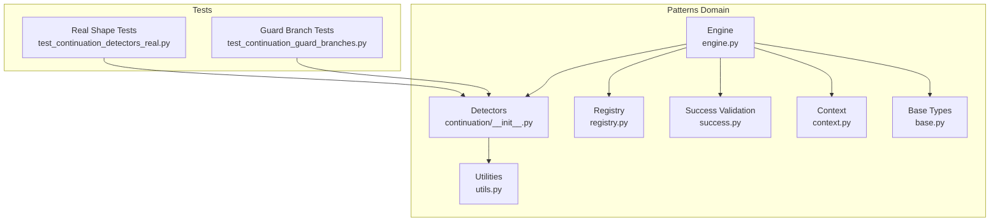

**Diagram sources**
- [__init__.py:1-374](file://src/apps/patterns/domain/detectors/continuation/__init__.py#L1-L374)
- [utils.py:1-157](file://src/apps/patterns/domain/utils.py#L1-L157)
- [engine.py:1-212](file://src/apps/patterns/domain/engine.py#L1-L212)
- [registry.py:1-102](file://src/apps/patterns/domain/registry.py#L1-L102)
- [context.py:1-214](file://src/apps/patterns/domain/context.py#L1-L214)
- [success.py:1-277](file://src/apps/patterns/domain/success.py#L1-L277)
- [base.py:1-35](file://src/apps/patterns/domain/base.py#L1-L35)
- [test_continuation_detectors_real.py:1-186](file://tests/apps/patterns/test_continuation_detectors_real.py#L1-L186)
- [test_continuation_guard_branches.py:1-117](file://tests/apps/patterns/test_continuation_guard_branches.py#L1-L117)

**Section sources**
- [__init__.py:1-374](file://src/apps/patterns/domain/detectors/continuation/__init__.py#L1-L374)
- [engine.py:1-212](file://src/apps/patterns/domain/engine.py#L1-L212)
- [registry.py:1-102](file://src/apps/patterns/domain/registry.py#L1-L102)

## Core Components
- PatternDetector base class defines the interface and shared metadata (category, supported timeframes, enabled flag).
- Continuation detectors implement detect() returning PatternDetection entries when conditions are met.
- Utilities provide helpers for price/volume/window analysis and indicator mapping.
- Engine orchestrates detector selection, execution, success validation, and persistence.
- Registry controls which detectors are active per timeframe.
- Success validation adjusts confidence based on historical pattern performance.
- Context enrichment augments signals with regime, volatility, liquidity, and cycle alignment.

Key detector categories covered:
- Flag (bull/bear)
- Pennant
- Cup and Handle
- Breakout Retest
- Consolidation Breakout
- High Tight Flag
- Channel Breakout/Breakdown (rising/falling)
- Measured Move (bull/bear)
- Base Breakout
- Volatility Contraction Breakout/Down (bull/bear)
- Pullback Continuation (bull/bear)
- Squeeze Breakout
- Trend Pause Breakout
- Handle Breakout
- Stair Step Continuation

**Section sources**
- [base.py:21-35](file://src/apps/patterns/domain/base.py#L21-L35)
- [__init__.py:10-374](file://src/apps/patterns/domain/detectors/continuation/__init__.py#L10-L374)
- [utils.py:18-157](file://src/apps/patterns/domain/utils.py#L18-L157)
- [engine.py:29-72](file://src/apps/patterns/domain/engine.py#L29-L72)
- [registry.py:94-102](file://src/apps/patterns/domain/registry.py#L94-L102)
- [success.py:191-277](file://src/apps/patterns/domain/success.py#L191-L277)
- [context.py:127-187](file://src/apps/patterns/domain/context.py#L127-L187)

## Architecture Overview
The continuation detection pipeline:
- Engine loads active detectors for the given timeframe.
- Detectors compute confidence using price/volume windows and thresholds.
- Success validation scales confidence based on historical success rates.
- Context enrichment applies regime, volatility, liquidity, and cycle adjustments.
- Results are persisted as Signals.

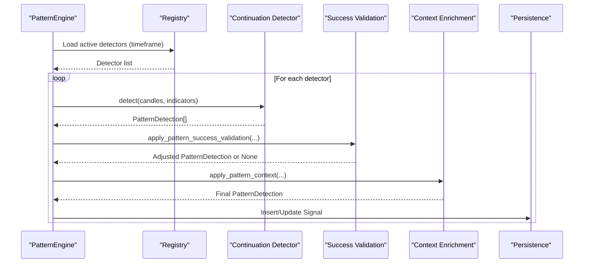

**Diagram sources**
- [engine.py:29-72](file://src/apps/patterns/domain/engine.py#L29-L72)
- [registry.py:94-102](file://src/apps/patterns/domain/registry.py#L94-L102)
- [success.py:191-277](file://src/apps/patterns/domain/success.py#L191-L277)
- [context.py:127-187](file://src/apps/patterns/domain/context.py#L127-L187)

## Detailed Component Analysis

### Flag Pattern Detection
Formation criteria:
- Requires minimum length window and computes pole move and pullback magnitude.
- Bull flag: pole move positive above threshold, pullback negative and bounded, channel slope decreasing; last close below recent highs.
- Bear flag: inverse conditions.
- Confidence increases with pole strength and volume confirmation.

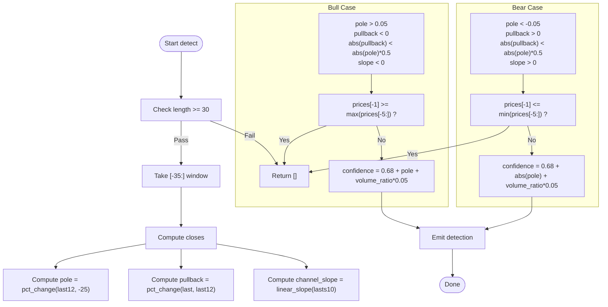

**Diagram sources**
- [__init__.py:30-51](file://src/apps/patterns/domain/detectors/continuation/__init__.py#L30-L51)

**Section sources**
- [__init__.py:30-51](file://src/apps/patterns/domain/detectors/continuation/__init__.py#L30-L51)
- [utils.py:18-115](file://src/apps/patterns/domain/utils.py#L18-L115)
- [test_continuation_guard_branches.py:11-28](file://tests/apps/patterns/test_continuation_guard_branches.py#L11-L28)

### Pennant Pattern Detection
Formation criteria:
- Minimum length and recent consolidation range threshold.
- Trend pole move threshold and converging channel (high slope negative, low slope positive).
- Breakout threshold on recent bars.
- Confidence increases with pole move and volume confirmation.

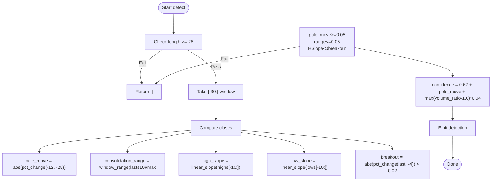

**Diagram sources**
- [__init__.py:57-71](file://src/apps/patterns/domain/detectors/continuation/__init__.py#L57-L71)

**Section sources**
- [__init__.py:57-71](file://src/apps/patterns/domain/detectors/continuation/__init__.py#L57-L71)
- [utils.py:100-115](file://src/apps/patterns/domain/utils.py#L100-L115)
- [test_continuation_guard_branches.py:30-31](file://tests/apps/patterns/test_continuation_guard_branches.py#L30-L31)

### Cup and Handle Pattern Detection
Formation criteria:
- Left/right rims above trough threshold; symmetry constraint.
- Handle low within depth limits.
- Breakout above right rim.
- Confidence increases with cup depth.

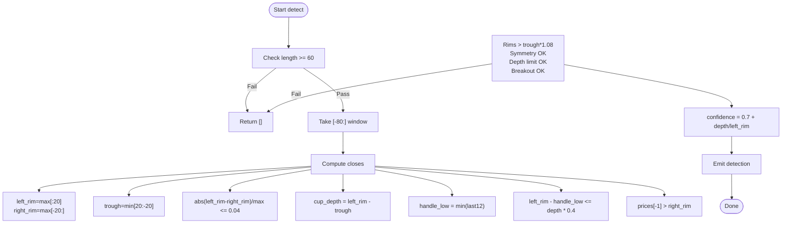

**Diagram sources**
- [__init__.py:77-97](file://src/apps/patterns/domain/detectors/continuation/__init__.py#L77-L97)

**Section sources**
- [__init__.py:77-97](file://src/apps/patterns/domain/detectors/continuation/__init__.py#L77-L97)
- [test_continuation_guard_branches.py:33-48](file://tests/apps/patterns/test_continuation_guard_branches.py#L33-L48)

### Breakout Retest Detection
Validation:
- Defines recent retest boundary near support/resistance.
- Confirms breakout bar beyond retest level.
- Confidence increases with recent volume expansion.

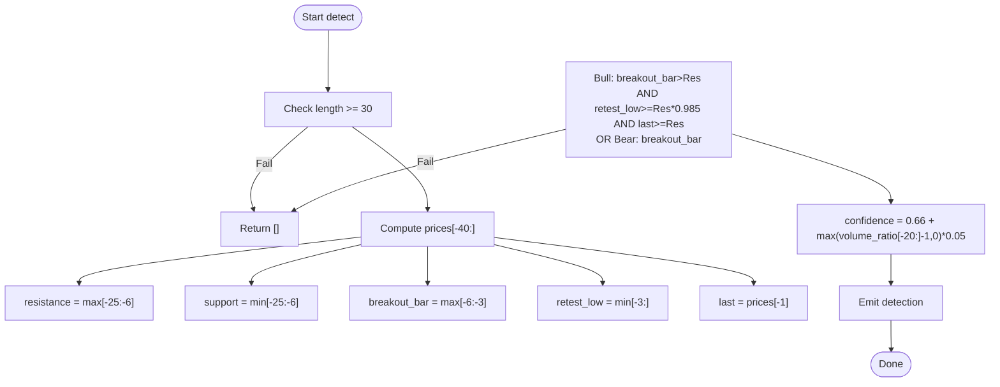

**Diagram sources**
- [__init__.py:103-118](file://src/apps/patterns/domain/detectors/continuation/__init__.py#L103-L118)

**Section sources**
- [__init__.py:103-118](file://src/apps/patterns/domain/detectors/continuation/__init__.py#L103-L118)
- [utils.py:106-115](file://src/apps/patterns/domain/utils.py#L106-L115)

### Consolidation Breakout Detection
Criteria:
- Tight consolidation range threshold.
- Final bar breaks out of the range.
- Confidence increases with volume expansion and recent price change.

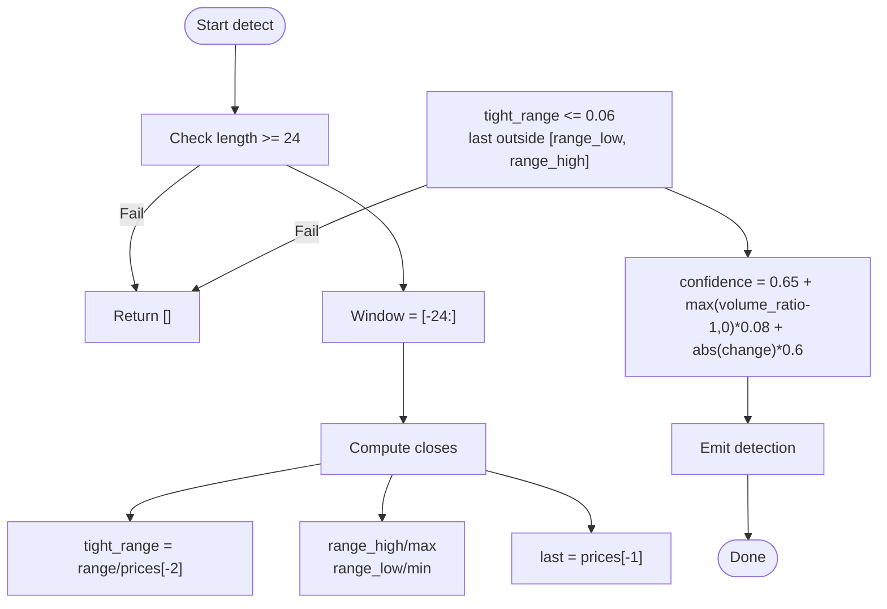

**Diagram sources**
- [__init__.py:124-139](file://src/apps/patterns/domain/detectors/continuation/__init__.py#L124-L139)

**Section sources**
- [__init__.py:124-139](file://src/apps/patterns/domain/detectors/continuation/__init__.py#L124-L139)
- [utils.py:100-115](file://src/apps/patterns/domain/utils.py#L100-L115)

### High Tight Flag Detection
Criteria:
- Minimum pole move and tight consolidation threshold.
- Breakout above recent high.
- Confidence increases with pole move and volume.

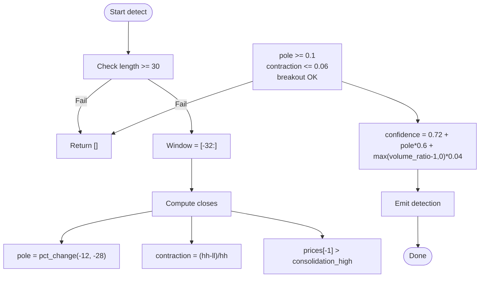

**Diagram sources**
- [__init__.py:145-158](file://src/apps/patterns/domain/detectors/continuation/__init__.py#L145-L158)

**Section sources**
- [__init__.py:145-158](file://src/apps/patterns/domain/detectors/continuation/__init__.py#L145-L158)

### Channel Continuation Detection
Bull case: both highs/lows slopes negative and price above recent high.
Bear case: both slopes positive and price below recent low.
Confidence proportional to slope magnitudes.

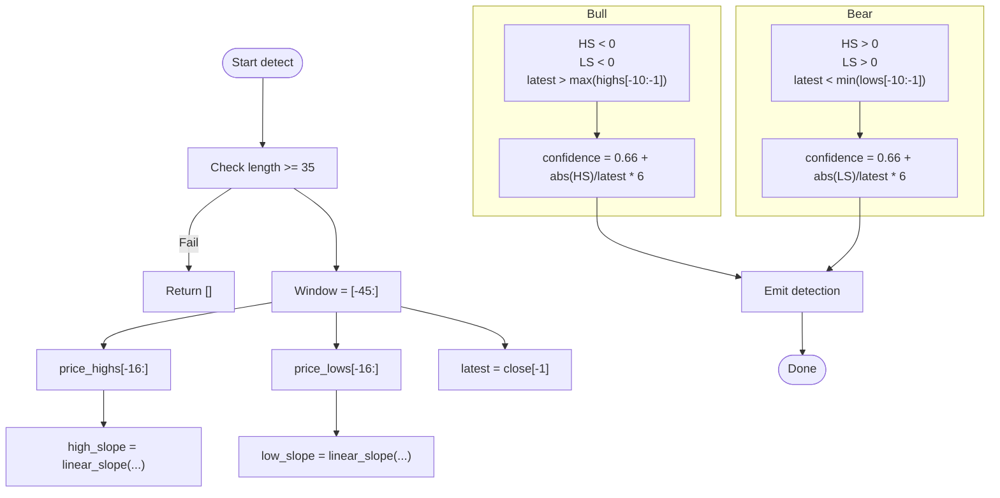

**Diagram sources**
- [__init__.py:166-184](file://src/apps/patterns/domain/detectors/continuation/__init__.py#L166-L184)

**Section sources**
- [__init__.py:166-184](file://src/apps/patterns/domain/detectors/continuation/__init__.py#L166-L184)

### Measured Move Detection
Criteria:
- Leg-one, retracement, leg-two moves with directional thresholds.
- Confidence increases with similarity of leg lengths and volume.

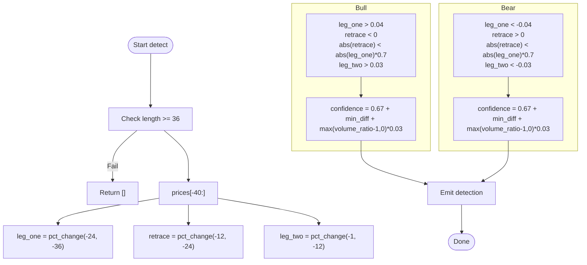

**Diagram sources**
- [__init__.py:192-208](file://src/apps/patterns/domain/detectors/continuation/__init__.py#L192-L208)

**Section sources**
- [__init__.py:192-208](file://src/apps/patterns/domain/detectors/continuation/__init__.py#L192-L208)

### Base Breakout Detection
Criteria:
- Early advance threshold over recent segment.
- Base range narrow and breakout above recent high.
- Confidence increases with advance and volume.

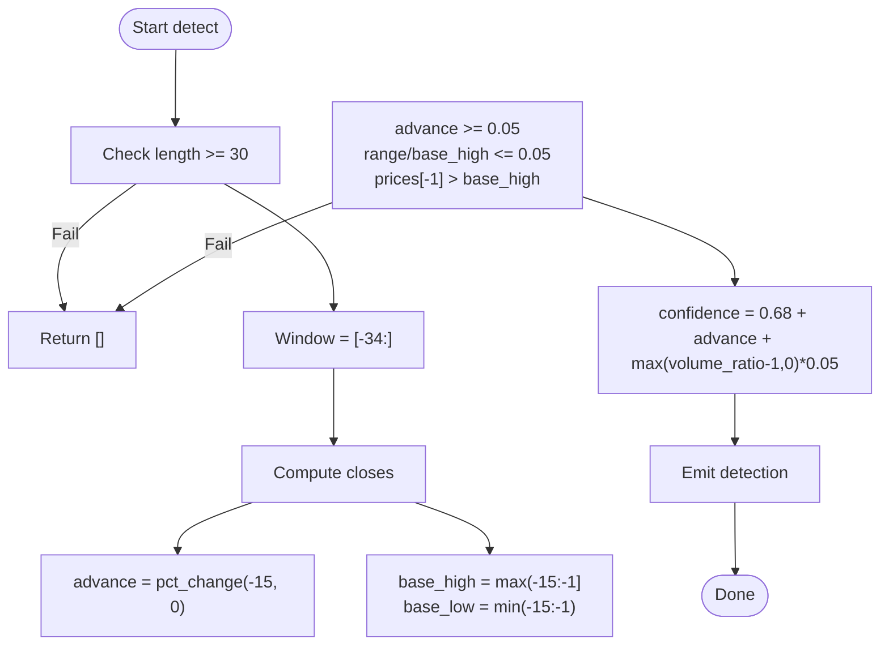

**Diagram sources**
- [__init__.py:214-228](file://src/apps/patterns/domain/detectors/continuation/__init__.py#L214-L228)

**Section sources**
- [__init__.py:214-228](file://src/apps/patterns/domain/detectors/continuation/__init__.py#L214-L228)

### Volatility Contraction Breakout/Down Detection
Criteria:
- Early vs late range comparison with contraction threshold.
- Breakout above recent high (bull) or below recent low (bear).
- Confidence increases with contraction magnitude.

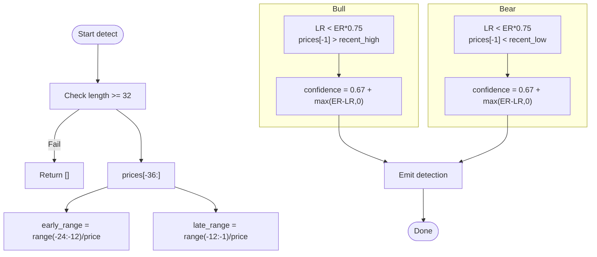

**Diagram sources**
- [__init__.py:236-255](file://src/apps/patterns/domain/detectors/continuation/__init__.py#L236-L255)

**Section sources**
- [__init__.py:236-255](file://src/apps/patterns/domain/detectors/continuation/__init__.py#L236-L255)

### Pullback Continuation Detection
Criteria:
- Trend leg, retracement, and resumption moves with directional thresholds.
- Confidence increases with leg and resumption strengths.

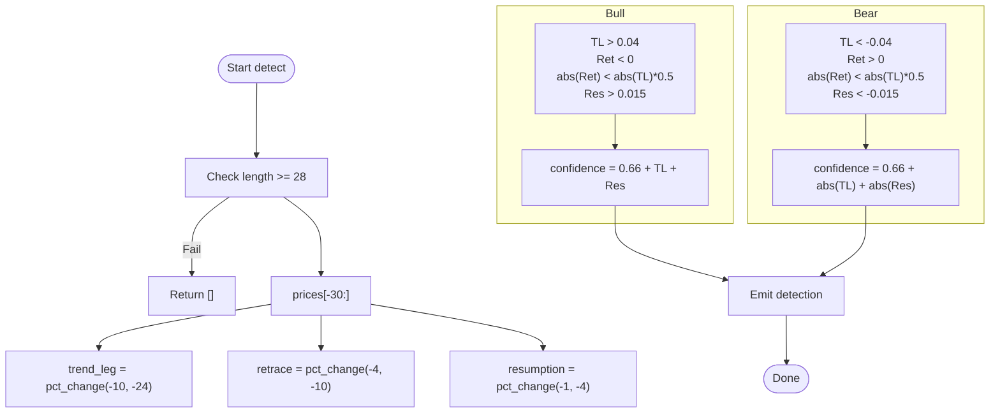

**Diagram sources**
- [__init__.py:263-279](file://src/apps/patterns/domain/detectors/continuation/__init__.py#L263-L279)

**Section sources**
- [__init__.py:263-279](file://src/apps/patterns/domain/detectors/continuation/__init__.py#L263-L279)

### Squeeze Breakout Detection
Criteria:
- Pre-breakout range threshold.
- Breakout above recent high.
- Confidence increases with volume.

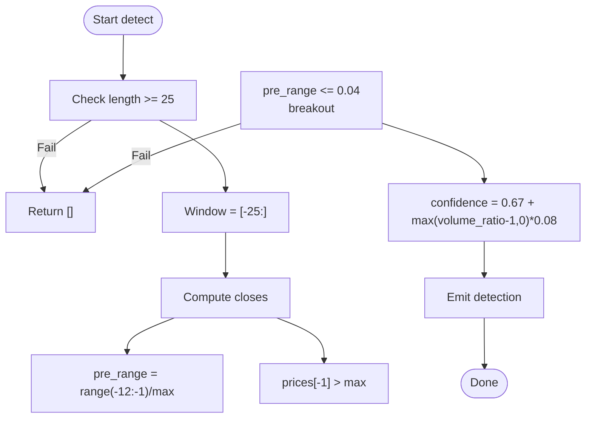

**Diagram sources**
- [__init__.py:285-297](file://src/apps/patterns/domain/detectors/continuation/__init__.py#L285-L297)

**Section sources**
- [__init__.py:285-297](file://src/apps/patterns/domain/detectors/continuation/__init__.py#L285-L297)

### Trend Pause Breakout Detection
Criteria:
- Early advance threshold and small pause range.
- Breakout above recent high.
- Confidence increases with advance.

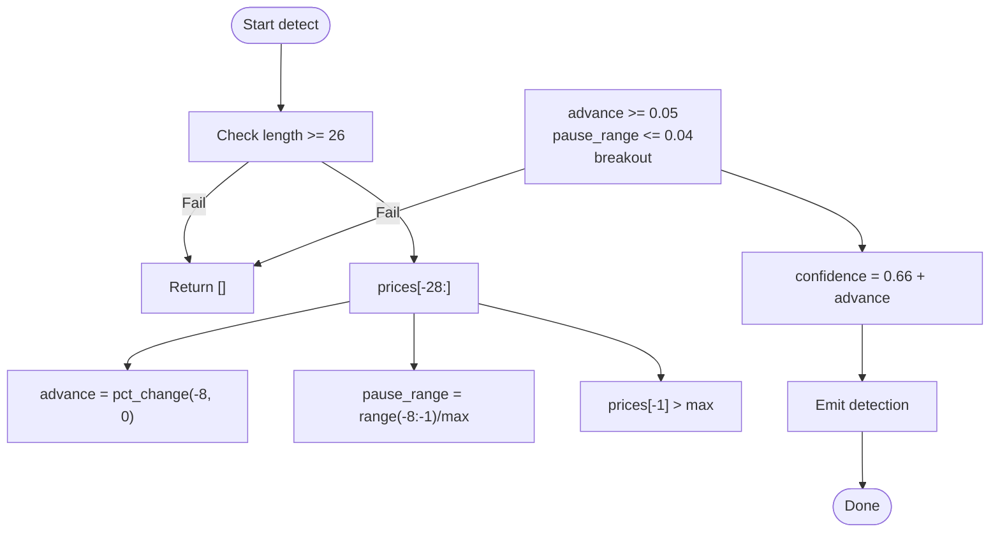

**Diagram sources**
- [__init__.py:303-313](file://src/apps/patterns/domain/detectors/continuation/__init__.py#L303-L313)

**Section sources**
- [__init__.py:303-313](file://src/apps/patterns/domain/detectors/continuation/__init__.py#L303-L313)

### Handle Breakout Detection
Criteria:
- Cup high and handle low relationship.
- Breakout above cup high.
- Confidence increases with volume.

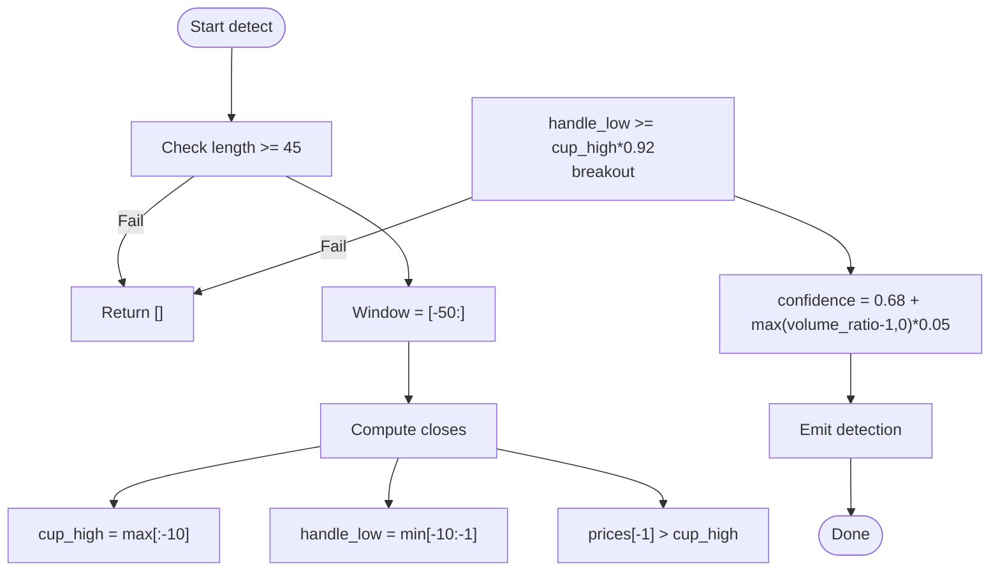

**Diagram sources**
- [__init__.py:319-332](file://src/apps/patterns/domain/detectors/continuation/__init__.py#L319-L332)

**Section sources**
- [__init__.py:319-332](file://src/apps/patterns/domain/detectors/continuation/__init__.py#L319-L332)

### Stair Step Continuation Detection
Criteria:
- Stepped higher highs/lower lows with pullback support.
- Final close above recent high.
- Confidence increases with volume.

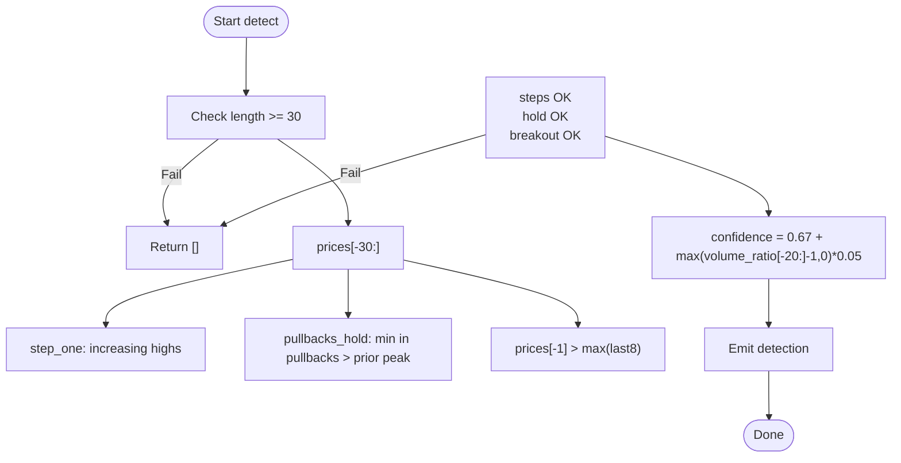

**Diagram sources**
- [__init__.py:338-348](file://src/apps/patterns/domain/detectors/continuation/__init__.py#L338-L348)

**Section sources**
- [__init__.py:338-348](file://src/apps/patterns/domain/detectors/continuation/__init__.py#L338-L348)

## Dependency Analysis
- Detectors depend on shared utilities for price/volume analysis and windowing.
- Engine composes detectors, success validation, and context enrichment.
- Registry filters detectors by lifecycle and enabled state, and by supported timeframes.
- Success validation reads historical statistics and adjusts confidence.
- Context enrichment pulls regime, sector, and cycle signals to compute alignment factors.

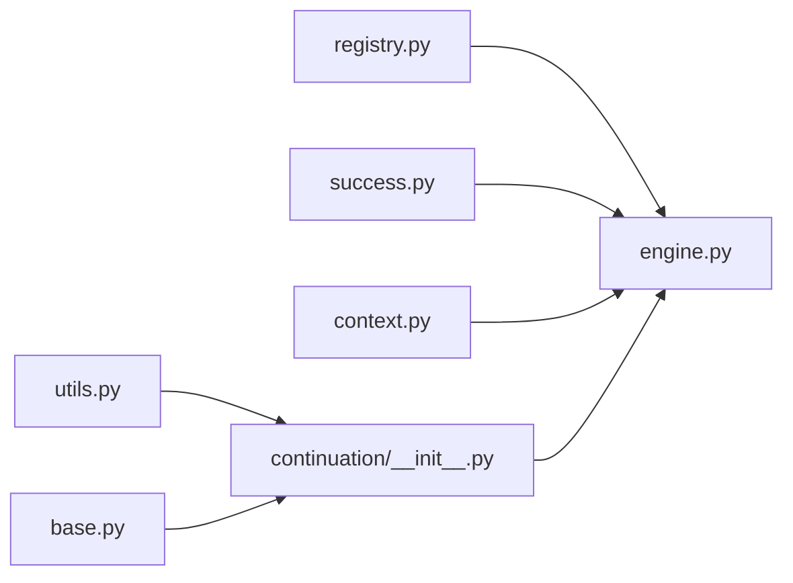

**Diagram sources**
- [__init__.py:1-374](file://src/apps/patterns/domain/detectors/continuation/__init__.py#L1-L374)
- [utils.py:1-157](file://src/apps/patterns/domain/utils.py#L1-L157)
- [base.py:1-35](file://src/apps/patterns/domain/base.py#L1-L35)
- [registry.py:94-102](file://src/apps/patterns/domain/registry.py#L94-L102)
- [success.py:191-277](file://src/apps/patterns/domain/success.py#L191-L277)
- [context.py:127-187](file://src/apps/patterns/domain/context.py#L127-L187)
- [engine.py:29-72](file://src/apps/patterns/domain/engine.py#L29-L72)

**Section sources**
- [engine.py:29-72](file://src/apps/patterns/domain/engine.py#L29-L72)
- [registry.py:94-102](file://src/apps/patterns/domain/registry.py#L94-L102)
- [success.py:191-277](file://src/apps/patterns/domain/success.py#L191-L277)
- [context.py:127-187](file://src/apps/patterns/domain/context.py#L127-L187)

## Performance Considerations
- CPU cost estimates are embedded in the catalog; continuation detectors are generally rated moderate to low CPU cost.
- Window sizes vary by detector but are kept reasonable to balance accuracy and speed.
- Volume ratio computation uses a fixed lookback window; tune lookback length via utility if needed.
- Success validation and context enrichment add minimal overhead and are cached per timeframe.

[No sources needed since this section provides general guidance]

## Troubleshooting Guide
Common issues and mitigations:
- Insufficient candles: Many detectors require a minimum number of bars; ensure sufficient history before detection.
- Guard branches failing: Detectors explicitly reject non-conforming shapes; adjust expectations or timeframes.
- No breakout confirmation: Some detectors require breakout beyond retest levels or consolidation boundaries.
- Volume confirmation: Several detectors incorporate volume_ratio; ensure volume data is present and representative.
- Timeframe mismatch: Detectors declare supported timeframes; verify engine uses compatible intervals.
- Success suppression: If historical success rates fall below thresholds, detections may be suppressed or down-weighted.

Evidence from tests:
- Short inputs return empty detections.
- Guard branch tests demonstrate explicit rejections for invalid configurations.
- Real shape tests confirm positive detection for constructed patterns.

**Section sources**
- [test_continuation_detectors_real.py:26-29](file://tests/apps/patterns/test_continuation_detectors_real.py#L26-L29)
- [test_continuation_guard_branches.py:11-117](file://tests/apps/patterns/test_continuation_guard_branches.py#L11-L117)

## Conclusion
The continuation pattern detectors implement robust, threshold-based recognition routines grounded in price dynamics and volume confirmation. They integrate cleanly with the broader pattern evaluation system through the engine, success validation, and context enrichment layers. Configuration is primarily via detector parameters and supported timeframes, while false positives are minimized through guard branches and strict breakout criteria. Historical success rates further refine confidence to improve signal quality.