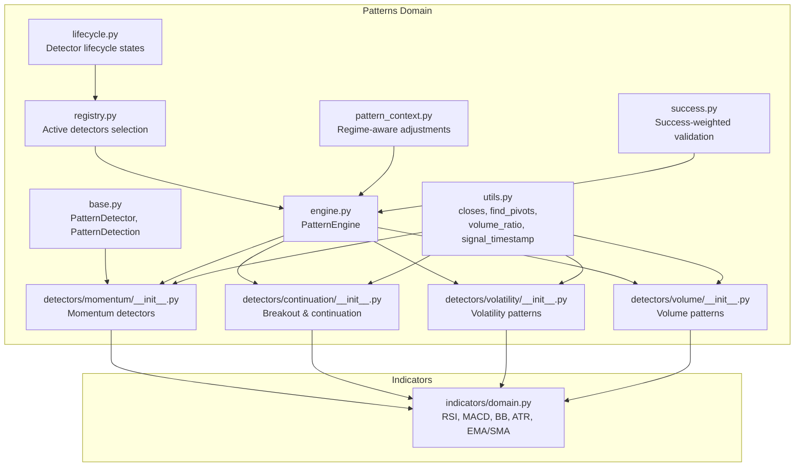
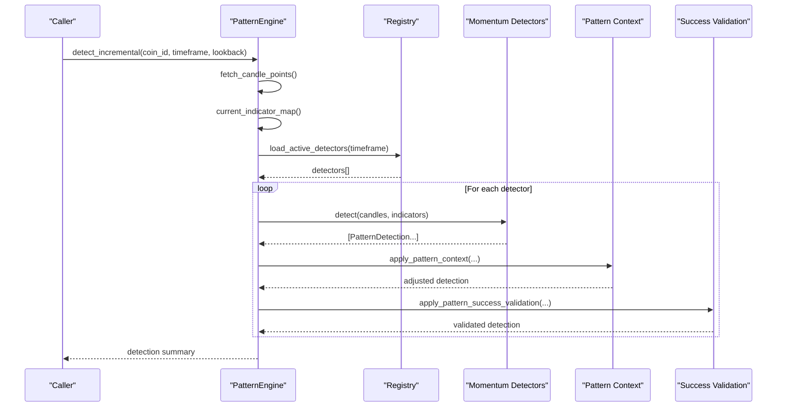
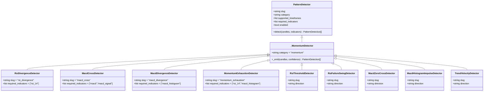
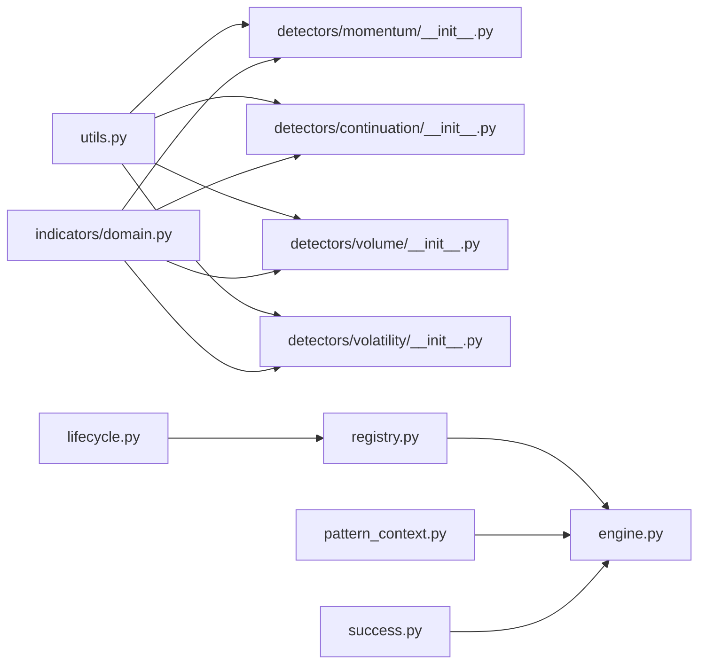

# Momentum Patterns

<cite>
**Referenced Files in This Document**
- [__init__.py](file://src/apps/patterns/domain/detectors/momentum/__init__.py)
- [base.py](file://src/apps/patterns/domain/base.py)
- [engine.py](file://src/apps/patterns/domain/engine.py)
- [utils.py](file://src/apps/patterns/domain/utils.py)
- [domain.py](file://src/apps/indicators/domain.py)
- [registry.py](file://src/apps/patterns/domain/registry.py)
- [test_momentum_detectors.py](file://tests/apps/patterns/test_momentum_detectors.py)
- [continuation/__init__.py](file://src/apps/patterns/domain/detectors/continuation/__init__.py)
- [volatility/__init__.py](file://src/apps/patterns/domain/detectors/volatility/__init__.py)
- [volume/__init__.py](file://src/apps/patterns/domain/detectors/volume/__init__.py)
- [pattern_context.py](file://src/apps/patterns/domain/pattern_context.py)
- [success.py](file://src/apps/patterns/domain/success.py)
- [lifecycle.py](file://src/apps/patterns/domain/lifecycle.py)
</cite>

## Table of Contents
1. [Introduction](#introduction)
2. [Project Structure](#project-structure)
3. [Core Components](#core-components)
4. [Architecture Overview](#architecture-overview)
5. [Detailed Component Analysis](#detailed-component-analysis)
6. [Dependency Analysis](#dependency-analysis)
7. [Performance Considerations](#performance-considerations)
8. [Troubleshooting Guide](#troubleshooting-guide)
9. [Conclusion](#conclusion)

## Introduction
This document describes the momentum pattern detection subsystem. It focuses on the detection of momentum-driven price actions, including divergence, exhaustion, threshold breaches, and impulse behaviors. It also documents how momentum detectors integrate with technical indicators, price action confirmation, and volume analysis. The document outlines detection logic, thresholds, confidence computation, performance characteristics, parameter optimization strategies, and correlation with technical indicators.

## Project Structure
The momentum pattern detectors are part of a modular pattern detection framework. They share a common base class and detection engine, and rely on shared utilities and indicator computations.

**Diagram sources**
- [base.py:21-34](file://src/apps/patterns/domain/base.py#L21-L34)
- [engine.py:29-72](file://src/apps/patterns/domain/engine.py#L29-L72)
- [utils.py:117-156](file://src/apps/patterns/domain/utils.py#L117-L156)
- [__init__.py:11-281](file://src/apps/patterns/domain/detectors/momentum/__init__.py#L11-L281)
- [continuation/__init__.py:10-374](file://src/apps/patterns/domain/detectors/continuation/__init__.py#L10-L374)
- [volatility/__init__.py:11-267](file://src/apps/patterns/domain/detectors/volatility/__init__.py#L11-L267)
- [volume/__init__.py:10-266](file://src/apps/patterns/domain/detectors/volume/__init__.py#L10-L266)
- [registry.py:94-101](file://src/apps/patterns/domain/registry.py#L94-L101)
- [pattern_context.py:153-179](file://src/apps/patterns/domain/pattern_context.py#L153-L179)
- [success.py:225-254](file://src/apps/patterns/domain/success.py#L225-L254)
- [lifecycle.py:6-26](file://src/apps/patterns/domain/lifecycle.py#L6-L26)
- [domain.py:38-100](file://src/apps/indicators/domain.py#L38-L100)

**Section sources**
- [base.py:21-34](file://src/apps/patterns/domain/base.py#L21-L34)
- [engine.py:29-72](file://src/apps/patterns/domain/engine.py#L29-L72)
- [utils.py:117-156](file://src/apps/patterns/domain/utils.py#L117-L156)
- [__init__.py:11-281](file://src/apps/patterns/domain/detectors/momentum/__init__.py#L11-L281)
- [registry.py:94-101](file://src/apps/patterns/domain/registry.py#L94-L101)

## Core Components
- PatternDetector and PatternDetection define the interface and output structure for all detectors.
- PatternEngine orchestrates detector execution, applies context and success validation, and persists results.
- Momentum detectors implement specific momentum logic and require indicator series computed upstream.
- Shared utilities provide indicator maps, pivot detection, and volume analysis helpers.
- Indicator domain supplies RSI, MACD, Bollinger Bands, ATR, and moving averages.

Key responsibilities:
- Momentum detectors: divergence, exhaustion, threshold breaches, zero-cross, histogram expansion, trend velocity.
- Continuation detectors: provide breakout and continuation confirmations often used alongside momentum signals.
- Volume detectors: confirm breakouts and exhaustion via volume spikes and climaxes.
- Volatility detectors: capture volatility compression/expansion that often precede momentum moves.

**Section sources**
- [base.py:21-34](file://src/apps/patterns/domain/base.py#L21-L34)
- [engine.py:29-72](file://src/apps/patterns/domain/engine.py#L29-L72)
- [utils.py:117-156](file://src/apps/patterns/domain/utils.py#L117-L156)
- [domain.py:38-100](file://src/apps/indicators/domain.py#L38-L100)

## Architecture Overview
The momentum detection pipeline:
1. Fetch candles and compute current indicator map.
2. Load active detectors filtered by timeframe and lifecycle.
3. Run each detector’s detect method against the candle window.
4. Emit PatternDetection with category “momentum”.
5. Apply pattern context (regime alignment) and success validation (historical performance).
6. Persist results to Signals.

**Diagram sources**
- [engine.py:114-148](file://src/apps/patterns/domain/engine.py#L114-L148)
- [registry.py:94-101](file://src/apps/patterns/domain/registry.py#L94-L101)
- [pattern_context.py:153-179](file://src/apps/patterns/domain/pattern_context.py#L153-L179)
- [success.py:225-254](file://src/apps/patterns/domain/success.py#L225-L254)

## Detailed Component Analysis

### Momentum Detectors Overview
Momentum detectors implement detection logic that combines price action, indicator series, and volume. They inherit a common base and emit detections with category “momentum”.

**Diagram sources**
- [base.py:21-34](file://src/apps/patterns/domain/base.py#L21-L34)
- [__init__.py:11-281](file://src/apps/patterns/domain/detectors/momentum/__init__.py#L11-L281)

**Section sources**
- [__init__.py:11-281](file://src/apps/patterns/domain/detectors/momentum/__init__.py#L11-L281)

### Divergence Detectors
- RSI Divergence Detector:
  - Requires RSI(14).
  - Detects higher-low RSI with lower-high price (bullish) or lower-high RSI with higher-low price (bearish).
  - Confirms price action direction near the rightmost pivot.
  - Confidence increases with divergence magnitude.
- MACD Divergence Detector:
  - Requires MACD histogram.
  - Identical logic to RSI divergence but on histogram values.

Validation thresholds and parameters:
- Window sizes: typically last 80 bars for pivots and series.
- Pivot detection: span-based local extrema finder.
- Confirmation: price action must align with the divergence’s direction at the rightmost pivot.

**Section sources**
- [__init__.py:26-64](file://src/apps/patterns/domain/detectors/momentum/__init__.py#L26-L64)
- [__init__.py:90-114](file://src/apps/patterns/domain/detectors/momentum/__init__.py#L90-L114)
- [utils.py:73-90](file://src/apps/patterns/domain/utils.py#L73-L90)
- [domain.py:38-68](file://src/apps/indicators/domain.py#L38-L68)
- [test_momentum_detectors.py:38-74](file://tests/apps/patterns/test_momentum_detectors.py#L38-L74)

### Exhaustion Detectors
- Momentum Exhaustion Detector:
  - Requires RSI(14) and MACD histogram.
  - Bullish exhaustion: RSI above overbought threshold and current histogram below recent peak.
  - Bearish exhaustion: RSI below oversold threshold and current histogram above recent trough.
  - Volume confirmation: adds a small boost when volume ratio exceeds baseline.

Technical specifications:
- RSI thresholds: overbought (> 75), oversold (< 25).
- Histogram comparison: compares current histogram to recent local extremes.
- Volume ratio window: typically last 20 bars.

**Section sources**
- [__init__.py:117-137](file://src/apps/patterns/domain/detectors/momentum/__init__.py#L117-L137)
- [domain.py:71-100](file://src/apps/indicators/domain.py#L71-L100)
- [test_momentum_detectors.py:99-121](file://tests/apps/patterns/test_momentum_detectors.py#L99-L121)

### Threshold and Impulse Detectors
- RSI Threshold Detector:
  - Bullish reclaim: RSI crosses below 50 (from below) with recent strengthening.
  - Bearish rejection: RSI crosses above 50 (from above) with recent weakening.
- RSI Failure Swing Detector:
  - Bullish failure swing: RSI fails at low region while price makes higher lows.
  - Bearish failure swing: RSI fails at high region while price makes lower highs.
- MACD Zero Cross Detector:
  - Bullish/bearish zero cross with directional confirmation.
- MACD Histogram Expansion Detector:
  - Bullish/bearish expansion beyond recent maximum/minimum.
- Trend Velocity Detector:
  - Compares early vs. late move strength to detect acceleration/deceleration.

Parameters and thresholds:
- RSI windows: 14-period series.
- MACD series: fast=12, slow=26, signal=9.
- Trend velocity: compare early and late returns over defined windows.

**Section sources**
- [__init__.py:140-262](file://src/apps/patterns/domain/detectors/momentum/__init__.py#L140-L262)
- [domain.py:71-100](file://src/apps/indicators/domain.py#L71-L100)
- [test_momentum_detectors.py:123-174](file://tests/apps/patterns/test_momentum_detectors.py#L123-L174)

### Price Action and Volume Confirmations
- Volume ratio helper computes current volume vs. recent average to adjust confidence.
- Many momentum detectors incorporate volume_ratio to increase robustness.

Integration points:
- MomentumExhaustionDetector uses volume_ratio to add confidence.
- Continuation breakout detectors (for context) also use volume_ratio.
- Volume detectors provide complementary confirmation (climax, dry-up, breakout confirmation).

**Section sources**
- [utils.py:106-114](file://src/apps/patterns/domain/utils.py#L106-L114)
- [__init__.py:133-136](file://src/apps/patterns/domain/detectors/momentum/__init__.py#L133-L136)
- [continuation/__init__.py:100-118](file://src/apps/patterns/domain/detectors/continuation/__init__.py#L100-L118)
- [volume/__init__.py:28-50](file://src/apps/patterns/domain/detectors/volume/__init__.py#L28-L50)

### Breakout and Reversal Context
While primarily continuation-focused, momentum detectors complement breakout and reversal signals:
- Breakout Retest Detector validates retest near prior levels with volume confirmation.
- Base Breakout Detector checks minimal advance and lack of wide base range.
- Volatility detectors (e.g., squeeze, expansion) often precede momentum moves.
- Volume climax detectors flag exhaustion-like moves.

These components help contextualize momentum signals and reduce false positives.

**Section sources**
- [continuation/__init__.py:100-118](file://src/apps/patterns/domain/detectors/continuation/__init__.py#L100-L118)
- [continuation/__init__.py:211-228](file://src/apps/patterns/domain/detectors/continuation/__init__.py#L211-L228)
- [volatility/__init__.py:26-46](file://src/apps/patterns/domain/detectors/volatility/__init__.py#L26-L46)
- [volume/__init__.py:36-50](file://src/apps/patterns/domain/detectors/volume/__init__.py#L36-L50)

## Dependency Analysis
- Indicators:
  - RSI, MACD, BB, ATR, EMA/SMA are computed via shared indicator routines and passed to detectors.
- Utilities:
  - Pivot detection, percent change, volume ratio, and timestamp inference unify logic across detectors.
- Registry and lifecycle:
  - Active detectors are filtered by timeframe and lifecycle state.
- Context and success validation:
  - Regime-aware adjustments and historical success rates refine confidence.

**Diagram sources**
- [utils.py:117-156](file://src/apps/patterns/domain/utils.py#L117-L156)
- [domain.py:38-100](file://src/apps/indicators/domain.py#L38-L100)
- [registry.py:94-101](file://src/apps/patterns/domain/registry.py#L94-L101)
- [lifecycle.py:6-26](file://src/apps/patterns/domain/lifecycle.py#L6-L26)
- [pattern_context.py:153-179](file://src/apps/patterns/domain/pattern_context.py#L153-L179)
- [success.py:225-254](file://src/apps/patterns/domain/success.py#L225-L254)

**Section sources**
- [utils.py:117-156](file://src/apps/patterns/domain/utils.py#L117-L156)
- [domain.py:38-100](file://src/apps/indicators/domain.py#L38-L100)
- [registry.py:94-101](file://src/apps/patterns/domain/registry.py#L94-L101)
- [lifecycle.py:6-26](file://src/apps/patterns/domain/lifecycle.py#L6-L26)
- [pattern_context.py:153-179](file://src/apps/patterns/domain/pattern_context.py#L153-L179)
- [success.py:225-254](file://src/apps/patterns/domain/success.py#L225-L254)

## Performance Considerations
- CPU cost:
  - Detectors are categorized with CPU cost weights; momentum detectors are weighted moderately.
- Lookback windows:
  - Detectors specify minimum lookback lengths; ensure sufficient bars to avoid empty detections.
- Indicator computation:
  - RSI and MACD series are O(n); keep windows bounded to limit overhead.
- Volume ratio:
  - Rolling average per bar; keep lookback windows reasonable to maintain speed.
- Persistence:
  - PatternEngine inserts detections in bulk with conflict updates to minimize DB writes.

Optimization tips:
- Tune lookback windows to balance sensitivity and noise.
- Prefer shorter series for early-stage signals; widen windows for higher confidence.
- Cache indicator maps when scanning multiple detectors on the same window.

[No sources needed since this section provides general guidance]

## Troubleshooting Guide
Common issues and resolutions:
- Insufficient data:
  - Detectors return empty when candle count is below internal thresholds.
- Missing required indicators:
  - Detectors declare required indicators; ensure indicator map includes them.
- Null values:
  - Series with None values are handled by guards; missing values can suppress detections.
- Lifecycle disabled:
  - Disabled or cooldown detectors are excluded from active sets.
- Context degradation:
  - Regime mismatch can reduce confidence; verify regime alignment.

Diagnostic steps:
- Verify candle count and timestamps.
- Confirm indicator map keys match required_indicators.
- Check lifecycle state and enabled flags.
- Review pattern context and success validation adjustments.

**Section sources**
- [engine.py:126-128](file://src/apps/patterns/domain/engine.py#L126-L128)
- [__init__.py:25-26](file://src/apps/patterns/domain/base.py#L25-L26)
- [registry.py:94-101](file://src/apps/patterns/domain/registry.py#L94-L101)
- [lifecycle.py:13-14](file://src/apps/patterns/domain/lifecycle.py#L13-L14)
- [pattern_context.py:166-167](file://src/apps/patterns/domain/pattern_context.py#L166-L167)

## Conclusion
The momentum pattern detection subsystem integrates price action, indicator series, and volume to identify divergence, exhaustion, threshold breaches, and impulse moves. Detectors are modular, configurable, and validated through regime-aware context and historical success statistics. By tuning lookback windows, leveraging volume confirmation, and aligning with volatility and continuation contexts, practitioners can optimize detection quality and performance.