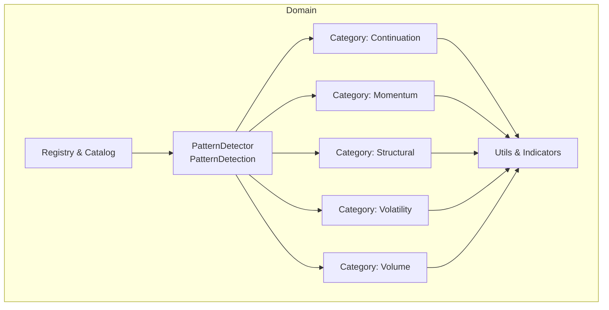
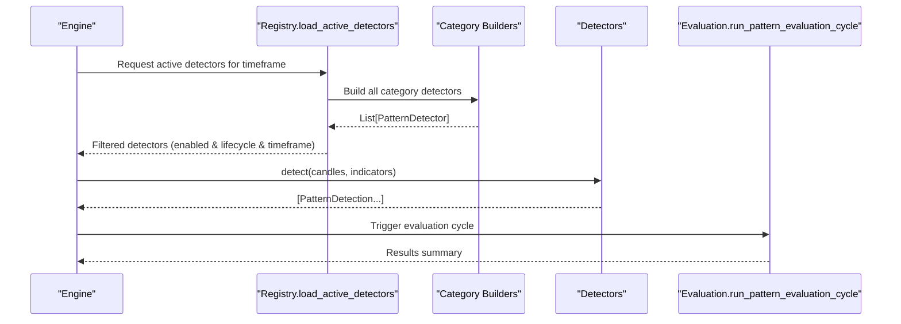
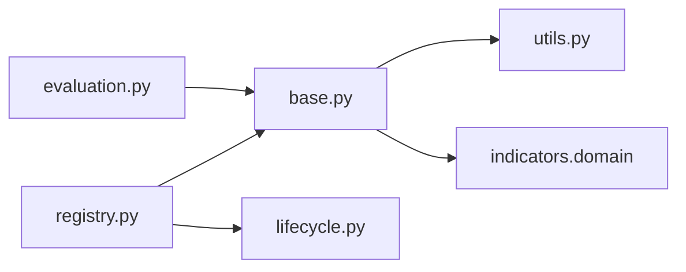

# Pattern Detectors

<cite>
**Referenced Files in This Document**
- [base.py](file://src/apps/patterns/domain/base.py)
- [detectors/__init__.py](file://src/apps/patterns/domain/detectors/__init__.py)
- [continuation/__init__.py](file://src/apps/patterns/domain/detectors/continuation/__init__.py)
- [momentum/__init__.py](file://src/apps/patterns/domain/detectors/momentum/__init__.py)
- [structural/__init__.py](file://src/apps/patterns/domain/detectors/structural/__init__.py)
- [volatility/__init__.py](file://src/apps/patterns/domain/detectors/volatility/__init__.py)
- [volume/__init__.py](file://src/apps/patterns/domain/detectors/volume/__init__.py)
- [registry.py](file://src/apps/patterns/domain/registry.py)
- [utils.py](file://src/apps/patterns/domain/utils.py)
- [models.py](file://src/apps/patterns/models.py)
- [evaluation.py](file://src/apps/patterns/domain/evaluation.py)
- [services.py](file://src/apps/patterns/services.py)
- [lifecycle.py](file://src/apps/patterns/domain/lifecycle.py)
</cite>

## Table of Contents
1. [Introduction](#introduction)
2. [Project Structure](#project-structure)
3. [Core Components](#core-components)
4. [Architecture Overview](#architecture-overview)
5. [Detailed Component Analysis](#detailed-component-analysis)
6. [Dependency Analysis](#dependency-analysis)
7. [Performance Considerations](#performance-considerations)
8. [Troubleshooting Guide](#troubleshooting-guide)
9. [Conclusion](#conclusion)

## Introduction
This document describes the pattern detector subsystem responsible for detecting recurring price action and market structure patterns across multiple categories. It covers detector algorithms, detection criteria, false positive prevention, pattern confirmation methods, technical specifications, parameter thresholds, performance characteristics, registration, configuration, and integration with the pattern evaluation system.

## Project Structure
The pattern detection domain is organized by category under a shared base detector interface. Each category exposes a builder that instantiates concrete detectors. A central registry loads and filters active detectors per timeframe and lifecycle state. Evaluation services integrate detections into the broader pattern intelligence pipeline.

**Diagram sources**
- [base.py:21-34](file://src/apps/patterns/domain/base.py#L21-L34)
- [detectors/__init__.py:8-15](file://src/apps/patterns/domain/detectors/__init__.py#L8-L15)
- [registry.py:58-101](file://src/apps/patterns/domain/registry.py#L58-L101)

**Section sources**
- [base.py:21-34](file://src/apps/patterns/domain/base.py#L21-L34)
- [detectors/__init__.py:8-15](file://src/apps/patterns/domain/detectors/__init__.py#L8-L15)
- [registry.py:58-101](file://src/apps/patterns/domain/registry.py#L58-L101)

## Core Components
- PatternDetector: Abstract base with shared fields and detect method signature.
- PatternDetection: Immutable DTO carrying detection metadata and attributes.
- Category builders: Factory functions returning lists of detectors for each category.
- Registry: Loads catalog entries, synchronizes metadata, filters active detectors by lifecycle and timeframe.
- Utilities: Shared helpers for pivots, slopes, ratios, indicator extraction, and timestamp inference.
- Evaluation: Orchestration of downstream systems after detection.

Key responsibilities:
- Detection: Each detector evaluates a sliding window of candles and optional indicators.
- Confidence: Computed from validated criteria and optionally adjusted by volume ratio.
- Emission: Returns zero or one PatternDetection per call.
- Lifecycle: Active detectors are filtered by enabled flag and lifecycle state.

**Section sources**
- [base.py:11-34](file://src/apps/patterns/domain/base.py#L11-L34)
- [registry.py:58-101](file://src/apps/patterns/domain/registry.py#L58-L101)
- [utils.py:18-157](file://src/apps/patterns/domain/utils.py#L18-L157)
- [evaluation.py:12-26](file://src/apps/patterns/domain/evaluation.py#L12-L26)

## Architecture Overview
The detector system composes category-specific detectors behind a unified interface. Detectors rely on shared utilities and optional indicator series. The registry determines which detectors run for a given timeframe and lifecycle state. Detected patterns propagate into evaluation and statistics.

**Diagram sources**
- [registry.py:94-101](file://src/apps/patterns/domain/registry.py#L94-L101)
- [detectors/__init__.py:8-15](file://src/apps/patterns/domain/detectors/__init__.py#L8-L15)
- [evaluation.py:12-26](file://src/apps/patterns/domain/evaluation.py#L12-L26)

## Detailed Component Analysis

### Base Detector Interface
- Purpose: Define the contract for all pattern detectors.
- Fields:
  - slug: Unique identifier for the detector.
  - category: Detector category (e.g., continuation, momentum).
  - supported_timeframes: Allowed timeframes for detection.
  - required_indicators: Optional indicator slugs required by some detectors.
  - enabled: Whether the detector is enabled by default.
- Methods:
  - detect(candles, indicators) -> list[PatternDetection]: Implements detection logic.

Confidence clamping and emission:
- Detectors emit a single PatternDetection with category and computed confidence.
- Confidence values are clamped to a minimum and maximum per category via shared utilities.

**Section sources**
- [base.py:21-34](file://src/apps/patterns/domain/base.py#L21-L34)
- [utils.py:18-25](file://src/apps/patterns/domain/utils.py#L18-L25)

### Continuation Patterns
Detector family: continuation
Supported detectors:
- Bull flag, bear flag
- Pennant
- Cup and handle
- Breakout retest
- Consolidation breakout
- High-tight flag
- Rising/falling channel breakout
- Measured move (bull/bear)
- Base breakout
- Volatility contraction breakout (bull/bear)
- Pullback continuation (bull/bear)
- Squeeze breakout
- Trend pause breakout
- Handle breakout
- Stair-step continuation

Detection criteria highlights:
- Window sizing and slicing to ensure sufficient history.
- Percent change thresholds for pole moves and retracements.
- Slope checks for channels/troughs/shoulders.
- Volume confirmation via volume_ratio.
- Tight consolidation thresholds for pennants and flags.

False positive prevention:
- Tolerance checks for symmetry and alignment.
- Minimum slope and range thresholds.
- Price action confirmation against channel edges.

Pattern confirmation methods:
- Volume spikes via volume_ratio.
- Retest and breakout validations.
- Contraction/expansion thresholds.

Technical specifications and thresholds:
- Typical windows: 24–80 candles depending on pattern.
- Percent thresholds: 0.02–0.10 for moves and retracements.
- Range thresholds: 0.04–0.08 for consolidations.
- Volume ratio thresholds: ≥1.3–2.5 for confirmations.

Performance characteristics:
- CPU cost per detector is cataloged; most continuation detectors are rated moderate.

**Section sources**
- [continuation/__init__.py:30-51](file://src/apps/patterns/domain/detectors/continuation/__init__.py#L30-L51)
- [continuation/__init__.py:57-71](file://src/apps/patterns/domain/detectors/continuation/__init__.py#L57-L71)
- [continuation/__init__.py:77-97](file://src/apps/patterns/domain/detectors/continuation/__init__.py#L77-L97)
- [continuation/__init__.py:103-118](file://src/apps/patterns/domain/detectors/continuation/__init__.py#L103-L118)
- [continuation/__init__.py:124-139](file://src/apps/patterns/domain/detectors/continuation/__init__.py#L124-L139)
- [continuation/__init__.py:145-158](file://src/apps/patterns/domain/detectors/continuation/__init__.py#L145-L158)
- [continuation/__init__.py:166-184](file://src/apps/patterns/domain/detectors/continuation/__init__.py#L166-L184)
- [continuation/__init__.py:192-208](file://src/apps/patterns/domain/detectors/continuation/__init__.py#L192-L208)
- [continuation/__init__.py:214-228](file://src/apps/patterns/domain/detectors/continuation/__init__.py#L214-L228)
- [continuation/__init__.py:236-255](file://src/apps/patterns/domain/detectors/continuation/__init__.py#L236-L255)
- [continuation/__init__.py:263-279](file://src/apps/patterns/domain/detectors/continuation/__init__.py#L263-L279)
- [continuation/__init__.py:285-297](file://src/apps/patterns/domain/detectors/continuation/__init__.py#L285-L297)
- [continuation/__init__.py:303-313](file://src/apps/patterns/domain/detectors/continuation/__init__.py#L303-L313)
- [continuation/__init__.py:319-332](file://src/apps/patterns/domain/detectors/continuation/__init__.py#L319-L332)
- [continuation/__init__.py:338-348](file://src/apps/patterns/domain/detectors/continuation/__init__.py#L338-L348)
- [continuation/__init__.py:351-374](file://src/apps/patterns/domain/detectors/continuation/__init__.py#L351-L374)

### Momentum Patterns
Detector family: momentum
Required indicators: rsI_14, macd, macd_signal, macd_histogram, or combinations.

Detectors:
- RSI divergence (bull/bear)
- MACD cross
- MACD divergence
- Momentum exhaustion (RSI + MACD histogram)
- RSI threshold reclaims/rejections
- RSI failure swing (bull/bear)
- MACD zero cross (bull/bear)
- MACD histogram impulse (bull/bear)
- Trend velocity acceleration/deceleration

Detection criteria highlights:
- Pivot detection for price extremes; divergence validation against indicator series.
- Cross conditions for MACD and zero level crossings.
- Exhaustion thresholds at extreme RSI levels with histogram confirmation.
- Trend velocity compares early vs. late moves.

False positive prevention:
- Minimum pivot counts and valid indicator availability.
- Histogram and RSI checks at multiple points.
- Trend direction and magnitude consistency.

Pattern confirmation methods:
- Volume ratio adjustments.
- Trend continuation checks.

Technical specifications and thresholds:
- Windows: 30–80 candles depending on pattern.
- RSI thresholds: <25 or >75 for exhaustion; around 50 for threshold reclaims.
- MACD thresholds: histogram extrema and zero-cross tolerances.
- Velocity thresholds: 0.02–0.04 move differences.

Performance characteristics:
- CPU cost balanced across category.

**Section sources**
- [momentum/__init__.py:30-64](file://src/apps/patterns/domain/detectors/momentum/__init__.py#L30-L64)
- [momentum/__init__.py:71-87](file://src/apps/patterns/domain/detectors/momentum/__init__.py#L71-L87)
- [momentum/__init__.py:94-114](file://src/apps/patterns/domain/detectors/momentum/__init__.py#L94-L114)
- [momentum/__init__.py:121-137](file://src/apps/patterns/domain/detectors/momentum/__init__.py#L121-L137)
- [momentum/__init__.py:145-165](file://src/apps/patterns/domain/detectors/momentum/__init__.py#L145-L165)
- [momentum/__init__.py:173-188](file://src/apps/patterns/domain/detectors/momentum/__init__.py#L173-L188)
- [momentum/__init__.py:196-212](file://src/apps/patterns/domain/detectors/momentum/__init__.py#L196-L212)
- [momentum/__init__.py:220-239](file://src/apps/patterns/domain/detectors/momentum/__init__.py#L220-L239)
- [momentum/__init__.py:247-262](file://src/apps/patterns/domain/detectors/momentum/__init__.py#L247-L262)
- [momentum/__init__.py:265-282](file://src/apps/patterns/domain/detectors/momentum/__init__.py#L265-L282)

### Structural Patterns
Detector family: structural
Detectors:
- Head & shoulders and inverse head & shoulders
- Double/triple top/bottom
- Ascending/descending/symmetrical triangle
- Rising/falling wedge
- Rectangle top/bottom
- Broadening top/bottom
- Expanding triangle
- Descending/ascending channel breakout
- Rounded bottom/top
- Diamond top/bottom
- Flat base

Detection criteria highlights:
- Pivot-based pattern recognition for highs/lows.
- Neckline and slope validations.
- Compression thresholds for triangles/wedges.
- Channel slope similarity and breakout confirmation.

False positive prevention:
- Tolerance checks for pivot equality and slope similarity.
- Compression thresholds and breakout direction checks.

Pattern confirmation methods:
- Volume ratio adjustments.
- Depth and touch counts for multi-touch patterns.

Technical specifications and thresholds:
- Windows: 30–90 candles depending on pattern.
- Tolerances: ~0.025–0.04 for equality and compression.
- Slope thresholds: small absolute values for compression; directional for breakouts.

Performance characteristics:
- CPU cost balanced across category.

**Section sources**
- [structural/__init__.py:40-61](file://src/apps/patterns/domain/detectors/structural/__init__.py#L40-L61)
- [structural/__init__.py:67-88](file://src/apps/patterns/domain/detectors/structural/__init__.py#L67-L88)
- [structural/__init__.py:97-119](file://src/apps/patterns/domain/detectors/structural/__init__.py#L97-L119)
- [structural/__init__.py:126-167](file://src/apps/patterns/domain/detectors/structural/__init__.py#L126-L167)
- [structural/__init__.py:174-200](file://src/apps/patterns/domain/detectors/structural/__init__.py#L174-L200)
- [structural/__init__.py:208-232](file://src/apps/patterns/domain/detectors/structural/__init__.py#L208-L232)
- [structural/__init__.py:240-260](file://src/apps/patterns/domain/detectors/structural/__init__.py#L240-L260)
- [structural/__init__.py:266-287](file://src/apps/patterns/domain/detectors/structural/__init__.py#L266-L287)
- [structural/__init__.py:295-316](file://src/apps/patterns/domain/detectors/structural/__init__.py#L295-L316)
- [structural/__init__.py:324-346](file://src/apps/patterns/domain/detectors/structural/__init__.py#L324-L346)
- [structural/__init__.py:354-374](file://src/apps/patterns/domain/detectors/structural/__init__.py#L354-L374)
- [structural/__init__.py:380-396](file://src/apps/patterns/domain/detectors/structural/__init__.py#L380-L396)
- [structural/__init__.py:399-425](file://src/apps/patterns/domain/detectors/structural/__init__.py#L399-L425)

### Volatility Patterns
Detector family: volatility
Required indicators: BB width, ATR_14, or combinations.

Detectors:
- Bollinger squeeze
- Bollinger expansion
- ATR spike
- Volatility compression
- Volatility expansion breakout
- ATR compression/release
- Narrow range breakout
- Band walk (bull/bear)
- Mean reversion snap
- Volatility reversal (bull/bear)

Detection criteria highlights:
- Bollinger bands width comparisons across windows.
- ATR comparisons against baselines.
- Price breakout confirmation against recent highs/lows.
- Tolerance checks for band walks and reversion conditions.

False positive prevention:
- Minimum window sizes and valid indicator availability.
- Baseline thresholds for expansion/compression.

Pattern confirmation methods:
- Volume ratio adjustments.
- Breakout validations.

Technical specifications and thresholds:
- Windows: 20–60 candles depending on pattern.
- Width thresholds: 0.7–1.5× baseline ratios.
- ATR thresholds: 1.4–1.5× baseline ratios.
- Breakout thresholds: >0.015 price move.

Performance characteristics:
- CPU cost generally lower in this category.

**Section sources**
- [volatility/__init__.py:30-46](file://src/apps/patterns/domain/detectors/volatility/__init__.py#L30-L46)
- [volatility/__init__.py:53-67](file://src/apps/patterns/domain/detectors/volatility/__init__.py#L53-L67)
- [volatility/__init__.py:74-85](file://src/apps/patterns/domain/detectors/volatility/__init__.py#L74-L85)
- [volatility/__init__.py:91-104](file://src/apps/patterns/domain/detectors/volatility/__init__.py#L91-L104)
- [volatility/__init__.py:110-122](file://src/apps/patterns/domain/detectors/volatility/__init__.py#L110-L122)
- [volatility/__init__.py:128-141](file://src/apps/patterns/domain/detectors/volatility/__init__.py#L128-L141)
- [volatility/__init__.py:147-158](file://src/apps/patterns/domain/detectors/volatility/__init__.py#L147-L158)
- [volatility/__init__.py:164-179](file://src/apps/patterns/domain/detectors/volatility/__init__.py#L164-L179)
- [volatility/__init__.py:187-205](file://src/apps/patterns/domain/detectors/volatility/__init__.py#L187-L205)
- [volatility/__init__.py:211-224](file://src/apps/patterns/domain/detectors/volatility/__init__.py#L211-L224)
- [volatility/__init__.py:232-248](file://src/apps/patterns/domain/detectors/volatility/__init__.py#L232-L248)
- [volatility/__init__.py:251-267](file://src/apps/patterns/domain/detectors/volatility/__init__.py#L251-L267)

### Volume Patterns
Detector family: volume
Detectors:
- Volume spike
- Volume climax
- Volume divergence
- Volume dry-up
- Volume breakout confirmation
- Accumulation/Distribution (bull/bear)
- Churn bar
- Effort/result divergence (bull/bear)
- Relative volume breakout
- Volume follow-through (bull/bear)
- Climax turn (buying/selling)
- Volume trend confirmation (bull/bear)

Detection criteria highlights:
- Volume ratio thresholds against moving averages.
- Body-to-range constraints for climax and churn bars.
- Divergence checks between price and volume.
- Trend move confirmations.

False positive prevention:
- Minimum window sizes and valid volume data.
- Body/range and trend move thresholds.

Pattern confirmation methods:
- Volume ratio adjustments.
- Trend continuation checks.

Technical specifications and thresholds:
- Volume ratio thresholds: 1.3–2.5+ depending on pattern.
- Body/range thresholds: ~0.2–0.4.
- Trend move thresholds: ≥0.03–0.06.

Performance characteristics:
- CPU cost balanced across category.

**Section sources**
- [volume/__init__.py:28-34](file://src/apps/patterns/domain/detectors/volume/__init__.py#L28-L34)
- [volume/__init__.py:39-50](file://src/apps/patterns/domain/detectors/volume/__init__.py#L39-L50)
- [volume/__init__.py:56-71](file://src/apps/patterns/domain/detectors/volume/__init__.py#L56-L71)
- [volume/__init__.py:77-88](file://src/apps/patterns/domain/detectors/volume/__init__.py#L77-L88)
- [volume/__init__.py:94-102](file://src/apps/patterns/domain/detectors/volume/__init__.py#L94-L102)
- [volume/__init__.py:110-123](file://src/apps/patterns/domain/detectors/volume/__init__.py#L110-L123)
- [volume/__init__.py:129-137](file://src/apps/patterns/domain/detectors/volume/__init__.py#L129-L137)
- [volume/__init__.py:145-158](file://src/apps/patterns/domain/detectors/volume/__init__.py#L145-L158)
- [volume/__init__.py:164-172](file://src/apps/patterns/domain/detectors/volume/__init__.py#L164-L172)
- [volume/__init__.py:180-200](file://src/apps/patterns/domain/detectors/volume/__init__.py#L180-L200)
- [volume/__init__.py:208-222](file://src/apps/patterns/domain/detectors/volume/__init__.py#L208-L222)
- [volume/__init__.py:230-243](file://src/apps/patterns/domain/detectors/volume/__init__.py#L230-L243)
- [volume/__init__.py:246-266](file://src/apps/patterns/domain/detectors/volume/__init__.py#L246-L266)

### Detector Registration and Configuration
- Catalog construction: Builds a catalog of detectors and assigns CPU cost per detector and category.
- Metadata synchronization: Inserts or updates feature flags and registry entries.
- Active detector filtering: Filters by lifecycle state and enabled flag; additionally filters by supported timeframe.
- Lifecycle states: ACTIVE, EXPERIMENTAL, COOLDOWN, DISABLED; only ACTIVE/EXPERIMENTAL allow detection.

Configuration options:
- Enable/disable patterns via PatternRegistry.
- Adjust CPU cost per detector.
- Lifecycle transitions based on temperature.

Integration with evaluation:
- After detection, evaluation triggers signal history refresh, statistics refresh, context refresh, decisions refresh, and final signals refresh.

**Section sources**
- [registry.py:31-55](file://src/apps/patterns/domain/registry.py#L31-L55)
- [registry.py:58-77](file://src/apps/patterns/domain/registry.py#L58-L77)
- [registry.py:85-101](file://src/apps/patterns/domain/registry.py#L85-L101)
- [lifecycle.py:6-27](file://src/apps/patterns/domain/lifecycle.py#L6-L27)
- [services.py:40-65](file://src/apps/patterns/services.py#L40-L65)
- [evaluation.py:12-26](file://src/apps/patterns/domain/evaluation.py#L12-L26)

## Dependency Analysis
The detector ecosystem depends on:
- Shared utilities for indicator series, pivot detection, slope computation, and volume ratio.
- Indicator series used by momentum and volatility detectors.
- Registry and lifecycle for activation and filtering.
- Evaluation pipeline for downstream processing.

**Diagram sources**
- [utils.py:8-157](file://src/apps/patterns/domain/utils.py#L8-L157)
- [base.py:8](file://src/apps/patterns/domain/base.py#L8)
- [registry.py:11-12](file://src/apps/patterns/domain/registry.py#L11-L12)
- [lifecycle.py:6-14](file://src/apps/patterns/domain/lifecycle.py#L6-L14)
- [evaluation.py:5-9](file://src/apps/patterns/domain/evaluation.py#L5-L9)

**Section sources**
- [utils.py:8-157](file://src/apps/patterns/domain/utils.py#L8-L157)
- [registry.py:11-12](file://src/apps/patterns/domain/registry.py#L11-L12)
- [lifecycle.py:6-14](file://src/apps/patterns/domain/lifecycle.py#L6-L14)
- [evaluation.py:5-9](file://src/apps/patterns/domain/evaluation.py#L5-L9)

## Performance Considerations
- CPU cost: Catalog assigns CPU cost per detector and category; use this to balance workloads.
- Indicator computations: Some detectors compute multiple indicator series; cache or reuse where possible.
- Window sizes: Larger windows increase computational cost; tune per detector.
- Filtering: Registry filters by lifecycle and timeframe to avoid unnecessary runs.
- Volume ratio: Efficiently computed and reused across detectors.

[No sources needed since this section provides general guidance]

## Troubleshooting Guide
Common issues and remedies:
- No detections despite expected patterns:
  - Verify timeframe matches detector.supported_timeframes.
  - Confirm lifecycle state allows detection (not DISABLED/COOLDOWN).
  - Check required indicators are present for detectors requiring them.
- Low confidence detections:
  - Inspect volume_ratio thresholds and adjust expectations.
  - Review window sizes and ensure adequate history.
- Incorrect pattern classification:
  - Validate pivot detection and tolerance thresholds.
  - Re-check slope and compression thresholds.

Operational controls:
- Use PatternAdminService to toggle patterns and adjust lifecycle states.
- Monitor PatternStatistics for success rates and temperatures guiding lifecycle transitions.

**Section sources**
- [registry.py:94-101](file://src/apps/patterns/domain/registry.py#L94-L101)
- [lifecycle.py:13-27](file://src/apps/patterns/domain/lifecycle.py#L13-L27)
- [services.py:40-65](file://src/apps/patterns/services.py#L40-L65)
- [models.py:75-99](file://src/apps/patterns/models.py#L75-L99)

## Conclusion
The pattern detector subsystem provides a modular, configurable framework for detecting continuation, momentum, structural, volatility, and volume patterns. Its design emphasizes shared utilities, explicit lifecycles, and robust evaluation integration. By tuning thresholds, leveraging volume confirmation, and managing detector activation via the registry, teams can optimize detection quality and performance across markets and timeframes.