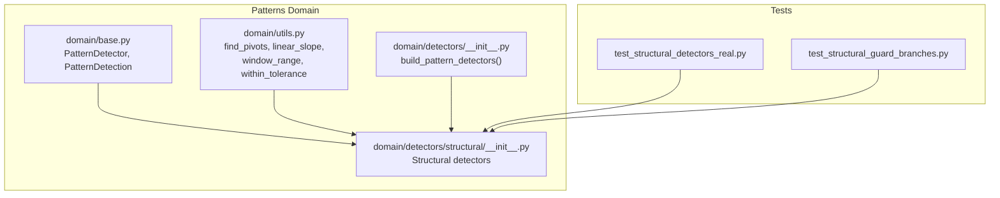
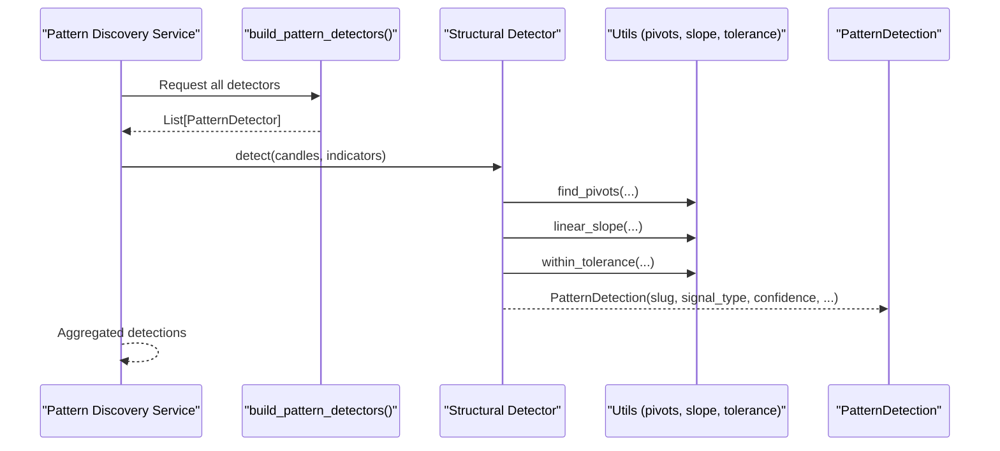
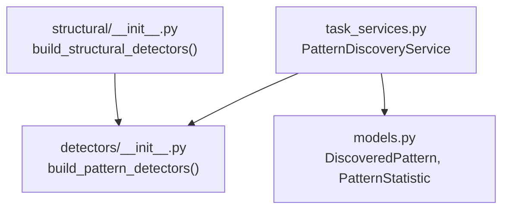
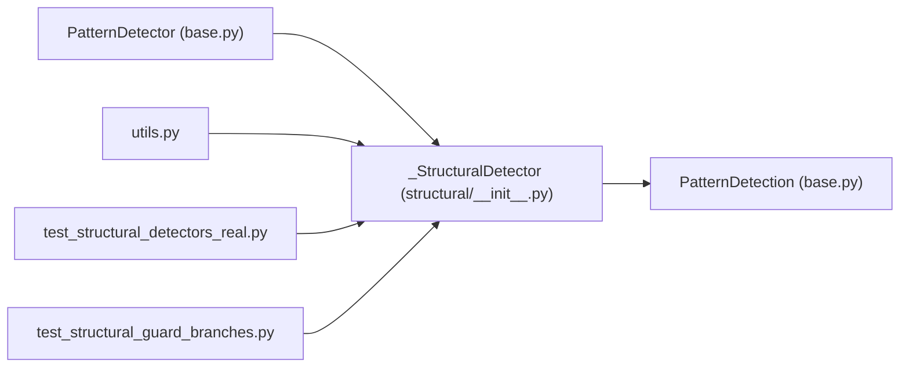

# Structural Patterns

<cite>
**Referenced Files in This Document**
- [structural/__init__.py](file://src/apps/patterns/domain/detectors/structural/__init__.py)
- [detectors/__init__.py](file://src/apps/patterns/domain/detectors/__init__.py)
- [base.py](file://src/apps/patterns/domain/base.py)
- [utils.py](file://src/apps/patterns/domain/utils.py)
- [test_structural_detectors_real.py](file://tests/apps/patterns/test_structural_detectors_real.py)
- [test_structural_guard_branches.py](file://tests/apps/patterns/test_structural_guard_branches.py)
- [task_services.py](file://src/apps/patterns/task_services.py)
- [models.py](file://src/apps/patterns/models.py)
</cite>

## Table of Contents
1. [Introduction](#introduction)
2. [Project Structure](#project-structure)
3. [Core Components](#core-components)
4. [Architecture Overview](#architecture-overview)
5. [Detailed Component Analysis](#detailed-component-analysis)
6. [Dependency Analysis](#dependency-analysis)
7. [Performance Considerations](#performance-considerations)
8. [Troubleshooting Guide](#troubleshooting-guide)
9. [Conclusion](#conclusion)

## Introduction
This document explains the structural pattern detectors that identify recurring price action formations and channel dynamics. It covers channel patterns, support/resistance detection, trend line analysis, and dynamic support/resistance identification. It also documents structural level validation methods, trend continuation confirmation, and structural break validation criteria, along with technical specifications for channel width parameters, support/resistance strength measurements, and trend line accuracy thresholds. Finally, it describes how these detectors integrate with market structure analysis and pattern confirmation workflows.

## Project Structure
The structural pattern detectors live under the patterns domain and are composed into a unified detector set. They rely on shared utilities for pivots, slopes, and windowing operations. Tests validate realistic shape generation and guard branches that prevent false positives.

**Diagram sources**
- [base.py:21-34](file://src/apps/patterns/domain/base.py#L21-L34)
- [utils.py:73-103](file://src/apps/patterns/domain/utils.py#L73-L103)
- [structural/__init__.py:22-424](file://src/apps/patterns/domain/detectors/structural/__init__.py#L22-L424)
- [detectors/__init__.py:8-15](file://src/apps/patterns/domain/detectors/__init__.py#L8-L15)
- [test_structural_detectors_real.py:1-994](file://tests/apps/patterns/test_structural_detectors_real.py#L1-L994)
- [test_structural_guard_branches.py:1-370](file://tests/apps/patterns/test_structural_guard_branches.py#L1-L370)

**Section sources**
- [structural/__init__.py:22-424](file://src/apps/patterns/domain/detectors/structural/__init__.py#L22-L424)
- [detectors/__init__.py:8-15](file://src/apps/patterns/domain/detectors/__init__.py#L8-L15)
- [base.py:21-34](file://src/apps/patterns/domain/base.py#L21-L34)
- [utils.py:73-103](file://src/apps/patterns/domain/utils.py#L73-L103)

## Core Components
- PatternDetector and PatternDetection define the interface and output contract for all detectors.
- Structural detectors inherit a shared base that emits detections with category "structural" and clamped confidence.
- Utility functions provide pivot finding, linear slope calculation, window range measurement, and tolerance checks used across detectors.

Key responsibilities:
- Detect channel patterns (rectangles, triangles, wedges, broadening/expanding triangles).
- Identify reversals (head/shoulders, rounded turns, diamonds, flat bases).
- Confirm breakouts/breakdowns against channel and trend lines.
- Validate structural levels and trend continuations with guard conditions and tolerances.

**Section sources**
- [base.py:11-34](file://src/apps/patterns/domain/base.py#L11-L34)
- [structural/__init__.py:22-34](file://src/apps/patterns/domain/detectors/structural/__init__.py#L22-L34)
- [utils.py:62-103](file://src/apps/patterns/domain/utils.py#L62-L103)

## Architecture Overview
The structural detectors are part of a composite detector set built at runtime. Each detector evaluates a sliding window of candles and applies shape-specific guard conditions. Confidence is computed per detector and clamped to a bounded range.

**Diagram sources**
- [detectors/__init__.py:8-15](file://src/apps/patterns/domain/detectors/__init__.py#L8-L15)
- [structural/__init__.py:22-34](file://src/apps/patterns/domain/detectors/structural/__init__.py#L22-L34)
- [utils.py:73-103](file://src/apps/patterns/domain/utils.py#L73-L103)

## Detailed Component Analysis

### Channel Patterns
- Rectangle: Validates near-flat support/resistance with tight compression and sufficient pivot counts.
- Ascending/Descending/Symmetrical Triangle: Requires compressed ranges and specific slope orientations; breakout confirmed by price moving beyond trend lines.
- Rising/Falling Wedge: Enforces converging ranges with slope relationships; breakout occurs beyond the wedge boundaries.
- Broadening/Expanding Triangle: Validates widening ranges over time; breakout occurs outside the widening envelope.

Technical specifications:
- Compression threshold for triangle rectangles: less than approximately 0.08 (percent range relative to price).
- Triangle compression enforced via slope stability and small range-to-price ratio.
- Wedge convergence validated by slope signs and relative magnitudes; range comparisons over recent windows.
- Broadening/expanding triangle validated by increasing range widths and breakout beyond extremes.

Validation criteria:
- Minimum window sizes per detector to ensure adequate historical context.
- Pivot counts and quality (tolerance-based equality) for multi-touch levels.
- Slope tolerance checks for parallel trend lines and breakout confirmation.

**Section sources**
- [structural/__init__.py:122-167](file://src/apps/patterns/domain/detectors/structural/__init__.py#L122-L167)
- [structural/__init__.py:170-200](file://src/apps/patterns/domain/detectors/structural/__init__.py#L170-L200)
- [structural/__init__.py:203-232](file://src/apps/patterns/domain/detectors/structural/__init__.py#L203-L232)
- [structural/__init__.py:235-260](file://src/apps/patterns/domain/detectors/structural/__init__.py#L235-L260)
- [structural/__init__.py:263-287](file://src/apps/patterns/domain/detectors/structural/__init__.py#L263-L287)
- [utils.py:93-97](file://src/apps/patterns/domain/utils.py#L93-L97)
- [utils.py:100-103](file://src/apps/patterns/domain/utils.py#L100-L103)

### Support/Resistance Detection and Dynamic Levels
- Multi-touch levels: Detect repeated price touches within a tolerance band around a central level.
- Resistance/support identification: Derived from observed pivots and local range minima/maxima within a selected window.
- Dynamic strength: Quantified by the number of touches and the depth of the pattern relative to the level.

Validation:
- Tolerance-based equality ensures level consolidation across multiple touches.
- Price must remain below/above the level to confirm validity before breakout.

**Section sources**
- [structural/__init__.py:91-119](file://src/apps/patterns/domain/detectors/structural/__init__.py#L91-L119)
- [utils.py:93-97](file://src/apps/patterns/domain/utils.py#L93-L97)

### Trend Line Analysis and Continuation Confirmation
- Trend line slopes: Linear regression slope computed over recent segments to validate trend direction and steepness.
- Continuation confirmation: Symmetrical triangle requires opposite-signed slopes converging; breakout only confirms if price moves beyond trend lines.
- Accuracy thresholds: Slope magnitudes and differences are normalized by price to avoid scale bias.

Validation:
- Guard checks enforce slope relationships and breakout conditions.
- Confidence incorporates slope differences and price distance from trend lines.

**Section sources**
- [structural/__init__.py:122-167](file://src/apps/patterns/domain/detectors/structural/__init__.py#L122-L167)
- [utils.py:62-70](file://src/apps/patterns/domain/utils.py#L62-L70)

### Structural Break Validation Criteria
- Channel break validation: Requires similar slope magnitudes for upper/lower channels within tolerance; breakout confirmed by closing beyond recent channel extremes.
- Reversal confirmation: Head/shoulders and inverse head/shoulders require neckline breaches and symmetry/tolerance checks.
- Rounded turn and diamond validations: Require rim equality within tolerance and extreme deviations from mid-range.

Confidence computation:
- Detectors compute confidence scores incorporating compression, slope differences, and pattern depth; all are clamped to a fixed range.

**Section sources**
- [structural/__init__.py:290-316](file://src/apps/patterns/domain/detectors/structural/__init__.py#L290-L316)
- [structural/__init__.py:377-396](file://src/apps/patterns/domain/detectors/structural/__init__.py#L377-L396)
- [structural/__init__.py:319-346](file://src/apps/patterns/domain/detectors/structural/__init__.py#L319-L346)
- [structural/__init__.py:349-374](file://src/apps/patterns/domain/detectors/structural/__init__.py#L349-L374)
- [base.py:25-34](file://src/apps/patterns/domain/base.py#L25-L34)

### Technical Specifications

- Channel width parameters
  - Triangle compression threshold: Range-to-price ratio less than approximately 0.08.
  - Broadening/expanding triangle widening validated by increasing window ranges.
  - Wedge convergence validated by slope relationships and range comparisons.

- Support/resistance strength measurements
  - Multi-touch count influences confidence; more touches increase strength.
  - Pattern depth relative to the level contributes to confidence.

- Trend line accuracy thresholds
  - Slope tolerance: Upper bound on absolute difference between channel slopes.
  - Slope magnitude normalization: Slope differences divided by price to maintain scale-invariant thresholds.

- Confidence clamping
  - All detectors clamp confidence to a fixed interval to normalize outputs.

**Section sources**
- [structural/__init__.py:144](file://src/apps/patterns/domain/detectors/structural/__init__.py#L144)
- [structural/__init__.py:186](file://src/apps/patterns/domain/detectors/structural/__init__.py#L186)
- [structural/__init__.py:204](file://src/apps/patterns/domain/detectors/structural/__init__.py#L204)
- [structural/__init__.py:248](file://src/apps/patterns/domain/detectors/structural/__init__.py#L248)
- [structural/__init__.py:282](file://src/apps/patterns/domain/detectors/structural/__init__.py#L282)
- [structural/__init__.py:304](file://src/apps/patterns/domain/detectors/structural/__init__.py#L304)
- [base.py:25-34](file://src/apps/patterns/domain/base.py#L25-L34)

### Integration with Market Structure Analysis and Pattern Confirmation Workflows
- Detector composition: Structural detectors are aggregated alongside continuation, momentum, volatility, and volume detectors.
- Task services: Pattern discovery and market structure services coordinate periodic refresh of market context and discovered patterns.
- Persistence: Discovered patterns and statistics are stored for downstream evaluation and strategy use.

**Diagram sources**
- [structural/__init__.py:399-424](file://src/apps/patterns/domain/detectors/structural/__init__.py#L399-L424)
- [detectors/__init__.py:8-15](file://src/apps/patterns/domain/detectors/__init__.py#L8-L15)
- [task_services.py:130-137](file://src/apps/patterns/task_services.py#L130-L137)
- [models.py:15-99](file://src/apps/patterns/models.py#L15-L99)

**Section sources**
- [detectors/__init__.py:8-15](file://src/apps/patterns/domain/detectors/__init__.py#L8-L15)
- [task_services.py:130-137](file://src/apps/patterns/task_services.py#L130-L137)
- [models.py:15-99](file://src/apps/patterns/models.py#L15-L99)

## Dependency Analysis
- Structural detectors depend on:
  - PatternDetector base for interface and emission.
  - Utility functions for pivots, slopes, ranges, and tolerance checks.
- Tests exercise realistic OHLC shapes and guard branch conditions to prevent false positives.

**Diagram sources**
- [base.py:21-34](file://src/apps/patterns/domain/base.py#L21-L34)
- [structural/__init__.py:22-34](file://src/apps/patterns/domain/detectors/structural/__init__.py#L22-L34)
- [utils.py:73-103](file://src/apps/patterns/domain/utils.py#L73-L103)
- [test_structural_detectors_real.py:1-994](file://tests/apps/patterns/test_structural_detectors_real.py#L1-L994)
- [test_structural_guard_branches.py:1-370](file://tests/apps/patterns/test_structural_guard_branches.py#L1-L370)

**Section sources**
- [base.py:21-34](file://src/apps/patterns/domain/base.py#L21-L34)
- [structural/__init__.py:22-34](file://src/apps/patterns/domain/detectors/structural/__init__.py#L22-L34)
- [utils.py:73-103](file://src/apps/patterns/domain/utils.py#L73-L103)

## Performance Considerations
- Sliding window sizes vary by detector; ensure sufficient historical bars to avoid early returns.
- Pivot detection and slope calculations are O(n) per window; keep window sizes reasonable for real-time constraints.
- Clamping confidence reduces downstream normalization overhead.
- Tests demonstrate realistic shape generation; use similar patterns to minimize false alarms and improve recall.

## Troubleshooting Guide
Common guard conditions and their implications:
- Insufficient data length: Many detectors return empty results when input length is below a minimum threshold.
- Pivot quality: Tolerance-based equality is required for multi-touch levels; adjust expectations accordingly.
- Slope relationships: For triangles/wedges, enforce slope signs and magnitudes; mismatches invalidate detection.
- Breakout confirmation: Price must move beyond trend lines or channel extremes; otherwise, no detection is emitted.

Diagnostic tips:
- Verify window ranges and compression thresholds for triangles/rectangles.
- Confirm slope tolerance for channel break validations.
- Check rim equality for rounded turns and diamond validations.

**Section sources**
- [test_structural_guard_branches.py:13-92](file://tests/apps/patterns/test_structural_guard_branches.py#L13-L92)
- [test_structural_guard_branches.py:216-299](file://tests/apps/patterns/test_structural_guard_branches.py#L216-L299)
- [test_structural_guard_branches.py:301-370](file://tests/apps/patterns/test_structural_guard_branches.py#L301-L370)
- [test_structural_detectors_real.py:54-86](file://tests/apps/patterns/test_structural_detectors_real.py#L54-L86)

## Conclusion
The structural pattern detectors provide robust, threshold-driven validation of channel patterns, support/resistance levels, and trend continuations. Their guard conditions and tolerance-based measures reduce false positives while enabling reliable breakout and reversal confirmations. Integrated into the broader pattern discovery and market structure workflows, they contribute to a comprehensive system for pattern intelligence and strategy development.