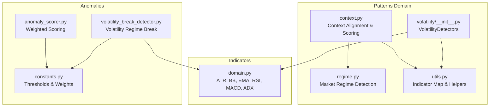
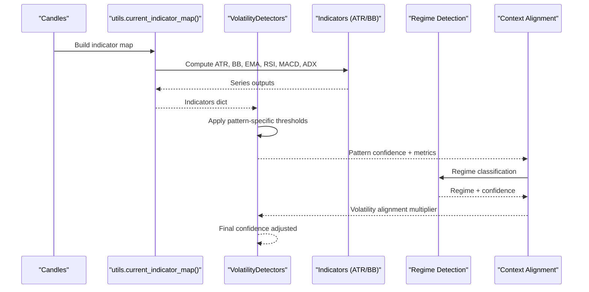
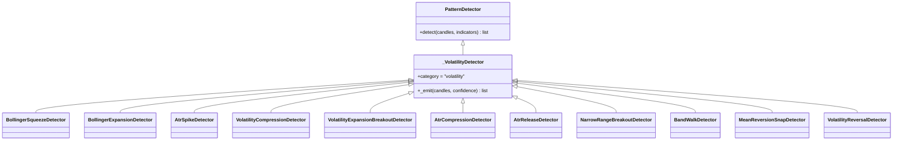
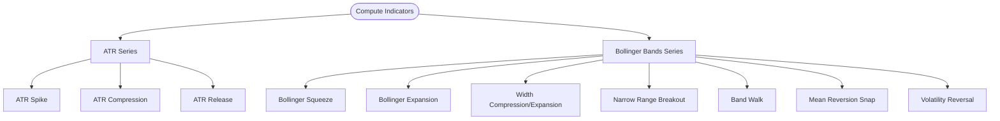
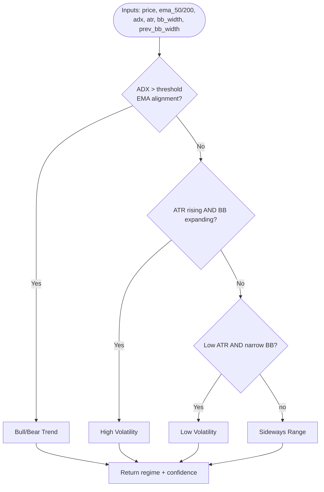
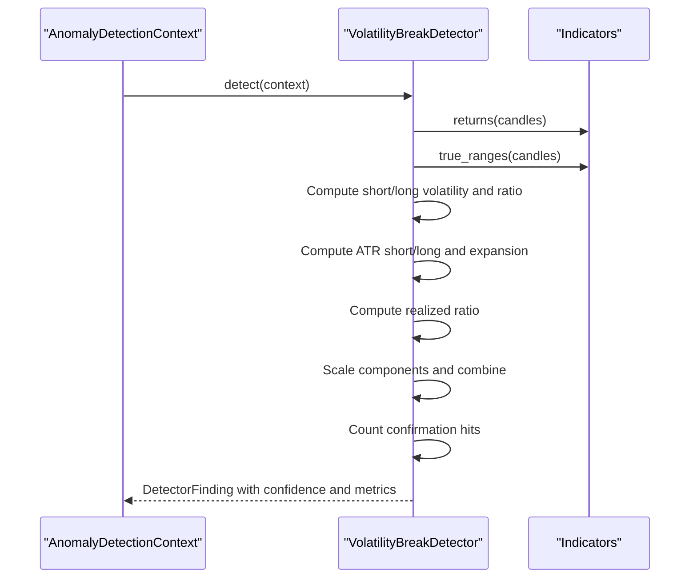
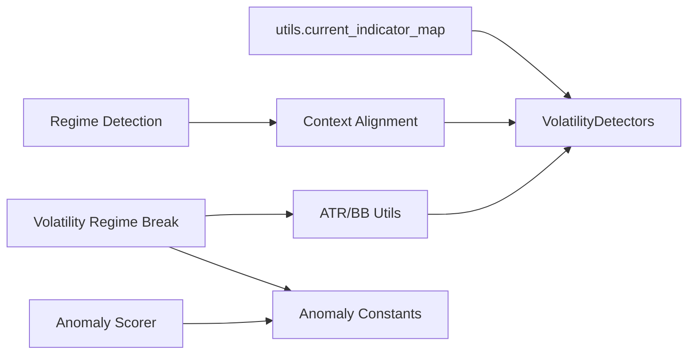

# Volatility Patterns

<cite>
**Referenced Files in This Document**
- [volatility/__init__.py](file://src/apps/patterns/domain/detectors/volatility/__init__.py)
- [domain.py](file://src/apps/indicators/domain.py)
- [utils.py](file://src/apps/patterns/domain/utils.py)
- [regime.py](file://src/apps/patterns/domain/regime.py)
- [context.py](file://src/apps/patterns/domain/context.py)
- [volatility_break_detector.py](file://src/apps/anomalies/detectors/volatility_break_detector.py)
- [anomaly_scorer.py](file://src/apps/anomalies/scoring/anomaly_scaler.py)
- [constants.py](file://src/apps/anomalies/constants.py)
- [test_volatility_detectors.py](file://tests/apps/patterns/test_volatility_detectors.py)
</cite>

## Table of Contents
1. [Introduction](#introduction)
2. [Project Structure](#project-structure)
3. [Core Components](#core-components)
4. [Architecture Overview](#architecture-overview)
5. [Detailed Component Analysis](#detailed-component-analysis)
6. [Dependency Analysis](#dependency-analysis)
7. [Performance Considerations](#performance-considerations)
8. [Troubleshooting Guide](#troubleshooting-guide)
9. [Conclusion](#conclusion)
10. [Appendices](#appendices)

## Introduction
This document explains the volatility pattern detection subsystem used to identify volatility-driven market regimes and candlestick-based volatility spikes. It covers:
- Volatility compression/expansion and Bollinger-related patterns
- Average True Range (ATR)-based spikes and releases
- Narrow-range breakouts and mean-reversion snaps
- Band walk and reversal patterns
- Volatility measurement integration (ATR, Bollinger Bands)
- Pattern recognition criteria and confidence scoring
- Market regime adaptation and context-aware alignment
- Technical specifications for thresholds, pattern strength, and time-frame sensitivity
- Calibration and optimization procedures

## Project Structure
The volatility pattern detectors live under the patterns domain and integrate with indicator utilities and regime/context services.

**Diagram sources**
- [volatility/__init__.py:1-267](file://src/apps/patterns/domain/detectors/volatility/__init__.py#L1-L267)
- [domain.py:103-148](file://src/apps/indicators/domain.py#L103-L148)
- [utils.py:117-157](file://src/apps/patterns/domain/utils.py#L117-L157)
- [regime.py:25-66](file://src/apps/patterns/domain/regime.py#L25-L66)
- [context.py:47-56](file://src/apps/patterns/domain/context.py#L47-L56)
- [volatility_break_detector.py:54-113](file://src/apps/anomalies/detectors/volatility_break_detector.py#L54-L113)
- [anomaly_scorer.py:13-38](file://src/apps/anomalies/scoring/anomaly_scorer.py#L13-L38)
- [constants.py:69-112](file://src/apps/anomalies/constants.py#L69-L112)

**Section sources**
- [volatility/__init__.py:1-267](file://src/apps/patterns/domain/detectors/volatility/__init__.py#L1-L267)
- [domain.py:103-148](file://src/apps/indicators/domain.py#L103-L148)
- [utils.py:117-157](file://src/apps/patterns/domain/utils.py#L117-L157)
- [regime.py:25-66](file://src/apps/patterns/domain/regime.py#L25-L66)
- [context.py:47-56](file://src/apps/patterns/domain/context.py#L47-L56)
- [volatility_break_detector.py:54-113](file://src/apps/anomalies/detectors/volatility_break_detector.py#L54-L113)
- [anomaly_scorer.py:13-38](file://src/apps/anomalies/scoring/anomaly_scorer.py#L13-L38)
- [constants.py:69-112](file://src/apps/anomalies/constants.py#L69-L112)

## Core Components
- VolatilityDetectors: A family of detectors for compression, expansion, spikes, narrow ranges, and mean-reversion snaps, built via a factory.
- Indicator Utilities: ATR and Bollinger Bands series used by multiple detectors.
- Market Regime: Detects macro regimes (trend, sideways, high/low volatility) to inform context alignment.
- Context Alignment: Adjusts pattern confidence using regime, volatility, liquidity, sector, and cycle factors.
- Volatility Regime Break Detector: Anomaly detector combining rolling volatility, ATR expansion, and realized moves.

Key detector families:
- Bollinger Squeeze, Expansion, Width Compression/Expansion, Narrow Range Breakout
- ATR Spike, Compression, Release
- Band Walk (Bull/Bear), Mean Reversion Snap, Volatility Reversal (Bull/Bear)

**Section sources**
- [volatility/__init__.py:251-266](file://src/apps/patterns/domain/detectors/volatility/__init__.py#L251-L266)
- [domain.py:103-148](file://src/apps/indicators/domain.py#L103-L148)
- [regime.py:25-66](file://src/apps/patterns/domain/regime.py#L25-L66)
- [context.py:47-56](file://src/apps/patterns/domain/context.py#L47-L56)
- [volatility_break_detector.py:54-113](file://src/apps/anomalies/detectors/volatility_break_detector.py#L54-L113)

## Architecture Overview
The volatility detection pipeline integrates candle inputs with indicator computations and applies pattern-specific logic. Context alignment further modulates confidence using regime and market conditions.

**Diagram sources**
- [utils.py:117-157](file://src/apps/patterns/domain/utils.py#L117-L157)
- [domain.py:103-148](file://src/apps/indicators/domain.py#L103-L148)
- [volatility/__init__.py:251-266](file://src/apps/patterns/domain/detectors/volatility/__init__.py#L251-L266)
- [regime.py:25-66](file://src/apps/patterns/domain/regime.py#L25-L66)
- [context.py:47-56](file://src/apps/patterns/domain/context.py#L47-L56)

## Detailed Component Analysis

### VolatilityDetectors Family
Each detector extends a shared base and emits a standardized pattern detection with a slug, confidence, and timestamp. Confidence is computed locally per detector using rolling windows and indicator ratios.

**Diagram sources**
- [volatility/__init__.py:11-24](file://src/apps/patterns/domain/detectors/volatility/__init__.py#L11-L24)
- [volatility/__init__.py:26-266](file://src/apps/patterns/domain/detectors/volatility/__init__.py#L26-L266)

Key detectors and thresholds:
- BollingerSqueezeDetector: Looks for a sharp drop in BB width vs recent percentile and requires a breakout move size exceeding a threshold.
- BollingerExpansionDetector: Requires current width to exceed baseline by a factor and computes confidence from width increase.
- AtrSpikeDetector: Requires current ATR to exceed baseline by a factor and computes confidence from ATR increase.
- VolatilityCompressionDetector: Compares recent vs prior average BB width; triggers if recent width is sufficiently below prior.
- VolatilityExpansionBreakoutDetector: Requires current width above baseline and a price breakout outside the recent range.
- AtrCompressionDetector: Recent ATR below prior by a factor.
- AtrReleaseDetector: Recent ATR above baseline by a factor.
- NarrowRangeBreakoutDetector: Daily range below baseline and price breaks out of recent range; volume confirmation optional.
- BandWalkDetector: Price remains near upper/lower bands for several candles.
- MeanReversionSnapDetector: Price moves from outside bands toward middle with volume confirmation.
- VolatilityReversalDetector: Width increases and candlestick reversal occurs after increasing width.

Confidence computation patterns:
- Ratio-based scaling against baselines (BB width, ATR).
- Volume ratio adjustments where applicable.
- Clamping to internal bounds.

Timeframe sensitivity:
- Detectors operate on fixed sliding windows (e.g., last N candles) and rely on indicator series computed over those windows.

Validation and tests:
- Unit tests simulate indicator outputs and confirm detector outcomes for success and negative confirmation paths.

**Section sources**
- [volatility/__init__.py:26-266](file://src/apps/patterns/domain/detectors/volatility/__init__.py#L26-L266)
- [test_volatility_detectors.py:37-211](file://tests/apps/patterns/test_volatility_detectors.py#L37-L211)

### Indicator Integrations
- ATR: Average True Range series used for ATR Spike, Compression, and Release detectors.
- Bollinger Bands: Upper/middle/lower envelopes and width series used across multiple detectors.

**Diagram sources**
- [domain.py:103-148](file://src/apps/indicators/domain.py#L103-L148)
- [volatility/__init__.py:26-266](file://src/apps/patterns/domain/detectors/volatility/__init__.py#L26-L266)

**Section sources**
- [domain.py:103-148](file://src/apps/indicators/domain.py#L103-L148)
- [volatility/__init__.py:26-266](file://src/apps/patterns/domain/detectors/volatility/__init__.py#L26-L266)

### Market Regime Adaptation
Regime detection combines trend, volatility, and breadth signals to classify markets into bull/bear/sideways/high/low volatility. Context alignment then adjusts pattern confidence based on regime and volatility characteristics.

**Diagram sources**
- [regime.py:25-66](file://src/apps/patterns/domain/regime.py#L25-L66)

Context alignment multipliers:
- Volatility alignment adjusts confidence depending on signal type and current volatility/band width.
- Regime alignment scales confidence according to bias vs regime.
- Liquidity, sector, and cycle alignments further refine priority scores.

**Section sources**
- [regime.py:25-66](file://src/apps/patterns/domain/regime.py#L25-L66)
- [context.py:33-56](file://src/apps/patterns/domain/context.py#L33-L56)

### Volatility Regime Break (Anomaly Detector)
This detector identifies transitions into higher volatility regimes using rolling returns and ATR.

Key parameters and thresholds:
- Lookback window for regime break detection.
- Short/long volatility windows and ratio thresholds.
- ATR short/long windows and expansion thresholds.
- Realized move ratio thresholds.
- Scaling floors/ceilings for components.
- Confirmation hits requirement.

**Diagram sources**
- [volatility_break_detector.py:54-113](file://src/apps/anomalies/detectors/volatility_break_detector.py#L54-L113)

**Section sources**
- [volatility_break_detector.py:54-113](file://src/apps/anomalies/detectors/volatility_break_detector.py#L54-L113)
- [constants.py:69-82](file://src/apps/anomalies/constants.py#L69-L82)

## Dependency Analysis
- Detectors depend on indicator utilities for ATR and Bollinger Bands.
- Context alignment depends on regime detection and market metrics.
- Anomaly scoring depends on detector weights and severity bands.

**Diagram sources**
- [utils.py:117-157](file://src/apps/patterns/domain/utils.py#L117-L157)
- [domain.py:103-148](file://src/apps/indicators/domain.py#L103-L148)
- [regime.py:25-66](file://src/apps/patterns/domain/regime.py#L25-L66)
- [context.py:47-56](file://src/apps/patterns/domain/context.py#L47-L56)
- [volatility_break_detector.py:54-113](file://src/apps/anomalies/detectors/volatility_break_detector.py#L54-L113)
- [anomaly_scorer.py:13-38](file://src/apps/anomalies/scoring/anomaly_scorer.py#L13-L38)
- [constants.py:69-112](file://src/apps/anomalies/constants.py#L69-L112)

**Section sources**
- [utils.py:117-157](file://src/apps/patterns/domain/utils.py#L117-L157)
- [domain.py:103-148](file://src/apps/indicators/domain.py#L103-L148)
- [regime.py:25-66](file://src/apps/patterns/domain/regime.py#L25-L66)
- [context.py:47-56](file://src/apps/patterns/domain/context.py#L47-L56)
- [volatility_break_detector.py:54-113](file://src/apps/anomalies/detectors/volatility_break_detector.py#L54-L113)
- [anomaly_scorer.py:13-38](file://src/apps/anomalies/scoring/anomaly_scorer.py#L13-L38)
- [constants.py:69-112](file://src/apps/anomalies/constants.py#L69-L112)

## Performance Considerations
- Sliding window sizes: Detectors use fixed-size windows; ensure sufficient historical data to avoid early returns of empty detections.
- Indicator computation cost: ATR and BB width require O(N) passes; batch indicator computation via the indicator map reduces repeated work.
- Confidence clamping: Internal clamping prevents extreme values; consider adjusting thresholds to reduce false positives in low/noise regimes.
- Timeframe sensitivity: Choose detector families aligned with the target timeframe; ATR-based detectors are sensitive to timeframe selection.

[No sources needed since this section provides general guidance]

## Troubleshooting Guide
Common issues and resolutions:
- Insufficient data: Detectors return empty when input lengths are below minimum thresholds. Extend lookback or reduce window sizes.
- Missing indicator values: Detectors skip when required series are None; ensure indicator map is populated before invoking detectors.
- Overly sensitive thresholds: Reduce scaling floors or increase ratio thresholds to decrease false alarms.
- Context alignment too aggressive: Lower volatility or regime alignment multipliers to stabilize confidence.

Validation references:
- Unit tests demonstrate success and negative confirmation paths for each detector.

**Section sources**
- [test_volatility_detectors.py:31-34](file://tests/apps/patterns/test_volatility_detectors.py#L31-L34)
- [test_volatility_detectors.py:110-211](file://tests/apps/patterns/test_volatility_detectors.py#L110-L211)

## Conclusion
The volatility pattern detection system combines robust indicator-based detectors with regime-aware context alignment. By tuning thresholds, confirming with volume and price action, and adapting to market regimes, the system reliably identifies volatility compression/expansion, spikes, and mean-reversion setups across timeframes.

[No sources needed since this section summarizes without analyzing specific files]

## Appendices

### Technical Specifications

- Volatility Measurement Integration
  - ATR: Used for ATR Spike, Compression, and Release detectors.
  - Bollinger Bands: Used for Squeeze, Expansion, Width Compression/Expansion, Narrow Range Breakout, Band Walk, Mean Reversion Snap, and Volatility Reversal detectors.

- Candlestick Pattern Recognition Criteria
  - Squeeze: Sharp drop in BB width vs recent percentile; breakout move exceeds threshold.
  - Expansion: Current BB width exceeds baseline by a factor; confidence from width increase.
  - Spike/Compression/Release: ATR exceeds baseline by a factor; confidence from ATR increase.
  - Narrow Range Breakout: Daily range below baseline; price breaks out of recent range; optional volume confirmation.
  - Band Walk: Price near upper/lower bands for several candles.
  - Mean Reversion Snap: Overshoot beyond bands toward middle with volume confirmation.
  - Volatility Reversal: Width increases and candlestick reversal occurs after increasing width.

- Market Regime Adaptation Methods
  - Regime detection: Bull/bear/sideways/high/low volatility based on trend, ATR, and BB signals.
  - Context alignment: Multipliers adjust confidence based on regime, volatility, liquidity, sector, and cycle.

- Volatility Threshold Parameters
  - Ratio thresholds for ATR and BB width comparisons.
  - Scaling floors/ceilings for component scores.
  - Confirmation hit requirements for anomaly detectors.

- Pattern Strength Calculations
  - Ratio-based confidence derived from indicator comparisons.
  - Optional volume ratio adjustments.
  - Clamped confidence bounds.

- Time Frame Sensitivity Adjustments
  - Fixed sliding windows per detector; choose appropriate windows for the desired timeframe.
  - Indicator periods (e.g., BB 20-period, ATR 14-period) influence sensitivity.

- Detector Calibration Procedures
  - Backtest on historical data to tune thresholds and confirmatory filters.
  - Evaluate detector outputs across regimes (high/low volatility, trending, ranging).
  - Use unit tests as a reference for expected behavior under success and negative confirmation scenarios.

- Performance Optimization
  - Precompute indicator maps to avoid redundant computations.
  - Clamp confidence values to prevent extreme outliers.
  - Align detectors with dominant market regime to improve precision.

[No sources needed since this section aggregates previously cited details]