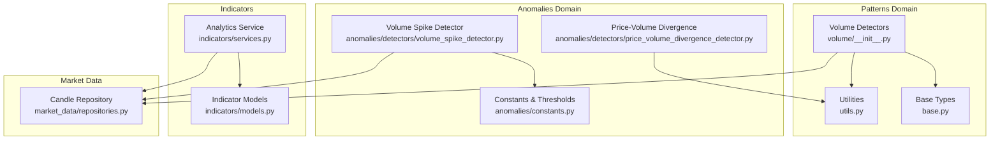
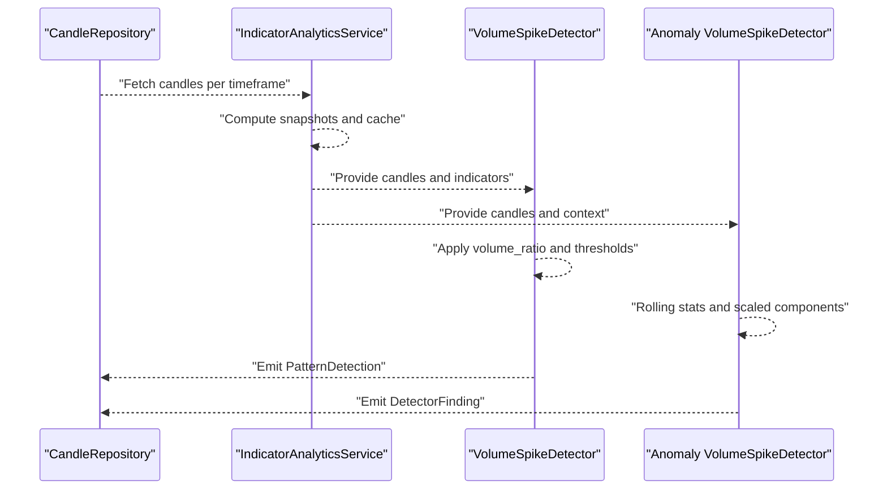
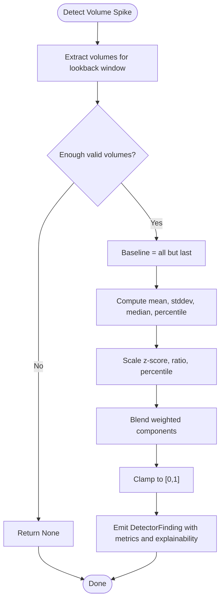
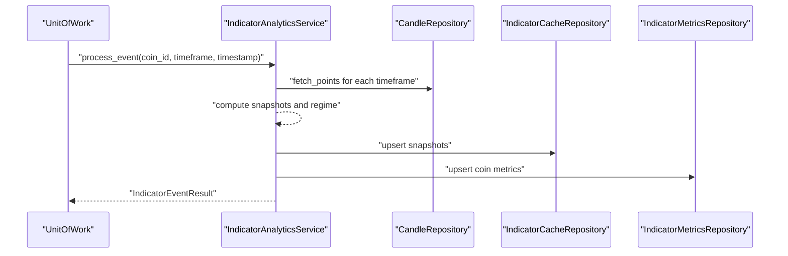
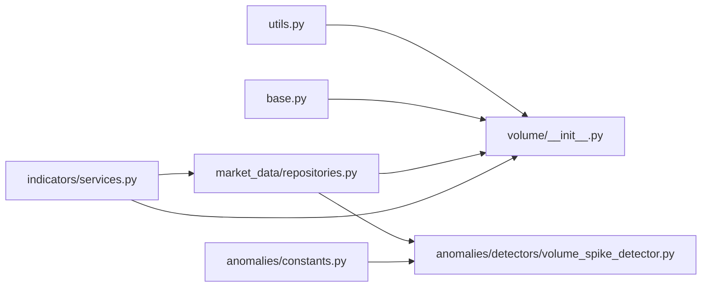

# Volume Patterns

<cite>
**Referenced Files in This Document**
- [src/apps/patterns/domain/detectors/volume/__init__.py](file://src/apps/patterns/domain/detectors/volume/__init__.py)
- [src/apps/patterns/domain/utils.py](file://src/apps/patterns/domain/utils.py)
- [src/apps/patterns/domain/base.py](file://src/apps/patterns/domain/base.py)
- [src/apps/anomalies/detectors/volume_spike_detector.py](file://src/apps/anomalies/detectors/volume_spike_detector.py)
- [src/apps/anomalies/constants.py](file://src/apps/anomalies/constants.py)
- [src/apps/anomalies/detectors/price_volume_divergence_detector.py](file://src/apps/anomalies/detectors/price_volume_divergence_detector.py)
- [src/apps/indicators/services.py](file://src/apps/indicators/services.py)
- [src/apps/indicators/models.py](file://src/apps/indicators/models.py)
- [src/apps/market_data/repositories.py](file://src/apps/market_data/repositories.py)
- [tests/apps/patterns/test_volume_detectors_real.py](file://tests/apps/patterns/test_volume_detectors_real.py)
</cite>

## Table of Contents
1. [Introduction](#introduction)
2. [Project Structure](#project-structure)
3. [Core Components](#core-components)
4. [Architecture Overview](#architecture-overview)
5. [Detailed Component Analysis](#detailed-component-analysis)
6. [Dependency Analysis](#dependency-analysis)
7. [Performance Considerations](#performance-considerations)
8. [Troubleshooting Guide](#troubleshooting-guide)
9. [Conclusion](#conclusion)

## Introduction
This document explains the volume pattern detection subsystems in the backend. It covers two complementary approaches:
- Pattern detectors focused on accumulation/distribution flows, volume spikes, divergences, climaxes, and trend confirmation
- Anomaly detectors for volume spikes and price-volume divergences

It documents detection algorithms, thresholds, confidence scoring, and integration with price action and liquidity signals. It also outlines multi-timeframe analysis capabilities and false-signal prevention strategies.

## Project Structure
The volume pattern detection spans:
- Pattern detectors under the patterns domain
- Anomaly detectors under the anomalies domain
- Supporting utilities for volume ratios and indicator integration
- Indicator analytics and caching for multi-timeframe context

**Diagram sources**
- [src/apps/patterns/domain/detectors/volume/__init__.py:1-266](file://src/apps/patterns/domain/detectors/volume/__init__.py#L1-L266)
- [src/apps/patterns/domain/utils.py:1-157](file://src/apps/patterns/domain/utils.py#L1-L157)
- [src/apps/patterns/domain/base.py:1-35](file://src/apps/patterns/domain/base.py#L1-L35)
- [src/apps/anomalies/detectors/volume_spike_detector.py:1-84](file://src/apps/anomalies/detectors/volume_spike_detector.py#L1-L84)
- [src/apps/anomalies/constants.py:1-113](file://src/apps/anomalies/constants.py#L1-L113)
- [src/apps/anomalies/detectors/price_volume_divergence_detector.py:68-115](file://src/apps/anomalies/detectors/price_volume_divergence_detector.py#L68-L115)
- [src/apps/indicators/services.py:178-340](file://src/apps/indicators/services.py#L178-L340)
- [src/apps/indicators/models.py:15-121](file://src/apps/indicators/models.py#L15-L121)
- [src/apps/market_data/repositories.py:112-278](file://src/apps/market_data/repositories.py#L112-L278)

**Section sources**
- [src/apps/patterns/domain/detectors/volume/__init__.py:1-266](file://src/apps/patterns/domain/detectors/volume/__init__.py#L1-L266)
- [src/apps/anomalies/detectors/volume_spike_detector.py:1-84](file://src/apps/anomalies/detectors/volume_spike_detector.py#L1-L84)
- [src/apps/anomalies/constants.py:1-113](file://src/apps/anomalies/constants.py#L1-L113)
- [src/apps/anomalies/detectors/price_volume_divergence_detector.py:68-115](file://src/apps/anomalies/detectors/price_volume_divergence_detector.py#L68-L115)
- [src/apps/indicators/services.py:178-340](file://src/apps/indicators/services.py#L178-L340)
- [src/apps/indicators/models.py:15-121](file://src/apps/indicators/models.py#L15-L121)
- [src/apps/market_data/repositories.py:112-278](file://src/apps/market_data/repositories.py#L112-L278)

## Core Components
- Volume pattern detectors: spike, climax, divergence, dry-up, breakout confirmation, accumulation/distribution flow, churn bar, effort-result divergence, relative volume breakout, follow-through, climax turn, and trend confirmation.
- Anomaly volume spike detector: computes rolling z-score, ratio vs median, and percentile rank; combines components into a composite score and confidence.
- Utilities: volume_ratio, closes, pct_change, signal_timestamp, clamp.
- Multi-timeframe integration: indicator analytics service builds snapshots across timeframes, caches values, and exposes regime and feature snapshots.

**Section sources**
- [src/apps/patterns/domain/detectors/volume/__init__.py:25-265](file://src/apps/patterns/domain/detectors/volume/__init__.py#L25-L265)
- [src/apps/patterns/domain/utils.py:106-157](file://src/apps/patterns/domain/utils.py#L106-L157)
- [src/apps/anomalies/detectors/volume_spike_detector.py:39-84](file://src/apps/anomalies/detectors/volume_spike_detector.py#L39-L84)
- [src/apps/indicators/services.py:225-340](file://src/apps/indicators/services.py#L225-L340)

## Architecture Overview
The volume pattern detection integrates candle data, computed indicators, and multi-timeframe analytics to emit pattern detections and anomaly findings.

**Diagram sources**
- [src/apps/market_data/repositories.py:112-278](file://src/apps/market_data/repositories.py#L112-L278)
- [src/apps/indicators/services.py:225-340](file://src/apps/indicators/services.py#L225-L340)
- [src/apps/patterns/domain/detectors/volume/__init__.py:25-34](file://src/apps/patterns/domain/detectors/volume/__init__.py#L25-L34)
- [src/apps/anomalies/detectors/volume_spike_detector.py:39-84](file://src/apps/anomalies/detectors/volume_spike_detector.py#L39-L84)

## Detailed Component Analysis

### Volume Spike Detector (Pattern)
- Purpose: Detects abnormal spikes in volume relative to recent history.
- Inputs: Sequence of candles; uses volume_ratio over a fixed window.
- Logic:
  - Requires minimum length window.
  - Computes volume_ratio from recent candles.
  - Emits detection if ratio exceeds threshold with confidence derived from ratio.
- Technical specification:
  - Window length: 25 candles.
  - Threshold: ratio ≥ 2.0.
  - Confidence: bounded and increasing in ratio beyond threshold.

**Section sources**
- [src/apps/patterns/domain/detectors/volume/__init__.py:25-34](file://src/apps/patterns/domain/detectors/volume/__init__.py#L25-L34)
- [src/apps/patterns/domain/utils.py:106-114](file://src/apps/patterns/domain/utils.py#L106-L114)

### Volume Climax Detector (Pattern)
- Purpose: Identifies large-volume candles with thin bodies and directional price movement.
- Inputs: Recent candles; body-to-range ratio and trend move.
- Logic:
  - Requires minimum length window.
  - Enforces ratio threshold and body-range constraint.
  - Confirms trend move magnitude.
- Technical specification:
  - Window length: 25 candles.
  - Ratio threshold: ≥ 2.5.
  - Body-to-range threshold: body/full_range ≤ 0.4.
  - Trend move threshold: recent trend ≥ 0.05.

**Section sources**
- [src/apps/patterns/domain/detectors/volume/__init__.py:36-50](file://src/apps/patterns/domain/detectors/volume/__init__.py#L36-L50)

### Volume Divergence Detector (Pattern)
- Purpose: Detects bearish/bullish divergences between price and recent volume windows.
- Inputs: Price closes and recent volume averages.
- Logic:
  - Defines “old high/low” region and compares recent vs previous volume averages.
  - Emits detection for confirmed bearish/bullish divergence.
- Technical specification:
  - Lookback windows: recent 10, previous 10, middle 20 for region selection.
  - Threshold: recent volume < previous volume × 0.85.

**Section sources**
- [src/apps/patterns/domain/detectors/volume/__init__.py:53-71](file://src/apps/patterns/domain/detectors/volume/__init__.py#L53-L71)

### Volume Dry-Up Detector (Pattern)
- Purpose: Flags weakening volume during price consolidation.
- Inputs: Volume ratio and recent price consolidation.
- Logic:
  - Requires minimum length window.
  - Rejects if ratio above threshold or consolidation range too large.
  - Requires recent price below a high from prior period.
- Technical specification:
  - Window length: 25 candles.
  - Ratio threshold: ≤ 0.65.
  - Consolidation threshold: range/max(price) ≤ 0.04.
  - Price filter: recent close > 0.98 × recent high.

**Section sources**
- [src/apps/patterns/domain/detectors/volume/__init__.py:74-88](file://src/apps/patterns/domain/detectors/volume/__init__.py#L74-L88)

### Volume Breakout Confirmation Detector (Pattern)
- Purpose: Confirms breakouts with higher volume than recent average.
- Inputs: Volume ratio and recent price action.
- Logic:
  - Requires minimum length window.
  - Requires breakout above recent high and ratio ≥ 1.8.
- Technical specification:
  - Window length: 25 candles.
  - Ratio threshold: ≥ 1.8.
  - Breakout condition: close > recent high.

**Section sources**
- [src/apps/patterns/domain/detectors/volume/__init__.py:91-102](file://src/apps/patterns/domain/detectors/volume/__init__.py#L91-L102)

### Accumulation/Distribution Flow Detector (Pattern)
- Purpose: Measures net buying/selling pressure over a window.
- Inputs: Up/down volume sums and price direction.
- Logic:
  - Sums volume for candles where close ≥/< open.
  - Requires directional bias and minimum flow difference.
- Technical specification:
  - Window length: 20 candles.
  - Directional thresholds: require up/down flow imbalance × 1.25.
  - Confidence increases with flow excess.

**Section sources**
- [src/apps/patterns/domain/detectors/volume/__init__.py:105-123](file://src/apps/patterns/domain/detectors/volume/__init__.py#L105-L123)

### Churn Bar Detector (Pattern)
- Purpose: Detects high-volume bars with small bodies indicating indecision.
- Inputs: Volume ratio and body-to-range.
- Logic:
  - Requires minimum length window.
  - Enforces ratio threshold and body-range constraint.
- Technical specification:
  - Window length: 20 candles.
  - Ratio threshold: ≥ 2.2.
  - Body-to-range threshold: body/full_range ≤ 0.25.

**Section sources**
- [src/apps/patterns/domain/detectors/volume/__init__.py:126-137](file://src/apps/patterns/domain/detectors/volume/__init__.py#L126-L137)

### Effort-Result Divergence Detector (Pattern)
- Purpose: Captures situations where price moves with little volume (or vice versa).
- Inputs: Volume ratio and recent return characteristics.
- Logic:
  - Requires minimum length window.
  - Bull/bear variants enforce opposite return signs and small tail ratios.
- Technical specification:
  - Window length: 18 candles.
  - Ratio threshold: ≥ 1.8.
  - Tail-to-close thresholds: ≤ 0.02.

**Section sources**
- [src/apps/patterns/domain/detectors/volume/__init__.py:140-158](file://src/apps/patterns/domain/detectors/volume/__init__.py#L140-L158)

### Relative Volume Breakout Detector (Pattern)
- Purpose: Detects breakouts with elevated relative volume compared to recent average.
- Inputs: Volume ratio and recent price action.
- Logic:
  - Requires minimum length window.
  - Requires breakout above recent high and ratio ≥ 2.0.
- Technical specification:
  - Window length: 20 candles.
  - Ratio threshold: ≥ 2.0.
  - Breakout condition: close > recent high.

**Section sources**
- [src/apps/patterns/domain/detectors/volume/__init__.py:161-172](file://src/apps/patterns/domain/detectors/volume/__init__.py#L161-L172)

### Volume Follow-Through Detector (Pattern)
- Purpose: Confirms continuation with higher volume on follow-through days.
- Inputs: Previous and current candles plus recent volume ratio.
- Logic:
  - Bull variant: previous bullish, current close above previous high, ratio > 1.4.
  - Bear variant: previous bearish, current close below previous low, ratio > 1.4.
- Technical specification:
  - Window length: 12 candles for ratio.
  - Ratio threshold: > 1.4.

**Section sources**
- [src/apps/patterns/domain/detectors/volume/__init__.py:175-200](file://src/apps/patterns/domain/detectors/volume/__init__.py#L175-L200)

### Climax Turn Detector (Pattern)
- Purpose: Detects climactic moves near top/bottom with high volume and directional reversal tendency.
- Inputs: Volume ratio, recent price trend, and close relative to open.
- Logic:
  - Top variant: ratio ≥ 2.5, trend move ≥ 0.06, close ≤ open.
  - Bottom variant: ratio ≥ 2.5, trend move ≤ −0.06, close ≥ open.
- Technical specification:
  - Window length: 16 candles.
  - Ratio threshold: ≥ 2.5.
  - Trend move thresholds: ±0.06.
  - Close-open constraint.

**Section sources**
- [src/apps/patterns/domain/detectors/volume/__init__.py:208-222](file://src/apps/patterns/domain/detectors/volume/__init__.py#L208-L222)

### Volume Trend Confirmation Detector (Pattern)
- Purpose: Confirms trend continuation with supportive volume.
- Inputs: Recent price trend and recent volume ratio.
- Logic:
  - Bull variant: ratio ≥ 1.3 and trend ≥ 0.03.
  - Bear variant: ratio ≥ 1.3 and trend ≤ −0.03.
- Technical specification:
  - Window length: 25 candles.
  - Ratio threshold: ≥ 1.3.
  - Trend thresholds: ±0.03.

**Section sources**
- [src/apps/patterns/domain/detectors/volume/__init__.py:225-243](file://src/apps/patterns/domain/detectors/volume/__init__.py#L225-L243)

### Anomaly Volume Spike Detector
- Purpose: Detects abnormal volume surges using rolling statistics and percentiles.
- Inputs: AnomalyDetectionContext with candles.
- Logic:
  - Builds baseline volumes excluding the latest candle.
  - Computes mean, stddev, median, and percentile rank for the latest volume.
  - Scales components and blends into a composite score; derives confidence.
- Technical specification:
  - Baseline lookback: ≥ 24 candles.
  - Minimum valid baseline: ≥ 12 candles.
  - Components:
    - Z-score scaled by [1.0, 4.0].
    - Ratio vs median scaled by [1.2, 4.5].
    - Percentile scaled by [0.85, 1.0].
  - Weighted blend: 0.42(z) + 0.36(ratio) + 0.22(percentile).
  - Confidence: convex combination of composite and ratio components.

**Diagram sources**
- [src/apps/anomalies/detectors/volume_spike_detector.py:39-84](file://src/apps/anomalies/detectors/volume_spike_detector.py#L39-L84)

**Section sources**
- [src/apps/anomalies/detectors/volume_spike_detector.py:39-84](file://src/apps/anomalies/detectors/volume_spike_detector.py#L39-L84)

### Price-Volume Divergence Detector (Anomaly)
- Purpose: Detects decoupling between price and volume activation.
- Inputs: Normalized price and volume activations; computes imbalance and effort-result ratio.
- Logic:
  - Determines mode: price-led without participation or high-effort-low-result.
  - Requires divergence component ≥ 0.48.
  - Emits structured explainability and component scores.
- Technical specification:
  - Activation thresholds define modes.
  - Imbalance and quiet-side weighting.
  - Effort-result ratio and price impact per volume normalization.

**Section sources**
- [src/apps/anomalies/detectors/price_volume_divergence_detector.py:68-115](file://src/apps/anomalies/detectors/price_volume_divergence_detector.py#L68-L115)

### Multi-Timeframe Volume Analysis
- Indicator Analytics Service:
  - Builds snapshots across multiple timeframes.
  - Computes activity scores, trend, volatility, and market regime.
  - Upserts indicator cache and coin metrics for downstream use.
- Integration:
  - Pattern detectors receive candles per timeframe.
  - Anomaly detectors receive context with candles and optional benchmark/sector peers.

**Diagram sources**
- [src/apps/indicators/services.py:178-340](file://src/apps/indicators/services.py#L178-L340)
- [src/apps/market_data/repositories.py:112-278](file://src/apps/market_data/repositories.py#L112-L278)
- [src/apps/indicators/models.py:88-121](file://src/apps/indicators/models.py#L88-L121)

**Section sources**
- [src/apps/indicators/services.py:225-340](file://src/apps/indicators/services.py#L225-L340)
- [src/apps/indicators/models.py:15-121](file://src/apps/indicators/models.py#L15-L121)

## Dependency Analysis
- Pattern detectors depend on:
  - Candle data via CandlePoint.
  - Utility functions for volume_ratio, closes, pct_change, signal_timestamp, clamp.
- Anomaly detectors depend on:
  - Constants for thresholds and weights.
  - Contextual candle sequences and optional benchmark/peer data.
- Indicator analytics provides:
  - Multi-timeframe snapshots and cached indicators.
  - Market regime and feature snapshots for pattern context.

**Diagram sources**
- [src/apps/patterns/domain/detectors/volume/__init__.py:1-266](file://src/apps/patterns/domain/detectors/volume/__init__.py#L1-L266)
- [src/apps/patterns/domain/utils.py:1-157](file://src/apps/patterns/domain/utils.py#L1-L157)
- [src/apps/patterns/domain/base.py:1-35](file://src/apps/patterns/domain/base.py#L1-L35)
- [src/apps/anomalies/detectors/volume_spike_detector.py:1-84](file://src/apps/anomalies/detectors/volume_spike_detector.py#L1-L84)
- [src/apps/anomalies/constants.py:1-113](file://src/apps/anomalies/constants.py#L1-L113)
- [src/apps/indicators/services.py:178-340](file://src/apps/indicators/services.py#L178-L340)
- [src/apps/market_data/repositories.py:112-278](file://src/apps/market_data/repositories.py#L112-L278)

**Section sources**
- [src/apps/patterns/domain/detectors/volume/__init__.py:1-266](file://src/apps/patterns/domain/detectors/volume/__init__.py#L1-L266)
- [src/apps/anomalies/detectors/volume_spike_detector.py:1-84](file://src/apps/anomalies/detectors/volume_spike_detector.py#L1-L84)
- [src/apps/anomalies/constants.py:1-113](file://src/apps/anomalies/constants.py#L1-L113)
- [src/apps/indicators/services.py:178-340](file://src/apps/indicators/services.py#L178-L340)
- [src/apps/market_data/repositories.py:112-278](file://src/apps/market_data/repositories.py#L112-L278)

## Performance Considerations
- Window sizing:
  - Pattern detectors use fixed windows (e.g., 16–25 candles) to balance responsiveness and reliability.
  - Anomaly detector enforces a minimum baseline length to avoid unstable statistics.
- Rolling statistics:
  - Mean, stddev, median, and percentile computations scale with window size; keep windows reasonable for latency-sensitive pipelines.
- Multi-timeframe processing:
  - Indicator analytics iterates across timeframes; caching reduces repeated computation.
- Confidence clamping:
  - Utilities clamp outputs to [0,1] to maintain bounded scores.

[No sources needed since this section provides general guidance]

## Troubleshooting Guide
- No detection despite obvious spike:
  - Verify candle volume is present and non-null.
  - Confirm lookback window length meets minimum requirements.
  - Check ratio thresholds and body-range constraints for climax/churn detectors.
- False positives in trending markets:
  - Use trend confirmation detectors to require supportive volume.
  - Combine with anomaly divergence detector to flag high-effort-low-result or price-led-without-participation modes.
- Multi-timeframe drift:
  - Ensure indicator cache is refreshed for affected timeframes around new candles.
  - Validate continuous aggregates are refreshed for aggregated views.

**Section sources**
- [src/apps/patterns/domain/detectors/volume/__init__.py:25-265](file://src/apps/patterns/domain/detectors/volume/__init__.py#L25-L265)
- [src/apps/anomalies/detectors/volume_spike_detector.py:39-84](file://src/apps/anomalies/detectors/volume_spike_detector.py#L39-L84)
- [src/apps/anomalies/detectors/price_volume_divergence_detector.py:68-115](file://src/apps/anomalies/detectors/price_volume_divergence_detector.py#L68-L115)
- [src/apps/indicators/services.py:216-224](file://src/apps/indicators/services.py#L216-L224)

## Conclusion
The volume pattern detection system combines robust statistical and rule-based detectors with multi-timeframe analytics. It supports:
- Spike detection via volume_ratio and rolling statistics
- Flow analysis via accumulation/distribution and churn/climax filters
- Divergence detection linking price and volume behavior
- Trend confirmation and breakout validation
- Integration with anomaly detectors for false-signal prevention and correlation-aware insights

Thresholds and confidence formulas are designed to be transparent and tunable, enabling practical deployment across assets and timeframes.