# Pattern Evaluation & Scoring

<cite>
**Referenced Files in This Document**
- [evaluation.py](file://src/apps/patterns/domain/evaluation.py)
- [success.py](file://src/apps/patterns/domain/success.py)
- [engine.py](file://src/apps/patterns/domain/engine.py)
- [lifecycle.py](file://src/apps/patterns/domain/lifecycle.py)
- [statistics.py](file://src/apps/patterns/domain/statistics.py)
- [models.py](file://src/apps/patterns/models.py)
- [base.py](file://src/apps/patterns/domain/base.py)
- [registry.py](file://src/apps/patterns/domain/registry.py)
- [context.py](file://src/apps/patterns/domain/context.py)
- [decision.py](file://src/apps/patterns/domain/decision.py)
- [risk.py](file://src/apps/patterns/domain/risk.py)
- [task_services.py](file://src/apps/patterns/task_services.py)
- [tasks.py](file://src/apps/patterns/tasks.py)
- [task_service_history.py](file://src/apps/patterns/task_service_history.py)
</cite>

## Table of Contents
1. [Introduction](#introduction)
2. [Project Structure](#project-structure)
3. [Core Components](#core-components)
4. [Architecture Overview](#architecture-overview)
5. [Detailed Component Analysis](#detailed-component-analysis)
6. [Dependency Analysis](#dependency-analysis)
7. [Performance Considerations](#performance-considerations)
8. [Troubleshooting Guide](#troubleshooting-guide)
9. [Conclusion](#conclusion)
10. [Appendices](#appendices)

## Introduction
This document explains the pattern evaluation and scoring system that powers pattern detection, confidence adjustment, success rate computation, and lifecycle management. It covers the end-to-end workflow from detection to scoring, including statistical analysis, historical performance comparison, real-time confidence adjustment, and event-driven feedback loops. It also documents thresholds, evaluation parameters, and performance optimization techniques used to maintain responsiveness and accuracy.

## Project Structure
The pattern evaluation subsystem is primarily implemented under src/apps/patterns/domain and integrates with task orchestration and persistence models.

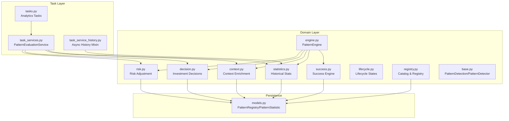

**Diagram sources**
- [engine.py:1-212](file://src/apps/patterns/domain/engine.py#L1-L212)
- [success.py:1-277](file://src/apps/patterns/domain/success.py#L1-L277)
- [statistics.py:1-276](file://src/apps/patterns/domain/statistics.py#L1-L276)
- [context.py:1-214](file://src/apps/patterns/domain/context.py#L1-L214)
- [decision.py:1-429](file://src/apps/patterns/domain/decision.py#L1-L429)
- [risk.py:1-357](file://src/apps/patterns/domain/risk.py#L1-L357)
- [lifecycle.py:1-27](file://src/apps/patterns/domain/lifecycle.py#L1-L27)
- [registry.py:1-102](file://src/apps/patterns/domain/registry.py#L1-L102)
- [base.py:1-35](file://src/apps/patterns/domain/base.py#L1-L35)
- [task_services.py:1-164](file://src/apps/patterns/task_services.py#L1-L164)
- [tasks.py:1-109](file://src/apps/patterns/tasks.py#L1-L109)
- [task_service_history.py:1-245](file://src/apps/patterns/task_service_history.py#L1-L245)
- [models.py:1-109](file://src/apps/patterns/models.py#L1-L109)

**Section sources**
- [engine.py:1-212](file://src/apps/patterns/domain/engine.py#L1-L212)
- [success.py:1-277](file://src/apps/patterns/domain/success.py#L1-L277)
- [statistics.py:1-276](file://src/apps/patterns/domain/statistics.py#L1-L276)
- [context.py:1-214](file://src/apps/patterns/domain/context.py#L1-L214)
- [decision.py:1-429](file://src/apps/patterns/domain/decision.py#L1-L429)
- [risk.py:1-357](file://src/apps/patterns/domain/risk.py#L1-L357)
- [lifecycle.py:1-27](file://src/apps/patterns/domain/lifecycle.py#L1-L27)
- [registry.py:1-102](file://src/apps/patterns/domain/registry.py#L1-L102)
- [base.py:1-35](file://src/apps/patterns/domain/base.py#L1-L35)
- [task_services.py:1-164](file://src/apps/patterns/task_services.py#L1-L164)
- [tasks.py:1-109](file://src/apps/patterns/tasks.py#L1-L109)
- [task_service_history.py:1-245](file://src/apps/patterns/task_service_history.py#L1-L245)
- [models.py:1-109](file://src/apps/patterns/models.py#L1-L109)

## Core Components
- PatternEngine: Orchestrates detection, context enrichment, success validation, and persistence of pattern signals.
- Success Engine: Loads pattern success snapshots, computes actions (disable/degrade/boost/neutral), and adjusts confidence.
- Statistics Engine: Computes rolling success rates, average returns/drawdowns, temperature, and lifecycle states; persists to PatternStatistic.
- Context Enrichment: Computes priority/context scores, regime alignment, volatility/liquidity adjustments, and cluster/cycle influences.
- Decision Engine: Aggregates signals into investment decisions with confidence and rationale.
- Risk Engine: Applies liquidity, slippage, and volatility risk adjustments to produce final signals.
- Lifecycle Management: Translates temperature and enablement into ACTIVE/EXPERIMENTAL/COOLDOWN/DISABLED states.
- Registry/Catalog: Maintains enabled patterns, CPU cost, and lifecycle state; synchronizes metadata.

**Section sources**
- [engine.py:21-212](file://src/apps/patterns/domain/engine.py#L21-L212)
- [success.py:21-277](file://src/apps/patterns/domain/success.py#L21-L277)
- [statistics.py:101-276](file://src/apps/patterns/domain/statistics.py#L101-L276)
- [context.py:22-214](file://src/apps/patterns/domain/context.py#L22-L214)
- [decision.py:242-429](file://src/apps/patterns/domain/decision.py#L242-L429)
- [risk.py:160-357](file://src/apps/patterns/domain/risk.py#L160-L357)
- [lifecycle.py:6-27](file://src/apps/patterns/domain/lifecycle.py#L6-L27)
- [registry.py:58-102](file://src/apps/patterns/domain/registry.py#L58-L102)

## Architecture Overview
The evaluation workflow runs periodically via analytics tasks and can also be invoked incrementally per coin/timeframe. It refreshes signal history, recomputes statistics, enriches contexts, evaluates decisions, and produces final risk-adjusted signals.

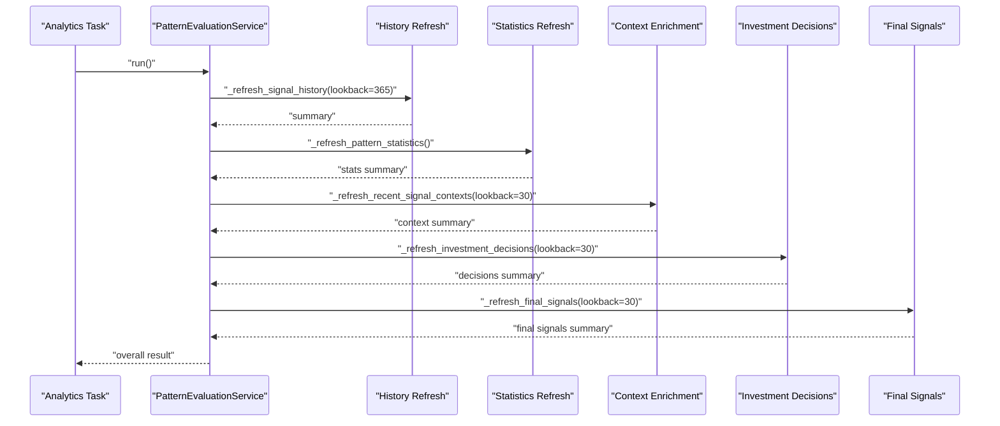

**Diagram sources**
- [task_services.py:30-44](file://src/apps/patterns/task_services.py#L30-L44)
- [task_service_history.py:32-245](file://src/apps/patterns/task_service_history.py#L32-L245)
- [statistics.py:101-276](file://src/apps/patterns/domain/statistics.py#L101-L276)
- [context.py:190-214](file://src/apps/patterns/domain/context.py#L190-L214)
- [decision.py:405-429](file://src/apps/patterns/domain/decision.py#L405-L429)
- [risk.py:335-357](file://src/apps/patterns/domain/risk.py#L335-L357)

## Detailed Component Analysis

### Pattern Detection and Confidence Adjustment
- Detection pipeline:
  - Fetches candles and current indicators.
  - Loads active detectors filtered by timeframe and lifecycle.
  - Runs each detector to produce raw PatternDetection entries.
  - Applies pattern context enrichment (regime, volatility, liquidity, sector/cycle alignment, clustering).
  - Validates against success engine (disable/degrade/boost/neutral) and clamps confidence accordingly.
  - Persists signals with priority/context/regime alignment and market regime.
- Real-time confidence adjustment:
  - Success engine returns a multiplicative factor and action.
  - Adjusted confidence is clamped to a safe range.
  - Events are published for disabled/degraded/boosted patterns.

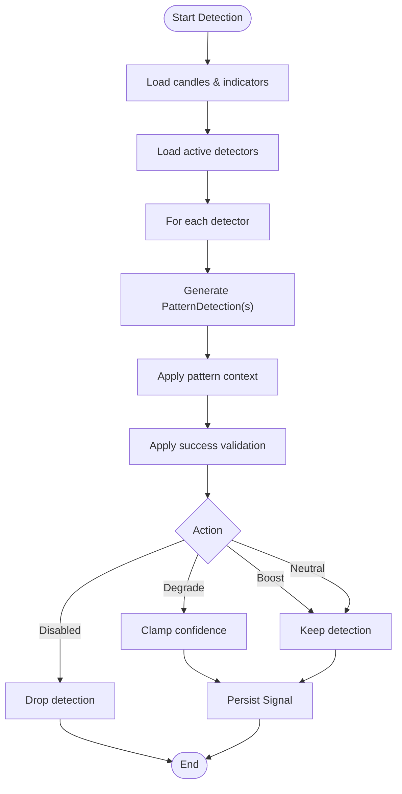

**Diagram sources**
- [engine.py:29-72](file://src/apps/patterns/domain/engine.py#L29-L72)
- [success.py:128-156](file://src/apps/patterns/domain/success.py#L128-L156)
- [success.py:200-277](file://src/apps/patterns/domain/success.py#L200-L277)
- [context.py:127-187](file://src/apps/patterns/domain/context.py#L127-L187)

**Section sources**
- [engine.py:29-148](file://src/apps/patterns/domain/engine.py#L29-L148)
- [success.py:128-277](file://src/apps/patterns/domain/success.py#L128-L277)
- [context.py:127-187](file://src/apps/patterns/domain/context.py#L127-L187)

### Success Engine: Confidence Scaling and Lifecycle Actions
- Success snapshot loading:
  - Loads from PatternStatistic by slug/timeframe/market_regime with fallback to global regime.
  - Provides total_signals, successful_signals, success_rate, avg_return, avg_drawdown, temperature, enabled.
- Decision logic:
  - Disabled if insufficient samples or below disable threshold.
  - Degrade if below degrade threshold with a scaled factor.
  - Boost if above boost threshold with a scaled factor.
  - Neutral otherwise.
- Confidence adjustment:
  - Multiplies original confidence by factor and clamps to a minimum/maximum.
  - Emits events for disabled/degraded/boosted states.
- Attributes propagation:
  - Adds success-related attributes to PatternDetection for downstream use.

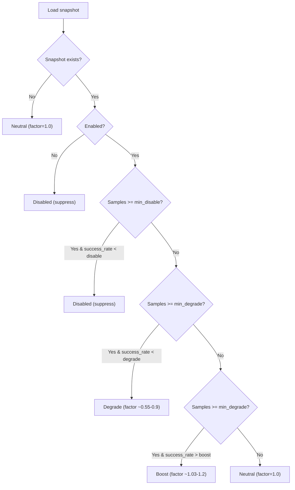

**Diagram sources**
- [success.py:48-156](file://src/apps/patterns/domain/success.py#L48-L156)
- [success.py:200-277](file://src/apps/patterns/domain/success.py#L200-L277)

**Section sources**
- [success.py:48-156](file://src/apps/patterns/domain/success.py#L48-L156)
- [success.py:200-277](file://src/apps/patterns/domain/success.py#L200-L277)

### Statistical Analysis and Rolling Windows
- Historical outcomes:
  - Selects recent pattern signals with realized returns/drawdowns.
  - Supports multiple return windows (72h/24h/result) and drawdown variants.
- Rolling window:
  - Limits outcomes to a fixed window size for recency emphasis.
- Aggregation:
  - Computes success_rate, avg_return, avg_drawdown, sample_size, last_evaluated_at.
  - Calculates temperature combining success_rate, sample_size, and days since last sample.
  - Determines enabled flag and lifecycle state.
- Persistence:
  - Upserts PatternStatistic with conflict resolution.
  - Publishes lifecycle/state change events.

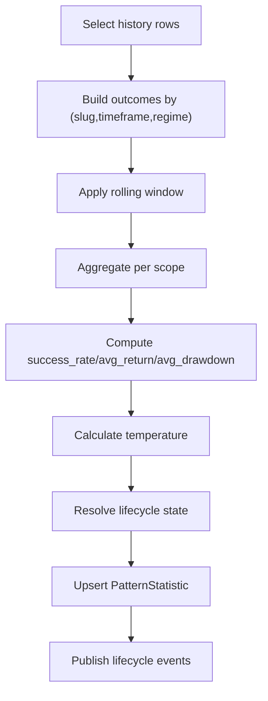

**Diagram sources**
- [statistics.py:59-124](file://src/apps/patterns/domain/statistics.py#L59-L124)
- [statistics.py:126-276](file://src/apps/patterns/domain/statistics.py#L126-L276)

**Section sources**
- [statistics.py:59-124](file://src/apps/patterns/domain/statistics.py#L59-L124)
- [statistics.py:126-276](file://src/apps/patterns/domain/statistics.py#L126-L276)

### Context Enrichment and Priority Scoring
- Factors:
  - Regime alignment (bull/bear/sideways/high/low volatility).
  - Volatility alignment (ATR/Bollinger context).
  - Liquidity score (volume/market cap).
  - Sector alignment and cycle alignment.
  - Cluster bonus for co-occurring patterns.
- Scores:
  - context_score = temperature × alignment × liquidity × cluster_bonus × sector × cycle.
  - priority_score = confidence × pattern_temperature × regime_alignment × volatility_alignment × liquidity_score.

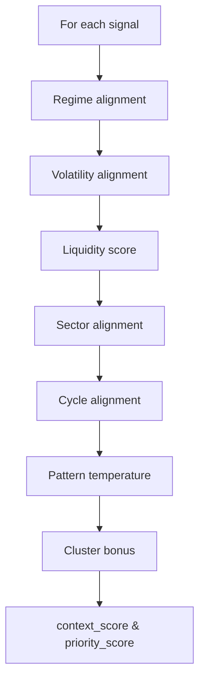

**Diagram sources**
- [context.py:127-187](file://src/apps/patterns/domain/context.py#L127-L187)

**Section sources**
- [context.py:127-187](file://src/apps/patterns/domain/context.py#L127-L187)

### Investment Decisions and Risk Adjustment
- Decision factors:
  - Aggregated signal priority, regime alignment, sector strength, cycle alignment, historical pattern success, strategy alignment.
- Score and decision:
  - Combined score multiplied by factors; mapped to STRONG_BUY/BUY/ACCUMULATE/HOLD/REDUCE/SELL/STRONG_SELL.
  - Confidence derived from score, bias ratio, and stability factors.
- Risk adjustment:
  - Liquidity, slippage risk, and volatility risk reduce decision score/confidence to produce final signal.
  - Publishes final signal with rationale.

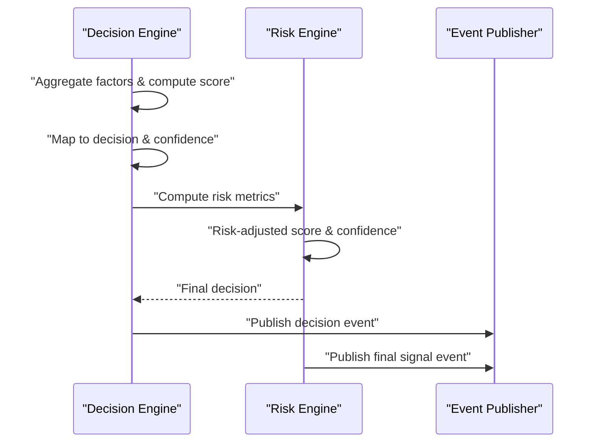

**Diagram sources**
- [decision.py:242-389](file://src/apps/patterns/domain/decision.py#L242-L389)
- [risk.py:235-322](file://src/apps/patterns/domain/risk.py#L235-L322)

**Section sources**
- [decision.py:242-389](file://src/apps/patterns/domain/decision.py#L242-L389)
- [risk.py:235-322](file://src/apps/patterns/domain/risk.py#L235-L322)

### Lifecycle Management
- Temperature-based transitions:
  - Disabled if temperature low or disabled by policy.
  - Cooldown for weak temperature.
  - Experimental for near-zero temperature.
  - Active otherwise.
- Registry synchronization:
  - Ensures PatternRegistry entries exist and are enabled.
  - Updates lifecycle_state and publishes state change events.

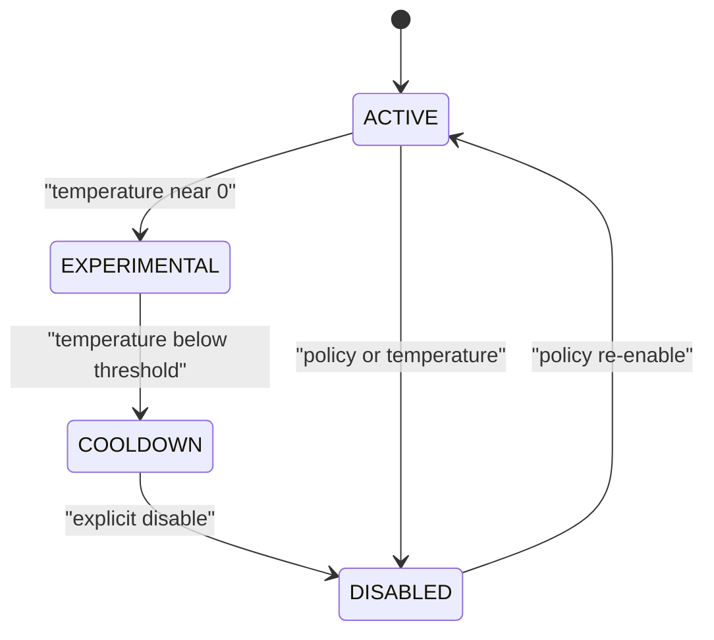

**Diagram sources**
- [lifecycle.py:6-27](file://src/apps/patterns/domain/lifecycle.py#L6-L27)
- [statistics.py:172-200](file://src/apps/patterns/domain/statistics.py#L172-L200)

**Section sources**
- [lifecycle.py:6-27](file://src/apps/patterns/domain/lifecycle.py#L6-L27)
- [statistics.py:172-200](file://src/apps/patterns/domain/statistics.py#L172-L200)

### Evaluation Workflow Orchestration
- Periodic job:
  - Analytics task acquires a distributed lock, runs PatternEvaluationService, and refreshes history, statistics, context, decisions, and final signals.
- Incremental detection:
  - PatternEngine.detect_incremental loads candles, builds indicators, detects patterns, validates success, and persists signals.

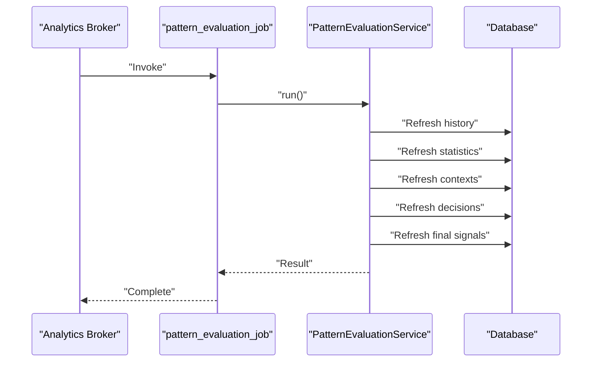

**Diagram sources**
- [tasks.py:36-55](file://src/apps/patterns/tasks.py#L36-L55)
- [task_services.py:30-44](file://src/apps/patterns/task_services.py#L30-L44)

**Section sources**
- [tasks.py:36-55](file://src/apps/patterns/tasks.py#L36-L55)
- [task_services.py:30-44](file://src/apps/patterns/task_services.py#L30-L44)

## Dependency Analysis
Key dependencies and coupling:
- PatternEngine depends on:
  - Detector registry and lifecycle.
  - Success engine for confidence scaling and suppression.
  - Context enrichment for priority/context scores.
  - Persistence models for Signal storage.
- Success engine depends on:
  - PatternStatistic for snapshot retrieval and caching.
  - Event publishing for state transitions.
- Statistics engine depends on:
  - SignalHistory for outcomes.
  - PatternRegistry for lifecycle updates.
  - Event publishing for state transitions.
- Decision and risk engines depend on:
  - Latest signals and metrics for aggregation and risk metrics.

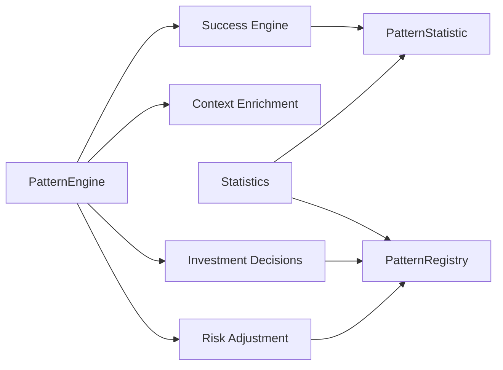

**Diagram sources**
- [engine.py:29-72](file://src/apps/patterns/domain/engine.py#L29-L72)
- [success.py:48-156](file://src/apps/patterns/domain/success.py#L48-L156)
- [statistics.py:101-276](file://src/apps/patterns/domain/statistics.py#L101-L276)
- [decision.py:242-389](file://src/apps/patterns/domain/decision.py#L242-L389)
- [risk.py:235-322](file://src/apps/patterns/domain/risk.py#L235-L322)
- [models.py:75-99](file://src/apps/patterns/models.py#L75-L99)

**Section sources**
- [engine.py:29-72](file://src/apps/patterns/domain/engine.py#L29-L72)
- [success.py:48-156](file://src/apps/patterns/domain/success.py#L48-L156)
- [statistics.py:101-276](file://src/apps/patterns/domain/statistics.py#L101-L276)
- [decision.py:242-389](file://src/apps/patterns/domain/decision.py#L242-L389)
- [risk.py:235-322](file://src/apps/patterns/domain/risk.py#L235-L322)
- [models.py:75-99](file://src/apps/patterns/models.py#L75-L99)

## Performance Considerations
- Caching:
  - Success cache reduces repeated database queries for snapshots across a batch.
- Batched refresh:
  - Context enrichment operates over grouped timestamps to minimize repeated work.
- Locking:
  - Distributed locks prevent concurrent evaluation runs.
- Upsert strategy:
  - PostgreSQL ON CONFLICT DO UPDATE minimizes churn and improves throughput.
- Early exits:
  - Detection skips coins with insufficient candles or disabled features.
- Rolling window:
  - Limits computational scope to recent outcomes.

[No sources needed since this section provides general guidance]

## Troubleshooting Guide
Common issues and diagnostics:
- No detections produced:
  - Insufficient candles or missing indicators.
  - Detectors disabled or unsupported timeframe.
  - Success validation suppressed due to low success rate or disabled state.
- Low confidence after adjustment:
  - Success engine degraded confidence; check success_rate and sample_size.
- Decisions unchanged:
  - Score/confidence deltas below thresholds; review factors and recent changes.
- Final signals unchanged:
  - Risk-adjusted score/confidence unchanged; check liquidity/slippage/volatility metrics.
- Lifecycle state changes:
  - Review temperature and aggregate success_rate; confirm registry updates.

**Section sources**
- [engine.py:123-148](file://src/apps/patterns/domain/engine.py#L123-L148)
- [success.py:143-156](file://src/apps/patterns/domain/success.py#L143-L156)
- [decision.py:342-358](file://src/apps/patterns/domain/decision.py#L342-L358)
- [risk.py:274-291](file://src/apps/patterns/domain/risk.py#L274-L291)
- [statistics.py:221-276](file://src/apps/patterns/domain/statistics.py#L221-L276)

## Conclusion
The pattern evaluation and scoring system combines real-time detection, contextual enrichment, historical success analysis, and risk-aware decision-making. It uses rolling windows, temperature-based lifecycle management, and event-driven feedback to continuously adapt pattern confidence and operational state. The modular design enables incremental improvements and robust performance through caching, batching, and upsert strategies.

[No sources needed since this section summarizes without analyzing specific files]

## Appendices

### Evaluation Parameters and Thresholds
- Success thresholds:
  - Disable success rate threshold.
  - Degrade success rate threshold.
  - Boost success rate threshold.
- Sample thresholds:
  - Minimum samples to disable.
  - Minimum samples to degrade/boost.
- Confidence clamping:
  - Lower and upper bounds for adjusted confidence.
- Rolling window:
  - Fixed number of recent outcomes considered.

**Section sources**
- [success.py:12-18](file://src/apps/patterns/domain/success.py#L12-L18)
- [success.py:143-156](file://src/apps/patterns/domain/success.py#L143-L156)
- [statistics.py:31-32](file://src/apps/patterns/domain/statistics.py#L31-L32)
- [statistics.py:91-98](file://src/apps/patterns/domain/statistics.py#L91-L98)

### Data Models Overview
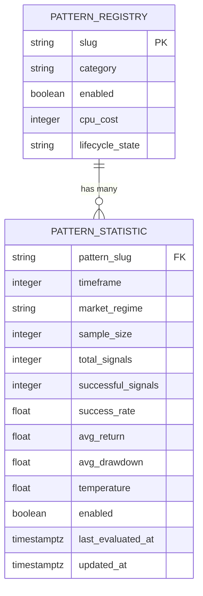

**Diagram sources**
- [models.py:54-99](file://src/apps/patterns/models.py#L54-L99)