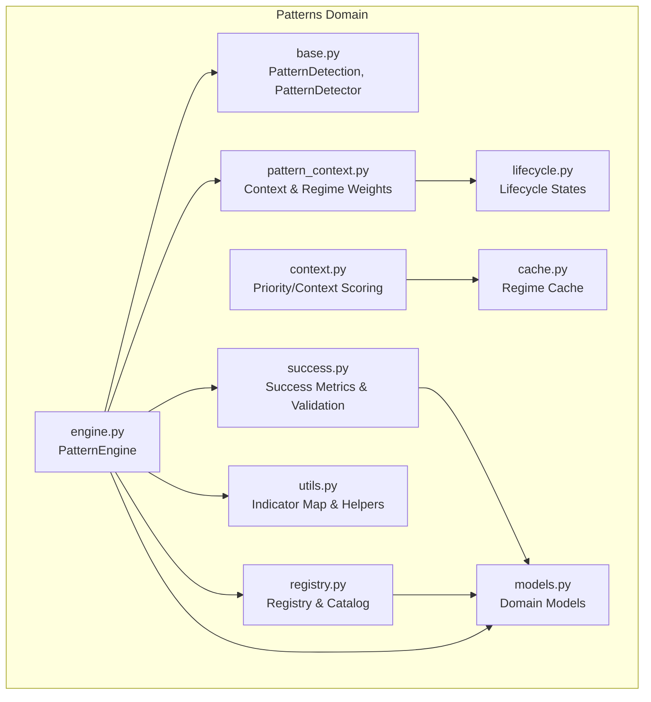
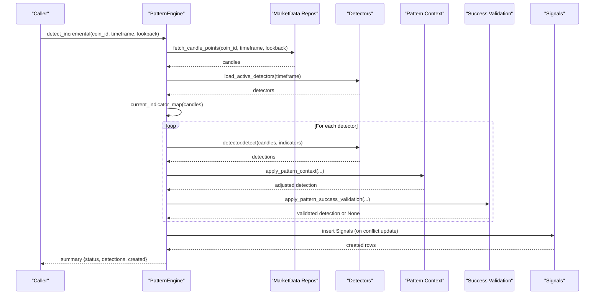
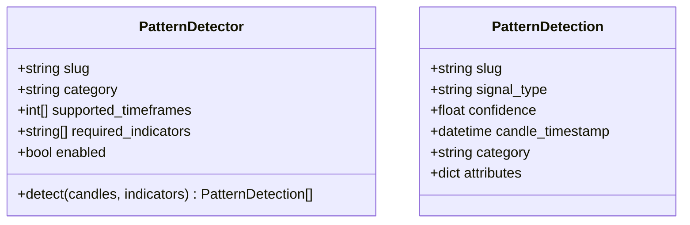
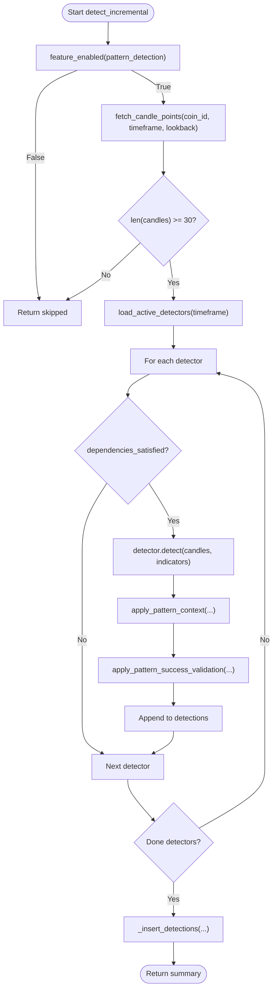
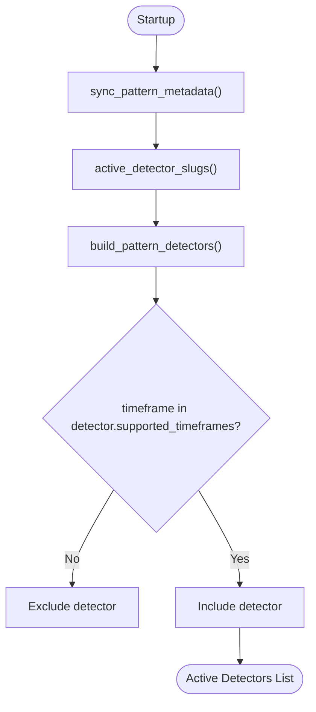
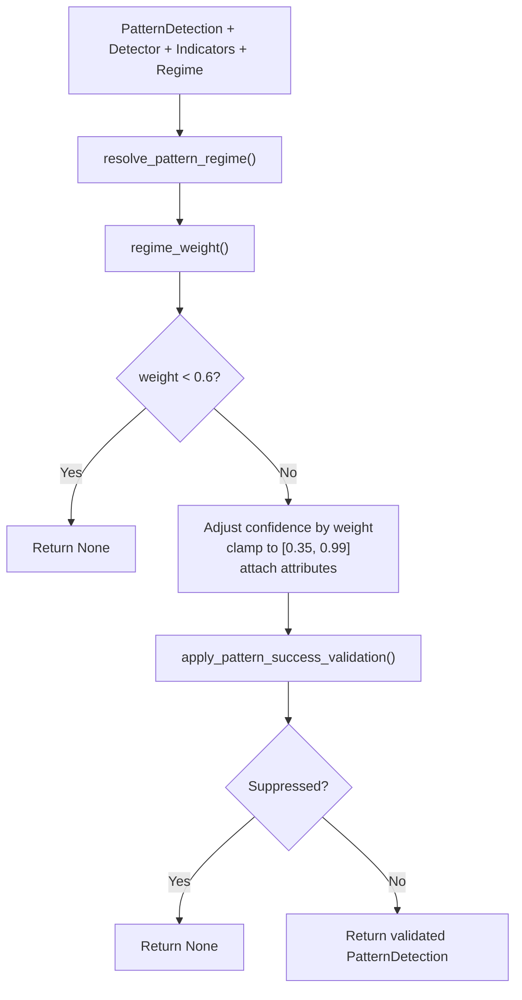
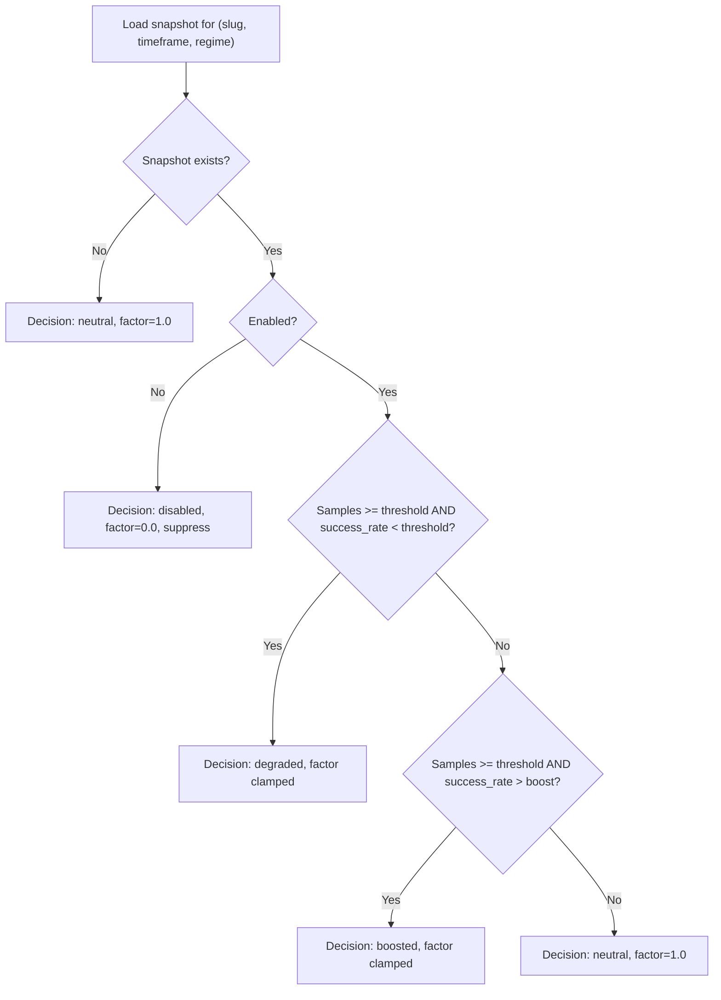
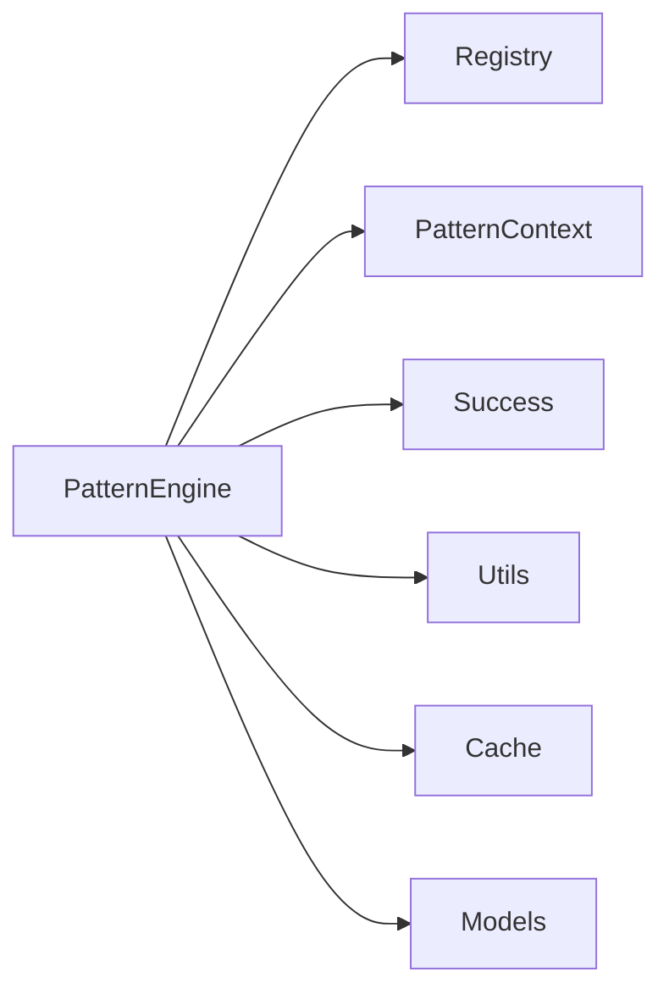

# Pattern Recognition Engine

<cite>
**Referenced Files in This Document**
- [engine.py](file://src/apps/patterns/domain/engine.py)
- [base.py](file://src/apps/patterns/domain/base.py)
- [registry.py](file://src/apps/patterns/domain/registry.py)
- [pattern_context.py](file://src/apps/patterns/domain/pattern_context.py)
- [context.py](file://src/apps/patterns/domain/context.py)
- [success.py](file://src/apps/patterns/domain/success.py)
- [lifecycle.py](file://src/apps/patterns/domain/lifecycle.py)
- [utils.py](file://src/apps/patterns/domain/utils.py)
- [cache.py](file://src/apps/patterns/cache.py)
- [models.py](file://src/apps/patterns/models.py)
- [services.py](file://src/apps/patterns/services.py)
</cite>

## Table of Contents
1. [Introduction](#introduction)
2. [Project Structure](#project-structure)
3. [Core Components](#core-components)
4. [Architecture Overview](#architecture-overview)
5. [Detailed Component Analysis](#detailed-component-analysis)
6. [Dependency Analysis](#dependency-analysis)
7. [Performance Considerations](#performance-considerations)
8. [Troubleshooting Guide](#troubleshooting-guide)
9. [Conclusion](#conclusion)
10. [Appendices](#appendices)

## Introduction
This document describes the pattern recognition engine responsible for multi-dimensional pattern detection across continuation, momentum, structural, volatility, and volume categories. It explains the detector architecture, scoring and confidence calculation, pattern evaluation workflows, registry and lifecycle management, multi-timeframe analysis (15m–240m), pattern context enrichment, success metrics, caching strategies, performance optimizations, and real-time discovery. It also covers visualization, historical analysis, and lifecycle management.

## Project Structure
The pattern recognition subsystem is organized around a domain-driven engine, a detector abstraction, a registry and lifecycle system, context enrichment, success-based validation, and supporting utilities and caches.

**Diagram sources**
- [engine.py:21-212](file://src/apps/patterns/domain/engine.py#L21-L212)
- [base.py:11-35](file://src/apps/patterns/domain/base.py#L11-L35)
- [registry.py:15-102](file://src/apps/patterns/domain/registry.py#L15-L102)
- [pattern_context.py:69-180](file://src/apps/patterns/domain/pattern_context.py#L69-L180)
- [context.py:22-214](file://src/apps/patterns/domain/context.py#L22-L214)
- [success.py:21-277](file://src/apps/patterns/domain/success.py#L21-L277)
- [lifecycle.py:6-27](file://src/apps/patterns/domain/lifecycle.py#L6-L27)
- [utils.py:117-157](file://src/apps/patterns/domain/utils.py#L117-L157)
- [cache.py:16-109](file://src/apps/patterns/cache.py#L16-L109)
- [models.py:15-109](file://src/apps/patterns/models.py#L15-L109)

**Section sources**
- [engine.py:21-212](file://src/apps/patterns/domain/engine.py#L21-L212)
- [registry.py:15-102](file://src/apps/patterns/domain/registry.py#L15-L102)
- [models.py:15-109](file://src/apps/patterns/models.py#L15-L109)

## Core Components
- PatternEngine orchestrates detection, context enrichment, and success validation across multiple timeframes and detectors.
- PatternDetector defines the interface for pattern-specific detectors.
- PatternDetection encapsulates detection results with confidence and attributes.
- Registry and lifecycle manage detector activation, CPU cost, and state transitions.
- Context enrichment computes priority scores and context scores using regime, volatility, liquidity, sector/cycle alignment, and pattern temperature.
- Success metrics drive dynamic confidence adjustments and suppression decisions.
- Utilities compute indicator maps and helper functions for pattern logic.
- Cache stores short-lived regime snapshots to avoid repeated computation.

**Section sources**
- [engine.py:29-148](file://src/apps/patterns/domain/engine.py#L29-L148)
- [base.py:21-35](file://src/apps/patterns/domain/base.py#L21-L35)
- [registry.py:80-102](file://src/apps/patterns/domain/registry.py#L80-L102)
- [context.py:22-187](file://src/apps/patterns/domain/context.py#L22-L187)
- [success.py:191-277](file://src/apps/patterns/domain/success.py#L191-L277)
- [utils.py:117-157](file://src/apps/patterns/domain/utils.py#L117-L157)
- [cache.py:67-109](file://src/apps/patterns/cache.py#L67-L109)

## Architecture Overview
The engine runs incremental detection per coin/timeframe, loads active detectors from the registry, computes indicators, applies pattern context, validates against success metrics, and persists signals.

**Diagram sources**
- [engine.py:114-148](file://src/apps/patterns/domain/engine.py#L114-L148)
- [engine.py:29-72](file://src/apps/patterns/domain/engine.py#L29-L72)
- [registry.py:94-102](file://src/apps/patterns/domain/registry.py#L94-L102)
- [pattern_context.py:153-180](file://src/apps/patterns/domain/pattern_context.py#L153-L180)
- [success.py:191-277](file://src/apps/patterns/domain/success.py#L191-L277)

## Detailed Component Analysis

### Detector Abstraction and Detection Model
- PatternDetector defines shared metadata (slug, category, supported timeframes, required indicators) and the detect method.
- PatternDetection carries detection identity, confidence, timestamp, category, and attributes.

**Diagram sources**
- [base.py:21-35](file://src/apps/patterns/domain/base.py#L21-L35)
- [base.py:11-19](file://src/apps/patterns/domain/base.py#L11-L19)

**Section sources**
- [base.py:11-35](file://src/apps/patterns/domain/base.py#L11-L35)

### PatternEngine: Multi-Timeframe Detection and Persistence
- Supports 15m (15), 60m (60), 240m (240), and 1440m (1d) timeframes.
- Loads active detectors per timeframe, computes indicators, detects, enriches context, validates success, and inserts/upserts signals.

Key behaviors:
- detect: iterates detectors, checks enabled/support and dependencies, applies context and success validation, collects results.
- detect_incremental: fetches candles, ensures minimum length, runs detect, persists results.
- bootstrap_coin: iterates configured intervals, detects over rolling windows, persists aggregated results.

**Diagram sources**
- [engine.py:114-148](file://src/apps/patterns/domain/engine.py#L114-L148)
- [engine.py:29-72](file://src/apps/patterns/domain/engine.py#L29-L72)
- [registry.py:94-102](file://src/apps/patterns/domain/registry.py#L94-L102)
- [pattern_context.py:78-92](file://src/apps/patterns/domain/pattern_context.py#L78-L92)
- [success.py:191-277](file://src/apps/patterns/domain/success.py#L191-L277)

**Section sources**
- [engine.py:29-212](file://src/apps/patterns/domain/engine.py#L29-L212)

### Pattern Registry and Lifecycle Management
- Catalog enumerates detectors and assigns CPU costs; metadata synced into PatternRegistry and PatternFeature tables.
- Active detectors are filtered by lifecycle state and enabled flag.
- Lifecycle states: ACTIVE, EXPERIMENTAL, COOLDOWN, DISABLED; detection allowed only when enabled and not in COOLDOWN/DISABLED.

**Diagram sources**
- [registry.py:58-102](file://src/apps/patterns/domain/registry.py#L58-L102)
- [lifecycle.py:6-27](file://src/apps/patterns/domain/lifecycle.py#L6-L27)

**Section sources**
- [registry.py:15-102](file://src/apps/patterns/domain/registry.py#L15-L102)
- [lifecycle.py:13-27](file://src/apps/patterns/domain/lifecycle.py#L13-L27)

### Pattern Context and Confidence Adjustment
- Dependencies: detectors may require trend (EMA/SMA) and/or volume indicators; missing dependencies suppress detection.
- Regime weights adjust confidence based on pattern category and detected regime; very low weights filter out weak signals.
- Context scoring augments confidence with regime alignment, volatility alignment, liquidity score, sector/cycle alignment, and cluster bonus; priority score computed as product.

**Diagram sources**
- [pattern_context.py:153-180](file://src/apps/patterns/domain/pattern_context.py#L153-L180)
- [pattern_context.py:69-92](file://src/apps/patterns/domain/pattern_context.py#L69-L92)
- [context.py:127-187](file://src/apps/patterns/domain/context.py#L127-L187)

**Section sources**
- [pattern_context.py:69-180](file://src/apps/patterns/domain/pattern_context.py#L69-L180)
- [context.py:22-187](file://src/apps/patterns/domain/context.py#L22-L187)

### Success Metrics and Dynamic Confidence
- Success snapshots capture total signals, successful signals, success rate, average return/drawdown, temperature, and enablement.
- Decisions: disabled (suppress), degraded (lower confidence), boosted (raise confidence), neutral (no change).
- Events published for disabled/degraded/boosted actions with enriched attributes.

**Diagram sources**
- [success.py:48-156](file://src/apps/patterns/domain/success.py#L48-L156)
- [success.py:191-277](file://src/apps/patterns/domain/success.py#L191-L277)

**Section sources**
- [success.py:21-277](file://src/apps/patterns/domain/success.py#L21-L277)

### Indicator Map and Utilities
- current_indicator_map computes canonical technical indicators (EMAs, SMAs, RSI, MACD, ATR, Bollinger Bands, ADX) and volume stats.
- Helper functions support pivot finding, slope, ratios, and tolerance comparisons.

**Section sources**
- [utils.py:117-157](file://src/apps/patterns/domain/utils.py#L117-L157)

### Pattern Visualization, Historical Analysis, and Lifecycle
- Historical bootstrapping scans configured intervals and detects over rolling windows, persisting aggregated signals.
- Context enrichment updates signals with context and priority scores for downstream visualization and selection.
- Lifecycle state resolves based on temperature and enablement to govern detection availability.

**Section sources**
- [engine.py:158-212](file://src/apps/patterns/domain/engine.py#L158-L212)
- [context.py:127-187](file://src/apps/patterns/domain/context.py#L127-L187)
- [lifecycle.py:17-27](file://src/apps/patterns/domain/lifecycle.py#L17-L27)

## Dependency Analysis
- PatternEngine depends on:
  - Registry for active detectors
  - PatternContext for regime and dependency checks
  - Success for confidence adjustment and suppression
  - Utils for indicator computation
  - Cache for regime snapshots
  - Models for persistence and statistics

**Diagram sources**
- [engine.py:29-72](file://src/apps/patterns/domain/engine.py#L29-L72)
- [registry.py:94-102](file://src/apps/patterns/domain/registry.py#L94-L102)
- [pattern_context.py:153-180](file://src/apps/patterns/domain/pattern_context.py#L153-L180)
- [success.py:191-277](file://src/apps/patterns/domain/success.py#L191-L277)
- [utils.py:117-157](file://src/apps/patterns/domain/utils.py#L117-L157)
- [cache.py:67-109](file://src/apps/patterns/cache.py#L67-L109)
- [models.py:75-109](file://src/apps/patterns/models.py#L75-L109)

**Section sources**
- [engine.py:29-212](file://src/apps/patterns/domain/engine.py#L29-L212)
- [models.py:75-109](file://src/apps/patterns/models.py#L75-L109)

## Performance Considerations
- Feature gating: detection is skipped early if pattern_detection is disabled.
- Minimum candle threshold: skips runs with insufficient data.
- Registry filtering: only enabled and lifecycle-allowed detectors participate.
- Indicator caching: current_indicator_map computes a single pass over candle series per detection cycle.
- Success cache: snapshot cache avoids repeated DB queries for the same (slug, regime) tuples.
- Priority score computation: vectorized multipliers reduce post-hoc filtering overhead.
- Bootstrapping: rolling windows over retention bars amortize per-bar computation.

[No sources needed since this section provides general guidance]

## Troubleshooting Guide
Common issues and remedies:
- No detections found:
  - Verify pattern_detection feature is enabled.
  - Confirm sufficient candles and valid timeframe.
  - Ensure active detectors exist for the timeframe.
- Low confidence or suppressed signals:
  - Check success metrics thresholds and sample sizes.
  - Review regime alignment and volatility/liquidity conditions.
- Missing dependencies:
  - Ensure required indicators (trend/volume) are present in the indicator map.
- Context enrichment not applied:
  - Confirm signals exist and enrich_signal_context is invoked for the target coin/timeframe/timestamp group.

**Section sources**
- [engine.py:123-129](file://src/apps/patterns/domain/engine.py#L123-L129)
- [registry.py:80-102](file://src/apps/patterns/domain/registry.py#L80-L102)
- [pattern_context.py:78-92](file://src/apps/patterns/domain/pattern_context.py#L78-L92)
- [success.py:143-156](file://src/apps/patterns/domain/success.py#L143-L156)
- [context.py:127-187](file://src/apps/patterns/domain/context.py#L127-L187)

## Conclusion
The pattern recognition engine integrates a modular detector framework, robust context enrichment, and success-driven confidence adjustments to deliver reliable multi-timeframe pattern detection. Its registry and lifecycle system enable safe experimentation and scaling, while caching and batch operations optimize performance. The architecture supports real-time discovery and historical bootstrapping, enabling both live trading and backtesting workflows.

## Appendices

### Multi-Timeframe Support
- Supported intervals: 15m, 60m, 240m, 1440m.
- Bootstrapping iterates configured intervals per coin and detects over rolling windows.

**Section sources**
- [engine.py:22-27](file://src/apps/patterns/domain/engine.py#L22-L27)
- [engine.py:172-183](file://src/apps/patterns/domain/engine.py#L172-L183)

### Pattern Categories Covered
- Continuation, Momentum, Structural, Volatility, Volume.
- Category-based CPU cost and lifecycle classification.

**Section sources**
- [registry.py:31-55](file://src/apps/patterns/domain/registry.py#L31-L55)

### Pattern Registry Administration
- Update feature flags and pattern entries via admin service.
- Enforce lifecycle state normalization and CPU cost bounds.

**Section sources**
- [services.py:17-65](file://src/apps/patterns/services.py#L17-L65)