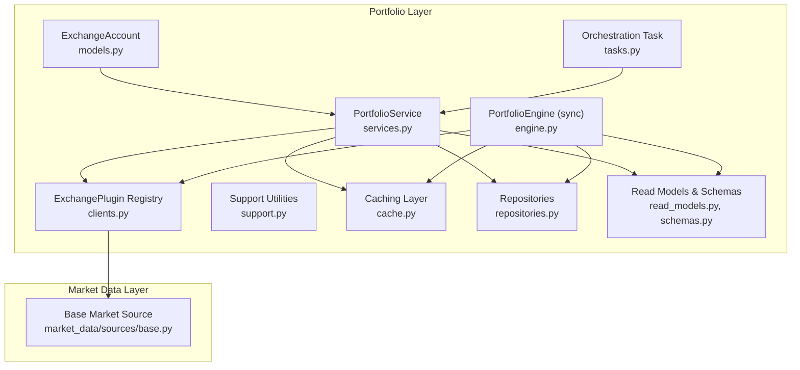
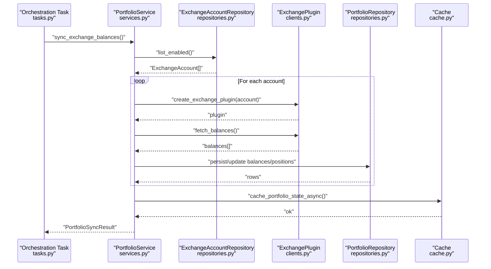
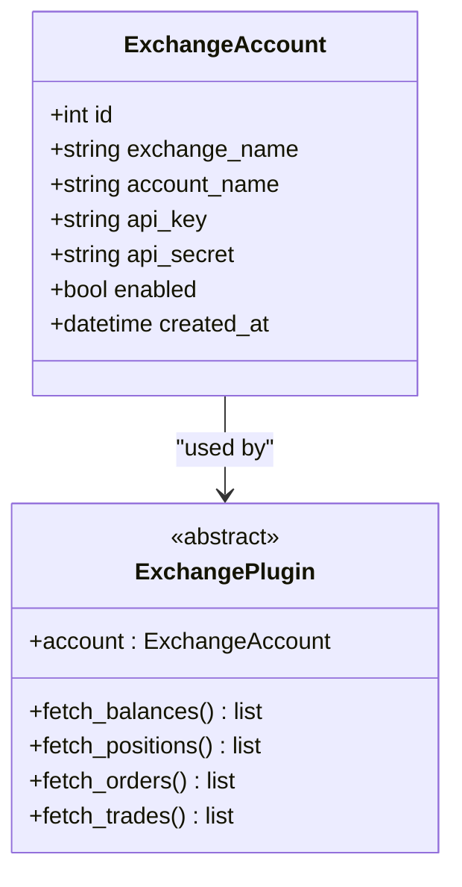
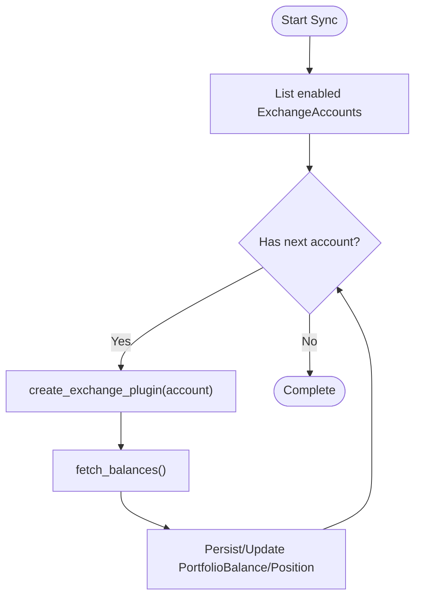
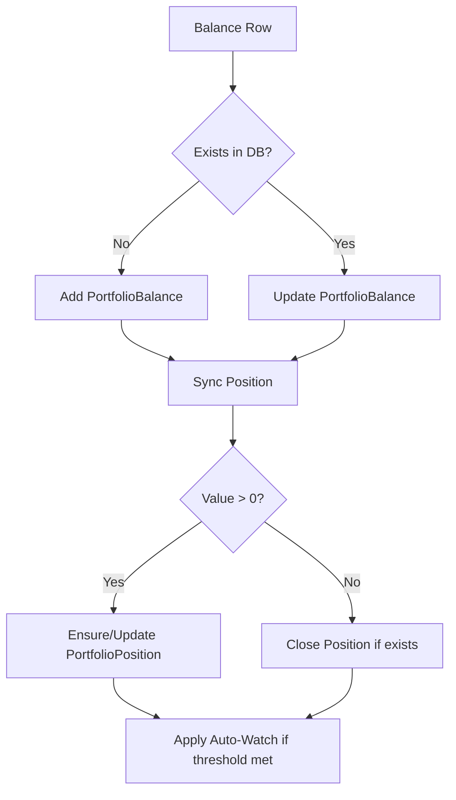
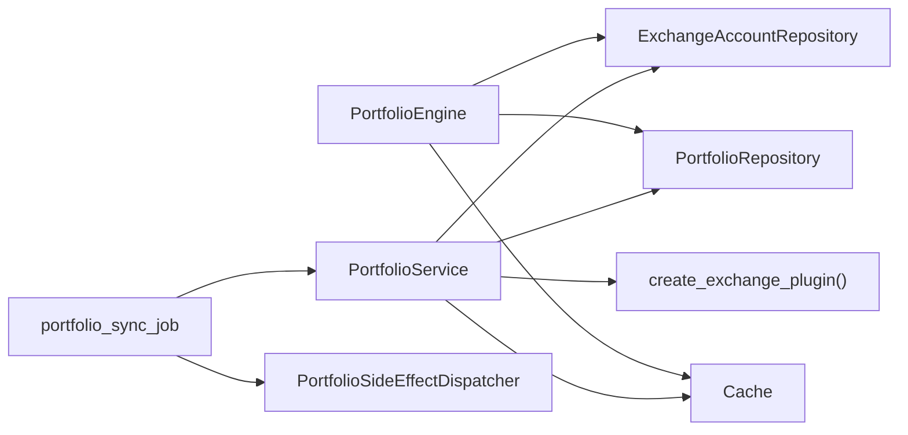
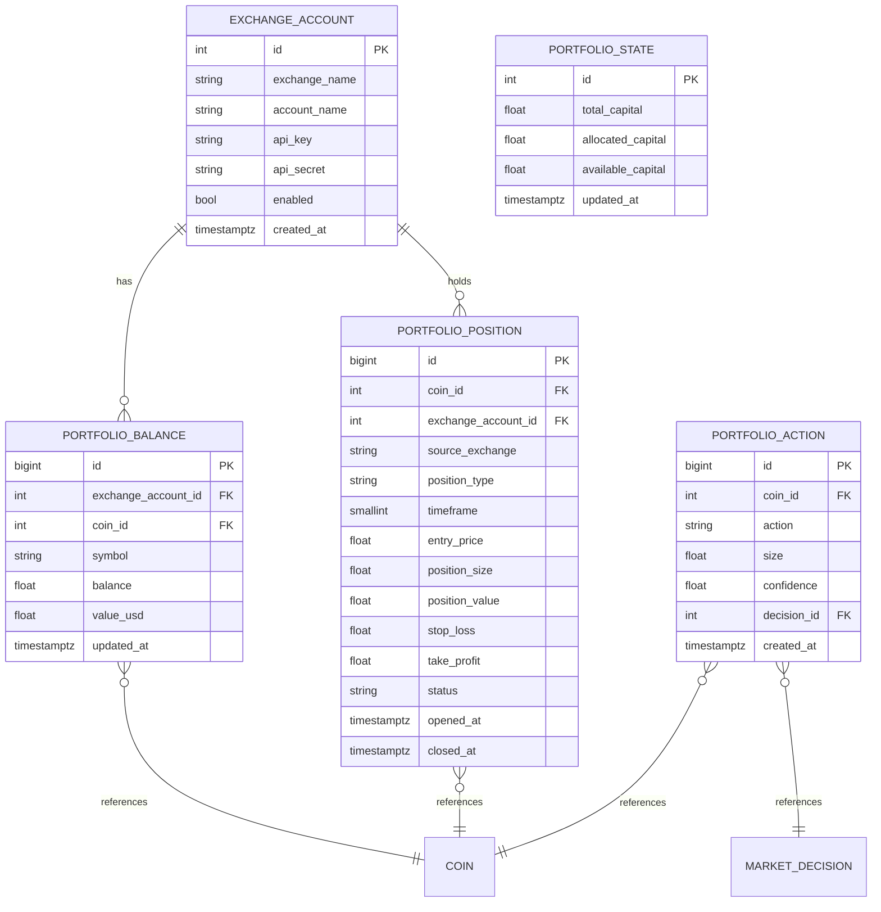

# Exchange Integration

<cite>
**Referenced Files in This Document**
- [models.py](file://src/apps/portfolio/models.py)
- [schemas.py](file://src/apps/portfolio/schemas.py)
- [services.py](file://src/apps/portfolio/services.py)
- [engine.py](file://src/apps/portfolio/engine.py)
- [clients.py](file://src/apps/portfolio/clients.py)
- [support.py](file://src/apps/portfolio/support.py)
- [cache.py](file://src/apps/portfolio/cache.py)
- [repositories.py](file://src/apps/portfolio/repositories.py)
- [read_models.py](file://src/apps/portfolio/read_models.py)
- [tasks.py](file://src/apps/portfolio/tasks.py)
- [base.py](file://src/apps/market_data/sources/base.py)
</cite>

## Table of Contents
1. [Introduction](#introduction)
2. [Project Structure](#project-structure)
3. [Core Components](#core-components)
4. [Architecture Overview](#architecture-overview)
5. [Detailed Component Analysis](#detailed-component-analysis)
6. [Dependency Analysis](#dependency-analysis)
7. [Performance Considerations](#performance-considerations)
8. [Troubleshooting Guide](#troubleshooting-guide)
9. [Conclusion](#conclusion)
10. [Appendices](#appendices)

## Introduction
This document describes the exchange integration layer for portfolio management. It explains how the system configures exchange accounts, authenticates via API credentials, coordinates multiple exchanges, and synchronizes balances and positions. It also documents order-related concepts, fee structures, and trading restrictions as applicable to the current implementation, along with balance synchronization, position tracking, order execution workflows, health monitoring, failover mechanisms, connectivity handling, configuration examples for major exchanges, rate limiting, and error handling strategies.

## Project Structure
The portfolio module organizes exchange integration around a plugin abstraction, a service layer orchestrating sync and actions, repositories for persistence, and caches for fast reads. Market data sources provide a reusable pattern for rate-limited HTTP access that can inspire exchange client implementations.

**Diagram sources**
- [models.py:16-128](file://src/apps/portfolio/models.py#L16-L128)
- [services.py:173-706](file://src/apps/portfolio/services.py#L173-L706)
- [engine.py:456-555](file://src/apps/portfolio/engine.py#L456-L555)
- [clients.py:9-93](file://src/apps/portfolio/clients.py#L9-L93)
- [support.py:1-79](file://src/apps/portfolio/support.py#L1-79)
- [cache.py:1-110](file://src/apps/portfolio/cache.py#L1-L110)
- [repositories.py:15-222](file://src/apps/portfolio/repositories.py#L15-L222)
- [read_models.py:8-125](file://src/apps/portfolio/read_models.py#L8-L125)
- [tasks.py:11-22](file://src/apps/portfolio/tasks.py#L11-L22)
- [base.py:50-157](file://src/apps/market_data/sources/base.py#L50-L157)

**Section sources**
- [models.py:16-128](file://src/apps/portfolio/models.py#L16-L128)
- [services.py:173-706](file://src/apps/portfolio/services.py#L173-L706)
- [engine.py:456-555](file://src/apps/portfolio/engine.py#L456-L555)
- [clients.py:9-93](file://src/apps/portfolio/clients.py#L9-L93)
- [support.py:1-79](file://src/apps/portfolio/support.py#L1-L79)
- [cache.py:1-110](file://src/apps/portfolio/cache.py#L1-L110)
- [repositories.py:15-222](file://src/apps/portfolio/repositories.py#L15-L222)
- [read_models.py:8-125](file://src/apps/portfolio/read_models.py#L8-L125)
- [tasks.py:11-22](file://src/apps/portfolio/tasks.py#L11-L22)
- [base.py:50-157](file://src/apps/market_data/sources/base.py#L50-L157)

## Core Components
- ExchangeAccount: Stores exchange credentials and enables/disables accounts.
- ExchangePlugin: Abstract interface for fetching balances, positions, orders, and trades; registry maps exchange names to implementations.
- PortfolioService: Orchestrates portfolio actions and exchange balance sync, emits events, and updates caches.
- PortfolioEngine: Legacy synchronous counterpart to PortfolioService for balance sync.
- Support utilities: Position sizing, stop-loss/take-profit calculation, constants.
- Repositories: Typed repositories for persistence of portfolio state, balances, positions, and actions.
- Caching: Redis-backed cache for portfolio state and balances, with sync and async variants.
- Orchestration task: Periodic job to synchronize balances with distributed locking.

**Section sources**
- [models.py:16-128](file://src/apps/portfolio/models.py#L16-L128)
- [clients.py:9-93](file://src/apps/portfolio/clients.py#L9-L93)
- [services.py:173-706](file://src/apps/portfolio/services.py#L173-L706)
- [engine.py:456-555](file://src/apps/portfolio/engine.py#L456-L555)
- [support.py:1-79](file://src/apps/portfolio/support.py#L1-L79)
- [repositories.py:15-222](file://src/apps/portfolio/repositories.py#L15-L222)
- [cache.py:1-110](file://src/apps/portfolio/cache.py#L1-L110)
- [tasks.py:11-22](file://src/apps/portfolio/tasks.py#L11-L22)

## Architecture Overview
The exchange integration layer centers on a plugin architecture. PortfolioService iterates enabled ExchangeAccounts, creates a plugin per account, and fetches balances. It persists balances and positions, recalculates portfolio state, and publishes events. The orchestration task coordinates periodic sync with a distributed lock.

**Diagram sources**
- [tasks.py:11-22](file://src/apps/portfolio/tasks.py#L11-L22)
- [services.py:433-463](file://src/apps/portfolio/services.py#L433-L463)
- [repositories.py:19-36](file://src/apps/portfolio/repositories.py#L19-L36)
- [clients.py:41-45](file://src/apps/portfolio/clients.py#L41-L45)
- [cache.py:60-65](file://src/apps/portfolio/cache.py#L60-L65)

## Detailed Component Analysis

### Exchange Account Configuration
- ExchangeAccount stores exchange_name, account_name, API keys, enable flag, and timestamps.
- Enabled accounts are enumerated for synchronization.
- The plugin registry selects the appropriate implementation based on exchange_name.

**Diagram sources**
- [models.py:16-46](file://src/apps/portfolio/models.py#L16-L46)
- [clients.py:9-28](file://src/apps/portfolio/clients.py#L9-L28)

**Section sources**
- [models.py:16-46](file://src/apps/portfolio/models.py#L16-L46)
- [repositories.py:19-36](file://src/apps/portfolio/repositories.py#L19-L36)
- [clients.py:41-45](file://src/apps/portfolio/clients.py#L41-L45)

### API Authentication and Multi-Exchange Coordination
- Authentication is handled by the ExchangePlugin implementation for each exchange. The current built-in plugins return empty lists; production deployments must implement real exchange clients.
- Multi-exchange coordination occurs by iterating enabled accounts and invoking the plugin’s fetch methods. Results are merged into portfolio balances and positions.

**Diagram sources**
- [services.py:433-463](file://src/apps/portfolio/services.py#L433-L463)
- [engine.py:456-555](file://src/apps/portfolio/engine.py#L456-L555)
- [clients.py:41-45](file://src/apps/portfolio/clients.py#L41-L45)

**Section sources**
- [services.py:433-463](file://src/apps/portfolio/services.py#L433-L463)
- [engine.py:456-555](file://src/apps/portfolio/engine.py#L456-L555)
- [clients.py:41-45](file://src/apps/portfolio/clients.py#L41-L45)

### Exchange-Specific Order Types, Fee Structures, and Trading Restrictions
- Current implementation does not implement order placement or retrieval. The ExchangePlugin interface exposes placeholders for orders and trades but returns empty lists in built-in plugins.
- As a result, order types, fees, and exchange-specific restrictions are not enforced or modeled here. Implementations should populate the ExchangePlugin methods with exchange-specific logic and incorporate fee and restriction checks during order evaluation.

**Section sources**
- [clients.py:13-27](file://src/apps/portfolio/clients.py#L13-L27)
- [clients.py:52-78](file://src/apps/portfolio/clients.py#L52-L78)

### Balance Synchronization and Position Tracking
- PortfolioService and PortfolioEngine persist balances and positions per exchange account and coin. They compute entry price and stops using support utilities and update portfolio state.
- Auto-watch logic can enable coins when their position value exceeds a threshold.

**Diagram sources**
- [services.py:590-694](file://src/apps/portfolio/services.py#L590-L694)
- [engine.py:398-454](file://src/apps/portfolio/engine.py#L398-L454)
- [support.py:28-67](file://src/apps/portfolio/support.py#L28-L67)

**Section sources**
- [services.py:590-694](file://src/apps/portfolio/services.py#L590-L694)
- [engine.py:398-454](file://src/apps/portfolio/engine.py#L398-L454)
- [support.py:28-67](file://src/apps/portfolio/support.py#L28-L67)

### Order Execution Workflows
- Not implemented in the current codebase. Order placement and execution would be added to ExchangePlugin implementations and integrated into the portfolio action evaluation flow.

**Section sources**
- [services.py:231-431](file://src/apps/portfolio/services.py#L231-L431)
- [engine.py:195-350](file://src/apps/portfolio/engine.py#L195-L350)
- [clients.py:13-27](file://src/apps/portfolio/clients.py#L13-L27)

### Exchange Health Monitoring, Failover, and Connectivity Handling
- Built-in exchange plugins return empty lists; health monitoring and failover are not implemented here.
- For production, implement robust error handling in ExchangePlugin methods, exponential backoff, circuit breaker patterns, and fallback strategies. Use the market data rate-limiting infrastructure as a reference for resilient HTTP access.

**Section sources**
- [clients.py:52-78](file://src/apps/portfolio/clients.py#L52-L78)
- [base.py:120-147](file://src/apps/market_data/sources/base.py#L120-L147)

### Configuration Examples for Major Exchanges
- Register new exchange plugins using the registry. The pattern is to subclass ExchangePlugin and register with register_exchange(name, plugin_cls).
- Example registrations exist for “binance” and “bybit”.

**Section sources**
- [clients.py:33-49](file://src/apps/portfolio/clients.py#L33-L49)
- [clients.py:80-81](file://src/apps/portfolio/clients.py#L80-L81)

### API Rate Limiting and Error Handling Strategies
- The market data layer demonstrates a reusable pattern for rate-limited HTTP requests, including retry-after parsing, cooldowns, and error categorization.
- Apply similar patterns in ExchangePlugin implementations: detect rate limits, parse retry-after, enforce cooldowns, and propagate meaningful errors.

**Section sources**
- [base.py:120-147](file://src/apps/market_data/sources/base.py#L120-L147)

## Dependency Analysis
PortfolioService depends on repositories, support utilities, caching, and the plugin registry. The orchestration task composes the service with a unit-of-work and dispatcher for side effects.

**Diagram sources**
- [services.py:173-706](file://src/apps/portfolio/services.py#L173-L706)
- [engine.py:456-555](file://src/apps/portfolio/engine.py#L456-L555)
- [repositories.py:15-222](file://src/apps/portfolio/repositories.py#L15-L222)
- [tasks.py:11-22](file://src/apps/portfolio/tasks.py#L11-L22)

**Section sources**
- [services.py:173-706](file://src/apps/portfolio/services.py#L173-L706)
- [engine.py:456-555](file://src/apps/portfolio/engine.py#L456-L555)
- [repositories.py:15-222](file://src/apps/portfolio/repositories.py#L15-L222)
- [tasks.py:11-22](file://src/apps/portfolio/tasks.py#L11-L22)

## Performance Considerations
- Prefer asynchronous operations for exchange calls and cache writes.
- Batch cache updates and minimize database round-trips by consolidating writes per account.
- Use TTL-aware caching to avoid stale state and reduce load.
- Apply distributed locks for periodic jobs to prevent concurrent runs.

[No sources needed since this section provides general guidance]

## Troubleshooting Guide
- If exchange sync returns no balances, verify ExchangeAccount.enabled and that the plugin is registered for exchange_name.
- If positions are not updating, check that coin normalization and auto-watch thresholds are configured appropriately.
- For rate limit issues, inspect retry-after headers and ensure cooldowns are applied in plugin implementations.

**Section sources**
- [repositories.py:19-36](file://src/apps/portfolio/repositories.py#L19-L36)
- [clients.py:41-45](file://src/apps/portfolio/clients.py#L41-L45)
- [base.py:149-157](file://src/apps/market_data/sources/base.py#L149-L157)

## Conclusion
The portfolio exchange integration layer provides a clean plugin abstraction and service orchestration for multi-exchange balance and position synchronization. While order execution and exchange-specific details are not implemented here, the architecture supports extensibility through plugin registration and aligns with resilient HTTP patterns from the market data layer.

[No sources needed since this section summarizes without analyzing specific files]

## Appendices

### Data Model Overview

**Diagram sources**
- [models.py:16-142](file://src/apps/portfolio/models.py#L16-L142)