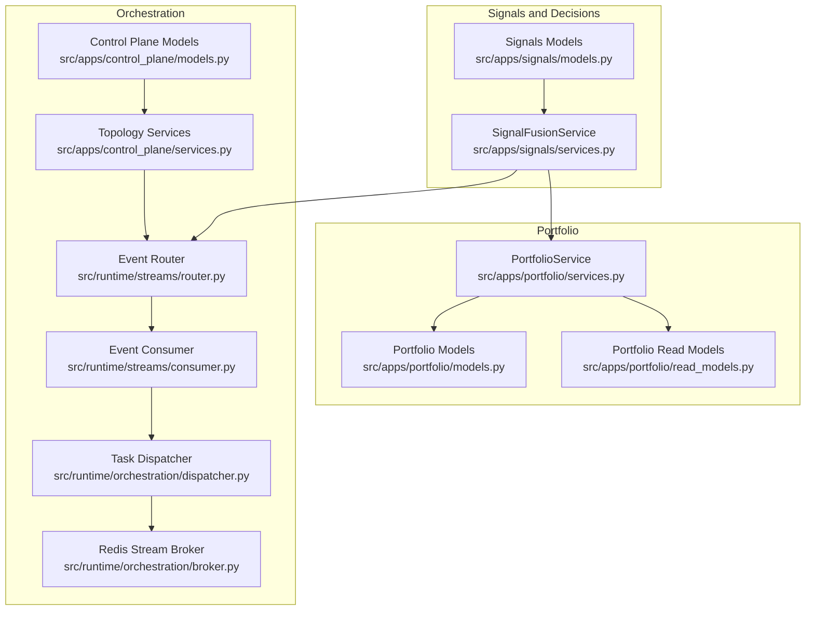
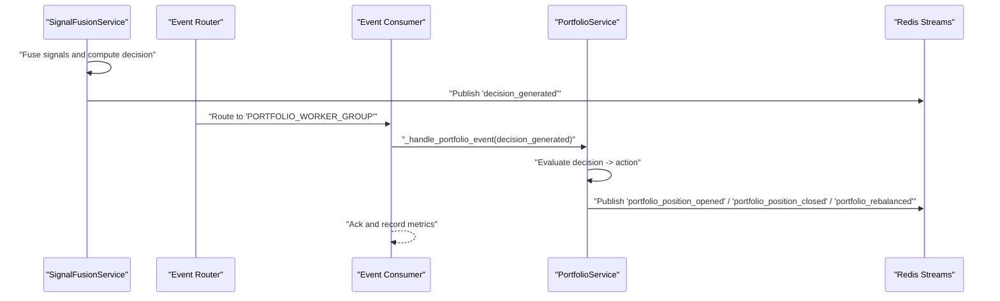
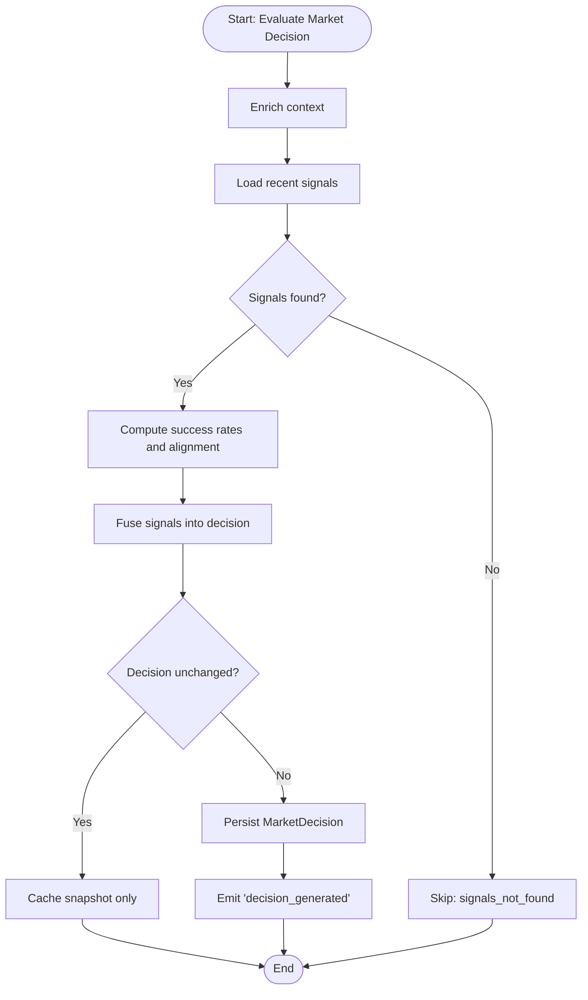
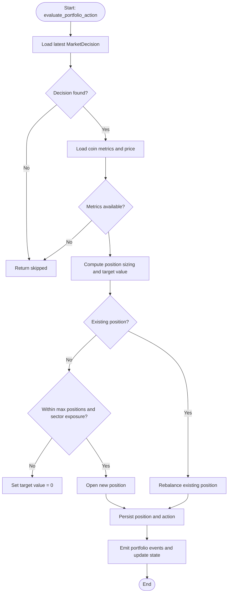
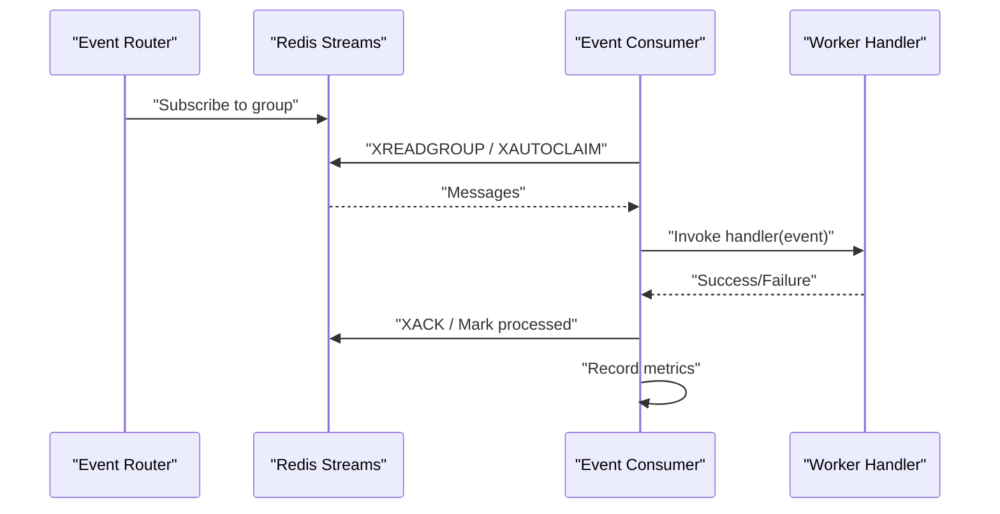
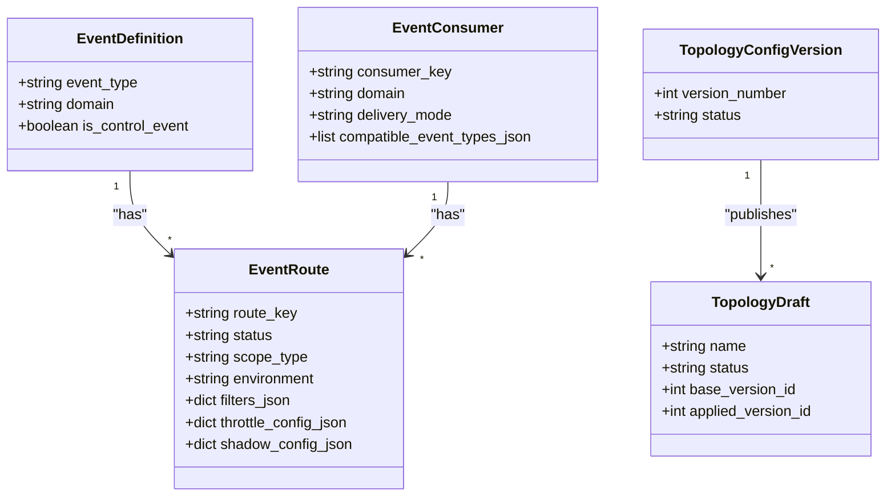
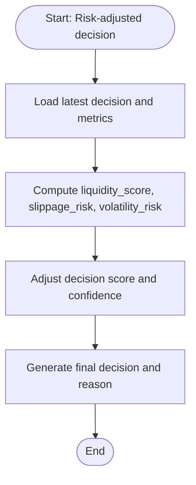
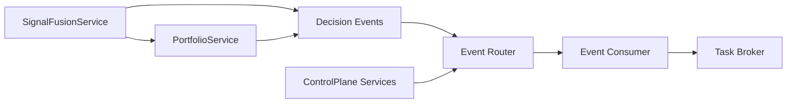

# Order Execution Workflows

<cite>
**Referenced Files in This Document**
- [models.py](file://src/apps/portfolio/models.py)
- [services.py](file://src/apps/portfolio/services.py)
- [models.py](file://src/apps/signals/models.py)
- [services.py](file://src/apps/signals/services.py)
- [models.py](file://src/apps/control_plane/models.py)
- [services.py](file://src/apps/control_plane/services.py)
- [router.py](file://src/runtime/streams/router.py)
- [consumer.py](file://src/runtime/streams/consumer.py)
- [dispatcher.py](file://src/runtime/orchestration/dispatcher.py)
- [broker.py](file://src/runtime/orchestration/broker.py)
- [read_models.py](file://src/apps/portfolio/read_models.py)
- [risk.py](file://src/apps/patterns/domain/risk.py)
- [task_service_decisions.py](file://src/apps/patterns/task_service_decisions.py)
</cite>

## Table of Contents
1. [Introduction](#introduction)
2. [Project Structure](#project-structure)
3. [Core Components](#core-components)
4. [Architecture Overview](#architecture-overview)
5. [Detailed Component Analysis](#detailed-component-analysis)
6. [Dependency Analysis](#dependency-analysis)
7. [Performance Considerations](#performance-considerations)
8. [Troubleshooting Guide](#troubleshooting-guide)
9. [Conclusion](#conclusion)

## Introduction
This document explains order execution workflows and automation across the system. It covers how trading decisions are generated, transformed into portfolio actions, and propagated via event-driven orchestration. It also documents order routing strategies, slippage and risk management, execution quality metrics, batch processing, and monitoring. While the codebase does not implement direct order placement against exchanges, it provides a robust framework for decision-to-execution orchestration, risk-aware sizing, and event-driven state transitions suitable for integration with external execution engines.

## Project Structure
The order execution workflow spans three layers:
- Signals and Decision Layer: Generates and fuses signals into investment decisions.
- Portfolio Layer: Evaluates decisions into actionable portfolio actions and manages positions.
- Orchestration Layer: Routes events to workers and enforces topology-controlled delivery.

**Diagram sources**
- [models.py:15-149](file://src/apps/signals/models.py#L15-L149)
- [services.py:156-405](file://src/apps/signals/services.py#L156-L405)
- [models.py:16-149](file://src/apps/portfolio/models.py#L16-L149)
- [services.py:173-431](file://src/apps/portfolio/services.py#L173-L431)
- [read_models.py:59-79](file://src/apps/portfolio/read_models.py#L59-L79)
- [router.py:17-55](file://src/runtime/streams/router.py#L17-L55)
- [consumer.py:49-229](file://src/runtime/streams/consumer.py#L49-L229)
- [dispatcher.py:5-11](file://src/runtime/orchestration/dispatcher.py#L5-L11)
- [broker.py:12-22](file://src/runtime/orchestration/broker.py#L12-L22)
- [models.py:15-258](file://src/apps/control_plane/models.py#L15-L258)
- [services.py:193-346](file://src/apps/control_plane/services.py#L193-L346)

**Section sources**
- [models.py:15-149](file://src/apps/signals/models.py#L15-L149)
- [services.py:156-405](file://src/apps/signals/services.py#L156-L405)
- [models.py:16-149](file://src/apps/portfolio/models.py#L16-L149)
- [services.py:173-431](file://src/apps/portfolio/services.py#L173-L431)
- [read_models.py:59-79](file://src/apps/portfolio/read_models.py#L59-L79)
- [router.py:17-55](file://src/runtime/streams/router.py#L17-L55)
- [consumer.py:49-229](file://src/runtime/streams/consumer.py#L49-L229)
- [dispatcher.py:5-11](file://src/runtime/orchestration/dispatcher.py#L5-L11)
- [broker.py:12-22](file://src/runtime/orchestration/broker.py#L12-L22)
- [models.py:15-258](file://src/apps/control_plane/models.py#L15-L258)
- [services.py:193-346](file://src/apps/control_plane/services.py#L193-L346)

## Core Components
- Signals and Decisions
  - Signal models define signals, histories, final signals, and market decisions.
  - Signal fusion service aggregates signals, applies cross-market alignment, and emits decisions.
- Portfolio
  - Portfolio models define positions, balances, actions, and state.
  - Portfolio service evaluates decisions into actions, computes position sizing and stops, and publishes side effects.
- Orchestration
  - Event router maps worker groups to event types.
  - Event consumer reads from Redis streams, invokes handlers, records metrics, and acknowledges messages.
  - Task dispatcher and broker integrate with task queues for asynchronous processing.
  - Control plane manages event routing topology, throttling, and shadow runs.

**Section sources**
- [models.py:15-149](file://src/apps/signals/models.py#L15-L149)
- [services.py:156-405](file://src/apps/signals/services.py#L156-L405)
- [models.py:16-149](file://src/apps/portfolio/models.py#L16-L149)
- [services.py:173-431](file://src/apps/portfolio/services.py#L173-L431)
- [router.py:17-55](file://src/runtime/streams/router.py#L17-L55)
- [consumer.py:49-229](file://src/runtime/streams/consumer.py#L49-L229)
- [dispatcher.py:5-11](file://src/runtime/orchestration/dispatcher.py#L5-L11)
- [broker.py:12-22](file://src/runtime/orchestration/broker.py#L12-L22)
- [models.py:15-258](file://src/apps/control_plane/models.py#L15-L258)
- [services.py:193-346](file://src/apps/control_plane/services.py#L193-L346)

## Architecture Overview
The order execution workflow is event-driven:
- Signal fusion produces a decision event.
- Portfolio service evaluates the decision and emits portfolio-related events.
- Event router directs events to appropriate worker groups.
- Event consumers process events asynchronously, applying side effects and publishing downstream events.

**Diagram sources**
- [services.py:345-405](file://src/apps/signals/services.py#L345-L405)
- [router.py:41-54](file://src/runtime/streams/router.py#L41-L54)
- [consumer.py:139-170](file://src/runtime/streams/consumer.py#L139-L170)
- [services.py:231-431](file://src/apps/portfolio/services.py#L231-L431)

**Section sources**
- [services.py:345-405](file://src/apps/signals/services.py#L345-L405)
- [router.py:41-54](file://src/runtime/streams/router.py#L41-L54)
- [consumer.py:139-170](file://src/runtime/streams/consumer.py#L139-L170)
- [services.py:231-431](file://src/apps/portfolio/services.py#L231-L431)

## Detailed Component Analysis

### Signals and Decisions
- Signal fusion aggregates recent signals, weights by pattern success rates and cross-market alignment, and emits a decision event with confidence and signal counts.
- The service caches a snapshot of the latest decision and publishes events for downstream processing.

**Diagram sources**
- [services.py:223-405](file://src/apps/signals/services.py#L223-L405)

**Section sources**
- [models.py:15-149](file://src/apps/signals/models.py#L15-L149)
- [services.py:156-405](file://src/apps/signals/services.py#L156-L405)

### Portfolio Action Evaluation and Position Management
- The portfolio service evaluates decisions into actions (open, increase, reduce, close) considering capital constraints, sector exposure, and existing positions.
- It computes position sizes and stop-loss/take-profit targets, updates portfolio state, and emits side-effect events.

**Diagram sources**
- [services.py:231-431](file://src/apps/portfolio/services.py#L231-L431)

**Section sources**
- [models.py:48-128](file://src/apps/portfolio/models.py#L48-L128)
- [services.py:173-431](file://src/apps/portfolio/services.py#L173-L431)
- [read_models.py:59-79](file://src/apps/portfolio/read_models.py#L59-L79)

### Event Routing and Delivery
- The router defines which event types are delivered to which worker groups.
- The consumer reads from Redis streams, ensures consumer groups, handles stale messages, invokes handlers, records metrics, and acknowledges processed messages.

**Diagram sources**
- [router.py:17-55](file://src/runtime/streams/router.py#L17-L55)
- [consumer.py:72-170](file://src/runtime/streams/consumer.py#L72-L170)

**Section sources**
- [router.py:17-55](file://src/runtime/streams/router.py#L17-L55)
- [consumer.py:49-229](file://src/runtime/streams/consumer.py#L49-L229)

### Control Plane and Topology Management
- The control plane manages event route definitions, consumers, and topology versions.
- Route management supports creation, updates, status changes, and draft-based topology changes with audit logs.

**Diagram sources**
- [models.py:15-258](file://src/apps/control_plane/models.py#L15-L258)

**Section sources**
- [models.py:15-258](file://src/apps/control_plane/models.py#L15-L258)
- [services.py:193-346](file://src/apps/control_plane/services.py#L193-L346)
- [services.py:411-520](file://src/apps/control_plane/services.py#L411-L520)

### Slippage Management and Risk-Aware Decisions
- Risk-aware decision evaluation adjusts scores and confidence based on liquidity, slippage risk, and volatility risk.
- These metrics feed into final signal generation and inform portfolio sizing.

**Diagram sources**
- [risk.py:48-82](file://src/apps/patterns/domain/risk.py#L48-L82)
- [risk.py:235-272](file://src/apps/patterns/domain/risk.py#L235-L272)
- [task_service_decisions.py:382-404](file://src/apps/patterns/task_service_decisions.py#L382-L404)

**Section sources**
- [risk.py:48-82](file://src/apps/patterns/domain/risk.py#L48-L82)
- [risk.py:235-272](file://src/apps/patterns/domain/risk.py#L235-L272)
- [task_service_decisions.py:382-404](file://src/apps/patterns/task_service_decisions.py#L382-L404)

### Batch Order Processing and VWAP Execution
- The system supports batch processing of decisions across multiple timeframes via signal fusion batch results.
- VWAP-style execution can be modeled by splitting orders across timeframes and emitting partial execution events; however, the repository does not implement direct VWAP execution logic. Instead, it provides hooks for downstream execution engines to consume decision events and implement execution strategies.

**Section sources**
- [services.py:173-221](file://src/apps/signals/services.py#L173-L221)
- [services.py:223-405](file://src/apps/signals/services.py#L223-L405)

### Order Book Integration and Market Impact
- Market structure and anomaly detectors ingest venue snapshots (e.g., funding, open interest, liquidations) to assess market conditions and potential impact.
- These insights can inform order routing and timing decisions.

**Section sources**
- [services.py:65-95](file://src/apps/anomalies/detectors/liquidation_cascade_detector.py#L65-L95)
- [services.py:67-106](file://src/apps/anomalies/detectors/funding_open_interest_detector.py#L67-L106)
- [services.py:68-88](file://src/apps/anomalies/detectors/price_volume_divergence_detector.py#L68-L88)

### Workflow Orchestration and Side Effects
- Portfolio side effect dispatcher updates cached state and publishes pending events.
- Signal fusion side effect dispatcher caches decision snapshots and publishes events.

**Section sources**
- [services.py:141-171](file://src/apps/portfolio/services.py#L141-L171)
- [services.py:136-154](file://src/apps/signals/services.py#L136-L154)

## Dependency Analysis
- Signals depend on pattern success rates and cross-market alignment to produce decisions.
- Portfolio actions depend on market decisions, coin metrics, and portfolio state.
- Orchestration depends on Redis streams and control plane topology to route events.

**Diagram sources**
- [services.py:156-405](file://src/apps/signals/services.py#L156-L405)
- [services.py:173-431](file://src/apps/portfolio/services.py#L173-L431)
- [router.py:17-55](file://src/runtime/streams/router.py#L17-L55)
- [consumer.py:49-229](file://src/runtime/streams/consumer.py#L49-L229)
- [broker.py:12-22](file://src/runtime/orchestration/broker.py#L12-L22)
- [services.py:193-346](file://src/apps/control_plane/services.py#L193-L346)

**Section sources**
- [services.py:156-405](file://src/apps/signals/services.py#L156-L405)
- [services.py:173-431](file://src/apps/portfolio/services.py#L173-L431)
- [router.py:17-55](file://src/runtime/streams/router.py#L17-L55)
- [consumer.py:49-229](file://src/runtime/streams/consumer.py#L49-L229)
- [broker.py:12-22](file://src/runtime/orchestration/broker.py#L12-L22)
- [services.py:193-346](file://src/apps/control_plane/services.py#L193-L346)

## Performance Considerations
- Asynchronous event processing with Redis streams enables high throughput and decouples producers from consumers.
- Batch sizes and consumer group configurations help balance latency and throughput.
- Idempotent processing and stale message reclamation improve resilience under failures.

[No sources needed since this section provides general guidance]

## Troubleshooting Guide
- Event consumption failures: Consumers record metrics and raise exceptions to surface errors; check Redis connectivity and handler logic.
- Missing decisions: Portfolio evaluation skips when decisions or metrics are unavailable; verify signal fusion and market data pipelines.
- Route conflicts: Control plane services enforce compatibility and uniqueness; review event definitions and consumer compatibility lists.

**Section sources**
- [consumer.py:154-170](file://src/runtime/streams/consumer.py#L154-L170)
- [services.py:252-284](file://src/apps/portfolio/services.py#L252-L284)
- [services.py:366-373](file://src/apps/control_plane/services.py#L366-L373)

## Conclusion
The system provides a robust, event-driven foundation for order execution workflows. Signal fusion produces decisions, portfolio evaluation translates them into actions with risk-aware sizing, and orchestration delivers events to workers with topology control. While direct order placement is not implemented here, the architecture is designed to integrate with external execution engines and supports advanced features like batch processing, risk-aware decisions, and monitoring.