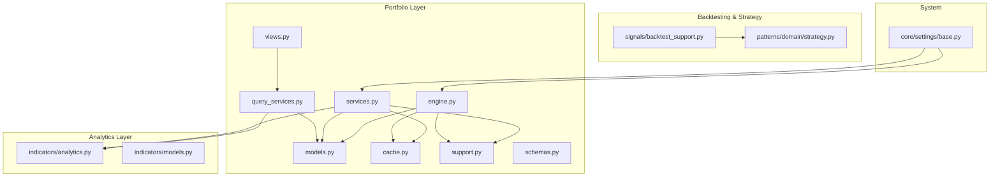
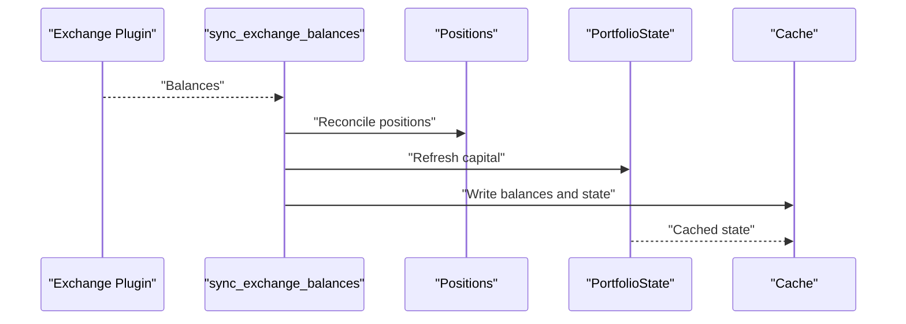
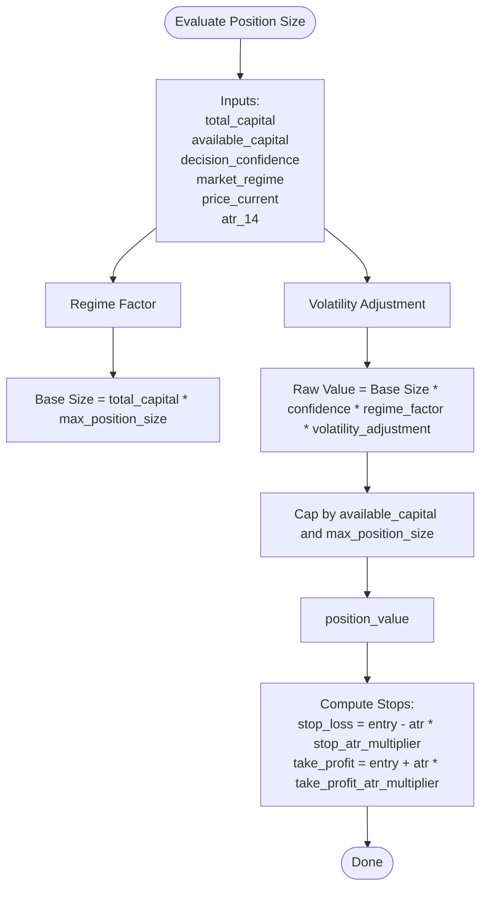
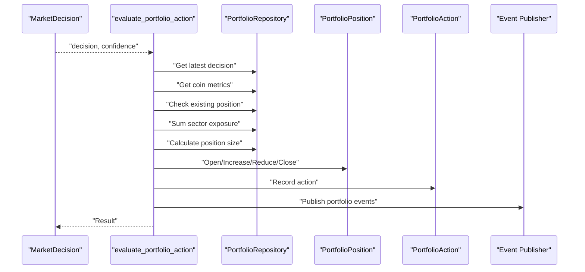
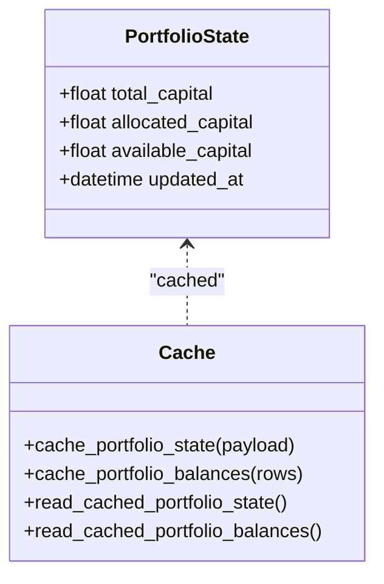
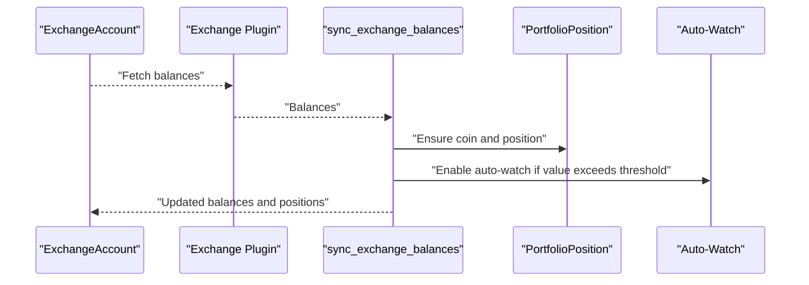
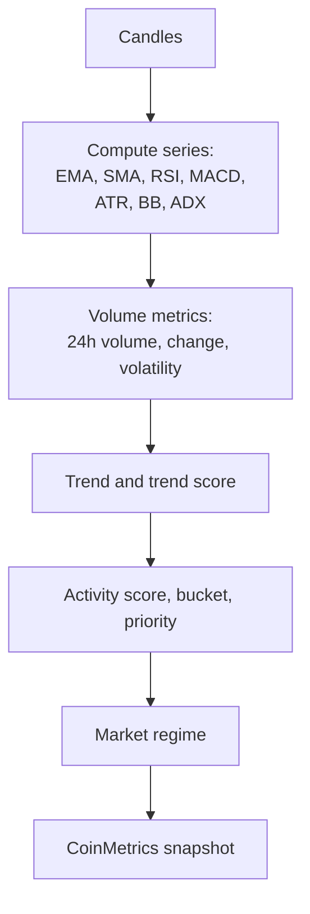
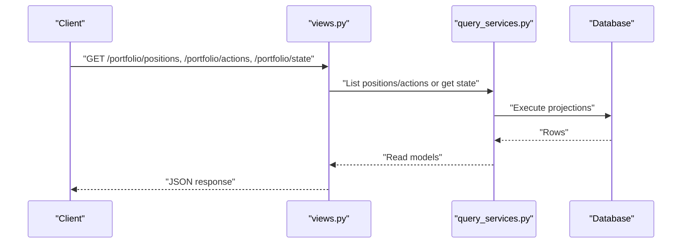
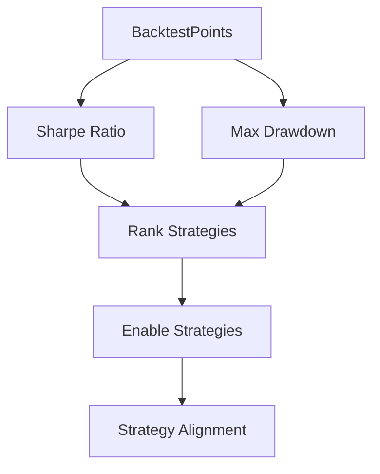
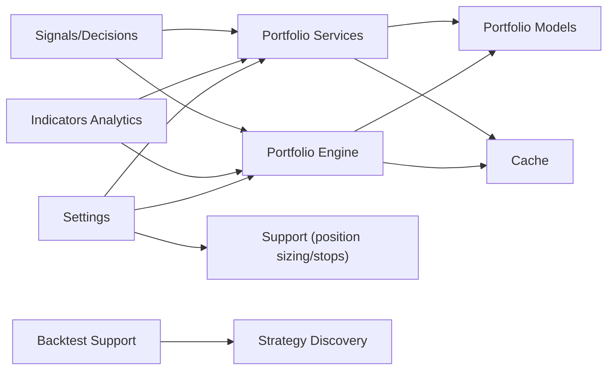

# Performance Tracking

<cite>
**Referenced Files in This Document**
- [engine.py](file://src/apps/portfolio/engine.py)
- [services.py](file://src/apps/portfolio/services.py)
- [models.py](file://src/apps/portfolio/models.py)
- [cache.py](file://src/apps/portfolio/cache.py)
- [support.py](file://src/apps/portfolio/support.py)
- [views.py](file://src/apps/portfolio/views.py)
- [query_services.py](file://src/apps/portfolio/query_services.py)
- [schemas.py](file://src/apps/portfolio/schemas.py)
- [analytics.py](file://src/apps/indicators/analytics.py)
- [models.py](file://src/apps/indicators/models.py)
- [backtest_support.py](file://src/apps/signals/backtest_support.py)
- [strategy.py](file://src/apps/patterns/domain/strategy.py)
- [base.py](file://src/core/settings/base.py)
</cite>

## Table of Contents
1. [Introduction](#introduction)
2. [Project Structure](#project-structure)
3. [Core Components](#core-components)
4. [Architecture Overview](#architecture-overview)
5. [Detailed Component Analysis](#detailed-component-analysis)
6. [Dependency Analysis](#dependency-analysis)
7. [Performance Considerations](#performance-considerations)
8. [Troubleshooting Guide](#troubleshooting-guide)
9. [Conclusion](#conclusion)
10. [Appendices](#appendices)

## Introduction
This document explains how the system tracks and analyzes portfolio performance. It covers profit and loss computation, return metrics, drawdown tracking, Sharpe ratio calculations, risk-adjusted returns, asset allocation and composition analysis, performance benchmarking, reporting and dashboards, and optimization recommendations. The focus is on the portfolio engine and services, supporting analytics, and shared configuration.

## Project Structure
The portfolio performance tracking spans several modules:
- Portfolio engine and services: position sizing, action evaluation, balance synchronization, state caching
- Portfolio models and queries: positions, actions, state, and read models
- Analytics and metrics: time-series indicators, regime detection, and derived metrics
- Backtesting support: return and drawdown aggregation
- Strategy performance: discovery and ranking of strategies with Sharpe and drawdown metrics
- Settings: portfolio-wide configuration for capital, position sizing, and risk controls

**Diagram sources**
- [engine.py:1-555](file://src/apps/portfolio/engine.py#L1-L555)
- [services.py:1-706](file://src/apps/portfolio/services.py#L1-L706)
- [models.py:1-151](file://src/apps/portfolio/models.py#L1-L151)
- [query_services.py:1-186](file://src/apps/portfolio/query_services.py#L1-L186)
- [views.py:1-32](file://src/apps/portfolio/views.py#L1-L32)
- [cache.py:1-110](file://src/apps/portfolio/cache.py#L1-L110)
- [support.py:1-78](file://src/apps/portfolio/support.py#L1-L78)
- [schemas.py:1-63](file://src/apps/portfolio/schemas.py#L1-L63)
- [analytics.py:1-463](file://src/apps/indicators/analytics.py#L1-L463)
- [models.py:1-121](file://src/apps/indicators/models.py#L1-L121)
- [backtest_support.py:1-70](file://src/apps/signals/backtest_support.py#L1-L70)
- [strategy.py:1-491](file://src/apps/patterns/domain/strategy.py#L1-L491)
- [base.py:1-90](file://src/core/settings/base.py#L1-L90)

**Section sources**
- [engine.py:1-555](file://src/apps/portfolio/engine.py#L1-L555)
- [services.py:1-706](file://src/apps/portfolio/services.py#L1-L706)
- [models.py:1-151](file://src/apps/portfolio/models.py#L1-L151)
- [query_services.py:1-186](file://src/apps/portfolio/query_services.py#L1-L186)
- [views.py:1-32](file://src/apps/portfolio/views.py#L1-L32)
- [cache.py:1-110](file://src/apps/portfolio/cache.py#L1-L110)
- [support.py:1-78](file://src/apps/portfolio/support.py#L1-L78)
- [schemas.py:1-63](file://src/apps/portfolio/schemas.py#L1-L63)
- [analytics.py:1-463](file://src/apps/indicators/analytics.py#L1-L463)
- [models.py:1-121](file://src/apps/indicators/models.py#L1-L121)
- [backtest_support.py:1-70](file://src/apps/signals/backtest_support.py#L1-L70)
- [strategy.py:1-491](file://src/apps/patterns/domain/strategy.py#L1-L491)
- [base.py:1-90](file://src/core/settings/base.py#L1-L90)

## Core Components
- Position sizing and stops: dynamic position value based on capital, confidence, regime, and volatility; stop-loss and take-profit computed via ATR multipliers
- Action evaluation: buy/sell decisions mapped to opening, increasing, reducing, closing positions; sector exposure and max-position constraints enforced
- Portfolio state: total, allocated, and available capital; open position counts; cached for low-latency reads
- Balance synchronization: fetch balances from exchange plugins, reconcile positions, auto-watch new assets above threshold
- Analytics integration: coin metrics (price, RSI, MACD, ATR, BB width, ADX, activity scores) inform regime and trend; used by position sizing and risk controls
- Backtesting and strategy performance: returns and drawdowns aggregated per signal/timeframe; Sharpe ratio and max drawdown used to rank strategies

**Section sources**
- [support.py:28-67](file://src/apps/portfolio/support.py#L28-L67)
- [engine.py:195-350](file://src/apps/portfolio/engine.py#L195-L350)
- [services.py:231-431](file://src/apps/portfolio/services.py#L231-L431)
- [engine.py:69-94](file://src/apps/portfolio/engine.py#L69-L94)
- [services.py:479-492](file://src/apps/portfolio/services.py#L479-L492)
- [engine.py:456-554](file://src/apps/portfolio/engine.py#L456-L554)
- [services.py:433-463](file://src/apps/portfolio/services.py#L433-L463)
- [analytics.py:135-219](file://src/apps/indicators/analytics.py#L135-L219)
- [models.py:15-62](file://src/apps/indicators/models.py#L15-L62)
- [backtest_support.py:24-61](file://src/apps/signals/backtest_support.py#L24-L61)
- [strategy.py:334-440](file://src/apps/patterns/domain/strategy.py#L334-L440)

## Architecture Overview
The portfolio performance pipeline integrates real-time market data, analytics, and trading decisions:
- Exchange balances are synchronized and reconciled into portfolio positions
- Market decisions and analytics feed position sizing and action evaluation
- Portfolio state and balances are cached for fast reads
- Reporting endpoints expose positions, actions, and state
- Backtesting and strategy discovery compute Sharpe and drawdown metrics for performance benchmarking

**Diagram sources**
- [engine.py:456-554](file://src/apps/portfolio/engine.py#L456-L554)
- [services.py:433-463](file://src/apps/portfolio/services.py#L433-L463)
- [cache.py:52-79](file://src/apps/portfolio/cache.py#L52-L79)

## Detailed Component Analysis

### Position Sizing and Stops
- Position value is computed from total capital, available capital, decision confidence, market regime factor, and volatility adjustment using ATR
- Stop-loss and take-profit are derived from entry price and ATR with configurable multipliers
- Sector exposure and maximum positions constraints prevent over-concentration

**Diagram sources**
- [support.py:37-67](file://src/apps/portfolio/support.py#L37-L67)
- [base.py:60-66](file://src/core/settings/base.py#L60-L66)

**Section sources**
- [support.py:28-67](file://src/apps/portfolio/support.py#L28-L67)
- [engine.py:222-234](file://src/apps/portfolio/engine.py#L222-L234)
- [services.py:294-307](file://src/apps/portfolio/services.py#L294-L307)

### Action Evaluation and Position Lifecycle
- Buy/Sell decisions mapped to OPEN/INCREASE/REDUCE/CLOSE actions
- Existing positions rebalanced; partial reductions applied when reducing by more than 10% of current value
- Sector exposure and max positions enforced before opening new positions

**Diagram sources**
- [engine.py:195-350](file://src/apps/portfolio/engine.py#L195-L350)
- [services.py:231-431](file://src/apps/portfolio/services.py#L231-L431)

**Section sources**
- [engine.py:154-193](file://src/apps/portfolio/engine.py#L154-L193)
- [services.py:192-229](file://src/apps/portfolio/services.py#L192-L229)

### Portfolio State and Caching
- PortfolioState tracks total, allocated, and available capital; updated after balance sync and action evaluation
- Cached asynchronously and synchronously for fast reads; cached balances include auto-watch flags

**Diagram sources**
- [models.py:130-142](file://src/apps/portfolio/models.py#L130-L142)
- [cache.py:52-109](file://src/apps/portfolio/cache.py#L52-L109)

**Section sources**
- [engine.py:69-94](file://src/apps/portfolio/engine.py#L69-L94)
- [services.py:479-492](file://src/apps/portfolio/services.py#L479-L492)
- [cache.py:52-109](file://src/apps/portfolio/cache.py#L52-L109)

### Balance Synchronization and Auto-Watch
- Fetch balances from exchange plugins; reconcile positions; update auto-watch flags for assets above threshold
- Emit events for balance updates and position changes

**Diagram sources**
- [engine.py:456-554](file://src/apps/portfolio/engine.py#L456-L554)
- [services.py:590-694](file://src/apps/portfolio/services.py#L590-L694)

**Section sources**
- [engine.py:373-395](file://src/apps/portfolio/engine.py#L373-L395)
- [services.py:575-588](file://src/apps/portfolio/services.py#L575-L588)

### Analytics and Metrics
- Timeframe snapshots compute price, moving averages, RSI, MACD, ATR, Bollinger Bands, ADX, and volume metrics
- Trend, trend score, activity score, bucket, and market regime derived from indicators
- CoinMetrics stores current metrics and regime details for downstream use

**Diagram sources**
- [analytics.py:135-219](file://src/apps/indicators/analytics.py#L135-L219)
- [models.py:15-62](file://src/apps/indicators/models.py#L15-L62)

**Section sources**
- [analytics.py:135-219](file://src/apps/indicators/analytics.py#L135-L219)
- [models.py:15-62](file://src/apps/indicators/models.py#L15-L62)

### Reporting and Dashboards
- FastAPI endpoints expose positions, actions, and state
- Query services assemble read models with current prices, unrealized PnL, latest decisions, and risk-to-stop metrics

**Diagram sources**
- [views.py:11-31](file://src/apps/portfolio/views.py#L11-L31)
- [query_services.py:30-182](file://src/apps/portfolio/query_services.py#L30-L182)
- [schemas.py:8-62](file://src/apps/portfolio/schemas.py#L8-L62)

**Section sources**
- [views.py:11-31](file://src/apps/portfolio/views.py#L11-L31)
- [query_services.py:30-182](file://src/apps/portfolio/query_services.py#L30-L182)
- [schemas.py:8-62](file://src/apps/portfolio/schemas.py#L8-L62)

### Performance Metrics and Benchmarking
- Backtest support aggregates returns and drawdowns per signal/timeframe and computes Sharpe ratio
- Strategy discovery ranks candidates by Sharpe, win rate, and max drawdown; enables strategies meeting thresholds
- Strategy alignment compares discovered strategies against current tokens/confidence/regime/sector/cycle

**Diagram sources**
- [backtest_support.py:24-61](file://src/apps/signals/backtest_support.py#L24-L61)
- [strategy.py:334-440](file://src/apps/patterns/domain/strategy.py#L334-L440)
- [strategy.py:443-490](file://src/apps/patterns/domain/strategy.py#L443-L490)

**Section sources**
- [backtest_support.py:24-61](file://src/apps/signals/backtest_support.py#L24-L61)
- [strategy.py:334-440](file://src/apps/patterns/domain/strategy.py#L334-L440)
- [strategy.py:443-490](file://src/apps/patterns/domain/strategy.py#L443-L490)

## Dependency Analysis
- Portfolio engine and services depend on models, settings, and analytics for decision-making and risk control
- Queries depend on analytics and signals for enriched read models
- Backtesting and strategy modules operate independently but share metric computations

**Diagram sources**
- [base.py:60-66](file://src/core/settings/base.py#L60-L66)
- [engine.py:1-555](file://src/apps/portfolio/engine.py#L1-L555)
- [services.py:1-706](file://src/apps/portfolio/services.py#L1-L706)
- [support.py:1-78](file://src/apps/portfolio/support.py#L1-L78)
- [models.py:1-151](file://src/apps/portfolio/models.py#L1-L151)
- [cache.py:1-110](file://src/apps/portfolio/cache.py#L1-L110)
- [analytics.py:1-463](file://src/apps/indicators/analytics.py#L1-L463)
- [backtest_support.py:1-70](file://src/apps/signals/backtest_support.py#L1-L70)
- [strategy.py:1-491](file://src/apps/patterns/domain/strategy.py#L1-L491)

**Section sources**
- [base.py:60-66](file://src/core/settings/base.py#L60-L66)
- [engine.py:1-555](file://src/apps/portfolio/engine.py#L1-L555)
- [services.py:1-706](file://src/apps/portfolio/services.py#L1-L706)
- [support.py:1-78](file://src/apps/portfolio/support.py#L1-L78)
- [models.py:1-151](file://src/apps/portfolio/models.py#L1-L151)
- [cache.py:1-110](file://src/apps/portfolio/cache.py#L1-L110)
- [analytics.py:1-463](file://src/apps/indicators/analytics.py#L1-L463)
- [backtest_support.py:1-70](file://src/apps/signals/backtest_support.py#L1-L70)
- [strategy.py:1-491](file://src/apps/patterns/domain/strategy.py#L1-L491)

## Performance Considerations
- Caching: Portfolio state and balances are cached to minimize database load and latency for dashboards and APIs
- Asynchronous operations: Services use async repositories and Redis caching for non-blocking performance
- Indicator completeness: Analytics snapshots skip missing values; completeness scoring prioritizes richer features
- Position sizing caps: Available capital and sector exposure limits reduce tail risk and improve stability

[No sources needed since this section provides general guidance]

## Troubleshooting Guide
- Missing coin metrics: If coin metrics are unavailable, action evaluation skips and returns a skipped status
- Decision not found: Without a recent market decision, no action is taken
- Blanks in balances: Symbols without identifiers are skipped during balance sync
- Auto-watch threshold: Positions below minimum value do not trigger auto-watch enabling

**Section sources**
- [engine.py:206-212](file://src/apps/portfolio/engine.py#L206-L212)
- [services.py:252-284](file://src/apps/portfolio/services.py#L252-L284)
- [engine.py:597-605](file://src/apps/portfolio/engine.py#L597-L605)
- [services.py:597-605](file://src/apps/portfolio/services.py#L597-L605)
- [engine.py:375-376](file://src/apps/portfolio/engine.py#L375-L376)
- [services.py:581-582](file://src/apps/portfolio/services.py#L581-L582)

## Conclusion
The portfolio performance tracking system combines robust position sizing, strict risk controls, and real-time analytics to drive informed decisions. It supports comprehensive reporting, performance benchmarking via Sharpe and drawdown metrics, and strategy discovery aligned with current market regimes and conditions. Caching and asynchronous processing ensure responsive dashboards and scalable operations.

[No sources needed since this section summarizes without analyzing specific files]

## Appendices

### Profit and Loss Calculation
- Unrealized PnL computed as (current_price - entry_price) × position_size for open positions
- Risk-to-stop ratio derived from entry and stop-loss to assess downside exposure

**Section sources**
- [query_services.py:81-100](file://src/apps/portfolio/query_services.py#L81-L100)

### Return Metrics and Sharpe Ratio
- Sharpe ratio computed from average return divided by standard deviation of returns
- Strategy Sharpe and max drawdown used to enable and rank strategies

**Section sources**
- [backtest_support.py:24-31](file://src/apps/signals/backtest_support.py#L24-L31)
- [strategy.py:260-267](file://src/apps/patterns/domain/strategy.py#L260-L267)
- [strategy.py:396-397](file://src/apps/patterns/domain/strategy.py#L396-L397)

### Drawdown Tracking
- Strategy drawdown computed as the minimum observed drawdown across horizons
- Backtest drawdowns recorded per observation for performance aggregation

**Section sources**
- [strategy.py:167-171](file://src/apps/patterns/domain/strategy.py#L167-L171)
- [backtest_support.py:10-17](file://src/apps/signals/backtest_support.py#L10-L17)

### Asset Allocation and Composition
- Sector exposure ratio calculated as sum of open position values in a sector divided by total capital
- Maximum sector exposure enforced to limit concentration risk

**Section sources**
- [engine.py:97-111](file://src/apps/portfolio/engine.py#L97-L111)
- [services.py:288-292](file://src/apps/portfolio/services.py#L288-L292)

### Performance Benchmarking
- Strategy performance metrics include sample size, win rate, ROI, average return, Sharpe ratio, max drawdown, and average confidence
- Strategy alignment compares discovered strategies to current context and confidence thresholds

**Section sources**
- [backtest_support.py:40-61](file://src/apps/signals/backtest_support.py#L40-L61)
- [strategy.py:443-490](file://src/apps/patterns/domain/strategy.py#L443-L490)

### Reporting and Dashboards
- Endpoints for positions, actions, and state with read models exposing current prices, PnL, decisions, and risk metrics
- Cached state and balances optimize dashboard responsiveness

**Section sources**
- [views.py:11-31](file://src/apps/portfolio/views.py#L11-L31)
- [schemas.py:8-62](file://src/apps/portfolio/schemas.py#L8-L62)
- [cache.py:52-79](file://src/apps/portfolio/cache.py#L52-L79)

### Optimization Recommendations
- Tune position sizing parameters (max position size, ATR multipliers) based on regime and volatility
- Monitor sector exposure and reduce positions when approaching limits
- Use strategy Sharpe and drawdown thresholds to filter and align active strategies
- Leverage cached state for high-frequency dashboards and reduce database load

[No sources needed since this section provides general guidance]