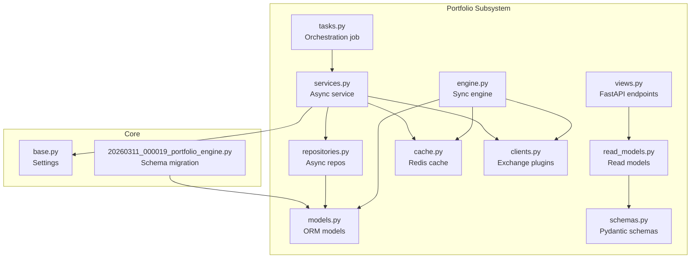
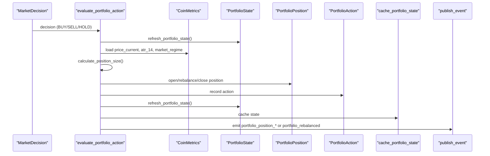
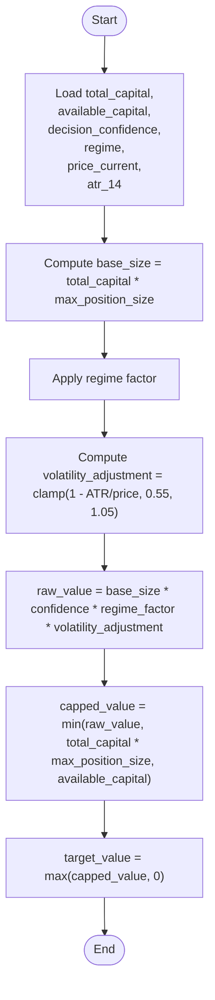
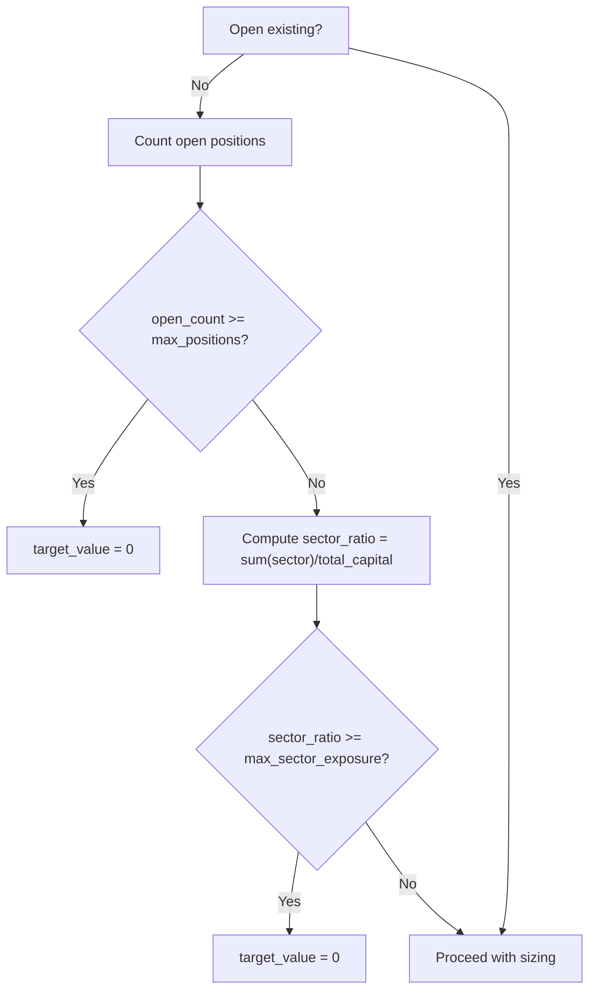
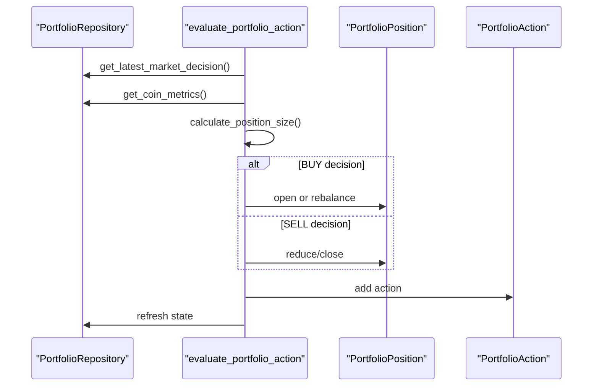
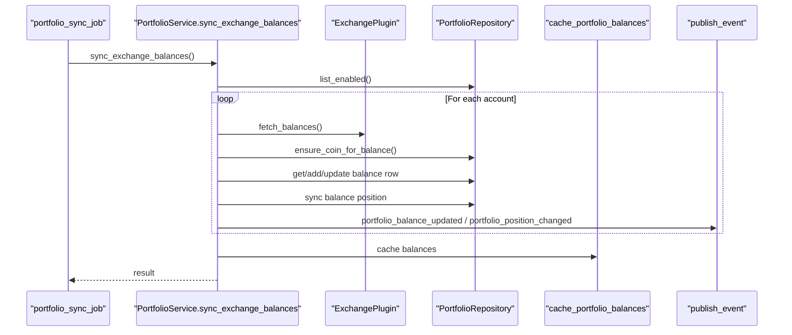
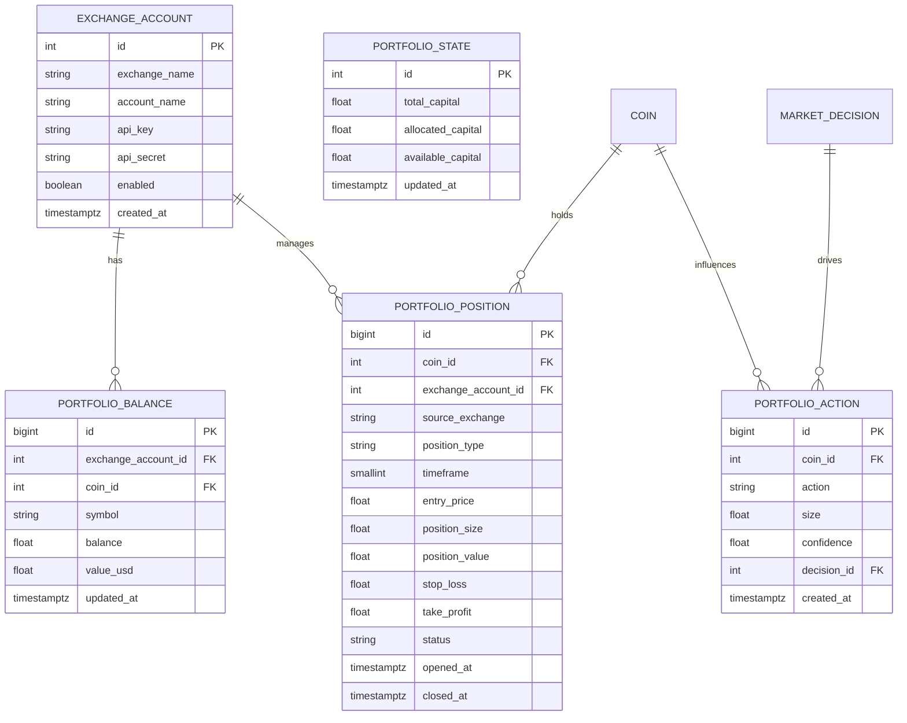
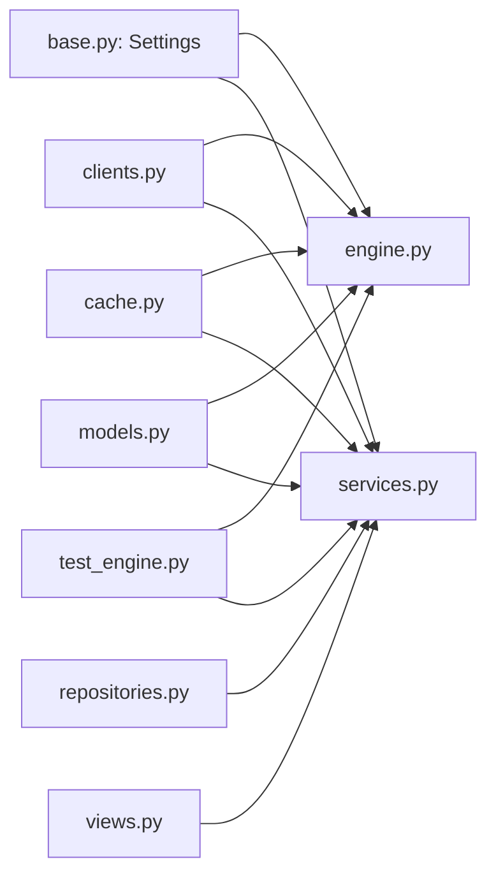

# Portfolio Engine

<cite>
**Referenced Files in This Document**
- [engine.py](file://src/apps/portfolio/engine.py)
- [services.py](file://src/apps/portfolio/services.py)
- [models.py](file://src/apps/portfolio/models.py)
- [schemas.py](file://src/apps/portfolio/schemas.py)
- [repositories.py](file://src/apps/portfolio/repositories.py)
- [cache.py](file://src/apps/portfolio/cache.py)
- [clients.py](file://src/apps/portfolio/clients.py)
- [tasks.py](file://src/apps/portfolio/tasks.py)
- [base.py](file://src/core/settings/base.py)
- [20260311_000019_portfolio_engine.py](file://src/migrations/versions/20260311_000019_portfolio_engine.py)
- [views.py](file://src/apps/portfolio/views.py)
- [read_models.py](file://src/apps/portfolio/read_models.py)
- [test_engine.py](file://tests/apps/portfolio/test_engine.py)
</cite>

## Table of Contents
1. [Introduction](#introduction)
2. [Project Structure](#project-structure)
3. [Core Components](#core-components)
4. [Architecture Overview](#architecture-overview)
5. [Detailed Component Analysis](#detailed-component-analysis)
6. [Dependency Analysis](#dependency-analysis)
7. [Performance Considerations](#performance-considerations)
8. [Troubleshooting Guide](#troubleshooting-guide)
9. [Conclusion](#conclusion)
10. [Appendices](#appendices)

## Introduction
The Portfolio Engine coordinates trading capital allocation, position sizing, risk controls, and exchange balance synchronization. It consumes market decisions, evaluates risk-aware position sizing, enforces sector and position limits, and emits standardized events for downstream systems. It integrates with market data metrics, exchange plugins, and caches portfolio state/balances for efficient reads.

## Project Structure
The portfolio subsystem is organized around a synchronous engine for batch/legacy flows and an asynchronous service for runtime orchestration. Supporting modules include models, repositories, caching, clients, tasks, views, and read models.

**Diagram sources**
- [engine.py:1-608](file://src/apps/portfolio/engine.py#L1-L608)
- [services.py:1-706](file://src/apps/portfolio/services.py#L1-L706)
- [repositories.py:1-222](file://src/apps/portfolio/repositories.py#L1-L222)
- [models.py:1-151](file://src/apps/portfolio/models.py#L1-L151)
- [schemas.py:1-63](file://src/apps/portfolio/schemas.py#L1-L63)
- [read_models.py:1-125](file://src/apps/portfolio/read_models.py#L1-L125)
- [views.py:1-32](file://src/apps/portfolio/views.py#L1-L32)
- [cache.py:1-110](file://src/apps/portfolio/cache.py#L1-L110)
- [clients.py:1-93](file://src/apps/portfolio/clients.py#L1-L93)
- [tasks.py:1-22](file://src/apps/portfolio/tasks.py#L1-L22)
- [base.py:1-90](file://src/core/settings/base.py#L1-L90)
- [20260311_000019_portfolio_engine.py:1-100](file://src/migrations/versions/20260311_000019_portfolio_engine.py#L1-L100)

**Section sources**
- [engine.py:1-608](file://src/apps/portfolio/engine.py#L1-L608)
- [services.py:1-706](file://src/apps/portfolio/services.py#L1-L706)
- [repositories.py:1-222](file://src/apps/portfolio/repositories.py#L1-L222)
- [models.py:1-151](file://src/apps/portfolio/models.py#L1-L151)
- [cache.py:1-110](file://src/apps/portfolio/cache.py#L1-L110)
- [clients.py:1-93](file://src/apps/portfolio/clients.py#L1-L93)
- [tasks.py:1-22](file://src/apps/portfolio/tasks.py#L1-L22)
- [base.py:1-90](file://src/core/settings/base.py#L1-L90)
- [20260311_000019_portfolio_engine.py:1-100](file://src/migrations/versions/20260311_000019_portfolio_engine.py#L1-L100)

## Core Components
- PortfolioState: Tracks total, allocated, and available capital and last update time.
- PortfolioPosition: Holds per-position details including entry price, size, value, stops, timeframe, and status.
- PortfolioAction: Records decisions and actions taken with associated confidence.
- PortfolioBalance: Tracks per-account per-symbol balances and USD values.
- ExchangeAccount: Defines exchange credentials and enables/disables accounts.
- Position sizing and risk helpers: calculate_stops, calculate_position_size, and helpers for sector exposure and open positions.
- Sync and evaluation: sync_exchange_balances and evaluate_portfolio_action coordinate balance sync and action decisions.

Key behaviors:
- Capital allocation is enforced via PortfolioState and per-position value summation.
- Position sizing considers total capital, available capital, decision confidence, market regime, and volatility (ATR).
- Sector exposure caps are enforced against total capital.
- Risk stops are derived from ATR and configured multipliers.

**Section sources**
- [models.py:130-142](file://src/apps/portfolio/models.py#L130-L142)
- [models.py:97-127](file://src/apps/portfolio/models.py#L97-L127)
- [models.py:48-68](file://src/apps/portfolio/models.py#L48-L68)
- [models.py:16-45](file://src/apps/portfolio/models.py#L16-L45)
- [engine.py:108-147](file://src/apps/portfolio/engine.py#L108-L147)
- [engine.py:150-164](file://src/apps/portfolio/engine.py#L150-L164)
- [engine.py:248-403](file://src/apps/portfolio/engine.py#L248-L403)

## Architecture Overview
The engine orchestrates three primary flows:
- Action evaluation: Given a MarketDecision, compute target position value, enforce limits, and record action.
- Balance sync: Fetch balances from exchange plugins, reconcile with positions, and optionally auto-enable watch lists.
- Caching and events: Persist state and balances to cache and publish events for UI and downstream systems.

**Diagram sources**
- [engine.py:248-403](file://src/apps/portfolio/engine.py#L248-L403)
- [engine.py:108-147](file://src/apps/portfolio/engine.py#L108-L147)
- [engine.py:80-105](file://src/apps/portfolio/engine.py#L80-L105)
- [cache.py:52-79](file://src/apps/portfolio/cache.py#L52-L79)

**Section sources**
- [engine.py:248-403](file://src/apps/portfolio/engine.py#L248-L403)
- [services.py:231-431](file://src/apps/portfolio/services.py#L231-L431)
- [cache.py:52-79](file://src/apps/portfolio/cache.py#L52-L79)

## Detailed Component Analysis

### Position Sizing and Risk Management
- Base position value is proportional to total capital and a max position size fraction.
- Regime factors adjust exposure for bull, bear, sideways range, and high volatility regimes.
- Volatility adjustment scales target value by inverse relation to ATR relative to price.
- Final target value is capped by available capital and the per-position cap.
- Stops are computed from entry price and ATR using configurable multipliers.

**Diagram sources**
- [engine.py:117-147](file://src/apps/portfolio/engine.py#L117-L147)
- [base.py:60-66](file://src/core/settings/base.py#L60-L66)

**Section sources**
- [engine.py:117-147](file://src/apps/portfolio/engine.py#L117-L147)
- [engine.py:108-114](file://src/apps/portfolio/engine.py#L108-L114)
- [base.py:60-66](file://src/core/settings/base.py#L60-L66)

### Sector Exposure and Position Limits
- Sector exposure ratio is computed as sum of open position values in the same sector divided by total capital.
- If opening a new position would exceed the sector cap or if the number of open positions exceeds the max, target value becomes zero.

**Diagram sources**
- [engine.py:284-287](file://src/apps/portfolio/engine.py#L284-L287)
- [engine.py:150-164](file://src/apps/portfolio/engine.py#L150-L164)
- [base.py:62-63](file://src/core/settings/base.py#L62-L63)

**Section sources**
- [engine.py:284-287](file://src/apps/portfolio/engine.py#L284-L287)
- [engine.py:150-164](file://src/apps/portfolio/engine.py#L150-L164)
- [base.py:62-63](file://src/core/settings/base.py#L62-L63)

### Action Evaluation Workflow
- Loads latest MarketDecision for the coin/timeframe.
- Validates coin and metrics availability.
- Computes target value and applies sector/position limits.
- Opens new position, rebalances existing, or closes depending on decision and confidence thresholds.
- Records action and updates state, emitting events.

**Diagram sources**
- [services.py:231-431](file://src/apps/portfolio/services.py#L231-L431)
- [repositories.py:192-206](file://src/apps/portfolio/repositories.py#L192-L206)
- [engine.py:248-403](file://src/apps/portfolio/engine.py#L248-L403)

**Section sources**
- [services.py:231-431](file://src/apps/portfolio/services.py#L231-L431)
- [repositories.py:192-206](file://src/apps/portfolio/repositories.py#L192-L206)
- [engine.py:248-403](file://src/apps/portfolio/engine.py#L248-L403)

### Exchange Balance Sync
- Iterates enabled ExchangeAccounts and fetches balances via exchange plugins.
- Ensures coin records, updates PortfolioBalance rows, reconciles PortfolioPosition values/stops, and optionally auto-enables coins for watch.
- Emits balance and position change events when values change.

**Diagram sources**
- [tasks.py:11-22](file://src/apps/portfolio/tasks.py#L11-L22)
- [services.py:433-463](file://src/apps/portfolio/services.py#L433-L463)
- [services.py:590-694](file://src/apps/portfolio/services.py#L590-L694)
- [cache.py:82-109](file://src/apps/portfolio/cache.py#L82-L109)

**Section sources**
- [tasks.py:11-22](file://src/apps/portfolio/tasks.py#L11-L22)
- [services.py:433-463](file://src/apps/portfolio/services.py#L433-L463)
- [services.py:590-694](file://src/apps/portfolio/services.py#L590-L694)
- [cache.py:82-109](file://src/apps/portfolio/cache.py#L82-L109)

### Data Models and Schema

**Diagram sources**
- [models.py:16-45](file://src/apps/portfolio/models.py#L16-L45)
- [models.py:130-142](file://src/apps/portfolio/models.py#L130-L142)
- [models.py:97-127](file://src/apps/portfolio/models.py#L97-L127)
- [models.py:48-68](file://src/apps/portfolio/models.py#L48-L68)
- [models.py:71-94](file://src/apps/portfolio/models.py#L71-L94)

**Section sources**
- [models.py:16-45](file://src/apps/portfolio/models.py#L16-L45)
- [models.py:130-142](file://src/apps/portfolio/models.py#L130-L142)
- [models.py:97-127](file://src/apps/portfolio/models.py#L97-L127)
- [models.py:48-68](file://src/apps/portfolio/models.py#L48-L68)
- [models.py:71-94](file://src/apps/portfolio/models.py#L71-L94)

### Integration with Market Data and Signals
- MarketDecision drives buy/sell decisions and confidence.
- CoinMetrics provides price_current, atr_14, and market_regime used in sizing and risk.
- The engine validates presence of metrics before acting.

**Section sources**
- [engine.py:256-265](file://src/apps/portfolio/engine.py#L256-L265)
- [engine.py:275-282](file://src/apps/portfolio/engine.py#L275-L282)
- [repositories.py:186-190](file://src/apps/portfolio/repositories.py#L186-L190)

### Exchange Plugins
- ExchangePlugin interface defines balance/position/order/trade fetchers.
- Registry supports extensible exchange integrations; currently includes Binance and Bybit placeholders.

**Section sources**
- [clients.py:9-49](file://src/apps/portfolio/clients.py#L9-L49)
- [clients.py:52-81](file://src/apps/portfolio/clients.py#L52-L81)

### Configuration Options
- Portfolio capital and limits:
  - portfolio_total_capital
  - portfolio_max_position_size
  - portfolio_max_positions
  - portfolio_max_sector_exposure
- Risk controls:
  - portfolio_stop_atr_multiplier
  - portfolio_take_profit_atr_multiplier
- Auto-watch threshold:
  - auto_watch_min_position_value
- Task scheduling:
  - taskiq_portfolio_sync_interval_seconds

**Section sources**
- [base.py:60-66](file://src/core/settings/base.py#L60-L66)
- [base.py:42](file://src/core/settings/base.py#L42)

## Dependency Analysis
- Engine depends on models, settings, cache, and exchange clients for sync.
- Service abstracts async repositories and settings for runtime orchestration.
- Views depend on query services and schemas for API responses.
- Tests exercise both sync engine and async service flows.

**Diagram sources**
- [base.py:60-66](file://src/core/settings/base.py#L60-L66)
- [engine.py:10-24](file://src/apps/portfolio/engine.py#L10-L24)
- [services.py:11-25](file://src/apps/portfolio/services.py#L11-L25)
- [clients.py:1-93](file://src/apps/portfolio/clients.py#L1-L93)
- [cache.py:1-110](file://src/apps/portfolio/cache.py#L1-L110)
- [repositories.py:1-222](file://src/apps/portfolio/repositories.py#L1-L222)
- [models.py:1-151](file://src/apps/portfolio/models.py#L1-L151)
- [views.py:1-32](file://src/apps/portfolio/views.py#L1-L32)
- [test_engine.py:1-123](file://tests/apps/portfolio/test_engine.py#L1-L123)

**Section sources**
- [base.py:60-66](file://src/core/settings/base.py#L60-L66)
- [engine.py:10-24](file://src/apps/portfolio/engine.py#L10-L24)
- [services.py:11-25](file://src/apps/portfolio/services.py#L11-L25)
- [repositories.py:1-222](file://src/apps/portfolio/repositories.py#L1-L222)
- [views.py:1-32](file://src/apps/portfolio/views.py#L1-L32)
- [test_engine.py:1-123](file://tests/apps/portfolio/test_engine.py#L1-L123)

## Performance Considerations
- Batch sync uses synchronous exchange plugin calls; prefer the async service for runtime workloads.
- Caching reduces repeated reads of state and balances; ensure TTL aligns with update frequency.
- Queries leverage indexes on positions, actions, and balances; maintain these indices for optimal performance.
- Sector exposure and open position counts are computed via aggregates; monitor during high concurrency.

[No sources needed since this section provides general guidance]

## Troubleshooting Guide
Common issues and checks:
- Missing MarketDecision or metrics: action skipped with explicit reason.
- Blank or invalid symbols during sync: row skipped with debug logs.
- Exchange not registered: plugin creation raises an error.
- Events not appearing: verify event publishing and dispatcher worker are running.

Operational tips:
- Inspect PortfolioState totals vs allocated vs available to detect stuck positions.
- Confirm sector exposure ratios and max positions limits are respected.
- Validate ATR and price_current are present for sizing decisions.

**Section sources**
- [services.py:252-284](file://src/apps/portfolio/services.py#L252-L284)
- [services.py:598-605](file://src/apps/portfolio/services.py#L598-L605)
- [clients.py:41-45](file://src/apps/portfolio/clients.py#L41-L45)

## Conclusion
The Portfolio Engine provides a robust framework for capital allocation, risk-aware position sizing, and exchange balance reconciliation. Its dual-mode design (sync engine and async service) supports both batch operations and runtime orchestration. Configuration knobs enable fine-tuning of exposure, risk, and operational cadence.

[No sources needed since this section summarizes without analyzing specific files]

## Appendices

### Example Scenarios
- Opening a long position from a strong buy decision with high confidence and bullish regime.
- Reducing or closing a position when confidence falls below threshold or upon sell decision.
- Sector exposure prevents over-concentration; new positions are blocked when limits are reached.

**Section sources**
- [engine.py:291-339](file://src/apps/portfolio/engine.py#L291-L339)
- [engine.py:325-339](file://src/apps/portfolio/engine.py#L325-L339)
- [engine.py:284-287](file://src/apps/portfolio/engine.py#L284-L287)

### API Endpoints
- GET /portfolio/positions: List positions with read-model schema.
- GET /portfolio/actions: List actions with read-model schema.
- GET /portfolio/state: Portfolio state summary.

**Section sources**
- [views.py:11-31](file://src/apps/portfolio/views.py#L11-L31)
- [read_models.py:59-114](file://src/apps/portfolio/read_models.py#L59-L114)
- [schemas.py:8-62](file://src/apps/portfolio/schemas.py#L8-L62)