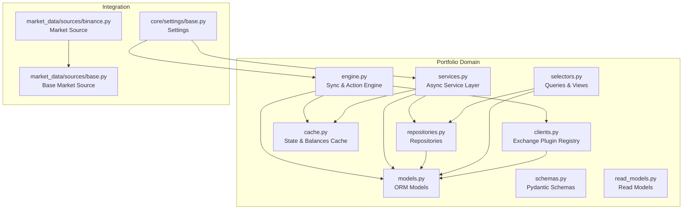
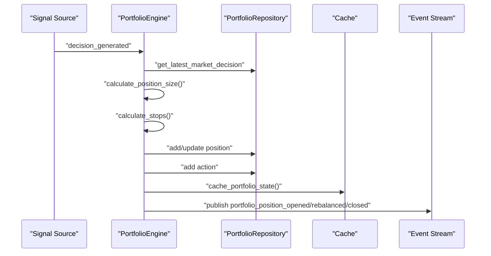
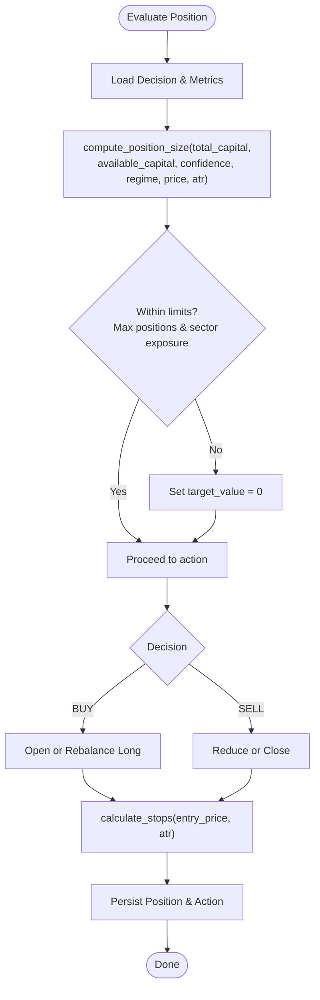
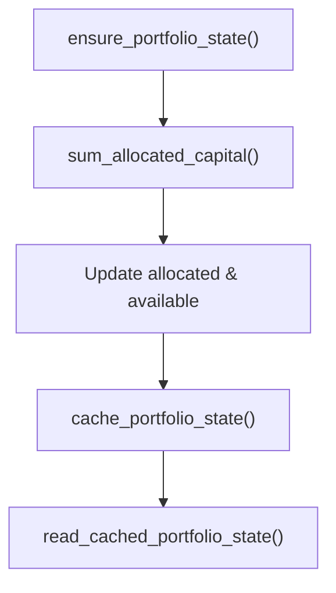
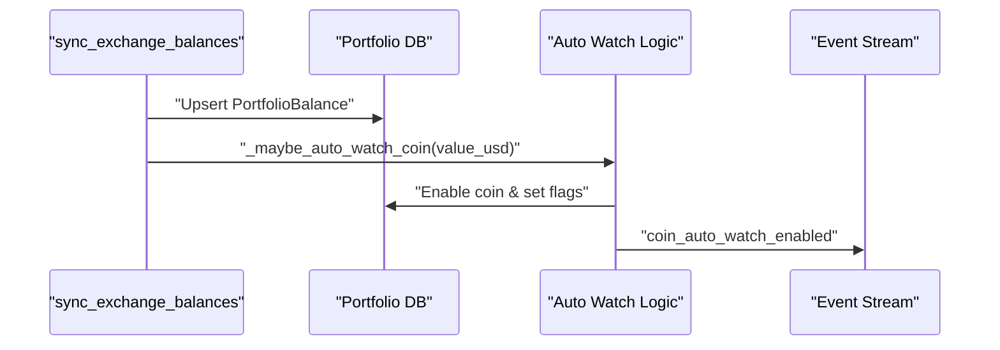
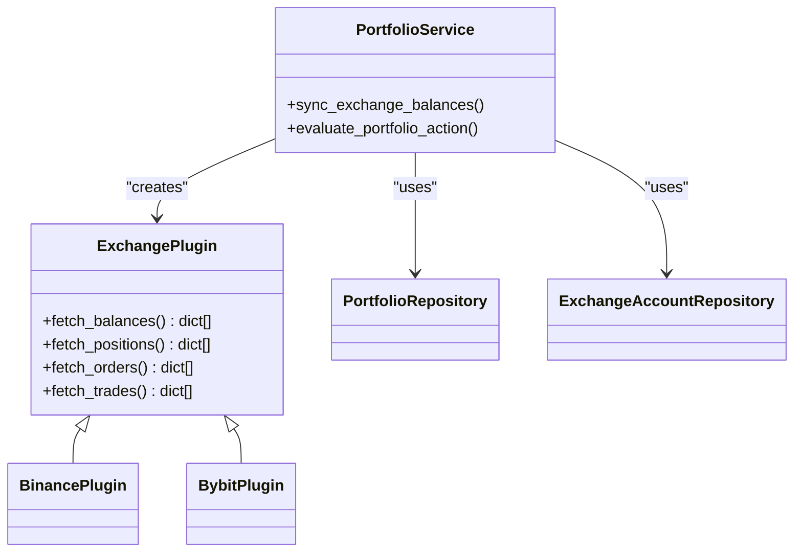
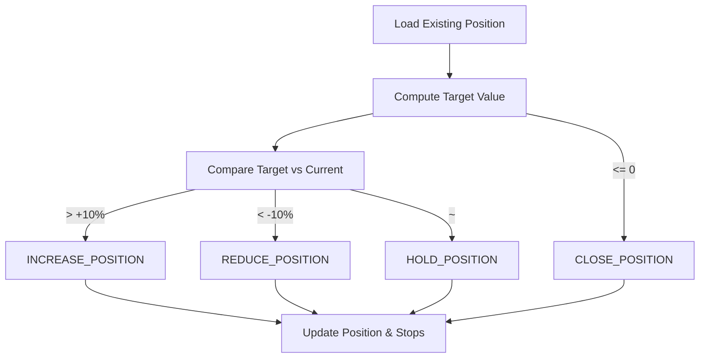
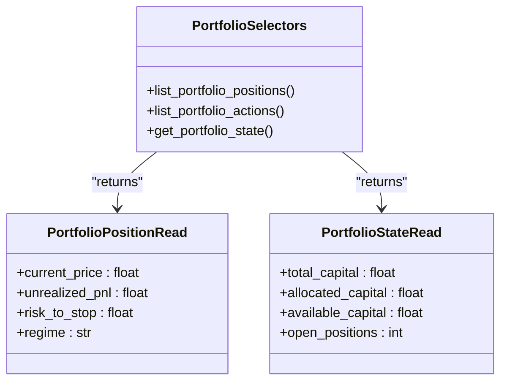
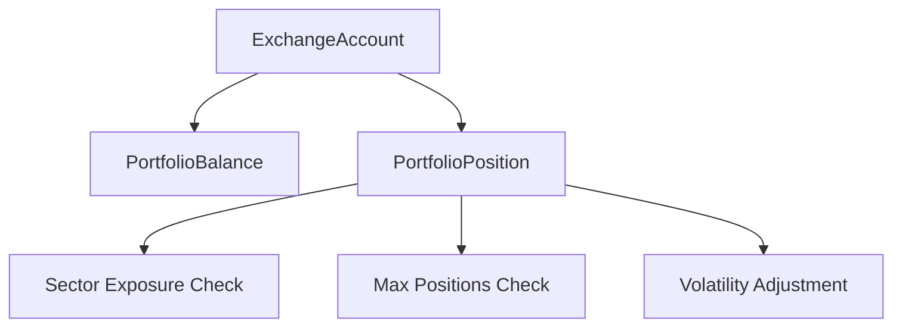
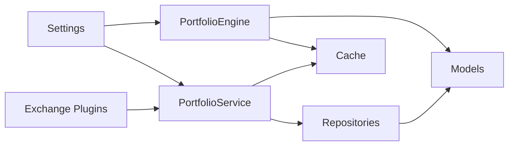

# Portfolio Management System

<cite>
**Referenced Files in This Document**
- [engine.py](file://src/apps/portfolio/engine.py)
- [services.py](file://src/apps/portfolio/services.py)
- [models.py](file://src/apps/portfolio/models.py)
- [schemas.py](file://src/apps/portfolio/schemas.py)
- [selectors.py](file://src/apps/portfolio/selectors.py)
- [cache.py](file://src/apps/portfolio/cache.py)
- [repositories.py](file://src/apps/portfolio/repositories.py)
- [read_models.py](file://src/apps/portfolio/read_models.py)
- [clients.py](file://src/apps/portfolio/clients.py)
- [base.py](file://src/core/settings/base.py)
- [test_engine.py](file://tests/apps/portfolio/test_engine.py)
- [test_position_sizing.py](file://tests/apps/portfolio/test_position_sizing.py)
- [test_risk_management.py](file://tests/apps/portfolio/test_risk_management.py)
- [binance.py](file://src/apps/market_data/sources/binance.py)
- [base_market_source.py](file://src/apps/market_data/sources/base.py)
</cite>

## Table of Contents
1. [Introduction](#introduction)
2. [Project Structure](#project-structure)
3. [Core Components](#core-components)
4. [Architecture Overview](#architecture-overview)
5. [Detailed Component Analysis](#detailed-component-analysis)
6. [Dependency Analysis](#dependency-analysis)
7. [Performance Considerations](#performance-considerations)
8. [Troubleshooting Guide](#troubleshooting-guide)
9. [Conclusion](#conclusion)
10. [Appendices](#appendices)

## Introduction
This document describes the portfolio management system, focusing on position sizing algorithms, risk management controls, capital allocation strategies, and performance tracking mechanisms. It also documents the portfolio engine architecture, automatic watchlist management, exchange integration, order execution workflows, risk metrics computation, position adjustment triggers, and portfolio rebalancing strategies. Multi-exchange coordination and capital efficiency optimization are addressed alongside performance attribution, drawdown analysis, and risk control mechanisms.

## Project Structure
The portfolio subsystem is organized around a service-layer engine, repositories, models, caching, and exchange plugin abstractions. It integrates with market data and signals to drive decisions and maintains state for positions, balances, actions, and overall portfolio capital.

**Diagram sources**
- [engine.py:1-608](file://src/apps/portfolio/engine.py#L1-L608)
- [services.py:1-706](file://src/apps/portfolio/services.py#L1-L706)
- [repositories.py:1-222](file://src/apps/portfolio/repositories.py#L1-L222)
- [models.py:1-151](file://src/apps/portfolio/models.py#L1-L151)
- [schemas.py:1-63](file://src/apps/portfolio/schemas.py#L1-L63)
- [selectors.py:1-186](file://src/apps/portfolio/selectors.py#L1-L186)
- [read_models.py:1-125](file://src/apps/portfolio/read_models.py#L1-L125)
- [cache.py:1-110](file://src/apps/portfolio/cache.py#L1-L110)
- [clients.py:1-93](file://src/apps/portfolio/clients.py#L1-L93)
- [binance.py:1-86](file://src/apps/market_data/sources/binance.py#L1-L86)
- [base_market_source.py:1-157](file://src/apps/market_data/sources/base.py#L1-L157)
- [base.py:1-90](file://src/core/settings/base.py#L1-L90)

**Section sources**
- [engine.py:1-608](file://src/apps/portfolio/engine.py#L1-L608)
- [services.py:1-706](file://src/apps/portfolio/services.py#L1-L706)
- [repositories.py:1-222](file://src/apps/portfolio/repositories.py#L1-L222)
- [models.py:1-151](file://src/apps/portfolio/models.py#L1-L151)
- [schemas.py:1-63](file://src/apps/portfolio/schemas.py#L1-L63)
- [selectors.py:1-186](file://src/apps/portfolio/selectors.py#L1-L186)
- [read_models.py:1-125](file://src/apps/portfolio/read_models.py#L1-L125)
- [cache.py:1-110](file://src/apps/portfolio/cache.py#L1-L110)
- [clients.py:1-93](file://src/apps/portfolio/clients.py#L1-L93)
- [binance.py:1-86](file://src/apps/market_data/sources/binance.py#L1-L86)
- [base_market_source.py:1-157](file://src/apps/market_data/sources/base.py#L1-L157)
- [base.py:1-90](file://src/core/settings/base.py#L1-L90)

## Core Components
- Position sizing and risk controls:
  - Position size computed from total capital, available capital, decision confidence, market regime, and volatility (ATR).
  - Stop-loss and take-profit derived from ATR multipliers.
  - Sector exposure and maximum positions enforced via risk checks.
- Capital allocation and state:
  - PortfolioState tracks total, allocated, and available capital; refreshed after actions and syncs.
- Automatic watchlist management:
  - Coins exceeding a minimum position value are auto-enabled for historical sync.
- Exchange integration:
  - ExchangePlugin registry supports multiple exchanges; currently includes placeholders for Binance and Bybit.
- Order/action engine:
  - Evaluates BUY/SELL decisions and emits portfolio events for opened/closed/rebalanced positions.
- Performance tracking:
  - PortfolioPositionRead and PortfolioStateRead models expose PnL, risk-to-stop, and state metrics.

**Section sources**
- [engine.py:117-147](file://src/apps/portfolio/engine.py#L117-L147)
- [engine.py:108-114](file://src/apps/portfolio/engine.py#L108-L114)
- [engine.py:150-164](file://src/apps/portfolio/engine.py#L150-L164)
- [engine.py:80-105](file://src/apps/portfolio/engine.py#L80-L105)
- [engine.py:426-448](file://src/apps/portfolio/engine.py#L426-L448)
- [clients.py:9-92](file://src/apps/portfolio/clients.py#L9-L92)
- [services.py:231-431](file://src/apps/portfolio/services.py#L231-L431)
- [schemas.py:8-62](file://src/apps/portfolio/schemas.py#L8-L62)
- [read_models.py:8-124](file://src/apps/portfolio/read_models.py#L8-L124)

## Architecture Overview
The portfolio engine orchestrates decision-driven actions and state updates. It reads signals, computes position sizes, enforces risk limits, updates positions, and publishes events. The async service layer mirrors the sync engine’s logic for runtime orchestration.

**Diagram sources**
- [engine.py:248-403](file://src/apps/portfolio/engine.py#L248-L403)
- [services.py:231-431](file://src/apps/portfolio/services.py#L231-L431)
- [repositories.py:39-222](file://src/apps/portfolio/repositories.py#L39-L222)
- [cache.py:52-79](file://src/apps/portfolio/cache.py#L52-L79)

## Detailed Component Analysis

### Position Sizing and Risk Controls
- Position sizing factors:
  - Base size proportional to total capital and configured max position size.
  - Regime factor adjusts for trend conditions.
  - Volatility adjustment scales by ATR relative to price.
  - Capped by available capital and maximum position size.
- Stop-loss and take-profit:
  - Derived from entry price and ATR using configurable multipliers.
- Risk constraints:
  - Maximum number of open positions per timeframe.
  - Sector exposure ratio compared against a cap.
  - Existing position value considered when recalculating target value.

**Diagram sources**
- [engine.py:117-147](file://src/apps/portfolio/engine.py#L117-L147)
- [engine.py:108-114](file://src/apps/portfolio/engine.py#L108-L114)
- [engine.py:248-403](file://src/apps/portfolio/engine.py#L248-L403)

**Section sources**
- [engine.py:117-147](file://src/apps/portfolio/engine.py#L117-L147)
- [engine.py:108-114](file://src/apps/portfolio/engine.py#L108-L114)
- [engine.py:284-287](file://src/apps/portfolio/engine.py#L284-L287)
- [test_position_sizing.py:1-33](file://tests/apps/portfolio/test_position_sizing.py#L1-L33)

### Capital Allocation and Portfolio State
- PortfolioState initialized from settings and updated on each action and sync.
- Available capital equals total minus allocated capital; refreshed after position changes.
- Cached state exposed via sync and async cache helpers.

**Diagram sources**
- [engine.py:64-105](file://src/apps/portfolio/engine.py#L64-L105)
- [cache.py:52-79](file://src/apps/portfolio/cache.py#L52-L79)
- [repositories.py:76-89](file://src/apps/portfolio/repositories.py#L76-L89)

**Section sources**
- [engine.py:64-105](file://src/apps/portfolio/engine.py#L64-L105)
- [cache.py:52-79](file://src/apps/portfolio/cache.py#L52-L79)
- [repositories.py:76-89](file://src/apps/portfolio/repositories.py#L76-L89)

### Automatic Watchlist Management
- On balance sync, coins with sufficient USD value are auto-enabled for historical synchronization.
- Emits a dedicated event to notify downstream systems.

**Diagram sources**
- [engine.py:509-607](file://src/apps/portfolio/engine.py#L509-L607)
- [engine.py:426-448](file://src/apps/portfolio/engine.py#L426-L448)

**Section sources**
- [engine.py:509-607](file://src/apps/portfolio/engine.py#L509-L607)
- [engine.py:426-448](file://src/apps/portfolio/engine.py#L426-L448)

### Exchange Integration and Order Execution Workflows
- ExchangePlugin interface defines balance/position/order/trade retrieval.
- Registry supports Binance and Bybit plugins; concrete implementations are placeholders in this codebase.
- PortfolioService orchestrates async balance sync and position reconciliation.

**Diagram sources**
- [clients.py:9-92](file://src/apps/portfolio/clients.py#L9-L92)
- [services.py:433-463](file://src/apps/portfolio/services.py#L433-L463)
- [repositories.py:15-37](file://src/apps/portfolio/repositories.py#L15-L37)

**Section sources**
- [clients.py:9-92](file://src/apps/portfolio/clients.py#L9-L92)
- [services.py:433-463](file://src/apps/portfolio/services.py#L433-L463)
- [repositories.py:15-37](file://src/apps/portfolio/repositories.py#L15-L37)

### Risk Metrics, Position Adjustment Triggers, and Rebalancing
- Risk metrics:
  - Current price, entry price, stop loss, take profit, and unrealized PnL computed for reporting.
  - Risk-to-stop ratio derived from entry and stop level.
- Adjustment triggers:
  - Increase position when target exceeds current by more than 10%.
  - Reduce position when target falls below current by more than 10%.
  - Close when target is zero.
- Sector exposure and position caps enforced during sizing.

**Diagram sources**
- [engine.py:207-246](file://src/apps/portfolio/engine.py#L207-L246)
- [services.py:192-230](file://src/apps/portfolio/services.py#L192-L230)
- [selectors.py:87-91](file://src/apps/portfolio/selectors.py#L87-L91)

**Section sources**
- [engine.py:207-246](file://src/apps/portfolio/engine.py#L207-L246)
- [services.py:192-230](file://src/apps/portfolio/services.py#L192-L230)
- [selectors.py:87-91](file://src/apps/portfolio/selectors.py#L87-L91)

### Performance Tracking and Attribution
- PortfolioPositionRead exposes current price, unrealized PnL, and risk metrics for dashboards and analytics.
- PortfolioStateRead provides capital and position counts for monitoring.
- Sector and regime details enrich risk context.

**Diagram sources**
- [schemas.py:8-62](file://src/apps/portfolio/schemas.py#L8-L62)
- [read_models.py:8-124](file://src/apps/portfolio/read_models.py#L8-L124)
- [selectors.py:38-186](file://src/apps/portfolio/selectors.py#L38-L186)

**Section sources**
- [schemas.py:8-62](file://src/apps/portfolio/schemas.py#L8-L62)
- [read_models.py:8-124](file://src/apps/portfolio/read_models.py#L8-L124)
- [selectors.py:38-186](file://src/apps/portfolio/selectors.py#L38-L186)

### Multi-Exchange Portfolio Coordination and Capital Efficiency
- ExchangeAccount models track credentials and enable/disable flags.
- PortfolioService lists enabled accounts and reconciles balances and positions per exchange.
- Capital efficiency optimized by:
  - Sector exposure caps to prevent over-concentration.
  - Position caps to limit maximum open positions.
  - Volatility-adjusted sizing to reduce impact during high-volatility regimes.

**Diagram sources**
- [models.py:16-46](file://src/apps/portfolio/models.py#L16-L46)
- [services.py:433-463](file://src/apps/portfolio/services.py#L433-L463)
- [engine.py:284-287](file://src/apps/portfolio/engine.py#L284-L287)
- [engine.py:137-141](file://src/apps/portfolio/engine.py#L137-L141)

**Section sources**
- [models.py:16-46](file://src/apps/portfolio/models.py#L16-L46)
- [services.py:433-463](file://src/apps/portfolio/services.py#L433-L463)
- [engine.py:284-287](file://src/apps/portfolio/engine.py#L284-L287)
- [engine.py:137-141](file://src/apps/portfolio/engine.py#L137-L141)

## Dependency Analysis
- Cohesion:
  - Portfolio engine and service encapsulate decision logic and persistence.
  - Exchange plugin registry centralizes exchange integrations.
- Coupling:
  - Engine depends on models, settings, and cache; service depends on repositories and settings.
  - Selectors depend on models and settings for reporting.
- External dependencies:
  - Redis for caching state and balances.
  - Settings for risk parameters and scheduling.

**Diagram sources**
- [base.py:60-71](file://src/core/settings/base.py#L60-L71)
- [engine.py:10-25](file://src/apps/portfolio/engine.py#L10-L25)
- [services.py:173-186](file://src/apps/portfolio/services.py#L173-L186)
- [repositories.py:1-11](file://src/apps/portfolio/repositories.py#L1-L11)
- [cache.py:12-14](file://src/apps/portfolio/cache.py#L12-L14)
- [clients.py:30-49](file://src/apps/portfolio/clients.py#L30-L49)

**Section sources**
- [base.py:60-71](file://src/core/settings/base.py#L60-L71)
- [engine.py:10-25](file://src/apps/portfolio/engine.py#L10-L25)
- [services.py:173-186](file://src/apps/portfolio/services.py#L173-L186)
- [repositories.py:1-11](file://src/apps/portfolio/repositories.py#L1-L11)
- [cache.py:12-14](file://src/apps/portfolio/cache.py#L12-L14)
- [clients.py:30-49](file://src/apps/portfolio/clients.py#L30-L49)

## Performance Considerations
- Use async repositories and cache helpers in runtime paths to minimize latency.
- Cache portfolio state and balances to avoid frequent DB reads.
- Keep position sizing and stop calculations vectorizable where possible in higher layers.
- Monitor Redis connectivity and TTL to maintain cache freshness.

[No sources needed since this section provides general guidance]

## Troubleshooting Guide
- Missing decision or metrics:
  - Evaluation returns skipped status when decision or metrics are unavailable.
- Exchange plugin not registered:
  - Creating a plugin for an unsupported exchange raises an error; verify registration.
- Position not opening due to limits:
  - Exceeding max positions or sector exposure leads to HOLD_POSITION; adjust settings or reduce exposure.
- Balance sync not emitting events:
  - Ensure emit_events flag and value changes exceed threshold; check event publishing pipeline.

**Section sources**
- [engine.py:259-265](file://src/apps/portfolio/engine.py#L259-L265)
- [engine.py:440-448](file://src/apps/portfolio/engine.py#L440-L448)
- [clients.py:42-45](file://src/apps/portfolio/clients.py#L42-L45)
- [test_risk_management.py:12-46](file://tests/apps/portfolio/test_risk_management.py#L12-L46)
- [test_engine.py:48-78](file://tests/apps/portfolio/test_engine.py#L48-L78)

## Conclusion
The portfolio management system combines robust position sizing with strict risk controls, efficient capital allocation, and real-time performance tracking. Its modular design supports multi-exchange coordination, automatic watchlist management, and scalable runtime orchestration. Adhering to the documented parameters and workflows ensures disciplined trading discipline and improved capital efficiency.

[No sources needed since this section summarizes without analyzing specific files]

## Appendices

### Risk Control Parameters and Defaults
- Total capital, max position size, max positions, sector exposure cap, ATR multipliers, and auto-watch thresholds are configured via settings.

**Section sources**
- [base.py:60-71](file://src/core/settings/base.py#L60-L71)

### Market Data Integration Notes
- Market sources define supported intervals and symbol mappings; Binance source demonstrates typical integration patterns.
- Base market source handles rate limiting and request retries.

**Section sources**
- [binance.py:20-86](file://src/apps/market_data/sources/binance.py#L20-L86)
- [base_market_source.py:50-157](file://src/apps/market_data/sources/base.py#L50-L157)