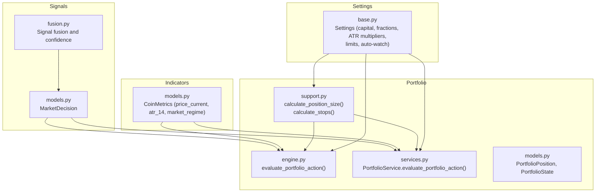
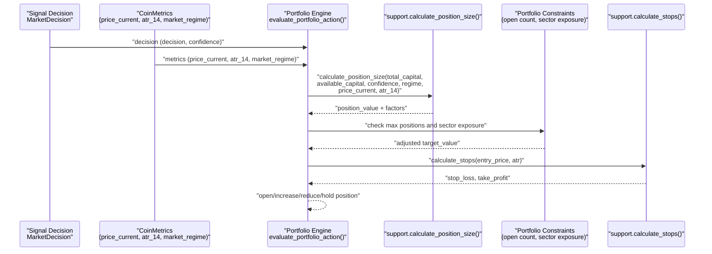
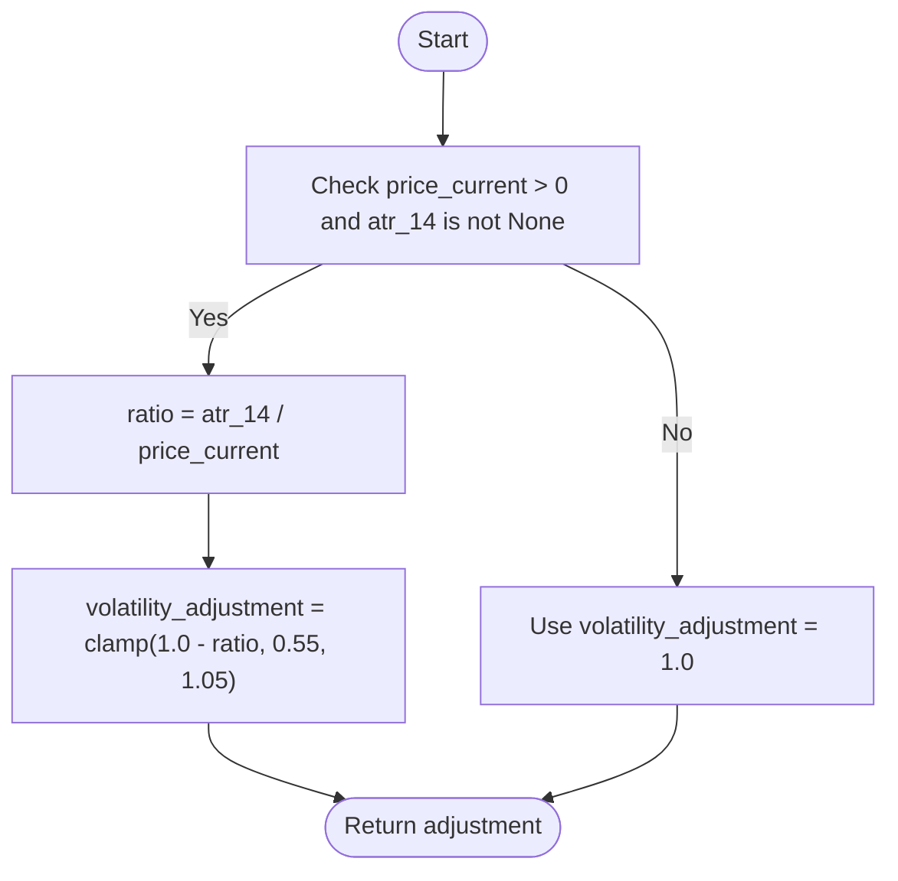
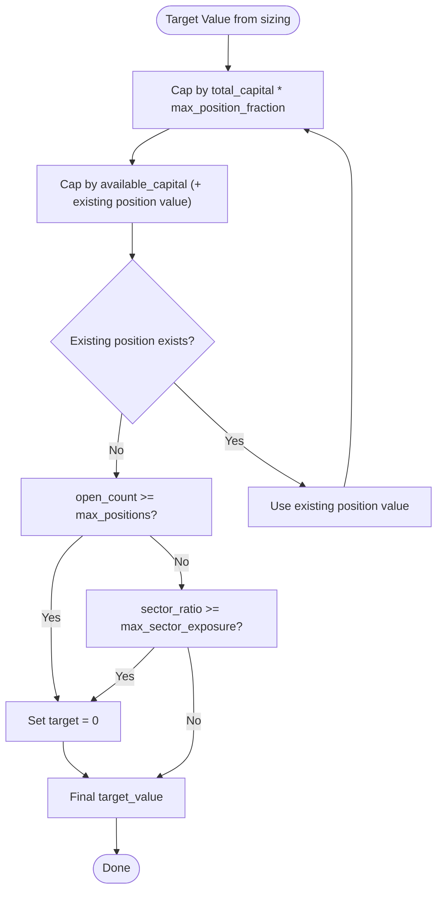
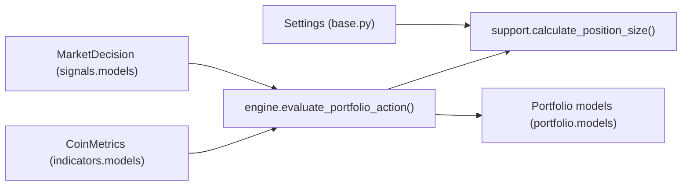

# Position Sizing Algorithms

<cite>
**Referenced Files in This Document**
- [support.py](file://src/apps/portfolio/support.py)
- [engine.py](file://src/apps/portfolio/engine.py)
- [services.py](file://src/apps/portfolio/services.py)
- [models.py](file://src/apps/portfolio/models.py)
- [base.py](file://src/core/settings/base.py)
- [test_position_sizing.py](file://tests/apps/portfolio/test_position_sizing.py)
- [models.py](file://src/apps/signals/models.py)
- [models.py](file://src/apps/indicators/models.py)
- [regime.py](file://src/apps/patterns/domain/regime.py)
- [fusion.py](file://src/apps/signals/fusion.py)
</cite>

## Table of Contents
1. [Introduction](#introduction)
2. [Project Structure](#project-structure)
3. [Core Components](#core-components)
4. [Architecture Overview](#architecture-overview)
5. [Detailed Component Analysis](#detailed-component-analysis)
6. [Dependency Analysis](#dependency-analysis)
7. [Performance Considerations](#performance-considerations)
8. [Troubleshooting Guide](#troubleshooting-guide)
9. [Conclusion](#conclusion)

## Introduction
This document explains the position sizing algorithms and calculation methods implemented in the portfolio subsystem. It covers:
- Fixed fractional sizing based on total capital and a maximum position fraction
- Volatility scaling using the Average True Range (ATR) normalized by price
- Market regime adjustments that increase or decrease exposure depending on trend and volatility regimes
- Integration with confidence scores from signals and risk tolerance parameters
- Dynamic sizing constrained by available capital, open position value, portfolio limits, and sector exposure
- Stop-loss and take-profit computation using ATR multipliers
- Parameter configuration and performance optimization strategies

## Project Structure
The position sizing logic is primarily implemented in the portfolio application and integrated with signals, indicators, and settings.

**Diagram sources**
- [support.py:37-78](file://src/apps/portfolio/support.py#L37-L78)
- [engine.py:195-351](file://src/apps/portfolio/engine.py#L195-L351)
- [services.py:231-431](file://src/apps/portfolio/services.py#L231-L431)
- [models.py:97-151](file://src/apps/portfolio/models.py#L97-L151)
- [models.py:129-149](file://src/apps/signals/models.py#L129-L149)
- [models.py:15-62](file://src/apps/indicators/models.py#L15-L62)
- [base.py:60-66](file://src/core/settings/base.py#L60-L66)

**Section sources**
- [support.py:1-79](file://src/apps/portfolio/support.py#L1-L79)
- [engine.py:1-555](file://src/apps/portfolio/engine.py#L1-L555)
- [services.py:1-706](file://src/apps/portfolio/services.py#L1-L706)
- [models.py:15-151](file://src/apps/portfolio/models.py#L15-L151)
- [base.py:1-90](file://src/core/settings/base.py#L1-L90)

## Core Components
- Fixed fractional sizing: The base position value equals total capital multiplied by a maximum position fraction.
- Confidence scaling: The base value is scaled by the decision confidence (clamped to [0, 1]).
- Regime adjustment: Multiplier applied based on detected market regime (bull, bear, sideways, high volatility).
- Volatility scaling: Adjustment factor derived from ATR divided by price, clamped to a narrow band around 1.0.
- Capital constraints: The target position value is capped by available capital and the maximum single-position fraction of total capital.
- Sector exposure and position limits: Additional caps enforced by open position count and sector exposure ratio.
- Stops: Stop-loss and take-profit computed from entry price and ATR using multipliers from settings.

**Section sources**
- [support.py:37-78](file://src/apps/portfolio/support.py#L37-L78)
- [engine.py:214-234](file://src/apps/portfolio/engine.py#L214-L234)
- [services.py:294-307](file://src/apps/portfolio/services.py#L294-L307)
- [base.py:60-66](file://src/core/settings/base.py#L60-L66)

## Architecture Overview
The position sizing flow integrates signals, indicators, and settings to produce a target position value and associated stops.

**Diagram sources**
- [engine.py:195-351](file://src/apps/portfolio/engine.py#L195-L351)
- [support.py:37-78](file://src/apps/portfolio/support.py#L37-L78)
- [models.py:129-149](file://src/apps/signals/models.py#L129-L149)
- [models.py:15-62](file://src/apps/indicators/models.py#L15-L62)

## Detailed Component Analysis

### Fixed Fractional Sizing
- Base position value is computed as total capital times a maximum position fraction from settings.
- This establishes a proportional risk per trade relative to total portfolio value.

**Section sources**
- [support.py:47](file://src/apps/portfolio/support.py#L47)
- [base.py:61](file://src/core/settings/base.py#L61)

### Confidence Scaling
- The base value is multiplied by the decision confidence, clamped to [0, 1].
- Higher confidence increases the target position value; lower confidence reduces it.

**Section sources**
- [support.py:60](file://src/apps/portfolio/support.py#L60)
- [models.py:139-141](file://src/apps/signals/models.py#L139-L141)

### Regime Adjustment
- Bull trend: slightly increases exposure.
- Bear trend: decreases exposure.
- Sideways range: modest reduction.
- High volatility: reduction to limit risk during elevated volatility episodes.
- Low volatility: not explicitly adjusted here; regime detection is handled upstream.

**Section sources**
- [support.py:48-56](file://src/apps/portfolio/support.py#L48-L56)
- [regime.py:25-66](file://src/apps/patterns/domain/regime.py#L25-L66)

### Volatility Scaling (ATR-based)
- Volatility adjustment factor is derived from ATR divided by price, clamped to a narrow range around 1.0.
- When ATR/price is higher (more volatile), the adjustment reduces the target position value.
- When ATR/price is lower (less volatile), the adjustment increases the target position value.

**Diagram sources**
- [support.py:57-60](file://src/apps/portfolio/support.py#L57-L60)

**Section sources**
- [support.py:57-60](file://src/apps/portfolio/support.py#L57-L60)

### Capital and Exposure Constraints
- Target value is capped by:
  - Maximum single-position fraction of total capital
  - Available capital (including the value of an existing position being rebalanced)
- Additional hard caps:
  - Maximum number of simultaneous positions
  - Sector exposure ratio threshold

**Diagram sources**
- [engine.py:231-234](file://src/apps/portfolio/engine.py#L231-L234)
- [services.py:304-307](file://src/apps/portfolio/services.py#L304-L307)
- [base.py:62-63](file://src/core/settings/base.py#L62-L63)

**Section sources**
- [engine.py:231-234](file://src/apps/portfolio/engine.py#L231-L234)
- [services.py:304-307](file://src/apps/portfolio/services.py#L304-L307)
- [base.py:62-63](file://src/core/settings/base.py#L62-L63)

### Stop-Loss and Take-Profit Calculation
- Stop-loss: entry price minus ATR times a multiplier from settings.
- Take-profit: entry price plus ATR times a multiplier from settings.
- If entry price or ATR are missing, stops are not set.

**Section sources**
- [support.py:28-34](file://src/apps/portfolio/support.py#L28-L34)
- [base.py:64-65](file://src/core/settings/base.py#L64-L65)

### Integration with Signals and Market Regime
- Market decisions carry a decision type and a confidence score.
- Market regime is derived from indicators and influences the regime factor.
- Signal fusion computes confidence and decision outcomes used by the engine.

**Section sources**
- [models.py:129-149](file://src/apps/signals/models.py#L129-L149)
- [regime.py:25-66](file://src/apps/patterns/domain/regime.py#L25-L66)
- [fusion.py:290-400](file://src/apps/signals/fusion.py#L290-L400)

### Portfolio State and Position Management
- Portfolio state tracks total, allocated, and available capital.
- Positions record entry price, size, value, and stops.
- Rebalancing logic opens, increases, reduces, or closes positions based on target value.

**Section sources**
- [models.py:130-142](file://src/apps/portfolio/models.py#L130-L142)
- [models.py:97-127](file://src/apps/portfolio/models.py#L97-L127)
- [engine.py:154-193](file://src/apps/portfolio/engine.py#L154-L193)
- [services.py:192-229](file://src/apps/portfolio/services.py#L192-L229)

## Dependency Analysis
Position sizing depends on:
- Settings for capital, maximum position fraction, ATR multipliers, and portfolio limits
- Market decision confidence and regime
- Current price and ATR from indicators
- Portfolio state and existing positions

**Diagram sources**
- [base.py:60-66](file://src/core/settings/base.py#L60-L66)
- [models.py:129-149](file://src/apps/signals/models.py#L129-L149)
- [models.py:15-62](file://src/apps/indicators/models.py#L15-L62)
- [engine.py:195-351](file://src/apps/portfolio/engine.py#L195-L351)
- [models.py:97-151](file://src/apps/portfolio/models.py#L97-L151)

**Section sources**
- [base.py:60-66](file://src/core/settings/base.py#L60-L66)
- [models.py:129-149](file://src/apps/signals/models.py#L129-L149)
- [models.py:15-62](file://src/apps/indicators/models.py#L15-L62)
- [engine.py:195-351](file://src/apps/portfolio/engine.py#L195-L351)
- [models.py:97-151](file://src/apps/portfolio/models.py#L97-L151)

## Performance Considerations
- Minimize repeated reads: cache portfolio state and balances to avoid frequent database queries.
- Batch updates: group position and state updates to reduce transaction overhead.
- Clamp operations: keep clamping tight to prevent extreme values and costly re-balancing.
- Early exits: skip evaluation when metrics or decisions are missing to avoid unnecessary work.
- Asynchronous services: use async portfolio service for scalable balance synchronization and decision evaluation.

[No sources needed since this section provides general guidance]

## Troubleshooting Guide
Common issues and resolutions:
- Position value is zero despite positive confidence:
  - Check portfolio limits (max positions, sector exposure).
  - Verify available capital and whether an existing position is included in the cap calculation.
- Unexpectedly small positions:
  - Confirm ATR and price_current are present; volatility scaling may reduce target value.
  - Review regime factor (e.g., high volatility reduces exposure).
- Stops not set:
  - Ensure entry price and ATR are valid; otherwise, stops are not computed.
- Tests failing:
  - Compare expected vs. actual values using the provided unit tests as references.

**Section sources**
- [engine.py:231-234](file://src/apps/portfolio/engine.py#L231-L234)
- [services.py:304-307](file://src/apps/portfolio/services.py#L304-L307)
- [support.py:28-34](file://src/apps/portfolio/support.py#L28-L34)
- [test_position_sizing.py:6-33](file://tests/apps/portfolio/test_position_sizing.py#L6-L33)

## Conclusion
The position sizing system combines fixed fractional sizing with confidence, regime, and volatility adjustments, then enforces capital and concentration constraints. It integrates cleanly with signals and indicators, and uses configurable parameters to align risk with market conditions and operator preferences. The design supports dynamic sizing, explicit stop-loss and take-profit computation, and robust limits to manage portfolio risk.