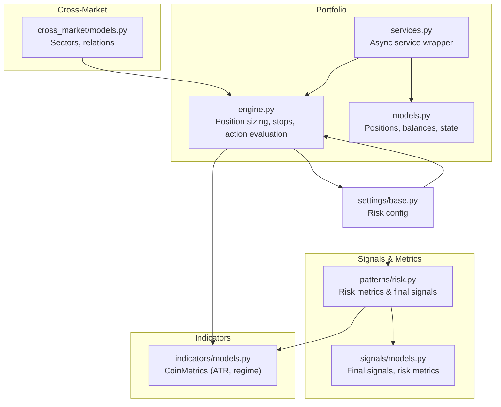
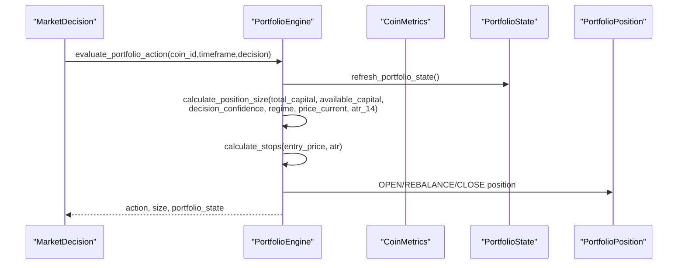
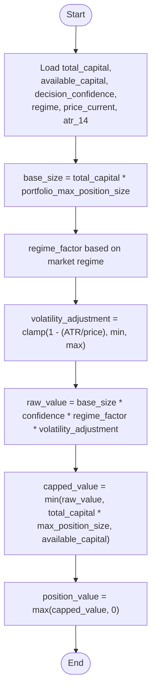
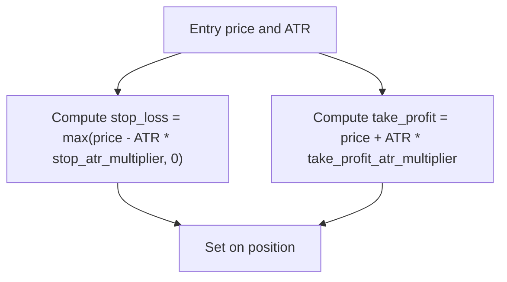
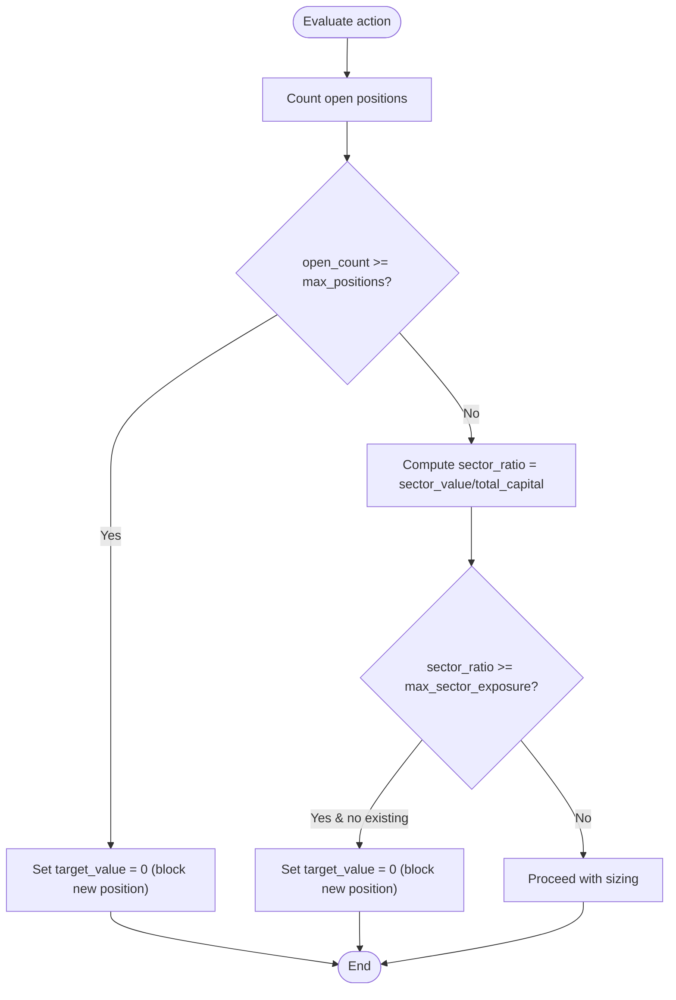
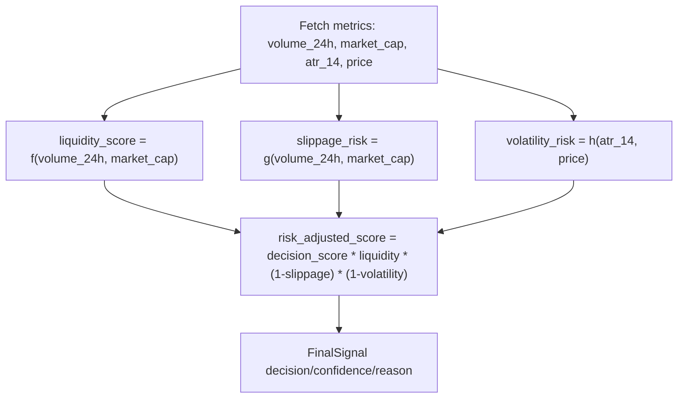
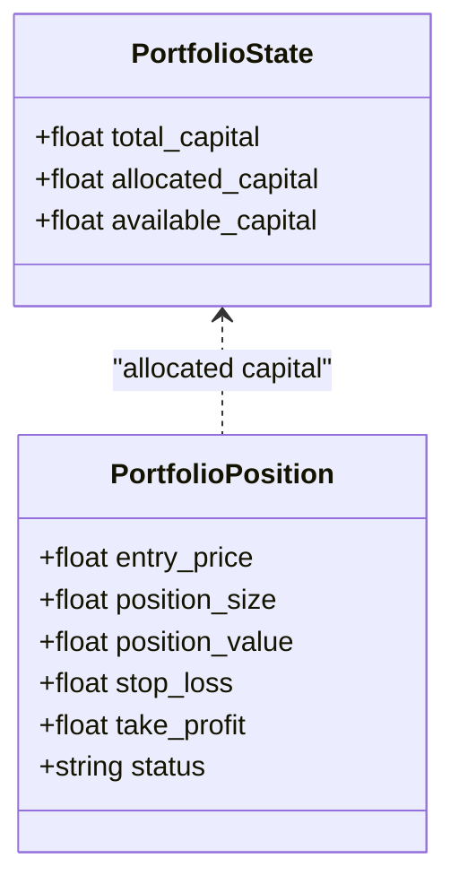
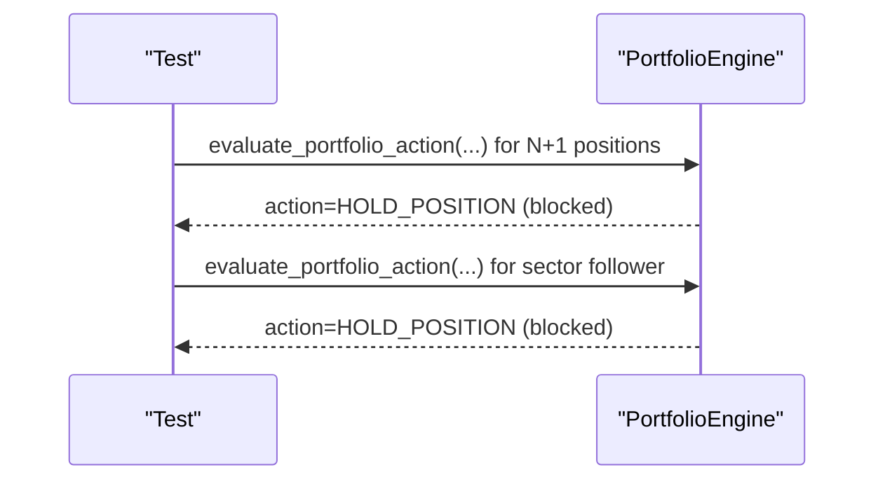
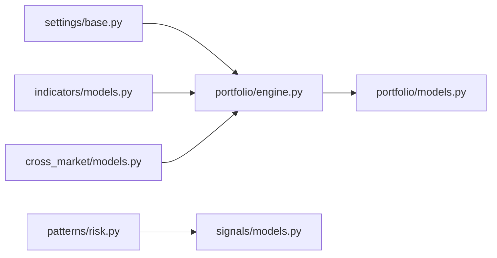

# Risk Management Controls

<cite>
**Referenced Files in This Document**
- [engine.py](file://src/apps/portfolio/engine.py)
- [services.py](file://src/apps/portfolio/services.py)
- [models.py](file://src/apps/portfolio/models.py)
- [base.py](file://src/core/settings/base.py)
- [risk.py](file://src/apps/patterns/domain/risk.py)
- [signals/models.py](file://src/apps/signals/models.py)
- [indicators/models.py](file://src/apps/indicators/models.py)
- [cross_market/models.py](file://src/apps/cross_market/models.py)
- [test_risk_management.py](file://tests/apps/portfolio/test_risk_management.py)
- [20260311_000013_liquidity_risk_engine.py](file://src/migrations/versions/20260311_000013_liquidity_risk_engine.py)
</cite>

## Table of Contents
1. [Introduction](#introduction)
2. [Project Structure](#project-structure)
3. [Core Components](#core-components)
4. [Architecture Overview](#architecture-overview)
5. [Detailed Component Analysis](#detailed-component-analysis)
6. [Dependency Analysis](#dependency-analysis)
7. [Performance Considerations](#performance-considerations)
8. [Troubleshooting Guide](#troubleshooting-guide)
9. [Conclusion](#conclusion)
10. [Appendices](#appendices)

## Introduction
This document explains the risk management controls implemented in the portfolio system. It covers stop-loss and take-profit mechanisms, position sizing constraints, position limits, sector exposure caps, and volatility-based adjustments. It also documents risk metrics computation for liquidity, slippage, and volatility, and shows how these influence final decisions. Automated triggers prevent violations of position limits and sector exposure thresholds, while configuration settings govern risk behavior. Manual overrides are supported via settings and test fixtures.

## Project Structure
Risk controls span several modules:
- Portfolio engine and service: position sizing, stops/take-profit, position limits, sector exposure, and action evaluation
- Signals and risk metrics: liquidity, slippage, and volatility risk metrics and risk-adjusted final signals
- Indicators: market regime and ATR used in position sizing
- Cross-market: sector modeling and relations
- Settings: global risk configuration
- Tests: validation of position limit and sector exposure blocks

**Diagram sources**
- [engine.py:117-147](file://src/apps/portfolio/engine.py#L117-L147)
- [services.py:231-431](file://src/apps/portfolio/services.py#L231-L431)
- [models.py:97-128](file://src/apps/portfolio/models.py#L97-L128)
- [risk.py:130-179](file://src/apps/patterns/domain/risk.py#L130-L179)
- [signals/models.py:151-165](file://src/apps/signals/models.py#L151-L165)
- [indicators/models.py:15-62](file://src/apps/indicators/models.py#L15-L62)
- [cross_market/models.py:15-84](file://src/apps/cross_market/models.py#L15-L84)
- [base.py:60-66](file://src/core/settings/base.py#L60-L66)

**Section sources**
- [engine.py:117-147](file://src/apps/portfolio/engine.py#L117-L147)
- [services.py:231-431](file://src/apps/portfolio/services.py#L231-L431)
- [models.py:97-128](file://src/apps/portfolio/models.py#L97-L128)
- [risk.py:130-179](file://src/apps/patterns/domain/risk.py#L130-L179)
- [signals/models.py:151-165](file://src/apps/signals/models.py#L151-L165)
- [indicators/models.py:15-62](file://src/apps/indicators/models.py#L15-L62)
- [cross_market/models.py:15-84](file://src/apps/cross_market/models.py#L15-L84)
- [base.py:60-66](file://src/core/settings/base.py#L60-L66)

## Core Components
- Position sizing and volatility adjustment: computes target position value considering capital, confidence, regime, and ATR-derived volatility.
- Stop-loss and take-profit: derived from ATR multiplied by configurable multipliers.
- Position limits: maximum number of simultaneous open positions.
- Sector exposure cap: maximum fraction of total capital allocated to a single sector.
- Risk metrics: liquidity score, slippage risk, and volatility risk; used to compute risk-adjusted scores and final signals.
- Portfolio state: total capital, allocated capital, and available capital.

**Section sources**
- [engine.py:117-147](file://src/apps/portfolio/engine.py#L117-L147)
- [engine.py:108-115](file://src/apps/portfolio/engine.py#L108-L115)
- [engine.py:284-287](file://src/apps/portfolio/engine.py#L284-L287)
- [services.py:304-307](file://src/apps/portfolio/services.py#L304-L307)
- [risk.py:48-67](file://src/apps/patterns/domain/risk.py#L48-L67)
- [risk.py:69-82](file://src/apps/patterns/domain/risk.py#L69-L82)
- [models.py:130-142](file://src/apps/portfolio/models.py#L130-L142)

## Architecture Overview
The portfolio risk engine orchestrates position sizing and action decisions. It reads settings, market regime and ATR from indicators, and applies sector exposure and position count constraints. Stops and take-profit are computed per position. Risk metrics are periodically updated and influence final signals.

**Diagram sources**
- [engine.py:248-403](file://src/apps/portfolio/engine.py#L248-L403)
- [engine.py:117-147](file://src/apps/portfolio/engine.py#L117-L147)
- [engine.py:108-115](file://src/apps/portfolio/engine.py#L108-L115)
- [indicators/models.py:15-62](file://src/apps/indicators/models.py#L15-L62)
- [models.py:130-142](file://src/apps/portfolio/models.py#L130-L142)

## Detailed Component Analysis

### Position Sizing Constraints
- Base position value is a percentage of total capital.
- Regime factors adjust exposure depending on market regime.
- Volatility adjustment scales position value based on ATR relative to price.
- Final position value is capped by available capital and maximum position size.

**Diagram sources**
- [engine.py:117-147](file://src/apps/portfolio/engine.py#L117-L147)

**Section sources**
- [engine.py:117-147](file://src/apps/portfolio/engine.py#L117-L147)
- [base.py:60-66](file://src/core/settings/base.py#L60-L66)

### Stop-Loss and Take-Profit Controls
- Stop-loss equals price minus ATR multiplied by a configurable multiplier.
- Take-profit equals price plus ATR multiplied by a configurable multiplier.
- These values are set when opening or rebalancing positions.

**Diagram sources**
- [engine.py:108-115](file://src/apps/portfolio/engine.py#L108-L115)
- [base.py:64-65](file://src/core/settings/base.py#L64-L65)

**Section sources**
- [engine.py:108-115](file://src/apps/portfolio/engine.py#L108-L115)
- [base.py:64-65](file://src/core/settings/base.py#L64-L65)

### Position Limits and Sector Exposure Caps
- New positions are blocked when the number of open positions reaches the configured maximum.
- New positions are blocked when adding a new holding would exceed the sector exposure cap (computed as sector value / total capital).
- Existing positions can still be adjusted or closed regardless of the sector cap.

**Diagram sources**
- [engine.py:284-287](file://src/apps/portfolio/engine.py#L284-L287)
- [services.py:304-307](file://src/apps/portfolio/services.py#L304-L307)

**Section sources**
- [engine.py:284-287](file://src/apps/portfolio/engine.py#L284-L287)
- [services.py:304-307](file://src/apps/portfolio/services.py#L304-L307)
- [base.py:62-66](file://src/core/settings/base.py#L62-L66)

### Risk Metrics Calculation
- Liquidity score combines 24h volume and market cap.
- Slippage risk estimated from activity ratio.
- Volatility risk from ATR/price ratio.
- Risk-adjusted score multiplies decision score by liquidity and inverse risks.
- Final signals are emitted when risk-adjusted conditions change materially.

**Diagram sources**
- [risk.py:130-179](file://src/apps/patterns/domain/risk.py#L130-L179)
- [risk.py:182-213](file://src/apps/patterns/domain/risk.py#L182-L213)
- [signals/models.py:151-165](file://src/apps/signals/models.py#L151-L165)

**Section sources**
- [risk.py:48-67](file://src/apps/patterns/domain/risk.py#L48-L67)
- [risk.py:69-82](file://src/apps/patterns/domain/risk.py#L69-L82)
- [risk.py:130-179](file://src/apps/patterns/domain/risk.py#L130-L179)
- [signals/models.py:83-103](file://src/apps/signals/models.py#L83-L103)

### Portfolio State and Position Lifecycle
- Portfolio state tracks total, allocated, and available capital.
- Positions store entry price, size, value, and stop-loss/take-profit.
- Rebalancing adjusts entry price, size, value, and recalculates stops/take-profit.

**Diagram sources**
- [models.py:130-142](file://src/apps/portfolio/models.py#L130-L142)
- [models.py:97-128](file://src/apps/portfolio/models.py#L97-L128)

**Section sources**
- [models.py:130-142](file://src/apps/portfolio/models.py#L130-L142)
- [models.py:97-128](file://src/apps/portfolio/models.py#L97-L128)

### Automated Risk Mitigation Triggers
- Position limit trigger: when open positions reach the maximum, new positions are blocked.
- Sector exposure trigger: when adding a position would exceed the sector cap, new positions are blocked.
- Tests demonstrate both behaviors.

**Diagram sources**
- [test_risk_management.py:12-46](file://tests/apps/portfolio/test_risk_management.py#L12-L46)
- [test_risk_management.py:49-84](file://tests/apps/portfolio/test_risk_management.py#L49-L84)

**Section sources**
- [test_risk_management.py:12-46](file://tests/apps/portfolio/test_risk_management.py#L12-L46)
- [test_risk_management.py:49-84](file://tests/apps/portfolio/test_risk_management.py#L49-L84)

### Manual Override Capabilities
- Settings allow tuning of maximum positions, sector exposure, and ATR-based stop/take-profit multipliers.
- Tests temporarily override sector exposure to validate blocking behavior.

**Section sources**
- [base.py:60-66](file://src/core/settings/base.py#L60-L66)
- [test_risk_management.py:66-84](file://tests/apps/portfolio/test_risk_management.py#L66-L84)

### VaR, Maximum Drawdown Tracking, and Volatility-Based Controls
- VaR is not explicitly implemented in the portfolio engine.
- Maximum drawdown tracking exists in signal history and pattern domains but is not integrated into portfolio risk controls.
- Volatility-based risk metrics (ATR/price) are used for position sizing and risk-adjusted signals.

**Section sources**
- [signals/models.py:75-77](file://src/apps/signals/models.py#L75-L77)
- [risk.py:62-67](file://src/apps/patterns/domain/risk.py#L62-L67)

### Correlation-Based Risk Management
- Sector strength and relations are modeled; correlation breakdown detectors identify structural shifts.
- While correlation metrics exist, explicit portfolio-level correlation constraints are not present in the portfolio engine.

**Section sources**
- [cross_market/models.py:15-84](file://src/apps/cross_market/models.py#L15-L84)
- [20260311_000013_liquidity_risk_engine.py:21-56](file://src/migrations/versions/20260311_000013_liquidity_risk_engine.py#L21-L56)

## Dependency Analysis
- Portfolio engine depends on settings, indicators (regime, ATR), and models (positions, state).
- Risk metrics depend on indicator cache and coin metrics.
- Sector exposure depends on coin-to-sector mapping and portfolio positions.

**Diagram sources**
- [base.py:60-66](file://src/core/settings/base.py#L60-L66)
- [engine.py:117-147](file://src/apps/portfolio/engine.py#L117-L147)
- [models.py:97-128](file://src/apps/portfolio/models.py#L97-L128)
- [risk.py:130-179](file://src/apps/patterns/domain/risk.py#L130-L179)
- [signals/models.py:151-165](file://src/apps/signals/models.py#L151-L165)
- [cross_market/models.py:15-84](file://src/apps/cross_market/models.py#L15-L84)

**Section sources**
- [engine.py:117-147](file://src/apps/portfolio/engine.py#L117-L147)
- [risk.py:130-179](file://src/apps/patterns/domain/risk.py#L130-L179)
- [cross_market/models.py:15-84](file://src/apps/cross_market/models.py#L15-L84)

## Performance Considerations
- Position sizing and stop calculations are O(1) per evaluation.
- Sector exposure ratio computation scans open positions; keep position counts within expected bounds.
- Risk metric updates scan recent decisions and indicator cache; batch refreshes reduce overhead.

## Troubleshooting Guide
- New positions not opening:
  - Verify open position count vs. maximum positions.
  - Check sector exposure ratio vs. sector cap.
  - Confirm decision confidence and regime factor.
- Stops/take-profit not updating:
  - Ensure ATR and price are available.
  - Verify settings for ATR multipliers.
- Risk-adjusted signals unchanged:
  - Check materiality thresholds for score and confidence deltas.

**Section sources**
- [engine.py:284-287](file://src/apps/portfolio/engine.py#L284-L287)
- [engine.py:108-115](file://src/apps/portfolio/engine.py#L108-L115)
- [risk.py:274-291](file://src/apps/patterns/domain/risk.py#L274-L291)

## Conclusion
The portfolio system enforces disciplined risk through position sizing with regime and volatility adjustments, strict position and sector exposure limits, and ATR-based stops/take-profit. Risk metrics inform decision quality and signal confidence. While VaR and explicit correlation-based constraints are not implemented, the existing controls provide strong safeguards for capital preservation and coherent portfolio behavior.

## Appendices

### Risk Threshold Configuration
- Total capital, maximum position size, maximum positions, sector exposure cap, stop ATR multiplier, take-profit ATR multiplier, and auto-watch minimum position value are configured in settings.

**Section sources**
- [base.py:60-66](file://src/core/settings/base.py#L60-L66)

### Example Scenarios and Violation Handling
- Scenario: Open positions equal maximum → new positions are blocked (HOLD_POSITION).
- Scenario: Adding a position exceeds sector exposure → new positions are blocked (HOLD_POSITION).
- Violation handling: No action taken; portfolio remains in current state.

**Section sources**
- [test_risk_management.py:12-46](file://tests/apps/portfolio/test_risk_management.py#L12-L46)
- [test_risk_management.py:49-84](file://tests/apps/portfolio/test_risk_management.py#L49-L84)

### Risk Parameter Tuning
- Increase/decrease maximum positions to control concentration.
- Tighten or loosen sector exposure cap to manage sector risk.
- Adjust stop/take-profit ATR multipliers to scale risk per trade.
- Modify maximum position size to control per-position capital at risk.

**Section sources**
- [base.py:60-66](file://src/core/settings/base.py#L60-L66)
- [engine.py:108-115](file://src/apps/portfolio/engine.py#L108-L115)
- [engine.py:117-147](file://src/apps/portfolio/engine.py#L117-L147)