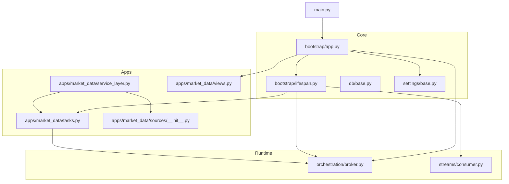
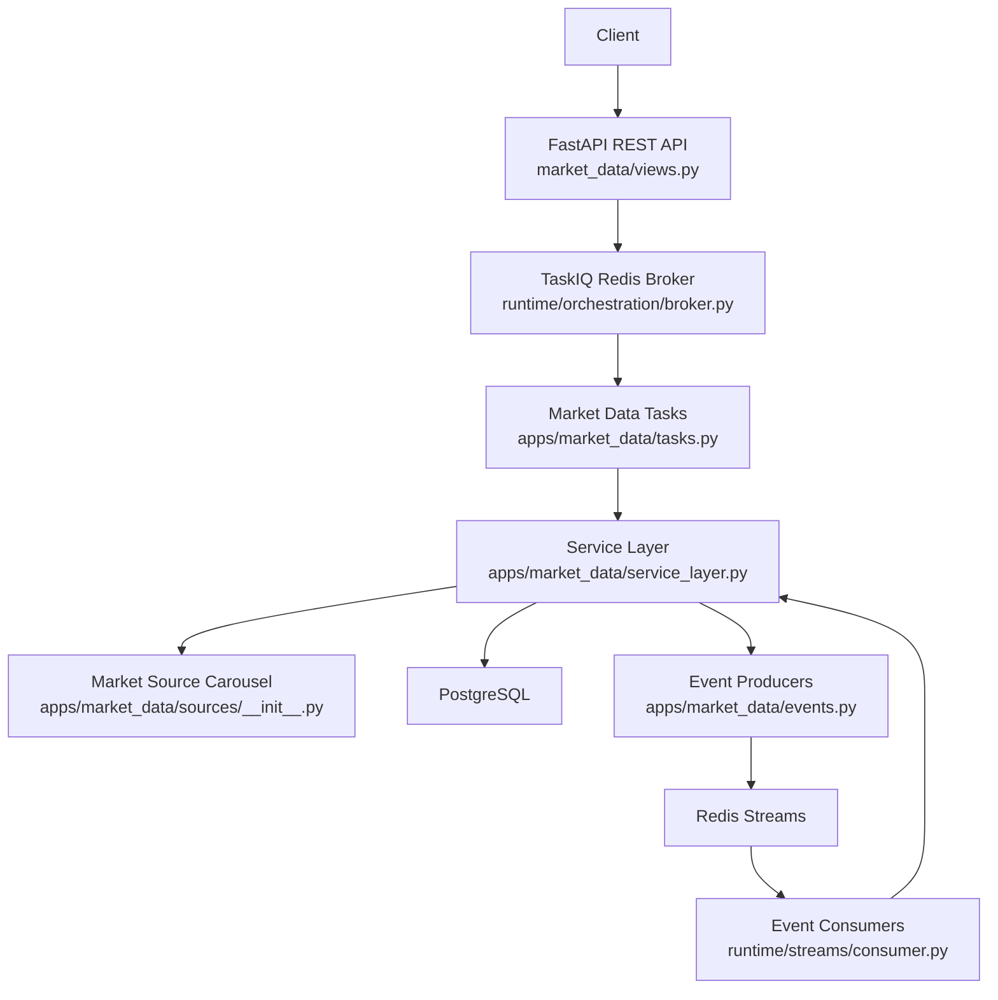
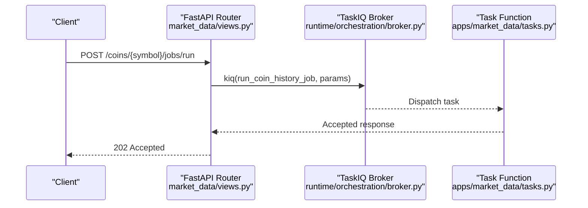
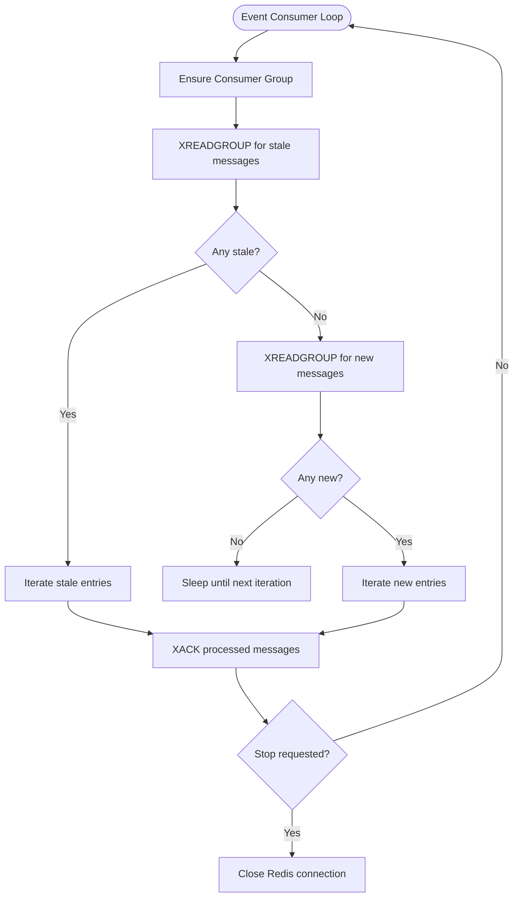
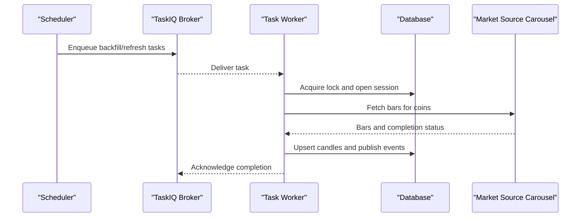
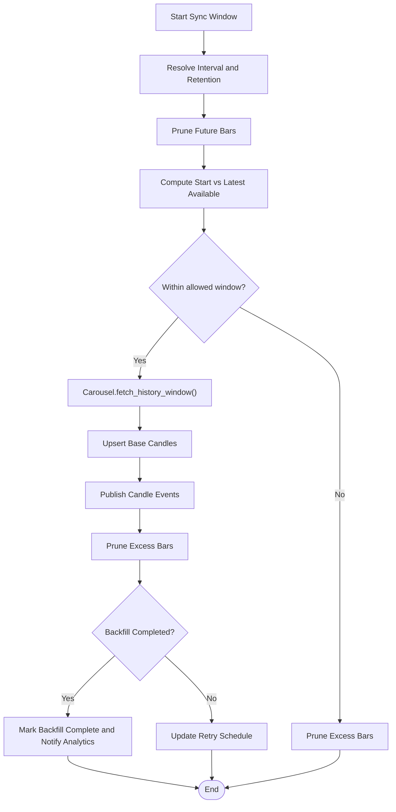
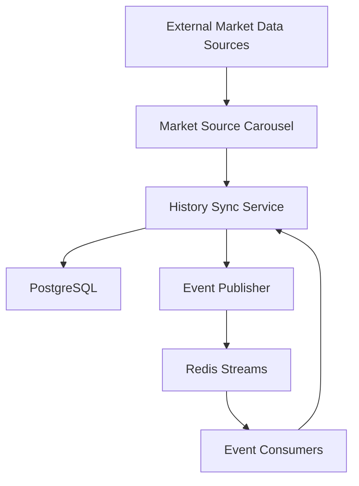
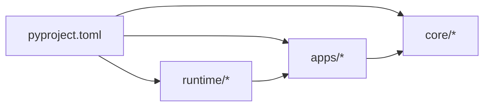

# Architecture Overview

<cite>
**Referenced Files in This Document**
- [main.py](file://src/main.py)
- [app.py](file://src/core/bootstrap/app.py)
- [lifespan.py](file://src/core/bootstrap/lifespan.py)
- [base.py](file://src/core/db/base.py)
- [base.py](file://src/core/settings/base.py)
- [broker.py](file://src/runtime/orchestration/broker.py)
- [consumer.py](file://src/runtime/streams/consumer.py)
- [service_layer.py](file://src/apps/market_data/service_layer.py)
- [tasks.py](file://src/apps/market_data/tasks.py)
- [events.py](file://src/apps/market_data/events.py)
- [sources/__init__.py](file://src/apps/market_data/sources/__init__.py)
- [views.py](file://src/apps/market_data/views.py)
- [pyproject.toml](file://pyproject.toml)
</cite>

## Table of Contents
1. [Introduction](#introduction)
2. [Project Structure](#project-structure)
3. [Core Components](#core-components)
4. [Architecture Overview](#architecture-overview)
5. [Detailed Component Analysis](#detailed-component-analysis)
6. [Dependency Analysis](#dependency-analysis)
7. [Performance Considerations](#performance-considerations)
8. [Troubleshooting Guide](#troubleshooting-guide)
9. [Conclusion](#conclusion)
10. [Appendices](#appendices)

## Introduction
This document describes the IRIS platform architecture with a focus on domain-driven design and microservices-style decomposition across application modules. The system is organized around bounded contexts for market data ingestion, analytics, anomaly detection, pattern intelligence, portfolio management, and cross-market insights. It employs an event-driven architecture with Redis Streams for asynchronous messaging, TaskIQ as the distributed task queue, and FastAPI for REST endpoints. The runtime orchestrates long-running jobs, event consumers, and scheduling, while the core infrastructure provides database connectivity, settings, and dependency injection.

## Project Structure
The repository follows a layered and feature-based organization:
- Core: Bootstrap, settings, database base, and shared infrastructure
- Apps: Feature modules (market_data, indicators, anomalies, patterns, signals, portfolio, predictions, news, cross_market, market_structure, hypothesis_engine, control_plane, system)
- Runtime: Orchestration, scheduler, and streams subsystems
- Tests: Feature-specific and runtime tests

**Diagram sources**
- [main.py:1-22](file://src/main.py#L1-L22)
- [app.py:1-81](file://src/core/bootstrap/app.py#L1-L81)
- [lifespan.py:1-70](file://src/core/bootstrap/lifespan.py#L1-L70)
- [base.py:1-4](file://src/core/db/base.py#L1-L4)
- [base.py:1-90](file://src/core/settings/base.py#L1-L90)
- [broker.py:1-23](file://src/runtime/orchestration/broker.py#L1-L23)
- [consumer.py:1-230](file://src/runtime/streams/consumer.py#L1-L230)
- [service_layer.py:1-666](file://src/apps/market_data/service_layer.py#L1-L666)
- [tasks.py:1-235](file://src/apps/market_data/tasks.py#L1-L235)
- [sources/__init__.py:1-198](file://src/apps/market_data/sources/__init__.py#L1-L198)
- [views.py:1-163](file://src/apps/market_data/views.py#L1-L163)

**Section sources**
- [main.py:1-22](file://src/main.py#L1-L22)
- [app.py:1-81](file://src/core/bootstrap/app.py#L1-L81)
- [lifespan.py:1-70](file://src/core/bootstrap/lifespan.py#L1-L70)
- [pyproject.toml:1-89](file://pyproject.toml#L1-L89)

## Core Components
- Application bootstrap and routing: FastAPI app creation, middleware, and router inclusion
- Runtime lifecycle: Database and Redis readiness, migrations, worker processes, and scheduler startup
- Settings: Centralized configuration for database, Redis, API hosts, keys, and task intervals
- Database: SQLAlchemy declarative base for ORM models
- Orchestration: TaskIQ brokers configured for general and analytics queues backed by Redis Streams
- Streams: Event consumer with XREADGROUP/XACK semantics, idempotency, stale claim, and metrics recording

**Section sources**
- [app.py:49-81](file://src/core/bootstrap/app.py#L49-L81)
- [lifespan.py:22-70](file://src/core/bootstrap/lifespan.py#L22-L70)
- [base.py:1-90](file://src/core/settings/base.py#L1-L90)
- [base.py:1-4](file://src/core/db/base.py#L1-L4)
- [broker.py:1-23](file://src/runtime/orchestration/broker.py#L1-L23)
- [consumer.py:49-230](file://src/runtime/streams/consumer.py#L49-L230)

## Architecture Overview
IRIS adopts a microservices-style architecture composed of cohesive application modules, each encapsulating domain logic and bounded by clear interfaces. The system is event-driven:
- REST endpoints accept requests and enqueue tasks
- TaskIQ distributes work across workers
- Event producers publish domain events to Redis Streams
- Event consumers subscribe and process asynchronously
- Analytics and general-purpose workers operate independently

**Diagram sources**
- [views.py:1-163](file://src/apps/market_data/views.py#L1-L163)
- [broker.py:1-23](file://src/runtime/orchestration/broker.py#L1-L23)
- [tasks.py:1-235](file://src/apps/market_data/tasks.py#L1-L235)
- [service_layer.py:1-666](file://src/apps/market_data/service_layer.py#L1-L666)
- [sources/__init__.py:1-198](file://src/apps/market_data/sources/__init__.py#L1-L198)
- [consumer.py:1-230](file://src/runtime/streams/consumer.py#L1-L230)
- [events.py:1-4](file://src/apps/market_data/events.py#L1-L4)

## Detailed Component Analysis

### REST API and Routing
- FastAPI app is created with CORS middleware and includes routers for all feature modules
- The market_data router exposes endpoints for coins and historical price data
- Endpoints validate payloads, handle errors, and enqueue tasks via TaskIQ

**Diagram sources**
- [views.py:97-119](file://src/apps/market_data/views.py#L97-L119)
- [broker.py:12-22](file://src/runtime/orchestration/broker.py#L12-L22)
- [tasks.py:228-235](file://src/apps/market_data/tasks.py#L228-L235)

**Section sources**
- [app.py:68-80](file://src/core/bootstrap/app.py#L68-L80)
- [views.py:1-163](file://src/apps/market_data/views.py#L1-L163)

### Event-Driven Messaging with Redis Streams
- Event producers publish domain events after data ingestion
- Event consumers use XREADGROUP with automatic claim for stale messages
- Idempotency keys prevent duplicate processing
- Metrics recording tracks handler outcomes

**Diagram sources**
- [consumer.py:190-226](file://src/runtime/streams/consumer.py#L190-L226)

**Section sources**
- [consumer.py:49-230](file://src/runtime/streams/consumer.py#L49-L230)
- [events.py:1-4](file://src/apps/market_data/events.py#L1-L4)

### Distributed Task Queue with TaskIQ
- Two brokers are configured: general and analytics queues
- Tasks coordinate history backfill and refresh with Redis task locks
- Workers are spawned during application lifespan and stopped gracefully

**Diagram sources**
- [broker.py:12-22](file://src/runtime/orchestration/broker.py#L12-L22)
- [tasks.py:115-172](file://src/apps/market_data/tasks.py#L115-L172)
- [service_layer.py:526-637](file://src/apps/market_data/service_layer.py#L526-L637)
- [sources/__init__.py:76-187](file://src/apps/market_data/sources/__init__.py#L76-L187)

**Section sources**
- [broker.py:1-23](file://src/runtime/orchestration/broker.py#L1-L23)
- [tasks.py:1-235](file://src/apps/market_data/tasks.py#L1-L235)

### Market Data Ingestion Pipeline
- MarketSourceCarousel selects appropriate providers per asset type and interval
- History sync orchestrates backfill and latest refresh windows
- Events are published upon candle insertions and completion stages

**Diagram sources**
- [service_layer.py:526-637](file://src/apps/market_data/service_layer.py#L526-L637)
- [sources/__init__.py:76-187](file://src/apps/market_data/sources/__init__.py#L76-L187)

**Section sources**
- [service_layer.py:1-666](file://src/apps/market_data/service_layer.py#L1-L666)
- [sources/__init__.py:1-198](file://src/apps/market_data/sources/__init__.py#L1-L198)

### System Context and Cross-Cutting Concerns
- Authentication and Authorization: Not evident in the analyzed files; consult application-specific routers and middleware if present
- Logging: Event consumers log warnings and exceptions; integrate structured logging in production deployments
- Monitoring: Consumer metrics recorder interface enables outcome tracking; configure metrics store accordingly
- Error Handling: Dedicated exceptions for market sources; endpoints raise HTTP exceptions; consumers wrap handler failures and record metrics

**Diagram sources**
- [sources/__init__.py:39-198](file://src/apps/market_data/sources/__init__.py#L39-L198)
- [service_layer.py:526-637](file://src/apps/market_data/service_layer.py#L526-L637)
- [consumer.py:49-230](file://src/runtime/streams/consumer.py#L49-L230)

**Section sources**
- [consumer.py:154-170](file://src/runtime/streams/consumer.py#L154-L170)
- [views.py:74-83](file://src/apps/market_data/views.py#L74-L83)

## Dependency Analysis
- Layer boundaries enforced by import linting contracts: runtime → apps → core
- External dependencies include FastAPI, TaskIQ with Redis, Redis, SQLAlchemy, Alembic, and httpx
- Settings centralize environment configuration and feature toggles

**Diagram sources**
- [pyproject.toml:71-77](file://pyproject.toml#L71-L77)

**Section sources**
- [pyproject.toml:1-89](file://pyproject.toml#L1-L89)

## Performance Considerations
- Batched upserts for candles reduce transaction overhead
- Redis Streams with consumer groups and XCLAIM ensures resilience against transient failures
- Task locks prevent concurrent history updates per coin
- Asynchronous carousel fetching minimizes latency across providers

## Troubleshooting Guide
- Database connectivity: Lifespan waits for PostgreSQL readiness before serving requests
- Redis connectivity: Lifespan waits for Redis readiness and initializes brokers and workers
- Task failures: Inspect TaskIQ worker logs and Redis Streams pending entries
- Event processing: Verify consumer group creation and idempotency keys

**Section sources**
- [lifespan.py:22-29](file://src/core/bootstrap/lifespan.py#L22-L29)
- [consumer.py:72-83](file://src/runtime/streams/consumer.py#L72-L83)

## Conclusion
IRIS integrates domain-driven design with a microservices-style module layout, enabling clear separation of concerns across market data, analytics, and operational domains. The event-driven architecture, powered by Redis Streams and TaskIQ, provides scalable ingestion and processing pipelines. The FastAPI surface offers REST endpoints that delegate to asynchronous tasks, ensuring responsive APIs while offloading heavy work to workers. Centralized settings and enforced layer boundaries support maintainability and testability.

## Appendices
- Technology Stack Choices:
  - FastAPI and Uvicorn for high-performance REST APIs
  - TaskIQ with Redis Streams for distributed task queuing
  - Redis for event streaming and task locking
  - SQLAlchemy with Alembic for ORM and migrations
  - httpx for HTTP client needs
  - Pydantic settings for robust configuration management

**Section sources**
- [pyproject.toml:6-19](file://pyproject.toml#L6-L19)
- [base.py:1-90](file://src/core/settings/base.py#L1-L90)