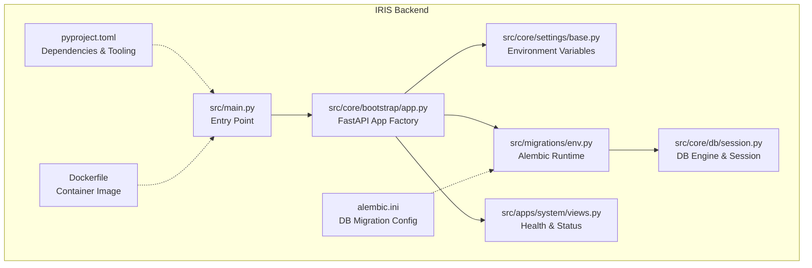
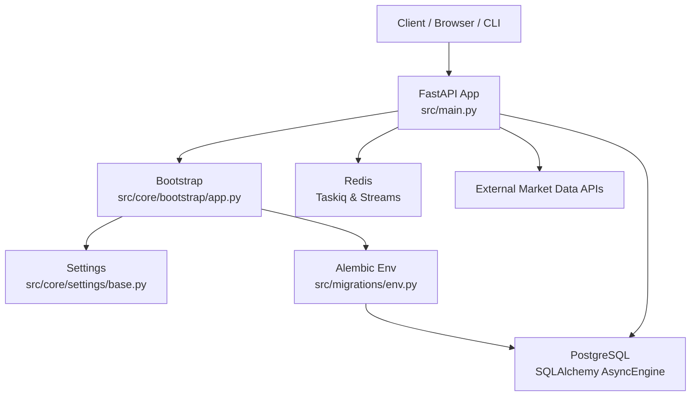
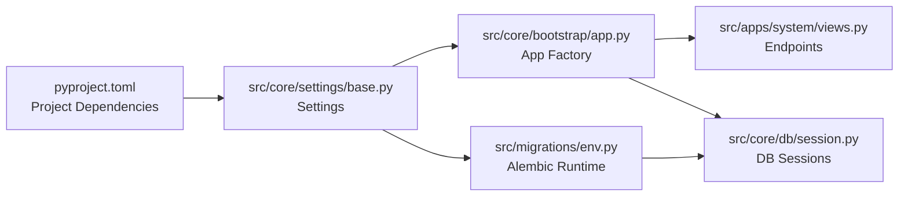

# Getting Started

<cite>
**Referenced Files in This Document**
- [pyproject.toml](file://pyproject.toml)
- [Dockerfile](file://Dockerfile)
- [alembic.ini](file://alembic.ini)
- [src/main.py](file://src/main.py)
- [src/core/settings/base.py](file://src/core/settings/base.py)
- [src/core/bootstrap/app.py](file://src/core/bootstrap/app.py)
- [src/migrations/env.py](file://src/migrations/env.py)
- [src/core/db/session.py](file://src/core/db/session.py)
- [src/apps/system/views.py](file://src/apps/system/views.py)
- [iris.service](file://iris.service)
</cite>

## Table of Contents
1. [Introduction](#introduction)
2. [Project Structure](#project-structure)
3. [Core Components](#core-components)
4. [Architecture Overview](#architecture-overview)
5. [Detailed Component Analysis](#detailed-component-analysis)
6. [Dependency Analysis](#dependency-analysis)
7. [Performance Considerations](#performance-considerations)
8. [Troubleshooting Guide](#troubleshooting-guide)
9. [Conclusion](#conclusion)
10. [Appendices](#appendices)

## Introduction
This guide helps you install, configure, and run the IRIS platform locally and via Docker. It covers prerequisites, environment setup, dependency installation, database initialization, service startup, configuration management, and verification steps. It also includes troubleshooting tips and performance recommendations for both manual and containerized deployments.

## Project Structure
IRIS is a FastAPI-based Python application with:
- Application code under src/
- Domain-focused apps (market_data, patterns, signals, portfolio, etc.)
- Core infrastructure (settings, database, bootstrap)
- Migrations under src/migrations
- Build and packaging managed via pyproject.toml
- Optional Docker image and systemd unit for deployment

**Diagram sources**
- [src/main.py:1-22](file://src/main.py#L1-L22)
- [src/core/bootstrap/app.py:49-81](file://src/core/bootstrap/app.py#L49-L81)
- [src/core/settings/base.py:8-90](file://src/core/settings/base.py#L8-L90)
- [src/migrations/env.py:1-56](file://src/migrations/env.py#L1-L56)
- [src/core/db/session.py:19-72](file://src/core/db/session.py#L19-L72)
- [src/apps/system/views.py:37-53](file://src/apps/system/views.py#L37-L53)
- [pyproject.toml:1-89](file://pyproject.toml#L1-L89)
- [Dockerfile:1-18](file://Dockerfile#L1-L18)
- [alembic.ini:1-38](file://alembic.ini#L1-L38)

**Section sources**
- [pyproject.toml:1-89](file://pyproject.toml#L1-L89)
- [Dockerfile:1-18](file://Dockerfile#L1-L18)
- [alembic.ini:1-38](file://alembic.ini#L1-L38)
- [src/main.py:1-22](file://src/main.py#L1-L22)
- [src/core/settings/base.py:8-90](file://src/core/settings/base.py#L8-L90)
- [src/core/bootstrap/app.py:49-81](file://src/core/bootstrap/app.py#L49-L81)
- [src/migrations/env.py:1-56](file://src/migrations/env.py#L1-L56)
- [src/core/db/session.py:19-72](file://src/core/db/session.py#L19-L72)
- [src/apps/system/views.py:37-53](file://src/apps/system/views.py#L37-L53)

## Core Components
- Application entrypoint initializes FastAPI app and reads settings.
- Settings load from environment variables with sensible defaults.
- Bootstrap creates the FastAPI app, wires routers, and runs Alembic migrations.
- Database sessions are configured via SQLAlchemy async engine and settings.
- System endpoints expose health and status for operational checks.

Key responsibilities:
- src/main.py: Creates app and runs server.
- src/core/settings/base.py: Centralized settings with environment variable mapping.
- src/core/bootstrap/app.py: App factory, middleware, routers, Alembic integration.
- src/migrations/env.py: Alembic runtime configuration and migration execution.
- src/core/db/session.py: Async/sync engines and database connectivity helpers.
- src/apps/system/views.py: Health and status endpoints.

**Section sources**
- [src/main.py:1-22](file://src/main.py#L1-L22)
- [src/core/settings/base.py:8-90](file://src/core/settings/base.py#L8-L90)
- [src/core/bootstrap/app.py:49-81](file://src/core/bootstrap/app.py#L49-L81)
- [src/migrations/env.py:17-56](file://src/migrations/env.py#L17-L56)
- [src/core/db/session.py:19-72](file://src/core/db/session.py#L19-L72)
- [src/apps/system/views.py:37-53](file://src/apps/system/views.py#L37-L53)

## Architecture Overview
IRIS uses a layered architecture:
- Presentation: FastAPI app with routers per domain.
- Application: Services and views for each functional area.
- Infrastructure: Database, Redis, external APIs, and task scheduling.
- Configuration: Pydantic settings loaded from environment.

**Diagram sources**
- [src/main.py:1-22](file://src/main.py#L1-L22)
- [src/core/bootstrap/app.py:49-81](file://src/core/bootstrap/app.py#L49-L81)
- [src/core/settings/base.py:8-90](file://src/core/settings/base.py#L8-L90)
- [src/migrations/env.py:17-56](file://src/migrations/env.py#L17-L56)
- [src/core/db/session.py:19-45](file://src/core/db/session.py#L19-L45)

## Detailed Component Analysis

### Installation and Setup

#### Prerequisites
- Python 3.11+ (project enforces >=3.11,<3.13)
- Docker (optional, for containerized deployment)
- PostgreSQL (tested against the database URL used by migrations)

Notes:
- The project targets Python 3.11 and uses uv for dependency resolution in the container image.
- Alembic expects a PostgreSQL database URL; migrations are configured accordingly.

**Section sources**
- [pyproject.toml:5](file://pyproject.toml#L5)
- [Dockerfile:1](file://Dockerfile#L1)
- [alembic.ini:5](file://alembic.ini#L5)

#### Manual Installation (Python + PostgreSQL)
1) Clone the repository and navigate to the backend directory.
2) Create and activate a virtual environment (recommended).
3) Install dependencies:
   - Using uv (as used by the container): see [pyproject.toml:87-89](file://pyproject.toml#L87-L89)
   - Alternatively, use pip with the project metadata in [pyproject.toml:1-19](file://pyproject.toml#L1-L19)
4) Set environment variables (see Configuration section).
5) Initialize the database:
   - Alembic configuration is defined in [alembic.ini:1-38](file://alembic.ini#L1-L38)
   - Alembic runtime wiring is in [src/migrations/env.py:17-18](file://src/migrations/env.py#L17-L18)
   - The app triggers migrations during startup via [src/core/bootstrap/app.py:45-46](file://src/core/bootstrap/app.py#L45-L46)
6) Run the application:
   - Entry point is [src/main.py:12-17](file://src/main.py#L12-L17)
   - Host/port come from settings [src/core/settings/base.py:11-12](file://src/core/settings/base.py#L11-L12)

Verification:
- Health endpoint: GET /health (returns healthy status after DB ping)
- Status endpoint: GET /status (shows system and source status)

**Section sources**
- [pyproject.toml:1-19](file://pyproject.toml#L1-L19)
- [pyproject.toml:87-89](file://pyproject.toml#L87-L89)
- [alembic.ini:1-38](file://alembic.ini#L1-L38)
- [src/migrations/env.py:17-18](file://src/migrations/env.py#L17-L18)
- [src/core/bootstrap/app.py:45-46](file://src/core/bootstrap/app.py#L45-L46)
- [src/main.py:12-17](file://src/main.py#L12-L17)
- [src/apps/system/views.py:49-52](file://src/apps/system/views.py#L49-L52)

#### Docker-Based Deployment
1) Build the image:
   - Uses Python 3.11 slim and uv installer binaries
   - Copies pyproject.toml and lock file, then runs uv sync --frozen --no-dev
   - Exposes port 8000 and starts Uvicorn pointing to src.main:app
   - See [Dockerfile:1-18](file://Dockerfile#L1-L18)
2) Run the container:
   - Map port 8000 and set environment variables via a .env file or environment variables
   - The container entry CMD launches Uvicorn with host and port from settings
3) Verify:
   - Health: curl http://localhost:8000/health
   - Status: curl http://localhost:8000/status

**Section sources**
- [Dockerfile:1-18](file://Dockerfile#L1-L18)
- [src/main.py:12-17](file://src/main.py#L12-L17)
- [src/core/settings/base.py:11-12](file://src/core/settings/base.py#L11-L12)
- [src/apps/system/views.py:49-52](file://src/apps/system/views.py#L49-L52)

### Configuration Management

Environment variables and defaults:
- Core settings are defined in [src/core/settings/base.py:8-90](file://src/core/settings/base.py#L8-L90)
- Defaults include:
  - app_name, app_env, api_host, api_port
  - database_url (default PostgreSQL URL)
  - redis_url
  - event_stream_name
  - CORS origins (defaults to localhost:3000 variants)
  - Taskiq intervals and worker counts
  - Control plane token
  - AI provider URLs and models
  - Portfolio risk parameters
  - Retry and delay settings for DB and Redis connections
- Environment file location and encoding are configured in the same file.

How settings are loaded:
- Settings class uses pydantic-settings with env_file=".env" and utf-8 encoding.
- get_settings() caches a single instance.

Database URL and migrations:
- Default database URL is set in settings [src/core/settings/base.py:13-16](file://src/core/settings/base.py#L13-L16)
- Alembic reads the URL from settings [src/migrations/env.py:17](file://src/migrations/env.py#L17)
- Alembic configuration file sets the default URL [alembic.ini:5](file://alembic.ini#L5)

Redis URL:
- Default Redis URL is set in settings [src/core/settings/base.py:17-20](file://src/core/settings/base.py#L17-L20)

CORS:
- Origins default to localhost:3000 and can be overridden via environment variable [src/core/settings/base.py:25-31](file://src/core/settings/base.py#L25-L31)

Example environment variables:
- DATABASE_URL
- REDIS_URL
- EVENT_STREAM_NAME
- POLYGON_API_KEY, TWELVE_DATA_API_KEY, ALPHA_VANTAGE_API_KEY
- CORS_ORIGINS
- IRIS_CONTROL_TOKEN
- IRIS_ENABLE_HYPOTHESIS_ENGINE
- IRIS_AI_OPENAI_BASE_URL, IRIS_AI_OPENAI_API_KEY, IRIS_AI_OPENAI_MODEL
- IRIS_AI_LOCAL_HTTP_BASE_URL, IRIS_AI_LOCAL_HTTP_MODEL

Note: The systemd unit file demonstrates loading environment from /etc/iris/iris.env [iris.service:8](file://iris.service#L8).

**Section sources**
- [src/core/settings/base.py:8-90](file://src/core/settings/base.py#L8-L90)
- [src/migrations/env.py:17](file://src/migrations/env.py#L17)
- [alembic.ini:5](file://alembic.ini#L5)
- [iris.service:8](file://iris.service#L8)

### Database Initialization and Service Startup

Startup flow:
1) App creation loads settings and registers routers [src/core/bootstrap/app.py:49-81](file://src/core/bootstrap/app.py#L49-L81)
2) Alembic upgrade to head is triggered during app lifecycle [src/core/bootstrap/app.py:45-46](file://src/core/bootstrap/app.py#L45-L46)
3) The FastAPI app is served by Uvicorn [src/main.py:12-17](file://src/main.py#L12-L17)

Database connectivity:
- Async engine configured with pre-ping [src/core/db/session.py:19-23](file://src/core/db/session.py#L19-L23)
- Health endpoint pings the database [src/apps/system/views.py:50-52](file://src/apps/system/views.py#L50-L52)
- Connection retry policy configurable via settings [src/core/db/session.py:61-72](file://src/core/db/session.py#L61-L72)

Verification endpoints:
- Health: GET /health
- Status: GET /status

**Section sources**
- [src/core/bootstrap/app.py:45-46](file://src/core/bootstrap/app.py#L45-L46)
- [src/core/bootstrap/app.py:49-81](file://src/core/bootstrap/app.py#L49-L81)
- [src/main.py:12-17](file://src/main.py#L12-L17)
- [src/core/db/session.py:19-23](file://src/core/db/session.py#L19-L23)
- [src/apps/system/views.py:49-52](file://src/apps/system/views.py#L49-L52)
- [src/core/db/session.py:61-72](file://src/core/db/session.py#L61-L72)

### Practical Examples

Run locally:
- Export environment variables (e.g., DATABASE_URL, REDIS_URL, CORS_ORIGINS)
- Start the server: python -m src.main
- Access endpoints:
  - Health: curl http://localhost:8000/health
  - Status: curl http://localhost:8000/status

Docker:
- Build: docker build -t iris-backend .
- Run: docker run -p 8000:8000 --env-file .env iris-backend
- Access endpoints as above

Notes:
- Host and port are controlled by settings.api_host and settings.api_port [src/core/settings/base.py:11-12](file://src/core/settings/base.py#L11-L12)
- The container exposes port 8000 [Dockerfile:15](file://Dockerfile#L15)

**Section sources**
- [src/core/settings/base.py:11-12](file://src/core/settings/base.py#L11-L12)
- [Dockerfile:15](file://Dockerfile#L15)

## Dependency Analysis

**Diagram sources**
- [pyproject.toml:1-19](file://pyproject.toml#L1-L19)
- [src/core/settings/base.py:8-90](file://src/core/settings/base.py#L8-L90)
- [src/core/bootstrap/app.py:49-81](file://src/core/bootstrap/app.py#L49-L81)
- [src/migrations/env.py:17-56](file://src/migrations/env.py#L17-L56)
- [src/core/db/session.py:19-45](file://src/core/db/session.py#L19-L45)
- [src/apps/system/views.py:37-53](file://src/apps/system/views.py#L37-L53)

**Section sources**
- [pyproject.toml:1-19](file://pyproject.toml#L1-L19)
- [src/core/settings/base.py:8-90](file://src/core/settings/base.py#L8-L90)
- [src/core/bootstrap/app.py:49-81](file://src/core/bootstrap/app.py#L49-L81)
- [src/migrations/env.py:17-56](file://src/migrations/env.py#L17-L56)
- [src/core/db/session.py:19-45](file://src/core/db/session.py#L19-L45)
- [src/apps/system/views.py:37-53](file://src/apps/system/views.py#L37-L53)

## Performance Considerations
- Database connection pooling and retries:
  - Async engine uses pool_pre_ping [src/core/db/session.py:22](file://src/core/db/session.py#L22)
  - Connection retry loop configurable via settings [src/core/db/session.py:61-72](file://src/core/db/session.py#L61-L72)
- Task scheduling intervals:
  - Many intervals are configurable in settings (e.g., taskiq_* keys) [src/core/settings/base.py:32-48](file://src/core/settings/base.py#L32-L48)
- Worker processes:
  - General and analytics worker counts are configurable [src/core/settings/base.py:46-47](file://src/core/settings/base.py#L46-L47)
- Redis connectivity:
  - Retry policy configurable via settings [src/core/db/session.py:69](file://src/core/db/session.py#L69)

Recommendations:
- Tune taskiq intervals based on data ingestion needs.
- Adjust worker counts for CPU-bound tasks.
- Monitor database connection usage and adjust retries if needed.

**Section sources**
- [src/core/db/session.py:22](file://src/core/db/session.py#L22)
- [src/core/db/session.py:61-72](file://src/core/db/session.py#L61-L72)
- [src/core/settings/base.py:32-48](file://src/core/settings/base.py#L32-L48)
- [src/core/settings/base.py:46-47](file://src/core/settings/base.py#L46-L47)

## Troubleshooting Guide

Common issues and resolutions:
- Database connection failures:
  - Verify DATABASE_URL matches your PostgreSQL instance [src/core/settings/base.py:13-16](file://src/core/settings/base.py#L13-L16)
  - Confirm the database is reachable and credentials are correct
  - The health endpoint pings the DB; use it to validate connectivity [src/apps/system/views.py:50-52](file://src/apps/system/views.py#L50-L52)
  - Connection retry behavior is governed by settings [src/core/db/session.py:61-72](file://src/core/db/session.py#L61-L72)
- Alembic migration errors:
  - Alembic reads the URL from settings [src/migrations/env.py:17](file://src/migrations/env.py#L17)
  - Ensure the database URL is correct and migrations can run [alembic.ini:5](file://alembic.ini#L5)
- CORS issues:
  - Update CORS_ORIGINS to include your frontend origin [src/core/settings/base.py:25-31](file://src/core/settings/base.py#L25-L31)
- Redis connectivity:
  - Ensure REDIS_URL is set and reachable [src/core/settings/base.py:17-20](file://src/core/settings/base.py#L17-L20)
- Port conflicts:
  - Change api_host/api_port or stop the conflicting service [src/core/settings/base.py:11-12](file://src/core/settings/base.py#L11-L12)
- Docker networking:
  - Ensure containers can resolve db and redis hostnames; align with default URLs [alembic.ini:5](file://alembic.ini#L5)

Operational checks:
- Health: GET /health
- Status: GET /status

**Section sources**
- [src/core/settings/base.py:13-16](file://src/core/settings/base.py#L13-L16)
- [src/migrations/env.py:17](file://src/migrations/env.py#L17)
- [alembic.ini:5](file://alembic.ini#L5)
- [src/core/settings/base.py:25-31](file://src/core/settings/base.py#L25-L31)
- [src/core/settings/base.py:17-20](file://src/core/settings/base.py#L17-L20)
- [src/core/settings/base.py:11-12](file://src/core/settings/base.py#L11-L12)
- [src/apps/system/views.py:50-52](file://src/apps/system/views.py#L50-L52)

## Conclusion
You now have a complete path to install, configure, and run IRIS locally or in Docker. Use environment variables to tailor behavior for development and production, initialize the database with Alembic, and verify operation via health and status endpoints. For production, consider tuning task scheduling, worker counts, and connection retries to match workload demands.

## Appendices

### Appendix A: Environment Variables Reference
- DATABASE_URL: PostgreSQL connection string
- REDIS_URL: Redis connection string
- EVENT_STREAM_NAME: Event stream identifier
- POLYGON_API_KEY, TWELVE_DATA_API_KEY, ALPHA_VANTAGE_API_KEY: Market data provider keys
- CORS_ORIGINS: Comma-separated list of allowed origins
- IRIS_CONTROL_TOKEN: Control plane token
- IRIS_ENABLE_HYPOTHESIS_ENGINE: Enable hypothesis engine routes
- IRIS_AI_OPENAI_BASE_URL, IRIS_AI_OPENAI_API_KEY, IRIS_AI_OPENAI_MODEL: OpenAI-compatible settings
- IRIS_AI_LOCAL_HTTP_BASE_URL, IRIS_AI_LOCAL_HTTP_MODEL: Local HTTP LLM settings
- Additional settings for task scheduling, worker processes, and portfolio risk parameters

**Section sources**
- [src/core/settings/base.py:8-90](file://src/core/settings/base.py#L8-L90)

### Appendix B: Systemd Unit Example
- The unit file demonstrates loading environment from /etc/iris/iris.env and running the module entry [iris.service:8](file://iris.service#L8)

**Section sources**
- [iris.service:8](file://iris.service#L8)