# Introduction

<cite>
**Referenced Files in This Document**
- [src/apps/anomalies/models.py](file://src/apps/anomalies/models.py)
- [src/apps/anomalies/detectors/__init__.py](file://src/apps/anomalies/detectors/__init__.py)
- [src/apps/anomalies/consumers/candle_anomaly_consumer.py](file://src/apps/anomalies/consumers/candle_anomaly_consumer.py)
- [src/apps/cross_market/services.py](file://src/apps/cross_market/services.py)
- [src/apps/cross_market/engine.py](file://src/apps/cross_market/engine.py)
- [src/apps/hypothesis_engine/services/hypothesis_service.py](file://src/apps/hypothesis_engine/services/hypothesis_service.py)
- [src/apps/market_data/sources/binance.py](file://src/apps/market_data/sources/binance.py)
- [src/apps/market_data/models.py](file://src/apps/market_data/models.py)
- [src/apps/indicators/models.py](file://src/apps/indicators/models.py)
- [src/apps/patterns/domain/engine.py](file://src/apps/patterns/domain/engine.py)
- [src/apps/patterns/domain/base.py](file://src/apps/patterns/domain/base.py)
- [src/apps/patterns/tasks.py](file://src/apps/patterns/tasks.py)
- [src/apps/signals/fusion.py](file://src/apps/signals/fusion.py)
- [src/apps/portfolio/services.py](file://src/apps/portfolio/services.py)
- [src/apps/news/services.py](file://src/apps/news/services.py)
- [src/apps/system/views.py](file://src/apps/system/views.py)
- [src/main.py](file://src/main.py)
- [tests/apps/indicators/test_views.py](file://tests/apps/indicators/test_views.py)
- [tests/apps/patterns/test_views.py](file://tests/apps/patterns/test_views.py)
- [tests/runtime/streams/test_messages.py](file://tests/runtime/streams/test_messages.py)
- [src/runtime/streams/messages.py](file://src/runtime/streams/messages.py)
</cite>

## Table of Contents
1. [Introduction](#introduction)
2. [Project Structure](#project-structure)
3. [Core Components](#core-components)
4. [Architecture Overview](#architecture-overview)
5. [Detailed Component Analysis](#detailed-component-analysis)
6. [Dependency Analysis](#dependency-analysis)
7. [Performance Considerations](#performance-considerations)
8. [Troubleshooting Guide](#troubleshooting-guide)
9. [Conclusion](#conclusion)

## Introduction
IRIS (Intelligent Risk Intelligence System) is a cryptocurrency market analytics platform designed to deliver real-time insights, pattern recognition, anomaly detection, and automated trading decision support. It targets traders, analysts, and financial institutions who need actionable intelligence across fragmented crypto markets, including multi-timeframe analysis, cross-market correlation detection, and AI-powered hypothesis generation.

IRIS addresses the shortcomings of traditional trading analytics tools in crypto by:
- Handling high-frequency, multi-exchange, and asynchronous data streams
- Detecting complex, non-linear patterns and structural shifts
- Providing robust anomaly detection for spikes, divergences, and dislocations
- Fusing signals across timeframes and incorporating sentiment and macro signals
- Supporting automated decision-making with confidence-weighted outcomes

## Project Structure
IRIS is organized around domain-driven modules that encapsulate analytics capabilities:
- Market data ingestion and storage (coins, candles, metrics)
- Pattern detection and evaluation engines
- Cross-market correlation and sector momentum
- Anomaly detection subsystem
- Signal fusion and decision generation
- Portfolio evaluation and action recommendation
- News ingestion and impact modeling
- Hypothesis engine for AI-driven insights
- System health and source status monitoring

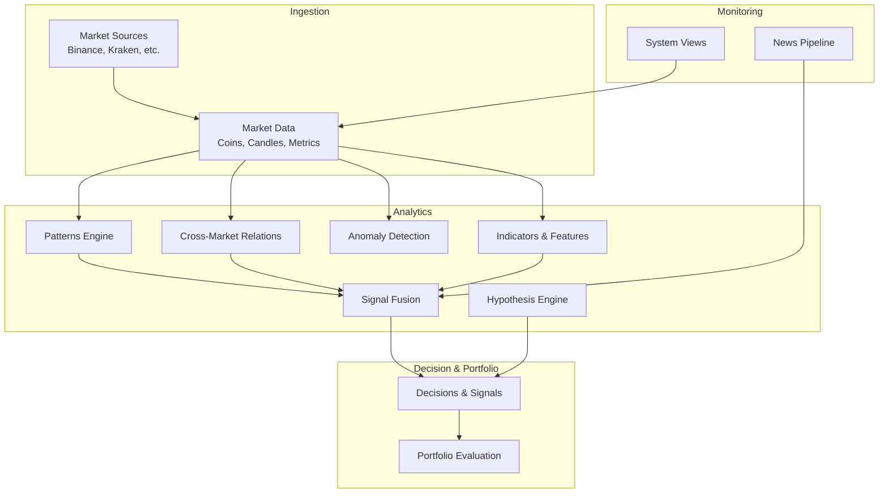

**Diagram sources**
- [src/apps/market_data/models.py:20-168](file://src/apps/market_data/models.py#L20-L168)
- [src/apps/market_data/sources/binance.py:32-86](file://src/apps/market_data/sources/binance.py#L32-L86)
- [src/apps/patterns/domain/engine.py:21-212](file://src/apps/patterns/domain/engine.py#L21-L212)
- [src/apps/cross_market/services.py:70-493](file://src/apps/cross_market/services.py#L70-L493)
- [src/apps/anomalies/models.py:15-124](file://src/apps/anomalies/models.py#L15-L124)
- [src/apps/signals/fusion.py:50-457](file://src/apps/signals/fusion.py#L50-L457)
- [src/apps/hypothesis_engine/services/hypothesis_service.py:21-106](file://src/apps/hypothesis_engine/services/hypothesis_service.py#L21-L106)
- [src/apps/indicators/models.py:15-121](file://src/apps/indicators/models.py#L15-L121)
- [src/apps/portfolio/services.py:173-706](file://src/apps/portfolio/services.py#L173-L706)
- [src/apps/system/views.py:10-53](file://src/apps/system/views.py#L10-L53)
- [src/apps/news/services.py:57-531](file://src/apps/news/services.py#L57-L531)

**Section sources**
- [src/apps/market_data/models.py:20-168](file://src/apps/market_data/models.py#L20-L168)
- [src/apps/system/views.py:37-53](file://src/apps/system/views.py#L37-L53)

## Core Components
- Market Data Layer: Defines coins, candles, and metrics used across analytics.
- Pattern Engine: Detects multi-timeframe patterns and emits signals.
- Cross-Market Relations: Computes leader-follower relations and sector momentum.
- Anomaly Detection: Identifies spikes, divergences, funding/open interest shifts, and liquidation cascades.
- Signal Fusion: Aggregates signals across timeframes and news sentiment into decisions.
- Hypothesis Engine: Generates AI-driven hypotheses and insights from events.
- Portfolio Evaluation: Recommends actions based on decisions, regime, and risk metrics.
- News Pipeline: Ingests and normalizes news impacting assets.
- System Views: Exposes health and source status.

**Section sources**
- [src/apps/market_data/models.py:20-168](file://src/apps/market_data/models.py#L20-L168)
- [src/apps/patterns/domain/engine.py:29-148](file://src/apps/patterns/domain/engine.py#L29-L148)
- [src/apps/cross_market/services.py:70-216](file://src/apps/cross_market/services.py#L70-L216)
- [src/apps/anomalies/models.py:15-64](file://src/apps/anomalies/models.py#L15-L64)
- [src/apps/signals/fusion.py:199-400](file://src/apps/signals/fusion.py#L199-L400)
- [src/apps/hypothesis_engine/services/hypothesis_service.py:21-106](file://src/apps/hypothesis_engine/services/hypothesis_service.py#L21-L106)
- [src/apps/portfolio/services.py:231-431](file://src/apps/portfolio/services.py#L231-L431)
- [src/apps/news/services.py:145-240](file://src/apps/news/services.py#L145-L240)
- [src/apps/system/views.py:37-53](file://src/apps/system/views.py#L37-L53)

## Architecture Overview
IRIS orchestrates a real-time analytics pipeline:
- Market sources feed candles and metrics into the database.
- Pattern detection runs incrementally per coin/timeframe.
- Cross-market relations and sector momentum are recomputed on indicator updates.
- Anomalies are scored and enriched, then surfaced.
- Signals are fused across timeframes and news, generating decisions.
- Hypotheses are generated from significant events.
- Portfolio evaluation recommends positions aligned with regime and risk.
- System views expose operational health and source status.

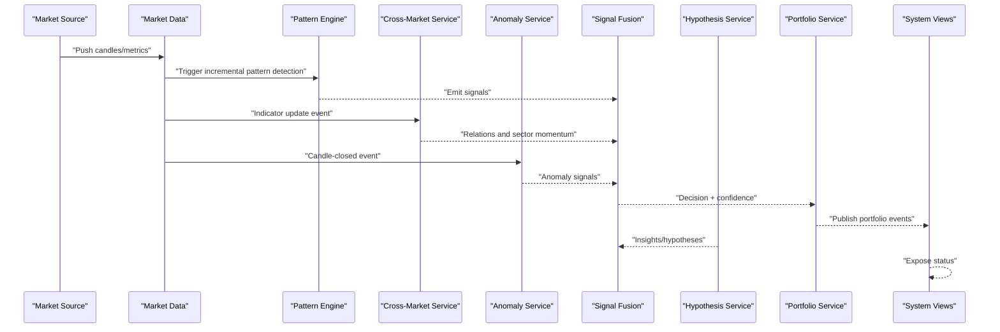

**Diagram sources**
- [src/apps/market_data/sources/binance.py:45-86](file://src/apps/market_data/sources/binance.py#L45-L86)
- [src/apps/patterns/domain/engine.py:114-148](file://src/apps/patterns/domain/engine.py#L114-L148)
- [src/apps/cross_market/services.py:92-216](file://src/apps/cross_market/services.py#L92-L216)
- [src/apps/anomalies/consumers/candle_anomaly_consumer.py:13-24](file://src/apps/anomalies/consumers/candle_anomaly_consumer.py#L13-L24)
- [src/apps/signals/fusion.py:290-400](file://src/apps/signals/fusion.py#L290-L400)
- [src/apps/hypothesis_engine/services/hypothesis_service.py:28-106](file://src/apps/hypothesis_engine/services/hypothesis_service.py#L28-L106)
- [src/apps/portfolio/services.py:231-431](file://src/apps/portfolio/services.py#L231-L431)
- [src/apps/system/views.py:37-53](file://src/apps/system/views.py#L37-L53)

## Detailed Component Analysis

### Multi-Timeframe Pattern Recognition
IRIS detects patterns across 15m, 1h, 4h, and 1d timeframes. The PatternEngine loads active detectors, computes indicators, applies context and success validation, and persists signals.

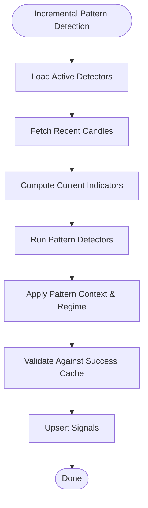

**Diagram sources**
- [src/apps/patterns/domain/engine.py:29-148](file://src/apps/patterns/domain/engine.py#L29-L148)
- [src/apps/patterns/domain/base.py:21-35](file://src/apps/patterns/domain/base.py#L21-L35)

**Section sources**
- [src/apps/patterns/domain/engine.py:29-148](file://src/apps/patterns/domain/engine.py#L29-L148)
- [src/apps/patterns/domain/base.py:21-35](file://src/apps/patterns/domain/base.py#L21-L35)

### Cross-Market Correlation and Sector Momentum
The CrossMarketService updates leader-follower relations, sector momentum, and detects market leaders. It publishes correlation snapshots and rotation events.

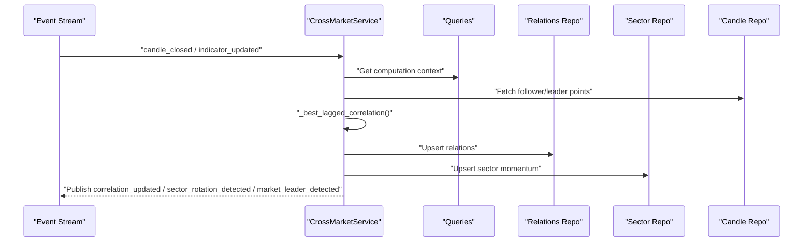

**Diagram sources**
- [src/apps/cross_market/services.py:92-216](file://src/apps/cross_market/services.py#L92-L216)
- [src/apps/cross_market/engine.py](file://src/apps/cross_market/engine.py)

**Section sources**
- [src/apps/cross_market/services.py:70-216](file://src/apps/cross_market/services.py#L70-L216)

### Anomaly Detection Subsystem
Anomalies are detected from candle-close events and enriched with severity, confidence, and market regime. MarketStructureSnapshots capture structural metrics.

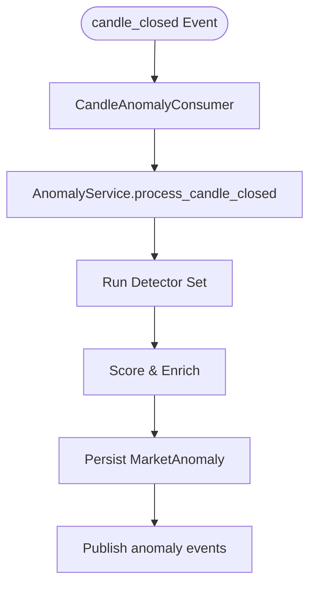

**Diagram sources**
- [src/apps/anomalies/consumers/candle_anomaly_consumer.py:9-24](file://src/apps/anomalies/consumers/candle_anomaly_consumer.py#L9-L24)
- [src/apps/anomalies/models.py:15-64](file://src/apps/anomalies/models.py#L15-L64)
- [src/apps/anomalies/detectors/__init__.py:1-28](file://src/apps/anomalies/detectors/__init__.py#L1-L28)

**Section sources**
- [src/apps/anomalies/models.py:15-64](file://src/apps/anomalies/models.py#L15-L64)
- [src/apps/anomalies/detectors/__init__.py:1-28](file://src/apps/anomalies/detectors/__init__.py#L1-L28)
- [src/apps/anomalies/consumers/candle_anomaly_consumer.py:9-24](file://src/apps/anomalies/consumers/candle_anomaly_consumer.py#L9-L24)

### Signal Fusion and Automated Decision Support
Signals are fused across recent candle groups, weighted by success rates, regime alignment, cross-market factors, and recency. Decisions are emitted with confidence and news impact.

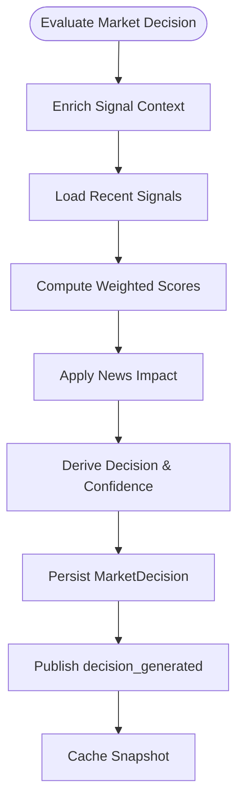

**Diagram sources**
- [src/apps/signals/fusion.py:290-400](file://src/apps/signals/fusion.py#L290-L400)

**Section sources**
- [src/apps/signals/fusion.py:50-400](file://src/apps/signals/fusion.py#L50-L400)

### AI-Powered Hypothesis Generation
The HypothesisService creates AI-generated hypotheses and insights from supported events, attaching provider, model, and prompt metadata.

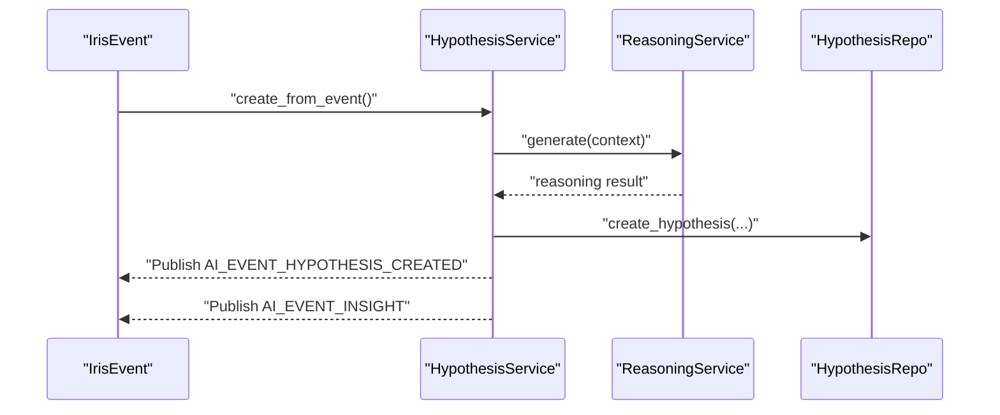

**Diagram sources**
- [src/apps/hypothesis_engine/services/hypothesis_service.py:28-106](file://src/apps/hypothesis_engine/services/hypothesis_service.py#L28-L106)

**Section sources**
- [src/apps/hypothesis_engine/services/hypothesis_service.py:21-106](file://src/apps/hypothesis_engine/services/hypothesis_service.py#L21-L106)

### Portfolio Action Evaluation
PortfolioService evaluates recommended actions based on decisions, regime, risk metrics, and position sizing constraints, emitting position events.

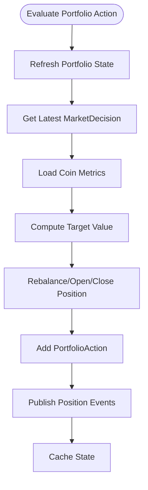

**Diagram sources**
- [src/apps/portfolio/services.py:231-431](file://src/apps/portfolio/services.py#L231-L431)

**Section sources**
- [src/apps/portfolio/services.py:173-431](file://src/apps/portfolio/services.py#L173-L431)

### News Ingestion and Impact Modeling
NewsService polls configured sources, normalizes items, and publishes ingested events. Signal fusion later incorporates recent news sentiment and relevance.

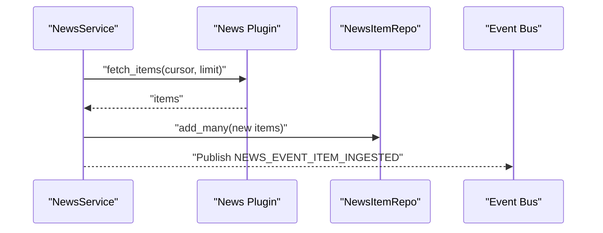

**Diagram sources**
- [src/apps/news/services.py:145-240](file://src/apps/news/services.py#L145-L240)

**Section sources**
- [src/apps/news/services.py:57-240](file://src/apps/news/services.py#L57-L240)

### System Health and Market Source Status
System views expose service status, TaskIQ worker mode, and per-source rate-limit snapshots.

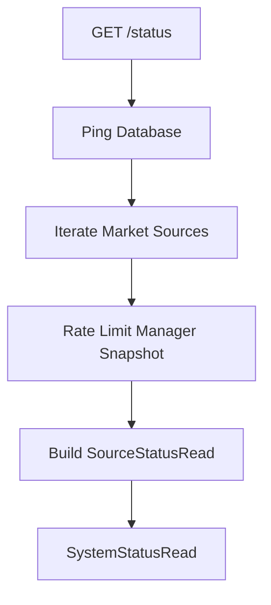

**Diagram sources**
- [src/apps/system/views.py:10-46](file://src/apps/system/views.py#L10-L46)

**Section sources**
- [src/apps/system/views.py:10-53](file://src/apps/system/views.py#L10-L53)

## Dependency Analysis
IRIS exhibits strong domain cohesion with clear boundaries:
- Market Data provides foundational entities and repositories used by all domains.
- Pattern, Cross-Market, Anomaly, and Indicators feed into Signal Fusion.
- Signal Fusion feeds Portfolio and Hypothesis engines.
- System Views depend on Market Data and Rate Limit Manager.

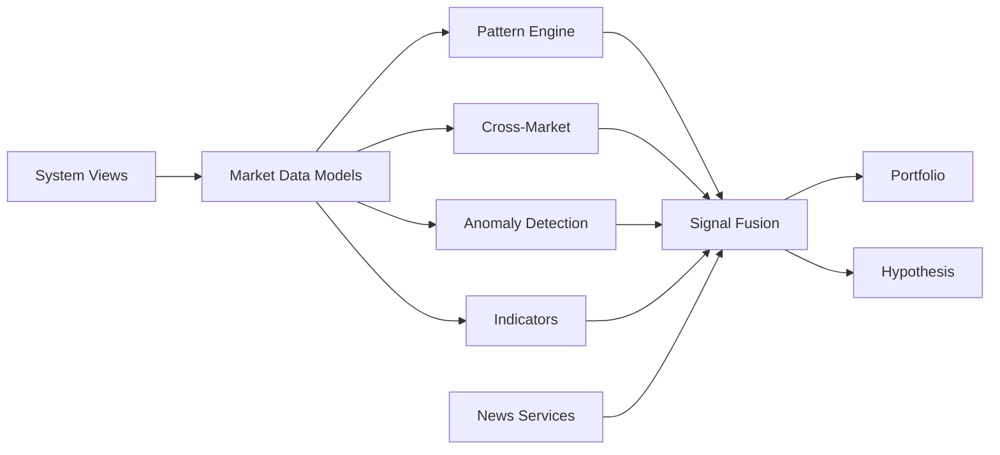

**Diagram sources**
- [src/apps/market_data/models.py:20-168](file://src/apps/market_data/models.py#L20-L168)
- [src/apps/patterns/domain/engine.py:29-148](file://src/apps/patterns/domain/engine.py#L29-L148)
- [src/apps/cross_market/services.py:70-216](file://src/apps/cross_market/services.py#L70-L216)
- [src/apps/anomalies/models.py:15-64](file://src/apps/anomalies/models.py#L15-L64)
- [src/apps/signals/fusion.py:290-400](file://src/apps/signals/fusion.py#L290-L400)
- [src/apps/portfolio/services.py:231-431](file://src/apps/portfolio/services.py#L231-L431)
- [src/apps/hypothesis_engine/services/hypothesis_service.py:28-106](file://src/apps/hypothesis_engine/services/hypothesis_service.py#L28-L106)
- [src/apps/system/views.py:10-46](file://src/apps/system/views.py#L10-L46)
- [src/apps/news/services.py:145-240](file://src/apps/news/services.py#L145-L240)

**Section sources**
- [src/apps/market_data/models.py:20-168](file://src/apps/market_data/models.py#L20-L168)
- [src/apps/signals/fusion.py:290-400](file://src/apps/signals/fusion.py#L290-L400)

## Performance Considerations
- Incremental pattern detection limits compute to recent bars and uses success caches.
- Cross-market correlation leverages precomputed points and clamps confidence.
- Signal fusion caps lookback windows and uses recency weighting.
- Portfolio evaluation enforces position sizing and sector exposure caps.
- System views avoid heavy computations and delegate rate-limiting to managers.

[No sources needed since this section provides general guidance]

## Troubleshooting Guide
- System health checks: Use the health endpoint to verify database connectivity.
- Source status: Inspect per-source rate-limit snapshots and cooldowns.
- Missing signals/decisions: Verify recent signals exist and fusion thresholds are met.
- Portfolio actions: Confirm decision availability, coin metrics, and position constraints.
- News ingestion: Check source enablement, plugin errors, and cursor progression.

**Section sources**
- [src/apps/system/views.py:49-53](file://src/apps/system/views.py#L49-L53)
- [src/apps/system/views.py:10-46](file://src/apps/system/views.py#L10-L46)
- [src/apps/signals/fusion.py:290-400](file://src/apps/signals/fusion.py#L290-L400)
- [src/apps/portfolio/services.py:231-431](file://src/apps/portfolio/services.py#L231-L431)
- [src/apps/news/services.py:145-240](file://src/apps/news/services.py#L145-L240)

## Conclusion
IRIS delivers a comprehensive analytics stack tailored for cryptocurrency markets. By combining multi-timeframe pattern recognition, cross-market correlation, anomaly detection, signal fusion, AI-driven hypotheses, and portfolio-aware decision support, it fills critical gaps left by traditional tools. Its modular architecture, real-time processing, and robust observability make it suitable for traders, analysts, and financial institutions seeking reliable, scalable insights.