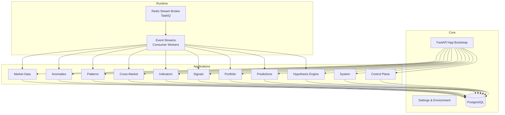
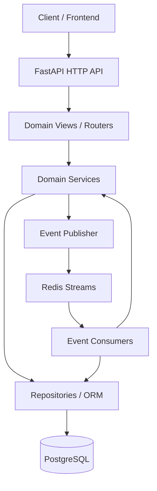
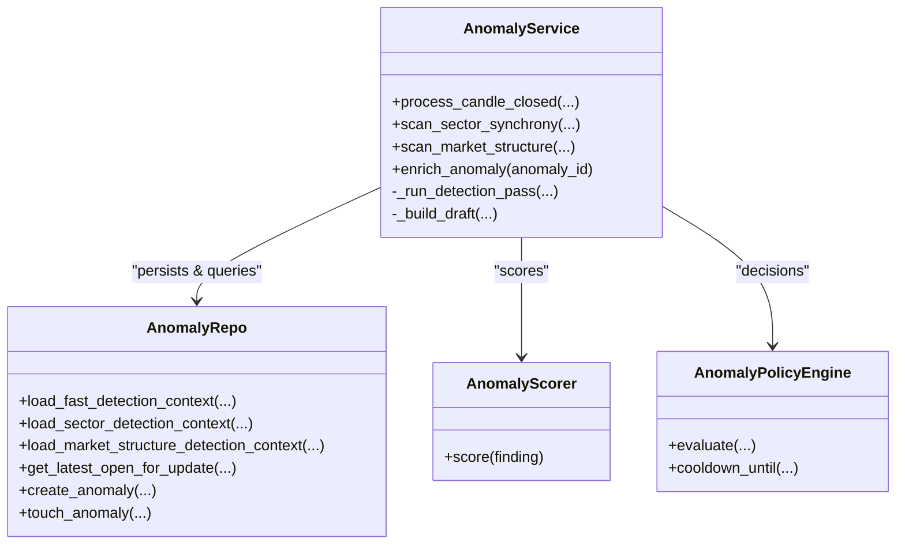
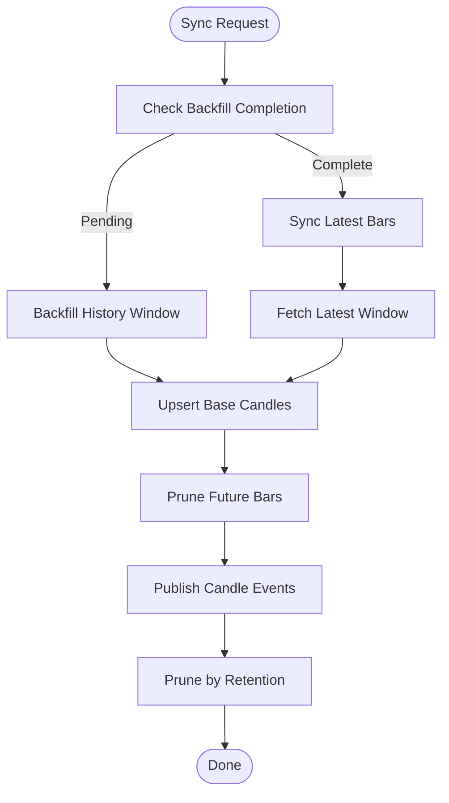
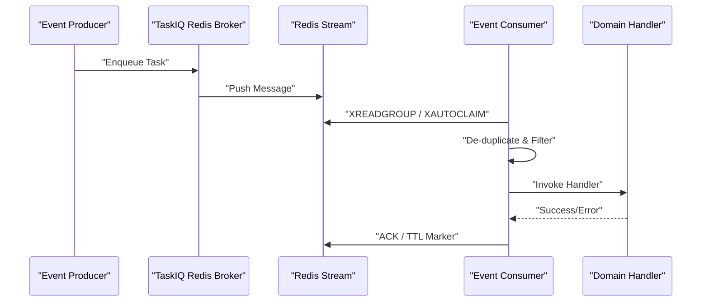
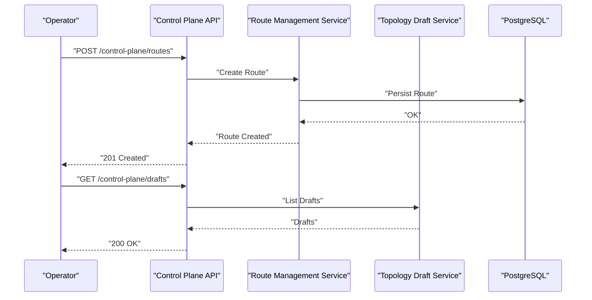
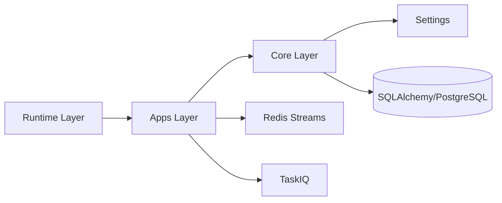

# Project Overview

<cite>
**Referenced Files in This Document**
- [main.py](file://src/main.py)
- [pyproject.toml](file://pyproject.toml)
- [app.py](file://src/core/bootstrap/app.py)
- [base.py](file://src/core/settings/base.py)
- [__init__.py](file://src/apps/__init__.py)
- [models.py](file://src/apps/anomalies/models.py)
- [models.py](file://src/apps/patterns/models.py)
- [models.py](file://src/apps/market_data/models.py)
- [anomaly_service.py](file://src/apps/anomalies/services/anomaly_service.py)
- [service_layer.py](file://src/apps/market_data/service_layer.py)
- [consumer.py](file://src/runtime/streams/consumer.py)
- [broker.py](file://src/runtime/orchestration/broker.py)
- [views.py](file://src/apps/system/views.py)
- [views.py](file://src/apps/control_plane/views.py)
</cite>

## Table of Contents
1. [Introduction](#introduction)
2. [Project Structure](#project-structure)
3. [Core Components](#core-components)
4. [Architecture Overview](#architecture-overview)
5. [Detailed Component Analysis](#detailed-component-analysis)
6. [Dependency Analysis](#dependency-analysis)
7. [Performance Considerations](#performance-considerations)
8. [Troubleshooting Guide](#troubleshooting-guide)
9. [Conclusion](#conclusion)

## Introduction
IRIS is an intelligent risk intelligence system designed for cryptocurrency markets. It delivers real-time insights by continuously processing market data, recognizing recurring patterns, detecting anomalies, and synthesizing signals to support automated trading decisions. The platform emphasizes domain-driven design and microservices-style separation across specialized domains such as market data ingestion, anomaly detection, pattern intelligence, cross-market analysis, and portfolio decision support.

Key value propositions:
- Real-time market data processing with robust ingestion and caching layers
- Pattern recognition and statistical evaluation across multiple timeframes
- Multi-stage anomaly detection and enrichment with explainability
- Automated decision support via signal fusion and portfolio-aware risk controls
- Control plane for event routing, observability, and topology management

Common use cases:
- Monitoring price spikes, volume surges, and volatility breaks across assets
- Identifying sector-wide synchronicity and cross-exchange dislocations
- Tracking market regime shifts and structural changes
- Generating and fusing signals for automated trading strategies
- Managing event routing and consumer topology for reliable processing

## Project Structure
The backend is organized around a layered architecture with clear separation between runtime orchestration, application domains, and core infrastructure. The FastAPI application aggregates domain routers and exposes a cohesive HTTP surface. Domain applications encapsulate bounded contexts (e.g., market data, anomalies, patterns), each with its own models, services, repositories, and views. Runtime components handle asynchronous processing via TaskIQ and Redis Streams.

**Diagram sources**
- [app.py:49-81](file://src/core/bootstrap/app.py#L49-L81)
- [__init__.py:1-14](file://src/apps/__init__.py#L1-L14)
- [consumer.py:1-230](file://src/runtime/streams/consumer.py#L1-L230)
- [broker.py:1-23](file://src/runtime/orchestration/broker.py#L1-L23)

**Section sources**
- [main.py:1-22](file://src/main.py#L1-L22)
- [app.py:49-81](file://src/core/bootstrap/app.py#L49-L81)
- [__init__.py:1-14](file://src/apps/__init__.py#L1-L14)

## Core Components
- FastAPI application bootstrapper that wires domain routers and manages migrations and CORS.
- Settings module defining environment-driven configuration for databases, Redis, API endpoints, and worker intervals.
- Domain models representing core entities such as coins, candles, discovered patterns, market cycles, anomalies, and snapshots.
- Services implementing business logic for anomaly detection, pattern discovery, and market data synchronization.
- Runtime orchestration using TaskIQ with Redis Streams for asynchronous task queues and event consumers for reliable processing.

Practical examples:
- Anomaly detection pipeline triggered on candle-close events, scoring and enriching findings, and publishing enriched events downstream.
- Market data ingestion pipeline that backfills historical candles and prunes outdated bars according to configured retention.
- Control plane endpoints enabling topology management, audit logging, and observability over event routes and consumers.

**Section sources**
- [base.py:8-90](file://src/core/settings/base.py#L8-L90)
- [models.py:15-124](file://src/apps/anomalies/models.py#L15-L124)
- [models.py:15-109](file://src/apps/patterns/models.py#L15-L109)
- [models.py:20-168](file://src/apps/market_data/models.py#L20-L168)
- [anomaly_service.py:44-410](file://src/apps/anomalies/services/anomaly_service.py#L44-L410)
- [service_layer.py:54-666](file://src/apps/market_data/service_layer.py#L54-L666)
- [consumer.py:49-230](file://src/runtime/streams/consumer.py#L49-L230)
- [broker.py:1-23](file://src/runtime/orchestration/broker.py#L1-L23)

## Architecture Overview
IRIS follows a domain-driven design with bounded contexts implemented as microservices-like applications under a single FastAPI process. The system integrates:
- HTTP API surface for system status, control plane topology management, and domain-specific queries
- Asynchronous task queues via TaskIQ and Redis Streams for scalable background processing
- PostgreSQL for persistent storage of market data, analytics, and control plane metadata
- Redis for streaming events and task queueing

**Diagram sources**
- [app.py:68-80](file://src/core/bootstrap/app.py#L68-L80)
- [views.py:37-53](file://src/apps/system/views.py#L37-L53)
- [views.py:263-358](file://src/apps/control_plane/views.py#L263-L358)
- [consumer.py:190-230](file://src/runtime/streams/consumer.py#L190-L230)
- [broker.py:12-22](file://src/runtime/orchestration/broker.py#L12-L22)

## Detailed Component Analysis

### Anomaly Detection Subsystem
The anomaly subsystem detects market irregularities across multiple domains (price/volume dynamics, sector synchronicity, and market structure) and enriches findings with context and explainability. It persists anomalies, applies scoring and policy-driven decisions, and publishes events for downstream consumers.

**Diagram sources**
- [anomaly_service.py:44-410](file://src/apps/anomalies/services/anomaly_service.py#L44-L410)
- [models.py:15-124](file://src/apps/anomalies/models.py#L15-L124)

**Section sources**
- [anomaly_service.py:80-191](file://src/apps/anomalies/services/anomaly_service.py#L80-L191)
- [anomaly_service.py:193-242](file://src/apps/anomalies/services/anomaly_service.py#L193-L242)
- [anomaly_service.py:243-340](file://src/apps/anomalies/services/anomaly_service.py#L243-L340)

### Market Data Pipeline
The market data layer manages coin definitions, candle storage, history backfill, pruning, and event publication on candle insertions and closures. It coordinates with external market sources and maintains retention policies aligned with configured candle intervals.

**Diagram sources**
- [service_layer.py:526-637](file://src/apps/market_data/service_layer.py#L526-L637)
- [service_layer.py:54-71](file://src/apps/market_data/service_layer.py#L54-L71)

**Section sources**
- [service_layer.py:526-637](file://src/apps/market_data/service_layer.py#L526-L637)
- [service_layer.py:54-71](file://src/apps/market_data/service_layer.py#L54-L71)

### Event Streaming and Orchestration
IRIS uses Redis Streams for event delivery and TaskIQ for task queuing. Consumers read from streams, deduplicate, filter by type, and invoke handlers, recording metrics and acknowledgments. Brokers define queue names and consumer groups for general and analytics workloads.

**Diagram sources**
- [broker.py:1-23](file://src/runtime/orchestration/broker.py#L1-L23)
- [consumer.py:190-230](file://src/runtime/streams/consumer.py#L190-L230)

**Section sources**
- [broker.py:7-22](file://src/runtime/orchestration/broker.py#L7-L22)
- [consumer.py:49-230](file://src/runtime/streams/consumer.py#L49-L230)

### Control Plane and Observability
The control plane exposes endpoints for managing event routes, consumers, and topology drafts. It enforces access modes and tokens, supports audit logging, and provides observability over the current topology and recent changes.

**Diagram sources**
- [views.py:295-327](file://src/apps/control_plane/views.py#L295-L327)
- [views.py:366-406](file://src/apps/control_plane/views.py#L366-L406)

**Section sources**
- [views.py:88-107](file://src/apps/control_plane/views.py#L88-L107)
- [views.py:295-327](file://src/apps/control_plane/views.py#L295-L327)
- [views.py:366-406](file://src/apps/control_plane/views.py#L366-L406)
- [views.py:431-447](file://src/apps/control_plane/views.py#L431-L447)

### System Health and Status
The system exposes health checks and status endpoints to verify database connectivity and report task worker status and market source availability.

**Section sources**
- [views.py:37-53](file://src/apps/system/views.py#L37-L53)

## Dependency Analysis
Technology stack and runtime dependencies:
- Web framework: FastAPI
- ASGI server: Uvicorn
- Database ORM: SQLAlchemy
- Database migration: Alembic
- Tasking and scheduling: TaskIQ
- Task broker: Redis Streams
- HTTP client: httpx
- Additional integrations: Telethon

Layered dependency boundaries enforce separation between runtime, apps, and core.

**Diagram sources**
- [pyproject.toml:6-19](file://pyproject.toml#L6-L19)
- [app.py:71-80](file://src/core/bootstrap/app.py#L71-L80)

**Section sources**
- [pyproject.toml:1-89](file://pyproject.toml#L1-L89)
- [app.py:71-80](file://src/core/bootstrap/app.py#L71-L80)

## Performance Considerations
- Asynchronous ingestion and pruning reduce blocking I/O during backfill and sync operations.
- Redis Streams and TaskIQ provide scalable decoupling for anomaly detection, pattern discovery, and analytics.
- Batched upserts and retention-based pruning keep storage efficient.
- Worker process counts and intervals are configurable to balance throughput and resource usage.

## Troubleshooting Guide
- Health check failures indicate database connectivity issues; verify connection retries and credentials.
- Event consumers may report stale or pending messages; ensure consumer groups are initialized and idle thresholds are configured appropriately.
- Control plane mutations require proper access mode and token; confirm headers and environment variables.
- Anomaly detection may skip contexts when insufficient data is available; verify lookback windows and data freshness.

**Section sources**
- [views.py:49-53](file://src/apps/system/views.py#L49-L53)
- [consumer.py:72-115](file://src/runtime/streams/consumer.py#L72-L115)
- [views.py:88-107](file://src/apps/control_plane/views.py#L88-L107)
- [anomaly_service.py:80-111](file://src/apps/anomalies/services/anomaly_service.py#L80-L111)

## Conclusion
IRIS provides a robust, modular foundation for intelligent risk intelligence in crypto markets. Its domain-driven design, event-driven orchestration, and comprehensive analytics stack enable real-time monitoring, pattern recognition, anomaly detection, and automated decision support. The control plane and observability features ensure operational transparency and safe topology management, while the technology stack balances performance, scalability, and maintainability.