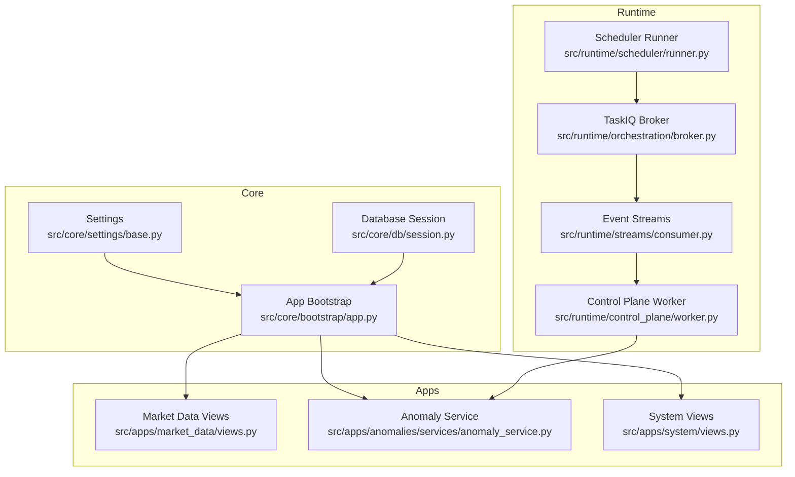
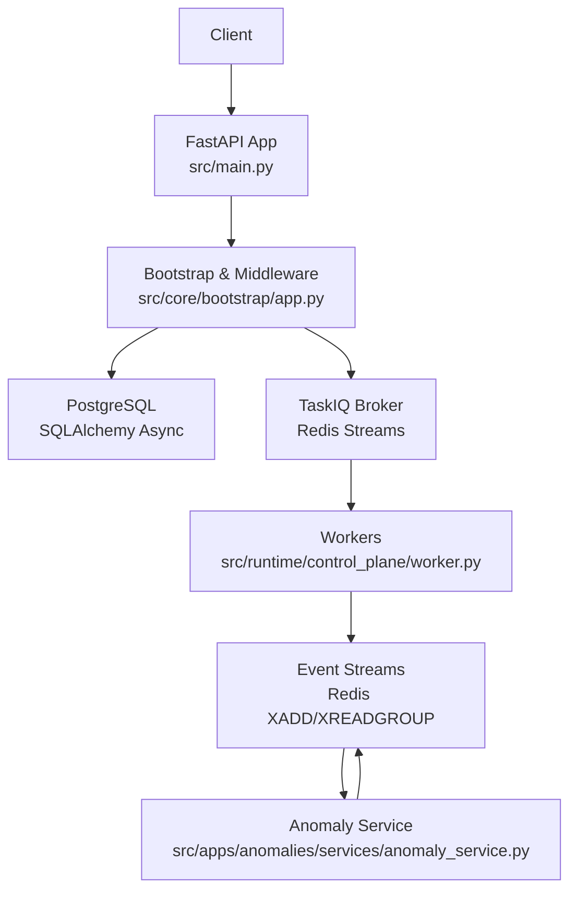
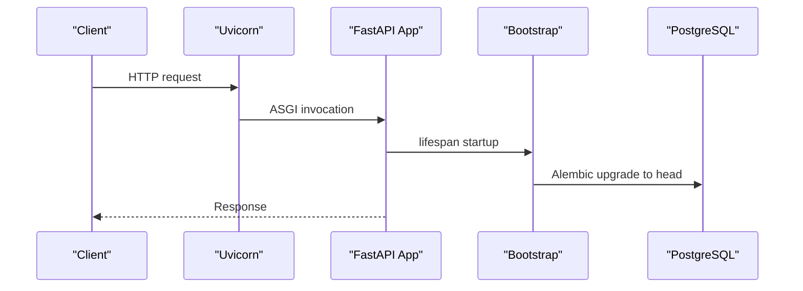
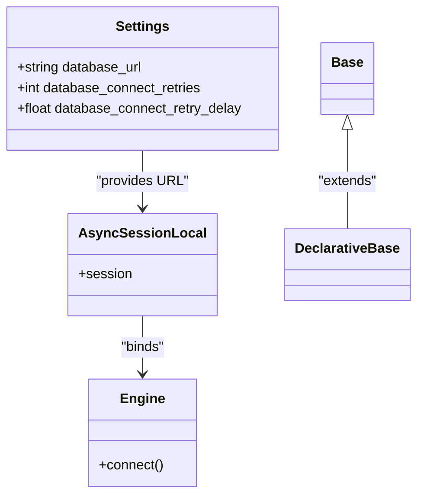
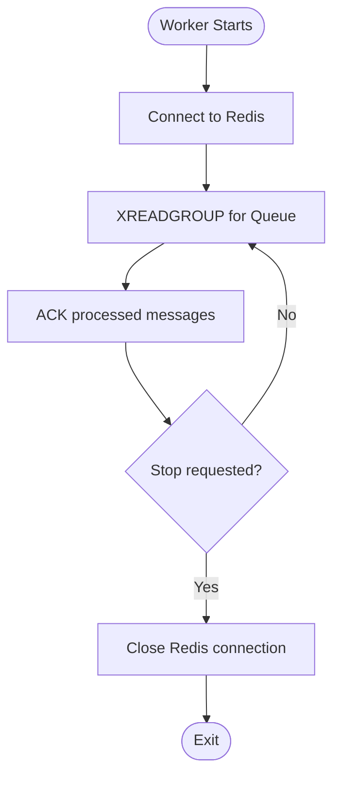
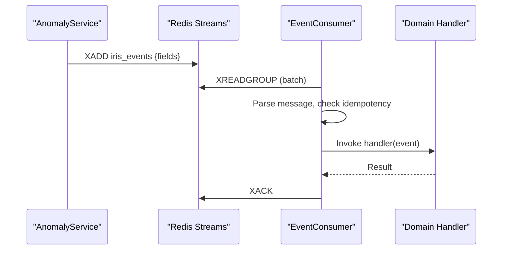
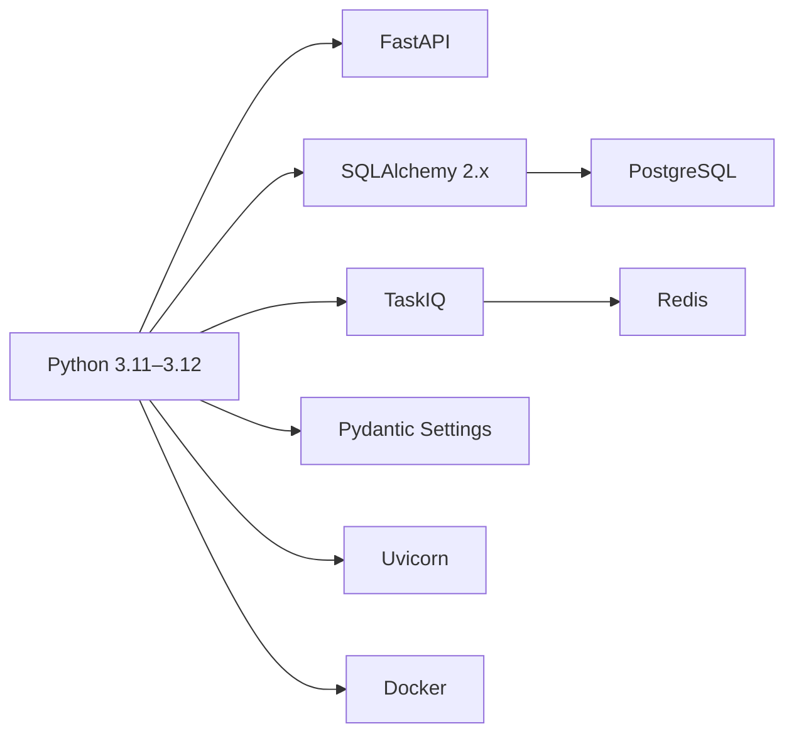

# Technology Stack

<cite>
**Referenced Files in This Document**
- [pyproject.toml](file://pyproject.toml)
- [Dockerfile](file://Dockerfile)
- [alembic.ini](file://alembic.ini)
- [src/main.py](file://src/main.py)
- [src/core/bootstrap/app.py](file://src/core/bootstrap/app.py)
- [src/core/settings/base.py](file://src/core/settings/base.py)
- [src/core/db/session.py](file://src/core/db/session.py)
- [src/core/db/base.py](file://src/core/db/base.py)
- [src/runtime/orchestration/broker.py](file://src/runtime/orchestration/broker.py)
- [src/runtime/streams/consumer.py](file://src/runtime/streams/consumer.py)
- [src/runtime/control_plane/worker.py](file://src/runtime/control_plane/worker.py)
- [src/runtime/scheduler/runner.py](file://src/runtime/scheduler/runner.py)
- [src/apps/anomalies/services/anomaly_service.py](file://src/apps/anomalies/services/anomaly_service.py)
- [src/apps/system/views.py](file://src/apps/system/views.py)
- [iris.service](file://iris.service)
</cite>

## Table of Contents
1. [Introduction](#introduction)
2. [Project Structure](#project-structure)
3. [Core Components](#core-components)
4. [Architecture Overview](#architecture-overview)
5. [Detailed Component Analysis](#detailed-component-analysis)
6. [Dependency Analysis](#dependency-analysis)
7. [Performance Considerations](#performance-considerations)
8. [Troubleshooting Guide](#troubleshooting-guide)
9. [Conclusion](#conclusion)

## Introduction
This document describes the IRIS technology stack and explains the rationale, version requirements, compatibility, and operational characteristics of each technology. The stack centers on Python 3.11, FastAPI for REST APIs, SQLAlchemy with PostgreSQL for persistence, TaskIQ with Redis for asynchronous task queues, Redis for in-memory streaming and pub/sub, Alembic for migrations, Pydantic for settings, Uvicorn for ASGI hosting, and Docker for containerization. It also covers development setup, production deployment considerations, and performance/scalability implications.

## Project Structure
The backend is organized around layered modules:
- Core: shared infrastructure (settings, database, bootstrap)
- Apps: bounded contexts (market data, anomalies, signals, patterns, etc.)
- Runtime: orchestration, scheduling, streaming, and control plane
- Migrations: database schema evolution via Alembic

**Diagram sources**
- [src/core/bootstrap/app.py:49-81](file://src/core/bootstrap/app.py#L49-L81)
- [src/core/settings/base.py:8-90](file://src/core/settings/base.py#L8-L90)
- [src/core/db/session.py:19-45](file://src/core/db/session.py#L19-L45)
- [src/runtime/scheduler/runner.py:267-317](file://src/runtime/scheduler/runner.py#L267-L317)
- [src/runtime/orchestration/broker.py:1-23](file://src/runtime/orchestration/broker.py#L1-L23)
- [src/runtime/streams/consumer.py:49-230](file://src/runtime/streams/consumer.py#L49-L230)
- [src/runtime/control_plane/worker.py:61-132](file://src/runtime/control_plane/worker.py#L61-L132)
- [src/apps/anomalies/services/anomaly_service.py:44-410](file://src/apps/anomalies/services/anomaly_service.py#L44-L410)
- [src/apps/system/views.py:1-53](file://src/apps/system/views.py#L1-L53)

**Section sources**
- [src/core/bootstrap/app.py:49-81](file://src/core/bootstrap/app.py#L49-L81)
- [src/core/settings/base.py:8-90](file://src/core/settings/base.py#L8-L90)
- [src/core/db/session.py:19-45](file://src/core/db/session.py#L19-L45)
- [src/runtime/scheduler/runner.py:267-317](file://src/runtime/scheduler/runner.py#L267-L317)
- [src/runtime/orchestration/broker.py:1-23](file://src/runtime/orchestration/broker.py#L1-L23)
- [src/runtime/streams/consumer.py:49-230](file://src/runtime/streams/consumer.py#L49-L230)
- [src/runtime/control_plane/worker.py:61-132](file://src/runtime/control_plane/worker.py#L61-L132)
- [src/apps/anomalies/services/anomaly_service.py:44-410](file://src/apps/anomalies/services/anomaly_service.py#L44-L410)
- [src/apps/system/views.py:1-53](file://src/apps/system/views.py#L1-L53)

## Core Components
- Python 3.11–3.12: The project targets Python 3.11–3.12, ensuring modern language features and performance improvements.
- FastAPI: ASGI web framework powering REST endpoints and OpenAPI generation.
- SQLAlchemy 2.x: Asynchronous ORM with PostgreSQL driver for robust data access.
- Alembic: Schema migration tool integrated with SQLAlchemy.
- TaskIQ: Distributed task queue with Redis backend for asynchronous workloads.
- Redis: In-memory data store and pub/sub/streaming backbone for eventing.
- Pydantic Settings: Strongly-typed settings loading from environment variables.
- Uvicorn: ASGI server for development and production hosting.
- Docker: Containerized deployment with uv for deterministic installs.

**Section sources**
- [pyproject.toml:5-19](file://pyproject.toml#L5-L19)
- [src/core/settings/base.py:8-90](file://src/core/settings/base.py#L8-L90)
- [src/core/db/session.py:19-45](file://src/core/db/session.py#L19-L45)
- [alembic.ini:1-38](file://alembic.ini#L1-L38)
- [src/runtime/orchestration/broker.py:1-23](file://src/runtime/orchestration/broker.py#L1-L23)
- [src/runtime/streams/consumer.py:13-14](file://src/runtime/streams/consumer.py#L13-L14)
- [Dockerfile:1-18](file://Dockerfile#L1-L18)
- [src/main.py:12-22](file://src/main.py#L12-L22)

## Architecture Overview
IRIS follows a layered architecture with clear separation between HTTP API, background tasks, event streaming, and persistence. The FastAPI application bootstraps routers, middleware, and migrations. Background jobs are scheduled and dispatched via TaskIQ to Redis, consumed by dedicated workers. Events are produced and consumed through Redis streams, enabling decoupled processing across domains.

**Diagram sources**
- [src/main.py:12-22](file://src/main.py#L12-L22)
- [src/core/bootstrap/app.py:49-81](file://src/core/bootstrap/app.py#L49-L81)
- [src/core/db/session.py:19-45](file://src/core/db/session.py#L19-L45)
- [src/runtime/orchestration/broker.py:12-22](file://src/runtime/orchestration/broker.py#L12-L22)
- [src/runtime/control_plane/worker.py:111-132](file://src/runtime/control_plane/worker.py#L111-L132)
- [src/runtime/streams/consumer.py:190-230](file://src/runtime/streams/consumer.py#L190-L230)
- [src/apps/anomalies/services/anomaly_service.py:325-340](file://src/apps/anomalies/services/anomaly_service.py#L325-L340)

## Detailed Component Analysis

### Python 3.11 and Environment Management
- Version targeting: requires Python >=3.11,<3.13.
- Tooling: uv used for deterministic installs in Docker; pytest, mypy, ruff configured for quality and linting.
- Development vs. production: dev dependencies isolated; production image uses frozen sync without dev packages.

**Section sources**
- [pyproject.toml:5-19](file://pyproject.toml#L5-L19)
- [pyproject.toml:21-39](file://pyproject.toml#L21-L39)
- [pyproject.toml:45-62](file://pyproject.toml#L45-L62)
- [Dockerfile:1-18](file://Dockerfile#L1-L18)

### FastAPI and REST API
- Application creation and middleware: CORS configured from settings; lifespan hooks run migrations.
- Routers: system, control plane, market data, market structure, news, indicators, patterns, signals, portfolio, predictions, and optionally hypothesis engine.
- Health endpoint: pings database to confirm connectivity.

**Diagram sources**
- [src/main.py:12-22](file://src/main.py#L12-L22)
- [src/core/bootstrap/app.py:49-81](file://src/core/bootstrap/app.py#L49-L81)
- [alembic.ini:37-46](file://alembic.ini#L37-L46)

**Section sources**
- [src/core/bootstrap/app.py:49-81](file://src/core/bootstrap/app.py#L49-L81)
- [src/apps/system/views.py:49-53](file://src/apps/system/views.py#L49-L53)

### SQLAlchemy and PostgreSQL
- Async ORM: async engine and session factory bound to DATABASE_URL from settings.
- Sync engine retained for tests and legacy code.
- Connection retry and ping utilities support resilient startup.

**Diagram sources**
- [src/core/settings/base.py:13-16](file://src/core/settings/base.py#L13-L16)
- [src/core/db/session.py:19-45](file://src/core/db/session.py#L19-L45)
- [src/core/db/base.py:1-4](file://src/core/db/base.py#L1-L4)

**Section sources**
- [src/core/db/session.py:19-72](file://src/core/db/session.py#L19-L72)
- [src/core/settings/base.py:13-16](file://src/core/settings/base.py#L13-L16)

### Alembic for Database Migrations
- Script location and SQLAlchemy URL configured at runtime using settings.
- Alembic logs configured; default URL points to a local Postgres service.

**Section sources**
- [src/core/bootstrap/app.py:37-46](file://src/core/bootstrap/app.py#L37-L46)
- [alembic.ini:2-5](file://alembic.ini#L2-L5)

### TaskIQ and Redis Backend
- Task brokers configured for general and analytics queues with consumer groups.
- Queues and consumer groups are derived from settings and constants.

**Diagram sources**
- [src/runtime/orchestration/broker.py:12-22](file://src/runtime/orchestration/broker.py#L12-L22)
- [src/runtime/streams/consumer.py:117-137](file://src/runtime/streams/consumer.py#L117-L137)

**Section sources**
- [src/runtime/orchestration/broker.py:1-23](file://src/runtime/orchestration/broker.py#L1-L23)
- [src/runtime/streams/consumer.py:49-230](file://src/runtime/streams/consumer.py#L49-L230)

### Redis Streaming and Pub/Sub
- Event consumers use Redis streams with XADD/XREADGROUP and consumer groups.
- Idempotency keys tracked via Redis SET with TTL.
- Producer publishes anomaly events synchronously via a stream publisher; Redis writes are offloaded to background threads to avoid blocking the event loop.

**Diagram sources**
- [src/apps/anomalies/services/anomaly_service.py:325-340](file://src/apps/anomalies/services/anomaly_service.py#L325-L340)
- [src/runtime/streams/consumer.py:144-171](file://src/runtime/streams/consumer.py#L144-L171)

**Section sources**
- [src/apps/anomalies/services/anomaly_service.py:325-340](file://src/apps/anomalies/services/anomaly_service.py#L325-L340)
- [src/runtime/streams/consumer.py:49-230](file://src/runtime/streams/consumer.py#L49-L230)

### Control Plane Dispatcher and Metrics
- Topology-based routing evaluates event filters, scopes, throttles, and statuses.
- Dispatch reports track delivered, shadow, and skipped counts.
- Metrics recorded per route and consumer.

**Section sources**
- [src/runtime/control_plane/worker.py:61-132](file://src/runtime/control_plane/worker.py#L61-L132)
- [src/runtime/control_plane/dispatcher.py:114-264](file://src/runtime/control_plane/dispatcher.py#L114-L264)

### Scheduling and Task Enqueueing
- Scheduler periodically enqueues tasks for market data, patterns, portfolio, predictions, news, market structure, and optionally hypothesis engine.
- Uses settings intervals to control cadence.

**Section sources**
- [src/runtime/scheduler/runner.py:267-317](file://src/runtime/scheduler/runner.py#L267-L317)

### Settings and Environment
- Centralized settings class loads from .env with aliases for external services (DATABASE_URL, REDIS_URL, API keys).
- CORS origins normalized from comma-separated strings.
- Tunable intervals and worker counts for taskiq and event workers.

**Section sources**
- [src/core/settings/base.py:8-90](file://src/core/settings/base.py#L8-L90)

## Dependency Analysis
- Language and toolchain: Python 3.11–3.12, uv, pytest, mypy, ruff.
- Web framework: FastAPI with Uvicorn.
- Persistence: SQLAlchemy 2.x with psycopg binary driver and Alembic.
- Messaging: Redis client and TaskIQ with Redis Streams.
- Configuration: Pydantic Settings.
- Packaging and deployment: Docker with uv sync.

**Diagram sources**
- [pyproject.toml:5-19](file://pyproject.toml#L5-L19)
- [Dockerfile:1-18](file://Dockerfile#L1-L18)

**Section sources**
- [pyproject.toml:5-19](file://pyproject.toml#L5-L19)
- [Dockerfile:1-18](file://Dockerfile#L1-L18)

## Performance Considerations
- Python 3.11 offers improved performance and memory usage; keep aligned across environments.
- FastAPI and Uvicorn provide efficient ASGI serving; tune worker/process counts in production.
- SQLAlchemy async sessions reduce blocking; pre-ping enabled for resilience.
- Redis streams enable high-throughput eventing; batching and consumer groups improve throughput.
- TaskIQ with Redis Streams supports horizontal scaling via consumer groups and multiple workers.
- Alembic upgrades run at startup; ensure migrations are idempotent and optimized.

[No sources needed since this section provides general guidance]

## Troubleshooting Guide
- Health checks: use GET /system/health to verify database connectivity.
- System status: GET /system/status to confirm taskiq worker status and source carousel.
- Database connectivity: settings expose retries and delays; verify DATABASE_URL and network access.
- Redis connectivity: verify REDIS_URL and consumer group creation; stale idle messages are reclaimed automatically.
- Migration failures: review Alembic logs and ensure DATABASE_URL matches target environment.

**Section sources**
- [src/apps/system/views.py:49-53](file://src/apps/system/views.py#L49-L53)
- [src/apps/system/views.py:37-47](file://src/apps/system/views.py#L37-L47)
- [src/core/settings/base.py:67-70](file://src/core/settings/base.py#L67-L70)
- [src/runtime/streams/consumer.py:72-83](file://src/runtime/streams/consumer.py#L72-L83)
- [alembic.ini:25-28](file://alembic.ini#L25-L28)

## Conclusion
IRIS leverages a modern Python stack with clear separation of concerns. FastAPI and Uvicorn provide a responsive HTTP surface; SQLAlchemy and PostgreSQL offer robust persistence; TaskIQ and Redis enable scalable asynchronous processing; Redis streams power event-driven workflows; Alembic manages schema evolution; Pydantic Settings centralize configuration; Docker ensures reproducible deployments. Together, these technologies support high-performance, maintainable, and extensible financial data processing and decision-making systems.