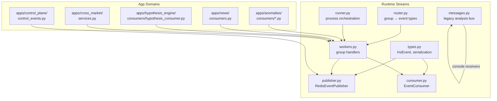
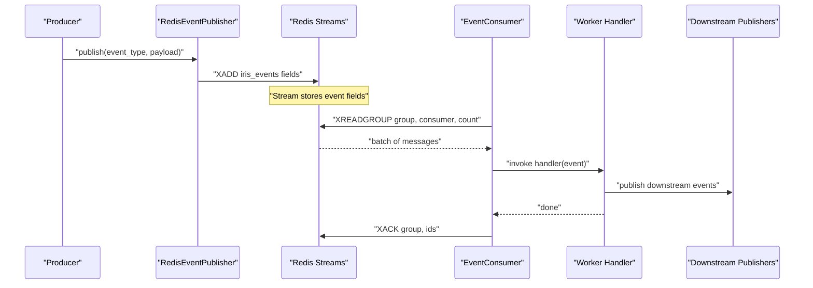
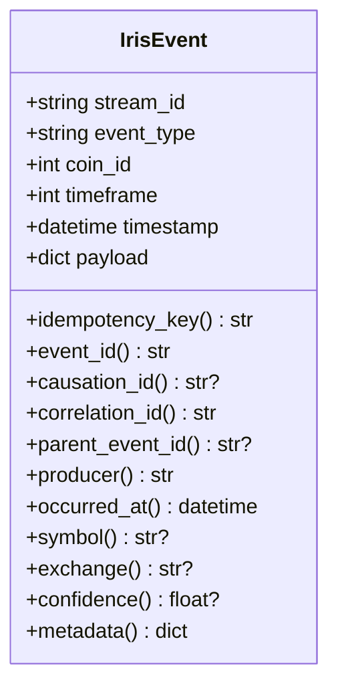
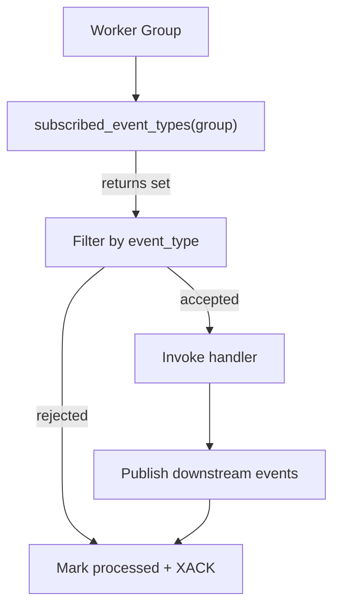
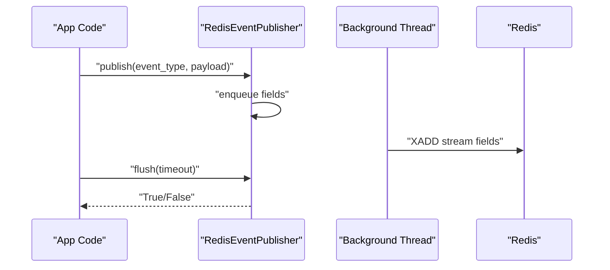
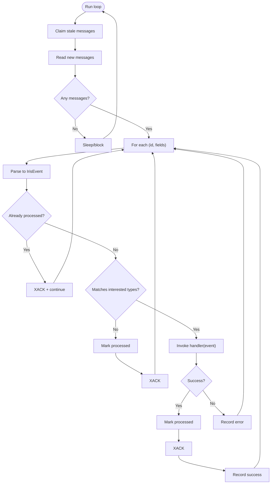
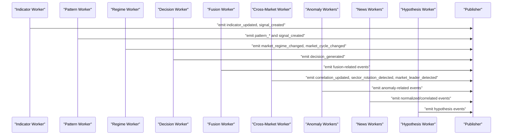
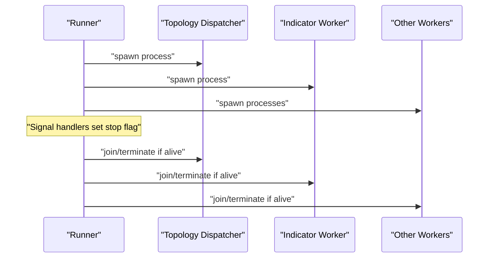
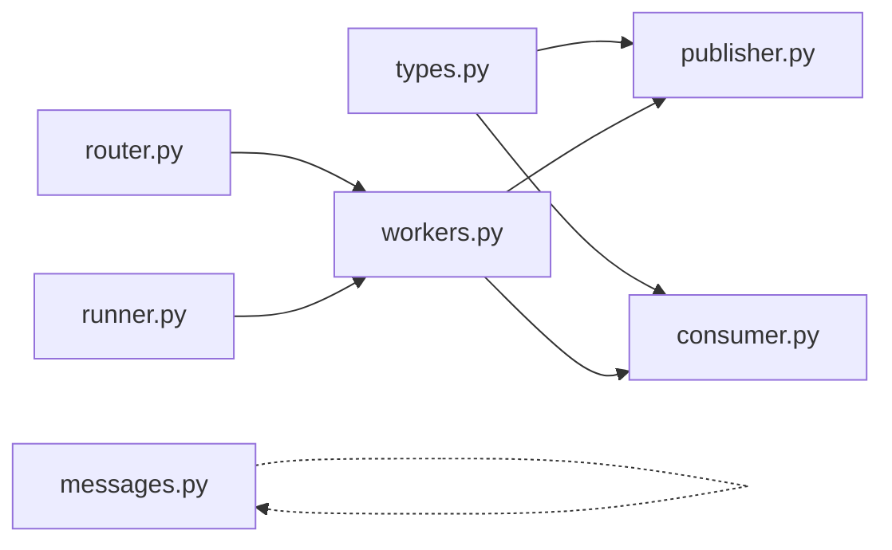

# Event Streaming

<cite>
**Referenced Files in This Document**
- [__init__.py](file://src/runtime/streams/__init__.py)
- [types.py](file://src/runtime/streams/types.py)
- [messages.py](file://src/runtime/streams/messages.py)
- [publisher.py](file://src/runtime/streams/publisher.py)
- [consumer.py](file://src/runtime/streams/consumer.py)
- [router.py](file://src/runtime/streams/router.py)
- [workers.py](file://src/runtime/streams/workers.py)
- [runner.py](file://src/runtime/streams/runner.py)
- [base.py](file://src/core/settings/base.py)
- [candle_anomaly_consumer.py](file://src/apps/anomalies/consumers/candle_anomaly_consumer.py)
- [consumers.py](file://src/apps/news/consumers.py)
- [hypothesis_consumer.py](file://src/apps/hypothesis_engine/consumers/hypothesis_consumer.py)
- [services.py](file://src/apps/cross_market/services.py)
- [control_events.py](file://src/apps/control_plane/control_events.py)
</cite>

## Table of Contents
1. [Introduction](#introduction)
2. [Project Structure](#project-structure)
3. [Core Components](#core-components)
4. [Architecture Overview](#architecture-overview)
5. [Detailed Component Analysis](#detailed-component-analysis)
6. [Dependency Analysis](#dependency-analysis)
7. [Performance Considerations](#performance-considerations)
8. [Troubleshooting Guide](#troubleshooting-guide)
9. [Conclusion](#conclusion)
10. [Appendices](#appendices)

## Introduction
This document describes the event streaming system that powers real-time processing across the platform. It explains how events are modeled, routed, published, and consumed, along with guarantees, filtering, transformations, error handling, throughput tuning, and monitoring. The system is built on Redis Streams and supports a pub/sub-like architecture with consumer groups and per-event idempotency.

## Project Structure
The event streaming subsystem resides under src/runtime/streams and integrates with application domains via worker handlers. Key areas:
- Types and message formats
- Publisher (sync wrapper around async Redis I/O)
- Consumer (async Redis Streams consumer with consumer groups)
- Router (worker group to event type mapping)
- Workers (per-group handlers that transform and emit downstream events)
- Runner (process orchestration)
- Legacy analysis message bus (console/debug)

**Diagram sources**
- [types.py:1-165](file://src/runtime/streams/types.py#L1-L165)
- [router.py:1-63](file://src/runtime/streams/router.py#L1-L63)
- [publisher.py:1-101](file://src/runtime/streams/publisher.py#L1-L101)
- [consumer.py:1-230](file://src/runtime/streams/consumer.py#L1-L230)
- [workers.py:1-502](file://src/runtime/streams/workers.py#L1-L502)
- [runner.py:1-84](file://src/runtime/streams/runner.py#L1-L84)
- [messages.py:1-358](file://src/runtime/streams/messages.py#L1-L358)
- [candle_anomaly_consumer.py:1-24](file://src/apps/anomalies/consumers/candle_anomaly_consumer.py#L1-L24)
- [consumers.py:1-38](file://src/apps/news/consumers.py#L1-L38)
- [hypothesis_consumer.py:1-19](file://src/apps/hypothesis_engine/consumers/hypothesis_consumer.py#L1-L19)
- [services.py:1-483](file://src/apps/cross_market/services.py#L1-L483)
- [control_events.py:1-46](file://src/apps/control_plane/control_events.py#L1-L46)

**Section sources**
- [__init__.py:1-25](file://src/runtime/streams/__init__.py#L1-L25)

## Core Components
- Event model and serialization: IrisEvent encapsulates event identity, routing metadata, and payload parsing/serialization helpers.
- Publisher: Synchronous wrapper that enqueues Redis xadd operations on a background thread to avoid blocking the main loop.
- Consumer: Async consumer using Redis XREADGROUP with consumer groups, idempotent processing, stale claim handling, and acknowledgments.
- Router: Maps worker groups to supported event types.
- Workers: Per-group handlers that transform upstream events into downstream events and side effects.
- Runner: Spawns and supervises worker processes with signal handling.
- Legacy analysis message bus: Console receivers for human-readable analysis messages.

**Section sources**
- [types.py:51-165](file://src/runtime/streams/types.py#L51-L165)
- [publisher.py:22-101](file://src/runtime/streams/publisher.py#L22-L101)
- [consumer.py:49-230](file://src/runtime/streams/consumer.py#L49-L230)
- [router.py:17-63](file://src/runtime/streams/router.py#L17-L63)
- [workers.py:423-502](file://src/runtime/streams/workers.py#L423-L502)
- [runner.py:50-84](file://src/runtime/streams/runner.py#L50-L84)
- [messages.py:45-231](file://src/runtime/streams/messages.py#L45-L231)

## Architecture Overview
The system uses Redis Streams as the backbone:
- Producers publish events to a named stream.
- Consumers form groups and read messages in batches.
- Handlers transform and publish new events, forming a pipeline.
- Idempotency prevents reprocessing of duplicates.
- Metrics capture success/error per route and consumer.

**Diagram sources**
- [publisher.py:38-93](file://src/runtime/streams/publisher.py#L38-L93)
- [consumer.py:117-200](file://src/runtime/streams/consumer.py#L117-L200)
- [workers.py:139-196](file://src/runtime/streams/workers.py#L139-L196)

## Detailed Component Analysis

### Event Model and Payloads
- IrisEvent fields include stream_id, event_type, coin_id, timeframe, timestamp, and payload.
- Helpers compute idempotency_key, correlation identifiers, and typed accessors for metadata, symbol, exchange, confidence, and timestamps.
- Serialization ensures deterministic JSON for hashing and comparison.

**Diagram sources**
- [types.py:51-123](file://src/runtime/streams/types.py#L51-L123)

**Section sources**
- [types.py:125-165](file://src/runtime/streams/types.py#L125-L165)

### Message Routing and Worker Groups
- Worker groups enumerate functional domains (indicators, patterns, regimes, decisions, fusion, cross-market, anomalies, news normalization/correlation, portfolio, hypothesis).
- Router maps each group to a set of event types it consumes.
- Worker creation builds EventConsumer instances with group-specific handlers and metrics recorder.

**Diagram sources**
- [router.py:58-63](file://src/runtime/streams/router.py#L58-L63)
- [workers.py:423-502](file://src/runtime/streams/workers.py#L423-L502)

**Section sources**
- [router.py:17-63](file://src/runtime/streams/router.py#L17-L63)
- [workers.py:423-502](file://src/runtime/streams/workers.py#L423-L502)

### Publishing Pipeline
- RedisEventPublisher enqueues event fields and drains them on a background thread.
- Flush waits until all queued items are written.
- Reset closes the publisher and underlying connection.

**Diagram sources**
- [publisher.py:38-93](file://src/runtime/streams/publisher.py#L38-L93)

**Section sources**
- [publisher.py:22-101](file://src/runtime/streams/publisher.py#L22-L101)

### Consumer and Delivery Guarantees
- Consumer groups ensure at-least-once delivery semantics via XREADGROUP and XACK.
- Stale message claim handles delayed or failed deliveries after idle threshold.
- Idempotency uses a Redis key per group and event idempotency_key; already-processed messages are acknowledged immediately.
- Filtering allows handlers to restrict to specific event types.
- Metrics recording tracks handler outcomes keyed by route and consumer.

**Diagram sources**
- [consumer.py:190-217](file://src/runtime/streams/consumer.py#L190-L217)

**Section sources**
- [consumer.py:49-230](file://src/runtime/streams/consumer.py#L49-L230)

### Worker Handlers and Transformations
- Indicator worker: computes analytics, emits indicator updates and signals.
- Pattern worker: detects patterns/clusters/signals and emits related events.
- Regime worker: refreshes market regime and cycle, emitting regime/cycle changes.
- Decision worker: enriches context, captures feature snapshots, and emits decisions.
- Fusion worker: evaluates fusion from market and news events.
- Cross-market worker: updates relations, sectors, leaders; emits correlation and rotation events.
- Anomaly workers: process anomaly detection events.
- News normalization/correlation workers: normalize and correlate news items.
- Hypothesis worker: creates hypotheses from supported source events.
- Control plane: publishes control events into the event stream.

**Diagram sources**
- [workers.py:69-367](file://src/runtime/streams/workers.py#L69-L367)
- [services.py:140-183](file://src/apps/cross_market/services.py#L140-L183)
- [candle_anomaly_consumer.py:13-24](file://src/apps/anomalies/consumers/candle_anomaly_consumer.py#L13-L24)
- [consumers.py:13-35](file://src/apps/news/consumers.py#L13-L35)
- [hypothesis_consumer.py:14-19](file://src/apps/hypothesis_engine/consumers/hypothesis_consumer.py#L14-L19)
- [control_events.py:25-35](file://src/apps/control_plane/control_events.py#L25-L35)

**Section sources**
- [workers.py:69-367](file://src/runtime/streams/workers.py#L69-L367)
- [services.py:87-211](file://src/apps/cross_market/services.py#L87-L211)
- [candle_anomaly_consumer.py:9-24](file://src/apps/anomalies/consumers/candle_anomaly_consumer.py#L9-L24)
- [consumers.py:9-38](file://src/apps/news/consumers.py#L9-L38)
- [hypothesis_consumer.py:10-19](file://src/apps/hypothesis_engine/consumers/hypothesis_consumer.py#L10-L19)
- [control_events.py:25-46](file://src/apps/control_plane/control_events.py#L25-L46)

### Consumer Groups and Process Orchestration
- Each worker group runs in a dedicated process with a unique consumer name derived from hostname and pid.
- Runner spawns a topology dispatcher and all worker processes, wiring SIGINT/SIGTERM to graceful shutdown.
- Stop flag coordination ensures orderly termination.

**Diagram sources**
- [runner.py:50-84](file://src/runtime/streams/runner.py#L50-L84)

**Section sources**
- [runner.py:10-84](file://src/runtime/streams/runner.py#L10-L84)
- [consumer.py:228-230](file://src/runtime/streams/consumer.py#L228-L230)

### Legacy Analysis Message Bus
- Provides a separate Redis Stream for console/debug receivers.
- Supports multiple receiver groups and prints messages to stdout.
- Publishes progress, loaded, ready, and decision/signals as human-readable topics.

**Section sources**
- [messages.py:45-358](file://src/runtime/streams/messages.py#L45-L358)

## Dependency Analysis
- Event types and serialization are shared across publisher/consumer and workers.
- Router decouples worker groups from event types.
- Workers depend on domain services and publish downstream events.
- Runner depends on worker factory and control plane dispatcher.

**Diagram sources**
- [types.py:1-165](file://src/runtime/streams/types.py#L1-L165)
- [publisher.py:1-101](file://src/runtime/streams/publisher.py#L1-L101)
- [consumer.py:1-230](file://src/runtime/streams/consumer.py#L1-L230)
- [router.py:1-63](file://src/runtime/streams/router.py#L1-L63)
- [workers.py:1-502](file://src/runtime/streams/workers.py#L1-L502)
- [runner.py:1-84](file://src/runtime/streams/runner.py#L1-L84)
- [messages.py:1-358](file://src/runtime/streams/messages.py#L1-L358)

**Section sources**
- [types.py:1-165](file://src/runtime/streams/types.py#L1-L165)
- [router.py:1-63](file://src/runtime/streams/router.py#L1-L63)
- [workers.py:1-502](file://src/runtime/streams/workers.py#L1-L502)
- [runner.py:1-84](file://src/runtime/streams/runner.py#L1-L84)

## Performance Considerations
- Batch size and block interval: Tune batch_size and block_milliseconds to balance latency and CPU utilization.
- Pending idle threshold: Controls stale claim window to recover stalled messages.
- Idempotency TTL: Limits storage of processed keys per group.
- Background publishing: Offloads Redis I/O to a dedicated thread to keep main loops responsive.
- Worker processes: Isolation reduces contention and enables horizontal scaling per group.
- Payload size: Keep payloads minimal; serialize deterministically to reduce hash churn.

[No sources needed since this section provides general guidance]

## Troubleshooting Guide
Common issues and remedies:
- Consumer group errors (NOGROUP): The consumer ensures the group exists automatically; transient failures are handled with retries.
- Redis connectivity: Exceptions are caught and logged; consumers sleep briefly before retrying.
- Handler failures: Errors are recorded via metrics and re-raised; investigate handler logs for stack traces.
- Stalled messages: Stale claim logic re-delivers messages after pending_idle_milliseconds.
- Publisher backlog: Use flush(timeout) to drain; monitor pending events.

Operational checks:
- Verify stream name and Redis URL in settings.
- Confirm worker groups are spawned and running.
- Inspect consumer lag and group pending counts.
- Review metrics for consumer_key and route_key success rates.

**Section sources**
- [consumer.py:190-217](file://src/runtime/streams/consumer.py#L190-L217)
- [publisher.py:45-74](file://src/runtime/streams/publisher.py#L45-L74)
- [base.py:17-21](file://src/core/settings/base.py#L17-L21)

## Conclusion
The event streaming system provides a robust, scalable foundation for real-time processing. It leverages Redis Streams with consumer groups for reliable delivery, idempotency for safety, and a flexible router/handler model for transformations. With configurable batching, background publishing, and process-based isolation, it balances throughput and latency while offering clear observability via metrics and console receivers.

[No sources needed since this section summarizes without analyzing specific files]

## Appendices

### Event Types and Payloads
- Indicator worker: consumes upstream events; emits indicator_updated, signal_created.
- Pattern worker: emits pattern_detected, pattern_cluster_detected, signal_created.
- Regime worker: emits market_regime_changed, market_cycle_changed.
- Decision worker: emits decision_generated.
- Fusion worker: emits fusion-related events based on market and news inputs.
- Cross-market worker: emits correlation_updated, sector_rotation_detected, market_leader_detected.
- Anomaly workers: emit anomaly-related events.
- News workers: emit normalized and correlated news events.
- Hypothesis worker: emits hypothesis events for supported source events.
- Control plane: emits control.* events into the event stream.

**Section sources**
- [router.py:17-55](file://src/runtime/streams/router.py#L17-L55)
- [workers.py:139-367](file://src/runtime/streams/workers.py#L139-L367)
- [services.py:140-183](file://src/apps/cross_market/services.py#L140-L183)
- [candle_anomaly_consumer.py:13-24](file://src/apps/anomalies/consumers/candle_anomaly_consumer.py#L13-L24)
- [consumers.py:13-35](file://src/apps/news/consumers.py#L13-L35)
- [hypothesis_consumer.py:14-19](file://src/apps/hypothesis_engine/consumers/hypothesis_consumer.py#L14-L19)
- [control_events.py:25-35](file://src/apps/control_plane/control_events.py#L25-L35)

### Configuration Reference
- Stream name: event_stream_name
- Worker batch size: event_worker_batch_size
- Block milliseconds: event_worker_block_milliseconds
- Pending idle milliseconds: event_worker_pending_idle_milliseconds
- Redis URL: redis_url

**Section sources**
- [base.py:21-21](file://src/core/settings/base.py#L21-L21)
- [base.py:48-50](file://src/core/settings/base.py#L48-L50)
- [base.py:17-20](file://src/core/settings/base.py#L17-L20)