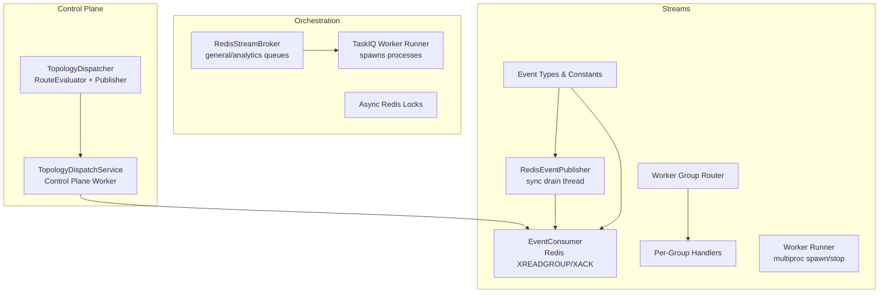
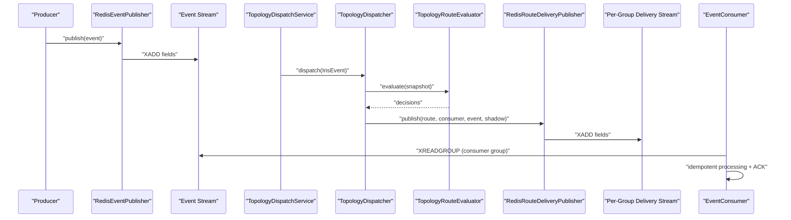
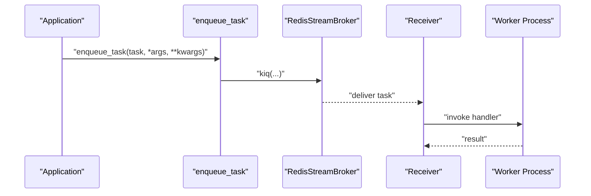
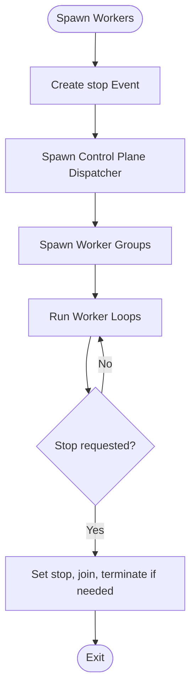
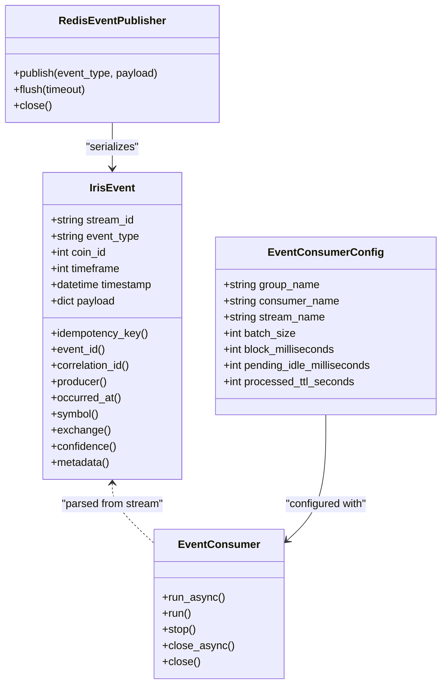
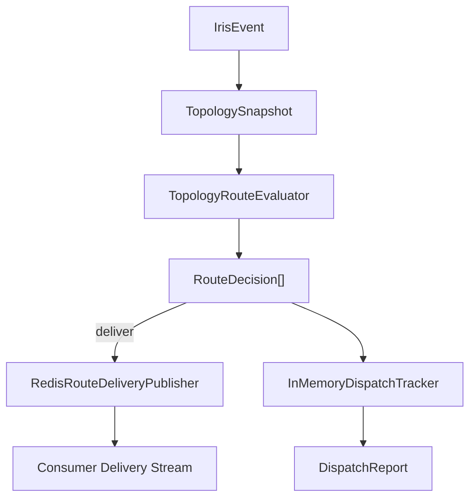
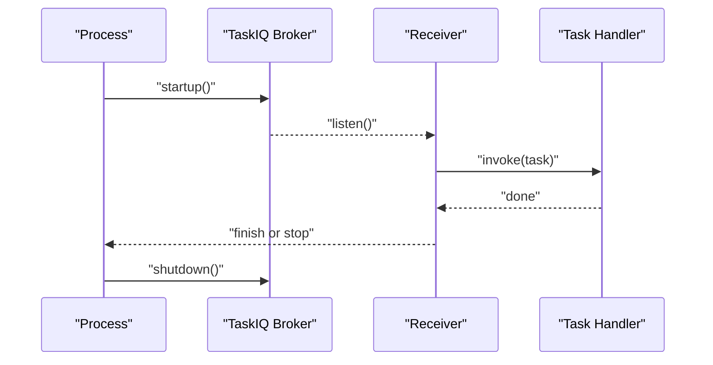
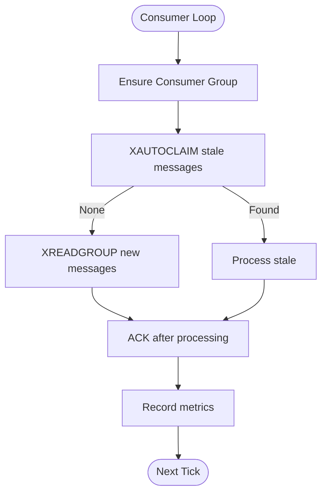
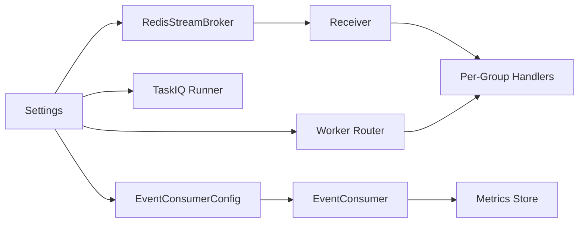

# Runtime Orchestration

<cite>
**Referenced Files in This Document**
- [src/runtime/__init__.py](file://src/runtime/__init__.py)
- [src/runtime/orchestration/__init__.py](file://src/runtime/orchestration/__init__.py)
- [src/runtime/orchestration/broker.py](file://src/runtime/orchestration/broker.py)
- [src/runtime/orchestration/dispatcher.py](file://src/runtime/orchestration/dispatcher.py)
- [src/runtime/orchestration/runner.py](file://src/runtime/orchestration/runner.py)
- [src/runtime/orchestration/locks.py](file://src/runtime/orchestration/locks.py)
- [src/runtime/control_plane/__init__.py](file://src/runtime/control_plane/__init__.py)
- [src/runtime/control_plane/dispatcher.py](file://src/runtime/control_plane/dispatcher.py)
- [src/runtime/control_plane/worker.py](file://src/runtime/control_plane/worker.py)
- [src/runtime/streams/__init__.py](file://src/runtime/streams/__init__.py)
- [src/runtime/streams/consumer.py](file://src/runtime/streams/consumer.py)
- [src/runtime/streams/publisher.py](file://src/runtime/streams/publisher.py)
- [src/runtime/streams/router.py](file://src/runtime/streams/router.py)
- [src/runtime/streams/types.py](file://src/runtime/streams/types.py)
- [src/runtime/streams/workers.py](file://src/runtime/streams/workers.py)
- [src/runtime/streams/runner.py](file://src/runtime/streams/runner.py)
</cite>

## Table of Contents
1. [Introduction](#introduction)
2. [Project Structure](#project-structure)
3. [Core Components](#core-components)
4. [Architecture Overview](#architecture-overview)
5. [Detailed Component Analysis](#detailed-component-analysis)
6. [Dependency Analysis](#dependency-analysis)
7. [Performance Considerations](#performance-considerations)
8. [Troubleshooting Guide](#troubleshooting-guide)
9. [Conclusion](#conclusion)
10. [Appendices](#appendices)

## Introduction
This document describes the runtime orchestration system responsible for task queue management, worker process coordination, event streaming, and distributed task execution. It covers:
- Task queue management via TaskIQ with Redis Streams
- Worker lifecycle management and process spawning
- Event streaming architecture with Redis Streams and consumer groups
- Control plane topology-driven event routing and delivery
- Distributed task execution across worker groups
- Locking mechanisms for coordination
- Stream processing, idempotent handling, and metrics
- Scaling, performance optimization, and monitoring strategies

## Project Structure
The runtime subsystem is organized into cohesive modules:
- orchestration: TaskIQ broker wiring, task dispatch helpers, worker runner, and Redis-based locking
- control_plane: Topology-aware dispatcher and control-plane worker
- streams: Event types, publisher, consumer, router, workers, and runner

**Diagram sources**
- [src/runtime/orchestration/broker.py:1-23](file://src/runtime/orchestration/broker.py#L1-L23)
- [src/runtime/orchestration/runner.py:1-118](file://src/runtime/orchestration/runner.py#L1-L118)
- [src/runtime/orchestration/locks.py:1-79](file://src/runtime/orchestration/locks.py#L1-L79)
- [src/runtime/control_plane/dispatcher.py:1-313](file://src/runtime/control_plane/dispatcher.py#L1-L313)
- [src/runtime/control_plane/worker.py:1-132](file://src/runtime/control_plane/worker.py#L1-L132)
- [src/runtime/streams/types.py:1-165](file://src/runtime/streams/types.py#L1-L165)
- [src/runtime/streams/publisher.py:1-101](file://src/runtime/streams/publisher.py#L1-L101)
- [src/runtime/streams/router.py:1-63](file://src/runtime/streams/router.py#L1-L63)
- [src/runtime/streams/consumer.py:1-230](file://src/runtime/streams/consumer.py#L1-L230)
- [src/runtime/streams/workers.py:1-509](file://src/runtime/streams/workers.py#L1-L509)
- [src/runtime/streams/runner.py:1-84](file://src/runtime/streams/runner.py#L1-L84)

**Section sources**
- [src/runtime/__init__.py:1-2](file://src/runtime/__init__.py#L1-L2)
- [src/runtime/orchestration/__init__.py:1-9](file://src/runtime/orchestration/__init__.py#L1-L9)
- [src/runtime/control_plane/__init__.py:1-32](file://src/runtime/control_plane/__init__.py#L1-L32)
- [src/runtime/streams/__init__.py:1-25](file://src/runtime/streams/__init__.py#L1-L25)

## Core Components
- TaskIQ broker and dispatch helpers:
  - General and analytics RedisStreamBrokers configured with distinct queue and consumer group names
  - Enqueue and local dispatch helpers to integrate with TaskIQ tasks
- TaskIQ worker runner:
  - Spawns per-group worker processes, loads appropriate task modules, and manages shutdown
- Redis-based locking:
  - Async Redis lock acquisition with timeouts and graceful release
- Control plane dispatcher:
  - Topology-aware route evaluation, throttling, and delivery decisions
  - In-memory dispatch tracking and metrics recording
- Control plane worker:
  - Reads the event stream, resolves topology, dispatches to delivery streams, and records metrics
- Streams:
  - Event types and constants, publisher with background drain thread, consumer with idempotency and ACK, worker router, per-group handlers, and worker runner

**Section sources**
- [src/runtime/orchestration/broker.py:1-23](file://src/runtime/orchestration/broker.py#L1-L23)
- [src/runtime/orchestration/dispatcher.py:1-12](file://src/runtime/orchestration/dispatcher.py#L1-L12)
- [src/runtime/orchestration/runner.py:1-118](file://src/runtime/orchestration/runner.py#L1-L118)
- [src/runtime/orchestration/locks.py:1-79](file://src/runtime/orchestration/locks.py#L1-L79)
- [src/runtime/control_plane/dispatcher.py:1-313](file://src/runtime/control_plane/dispatcher.py#L1-L313)
- [src/runtime/control_plane/worker.py:1-132](file://src/runtime/control_plane/worker.py#L1-L132)
- [src/runtime/streams/types.py:1-165](file://src/runtime/streams/types.py#L1-L165)
- [src/runtime/streams/publisher.py:1-101](file://src/runtime/streams/publisher.py#L1-L101)
- [src/runtime/streams/consumer.py:1-230](file://src/runtime/streams/consumer.py#L1-L230)
- [src/runtime/streams/router.py:1-63](file://src/runtime/streams/router.py#L1-L63)
- [src/runtime/streams/workers.py:1-509](file://src/runtime/streams/workers.py#L1-L509)
- [src/runtime/streams/runner.py:1-84](file://src/runtime/streams/runner.py#L1-L84)

## Architecture Overview
The runtime orchestrates two primary pipelines:
- Task queue pipeline (TaskIQ + Redis Streams): Tasks are enqueued and executed by worker processes spawned per group.
- Event streaming pipeline (Redis Streams): Events are published to a central stream, routed by the control plane to per-worker delivery streams, and consumed by dedicated workers.

**Diagram sources**
- [src/runtime/streams/publisher.py:1-101](file://src/runtime/streams/publisher.py#L1-L101)
- [src/runtime/streams/types.py:1-165](file://src/runtime/streams/types.py#L1-L165)
- [src/runtime/control_plane/worker.py:1-132](file://src/runtime/control_plane/worker.py#L1-L132)
- [src/runtime/control_plane/dispatcher.py:1-313](file://src/runtime/control_plane/dispatcher.py#L1-L313)
- [src/runtime/streams/consumer.py:1-230](file://src/runtime/streams/consumer.py#L1-L230)

## Detailed Component Analysis

### Task Queue Management with TaskIQ
- Broker configuration:
  - Two brokers: general and analytics, each with dedicated queue and consumer group names
  - Uses RedisStreamBroker backed by Redis
- Dispatch helpers:
  - enqueue_task delegates to task.kiq
  - dispatch_task_locally forwards to enqueue_task
- Worker runner:
  - Defines worker groups with process counts from settings
  - Loads task modules per group and starts Receiver loops
  - Supports graceful stop via multiprocessing.Event and signal handlers
  - Ensures startup/shutdown and cooperative cancellation

**Diagram sources**
- [src/runtime/orchestration/broker.py:1-23](file://src/runtime/orchestration/broker.py#L1-L23)
- [src/runtime/orchestration/dispatcher.py:1-12](file://src/runtime/orchestration/dispatcher.py#L1-L12)
- [src/runtime/orchestration/runner.py:1-118](file://src/runtime/orchestration/runner.py#L1-L118)

**Section sources**
- [src/runtime/orchestration/broker.py:1-23](file://src/runtime/orchestration/broker.py#L1-L23)
- [src/runtime/orchestration/dispatcher.py:1-12](file://src/runtime/orchestration/dispatcher.py#L1-L12)
- [src/runtime/orchestration/runner.py:1-118](file://src/runtime/orchestration/runner.py#L1-L118)

### Worker Lifecycle Management
- Multiprocess spawning:
  - Creates a stop Event and spawns processes per worker group
  - Control plane dispatcher runs separately
- Graceful shutdown:
  - Signal handlers set stop flag; processes join with timeouts
  - Termination fallback ensures cleanup
- Worker runner:
  - Per-group runner sets up signal handlers and runs EventConsumer with stop checker

**Diagram sources**
- [src/runtime/streams/runner.py:1-84](file://src/runtime/streams/runner.py#L1-L84)
- [src/runtime/orchestration/runner.py:91-118](file://src/runtime/orchestration/runner.py#L91-L118)

**Section sources**
- [src/runtime/streams/runner.py:1-84](file://src/runtime/streams/runner.py#L1-L84)
- [src/runtime/orchestration/runner.py:91-118](file://src/runtime/orchestration/runner.py#L91-L118)

### Event Streaming Architecture
- Event types and constants:
  - Central event stream name and worker group constants
  - IrisEvent model with idempotency key derivation and metadata parsing
- Publisher:
  - Synchronous interface with internal background thread draining Redis XADD calls
  - Flush and reset utilities
- Consumer:
  - Redis XREADGROUP with consumer groups and automatic claim of pending messages
  - Idempotency via per-event processed marker TTL
  - Metrics recording for handler outcomes
- Router:
  - Maps worker groups to event types for subscription
- Workers:
  - Per-group handlers implement domain-specific event processing and emit downstream events
- Worker runner:
  - Spawns per-group workers and the control plane dispatcher

**Diagram sources**
- [src/runtime/streams/types.py:51-165](file://src/runtime/streams/types.py#L51-L165)
- [src/runtime/streams/consumer.py:26-230](file://src/runtime/streams/consumer.py#L26-L230)
- [src/runtime/streams/publisher.py:22-101](file://src/runtime/streams/publisher.py#L22-L101)

**Section sources**
- [src/runtime/streams/types.py:1-165](file://src/runtime/streams/types.py#L1-L165)
- [src/runtime/streams/publisher.py:1-101](file://src/runtime/streams/publisher.py#L1-L101)
- [src/runtime/streams/consumer.py:1-230](file://src/runtime/streams/consumer.py#L1-L230)
- [src/runtime/streams/router.py:1-63](file://src/runtime/streams/router.py#L1-L63)
- [src/runtime/streams/workers.py:1-509](file://src/runtime/streams/workers.py#L1-L509)
- [src/runtime/streams/runner.py:1-84](file://src/runtime/streams/runner.py#L1-L84)

### Control Plane Dispatcher and Routing
- TopologyRouteEvaluator:
  - Evaluates routes against event definition, environment, scope, filters, and throttling
  - Supports shadow mode and observe-only routes
- TopologyDispatcher:
  - Applies evaluation results to publish to delivery streams
  - Tracks dispatch counters and snapshots
- RedisRouteDeliveryPublisher:
  - Publishes to per-consumer delivery streams with enriched metadata
- TopologyDispatchService:
  - Integrates cache manager, metrics store, and environment-aware evaluation
  - Handles control events to refresh topology snapshot

**Diagram sources**
- [src/runtime/control_plane/dispatcher.py:114-313](file://src/runtime/control_plane/dispatcher.py#L114-L313)
- [src/runtime/control_plane/worker.py:22-132](file://src/runtime/control_plane/worker.py#L22-L132)

**Section sources**
- [src/runtime/control_plane/dispatcher.py:1-313](file://src/runtime/control_plane/dispatcher.py#L1-L313)
- [src/runtime/control_plane/worker.py:1-132](file://src/runtime/control_plane/worker.py#L1-L132)

### Distributed Task Execution and Locking
- Task execution:
  - TaskIQ workers consume from Redis Streams using Receiver.listen
  - Process model isolates workers; stop flag ensures coordinated shutdown
- Locking:
  - Async Redis lock acquisition with non-blocking attempts and timeouts
  - Thread-safe client caching per event loop
  - Ping/wait helpers for Redis readiness

**Diagram sources**
- [src/runtime/orchestration/runner.py:57-79](file://src/runtime/orchestration/runner.py#L57-L79)
- [src/runtime/orchestration/broker.py:12-22](file://src/runtime/orchestration/broker.py#L12-L22)

**Section sources**
- [src/runtime/orchestration/runner.py:1-118](file://src/runtime/orchestration/runner.py#L1-L118)
- [src/runtime/orchestration/locks.py:1-79](file://src/runtime/orchestration/locks.py#L1-L79)

### Stream Processing and Idempotency
- Consumer loop:
  - Ensures consumer group exists, reads stale messages via autoclaim, then new messages via xreadgroup
  - Skips already-processed events using a TTL’d processed key
  - Invokes handler (sync or async) and ACKs
- Metrics:
  - Records success/failure per route and consumer key
- Worker groups:
  - Each group subscribes to a dedicated delivery stream and processes only matching event types

**Diagram sources**
- [src/runtime/streams/consumer.py:190-226](file://src/runtime/streams/consumer.py#L190-L226)

**Section sources**
- [src/runtime/streams/consumer.py:1-230](file://src/runtime/streams/consumer.py#L1-L230)
- [src/runtime/streams/workers.py:430-509](file://src/runtime/streams/workers.py#L430-L509)

## Dependency Analysis
- Orchestration depends on:
  - Settings for Redis URLs and worker counts
  - Task modules loaded per worker group
- Control plane depends on:
  - Topology cache and metrics stores
  - Streams types and consumer infrastructure
- Streams depend on:
  - Settings for stream names and worker parameters
  - Domain services for event processing
  - Redis for persistence and messaging

**Diagram sources**
- [src/runtime/orchestration/broker.py:1-23](file://src/runtime/orchestration/broker.py#L1-L23)
- [src/runtime/orchestration/runner.py:1-118](file://src/runtime/orchestration/runner.py#L1-L118)
- [src/runtime/streams/consumer.py:1-230](file://src/runtime/streams/consumer.py#L1-L230)
- [src/runtime/streams/router.py:1-63](file://src/runtime/streams/router.py#L1-L63)

**Section sources**
- [src/runtime/orchestration/broker.py:1-23](file://src/runtime/orchestration/broker.py#L1-L23)
- [src/runtime/streams/router.py:1-63](file://src/runtime/streams/router.py#L1-L63)
- [src/runtime/streams/consumer.py:1-230](file://src/runtime/streams/consumer.py#L1-L230)

## Performance Considerations
- Throughput and batching:
  - Tune batch_size and block_milliseconds for consumer groups to balance latency and CPU usage
- Backpressure and retries:
  - Use pending_idle_milliseconds to reclaim stalled messages
  - Implement retry strategies at the handler level for transient failures
- Lock contention:
  - Keep lock names scoped and short-lived; avoid long-running handlers under locks
- Redis I/O:
  - Publisher uses a background thread to avoid blocking the main loop
  - Consumer uses async Redis calls for non-blocking I/O
- Worker scaling:
  - Adjust process counts per group based on workload characteristics
  - Separate analytics and general queues to prevent tail latency impact

[No sources needed since this section provides general guidance]

## Troubleshooting Guide
- Redis connectivity:
  - Use ping and wait helpers to probe and retry connection establishment
- Consumer stalls:
  - Verify consumer group creation and autoclaim behavior
  - Confirm processed keys TTL and absence of ACK failures
- Task execution:
  - Ensure worker processes are spawned and not terminated prematurely
  - Validate that Receiver.listen is running and stop flags are respected
- Control plane routing:
  - Check topology snapshot freshness and route filters
  - Inspect throttling counters and environment scoping

**Section sources**
- [src/runtime/orchestration/locks.py:63-79](file://src/runtime/orchestration/locks.py#L63-L79)
- [src/runtime/streams/consumer.py:72-137](file://src/runtime/streams/consumer.py#L72-L137)
- [src/runtime/orchestration/runner.py:51-78](file://src/runtime/orchestration/runner.py#L51-L78)
- [src/runtime/control_plane/worker.py:78-105](file://src/runtime/control_plane/worker.py#L78-L105)

## Conclusion
The runtime orchestration system combines TaskIQ-backed task queues and a Redis Streams-based event pipeline. It provides robust worker lifecycle management, idempotent event processing, topology-driven routing, and distributed coordination through Redis locks. With configurable scaling and monitoring hooks, it supports high-throughput, low-latency processing across domains such as indicators, patterns, anomalies, news, and portfolio actions.

[No sources needed since this section summarizes without analyzing specific files]

## Appendices

### API and Configuration References
- Event types and worker groups:
  - See constants and group mappings for supported event types and worker roles
- Consumer configuration:
  - Batch size, block duration, and pending idle thresholds are tunable per group
- TaskIQ worker groups:
  - General and analytics queues with separate process counts

**Section sources**
- [src/runtime/streams/types.py:12-48](file://src/runtime/streams/types.py#L12-L48)
- [src/runtime/streams/router.py:17-63](file://src/runtime/streams/router.py#L17-L63)
- [src/runtime/streams/consumer.py:26-35](file://src/runtime/streams/consumer.py#L26-L35)
- [src/runtime/orchestration/runner.py:21-24](file://src/runtime/orchestration/runner.py#L21-L24)