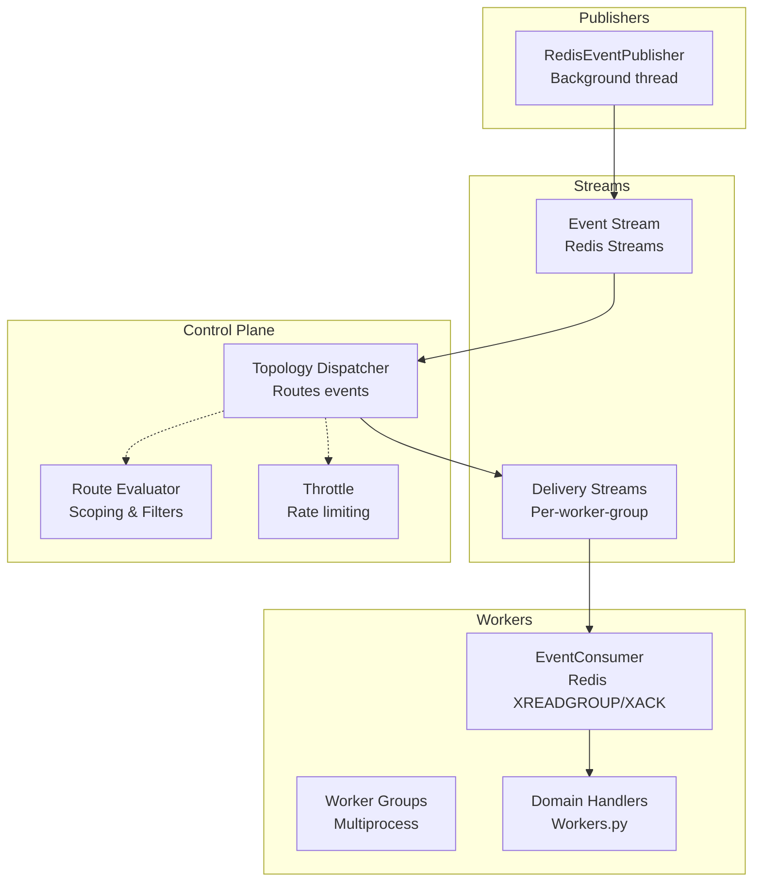
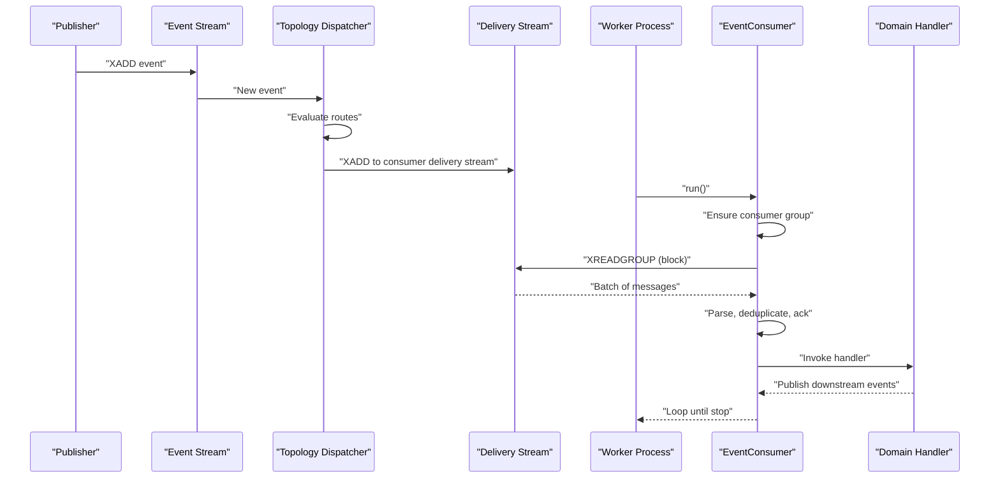
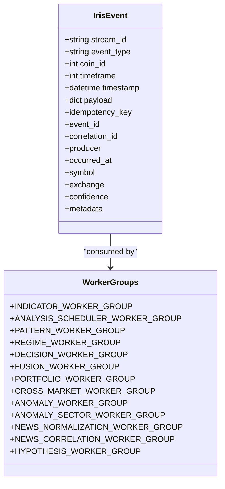
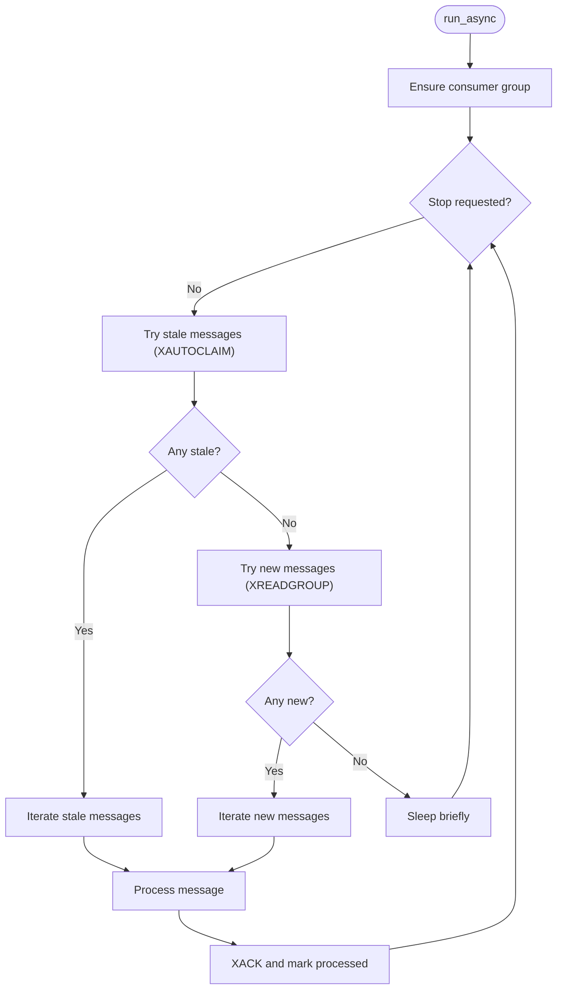
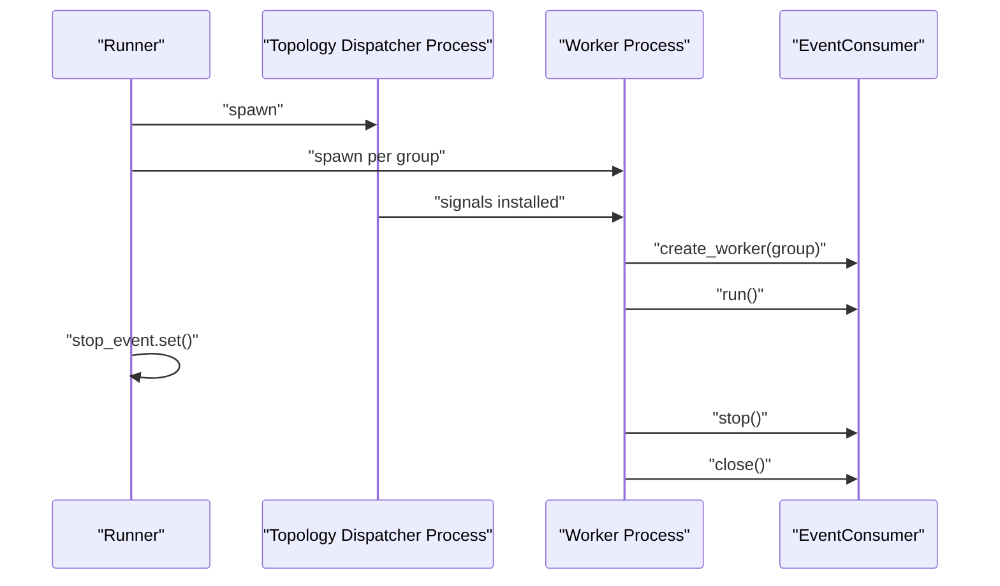
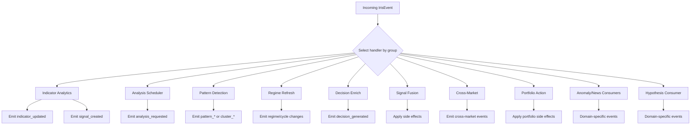
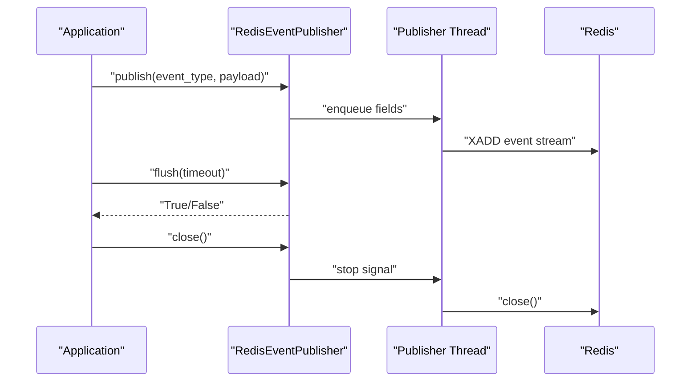
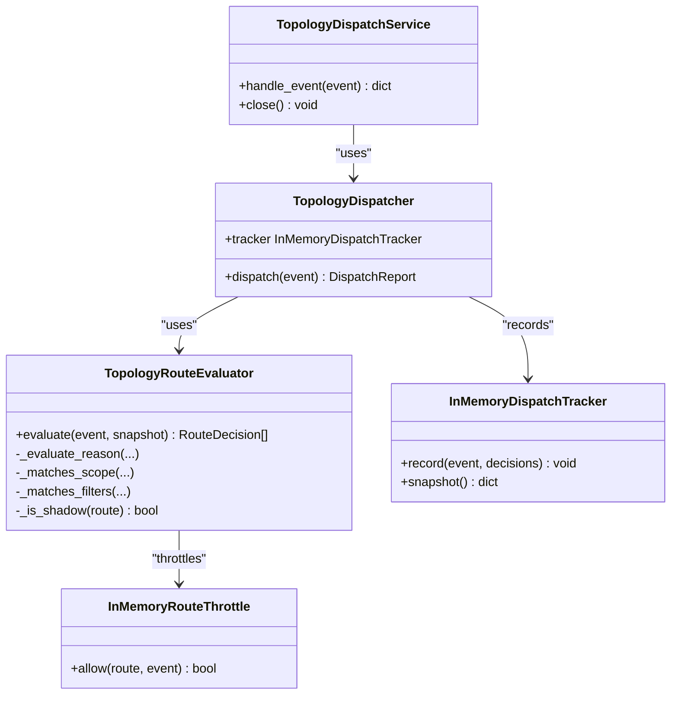
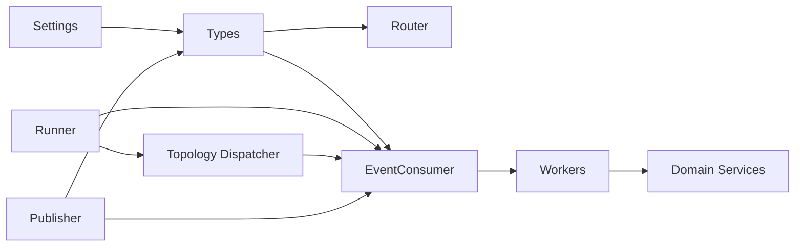

# Stream Processing

<cite>
**Referenced Files in This Document**
- [types.py](file://src/runtime/streams/types.py)
- [router.py](file://src/runtime/streams/router.py)
- [messages.py](file://src/runtime/streams/messages.py)
- [consumer.py](file://src/runtime/streams/consumer.py)
- [workers.py](file://src/runtime/streams/workers.py)
- [runner.py](file://src/runtime/streams/runner.py)
- [publisher.py](file://src/runtime/streams/publisher.py)
- [worker.py](file://src/runtime/control_plane/worker.py)
- [dispatcher.py](file://src/runtime/control_plane/dispatcher.py)
- [base.py](file://src/core/settings/base.py)
- [test_runner.py](file://tests/runtime/streams/test_runner.py)
- [test_workers.py](file://tests/runtime/streams/test_workers.py)
- [test_consumer.py](file://tests/runtime/streams/test_consumer.py)
</cite>

## Table of Contents
1. [Introduction](#introduction)
2. [Project Structure](#project-structure)
3. [Core Components](#core-components)
4. [Architecture Overview](#architecture-overview)
5. [Detailed Component Analysis](#detailed-component-analysis)
6. [Dependency Analysis](#dependency-analysis)
7. [Performance Considerations](#performance-considerations)
8. [Troubleshooting Guide](#troubleshooting-guide)
9. [Conclusion](#conclusion)

## Introduction
This document explains the stream processing subsystem responsible for real-time event-driven analytics and decision-making. It covers the stream runner architecture, worker pool management, concurrent processing strategies, stream types, processing pipelines, data transformation workflows, backpressure handling, stream partitioning, parallel processing techniques, monitoring, performance tuning, and debugging approaches.

## Project Structure
The stream processing module is organized around Redis Streams as the backbone for asynchronous messaging. It includes:
- Types and models for events and routing keys
- Consumers that read from Redis Streams and invoke domain handlers
- Workers that implement domain-specific processing pipelines
- A topology dispatcher that routes events to worker groups based on dynamic control plane topology
- Runners that spawn and manage worker processes
- Synchronous publishers that enqueue Redis writes on background threads

**Diagram sources**
- [runner.py:50-84](file://src/runtime/streams/runner.py#L50-L84)
- [worker.py:111-122](file://src/runtime/control_plane/worker.py#L111-L122)
- [dispatcher.py:266-297](file://src/runtime/control_plane/dispatcher.py#L266-L297)
- [consumer.py:49-225](file://src/runtime/streams/consumer.py#L49-L225)
- [workers.py:372-450](file://src/runtime/streams/workers.py#L372-L450)
- [publisher.py:22-101](file://src/runtime/streams/publisher.py#L22-L101)

**Section sources**
- [types.py:12-48](file://src/runtime/streams/types.py#L12-L48)
- [router.py:17-55](file://src/runtime/streams/router.py#L17-L55)
- [messages.py:23-61](file://src/runtime/streams/messages.py#L23-L61)
- [consumer.py:26-35](file://src/runtime/streams/consumer.py#L26-L35)
- [workers.py:18-36](file://src/runtime/streams/workers.py#L18-L36)
- [runner.py:10-16](file://src/runtime/streams/runner.py#L10-L16)
- [publisher.py:22-37](file://src/runtime/streams/publisher.py#L22-L37)
- [worker.py:18-19](file://src/runtime/control_plane/worker.py#L18-L19)
- [dispatcher.py:266-297](file://src/runtime/control_plane/dispatcher.py#L266-L297)

## Core Components
- Event model and serialization: Defines the event envelope, idempotency key computation, and payload parsing/serialization helpers.
- Worker groups and subscriptions: Enumerates worker groups and maps event types to worker groups.
- Event consumer: Implements Redis Streams consumption with XREADGROUP/XACK, idempotent processing, stale message reclamation, and metrics recording.
- Domain workers: Implement processing pipelines for indicators, patterns, regimes, decisions, fusion, cross-market, anomalies, news normalization/correlation, and portfolio actions.
- Topology dispatcher: Evaluates routes against a dynamic topology, applies filters/scopes/throttles, and publishes to per-consumer delivery streams.
- Runners: Spawn multiprocess worker pools and a control-plane dispatcher process.
- Publishers: Synchronous publisher backed by a background thread to enqueue Redis writes.

**Section sources**
- [types.py:51-165](file://src/runtime/streams/types.py#L51-L165)
- [router.py:17-55](file://src/runtime/streams/router.py#L17-L55)
- [consumer.py:49-225](file://src/runtime/streams/consumer.py#L49-L225)
- [workers.py:372-450](file://src/runtime/streams/workers.py#L372-L450)
- [worker.py:111-122](file://src/runtime/control_plane/worker.py#L111-L122)
- [runner.py:50-84](file://src/runtime/streams/runner.py#L50-L84)
- [publisher.py:22-101](file://src/runtime/streams/publisher.py#L22-L101)

## Architecture Overview
The system uses Redis Streams as the event bus. Events originate from publishers and are routed by the topology dispatcher to per-worker-group delivery streams. Worker processes consume from their delivery streams and invoke domain handlers. Backpressure is managed through Redis blocking reads, batch sizes, and consumer group semantics. Idempotency is enforced via a processed marker key.

**Diagram sources**
- [publisher.py:38-44](file://src/runtime/streams/publisher.py#L38-L44)
- [worker.py:78-105](file://src/runtime/control_plane/worker.py#L78-L105)
- [dispatcher.py:280-297](file://src/runtime/control_plane/dispatcher.py#L280-L297)
- [consumer.py:117-137](file://src/runtime/streams/consumer.py#L117-L137)
- [consumer.py:144-170](file://src/runtime/streams/consumer.py#L144-L170)
- [workers.py:372-450](file://src/runtime/streams/workers.py#L372-L450)

## Detailed Component Analysis

### Stream Types and Routing
- Event model: Envelope includes identifiers, timestamps, payload, and metadata. Idempotency key is derived from event type, identifiers, timestamp, and serialized payload hash.
- Worker groups: Defined constants enumerate all worker groups. Subscription mapping defines which event types are handled by which groups.
- Delivery stream naming: Each worker group has a dedicated delivery stream built from a consumer key.

**Diagram sources**
- [types.py:51-123](file://src/runtime/streams/types.py#L51-L123)
- [types.py:13-48](file://src/runtime/streams/types.py#L13-L48)
- [router.py:17-55](file://src/runtime/streams/router.py#L17-L55)

**Section sources**
- [types.py:51-165](file://src/runtime/streams/types.py#L51-L165)
- [router.py:17-55](file://src/runtime/streams/router.py#L17-L55)

### Event Consumer and Backpressure Handling
- Consumer group creation and maintenance: Ensures the consumer group exists; handles NOGROUP and BUSYGROUP conditions.
- Stale message reclamation: Uses XAUTOCLAIM to reclaim pending messages older than a threshold.
- New message iteration: Uses XREADGROUP with blocking reads and configured batch size.
- Idempotency: Tracks processed events via a Redis key; skips if already processed.
- Interest filtering: Optionally restricts processing to a subset of event types.
- Metrics: Records success/failure per event with route key and occurrence time.
- Error handling: Gracefully handles Redis errors and logs exceptions; sleeps briefly to avoid tight loops.

**Diagram sources**
- [consumer.py:190-217](file://src/runtime/streams/consumer.py#L190-L217)
- [consumer.py:97-137](file://src/runtime/streams/consumer.py#L97-L137)
- [consumer.py:144-170](file://src/runtime/streams/consumer.py#L144-L170)

**Section sources**
- [consumer.py:49-225](file://src/runtime/streams/consumer.py#L49-L225)

### Worker Pool Management and Multiprocessing
- Spawning: Creates a topology dispatcher process and one process per worker group. Processes are spawned with a stop event to coordinate shutdown.
- Lifecycle: Each worker process installs signal handlers for SIGTERM/SIGINT to stop gracefully, runs the worker loop, and closes resources.
- Stop coordination: Setting the stop event signals all processes to exit; processes are joined with timeouts and terminated if necessary.

**Diagram sources**
- [runner.py:50-84](file://src/runtime/streams/runner.py#L50-L84)
- [runner.py:10-16](file://src/runtime/streams/runner.py#L10-L16)

**Section sources**
- [runner.py:50-84](file://src/runtime/streams/runner.py#L50-L84)
- [test_runner.py:35-117](file://tests/runtime/streams/test_runner.py#L35-L117)

### Domain Processing Pipelines
Each worker group implements a handler that orchestrates domain services and publishes downstream events. Handlers run inside an AsyncUnitOfWork to ensure transactional persistence.

- Indicators: Computes analytics, emits indicator updates, and creates signals.
- Analysis Scheduler: Evaluates whether to request analysis based on activity buckets and persists state when needed.
- Patterns/Regime: Detects patterns and refreshes market regime; publishes regime/cycle changes and cluster detections.
- Decisions: Enriches context, captures feature snapshots, refreshes history, and emits decisions.
- Fusion: Evaluates market and news fusion triggers and applies side effects.
- Cross-Market: Processes cross-market signals and emits relevant events.
- Portfolio: Evaluates portfolio actions and applies side effects.
- Anomalies/News: Delegates to specialized consumers for anomaly detection and news normalization/correlation.
- Hypothesis: Delegates to hypothesis consumer when enabled.

**Diagram sources**
- [workers.py:52-370](file://src/runtime/streams/workers.py#L52-L370)
- [workers.py:372-450](file://src/runtime/streams/workers.py#L372-L450)

**Section sources**
- [workers.py:52-370](file://src/runtime/streams/workers.py#L52-L370)
- [test_workers.py:111-396](file://tests/runtime/streams/test_workers.py#L111-L396)

### Publisher and Message Bus
- RedisEventPublisher: Synchronous interface that enqueues event fields onto a background thread; the thread drains the queue and performs XADD to the event stream. Provides flush/close semantics.
- RedisMessageBus: Console bus for development/debugging; publishes and consumes messages to/from a separate stream with group-based receivers.

**Diagram sources**
- [publisher.py:38-74](file://src/runtime/streams/publisher.py#L38-L74)
- [messages.py:172-181](file://src/runtime/streams/messages.py#L172-L181)

**Section sources**
- [publisher.py:22-101](file://src/runtime/streams/publisher.py#L22-L101)
- [messages.py:45-206](file://src/runtime/streams/messages.py#L45-L206)

### Topology Dispatcher and Dynamic Routing
- TopologyDispatchService: Loads a topology snapshot, evaluates routes, publishes to delivery streams, and records metrics.
- TopologyDispatcher: Iterates routes, evaluates deliverability, and publishes to consumers’ delivery streams.
- TopologyRouteEvaluator: Applies environment/scope/filters, throttling, and status checks to decide delivery vs shadow vs skip.
- InMemoryDispatchTracker: Aggregates counters for evaluated/delivered/skipped/shadow events.

**Diagram sources**
- [worker.py:61-109](file://src/runtime/control_plane/worker.py#L61-L109)
- [dispatcher.py:266-312](file://src/runtime/control_plane/dispatcher.py#L266-L312)

**Section sources**
- [worker.py:61-109](file://src/runtime/control_plane/worker.py#L61-L109)
- [dispatcher.py:114-264](file://src/runtime/control_plane/dispatcher.py#L114-L264)

## Dependency Analysis
- Event model and routing depend on settings for stream names and feature flags.
- Workers depend on domain services and repositories via AsyncUnitOfWork.
- Consumers depend on Redis client and metrics recorder protocol.
- Runners depend on multiprocessing and signal handling.
- Topology dispatcher depends on control plane topology and metrics.

**Diagram sources**
- [base.py:21-50](file://src/core/settings/base.py#L21-L50)
- [types.py:12-48](file://src/runtime/streams/types.py#L12-L48)
- [router.py:17-55](file://src/runtime/streams/router.py#L17-L55)
- [consumer.py:49-225](file://src/runtime/streams/consumer.py#L49-L225)
- [workers.py:372-450](file://src/runtime/streams/workers.py#L372-L450)
- [runner.py:50-84](file://src/runtime/streams/runner.py#L50-L84)
- [worker.py:111-122](file://src/runtime/control_plane/worker.py#L111-L122)
- [publisher.py:22-101](file://src/runtime/streams/publisher.py#L22-L101)

**Section sources**
- [base.py:21-50](file://src/core/settings/base.py#L21-L50)
- [runner.py:50-84](file://src/runtime/streams/runner.py#L50-L84)
- [worker.py:111-122](file://src/runtime/control_plane/worker.py#L111-L122)

## Performance Considerations
- Batch sizing and blocking: Tune batch size and block milliseconds to balance latency and throughput.
- Pending idle threshold: Controls stale message reclamation timing; adjust to reduce backlog accumulation.
- Throttling: Route-level throttling prevents hotspots; consider per-route limits and windows.
- Idempotency overhead: Processed markers add small Redis operations; ensure TTL aligns with expected replay windows.
- Async I/O: Consumers and topology dispatcher use async Redis; keep CPU-bound domain logic inside handlers to minimize blocking.
- Multiprocessing: Separate processes isolate CPU and I/O; monitor resource usage per worker group.
- Publisher throughput: Background thread decouples publishing from request path; tune flush timeouts and queue sizes.

[No sources needed since this section provides general guidance]

## Troubleshooting Guide
- Consumer group errors: NOGROUP indicates missing consumer group; ensure group creation succeeds or recover automatically.
- Redis connectivity: Handle RedisError and ResponseError gracefully; back off and retry.
- Handler failures: Exceptions are caught and recorded; investigate logs and stack traces.
- Stale messages: If messages pile up, increase batch size or reduce pending idle threshold.
- Shutdown: Verify stop event propagation and process termination; ensure graceful close of Redis connections.
- Metrics: Use consumer metrics to track success/failure rates and route-specific outcomes.

**Section sources**
- [test_consumer.py:180-290](file://tests/runtime/streams/test_consumer.py#L180-L290)
- [consumer.py:190-217](file://src/runtime/streams/consumer.py#L190-L217)
- [test_runner.py:62-117](file://tests/runtime/streams/test_runner.py#L62-L117)

## Conclusion
The stream processing subsystem provides a robust, scalable, and observable event-driven architecture. It leverages Redis Streams for durable, partitioned messaging, employs consumer groups for parallelism, and integrates a dynamic topology dispatcher for flexible routing. With idempotency, backpressure controls, and comprehensive metrics, it supports real-time analytics and decision-making across multiple domains.