# Task Queue Management

<cite>
**Referenced Files in This Document**
- [base.py](file://src/core/settings/base.py)
- [broker.py](file://src/runtime/orchestration/broker.py)
- [tasks.py](file://src/apps/market_data/tasks.py)
- [tasks.py](file://src/apps/market_structure/tasks.py)
- [anomaly_enrichment_tasks.py](file://src/apps/anomalies/tasks/anomaly_enrichment_tasks.py)
- [consumer.py](file://src/runtime/streams/consumer.py)
- [publisher.py](file://src/runtime/streams/publisher.py)
- [router.py](file://src/runtime/streams/router.py)
- [types.py](file://src/runtime/streams/types.py)
- [workers.py](file://src/runtime/streams/workers.py)
- [messages.py](file://src/runtime/streams/messages.py)
- [worker.py](file://src/runtime/control_plane/worker.py)
- [dispatcher.py](file://src/runtime/control_plane/dispatcher.py)
</cite>

## Table of Contents
1. [Introduction](#introduction)
2. [Project Structure](#project-structure)
3. [Core Components](#core-components)
4. [Architecture Overview](#architecture-overview)
5. [Detailed Component Analysis](#detailed-component-analysis)
6. [Dependency Analysis](#dependency-analysis)
7. [Performance Considerations](#performance-considerations)
8. [Troubleshooting Guide](#troubleshooting-guide)
9. [Conclusion](#conclusion)
10. [Appendices](#appendices)

## Introduction
This document explains the task queue management system, focusing on:
- TaskIQ integration with Redis Streams for general and analytics workloads
- Redis Streams-based event routing and delivery via a control plane topology dispatcher
- Queue configuration, consumer groups, and message routing
- Serialization/deserialization and error handling
- Monitoring, backlog management, and performance optimization
- Retry/backoff and dead letter queue handling strategies

## Project Structure
The task queue system spans two primary subsystems:
- General-purpose TaskIQ queues (Redis Streams) for periodic and scheduled jobs
- Event-driven streams for real-time analytics and control-plane routing

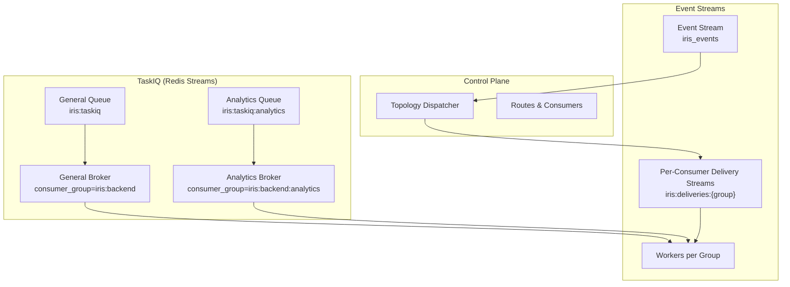

**Diagram sources**
- [broker.py:12-22](file://src/runtime/orchestration/broker.py#L12-L22)
- [worker.py:18-19](file://src/runtime/control_plane/worker.py#L18-L19)
- [worker.py:111-122](file://src/runtime/control_plane/worker.py#L111-L122)
- [types.py:12](file://src/runtime/streams/types.py#L12)

**Section sources**
- [broker.py:12-22](file://src/runtime/orchestration/broker.py#L12-L22)
- [base.py:21](file://src/core/settings/base.py#L21)
- [base.py:46-50](file://src/core/settings/base.py#L46-L50)

## Core Components
- TaskIQ brokers and queues:
  - General queue: iris:taskiq with consumer group iris:backend
  - Analytics queue: iris:taskiq:analytics with consumer group iris:backend:analytics
- Event streams:
  - Central event stream: iris_events
  - Per-consumer delivery streams: iris:deliveries:{group}
  - Worker groups enumerate supported event types and handlers
- Control plane dispatcher:
  - Evaluates routes and publishes to delivery streams with metadata

**Section sources**
- [broker.py:7-22](file://src/runtime/orchestration/broker.py#L7-L22)
- [types.py:12-48](file://src/runtime/streams/types.py#L12-L48)
- [router.py:17-55](file://src/runtime/streams/router.py#L17-L55)
- [worker.py:18-19](file://src/runtime/control_plane/worker.py#L18-L19)
- [worker.py:111-122](file://src/runtime/control_plane/worker.py#L111-L122)

## Architecture Overview
The system integrates three layers:
- TaskIQ (periodic/scheduled jobs) using Redis Streams
- Event streams (real-time analytics) with control-plane routing
- Workers consuming from either TaskIQ or delivery streams

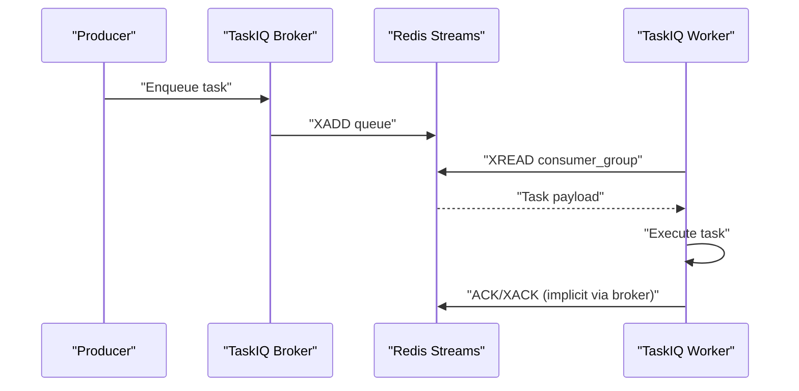

**Diagram sources**
- [broker.py:12-22](file://src/runtime/orchestration/broker.py#L12-L22)
- [tasks.py:213-235](file://src/apps/market_data/tasks.py#L213-L235)

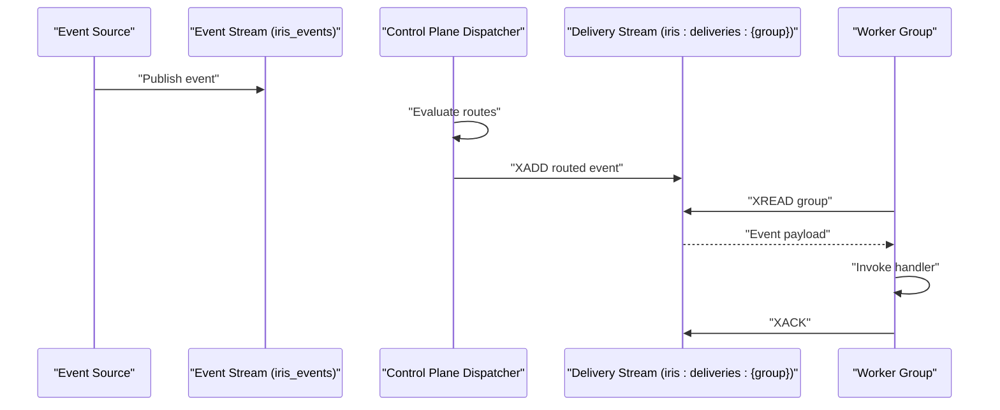

**Diagram sources**
- [types.py:12](file://src/runtime/streams/types.py#L12)
- [worker.py:78-105](file://src/runtime/control_plane/worker.py#L78-L105)
- [workers.py:423-501](file://src/runtime/streams/workers.py#L423-L501)

## Detailed Component Analysis

### TaskIQ Integration and Queues
- General queue: iris:taskiq with consumer group iris:backend
- Analytics queue: iris:taskiq:analytics with consumer group iris:backend:analytics
- Tasks decorated with broker.task are enqueued to the respective queues
- Locking via Redis task locks prevents overlapping runs

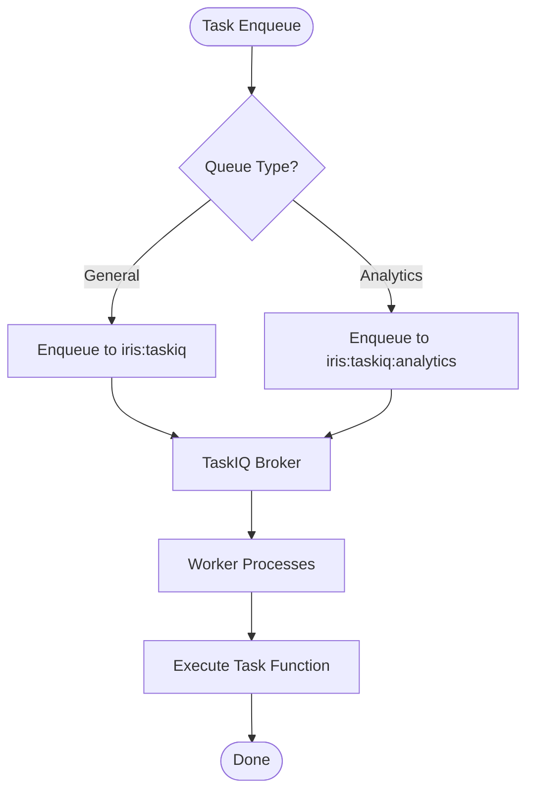

**Diagram sources**
- [broker.py:7-22](file://src/runtime/orchestration/broker.py#L7-L22)
- [tasks.py:213-235](file://src/apps/market_data/tasks.py#L213-L235)
- [anomaly_enrichment_tasks.py:16-87](file://src/apps/anomalies/tasks/anomaly_enrichment_tasks.py#L16-L87)

**Section sources**
- [broker.py:7-22](file://src/runtime/orchestration/broker.py#L7-L22)
- [tasks.py:213-235](file://src/apps/market_data/tasks.py#L213-L235)
- [anomaly_enrichment_tasks.py:16-87](file://src/apps/anomalies/tasks/anomaly_enrichment_tasks.py#L16-L87)

### Event Streams, Routing, and Delivery
- Central event stream: iris_events
- Control plane evaluates routes and publishes to per-consumer delivery streams
- Worker groups subscribe to delivery streams and process events

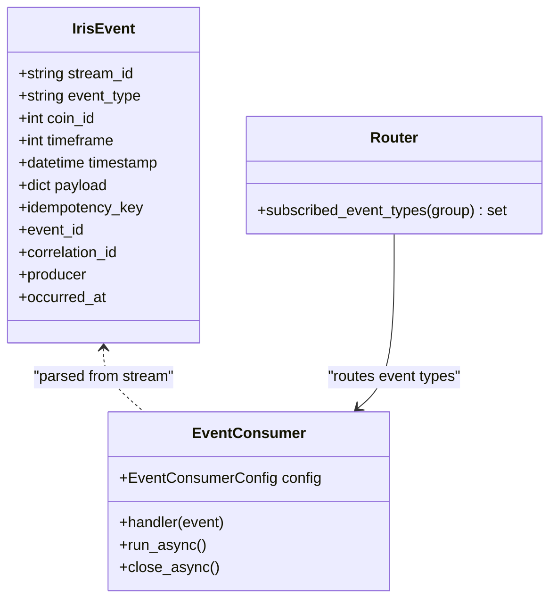

**Diagram sources**
- [types.py:51-103](file://src/runtime/streams/types.py#L51-L103)
- [consumer.py:49-68](file://src/runtime/streams/consumer.py#L49-L68)
- [router.py:58-63](file://src/runtime/streams/router.py#L58-L63)

**Section sources**
- [types.py:12-48](file://src/runtime/streams/types.py#L12-L48)
- [router.py:17-55](file://src/runtime/streams/router.py#L17-L55)
- [workers.py:423-501](file://src/runtime/streams/workers.py#L423-L501)

### Serialization and Deserialization
- Payload serialization uses compact JSON with sorted keys
- Event parsing reconstructs typed IrisEvent fields
- Delivery metadata augments events before routing

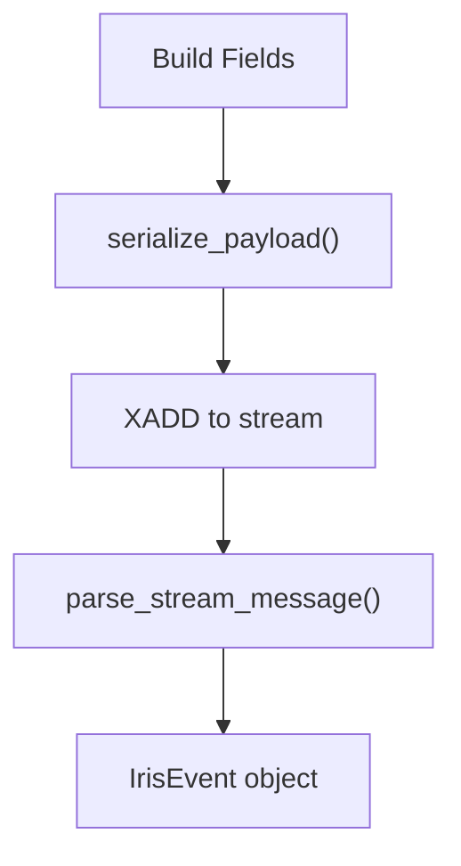

**Diagram sources**
- [types.py:125-153](file://src/runtime/streams/types.py#L125-L153)
- [types.py:156-164](file://src/runtime/streams/types.py#L156-L164)
- [worker.py:27-55](file://src/runtime/control_plane/worker.py#L27-L55)

**Section sources**
- [types.py:125-153](file://src/runtime/streams/types.py#L125-L153)
- [types.py:156-164](file://src/runtime/streams/types.py#L156-L164)
- [worker.py:27-55](file://src/runtime/control_plane/worker.py#L27-L55)

### Error Handling and Idempotency
- Event consumers acknowledge messages after successful handling
- Idempotency key derived from event type, identifiers, and serialized payload prevents duplicate processing
- Metrics recording tracks handler outcomes per route and consumer

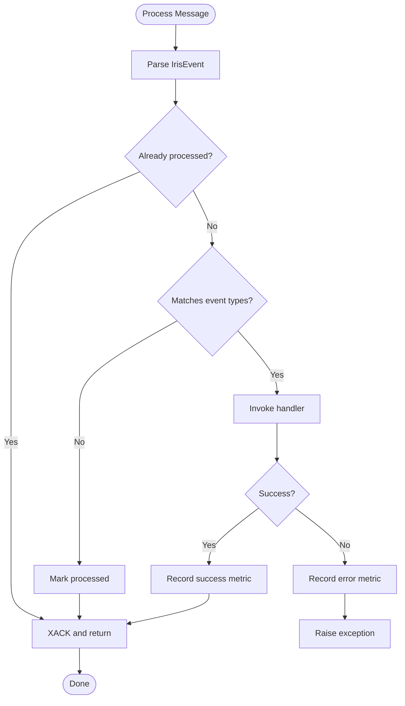

**Diagram sources**
- [consumer.py:144-170](file://src/runtime/streams/consumer.py#L144-L170)
- [consumer.py:69-95](file://src/runtime/streams/consumer.py#L69-L95)
- [types.py:61-65](file://src/runtime/streams/types.py#L61-L65)

**Section sources**
- [consumer.py:69-95](file://src/runtime/streams/consumer.py#L69-L95)
- [consumer.py:144-170](file://src/runtime/streams/consumer.py#L144-L170)
- [types.py:61-65](file://src/runtime/streams/types.py#L61-L65)

### Worker Creation and Handler Mapping
- Workers are created per group with appropriate handler functions
- Handlers publish downstream events and coordinate persistence via async unit of work

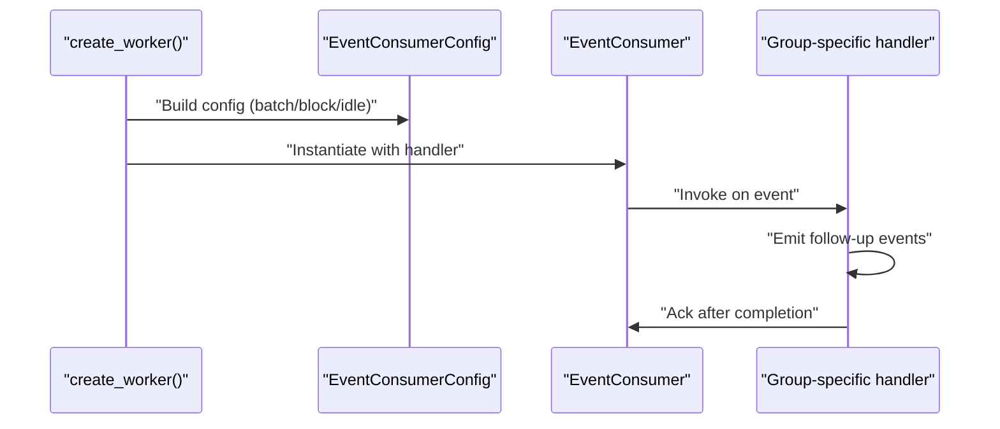

**Diagram sources**
- [workers.py:423-501](file://src/runtime/streams/workers.py#L423-L501)
- [workers.py:139-196](file://src/runtime/streams/workers.py#L139-L196)

**Section sources**
- [workers.py:423-501](file://src/runtime/streams/workers.py#L423-L501)
- [workers.py:139-196](file://src/runtime/streams/workers.py#L139-L196)

### Control Plane Routing and Throttling
- Topology dispatcher evaluates routes against event definitions and consumer compatibility
- Supports environment, scope, filters, throttling, and shadow delivery modes
- Publishes to delivery streams with metadata for observability

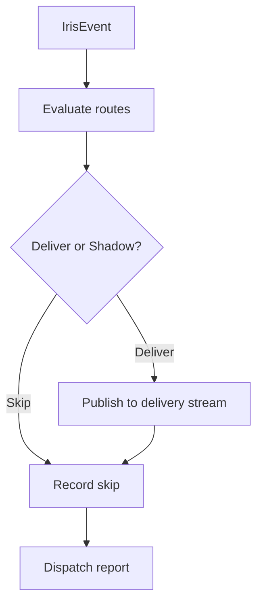

**Diagram sources**
- [dispatcher.py:119-191](file://src/runtime/control_plane/dispatcher.py#L119-L191)
- [dispatcher.py:280-297](file://src/runtime/control_plane/dispatcher.py#L280-L297)
- [worker.py:27-55](file://src/runtime/control_plane/worker.py#L27-L55)

**Section sources**
- [dispatcher.py:119-191](file://src/runtime/control_plane/dispatcher.py#L119-L191)
- [dispatcher.py:280-297](file://src/runtime/control_plane/dispatcher.py#L280-L297)
- [worker.py:27-55](file://src/runtime/control_plane/worker.py#L27-L55)

### Publisher and Consumer Patterns
- Synchronous publishers maintain internal queues and drain via background threads
- Asynchronous consumers use xreadgroup with blocking reads and stale claim loops
- Metrics recording and consumer name generation support operational visibility

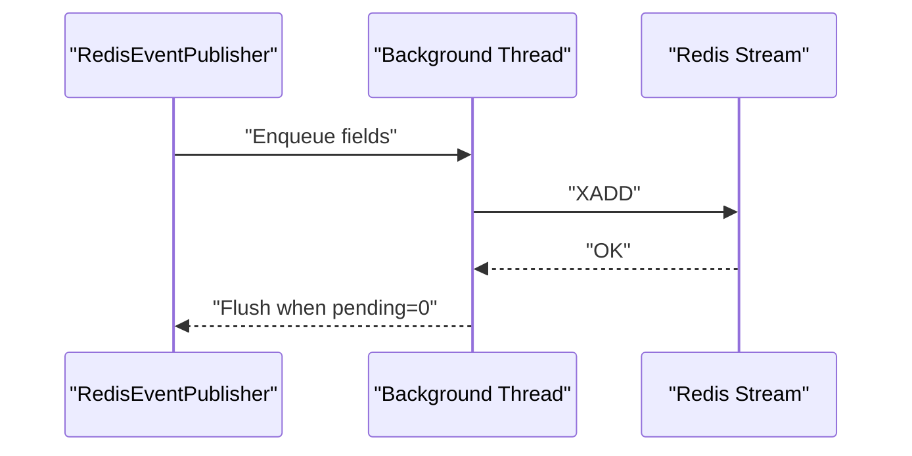

**Diagram sources**
- [publisher.py:22-74](file://src/runtime/streams/publisher.py#L22-L74)
- [consumer.py:190-217](file://src/runtime/streams/consumer.py#L190-L217)

**Section sources**
- [publisher.py:22-74](file://src/runtime/streams/publisher.py#L22-L74)
- [consumer.py:190-217](file://src/runtime/streams/consumer.py#L190-L217)

## Dependency Analysis
- TaskIQ tasks depend on Redis connectivity and broker configuration
- Event workers depend on settings for stream names and worker parameters
- Control plane depends on topology snapshots and route evaluation logic

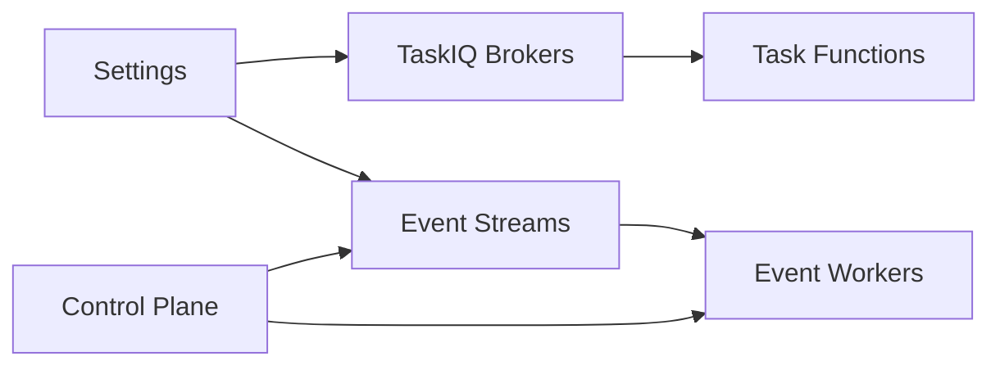

**Diagram sources**
- [base.py:21](file://src/core/settings/base.py#L21)
- [base.py:46-50](file://src/core/settings/base.py#L46-L50)
- [broker.py:12-22](file://src/runtime/orchestration/broker.py#L12-L22)
- [worker.py:111-122](file://src/runtime/control_plane/worker.py#L111-L122)

**Section sources**
- [base.py:21](file://src/core/settings/base.py#L21)
- [base.py:46-50](file://src/core/settings/base.py#L46-L50)
- [broker.py:12-22](file://src/runtime/orchestration/broker.py#L12-L22)
- [worker.py:111-122](file://src/runtime/control_plane/worker.py#L111-L122)

## Performance Considerations
- Batch sizing and blocking intervals:
  - Tune event_worker_batch_size and event_worker_block_milliseconds for throughput vs latency
- Pending idle threshold:
  - Adjust event_worker_pending_idle_milliseconds to reclaim stalled messages promptly
- Worker concurrency:
  - Scale worker processes per queue to match workload; monitor backlog growth
- Serialization overhead:
  - Keep payloads minimal; avoid large nested structures in payload
- Backpressure:
  - Use Redis stream limits and consumer group XCLAIM to manage redelivery
- Lock timeouts:
  - Set appropriate lock timeouts to prevent resource starvation during long-running tasks

[No sources needed since this section provides general guidance]

## Troubleshooting Guide
Common issues and remedies:
- Redis connectivity failures:
  - Verify REDIS_URL and connection retries in settings
- Consumer group errors:
  - NOGROUP errors indicate missing consumer groups; ensure group creation on startup
- Stalled messages:
  - Increase pending idle threshold or adjust batch size to reclaim stale claims
- Duplicate processing:
  - Confirm idempotency keys and processed markers are functioning
- Backlog growth:
  - Scale worker processes, reduce batch sizes, or increase block intervals
- Task lock contention:
  - Review lock keys and timeouts for long-running tasks

**Section sources**
- [base.py:69-70](file://src/core/settings/base.py#L69-L70)
- [consumer.py:72-83](file://src/runtime/streams/consumer.py#L72-L83)
- [consumer.py:97-115](file://src/runtime/streams/consumer.py#L97-L115)
- [consumer.py:190-217](file://src/runtime/streams/consumer.py#L190-L217)

## Conclusion
The system combines TaskIQ Redis Streams for general and analytics tasks with a control-plane-driven event routing mechanism over Redis Streams. It emphasizes idempotent processing, configurable batching, and robust error handling. Operators can tune worker parameters, enforce throttling, and leverage delivery streams to achieve scalable, observable task processing.

[No sources needed since this section summarizes without analyzing specific files]

## Appendices

### Queue and Worker Configuration Reference
- Event stream name: iris_events
- General TaskIQ queue: iris:taskiq with consumer group iris:backend
- Analytics TaskIQ queue: iris:taskiq:analytics with consumer group iris:backend:analytics
- Worker parameters:
  - event_worker_batch_size
  - event_worker_block_milliseconds
  - event_worker_pending_idle_milliseconds

**Section sources**
- [base.py:21](file://src/core/settings/base.py#L21)
- [base.py:46-50](file://src/core/settings/base.py#L46-L50)
- [broker.py:7-22](file://src/runtime/orchestration/broker.py#L7-L22)