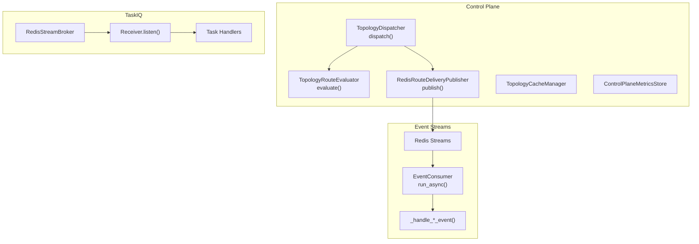
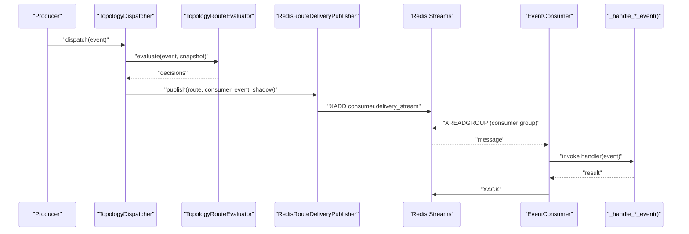
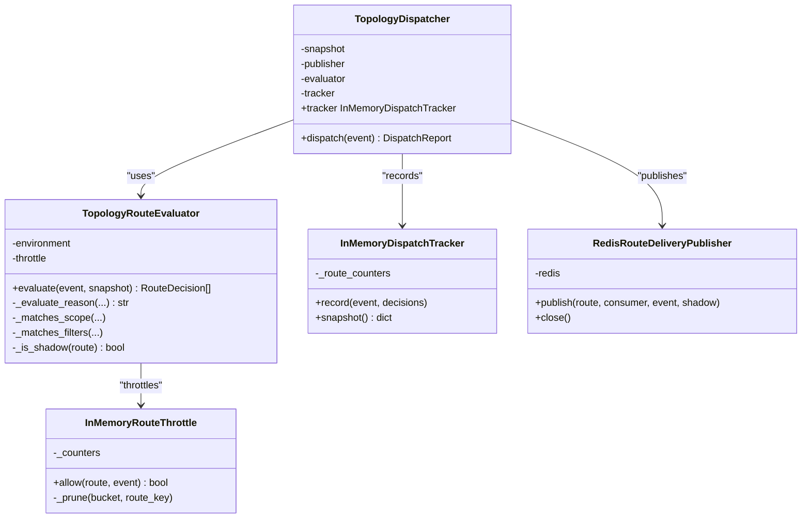
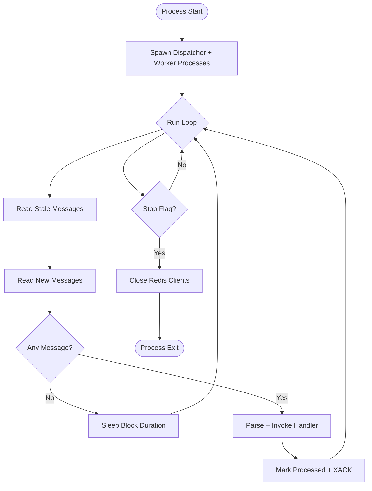
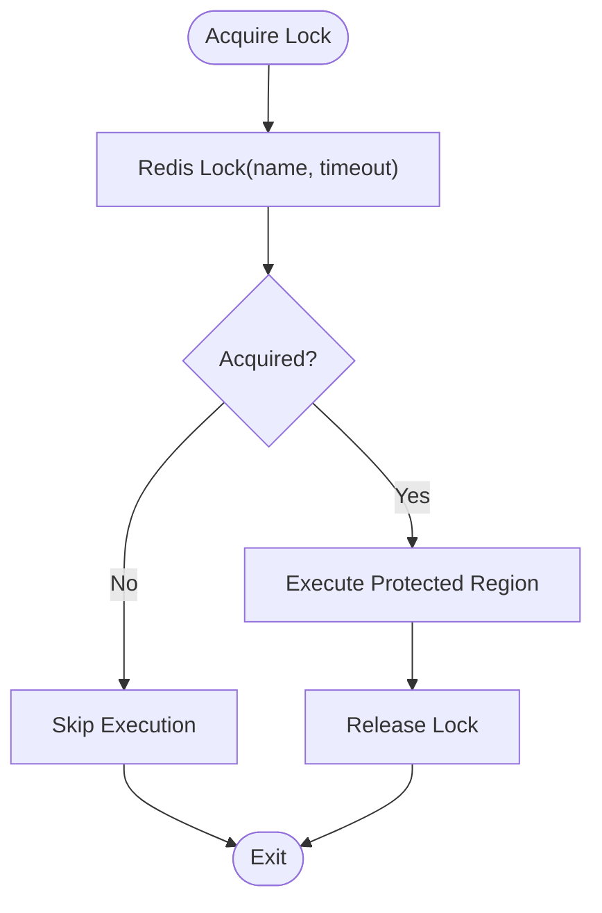
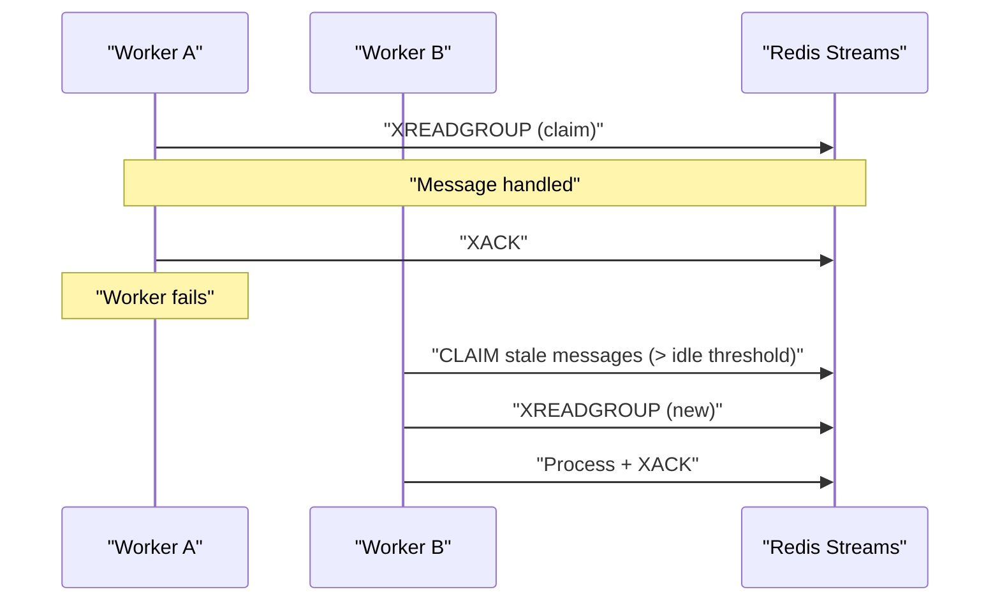
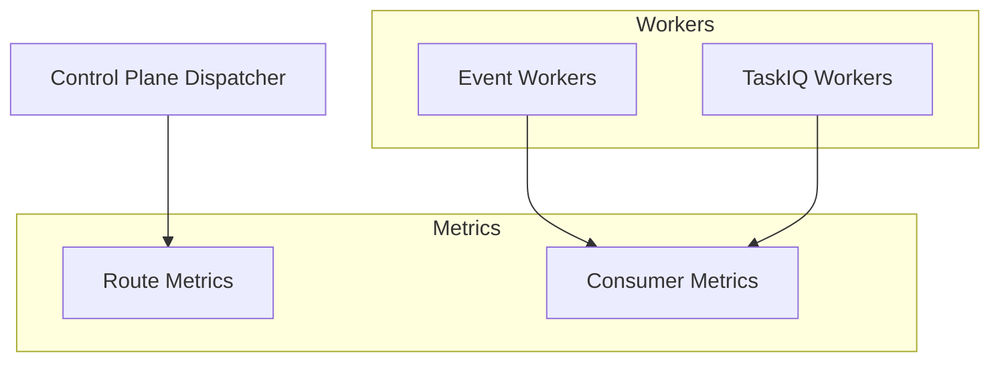
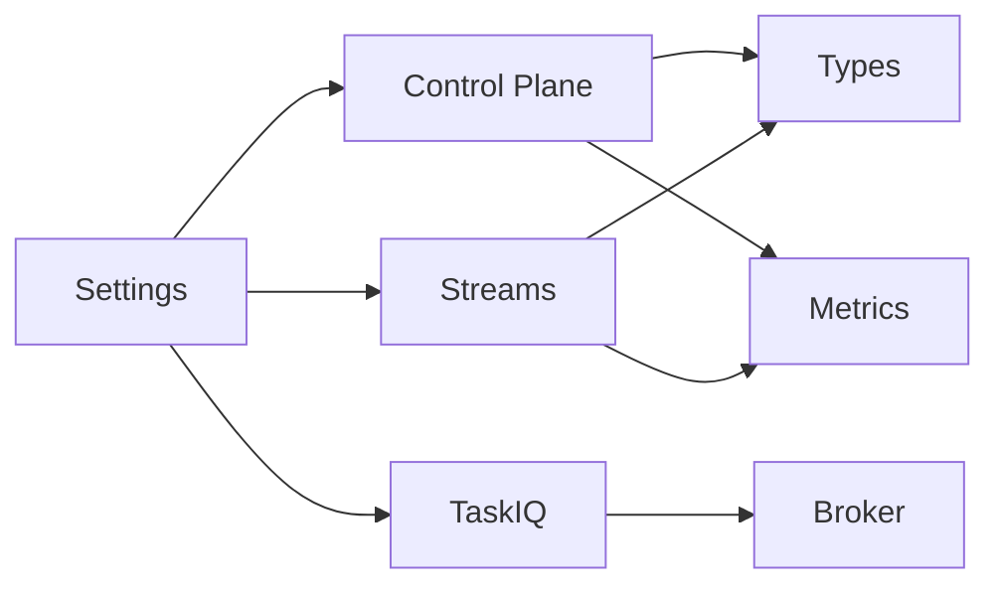

# Worker Coordination

<cite>
**Referenced Files in This Document**
- [dispatcher.py](file://src/runtime/control_plane/dispatcher.py)
- [worker.py](file://src/runtime/control_plane/worker.py)
- [metrics.py](file://src/apps/control_plane/metrics.py)
- [router.py](file://src/runtime/streams/router.py)
- [types.py](file://src/runtime/streams/types.py)
- [consumer.py](file://src/runtime/streams/consumer.py)
- [workers.py](file://src/runtime/streams/workers.py)
- [runner.py](file://src/runtime/streams/runner.py)
- [locks.py](file://src/runtime/orchestration/locks.py)
- [runner.py](file://src/runtime/orchestration/runner.py)
- [broker.py](file://src/runtime/orchestration/broker.py)
- [base.py](file://src/core/settings/base.py)
</cite>

## Table of Contents
1. [Introduction](#introduction)
2. [Project Structure](#project-structure)
3. [Core Components](#core-components)
4. [Architecture Overview](#architecture-overview)
5. [Detailed Component Analysis](#detailed-component-analysis)
6. [Dependency Analysis](#dependency-analysis)
7. [Performance Considerations](#performance-considerations)
8. [Troubleshooting Guide](#troubleshooting-guide)
9. [Conclusion](#conclusion)
10. [Appendices](#appendices)

## Introduction
This document explains worker coordination and process management across the runtime subsystems. It covers:
- Dispatcher architecture for routing events to workers
- Worker lifecycle management and graceful shutdown
- Resource allocation via Redis Streams consumer groups
- Distributed locking primitives for safe concurrency
- Leaderless scaling, load balancing, and health monitoring
- Failover handling for stalled messages
- Metrics collection and recovery mechanisms

## Project Structure
The worker coordination spans three primary areas:
- Control plane dispatcher: evaluates topology and publishes events to worker streams
- Stream workers: consume from per-group Redis Streams and execute domain handlers
- TaskIQ workers: asynchronous task execution with process-level scaling



**Diagram sources**
- [dispatcher.py:266-302](file://src/runtime/control_plane/dispatcher.py#L266-L302)
- [worker.py:61-109](file://src/runtime/control_plane/worker.py#L61-L109)
- [consumer.py:190-226](file://src/runtime/streams/consumer.py#L190-L226)
- [workers.py:423-501](file://src/runtime/streams/workers.py#L423-L501)
- [runner.py:57-78](file://src/runtime/orchestration/runner.py#L57-L78)
- [broker.py:12-22](file://src/runtime/orchestration/broker.py#L12-L22)

**Section sources**
- [dispatcher.py:266-302](file://src/runtime/control_plane/dispatcher.py#L266-L302)
- [worker.py:61-109](file://src/runtime/control_plane/worker.py#L61-L109)
- [consumer.py:190-226](file://src/runtime/streams/consumer.py#L190-L226)
- [workers.py:423-501](file://src/runtime/streams/workers.py#L423-L501)
- [runner.py:57-78](file://src/runtime/orchestration/runner.py#L57-L78)
- [broker.py:12-22](file://src/runtime/orchestration/broker.py#L12-L22)

## Core Components
- TopologyDispatcher: Evaluates event routes against topology and publishes matching events to worker streams
- TopologyRouteEvaluator: Applies environment, scope, filters, and throttling to decide delivery
- RedisRouteDeliveryPublisher: Publishes routed events to Redis Streams per consumer
- EventConsumer: Async consumer that reads from Redis Streams, handles idempotency, acks, and metrics
- Worker factories: Create per-group consumers and handlers for each event type
- ControlPlaneMetricsStore: Records route and consumer metrics in Redis
- TaskIQ broker and runner: Asynchronous task execution with process-level scaling

**Section sources**
- [dispatcher.py:114-191](file://src/runtime/control_plane/dispatcher.py#L114-L191)
- [dispatcher.py:266-302](file://src/runtime/control_plane/dispatcher.py#L266-L302)
- [worker.py:22-58](file://src/runtime/control_plane/worker.py#L22-L58)
- [consumer.py:49-86](file://src/runtime/streams/consumer.py#L49-L86)
- [workers.py:423-501](file://src/runtime/streams/workers.py#L423-L501)
- [metrics.py:29-97](file://src/apps/control_plane/metrics.py#L29-L97)
- [runner.py:57-78](file://src/runtime/orchestration/runner.py#L57-L78)

## Architecture Overview
The system uses Redis Streams as the backbone for event distribution:
- Control plane dispatcher evaluates routes and publishes to per-consumer streams
- Workers subscribe to group streams and process messages asynchronously
- TaskIQ workers run separate processes for asynchronous tasks
- Metrics are stored in Redis for observability



**Diagram sources**
- [dispatcher.py:280-297](file://src/runtime/control_plane/dispatcher.py#L280-L297)
- [dispatcher.py:119-160](file://src/runtime/control_plane/dispatcher.py#L119-L160)
- [worker.py:27-55](file://src/runtime/control_plane/worker.py#L27-L55)
- [consumer.py:117-170](file://src/runtime/streams/consumer.py#L117-L170)
- [workers.py:423-501](file://src/runtime/streams/workers.py#L423-L501)

## Detailed Component Analysis

### Dispatcher Architecture
- TopologyDispatcher orchestrates evaluation and publishing:
  - Uses TopologyRouteEvaluator to compute RouteDecision tuples
  - Publishes only deliverable events to Redis Streams
  - Tracks counts via InMemoryDispatchTracker
- TopologyRouteEvaluator applies:
  - Environment and scope matching (global/domain/symbol/exchange/timeframe/environment)
  - Filters (symbol, timeframe, exchange, confidence, metadata)
  - Status checks (active, muted, paused, disabled, shadow)
  - Throttling via InMemoryRouteThrottle
- RedisRouteDeliveryPublisher serializes event payload and metadata, then XADD to the consumer’s delivery stream



**Diagram sources**
- [dispatcher.py:266-302](file://src/runtime/control_plane/dispatcher.py#L266-L302)
- [dispatcher.py:114-191](file://src/runtime/control_plane/dispatcher.py#L114-L191)
- [dispatcher.py:58-83](file://src/runtime/control_plane/dispatcher.py#L58-L83)
- [dispatcher.py:94-112](file://src/runtime/control_plane/dispatcher.py#L94-L112)
- [worker.py:22-58](file://src/runtime/control_plane/worker.py#L22-L58)

**Section sources**
- [dispatcher.py:114-191](file://src/runtime/control_plane/dispatcher.py#L114-L191)
- [dispatcher.py:266-302](file://src/runtime/control_plane/dispatcher.py#L266-L302)
- [worker.py:22-58](file://src/runtime/control_plane/worker.py#L22-L58)

### Worker Lifecycle Management and Graceful Shutdown
- EventConsumer:
  - Ensures consumer group exists, reads stale and new messages, invokes handler, marks processed, acknowledges
  - Supports idempotency via a processed key per event idempotency key
  - Emits metrics on success/failure and latency
- Worker factories:
  - create_worker builds EventConsumer with group-specific stream names and handlers
  - create_topology_dispatcher_consumer builds a consumer for the control plane dispatcher
- Runner:
  - Spawns processes for dispatcher and each worker group
  - Handles SIGTERM/SIGINT to stop cleanly
  - Stops processes gracefully with join/terminate fallback



**Diagram sources**
- [runner.py:50-71](file://src/runtime/streams/runner.py#L50-L71)
- [runner.py:18-31](file://src/runtime/streams/runner.py#L18-L31)
- [consumer.py:190-226](file://src/runtime/streams/consumer.py#L190-L226)

**Section sources**
- [consumer.py:49-86](file://src/runtime/streams/consumer.py#L49-L86)
- [consumer.py:190-226](file://src/runtime/streams/consumer.py#L190-L226)
- [workers.py:423-501](file://src/runtime/streams/workers.py#L423-L501)
- [runner.py:50-71](file://src/runtime/streams/runner.py#L50-L71)

### Resource Allocation Strategies and Load Balancing
- Per-group Redis consumer groups:
  - Each worker group has a dedicated stream name derived from the group
  - Consumers within a group share workload via Redis Streams’ built-in distribution
- Batch and blocking reads:
  - Configurable batch size and block duration balance throughput and latency
- TaskIQ worker groups:
  - Separate brokers for general and analytics queues
  - Process-level scaling controlled by settings

```mermaid
graph LR
G1["Group A Stream"] < --> C1["Consumer A1"]
G1 < --> C2["Consumer A2"]
G1 < --> C3["Consumer A3"]
G2["Group B Stream"] < --> D1["Consumer B1"]
G2 < --> D2["Consumer B2"]
```

**Diagram sources**
- [types.py:12-48](file://src/runtime/streams/types.py#L12-L48)
- [workers.py:423-501](file://src/runtime/streams/workers.py#L423-L501)
- [runner.py:21-24](file://src/runtime/orchestration/runner.py#L21-L24)
- [broker.py:12-22](file://src/runtime/orchestration/broker.py#L12-L22)

**Section sources**
- [types.py:12-48](file://src/runtime/streams/types.py#L12-L48)
- [workers.py:423-501](file://src/runtime/streams/workers.py#L423-L501)
- [runner.py:21-24](file://src/runtime/orchestration/runner.py#L21-L24)
- [broker.py:12-22](file://src/runtime/orchestration/broker.py#L12-L22)

### Distributed Locking Mechanisms
- async_redis_task_lock:
  - Acquires a Redis-based lock by name with timeout
  - Returns whether acquisition succeeded; ensures release in finally
- Redis client lifecycle:
  - get_async_lock_redis caches a client bound to the current event loop
  - wait_for_redis pings Redis with retries for startup readiness



**Diagram sources**
- [locks.py:30-51](file://src/runtime/orchestration/locks.py#L30-L51)
- [locks.py:18-27](file://src/runtime/orchestration/locks.py#L18-L27)

**Section sources**
- [locks.py:30-51](file://src/runtime/orchestration/locks.py#L30-L51)
- [locks.py:18-27](file://src/runtime/orchestration/locks.py#L18-L27)

### Leader Election and Failover Handling
- Leaderless scaling:
  - No central leader; workers are independent processes consuming from shared streams
- Failover via Redis Streams:
  - Pending idle messages are reclaimed by xautoclaim after a threshold
  - EventConsumer automatically claims stale messages and re-processes them
- Idempotency:
  - Processed keys prevent duplicate handling across restarts or failures



**Diagram sources**
- [consumer.py:97-115](file://src/runtime/streams/consumer.py#L97-L115)
- [consumer.py:144-170](file://src/runtime/streams/consumer.py#L144-L170)

**Section sources**
- [consumer.py:97-115](file://src/runtime/streams/consumer.py#L97-L115)
- [consumer.py:144-170](file://src/runtime/streams/consumer.py#L144-L170)

### Worker Scaling and Health Monitoring
- Scaling:
  - Event workers: per-group processes spawned at startup
  - TaskIQ workers: configurable process counts per group
- Health monitoring:
  - ControlPlaneMetricsStore records route and consumer metrics (counts, latencies, errors)
  - Redis-based counters enable real-time dashboards and alerts



**Diagram sources**
- [metrics.py:29-97](file://src/apps/control_plane/metrics.py#L29-L97)
- [runner.py:21-24](file://src/runtime/orchestration/runner.py#L21-L24)
- [runner.py:50-71](file://src/runtime/streams/runner.py#L50-L71)

**Section sources**
- [metrics.py:29-97](file://src/apps/control_plane/metrics.py#L29-L97)
- [runner.py:21-24](file://src/runtime/orchestration/runner.py#L21-L24)
- [runner.py:50-71](file://src/runtime/streams/runner.py#L50-L71)

### Graceful Shutdown Procedures and Recovery
- Graceful shutdown:
  - Process receives SIGTERM/SIGINT, sets stop flag, waits for loop exit, closes Redis connections
- Recovery:
  - Stale message reclamation via xautoclaim ensures no work loss during outages
  - Idempotency keys prevent duplicate processing

**Section sources**
- [runner.py:18-31](file://src/runtime/streams/runner.py#L18-L31)
- [consumer.py:97-115](file://src/runtime/streams/consumer.py#L97-L115)
- [consumer.py:69-95](file://src/runtime/streams/consumer.py#L69-L95)

## Dependency Analysis
Key dependencies and relationships:
- Control plane depends on topology cache and metrics stores
- Workers depend on Redis Streams and per-group handler factories
- TaskIQ workers depend on RedisStreamBroker and Receiver
- All components depend on settings for Redis URLs and tuning parameters



**Diagram sources**
- [base.py:87-90](file://src/core/settings/base.py#L87-L90)
- [worker.py:70-76](file://src/runtime/control_plane/worker.py#L70-L76)
- [consumer.py:60-67](file://src/runtime/streams/consumer.py#L60-L67)
- [runner.py:57-61](file://src/runtime/orchestration/runner.py#L57-L61)
- [broker.py:12-22](file://src/runtime/orchestration/broker.py#L12-L22)

**Section sources**
- [base.py:87-90](file://src/core/settings/base.py#L87-L90)
- [worker.py:70-76](file://src/runtime/control_plane/worker.py#L70-L76)
- [consumer.py:60-67](file://src/runtime/streams/consumer.py#L60-L67)
- [runner.py:57-61](file://src/runtime/orchestration/runner.py#L57-L61)
- [broker.py:12-22](file://src/runtime/orchestration/broker.py#L12-L22)

## Performance Considerations
- Throughput vs. latency:
  - Increase batch_size for higher throughput; tune block_milliseconds to reduce polling overhead
- Consumer group distribution:
  - Add more worker processes per group to scale horizontally
- Throttling:
  - Use route-level throttling to protect downstream systems under load
- Idempotency overhead:
  - Processed key existence checks are O(1); minimal impact on hot paths
- TaskIQ backoff and quarantine:
  - Configure failure backoff and quarantine thresholds to stabilize flaky tasks

[No sources needed since this section provides general guidance]

## Troubleshooting Guide
Common issues and remedies:
- Redis connectivity problems:
  - Use wait_for_redis during startup to retry until Redis is reachable
- Consumer group errors:
  - NOGROUP errors are handled by ensuring group creation; verify stream names and group names
- Stalled messages:
  - Confirm pending_idle_milliseconds is set appropriately; check xautoclaim behavior
- Duplicate processing:
  - Verify idempotency_key correctness and processed key TTL
- Metrics not updating:
  - Ensure ControlPlaneMetricsStore is initialized and Redis is reachable

**Section sources**
- [locks.py:67-79](file://src/runtime/orchestration/locks.py#L67-L79)
- [consumer.py:72-82](file://src/runtime/streams/consumer.py#L72-L82)
- [consumer.py:97-115](file://src/runtime/streams/consumer.py#L97-L115)
- [consumer.py:144-170](file://src/runtime/streams/consumer.py#L144-L170)
- [metrics.py:29-97](file://src/apps/control_plane/metrics.py#L29-L97)

## Conclusion
The worker coordination system leverages Redis Streams for scalable, leaderless event distribution, with robust idempotency, failover, and metrics. Control plane routing and worker lifecycle management are decoupled, enabling independent scaling of control plane and worker processes. Distributed locking and settings-driven configuration support safe operation across environments.

## Appendices

### Appendix A: Worker Groups and Subscribed Event Types
- Event worker groups and their subscribed event types are defined centrally and used by worker factories and routers.

**Section sources**
- [router.py:17-55](file://src/runtime/streams/router.py#L17-L55)
- [types.py:28-48](file://src/runtime/streams/types.py#L28-L48)

### Appendix B: Settings Impacting Worker Behavior
- Tunable settings include Redis URLs, stream names, batch sizes, block durations, and worker process counts.

**Section sources**
- [base.py:17-21](file://src/core/settings/base.py#L17-L21)
- [base.py:46-50](file://src/core/settings/base.py#L46-L50)
- [base.py:67-70](file://src/core/settings/base.py#L67-L70)