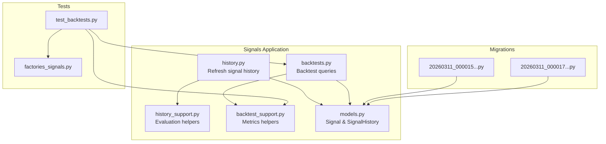
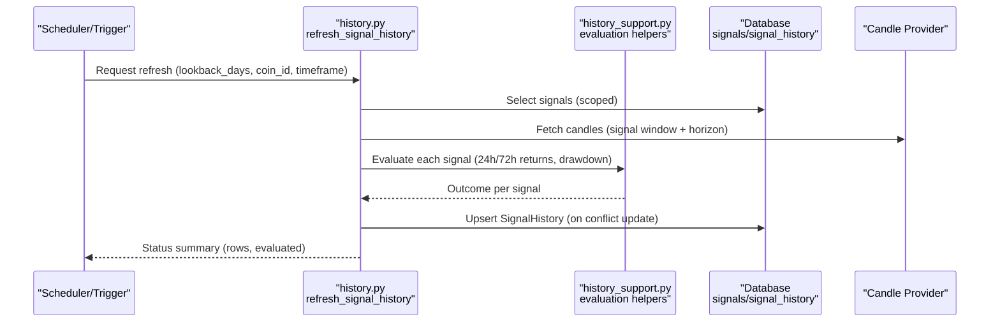
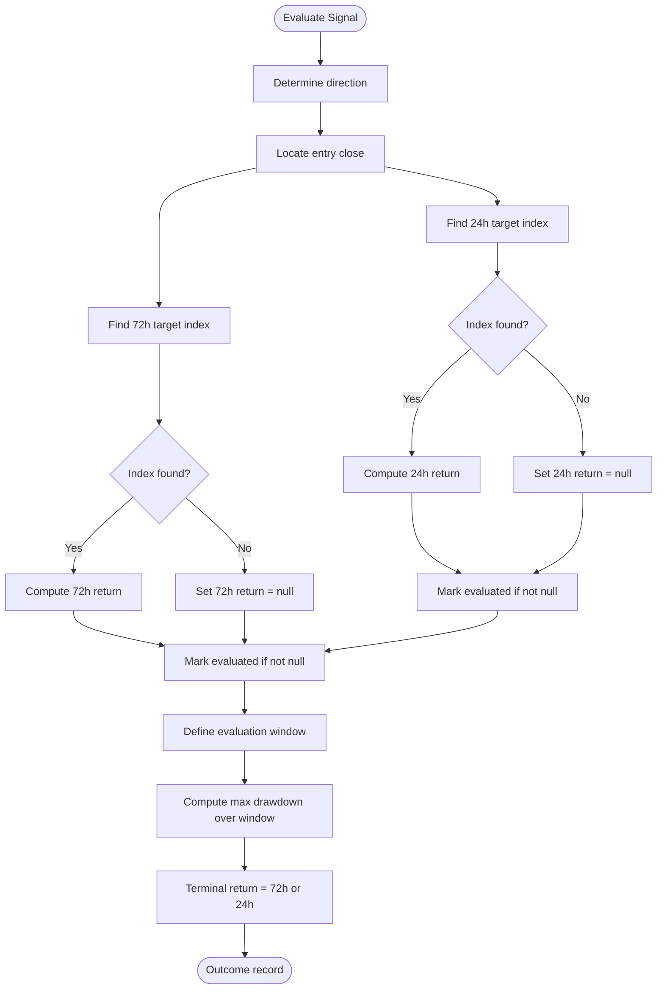
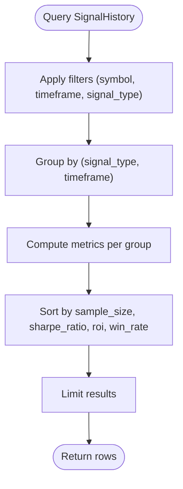
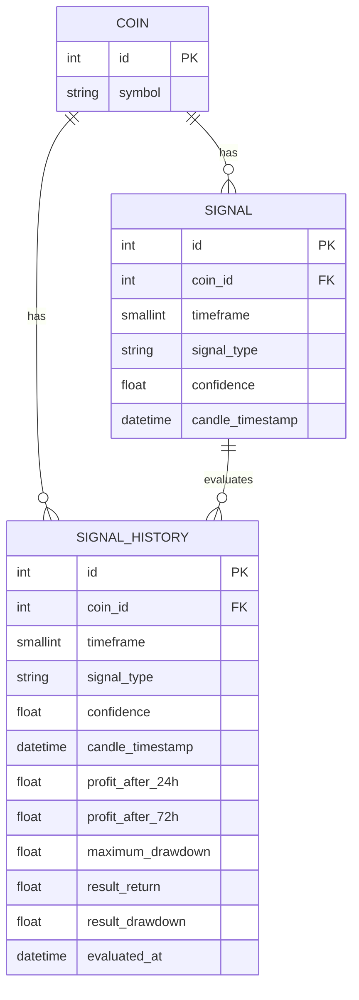
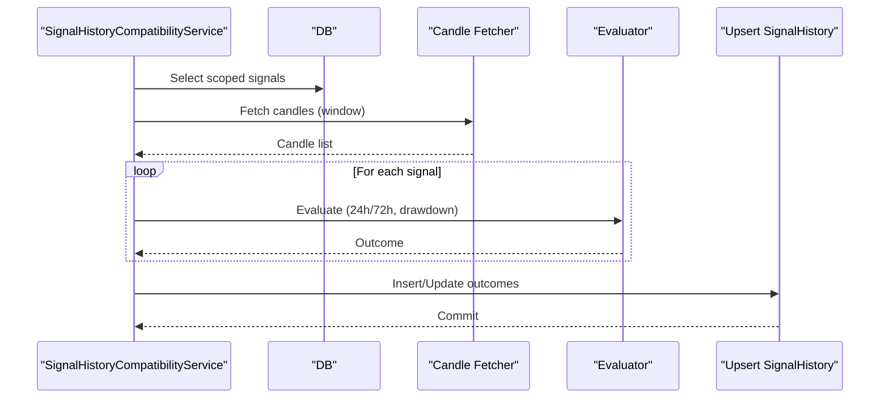
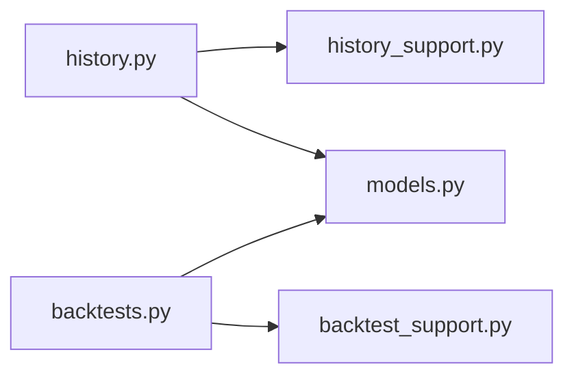

# Backtesting Framework

<cite>
**Referenced Files in This Document**
- [backtests.py](file://src/apps/signals/backtests.py)
- [backtest_support.py](file://src/apps/signals/backtest_support.py)
- [history.py](file://src/apps/signals/history.py)
- [history_support.py](file://src/apps/signals/history_support.py)
- [models.py](file://src/apps/signals/models.py)
- [test_backtests.py](file://tests/apps/signals/test_backtests.py)
- [factories_signals.py](file://tests/factories/signals.py)
- [20260311_000015_data_architecture_foundation.py](file://src/migrations/versions/20260311_000015_data_architecture_foundation.py)
- [20260311_000017_pattern_success_engine.py](file://src/migrations/versions/20260311_000017_pattern_success_engine.py)
</cite>

## Table of Contents
1. [Introduction](#introduction)
2. [Project Structure](#project-structure)
3. [Core Components](#core-components)
4. [Architecture Overview](#architecture-overview)
5. [Detailed Component Analysis](#detailed-component-analysis)
6. [Dependency Analysis](#dependency-analysis)
7. [Performance Considerations](#performance-considerations)
8. [Troubleshooting Guide](#troubleshooting-guide)
9. [Conclusion](#conclusion)
10. [Appendices](#appendices)

## Introduction
This document describes the backtesting framework for evaluating trading signals historically. It covers how historical outcomes are computed for two horizons (24h and 72h), how performance metrics are aggregated, and how results are benchmarked across signal types and timeframes. It also documents the data preparation pipeline, simulation logic, and integration with signal history storage. Practical workflows, parameter optimization techniques, and result interpretation guidelines are included to help analysts and engineers deploy reliable backtests.

## Project Structure
The backtesting capability is centered in the signals application with supporting modules for evaluation, history maintenance, and models. The key files are:
- Evaluation and serialization helpers: backtest_support.py
- Backtest queries and grouping: backtests.py
- Signal history refresh and outcome computation: history.py and history_support.py
- Domain models: models.py
- Tests and factories validating behavior: test_backtests.py and factories_signals.py
- Database migrations establishing schema: migration files

**Diagram sources**
- [history.py:1-270](file://src/apps/signals/history.py#L1-L270)
- [history_support.py:1-149](file://src/apps/signals/history_support.py#L1-L149)
- [backtests.py:1-271](file://src/apps/signals/backtests.py#L1-L271)
- [backtest_support.py:1-70](file://src/apps/signals/backtest_support.py#L1-L70)
- [models.py:1-237](file://src/apps/signals/models.py#L1-L237)
- [test_backtests.py:1-136](file://tests/apps/signals/test_backtests.py#L1-L136)
- [factories_signals.py:1-39](file://tests/factories/signals.py#L1-L39)
- [20260311_000015_data_architecture_foundation.py:1-132](file://src/migrations/versions/20260311_000015_data_architecture_foundation.py#L1-L132)
- [20260311_000017_pattern_success_engine.py:1-48](file://src/migrations/versions/20260311_000017_pattern_success_engine.py#L1-L48)

**Section sources**
- [backtests.py:1-271](file://src/apps/signals/backtests.py#L1-L271)
- [backtest_support.py:1-70](file://src/apps/signals/backtest_support.py#L1-L70)
- [history.py:1-270](file://src/apps/signals/history.py#L1-L270)
- [history_support.py:1-149](file://src/apps/signals/history_support.py#L1-L149)
- [models.py:1-237](file://src/apps/signals/models.py#L1-L237)
- [test_backtests.py:1-136](file://tests/apps/signals/test_backtests.py#L1-L136)
- [factories_signals.py:1-39](file://tests/factories/signals.py#L1-L39)
- [20260311_000015_data_architecture_foundation.py:1-132](file://src/migrations/versions/20260311_000015_data_architecture_foundation.py#L1-L132)
- [20260311_000017_pattern_success_engine.py:1-48](file://src/migrations/versions/20260311_000017_pattern_success_engine.py#L1-L48)

## Core Components
- Historical outcome computation:
  - Computes 24h and 72h returns per signal, maximum drawdown over the evaluation window, and terminal return used for aggregation.
  - Uses signal direction derived from signal type semantics and confidence fallback.
- Metrics aggregation:
  - Win rate, ROI, average return, Sharpe ratio, maximum drawdown, average confidence, and last evaluated timestamp.
- Backtest queries:
  - Filters and groups historical outcomes by signal type and timeframe, sorts by ranking keys, and supports top lists and coin-scoped queries.
- Data model:
  - Stores per-signal results, including returns, drawdowns, and evaluation timestamps.

Key metric definitions:
- Win rate: fraction of positive returns in the sample.
- ROI: sum of result_return across all samples.
- Average return: mean of result_return.
- Sharpe ratio: mean excess return divided by standard deviation (computed via helper).
- Maximum drawdown: minimum observed drawdown across the evaluation window.

**Section sources**
- [history_support.py:34-132](file://src/apps/signals/history_support.py#L34-L132)
- [backtest_support.py:34-61](file://src/apps/signals/backtest_support.py#L34-L61)
- [models.py:52-80](file://src/apps/signals/models.py#L52-L80)

## Architecture Overview
The backtesting pipeline consists of three stages:
1. Data preparation: collect recent or scoped signals and fetch candle series covering the evaluation window.
2. Simulation environment: compute 24h/72h returns, maximum drawdown, and terminal return for each signal.
3. Result aggregation: group by signal_type and timeframe, compute metrics, and rank results.

**Diagram sources**
- [history.py:82-186](file://src/apps/signals/history.py#L82-L186)
- [history_support.py:90-132](file://src/apps/signals/history_support.py#L90-L132)
- [models.py:52-80](file://src/apps/signals/models.py#L52-L80)

## Detailed Component Analysis

### Historical Outcome Computation
- Signal direction:
  - Determined by semantic slug and bias, with a numeric fallback based on confidence.
- Return calculation:
  - Direction-aware percentage change from entry to target timestamps (24h or 72h).
- Drawdown calculation:
  - Minimum observed adverse movement over the evaluation window.
- Terminal return:
  - Uses 72h return if available; otherwise falls back to 24h.

**Diagram sources**
- [history_support.py:90-132](file://src/apps/signals/history_support.py#L90-L132)
- [history_support.py:44-87](file://src/apps/signals/history_support.py#L44-L87)

**Section sources**
- [history_support.py:34-132](file://src/apps/signals/history_support.py#L34-L132)

### Metrics Aggregation and Ranking
- Grouping:
  - Results are grouped by (signal_type, timeframe) and optionally filtered by symbol and timeframe.
- Aggregation:
  - Sample size, coin count, win rate, ROI, average return, Sharpe ratio, maximum drawdown, average confidence, and last evaluated timestamp.
- Sorting:
  - Backtests are ranked by sample size, Sharpe ratio, ROI, and win rate; top lists are derived from broader rankings.

**Diagram sources**
- [backtests.py:92-170](file://src/apps/signals/backtests.py#L92-L170)
- [backtest_support.py:34-61](file://src/apps/signals/backtest_support.py#L34-L61)

**Section sources**
- [backtests.py:92-170](file://src/apps/signals/backtests.py#L92-L170)
- [backtest_support.py:34-61](file://src/apps/signals/backtest_support.py#L34-L61)

### Data Model and Storage
- SignalHistory captures per-signal evaluation results with unique constraints on (coin_id, timeframe, signal_type, candle_timestamp).
- Additional columns were introduced in later migrations to include 24h/72h returns and maximum drawdown.

**Diagram sources**
- [models.py:15-80](file://src/apps/signals/models.py#L15-L80)
- [20260311_000015_data_architecture_foundation.py:59-86](file://src/migrations/versions/20260311_000015_data_architecture_foundation.py#L59-L86)
- [20260311_000017_pattern_success_engine.py:20-27](file://src/migrations/versions/20260311_000017_pattern_success_engine.py#L20-L27)

**Section sources**
- [models.py:15-80](file://src/apps/signals/models.py#L15-L80)
- [20260311_000015_data_architecture_foundation.py:59-86](file://src/migrations/versions/20260311_000015_data_architecture_foundation.py#L59-L86)
- [20260311_000017_pattern_success_engine.py:20-27](file://src/migrations/versions/20260311_000017_pattern_success_engine.py#L20-L27)

### Backtesting Pipeline Orchestration
- Refresh process:
  - Scopes signals by coin/timeframe and fetches candles extending up to 72h past the latest signal plus one timeframe delta.
  - Evaluates each signal and upserts results into SignalHistory.
- Recent refresh:
  - Limits the number of recent signals per coin/timeframe to reduce cost while maintaining recency.

**Diagram sources**
- [history.py:82-186](file://src/apps/signals/history.py#L82-L186)
- [history_support.py:90-132](file://src/apps/signals/history_support.py#L90-L132)

**Section sources**
- [history.py:82-186](file://src/apps/signals/history.py#L82-L186)

## Dependency Analysis
- Modules:
  - history.py depends on history_support.py for evaluation logic and on models.py for SignalHistory schema.
  - backtests.py depends on backtest_support.py for metrics and on models.py for SignalHistory.
- External dependencies:
  - SQL operations via SQLAlchemy ORM and candle provider utilities for timestamp alignment and window indexing.

**Diagram sources**
- [history.py:1-270](file://src/apps/signals/history.py#L1-L270)
- [history_support.py:1-149](file://src/apps/signals/history_support.py#L1-L149)
- [backtests.py:1-271](file://src/apps/signals/backtests.py#L1-L271)
- [backtest_support.py:1-70](file://src/apps/signals/backtest_support.py#L1-L70)
- [models.py:1-237](file://src/apps/signals/models.py#L1-L237)

**Section sources**
- [history.py:1-270](file://src/apps/signals/history.py#L1-L270)
- [backtests.py:1-271](file://src/apps/signals/backtests.py#L1-L271)

## Performance Considerations
- Indexing:
  - Ensure indexes on coin_id/timeframe/candle_timestamp and signal_type/coin_id to accelerate filtering and grouping.
- Batch sizing:
  - Use limit_per_scope to constrain recent evaluations and reduce memory pressure.
- Conflict handling:
  - Upsert avoids redundant writes; tune batch sizes to balance throughput and transaction overhead.
- Timeframe windows:
  - Evaluation windows extend 72h past the signal; ensure candle data availability to avoid null outcomes.

[No sources needed since this section provides general guidance]

## Troubleshooting Guide
Common issues and remedies:
- Missing candles:
  - If no candles are returned for a window, outcomes will be null; verify candle ingestion and timeframe alignment.
- No signals selected:
  - Adjust lookback_days or scope filters; confirm signal creation and timestamps.
- Null returns/drawdowns:
  - Indicates evaluation could not locate target timestamps; check signal timestamps and candle close alignment.
- Empty groups:
  - Serialization returns zeros for empty groups; confirm filters and sample coverage.

Validation references:
- Helper behaviors validated in tests (clamping, Sharpe edge cases, empty groups).
- Query grouping and sorting validated with synthetic SignalHistory entries.

**Section sources**
- [test_backtests.py:14-38](file://tests/apps/signals/test_backtests.py#L14-L38)
- [test_backtests.py:40-135](file://tests/apps/signals/test_backtests.py#L40-L135)

## Conclusion
The backtesting framework integrates signal evaluation with robust metrics aggregation. It supports multi-timeframe and multi-signal-type comparisons, computes Sharpe ratios and drawdowns, and exposes top-ranked configurations. By maintaining SignalHistory with 24h/72h outcomes and maximum drawdown, teams can benchmark strategies under different market regimes and optimize parameters with confidence.

[No sources needed since this section summarizes without analyzing specific files]

## Appendices

### Practical Backtesting Workflows
- Full history refresh:
  - Scope by coin_id and timeframe; set lookback_days to desired horizon; commit results.
- Recent refresh:
  - Limit recent signals per scope to keep results fresh and cost-controlled.
- Benchmarking:
  - List top backtests by timeframe and filter by signal_type to compare strategies.
- Interpretation guidelines:
  - Prefer higher Sharpe ratio and win rate with manageable drawdowns; consider sample size and coin diversity.

**Section sources**
- [history.py:204-230](file://src/apps/signals/history.py#L204-L230)
- [history.py:188-201](file://src/apps/signals/history.py#L188-L201)
- [backtests.py:210-257](file://src/apps/signals/backtests.py#L210-L257)

### Parameter Optimization Techniques
- Grid search:
  - Sweep confidence thresholds and timeframe deltas; rank by Sharpe ratio and ROI.
- Walk-forward:
  - Split history into in-sample and out-of-sample periods; retrain and evaluate periodically.
- Bootstrap:
  - Resample groups to estimate distribution of Sharpe ratio and assess significance.

[No sources needed since this section provides general guidance]

### Statistical Significance Testing
- Sharpe ratio:
  - Use the Sharpe ratio helper to quantify risk-adjusted returns; interpret relative differences across strategies.
- Drawdown analysis:
  - Monitor maximum drawdown and average drawdown to assess tail risk exposure.
- Significance:
  - Apply bootstrapping or permutation tests on group returns to estimate confidence intervals.

**Section sources**
- [backtest_support.py:24-31](file://src/apps/signals/backtest_support.py#L24-L31)
- [backtest_support.py:34-61](file://src/apps/signals/backtest_support.py#L34-L61)