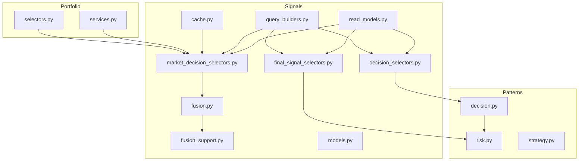
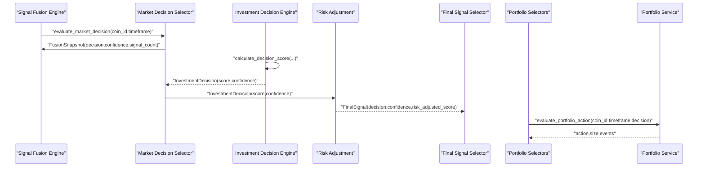
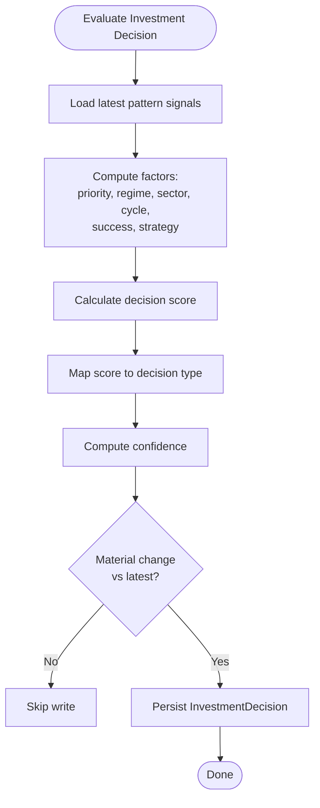
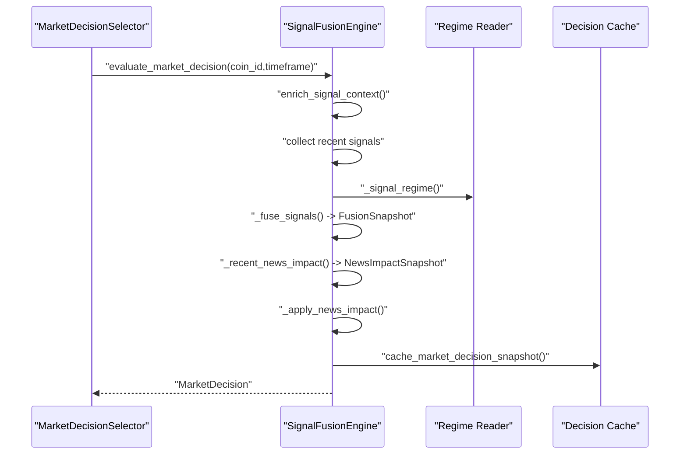
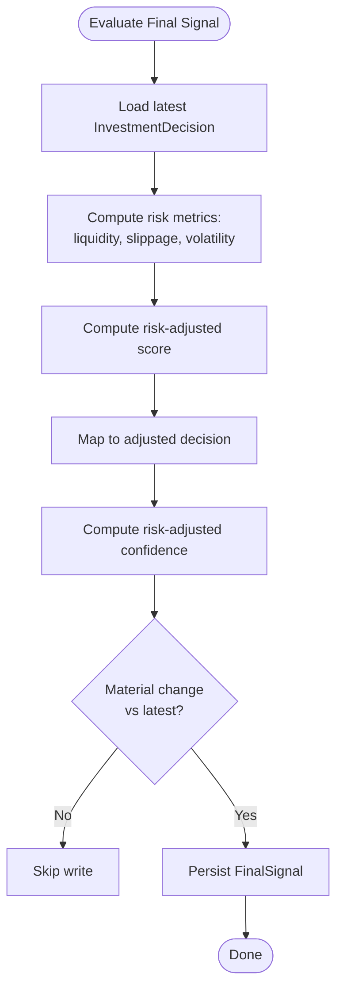
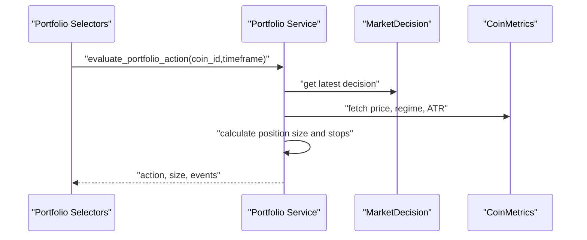
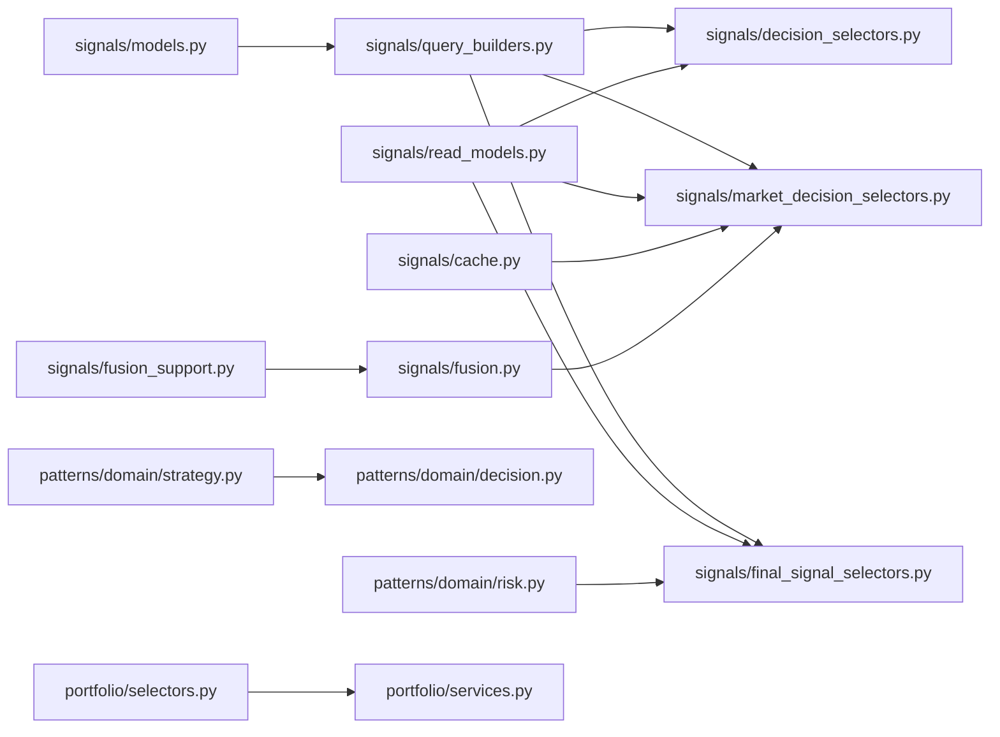

# Decision Selectors

<cite>
**Referenced Files in This Document**
- [decision_selectors.py](file://src/apps/signals/decision_selectors.py)
- [market_decision_selectors.py](file://src/apps/signals/market_decision_selectors.py)
- [final_signal_selectors.py](file://src/apps/signals/final_signal_selectors.py)
- [fusion.py](file://src/apps/signals/fusion.py)
- [fusion_support.py](file://src/apps/signals/fusion_support.py)
- [cache.py](file://src/apps/signals/cache.py)
- [query_builders.py](file://src/apps/signals/query_builders.py)
- [read_models.py](file://src/apps/signals/read_models.py)
- [models.py](file://src/apps/signals/models.py)
- [selectors.py](file://src/apps/portfolio/selectors.py)
- [services.py](file://src/apps/portfolio/services.py)
- [decision.py](file://src/apps/patterns/domain/decision.py)
- [risk.py](file://src/apps/patterns/domain/risk.py)
- [strategy.py](file://src/apps/patterns/domain/strategy.py)
</cite>

## Table of Contents
1. [Introduction](#introduction)
2. [Project Structure](#project-structure)
3. [Core Components](#core-components)
4. [Architecture Overview](#architecture-overview)
5. [Detailed Component Analysis](#detailed-component-analysis)
6. [Dependency Analysis](#dependency-analysis)
7. [Performance Considerations](#performance-considerations)
8. [Troubleshooting Guide](#troubleshooting-guide)
9. [Conclusion](#conclusion)
10. [Appendices](#appendices)

## Introduction
This document explains the decision selector systems that power automated trading intelligence in the backend. It covers three decision selector families:
- Investment decision selectors: produce investment-grade decisions and scores.
- Market decision selectors: fuse signals into market-wide decisions with regime-aware weighting.
- Final signal selectors: apply risk adjustments to investment decisions to derive final trade signals.

It documents selection criteria, decision-making algorithms (including confidence thresholding, risk adjustment mechanisms, and market regime adaptation), integration with signal fusion outputs, performance evaluation metrics, risk management constraints, decision classification systems, confidence scoring methodologies, and temporal considerations. It also includes examples of decision workflows, parameter tuning guidance, and integration with portfolio management systems.

## Project Structure
The decision selector subsystem spans several modules:
- Signals domain: decision selectors, fusion engine, cache, and read models.
- Patterns domain: investment decision generation and risk-adjusted final signals.
- Portfolio domain: consumption of decisions for position sizing and actions.

**Diagram sources**
- [decision_selectors.py:1-228](file://src/apps/signals/decision_selectors.py#L1-L228)
- [market_decision_selectors.py:1-287](file://src/apps/signals/market_decision_selectors.py#L1-L287)
- [final_signal_selectors.py:1-264](file://src/apps/signals/final_signal_selectors.py#L1-L264)
- [fusion.py:1-457](file://src/apps/signals/fusion.py#L1-L457)
- [fusion_support.py:1-206](file://src/apps/signals/fusion_support.py#L1-L206)
- [cache.py:1-192](file://src/apps/signals/cache.py#L1-L192)
- [query_builders.py:1-78](file://src/apps/signals/query_builders.py#L1-L78)
- [read_models.py:1-422](file://src/apps/signals/read_models.py#L1-L422)
- [models.py:1-237](file://src/apps/signals/models.py#L1-L237)
- [decision.py:1-429](file://src/apps/patterns/domain/decision.py#L1-L429)
- [risk.py:1-357](file://src/apps/patterns/domain/risk.py#L1-L357)
- [strategy.py:1-491](file://src/apps/patterns/domain/strategy.py#L1-L491)
- [selectors.py:1-173](file://src/apps/portfolio/selectors.py#L1-L173)
- [services.py:1-706](file://src/apps/portfolio/services.py#L1-L706)

**Section sources**
- [decision_selectors.py:1-228](file://src/apps/signals/decision_selectors.py#L1-L228)
- [market_decision_selectors.py:1-287](file://src/apps/signals/market_decision_selectors.py#L1-L287)
- [final_signal_selectors.py:1-264](file://src/apps/signals/final_signal_selectors.py#L1-L264)
- [fusion.py:1-457](file://src/apps/signals/fusion.py#L1-L457)
- [fusion_support.py:1-206](file://src/apps/signals/fusion_support.py#L1-L206)
- [cache.py:1-192](file://src/apps/signals/cache.py#L1-L192)
- [query_builders.py:1-78](file://src/apps/signals/query_builders.py#L1-L78)
- [read_models.py:1-422](file://src/apps/signals/read_models.py#L1-L422)
- [models.py:1-237](file://src/apps/signals/models.py#L1-L237)
- [decision.py:1-429](file://src/apps/patterns/domain/decision.py#L1-L429)
- [risk.py:1-357](file://src/apps/patterns/domain/risk.py#L1-L357)
- [strategy.py:1-491](file://src/apps/patterns/domain/strategy.py#L1-L491)
- [selectors.py:1-173](file://src/apps/portfolio/selectors.py#L1-L173)
- [services.py:1-706](file://src/apps/portfolio/services.py#L1-L706)

## Core Components
- Investment decision selectors: generate investment decisions with confidence and score, canonicalized across preferred timeframes.
- Market decision selectors: fuse recent signals into market decisions with regime-aware weighting and optional news impact.
- Final signal selectors: derive risk-adjusted final signals from investment decisions using liquidity, slippage, and volatility risk metrics.

Key capabilities:
- Canonical decision derivation by prioritizing higher timeframes (1440, 240, 60, 15).
- Confidence thresholding and material change detection to avoid redundant updates.
- Regime-adapted scoring via pattern archetypes and regime weights.
- Risk-adjusted final signals with clamped confidence and decision strength scaling.

**Section sources**
- [decision_selectors.py:56-70](file://src/apps/signals/decision_selectors.py#L56-L70)
- [market_decision_selectors.py:61-75](file://src/apps/signals/market_decision_selectors.py#L61-L75)
- [final_signal_selectors.py:62-76](file://src/apps/signals/final_signal_selectors.py#L62-L76)
- [fusion_support.py:146-157](file://src/apps/signals/fusion_support.py#L146-L157)
- [fusion.py:326-350](file://src/apps/signals/fusion.py#L326-L350)
- [risk.py:182-212](file://src/apps/patterns/domain/risk.py#L182-L212)

## Architecture Overview
The decision selector architecture integrates three stages:
1) Signal fusion and market decision generation.
2) Investment decision creation and risk adjustment.
3) Final signal production and portfolio action evaluation.

**Diagram sources**
- [fusion.py:290-400](file://src/apps/signals/fusion.py#L290-L400)
- [decision.py:242-388](file://src/apps/patterns/domain/decision.py#L242-L388)
- [risk.py:235-321](file://src/apps/patterns/domain/risk.py#L235-L321)
- [final_signal_selectors.py:191-232](file://src/apps/signals/final_signal_selectors.py#L191-L232)
- [selectors.py:25-106](file://src/apps/portfolio/selectors.py#L25-L106)
- [services.py:231-431](file://src/apps/portfolio/services.py#L231-L431)

## Detailed Component Analysis

### Investment Decision Selectors
- Purpose: Aggregate pattern signals into investment decisions with confidence and score.
- Selection criteria:
  - Latest pattern signals per candle timestamp.
  - Factors: signal priority, regime alignment, sector strength, cycle alignment, historical pattern success, strategy alignment.
  - Canonical decision derived by timeframe preference.
- Confidence scoring: normalized product of score and stability factors.
- Material change detection prevents redundant writes.

**Diagram sources**
- [decision.py:242-388](file://src/apps/patterns/domain/decision.py#L242-L388)

**Section sources**
- [decision.py:49-194](file://src/apps/patterns/domain/decision.py#L49-L194)
- [decision_selectors.py:56-70](file://src/apps/signals/decision_selectors.py#L56-L70)
- [query_builders.py:8-27](file://src/apps/signals/query_builders.py#L8-L27)
- [read_models.py:29-60](file://src/apps/signals/read_models.py#L29-L60)
- [models.py:106-126](file://src/apps/signals/models.py#L106-L126)

### Market Decision Selectors (Signal Fusion)
- Purpose: Fuse recent signals into market decisions with regime-aware weighting and optional news impact.
- Selection criteria:
  - Recent signals grouped by candle timestamps (limited by window and candle groups).
  - Regime-aware weights based on pattern archetypes.
  - Optional news impact aggregation with recency weighting.
- Confidence thresholding: material confidence delta to avoid churn.
- Canonical decision derived by timeframe preference.

**Diagram sources**
- [market_decision_selectors.py:172-254](file://src/apps/signals/market_decision_selectors.py#L172-L254)
- [fusion.py:290-400](file://src/apps/signals/fusion.py#L290-L400)
- [fusion_support.py:94-157](file://src/apps/signals/fusion_support.py#L94-L157)
- [cache.py:128-151](file://src/apps/signals/cache.py#L128-L151)

**Section sources**
- [market_decision_selectors.py:61-75](file://src/apps/signals/market_decision_selectors.py#L61-L75)
- [fusion.py:209-241](file://src/apps/signals/fusion.py#L209-L241)
- [fusion_support.py:114-157](file://src/apps/signals/fusion_support.py#L114-L157)
- [cache.py:128-151](file://src/apps/signals/cache.py#L128-L151)

### Final Signal Selectors (Risk-Adjusted Decisions)
- Purpose: Convert investment decisions into final trade signals after applying risk metrics.
- Risk adjustment:
  - Liquidity score, slippage risk, volatility risk computed from indicators.
  - Risk-adjusted score and confidence clamped and scaled.
- Canonical decision derived by timeframe preference.

**Diagram sources**
- [risk.py:235-321](file://src/apps/patterns/domain/risk.py#L235-L321)

**Section sources**
- [final_signal_selectors.py:62-76](file://src/apps/signals/final_signal_selectors.py#L62-L76)
- [risk.py:48-82](file://src/apps/patterns/domain/risk.py#L48-L82)
- [models.py:151-165](file://src/apps/signals/models.py#L151-L165)

### Decision Classification Systems
- Investment decisions: STRONG_BUY, BUY, ACCUMULATE, HOLD, REDUCE, SELL, STRONG_SELL.
- Market decisions: BUY, SELL, HOLD, WATCH (derived from fusion).
- Final signals: risk-adjusted versions of investment decisions with HOLD thresholds.

Temporal considerations:
- Preferred timeframes: 1440, 240, 60, 15 for canonical decision derivation.
- Lookback windows for pattern signals and recent news impact.

**Section sources**
- [decision.py:25-33](file://src/apps/patterns/domain/decision.py#L25-L33)
- [fusion_support.py:146-157](file://src/apps/signals/fusion_support.py#L146-L157)
- [final_signal_selectors.py:62-76](file://src/apps/signals/final_signal_selectors.py#L62-L76)

### Confidence Scoring Methodologies
- Investment decisions: score-based mapping to decision type and confidence derived from score and factor stability.
- Market decisions: fusion yields decision and confidence from bullish/bearish score aggregation and agreement.
- Final signals: risk-adjusted confidence scaled by liquidity and risk factors.

Thresholding:
- Material deltas prevent frequent updates when changes are below thresholds.

**Section sources**
- [decision.py:179-194](file://src/apps/patterns/domain/decision.py#L179-L194)
- [fusion_support.py:146-157](file://src/apps/signals/fusion_support.py#L146-L157)
- [risk.py:204-212](file://src/apps/patterns/domain/risk.py#L204-L212)
- [fusion.py:326-350](file://src/apps/signals/fusion.py#L326-L350)

### Market Regime Adaptation
- Regime detection influences:
  - Regime weights for pattern archetypes.
  - Historical pattern success lookup by regime.
  - Sector narrative and capital wave effects.

**Section sources**
- [fusion_support.py:114-143](file://src/apps/signals/fusion_support.py#L114-L143)
- [decision.py:145-160](file://src/apps/patterns/domain/decision.py#L145-L160)
- [strategy.py:101-127](file://src/apps/patterns/domain/strategy.py#L101-L127)

### Integration with Portfolio Management Systems
- Portfolio selectors join latest market decisions with positions and metrics.
- Portfolio services evaluate actions based on decision, confidence, regime, and position constraints.
- Position sizing considers available capital, sector exposure, and risk metrics.

**Diagram sources**
- [selectors.py:25-106](file://src/apps/portfolio/selectors.py#L25-L106)
- [services.py:231-431](file://src/apps/portfolio/services.py#L231-L431)

**Section sources**
- [selectors.py:25-106](file://src/apps/portfolio/selectors.py#L25-L106)
- [services.py:294-363](file://src/apps/portfolio/services.py#L294-L363)

## Dependency Analysis
- Signals domain depends on:
  - Models for persistence.
  - Query builders for canonical decision ranking.
  - Read models for structured payloads.
  - Cache for fast retrieval of recent market decisions.
- Patterns domain depends on:
  - Strategy rules and performance for alignment.
  - Market regime and sector narratives.
- Portfolio domain depends on:
  - Latest market decisions and coin metrics.
  - Position constraints and risk controls.

**Diagram sources**
- [models.py:1-237](file://src/apps/signals/models.py#L1-L237)
- [query_builders.py:1-78](file://src/apps/signals/query_builders.py#L1-L78)
- [read_models.py:1-422](file://src/apps/signals/read_models.py#L1-L422)
- [cache.py:1-192](file://src/apps/signals/cache.py#L1-L192)
- [fusion.py:1-457](file://src/apps/signals/fusion.py#L1-L457)
- [fusion_support.py:1-206](file://src/apps/signals/fusion_support.py#L1-L206)
- [decision.py:1-429](file://src/apps/patterns/domain/decision.py#L1-L429)
- [risk.py:1-357](file://src/apps/patterns/domain/risk.py#L1-L357)
- [selectors.py:1-173](file://src/apps/portfolio/selectors.py#L1-L173)
- [services.py:1-706](file://src/apps/portfolio/services.py#L1-L706)

**Section sources**
- [models.py:1-237](file://src/apps/signals/models.py#L1-L237)
- [query_builders.py:1-78](file://src/apps/signals/query_builders.py#L1-L78)
- [read_models.py:1-422](file://src/apps/signals/read_models.py#L1-L422)
- [cache.py:1-192](file://src/apps/signals/cache.py#L1-L192)
- [fusion.py:1-457](file://src/apps/signals/fusion.py#L1-L457)
- [fusion_support.py:1-206](file://src/apps/signals/fusion_support.py#L1-L206)
- [decision.py:1-429](file://src/apps/patterns/domain/decision.py#L1-L429)
- [risk.py:1-357](file://src/apps/patterns/domain/risk.py#L1-L357)
- [selectors.py:1-173](file://src/apps/portfolio/selectors.py#L1-L173)
- [services.py:1-706](file://src/apps/portfolio/services.py#L1-L706)

## Performance Considerations
- Caching:
  - Market decision snapshots cached for fast retrieval and reduced database load.
  - Decision cache TTL optimized for short-term decision reuse.
- Query efficiency:
  - Subqueries rank decisions by created_at/timeframe to minimize joins.
  - Limited recent windows for signals and news impact reduce computation cost.
- Risk metrics:
  - Computed once per timeframe and reused across final signal evaluations.

[No sources needed since this section provides general guidance]

## Troubleshooting Guide
Common issues and resolutions:
- No decision generated:
  - Verify pattern signals exist for the timeframe; otherwise, evaluation is skipped.
  - Confirm coin metrics availability for risk metrics computation.
- Redundant updates:
  - Material delta thresholds prevent repeated persistence; adjust parameters if necessary.
- Portfolio action blocked:
  - Max positions reached or sector exposure exceeded; reduce confidence or wait.

**Section sources**
- [fusion.py:306-324](file://src/apps/signals/fusion.py#L306-L324)
- [decision.py:250-256](file://src/apps/patterns/domain/decision.py#L250-L256)
- [risk.py:160-179](file://src/apps/patterns/domain/risk.py#L160-L179)
- [services.py:304-307](file://src/apps/portfolio/services.py#L304-L307)

## Conclusion
The decision selector system combines robust signal fusion, investment decision generation, and risk-adjusted final signals to produce reliable trade decisions. Its regime-aware algorithms, canonical decision derivation, and material change detection ensure stability and adaptability. Integration with portfolio services enables disciplined position sizing and risk management aligned with market conditions.

[No sources needed since this section summarizes without analyzing specific files]

## Appendices

### Parameter Tuning Guidance
- Fusion:
  - FUSION_SIGNAL_LIMIT and FUSION_CANDLE_GROUPS control aggregation window.
  - MATERIAL_CONFIDENCE_DELTA avoids churn; increase for stability, decrease for responsiveness.
- Decision:
  - MATERIAL_SCORE_DELTA and MATERIAL_CONFIDENCE_DELTA for investment decisions.
- Risk:
  - MATERIAL_RISK_SCORE_DELTA and MATERIAL_RISK_CONFIDENCE_DELTA for final signals.
- Portfolio:
  - portfolio_max_positions and portfolio_max_sector_exposure constrain allocations.

**Section sources**
- [fusion_support.py:11-17](file://src/apps/signals/fusion_support.py#L11-L17)
- [decision.py:35-36](file://src/apps/patterns/domain/decision.py#L35-L36)
- [risk.py:18-20](file://src/apps/patterns/domain/risk.py#L18-L20)
- [services.py:304-307](file://src/apps/portfolio/services.py#L304-L307)