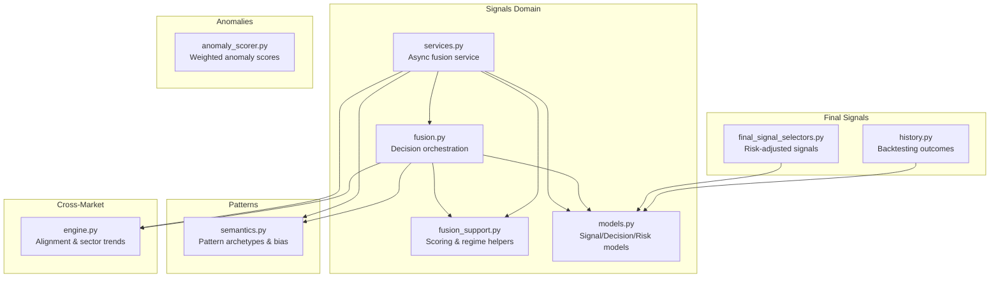
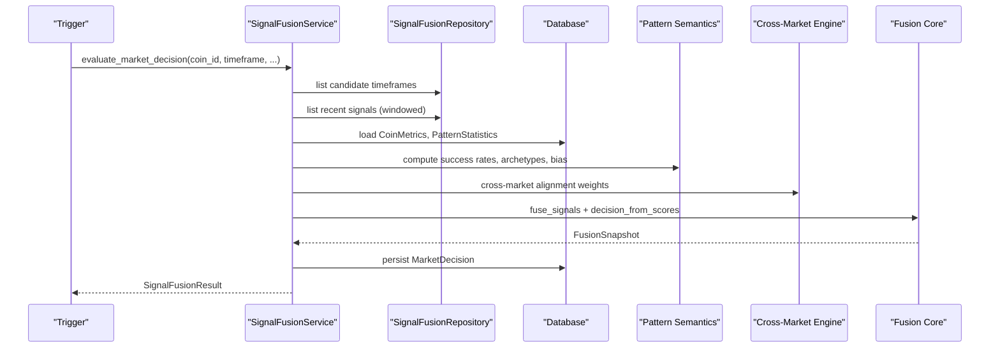
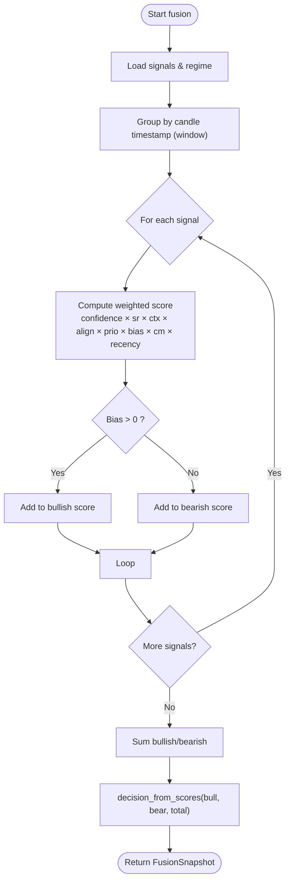
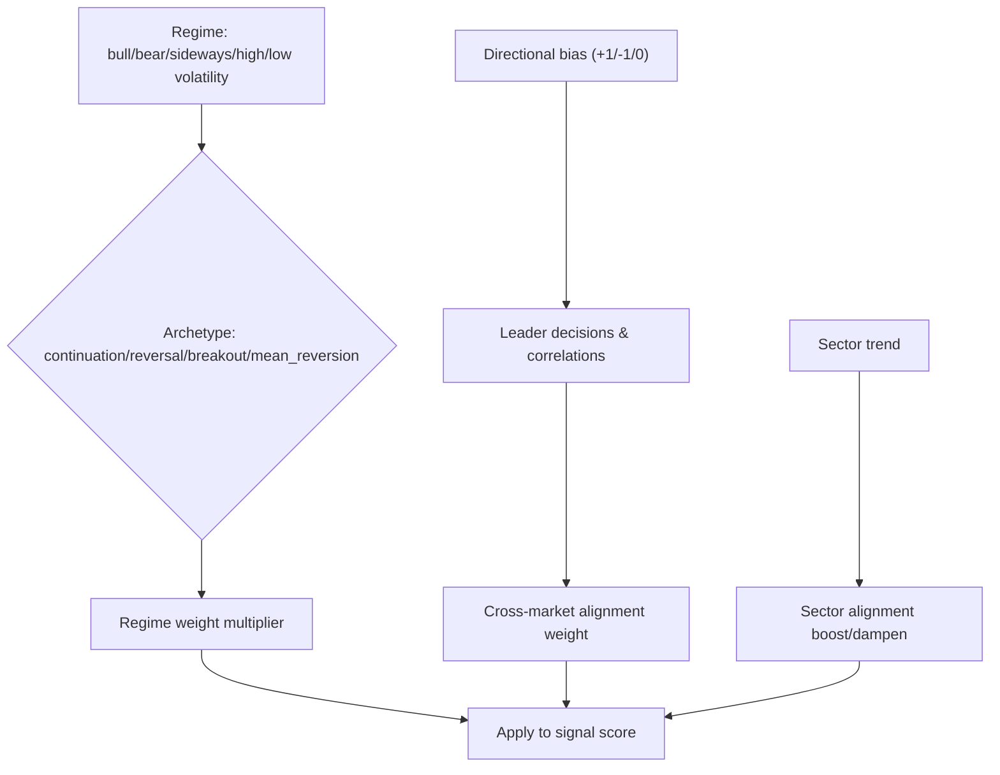
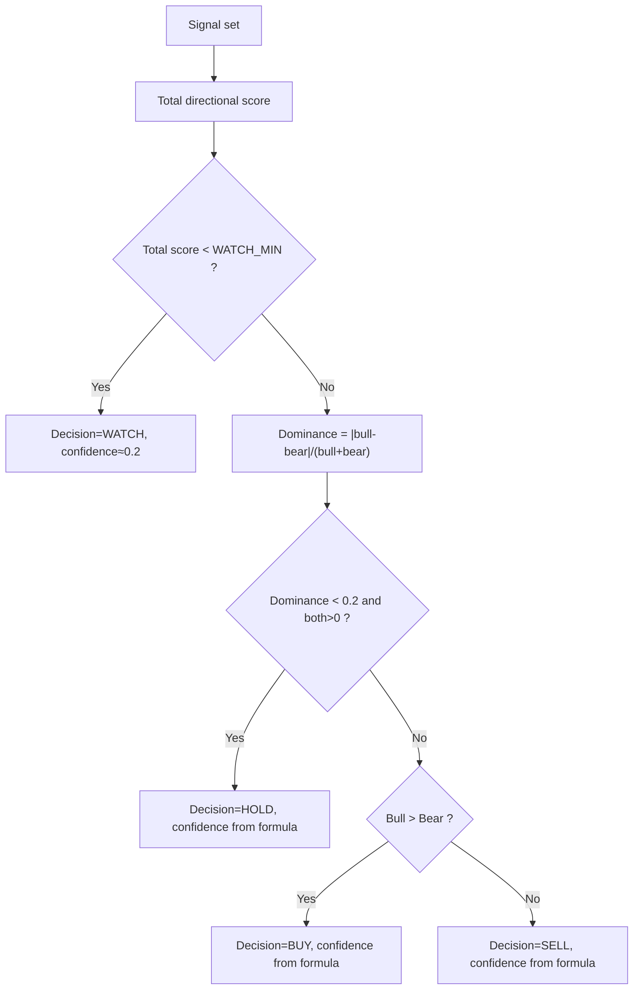
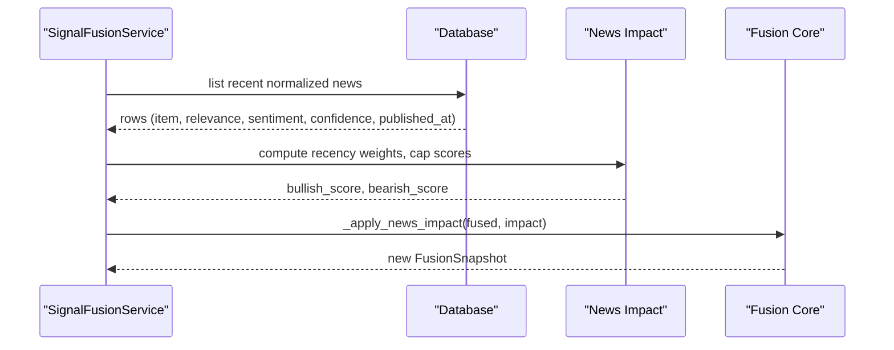
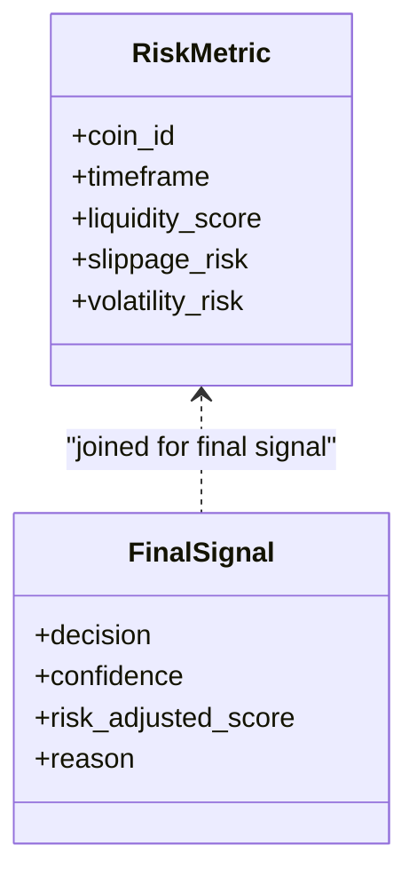
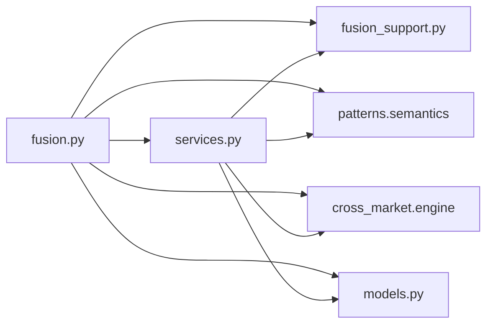

# Signal Fusion Algorithms

<cite>
**Referenced Files in This Document**
- [fusion.py](file://src/apps/signals/fusion.py)
- [fusion_support.py](file://src/apps/signals/fusion_support.py)
- [services.py](file://src/apps/signals/services.py)
- [models.py](file://src/apps/signals/models.py)
- [semantics.py](file://src/apps/patterns/domain/semantics.py)
- [engine.py](file://src/apps/cross_market/engine.py)
- [anomaly_scorer.py](file://src/apps/anomalies/scoring/anomaly_scorer.py)
- [final_signal_selectors.py](file://src/apps/signals/final_signal_selectors.py)
- [history.py](file://src/apps/signals/history.py)
- [test_conflict.py](file://tests/apps/signals/test_conflict.py)
</cite>

## Table of Contents
1. [Introduction](#introduction)
2. [Project Structure](#project-structure)
3. [Core Components](#core-components)
4. [Architecture Overview](#architecture-overview)
5. [Detailed Component Analysis](#detailed-component-analysis)
6. [Dependency Analysis](#dependency-analysis)
7. [Performance Considerations](#performance-considerations)
8. [Troubleshooting Guide](#troubleshooting-guide)
9. [Conclusion](#conclusion)

## Introduction
This document explains the signal fusion algorithms that combine multi-source signals (patterns, anomalies, indicators, and news) into coherent market decisions. It covers weighted averaging, voting systems, adaptive fusion, conflict resolution, priority scoring, and risk-adjusted signal generation. It also documents the mathematical foundations (probability, Bayesian-like weighting, and ensemble-style aggregation) and provides practical examples of how conflicting signals are resolved systematically.

## Project Structure
The signal fusion subsystem is centered around:
- Fusion orchestration and decision generation
- Support utilities for scoring, regime-aware weighting, and news impact
- Services that implement the fusion logic asynchronously
- Models representing signals, decisions, and risk metrics
- Cross-market alignment and sector trend integration
- Pattern semantics and anomaly scoring for heterogeneous sources

**Diagram sources**
- [fusion.py:1-457](file://src/apps/signals/fusion.py#L1-L457)
- [fusion_support.py:1-206](file://src/apps/signals/fusion_support.py#L1-L206)
- [services.py:1-849](file://src/apps/signals/services.py#L1-L849)
- [models.py:1-237](file://src/apps/signals/models.py#L1-L237)
- [semantics.py:1-134](file://src/apps/patterns/domain/semantics.py#L1-L134)
- [engine.py:1-495](file://src/apps/cross_market/engine.py#L1-L495)
- [anomaly_scorer.py:1-39](file://src/apps/anomalies/scoring/anomaly_scorer.py#L1-L39)
- [final_signal_selectors.py:1-281](file://src/apps/signals/final_signal_selectors.py#L1-L281)
- [history.py:1-270](file://src/apps/signals/history.py#L1-L270)

**Section sources**
- [fusion.py:1-457](file://src/apps/signals/fusion.py#L1-L457)
- [fusion_support.py:1-206](file://src/apps/signals/fusion_support.py#L1-L206)
- [services.py:1-849](file://src/apps/signals/services.py#L1-L849)
- [models.py:1-237](file://src/apps/signals/models.py#L1-L237)
- [semantics.py:1-134](file://src/apps/patterns/domain/semantics.py#L1-L134)
- [engine.py:1-495](file://src/apps/cross_market/engine.py#L1-L495)
- [anomaly_scorer.py:1-39](file://src/apps/anomalies/scoring/anomaly_scorer.py#L1-L39)
- [final_signal_selectors.py:1-281](file://src/apps/signals/final_signal_selectors.py#L1-L281)
- [history.py:1-270](file://src/apps/signals/history.py#L1-L270)

## Core Components
- Weighted signal scoring: combines confidence, success rate, context, regime alignment, priority, recency, and cross-market alignment into a per-signal score.
- Ensemble-style fusion: sums bullish/bearish weighted scores, derives decision via dominance/agreement thresholds, and computes confidence.
- News impact fusion: aggregates sentiment-weighted news items into bullish/bearish scores and re-computes decision/confidence.
- Adaptive regime weighting: adjusts signal weights depending on detected market regime and pattern archetype.
- Conflict resolution: when opposing signals are strong and balanced, decision may default to HOLD or WATCH based on thresholds.
- Risk-adjusted final signals: produce a final recommendation incorporating liquidity, slippage, and volatility risks.

Key parameters and limits:
- Signal windowing: up to a fixed number of candle groups and recent signals.
- News window: timeframe-dependent lookback with capped items and score.
- Materiality thresholds: minimum total score and confidence delta to emit changes.

**Section sources**
- [fusion.py:50-125](file://src/apps/signals/fusion.py#L50-L125)
- [fusion_support.py:11-17](file://src/apps/signals/fusion_support.py#L11-L17)
- [services.py:575-645](file://src/apps/signals/services.py#L575-L645)

## Architecture Overview
The fusion pipeline integrates multiple sources and applies adaptive weighting and conflict resolution.

**Diagram sources**
- [services.py:235-417](file://src/apps/signals/services.py#L235-L417)
- [fusion.py:290-322](file://src/apps/signals/fusion.py#L290-L322)
- [semantics.py:106-134](file://src/apps/patterns/domain/semantics.py#L106-L134)
- [engine.py:446-494](file://src/apps/cross_market/engine.py#L446-L494)

## Detailed Component Analysis

### Weighted Signal Scoring and Ensemble Fusion
- Inputs per signal:
  - Confidence: raw signal strength
  - Success rate: historical pattern accuracy by regime
  - Context factor: contextual score
  - Regime alignment: alignment with detected regime
  - Priority factor: explicit priority vs confidence
  - Directional bias: derived from pattern slug or price delta
  - Cross-market factor: alignment with leaders/sector
  - Recency weight: decays older signals
- Aggregation:
  - Sum bullish and bearish weighted scores
  - Decision derived from dominance/agreement thresholds
  - Confidence computed from dominance and totals

**Diagram sources**
- [fusion.py:209-241](file://src/apps/signals/fusion.py#L209-L241)
- [services.py:585-645](file://src/apps/signals/services.py#L585-L645)
- [fusion_support.py:146-157](file://src/apps/signals/fusion_support.py#L146-L157)

**Section sources**
- [fusion.py:97-125](file://src/apps/signals/fusion.py#L97-L125)
- [services.py:585-645](file://src/apps/signals/services.py#L585-L645)
- [fusion_support.py:146-157](file://src/apps/signals/fusion_support.py#L146-L157)

### Adaptive Regime Weighting and Cross-Market Alignment
- Regime weight depends on pattern archetype and detected regime.
- Cross-market alignment weight increases/decreases based on leading coins’ decisions and sector trend.

**Diagram sources**
- [fusion_support.py:114-143](file://src/apps/signals/fusion_support.py#L114-L143)
- [engine.py:446-494](file://src/apps/cross_market/engine.py#L446-L494)

**Section sources**
- [fusion_support.py:114-143](file://src/apps/signals/fusion_support.py#L114-L143)
- [engine.py:446-494](file://src/apps/cross_market/engine.py#L446-L494)

### Conflict Resolution and Priority Scoring
- When both sides are strong and balanced, decision defaults to HOLD.
- WATCH is applied when total score is below threshold.
- Priority score and confidence are merged into a priority factor.

**Diagram sources**
- [fusion_support.py:146-157](file://src/apps/signals/fusion_support.py#L146-L157)

**Section sources**
- [fusion_support.py:146-157](file://src/apps/signals/fusion_support.py#L146-L157)
- [test_conflict.py:9-42](file://tests/apps/signals/test_conflict.py#L9-L42)

### News Impact Fusion
- Recent news items are scored by relevance, confidence, and recency.
- Sentiment is aggregated into bullish/bearish scores and capped.
- Fusion result is recomputed with combined scores.

**Diagram sources**
- [services.py:530-573](file://src/apps/signals/services.py#L530-L573)
- [fusion.py:138-196](file://src/apps/signals/fusion.py#L138-L196)
- [fusion_support.py:160-187](file://src/apps/signals/fusion_support.py#L160-L187)

**Section sources**
- [services.py:530-573](file://src/apps/signals/services.py#L530-L573)
- [fusion.py:138-196](file://src/apps/signals/fusion.py#L138-L196)
- [fusion_support.py:160-187](file://src/apps/signals/fusion_support.py#L160-L187)

### Risk-Adjusted Signal Generation
- Final signals incorporate risk metrics (liquidity, slippage, volatility) and a risk-adjusted score.
- Decisions are canonicalized across timeframes and enriched with sector and reason metadata.

**Diagram sources**
- [models.py:151-165](file://src/apps/signals/models.py#L151-L165)
- [models.py:83-103](file://src/apps/signals/models.py#L83-L103)
- [final_signal_selectors.py:46-76](file://src/apps/signals/final_signal_selectors.py#L46-L76)

**Section sources**
- [models.py:151-165](file://src/apps/signals/models.py#L151-L165)
- [models.py:83-103](file://src/apps/signals/models.py#L83-L103)
- [final_signal_selectors.py:46-76](file://src/apps/signals/final_signal_selectors.py#L46-L76)

### Mathematical Foundations
- Weighted averaging: each signal contributes a score proportional to confidence and derived weights.
- Voting system: bullish/bearish sides compete; dominance/agreement thresholds decide outcome.
- Adaptive fusion: regime/archetype-aware weights and cross-market alignment dynamically adjust influence.
- Risk-adjusted generation: final recommendation balances expected return against risk metrics.

**Section sources**
- [fusion.py:209-241](file://src/apps/signals/fusion.py#L209-L241)
- [services.py:585-645](file://src/apps/signals/services.py#L585-L645)
- [fusion_support.py:146-157](file://src/apps/signals/fusion_support.py#L146-L157)

### Implementation of Different Fusion Strategies
- Pattern signals: derive bias and success rate from pattern slug; regime/archetype weighting applied.
- Anomaly signals: weighted anomaly scoring (detector weights, severity bands, confidence blending).
- Indicator signals: context scores, regime alignment, and priority scores integrated.
- News signals: sentiment-relevance-confidence-weighted aggregation.

Parameters and characteristics:
- Windowing: bounded by candle groups and signal count.
- Lookbacks: news lookback varies by timeframe.
- Clamping: all weights and scores constrained to safe ranges.
- Materiality: minimal confidence delta determines emission of unchanged decisions.

**Section sources**
- [fusion.py:50-68](file://src/apps/signals/fusion.py#L50-L68)
- [services.py:443-460](file://src/apps/signals/services.py#L443-L460)
- [anomaly_scorer.py:23-38](file://src/apps/anomalies/scoring/anomaly_scorer.py#L23-L38)

### Practical Examples of Signal Combinations
- Example: Conflicting pattern signals (e.g., breakout and reversal) at the same candle timestamp lead to balanced scores and a HOLD decision when dominance is low.
- Example: Mixed bullish/bearish pattern signals with moderate total score yield WATCH until sufficient conviction builds.
- Example: Strong cross-market alignment boosts signal weights, shifting decision toward consensus.

Validation:
- Unit test demonstrates conflicting stack resolves to HOLD with material confidence.

**Section sources**
- [test_conflict.py:9-42](file://tests/apps/signals/test_conflict.py#L9-L42)

## Dependency Analysis
- Fusion core depends on:
  - Pattern semantics for slug-to-bias mapping and archetypes
  - Cross-market engine for leader/sector alignment weights
  - Models for signals, decisions, and risk metrics
  - Services for asynchronous orchestration and repository access

**Diagram sources**
- [fusion.py:1-457](file://src/apps/signals/fusion.py#L1-L457)
- [services.py:1-849](file://src/apps/signals/services.py#L1-L849)
- [fusion_support.py:1-206](file://src/apps/signals/fusion_support.py#L1-L206)
- [models.py:1-237](file://src/apps/signals/models.py#L1-L237)
- [semantics.py:1-134](file://src/apps/patterns/domain/semantics.py#L1-L134)
- [engine.py:1-495](file://src/apps/cross_market/engine.py#L1-L495)

**Section sources**
- [fusion.py:1-457](file://src/apps/signals/fusion.py#L1-L457)
- [services.py:1-849](file://src/apps/signals/services.py#L1-L849)
- [fusion_support.py:1-206](file://src/apps/signals/fusion_support.py#L1-L206)
- [models.py:1-237](file://src/apps/signals/models.py#L1-L237)
- [semantics.py:1-134](file://src/apps/patterns/domain/semantics.py#L1-L134)
- [engine.py:1-495](file://src/apps/cross_market/engine.py#L1-L495)

## Performance Considerations
- Windowing reduces computational load by limiting recent candles and signal counts.
- Asynchronous service minimizes latency in production environments.
- Clamping avoids extreme weights and stabilizes numerical behavior.
- Caching of cross-market correlations reduces repeated heavy computations.

## Troubleshooting Guide
Common issues and resolutions:
- No signals found: fusion skips and returns appropriate reason.
- Unchanged decision: if decision, signal count, and confidence change below material delta, skip emission and cache latest.
- Insufficient news: if no normalized news items, news impact is ignored.
- Pattern statistics missing: fallback success rates applied for cluster/hierarchy and generic patterns.

Operational logs:
- Compatibility shims log deprecated calls with mode and reasons.
- Service logs debug/info for skipped/ok results and emitted events.

**Section sources**
- [fusion.py:306-350](file://src/apps/signals/fusion.py#L306-L350)
- [services.py:256-355](file://src/apps/signals/services.py#L256-L355)
- [history.py:82-186](file://src/apps/signals/history.py#L82-L186)

## Conclusion
The signal fusion system combines heterogeneous sources using weighted averaging and ensemble-style decision-making, with adaptive regime and cross-market adjustments. Conflict resolution favors HOLD when signals are evenly matched, and risk-adjusted final signals incorporate liquidity and volatility. Parameters and thresholds ensure robustness and stability across varying market conditions.